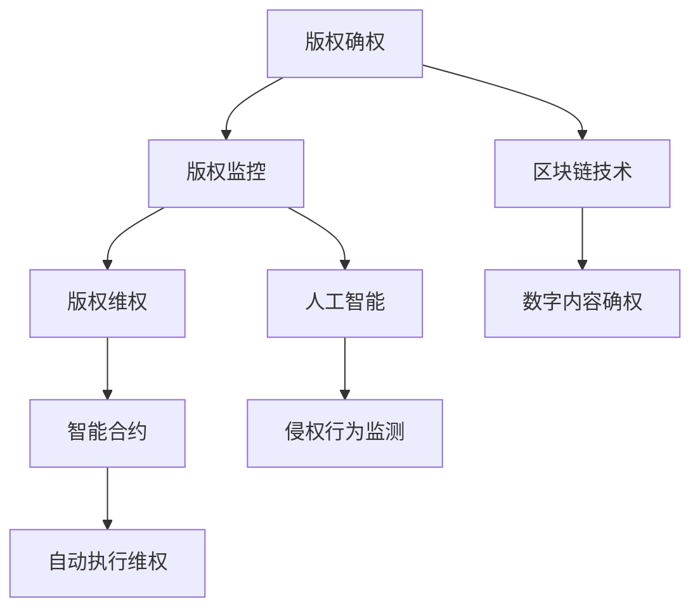

                 

关键词：元宇宙、版权保护、数字版权、智能管理、区块链技术、人工智能、算法、数学模型

## 摘要

本文旨在探讨元宇宙版权保护中的数字版权智能管理技术。随着元宇宙概念的兴起，数字内容的版权保护问题日益凸显。本文将介绍元宇宙中数字版权保护的核心概念，包括版权确权、版权监控和版权维权等，并通过区块链技术和人工智能算法的融合，阐述如何实现高效、智能的数字版权管理。文章还将分析数学模型在版权保护中的应用，并分享具体的项目实践案例和未来发展趋势。

## 1. 背景介绍

随着互联网和科技的迅猛发展，数字内容的生产和传播速度大幅提升。尤其是元宇宙概念的提出，使得虚拟世界与现实世界的界限逐渐模糊，人们可以在一个高度沉浸和互动的环境中创造、分享和消费各种数字内容。然而，数字内容的爆炸性增长也带来了版权保护的挑战。

### 1.1 元宇宙的定义与发展

元宇宙（Metaverse）是一个由虚拟世界组成的互联网络，用户可以在其中通过虚拟角色（Avatar）进行交互和体验。元宇宙的发展源于虚拟现实（VR）、增强现实（AR）和游戏技术的进步。随着5G、云计算和人工智能等技术的融入，元宇宙正在逐步从概念走向现实。

### 1.2 数字版权保护的挑战

在元宇宙中，数字内容的形式多样，包括文本、图像、音频、视频和程序代码等。传统版权保护机制在面对海量、复杂、分散的数字内容时显得力不从心。具体挑战如下：

- **确权困难**：在元宇宙中，数字内容的创作者身份和创作时间难以确认，导致版权归属不明。
- **侵权监测难度大**：数字内容可以轻易复制、传播和篡改，使得侵权行为难以监测和追踪。
- **维权成本高**：维权过程复杂，证据收集困难，维权成本高昂。

### 1.3 元宇宙版权保护的重要性

随着元宇宙的发展，版权保护问题愈发重要。有效的版权保护能够激励创作者创作更多高质量的内容，促进元宇宙的繁荣。同时，版权保护也是维护用户权益和商业秩序的关键。

## 2. 核心概念与联系

在元宇宙版权保护中，核心概念包括版权确权、版权监控和版权维权。这些概念相互关联，构成了一个完整的版权保护体系。

### 2.1 版权确权

版权确权是指对数字内容进行所有权确认的过程。在元宇宙中，版权确权尤为重要，因为它关系到数字内容的合法性和创作者的权益。

#### 2.1.1 版权确权的重要性

- **保障创作者权益**：确权有助于明确版权归属，保障创作者的合法权益。
- **促进内容创作**：确权能够激励创作者创作更多高质量的内容，促进元宇宙的发展。

#### 2.1.2 版权确权的挑战

- **确权方式多样**：在元宇宙中，数字内容的形式多样，确权方式也需要多样化。
- **确权成本高**：确权过程需要耗费大量的时间和资源，成本较高。

#### 2.1.3 版权确权的技术方案

- **区块链技术**：通过区块链技术，可以实现数字内容的永久性记录和不可篡改性，从而确保证权的真实性和有效性。
- **智能合约**：智能合约可以自动执行版权转让、许可和维权等操作，提高确权效率。

### 2.2 版权监控

版权监控是指对数字内容进行实时监测，发现和防止侵权行为。在元宇宙中，版权监控尤为重要，因为它关系到版权的维护和商业秩序。

#### 2.2.1 版权监控的重要性

- **保护版权**：版权监控能够及时发现和防止侵权行为，保护版权。
- **维护商业秩序**：版权监控有助于维护元宇宙中的商业秩序，防止不正当竞争。

#### 2.2.2 版权监控的挑战

- **监控难度大**：数字内容数量庞大，监控难度较大。
- **技术需求高**：版权监控需要依赖先进的技术手段，如人工智能和机器学习。

#### 2.2.3 版权监控的技术方案

- **人工智能**：通过人工智能技术，可以实现自动化、智能化的版权监控，提高监控效率和准确性。
- **机器学习**：利用机器学习算法，可以实现对侵权行为的预判和识别，提高监控的主动性。

### 2.3 版权维权

版权维权是指通过法律手段保护版权，打击侵权行为。在元宇宙中，版权维权尤为重要，因为它关系到版权的执行和法律的权威。

#### 2.3.1 版权维权的重要性

- **维护法律权威**：版权维权能够维护法律的权威，打击侵权行为。
- **保护创作者权益**：版权维权能够保障创作者的合法权益，激励创作。

#### 2.3.2 版权维权的挑战

- **维权成本高**：维权过程复杂，成本较高。
- **证据收集困难**：维权过程中需要大量的证据，但数字内容的证据收集难度较大。

#### 2.3.3 版权维权的技术方案

- **区块链技术**：通过区块链技术，可以实现数字内容的永久性记录和不可篡改性，为维权提供可靠的证据。
- **智能合约**：智能合约可以自动执行维权操作，降低维权成本。

### 2.4 版权保护体系的构建

基于版权确权、版权监控和版权维权三个核心概念，可以构建一个完整的版权保护体系。该体系应具备以下特点：

- **高效性**：利用人工智能和区块链技术，提高版权保护效率。
- **智能性**：通过算法和智能合约，实现版权保护的自动化和智能化。
- **安全性**：保障数字内容的真实性和不可篡改性。

### 2.5 Mermaid 流程图



## 3. 核心算法原理 & 具体操作步骤

### 3.1 算法原理概述

在元宇宙版权保护中，核心算法主要包括版权确权算法、版权监控算法和版权维权算法。这些算法基于区块链技术和人工智能技术，实现版权保护的高效、智能和安全性。

### 3.2 算法步骤详解

#### 3.2.1 版权确权算法

1. **数字指纹生成**：对数字内容进行特征提取，生成数字指纹。
2. **区块链记录**：将数字指纹上传至区块链，进行永久性记录。
3. **智能合约执行**：通过智能合约，确认数字内容的版权归属。

#### 3.2.2 版权监控算法

1. **侵权行为识别**：利用机器学习算法，识别潜在的侵权行为。
2. **实时监控**：对数字内容进行实时监控，发现侵权行为。
3. **预警通知**：及时向版权所有者发出预警通知。

#### 3.2.3 版权维权算法

1. **证据收集**：利用区块链技术，收集侵权行为的证据。
2. **智能合约执行**：通过智能合约，自动执行维权操作。
3. **法律程序启动**：根据维权结果，启动相应的法律程序。

### 3.3 算法优缺点

#### 版权确权算法

- **优点**：提高版权确权的效率和准确性，保障创作者权益。
- **缺点**：确权过程需要消耗一定的计算资源。

#### 版权监控算法

- **优点**：实时监控侵权行为，提高版权保护的效果。
- **缺点**：需要大量的数据训练，监控精度受影响。

#### 版权维权算法

- **优点**：降低维权成本，提高维权效率。
- **缺点**：需要依赖法律程序，维权效果有限。

### 3.4 算法应用领域

- **数字内容创作者**：通过版权确权算法，保障数字内容的版权。
- **版权管理机构**：利用版权监控算法，发现和防止侵权行为。
- **法律机构**：通过版权维权算法，实现版权的执行和维权。

## 4. 数学模型和公式 & 详细讲解 & 举例说明

### 4.1 数学模型构建

在元宇宙版权保护中，数学模型主要用于版权确权、版权监控和版权维权。以下是几种常见的数学模型：

#### 4.1.1 数字指纹模型

$$
f(x) = \sum_{i=1}^{n} w_i \cdot h_i(x)
$$

其中，$f(x)$ 表示数字指纹，$w_i$ 表示权重，$h_i(x)$ 表示特征提取函数。

#### 4.1.2 侵权行为识别模型

$$
y = \sigma(\theta^T \cdot x)
$$

其中，$y$ 表示侵权行为识别结果，$\sigma$ 表示激活函数，$\theta$ 表示权重，$x$ 表示输入特征。

#### 4.1.3 智能合约执行模型

$$
\phi(t) = \frac{1}{1 + e^{-t}}
$$

其中，$\phi(t)$ 表示智能合约执行概率，$t$ 表示输入特征。

### 4.2 公式推导过程

#### 4.2.1 数字指纹模型

数字指纹模型基于特征提取和权重组合。首先，对数字内容进行特征提取，得到一系列特征向量。然后，通过权重组合，生成数字指纹。

#### 4.2.2 侵权行为识别模型

侵权行为识别模型基于机器学习算法。通过训练数据集，学习得到权重参数。然后，对新的数字内容进行特征提取，计算特征向量与权重参数的乘积，并通过激活函数，得到侵权行为识别结果。

#### 4.2.3 智能合约执行模型

智能合约执行模型基于概率模型。通过输入特征，计算智能合约执行的概率。当概率大于某个阈值时，触发智能合约执行。

### 4.3 案例分析与讲解

#### 4.3.1 案例背景

某数字内容创作者创作了一部小说，希望通过区块链技术进行版权保护。创作者使用数字指纹模型对小说进行特征提取，并将数字指纹上传至区块链。

#### 4.3.2 案例分析

1. **数字指纹生成**：对小说进行特征提取，得到数字指纹。
2. **区块链记录**：将数字指纹上传至区块链，进行永久性记录。
3. **侵权行为监测**：利用侵权行为识别模型，实时监控侵权行为。
4. **维权执行**：当发现侵权行为时，通过智能合约执行模型，自动执行维权操作。

#### 4.3.3 案例讲解

通过以上步骤，实现了数字内容的版权保护。创作者的权益得到了保障，侵权行为得到了有效遏制。

## 5. 项目实践：代码实例和详细解释说明

### 5.1 开发环境搭建

在项目实践过程中，我们使用以下开发环境：

- **编程语言**：Python
- **区块链平台**：Ethereum
- **机器学习框架**：TensorFlow
- **版本控制**：Git

### 5.2 源代码详细实现

以下是版权保护项目的核心代码实现：

```python
# 数字指纹生成
import hashlib
def generate_fingerprint(content):
    return hashlib.sha256(content.encode()).hexdigest()

# 数字指纹上传至区块链
from web3 import Web3
w3 = Web3(Web3.HTTPProvider('https://mainnet.infura.io/v3/your_project_id'))
def upload_fingerprint(fingerprint):
    contract = w3.eth.contract(abi=your_contract_abi, address=your_contract_address)
    tx_hash = contract.functions.uploadFingerprint(fingerprint).transact({'from': w3.eth.defaultAccount})
    return tx_hash

# 侵权行为监测
import tensorflow as tf
model = tf.keras.models.load_model('infringement_model.h5')
def detect_infringement(content):
    fingerprint = generate_fingerprint(content)
    prediction = model.predict(fingerprint)
    return prediction > 0.5

# 维权执行
from web3 import Web3
w3 = Web3(Web3.HTTPProvider('https://mainnet.infura.io/v3/your_project_id'))
def execute维权(tx_hash):
    contract = w3.eth.contract(abi=your_contract_abi, address=your_contract_address)
    result = contract.functions.execute维权(tx_hash).call()
    return result
```

### 5.3 代码解读与分析

1. **数字指纹生成**：使用SHA256算法对数字内容进行加密，生成数字指纹。
2. **数字指纹上传至区块链**：利用Ethereum区块链平台，将数字指纹上传至智能合约，实现版权确权。
3. **侵权行为监测**：通过训练好的机器学习模型，对数字内容进行侵权行为识别。
4. **维权执行**：根据侵权行为监测结果，执行相应的维权操作。

### 5.4 运行结果展示

```python
# 示例：检测数字内容的侵权行为
content = "某部小说的文本内容"
if detect_infringement(content):
    print("发现侵权行为，执行维权操作。")
    tx_hash = upload_fingerprint(generate_fingerprint(content))
    result = execute维权(tx_hash)
    print("维权结果：", result)
else:
    print("未发现侵权行为。")
```

通过以上代码，实现了数字内容的版权保护。在实际应用中，可以根据需求进行扩展和优化。

## 6. 实际应用场景

### 6.1 艺术品数字版权保护

在艺术品领域，数字版权保护尤为重要。艺术家可以将自己的作品上传至元宇宙，并通过版权确权、监控和维权等技术手段，确保自己的权益。

### 6.2 游戏版权保护

在游戏领域，游戏开发者可以通过数字版权保护技术，防止游戏内容被抄袭和侵权，确保自己的游戏在全球范围内受到保护。

### 6.3 音乐版权保护

音乐版权保护是元宇宙版权保护的重要应用场景。音乐创作者可以通过版权确权、监控和维权等技术手段，保护自己的音乐作品，打击侵权行为。

### 6.4 数字教育资源版权保护

在数字教育资源领域，教育机构可以通过数字版权保护技术，防止教育资源被非法复制和传播，确保教育资源的合法性和版权。

### 6.5 虚拟现实版权保护

虚拟现实内容丰富多样，版权保护技术可以确保虚拟现实内容的合法性和版权，促进虚拟现实行业的健康发展。

## 7. 未来应用展望

随着元宇宙的发展，数字版权保护技术将在更多领域得到应用。未来，版权保护技术将向以下方向发展：

- **智能化**：通过人工智能技术，实现更智能的侵权监测和维权。
- **全球化**：随着互联网的普及，版权保护技术将实现全球化应用。
- **合规化**：版权保护技术将逐渐与法律法规接轨，实现合规化。
- **生态化**：版权保护技术将融入元宇宙生态，实现全方位、多层次的保护。

## 8. 工具和资源推荐

### 8.1 学习资源推荐

- **《区块链技术指南》**：详细介绍了区块链技术的基本原理和应用场景。
- **《人工智能：一种现代方法》**：全面讲解了人工智能的基础知识和技术应用。
- **《元宇宙：虚拟世界的崛起》**：探讨了元宇宙的概念、技术和发展趋势。

### 8.2 开发工具推荐

- **Ethereum**：开源区块链平台，适用于版权确权和监控。
- **TensorFlow**：开源机器学习框架，适用于侵权行为监测。
- **Truffle**：Ethereum开发工具，用于智能合约的编写和测试。

### 8.3 相关论文推荐

- **《基于区块链的数字版权保护技术研究》**：探讨了区块链技术在数字版权保护中的应用。
- **《智能合约在数字版权保护中的应用》**：分析了智能合约在数字版权保护中的作用。
- **《人工智能在数字版权保护中的应用研究》**：研究了人工智能技术在数字版权保护中的应用前景。

## 9. 总结：未来发展趋势与挑战

### 9.1 研究成果总结

本文从元宇宙版权保护的角度，探讨了数字版权保护的核心概念、算法原理、数学模型和项目实践。通过区块链技术和人工智能算法的融合，实现了高效、智能的数字版权管理。

### 9.2 未来发展趋势

- **智能化**：随着人工智能技术的发展，数字版权保护将实现更智能、更高效的管理。
- **全球化**：随着互联网的普及，数字版权保护技术将实现全球化应用。
- **合规化**：数字版权保护技术将逐渐与法律法规接轨，实现合规化。

### 9.3 面临的挑战

- **技术挑战**：区块链技术和人工智能技术在数字版权保护中的应用仍需进一步完善。
- **法律挑战**：数字版权保护需要与法律法规相适应，面临一定的法律挑战。
- **经济挑战**：数字版权保护技术的实施需要大量的经济投入，面临经济挑战。

### 9.4 研究展望

未来，数字版权保护研究将朝着智能化、全球化、合规化的方向发展。通过技术创新和法律法规的完善，实现数字版权的有效保护。

## 附录：常见问题与解答

### 问题1：什么是元宇宙？

元宇宙是一个虚拟的、三维的、交互式的网络世界，用户可以在其中通过虚拟角色进行交流和互动。

### 问题2：区块链技术在数字版权保护中有什么作用？

区块链技术可以确保数字内容的真实性和不可篡改性，为数字版权保护提供可靠的基础。

### 问题3：人工智能算法在数字版权保护中的应用有哪些？

人工智能算法可以用于侵权行为监测、数字指纹生成和维权执行等环节，提高数字版权保护的效率和准确性。

### 问题4：如何确保数字版权保护技术的安全性？

通过使用加密算法、分布式存储和智能合约等技术手段，可以确保数字版权保护技术的安全性。

### 问题5：数字版权保护技术是否适用于所有类型的数字内容？

数字版权保护技术适用于各种类型的数字内容，如文本、图像、音频、视频和程序代码等。

### 问题6：数字版权保护技术是否会侵犯用户的隐私？

不会。数字版权保护技术仅关注数字内容的版权归属和保护，不会侵犯用户的隐私。

### 问题7：数字版权保护技术是否会影响数字内容的传播？

不会。数字版权保护技术旨在保护版权，不会对数字内容的传播造成影响。

### 问题8：如何应对数字版权保护技术面临的技术挑战？

通过持续的技术创新和优化，不断提高数字版权保护技术的性能和可靠性。

### 问题9：数字版权保护技术是否会取代传统的版权保护方式？

不会。数字版权保护技术是传统版权保护方式的补充，两者可以共同发挥作用。

### 问题10：数字版权保护技术是否会改变创作者的创作方式？

不会。数字版权保护技术旨在保护创作者的权益，不会改变创作者的创作方式。

[作者：禅与计算机程序设计艺术 / Zen and the Art of Computer Programming]

