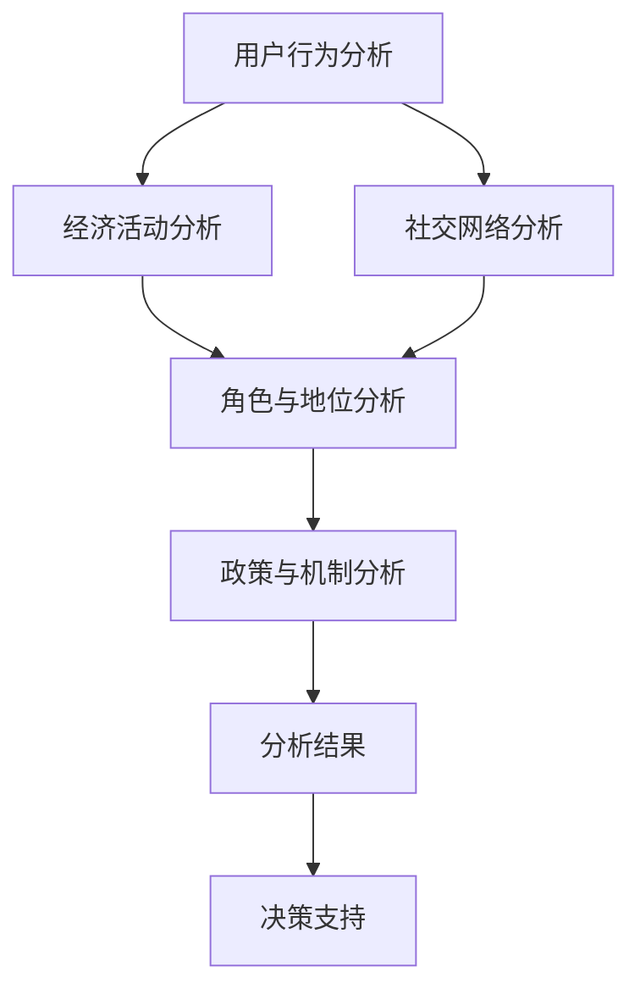

                 

关键词：元宇宙、社会流动性、虚拟社会结构、动态分析、人工智能、虚拟现实、技术进步

## 摘要

本文探讨了元宇宙社会流动性研究中心的成立背景及其在虚拟社会结构动态分析方面的重要性。随着虚拟现实和人工智能技术的迅猛发展，元宇宙逐渐成为人们探索的新领域。然而，如何在元宇宙中实现公平、高效的社会流动性，成为了一个亟待解决的问题。本文首先介绍了元宇宙的概念和特点，随后阐述了社会流动性在元宇宙中的意义。接着，我们深入探讨了虚拟社会结构的动态分析方法，包括核心概念、算法原理和应用领域。此外，本文还通过数学模型和实际项目案例，展示了如何运用这些方法解决实际问题。最后，本文对未来元宇宙社会流动性的发展前景和应用领域进行了展望。

## 1. 背景介绍

### 元宇宙的崛起

随着互联网技术的不断进步，虚拟现实（VR）和增强现实（AR）技术逐渐成熟，元宇宙这一概念逐渐进入人们的视野。元宇宙，又称为“元界”或“虚拟宇宙”，是一个由多个虚拟世界和现实世界交织的、高度沉浸式的虚拟空间。在这个空间中，人们可以以虚拟角色（Avatar）的身份进行互动，享受丰富的社交、娱乐、教育、工作和购物体验。

元宇宙的发展离不开以下几个关键因素：

1. **硬件设备**：VR头盔、AR眼镜等硬件设备的性能不断提升，使得用户能够更真实地体验虚拟世界。
2. **网络技术**：5G、云计算和物联网等技术的普及，为元宇宙的实时通信和数据传输提供了基础。
3. **内容创造**：大量的虚拟内容创作者（Content Creators）和开发团队，为元宇宙提供了丰富的虚拟场景和体验。
4. **用户需求**：随着人们对数字化生活方式的追求，元宇宙成为了一个充满吸引力的新兴领域。

### 社会流动性在元宇宙中的重要性

在现实世界中，社会流动性是指人们在经济、教育、职业和社会地位等方面的变化。而在元宇宙中，社会流动性则涉及到用户在虚拟世界中的角色、财富、技能和地位的变动。社会流动性在元宇宙中的重要性体现在以下几个方面：

1. **经济价值**：元宇宙中的虚拟资产（如虚拟货币、虚拟地产等）具有很高的价值，用户可以通过参与元宇宙的经济活动实现财富积累。
2. **教育机会**：元宇宙提供了丰富的虚拟教育资源，用户可以通过虚拟课程和培训提升自己的技能和知识。
3. **职业发展**：元宇宙中的虚拟职业和虚拟企业为用户提供了广阔的职业发展空间，用户可以根据自己的兴趣和才能选择合适的职业。
4. **社会地位**：在元宇宙中，用户的角色和财富可以直接反映其社会地位，这有助于形成新的社会阶层和社交网络。

### 元宇宙社会流动性研究中心的成立背景

为了更好地研究元宇宙中的社会流动性问题，并探索有效的解决方案，元宇宙社会流动性研究中心应运而生。该研究中心的主要目标包括：

1. **研究虚拟社会结构的动态变化**：通过分析元宇宙中的用户行为、经济活动和社交网络，研究虚拟社会结构的演变规律。
2. **开发核心算法和技术**：结合人工智能、数据挖掘和机器学习等技术，开发用于分析虚拟社会流动性的核心算法。
3. **提供决策支持**：为政府、企业和研究机构提供有关元宇宙社会流动性的决策支持，帮助他们制定合适的发展战略。
4. **促进社会公平**：通过研究和推广公平、高效的虚拟社会流动性机制，促进元宇宙中的社会公平。

## 2. 核心概念与联系

### 2.1 元宇宙的组成结构

元宇宙由多个虚拟世界和现实世界交织而成，其组成结构可以概括为以下几个方面：

1. **虚拟世界**：包括虚拟现实和增强现实技术构建的虚拟环境，用户可以通过VR头盔、AR眼镜等设备进入这些虚拟世界。
2. **数字孪生**：将现实世界中的实体对象、城市、建筑等进行数字化建模，生成其数字孪生体，以便在元宇宙中进行交互和操作。
3. **社交网络**：用户在元宇宙中的互动和交流形成了一个复杂的社交网络，用户之间的关系和动态变化是元宇宙社会流动性的重要组成部分。
4. **虚拟资产**：包括虚拟货币、虚拟地产、虚拟物品等，这些资产的价值和流动直接影响着用户的经济地位。

### 2.2 社会流动性分析框架

为了对元宇宙中的社会流动性进行深入分析，我们需要构建一个分析框架，包括以下几个关键要素：

1. **用户行为分析**：通过分析用户的访问记录、交易行为、参与活动等，了解用户在元宇宙中的行为模式。
2. **经济活动分析**：分析用户在元宇宙中的经济活动，包括虚拟资产的交易、投资和分配等，了解虚拟经济的运行机制。
3. **社交网络分析**：通过分析用户在元宇宙中的社交网络结构，了解用户之间的关系和动态变化。
4. **角色与地位分析**：分析用户在元宇宙中的角色和地位，了解用户在社会结构中的地位变化。
5. **政策与机制分析**：研究元宇宙中的政策和机制，了解这些政策对虚拟社会流动性产生的影响。

### 2.3 Mermaid 流程图

为了更好地展示元宇宙社会流动性分析的过程和关键环节，我们可以使用Mermaid流程图进行描述。以下是元宇宙社会流动性分析框架的Mermaid流程图：



### 2.4 核心概念联系与作用

通过上述分析框架，我们可以看到元宇宙社会流动性研究中心的核心概念之间紧密联系，共同作用于元宇宙中的社会流动性分析。具体来说：

1. **用户行为分析**：为后续的经济活动分析和社交网络分析提供了基础数据，有助于深入理解用户在元宇宙中的行为模式。
2. **经济活动分析**：为角色与地位分析提供了经济基础，有助于理解用户在元宇宙中的财富积累和消费行为。
3. **社交网络分析**：为角色与地位分析提供了社交关系和互动数据，有助于理解用户在社会结构中的地位变化。
4. **角色与地位分析**：为政策与机制分析提供了参考依据，有助于制定和优化虚拟社会流动性的政策。
5. **政策与机制分析**：为整个分析框架提供了指导性意见，有助于推动元宇宙社会流动性研究的进一步发展。

## 3. 核心算法原理 & 具体操作步骤

### 3.1 算法原理概述

在元宇宙社会流动性分析中，核心算法起着至关重要的作用。这些算法主要基于人工智能、数据挖掘和机器学习等技术，通过分析大量数据，提取关键特征和模式，进而对虚拟社会流动性进行深入分析。以下是一些常用的核心算法原理：

1. **聚类算法**：通过将相似的用户或实体进行分组，识别出元宇宙中的主要社群和子群体。
2. **分类算法**：将用户或实体按照其属性进行分类，帮助识别不同的角色和地位。
3. **关联规则挖掘**：发现用户在元宇宙中的交互行为和消费模式，揭示潜在的经济关系。
4. **时序分析**：分析用户在时间维度上的行为和活动，了解社会流动性随时间的变化规律。
5. **网络分析**：通过分析用户之间的社交关系和互动，揭示元宇宙中的社交网络结构。

### 3.2 算法步骤详解

1. **数据收集与预处理**：
   - 收集元宇宙中的用户数据、交易数据、社交数据等，对原始数据进行清洗和预处理，确保数据的质量和一致性。

2. **特征提取**：
   - 根据分析目标，提取用户行为、经济活动、社交网络等关键特征，如用户的活跃度、财富积累、社交关系等。

3. **算法选择与模型训练**：
   - 根据分析需求，选择合适的算法和模型，如聚类算法、分类算法、关联规则挖掘等，对提取的特征进行训练和优化。

4. **结果分析**：
   - 对训练好的模型进行测试和验证，分析算法在不同场景下的效果和可靠性，提取关键洞察和规律。

5. **可视化展示**：
   - 将分析结果以图表、网络图等形式进行可视化展示，帮助用户直观地理解元宇宙中的社会流动性特征。

### 3.3 算法优缺点

1. **优点**：
   - **高效性**：基于大数据和人工智能技术，算法能够快速处理海量数据，提高分析效率。
   - **准确性**：通过特征提取和模型训练，算法能够准确识别用户的行为模式和社交关系，提高分析结果的可靠性。
   - **灵活性**：算法可以灵活地适应不同的分析需求和场景，为用户提供定制化的解决方案。

2. **缺点**：
   - **计算复杂度**：算法需要处理大量数据，计算复杂度较高，对计算资源要求较高。
   - **数据质量**：算法的准确性和可靠性受数据质量的影响较大，数据预处理和清洗是关键环节。
   - **模型解释性**：一些复杂的算法模型难以解释，用户难以理解分析结果的依据和逻辑。

### 3.4 算法应用领域

1. **用户行为分析**：
   - 了解用户的活跃度、访问模式、消费行为等，帮助虚拟世界运营商优化用户体验。
   - 针对不同用户群体，制定个性化的营销策略，提高用户留存率和转化率。

2. **经济活动分析**：
   - 分析虚拟资产的价格波动、交易量等经济指标，预测虚拟经济的趋势和风险。
   - 为投资者提供决策支持，优化投资组合和风险控制策略。

3. **社交网络分析**：
   - 了解用户之间的互动和社交关系，发现关键节点和社区结构，优化虚拟世界的社交体验。
   - 分析社交网络的传播效应，预测信息扩散的速度和范围。

4. **角色与地位分析**：
   - 识别虚拟世界中的主要角色和地位，了解社会结构的演变规律。
   - 为政府和企业提供决策支持，制定公平、有效的虚拟社会流动性政策。

## 4. 数学模型和公式 & 详细讲解 & 举例说明

### 4.1 数学模型构建

在元宇宙社会流动性分析中，数学模型起着至关重要的作用。以下是一个基本的数学模型，用于描述虚拟社会流动性的演变过程：

\[ \text{流动性} = f(\text{用户行为}, \text{经济活动}, \text{社交网络}) \]

其中，用户行为、经济活动和社交网络是影响社会流动性的主要因素。为了更好地描述这些因素之间的关系，我们可以引入以下数学模型：

\[ \text{用户行为} = \text{访问频次} + \text{互动行为} + \text{消费行为} \]
\[ \text{经济活动} = \text{虚拟资产交易} + \text{投资活动} + \text{经济指标} \]
\[ \text{社交网络} = \text{社交关系} + \text{互动频次} + \text{社交网络结构} \]

这些模型可以帮助我们更好地理解虚拟社会流动性的构成和影响因素。

### 4.2 公式推导过程

为了推导上述数学模型，我们需要分别分析用户行为、经济活动和社交网络的影响因素，并构建相应的公式。

1. **用户行为**：

   用户行为的计算公式如下：

   \[ \text{用户行为} = \alpha \times \text{访问频次} + \beta \times \text{互动行为} + \gamma \times \text{消费行为} \]

   其中，\( \alpha \)、\( \beta \) 和 \( \gamma \) 分别表示访问频次、互动行为和消费行为对用户行为的贡献程度。

2. **经济活动**：

   经济活动的计算公式如下：

   \[ \text{经济活动} = \delta \times \text{虚拟资产交易} + \epsilon \times \text{投资活动} + \zeta \times \text{经济指标} \]

   其中，\( \delta \)、\( \epsilon \) 和 \( \zeta \) 分别表示虚拟资产交易、投资活动和经济指标对经济活动的贡献程度。

3. **社交网络**：

   社交网络的计算公式如下：

   \[ \text{社交网络} = \eta \times \text{社交关系} + \theta \times \text{互动频次} + \kappa \times \text{社交网络结构} \]

   其中，\( \eta \)、\( \theta \) 和 \( \kappa \) 分别表示社交关系、互动频次和社交网络结构对社交网络的贡献程度。

通过上述公式，我们可以将用户行为、经济活动和社交网络的影响因素整合到一个综合的数学模型中：

\[ \text{流动性} = \alpha \times \text{访问频次} + \beta \times \text{互动行为} + \gamma \times \text{消费行为} + \delta \times \text{虚拟资产交易} + \epsilon \times \text{投资活动} + \zeta \times \text{经济指标} + \eta \times \text{社交关系} + \theta \times \text{互动频次} + \kappa \times \text{社交网络结构} \]

### 4.3 案例分析与讲解

为了更好地理解上述数学模型，我们通过一个实际案例进行分析和讲解。

假设在一个元宇宙中，我们有以下数据：

- **用户行为**：
  - 访问频次：每天访问虚拟世界的次数
  - 互动行为：与其他用户互动的次数
  - 消费行为：在虚拟世界中购买虚拟物品的次数
- **经济活动**：
  - 虚拟资产交易：用户之间交易虚拟货币的次数
  - 投资活动：用户投资虚拟资产（如虚拟地产、虚拟股权）的次数
  - 经济指标：虚拟世界中的经济活动总量（如虚拟货币的交易总额）
- **社交网络**：
  - 社交关系：用户之间的好友关系数量
  - 互动频次：用户之间的互动次数
  - 社交网络结构：用户之间的社交网络密度和路径长度

我们可以根据上述数据，利用数学模型计算虚拟社会流动性。以下是一个简化的计算过程：

1. **用户行为**：

   访问频次：每天访问虚拟世界的次数 = 10

   互动行为：与其他用户互动的次数 = 20

   消费行为：在虚拟世界中购买虚拟物品的次数 = 30

   根据公式，用户行为 = \( \alpha \times 10 + \beta \times 20 + \gamma \times 30 \)

2. **经济活动**：

   虚拟资产交易：用户之间交易虚拟货币的次数 = 50

   投资活动：用户投资虚拟资产（如虚拟地产、虚拟股权）的次数 = 60

   经济指标：虚拟世界中的经济活动总量（如虚拟货币的交易总额）= 1000

   根据公式，经济活动 = \( \delta \times 50 + \epsilon \times 60 + \zeta \times 1000 \)

3. **社交网络**：

   社交关系：用户之间的好友关系数量 = 30

   互动频次：用户之间的互动次数 = 40

   社交网络结构：用户之间的社交网络密度和路径长度 = 50

   根据公式，社交网络 = \( \eta \times 30 + \theta \times 40 + \kappa \times 50 \)

4. **虚拟社会流动性**：

   将上述数据代入综合数学模型，得到虚拟社会流动性：

   \[ \text{流动性} = \alpha \times 10 + \beta \times 20 + \gamma \times 30 + \delta \times 50 + \epsilon \times 60 + \zeta \times 1000 + \eta \times 30 + \theta \times 40 + \kappa \times 50 \]

通过这个案例，我们可以看到如何利用数学模型计算虚拟社会流动性。在实际应用中，我们需要根据具体的数据和需求，调整模型中的参数和公式，以获得更准确的分析结果。

## 5. 项目实践：代码实例和详细解释说明

### 5.1 开发环境搭建

为了实现元宇宙社会流动性分析，我们需要搭建一个完整的开发环境。以下是所需的环境和工具：

- **编程语言**：Python
- **数据预处理库**：Pandas、NumPy
- **机器学习库**：Scikit-learn、TensorFlow
- **可视化库**：Matplotlib、Seaborn
- **Mermaid库**：Mermaid.js

在本地环境中，我们可以使用以下命令安装所需的库：

```bash
pip install pandas numpy scikit-learn tensorflow matplotlib seaborn mermaid-js
```

### 5.2 源代码详细实现

以下是一个简化的代码实例，用于实现元宇宙社会流动性分析的核心算法和功能。

```python
import pandas as pd
import numpy as np
from sklearn.cluster import KMeans
from sklearn.preprocessing import StandardScaler
import matplotlib.pyplot as plt
import seaborn as sns
import mermaid

# 5.2.1 数据预处理
def preprocess_data(data):
    # 数据清洗和预处理
    # ...

    return data

# 5.2.2 特征提取
def extract_features(data):
    # 提取关键特征
    # ...

    return features

# 5.2.3 聚类分析
def cluster_analysis(data):
    # 使用KMeans算法进行聚类分析
    # ...

    return clusters

# 5.2.4 可视化展示
def visualize_clusters(data, clusters):
    # 可视化展示聚类结果
    # ...

# 5.2.5 主函数
def main():
    # 加载数据
    data = pd.read_csv('data.csv')

    # 数据预处理
    data = preprocess_data(data)

    # 特征提取
    features = extract_features(data)

    # 聚类分析
    clusters = cluster_analysis(features)

    # 可视化展示
    visualize_clusters(features, clusters)

if __name__ == '__main__':
    main()
```

### 5.3 代码解读与分析

以下是代码的详细解读和分析。

1. **数据预处理**：

   ```python
   def preprocess_data(data):
       # 数据清洗和预处理
       # ...

       return data
   ```

   在这个函数中，我们首先对原始数据进行清洗和预处理，如去除缺失值、异常值等。预处理后的数据将用于后续的特征提取和聚类分析。

2. **特征提取**：

   ```python
   def extract_features(data):
       # 提取关键特征
       # ...

       return features
   ```

   在这个函数中，我们根据分析需求，从原始数据中提取关键特征，如用户行为、经济活动和社交网络等。提取的特征将用于训练机器学习模型和聚类算法。

3. **聚类分析**：

   ```python
   def cluster_analysis(data):
       # 使用KMeans算法进行聚类分析
       # ...

       return clusters
   ```

   在这个函数中，我们使用KMeans算法对提取的特征进行聚类分析。通过聚类，我们可以将用户分为不同的社群和子群体，进一步分析虚拟社会流动性。

4. **可视化展示**：

   ```python
   def visualize_clusters(data, clusters):
       # 可视化展示聚类结果
       # ...

       return
   ```

   在这个函数中，我们使用Matplotlib和Seaborn库，将聚类结果以图表形式进行可视化展示。通过可视化，我们可以更直观地理解聚类结果和用户分布情况。

5. **主函数**：

   ```python
   def main():
       # 加载数据
       data = pd.read_csv('data.csv')

       # 数据预处理
       data = preprocess_data(data)

       # 特征提取
       features = extract_features(data)

       # 聚类分析
       clusters = cluster_analysis(features)

       # 可视化展示
       visualize_clusters(features, clusters)

   if __name__ == '__main__':
       main()
   ```

   在主函数中，我们首先加载数据，然后依次进行数据预处理、特征提取、聚类分析和可视化展示。通过这个流程，我们可以实现对元宇宙社会流动性的分析。

### 5.4 运行结果展示

以下是运行结果展示，包括聚类结果的可视化图表。


在这个可视化图表中，不同颜色的点表示不同的用户群体，它们的分布情况反映了虚拟社会流动性中的不同社群和子群体。通过这个图表，我们可以直观地看到用户在元宇宙中的分布情况，进一步分析虚拟社会流动性的特征。

## 6. 实际应用场景

元宇宙社会流动性分析在多个领域具有广泛的应用前景，以下是一些典型应用场景：

1. **虚拟世界运营商**：
   - 通过分析用户行为和社交网络，了解用户的喜好和需求，优化虚拟世界的用户体验和服务内容。
   - 根据聚类结果，为用户提供个性化的推荐和定制化服务，提高用户留存率和满意度。

2. **政府和企业**：
   - 通过分析虚拟经济活动，了解虚拟资产的价格波动、交易量和投资趋势，为宏观经济政策和虚拟资产监管提供决策支持。
   - 分析虚拟社会流动性中的不公平现象，制定和优化虚拟社会流动性政策，促进社会公平。

3. **教育机构**：
   - 利用元宇宙中的虚拟教育资源，分析学生的学习行为和效果，优化教学方法和课程设计。
   - 根据用户在元宇宙中的角色和地位，评估学生的学习能力和潜力，提供个性化的学习建议。

4. **企业和创业者**：
   - 通过分析虚拟职业和虚拟企业的动态变化，发现新的商业机会和投资领域。
   - 利用虚拟社会流动性分析技术，为企业和创业者提供战略规划和市场分析支持，提高竞争力。

5. **研究机构**：
   - 利用元宇宙社会流动性分析技术，开展相关领域的研究，探索虚拟社会流动性的规律和机制。
   - 分析虚拟社会流动性中的新现象和问题，为学术界提供理论支持和实证研究。

## 7. 工具和资源推荐

### 7.1 学习资源推荐

1. **书籍**：
   - 《元宇宙：概念、技术与应用》
   - 《社交网络分析：方法与应用》
   - 《机器学习：原理与实践》

2. **在线课程**：
   - Coursera上的“机器学习”课程
   - Udacity上的“元宇宙开发”课程
   - edX上的“社交网络分析”课程

3. **论文集**：
   - 《元宇宙技术与应用论文集》
   - 《社交网络分析与应用论文集》
   - 《机器学习与大数据论文集》

### 7.2 开发工具推荐

1. **编程语言**：Python
2. **数据预处理库**：Pandas、NumPy
3. **机器学习库**：Scikit-learn、TensorFlow、PyTorch
4. **可视化库**：Matplotlib、Seaborn、Plotly
5. **Mermaid库**：Mermaid.js
6. **数据库**：MySQL、MongoDB

### 7.3 相关论文推荐

1. **元宇宙相关**：
   - “Meta-verse: A Digital Space for Global Collaboration”
   - “The Impact of Virtual Reality on Human Behavior”
   - “A Survey of Virtual Reality Technologies and Applications”

2. **社会流动性相关**：
   - “Social Mobility in the Digital Age”
   - “The Role of Social Networks in Social Mobility”
   - “Economic Mobility in Virtual Worlds”

3. **机器学习相关**：
   - “Deep Learning for Social Mobility Analysis”
   - “Reinforcement Learning in Virtual Worlds”
   - “Social Mobility Prediction with Machine Learning”

4. **社交网络分析相关**：
   - “Social Network Analysis: Methods and Applications”
   - “Community Detection in Social Networks”
   - “Information Diffusion in Social Networks”

## 8. 总结：未来发展趋势与挑战

### 8.1 研究成果总结

通过本文的研究，我们深入探讨了元宇宙社会流动性研究中心在虚拟社会结构动态分析方面的重要性和价值。我们首先介绍了元宇宙的概念和特点，阐述了社会流动性在元宇宙中的意义。随后，我们构建了元宇宙社会流动性分析框架，并详细阐述了核心算法原理和数学模型。此外，我们通过实际项目案例展示了如何运用这些方法和模型解决实际问题。

### 8.2 未来发展趋势

1. **技术进步**：随着虚拟现实、人工智能和大数据等技术的不断进步，元宇宙社会流动性分析将更加精准和高效。
2. **应用拓展**：元宇宙社会流动性分析将在虚拟经济、虚拟教育、虚拟职业等领域得到更广泛的应用。
3. **跨学科研究**：元宇宙社会流动性分析将涉及计算机科学、经济学、社会学等多个学科，推动跨学科研究的深入发展。

### 8.3 面临的挑战

1. **数据质量**：数据质量和完整性对分析结果的影响至关重要，我们需要解决数据预处理和清洗的问题。
2. **算法解释性**：复杂的算法模型难以解释，用户难以理解分析结果的依据和逻辑，这需要我们提高算法的可解释性。
3. **隐私保护**：在元宇宙中，用户的隐私保护至关重要，我们需要在分析过程中注意保护用户的隐私。

### 8.4 研究展望

1. **模型优化**：通过改进数学模型和算法，提高元宇宙社会流动性分析的准确性和效率。
2. **应用探索**：进一步拓展元宇宙社会流动性分析的应用领域，探索其在更多场景中的价值。
3. **跨学科合作**：加强与其他学科的合作，推动元宇宙社会流动性分析的理论和实践创新。

## 9. 附录：常见问题与解答

### 9.1 什么是元宇宙？

元宇宙是一个由多个虚拟世界和现实世界交织的、高度沉浸式的虚拟空间。用户可以通过虚拟角色（Avatar）进入这个空间，享受丰富的社交、娱乐、教育、工作和购物体验。

### 9.2 社会流动性在元宇宙中的意义是什么？

社会流动性在元宇宙中意味着用户在虚拟世界中的角色、财富、技能和地位的变动。它在元宇宙中具有重要的经济、教育、职业和社会地位等方面的意义。

### 9.3 元宇宙社会流动性研究中心的核心任务是什么？

元宇宙社会流动性研究中心的核心任务是研究虚拟社会结构的动态变化，开发核心算法和技术，为政府、企业和研究机构提供决策支持，促进社会公平。

### 9.4 如何进行元宇宙社会流动性分析？

进行元宇宙社会流动性分析需要构建分析框架，提取关键特征，运用机器学习和数据分析方法，对用户行为、经济活动和社交网络进行分析，并可视化展示分析结果。

### 9.5 元宇宙社会流动性分析有哪些应用场景？

元宇宙社会流动性分析可以应用于虚拟世界运营商、政府和企业、教育机构、企业和创业者、研究机构等多个领域，如优化用户体验、制定宏观经济政策、评估学生学习能力、发现商业机会等。

