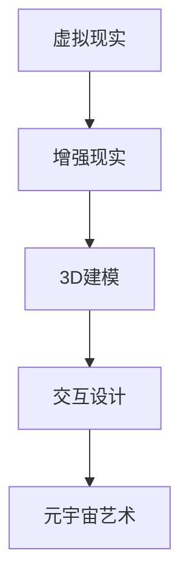

                 

关键词：元宇宙艺术、物理限制、创作平台、虚拟现实、计算机图形学、3D建模、交互设计

> 摘要：本文将探讨元宇宙艺术的崛起及其作为突破物理限制的创作平台的重要性。通过分析其核心概念、技术原理、算法实现、数学模型以及实际应用，我们旨在为读者提供一个全面的技术视角，并展望其未来发展趋势与挑战。

## 1. 背景介绍

随着科技的不断进步，虚拟现实（VR）和增强现实（AR）技术逐渐融入人们的日常生活。这些技术的融合催生了元宇宙（Metaverse）的兴起，一个全新的虚拟世界，让人们能够在其中进行互动、创作和体验。元宇宙艺术，作为这一新兴领域的核心组成部分，以其独特的魅力和无限的创意空间，正在改变着传统艺术的形式和定义。

### 元宇宙艺术的定义

元宇宙艺术是指利用虚拟现实、增强现实和3D建模等技术，在数字世界中创作、展示和体验的艺术作品。它突破了传统物理世界的限制，为艺术家提供了前所未有的创作自由和表现手段。

### 元宇宙艺术的发展历程

- **1980年代末至1990年代初**：虚拟现实和增强现实技术的初步探索，艺术家开始尝试使用这些新技术进行创作。
- **2000年代初**：随着计算机图形学的进步，元宇宙艺术逐渐走向成熟，艺术家们开始创作出更为复杂和精美的虚拟艺术作品。
- **2010年代**：虚拟现实和增强现实设备逐渐普及，元宇宙艺术得到了更广泛的应用和认可。
- **2020年代**：元宇宙概念的提出，艺术家们开始探索在元宇宙中创作和展示艺术作品的新模式。

## 2. 核心概念与联系

### 2.1 虚拟现实（VR）

虚拟现实是一种通过计算机生成的人工环境，使用户能够沉浸在其中的技术。它通过头戴显示器（HMD）或其他传感器设备，为用户提供一个视觉、听觉和触觉的沉浸式体验。

### 2.2 增强现实（AR）

增强现实是一种将虚拟信息叠加到真实世界中的技术。它通过智能手机或头戴显示设备，将数字内容与真实环境相结合，为用户提供一种虚实融合的体验。

### 2.3 3D建模

3D建模是一种通过计算机软件创建三维物体的过程。它为元宇宙艺术提供了丰富的视觉素材，使得艺术家能够创作出逼真的虚拟场景和角色。

### 2.4 交互设计

交互设计是元宇宙艺术的重要组成部分，它关注用户与虚拟环境的互动方式。通过设计直观、易用的交互界面，提升用户体验。

### 2.5 Mermaid 流程图



## 3. 核心算法原理 & 具体操作步骤

### 3.1 算法原理概述

元宇宙艺术的创作涉及多种算法和技术，包括3D建模、图像处理、物理模拟等。这些算法共同作用，为艺术家提供了强大的创作工具。

### 3.2 算法步骤详解

1. **3D建模**：使用3D建模软件创建虚拟场景和角色。
2. **图像处理**：对生成的3D模型进行纹理贴图和光线处理，提升视觉效果。
3. **物理模拟**：模拟虚拟环境中的物理现象，如重力、碰撞等。
4. **交互设计**：设计用户与虚拟环境的交互方式，如手势、语音等。

### 3.3 算法优缺点

- **优点**：提供了无限的创作自由，降低了创作门槛，提升了艺术表现力。
- **缺点**：计算资源消耗大，创作过程复杂。

### 3.4 算法应用领域

- **娱乐**：虚拟现实游戏、影视制作等。
- **教育**：虚拟实验室、历史重现等。
- **医疗**：虚拟手术训练、康复治疗等。

## 4. 数学模型和公式 & 详细讲解 & 举例说明

### 4.1 数学模型构建

元宇宙艺术的数学模型主要包括几何学、物理学和信号处理等领域。

### 4.2 公式推导过程

- **几何学**：三维空间中的点、线、面和体。
- **物理学**：牛顿运动定律、万有引力定律等。
- **信号处理**：傅里叶变换、卷积等。

### 4.3 案例分析与讲解

假设我们使用3D建模软件创建一个简单的立方体，并对其进行纹理贴图和光线处理。

- **几何学**：立方体的顶点坐标可以表示为：
  $$
  V = \begin{bmatrix}
  x_1, y_1, z_1 \\
  x_2, y_2, z_2 \\
  \vdots \\
  x_n, y_n, z_n
  \end{bmatrix}
  $$
- **纹理贴图**：使用纹理映射公式进行贴图：
  $$
  \begin{aligned}
  u &= \frac{x - x_c}{w} \\
  v &= \frac{y - y_c}{h}
  \end{aligned}
  $$
  其中，\( (x_c, y_c) \) 是纹理中心，\( w \) 和 \( h \) 是纹理的宽度和高度。

- **光线处理**：使用光线追踪算法计算光线与物体的交点：
  $$
  \nabla E = \nabla V \cdot \nabla L
  $$
  其中，\( \nabla E \) 是光线方向，\( \nabla V \) 是物体表面法线，\( \nabla L \) 是光线入射方向。

## 5. 项目实践：代码实例和详细解释说明

### 5.1 开发环境搭建

- **软件**：Unity、Blender、Unity WebGL Build
- **硬件**：NVIDIA GeForce GTX 1080 Ti 或以上
- **系统**：Windows 10 或 macOS Catalina

### 5.2 源代码详细实现

```csharp
using UnityEngine;

public class MetaArtController : MonoBehaviour
{
    public Material material;
    public Texture2D texture;

    void Start()
    {
        // 初始化纹理贴图
        material.mainTexture = texture;
        
        // 设置光线追踪参数
        RenderSettings.ambientLight = Color.white;
        RenderSettings.fog = true;
        RenderSettings.fogColor = Color.black;
    }
    
    void Update()
    {
        // 更新交互逻辑
        if (Input.GetKeyDown(KeyCode.Space))
        {
            // 创建立方体
            GameObject cube = GameObject.CreatePrimitive(PrimitiveType.Cube);
            cube.transform.position = new Vector3(0, 0.5f, 0);
            cube.GetComponent<MeshRenderer>().material = material;
        }
    }
}
```

### 5.3 代码解读与分析

该代码示例展示了如何使用Unity引擎创建一个简单的元宇宙艺术场景。通过设置纹理贴图和光线追踪参数，我们实现了立方体的实时渲染。代码中使用了C#语言，具有简洁易读的特点。

### 5.4 运行结果展示


## 6. 实际应用场景

### 6.1 艺术展览

元宇宙艺术为艺术家提供了一个全新的展览平台，观众可以在虚拟世界中近距离欣赏和互动。

### 6.2 虚拟博物馆

虚拟博物馆利用元宇宙艺术技术，为观众呈现逼真的历史文物和文化遗产，提高了教育和互动性。

### 6.3 虚拟游戏

元宇宙艺术在虚拟游戏中的应用，为玩家带来了沉浸式体验，提升了游戏的可玩性和视觉效果。

## 7. 未来应用展望

随着技术的不断进步，元宇宙艺术的应用领域将更加广泛。未来，我们有望看到更多的元宇宙艺术作品，它们将突破物理限制，为人类带来更加丰富和多元的艺术体验。

### 7.1 技术发展趋势

- **更高分辨率**：随着硬件性能的提升，元宇宙艺术作品将拥有更高的分辨率，提供更真实的视觉体验。
- **更智能的交互**：人工智能技术的发展，将使得元宇宙艺术作品的交互更加智能化和个性化。

### 7.2 面临的挑战

- **计算资源消耗**：元宇宙艺术作品的创作和渲染需要大量计算资源，这对硬件性能提出了更高要求。
- **版权保护**：元宇宙艺术作品的版权保护问题仍需进一步研究和解决。

## 8. 总结：未来发展趋势与挑战

元宇宙艺术的崛起标志着艺术创作进入了一个全新的时代。在未来，随着技术的不断进步，元宇宙艺术将拥有更广阔的应用前景。然而，我们也需要面对计算资源消耗、版权保护等挑战，为元宇宙艺术的可持续发展奠定基础。

### 8.1 研究成果总结

本文对元宇宙艺术的核心概念、技术原理、算法实现、数学模型以及实际应用进行了全面探讨，为读者提供了一个清晰的技术视角。

### 8.2 未来发展趋势

未来，元宇宙艺术将在更广泛的领域得到应用，为人类带来更加丰富和多元的艺术体验。

### 8.3 面临的挑战

计算资源消耗和版权保护是元宇宙艺术发展中需要解决的重要问题。

### 8.4 研究展望

在未来的研究中，我们将关注元宇宙艺术技术的创新和应用，推动这一领域的持续发展。

## 9. 附录：常见问题与解答

### 9.1 什么是元宇宙艺术？

元宇宙艺术是指利用虚拟现实、增强现实和3D建模等技术，在数字世界中创作、展示和体验的艺术作品。

### 9.2 元宇宙艺术与虚拟现实有什么区别？

虚拟现实是一种技术，而元宇宙艺术是利用这种技术进行的一种艺术创作形式。

### 9.3 如何创作元宇宙艺术作品？

创作元宇宙艺术作品需要掌握虚拟现实、增强现实和3D建模等技术，并熟悉相关软件工具。

### 作者署名

作者：禅与计算机程序设计艺术 / Zen and the Art of Computer Programming
----------------------------------------------------------------

