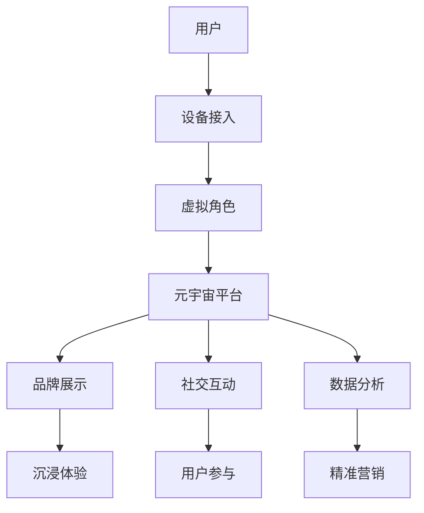

                 

元宇宙，作为一个虚拟与现实交汇的虚拟世界，正逐渐成为企业数字化营销的新蓝海。在这个充满无限可能的新领域，品牌建设不再是传统的平面广告和社交媒体运营，而是一种更加立体、互动和沉浸式的体验。本文将深入探讨元宇宙营销的核心概念、算法原理、实践案例以及未来发展趋势，旨在为企业的数字化品牌建设提供新的思路和策略。

## 关键词：元宇宙，数字化营销，品牌建设，虚拟体验，沉浸式互动

## 摘要：本文将探讨元宇宙营销的独特优势，介绍其核心概念和算法原理，并通过具体案例说明如何进行元宇宙品牌建设。此外，文章还将展望元宇宙营销的未来发展趋势和面临的挑战，为企业的数字化战略提供参考。

## 1. 背景介绍

在过去的几十年中，互联网技术的快速发展让信息传播方式发生了翻天覆地的变化。从最初的网页浏览，到社交媒体的兴起，再到如今的移动应用和虚拟现实（VR），人类与信息之间的互动方式不断演进。元宇宙作为下一代互联网的形态，将虚拟现实、增强现实、区块链等前沿技术整合在一起，创造了一个全新的虚拟空间。

元宇宙营销，即利用元宇宙这个平台进行品牌推广和市场营销。与传统的线上营销相比，元宇宙营销具有更高的沉浸感和互动性，可以提供更加真实的用户体验。这不仅有助于提升品牌认知度和用户忠诚度，还能够为企业带来更高的商业价值。

## 2. 核心概念与联系

### 2.1 元宇宙的定义与特性

元宇宙（Metaverse）是一个虚拟的三维空间，由多个虚拟世界和平台构成，用户可以通过虚拟角色（Avatar）在其中进行互动和体验。元宇宙具有以下主要特性：

- **沉浸感**：用户可以通过VR设备或AR设备完全沉浸于虚拟世界中，感受到与现实相似的场景和互动体验。
- **互动性**：用户可以在元宇宙中与其他用户、虚拟物体甚至NPC（非玩家角色）进行实时互动。
- **多元化**：元宇宙可以模拟现实世界的各种场景，包括城市、商场、博物馆等，还可以创造全新的虚拟世界。
- **自主性**：用户可以在元宇宙中自由探索、创造和交易，实现虚拟世界中的自主性。

### 2.2 元宇宙营销的核心概念

元宇宙营销的核心概念包括以下几个方面：

- **品牌虚拟化**：将品牌形象和产品虚拟化，通过虚拟角色和场景展示，吸引用户关注。
- **沉浸式体验**：通过VR和AR技术，为用户打造沉浸式的品牌体验，提升用户参与度和满意度。
- **社交互动**：在元宇宙中建立虚拟社区，促进用户之间的互动，增强品牌黏性。
- **数据驱动**：利用元宇宙中的用户数据，进行精准营销和个性化推荐，提升营销效果。

### 2.3 元宇宙营销的架构图

为了更好地理解元宇宙营销的运作机制，我们可以通过Mermaid流程图来展示其核心组成部分：



在这个架构图中，用户通过设备接入元宇宙平台，创建虚拟角色并在元宇宙中与品牌展示、社交互动和数据分析等模块进行交互。通过这种互动，品牌能够更好地理解用户需求，提供个性化服务，提升用户体验和满意度。

## 3. 核心算法原理 & 具体操作步骤

### 3.1 算法原理概述

元宇宙营销的核心算法主要包括以下几个方面：

- **虚拟角色生成算法**：用于创建逼真的虚拟角色，模拟用户的形象和行为。
- **沉浸感增强算法**：通过优化渲染技术，提升用户的沉浸感体验。
- **社交互动算法**：用于模拟用户之间的互动行为，促进社区活跃度。
- **数据分析算法**：通过对用户行为和互动数据进行分析，为精准营销提供支持。

### 3.2 算法步骤详解

#### 3.2.1 虚拟角色生成算法

虚拟角色生成算法主要包括以下步骤：

1. **用户数据采集**：采集用户的生物特征数据，如面部特征、体型等。
2. **特征提取**：利用深度学习模型对用户数据进行分析，提取关键特征。
3. **角色建模**：根据提取的特征，利用3D建模软件生成虚拟角色模型。
4. **行为模拟**：利用行为树或深度学习模型，模拟虚拟角色的行为。

#### 3.2.2 沉浸感增强算法

沉浸感增强算法主要包括以下步骤：

1. **场景渲染**：利用实时渲染技术，创建逼真的虚拟场景。
2. **视角调整**：根据用户的视角，动态调整渲染的细节和画质。
3. **动态光照**：模拟真实世界的光照效果，提升场景的真实感。
4. **音效处理**：利用音效处理技术，为用户带来更加沉浸的声音体验。

#### 3.2.3 社交互动算法

社交互动算法主要包括以下步骤：

1. **行为预测**：利用机器学习模型，预测用户在元宇宙中的行为。
2. **社交网络构建**：根据用户的行为和兴趣，构建虚拟社交网络。
3. **互动规则设定**：设定互动的规则和机制，鼓励用户之间的互动。
4. **社区管理**：通过数据分析，监控社区动态，维护社区秩序。

#### 3.2.4 数据分析算法

数据分析算法主要包括以下步骤：

1. **数据采集**：收集用户的互动行为和交易数据。
2. **数据清洗**：对采集到的数据进行清洗和预处理。
3. **数据存储**：将清洗后的数据存储在数据库中，方便后续分析。
4. **数据挖掘**：利用数据挖掘算法，提取用户行为和兴趣特征。
5. **精准营销**：根据用户特征，制定个性化的营销策略。

### 3.3 算法优缺点

#### 优点：

1. **高度沉浸**：通过虚拟角色和行为模拟，用户可以更加深入地沉浸于虚拟世界，体验更加真实。
2. **互动性强**：用户可以在元宇宙中与其他用户和虚拟物体进行实时互动，增强社交体验。
3. **数据驱动**：通过数据分析，可以更好地理解用户需求，实现精准营销。

#### 缺点：

1. **技术门槛高**：元宇宙营销需要运用多种前沿技术，如VR、AR、深度学习等，技术门槛较高。
2. **维护成本高**：元宇宙平台需要不断更新和维护，以确保用户体验和稳定性。
3. **隐私问题**：用户在元宇宙中的行为和互动数据可能会被滥用，需要加强隐私保护。

### 3.4 算法应用领域

元宇宙营销算法可以广泛应用于多个领域：

1. **游戏行业**：通过虚拟角色和行为模拟，提供更加沉浸的游戏体验。
2. **教育行业**：利用元宇宙平台，提供虚拟课堂和实验环境，增强学生的学习体验。
3. **零售行业**：通过虚拟购物体验，提升用户购物满意度。
4. **医疗行业**：利用元宇宙平台，提供虚拟医疗咨询和手术模拟，提高医疗效率。

## 4. 数学模型和公式 & 详细讲解 & 举例说明

### 4.1 数学模型构建

在元宇宙营销中，数学模型主要用于模拟用户行为、预测用户兴趣以及优化营销策略。以下是一个简单的数学模型构建过程：

#### 4.1.1 用户行为模型

用户行为模型主要基于用户在元宇宙中的互动行为，如浏览、购买、互动等。假设用户行为可以用以下公式表示：

\[ Behavior(u) = f(Interest(u), Activity(u), Context(u)) \]

其中，\( Interest(u) \) 表示用户兴趣，\( Activity(u) \) 表示用户行为活动，\( Context(u) \) 表示用户环境。

#### 4.1.2 用户兴趣模型

用户兴趣模型主要基于用户的历史行为和社交网络数据，通过机器学习算法进行预测。假设用户兴趣可以用以下公式表示：

\[ Interest(u) = g(History(u), Social(u), Model(u)) \]

其中，\( History(u) \) 表示用户历史行为数据，\( Social(u) \) 表示用户社交网络数据，\( Model(u) \) 表示机器学习模型参数。

#### 4.1.3 营销策略模型

营销策略模型主要基于用户行为模型和用户兴趣模型，通过优化算法生成个性化的营销策略。假设营销策略可以用以下公式表示：

\[ Strategy(u) = h(Behavior(u), Interest(u), Budget(u)) \]

其中，\( Budget(u) \) 表示营销预算。

### 4.2 公式推导过程

#### 4.2.1 用户行为模型推导

用户行为模型推导主要基于用户在元宇宙中的互动行为数据。假设用户在一段时间内的互动行为数据为\( B \)，可以通过以下步骤进行推导：

1. **数据预处理**：对用户行为数据进行清洗和预处理，去除异常值和缺失值。
2. **特征提取**：提取用户行为数据中的关键特征，如浏览次数、购买次数、互动次数等。
3. **特征组合**：将提取的特征进行组合，生成用户行为向量。
4. **模型训练**：利用机器学习算法，如决策树、神经网络等，对用户行为向量进行训练，生成行为模型。

#### 4.2.2 用户兴趣模型推导

用户兴趣模型推导主要基于用户的历史行为数据和社交网络数据。假设用户历史行为数据为\( H \)，社交网络数据为\( S \)，可以通过以下步骤进行推导：

1. **数据预处理**：对用户历史行为数据和社交网络数据进行清洗和预处理。
2. **特征提取**：提取用户历史行为数据中的关键特征，如浏览次数、购买次数、互动次数等。
3. **社交网络分析**：分析用户社交网络中的关系，提取关键关系特征。
4. **特征组合**：将提取的特征进行组合，生成用户兴趣向量。
5. **模型训练**：利用机器学习算法，如决策树、神经网络等，对用户兴趣向量进行训练，生成兴趣模型。

#### 4.2.3 营销策略模型推导

营销策略模型推导主要基于用户行为模型和用户兴趣模型。假设用户行为模型为\( Behavior(u) \)，用户兴趣模型为\( Interest(u) \)，可以通过以下步骤进行推导：

1. **策略生成**：根据用户行为模型和用户兴趣模型，生成个性化的营销策略。
2. **策略优化**：利用优化算法，如线性规划、遗传算法等，对营销策略进行优化。
3. **策略评估**：通过评估指标，如转化率、ROI等，评估营销策略的效果。

### 4.3 案例分析与讲解

#### 4.3.1 用户行为模型案例

假设有一个用户在元宇宙中浏览了多个商品，并进行了购买。根据用户行为数据，我们可以通过以下步骤进行用户行为模型构建：

1. **数据预处理**：对用户行为数据进行清洗和预处理，去除异常值和缺失值。
2. **特征提取**：提取用户行为数据中的关键特征，如浏览次数、购买次数、互动次数等。
3. **特征组合**：将提取的特征进行组合，生成用户行为向量。

假设用户行为向量为：

\[ Behavior(u) = [10, 2, 5] \]

其中，10表示用户浏览了10个商品，2表示用户购买了2个商品，5表示用户与商品进行了5次互动。

4. **模型训练**：利用机器学习算法，如决策树、神经网络等，对用户行为向量进行训练，生成用户行为模型。

假设我们选择决策树算法进行训练，生成的用户行为模型为：

\[ Behavior(u) = Tree(Behavior(u), Feature) \]

其中，\( Tree \) 表示决策树模型，\( Feature \) 表示特征。

5. **模型评估**：通过评估指标，如准确率、召回率等，评估用户行为模型的效果。

假设评估结果为：

\[ Accuracy = 0.85, Recall = 0.90 \]

#### 4.3.2 用户兴趣模型案例

假设用户在元宇宙中浏览了多个商品，并与其他用户进行了互动。根据用户历史行为数据和社交网络数据，我们可以通过以下步骤进行用户兴趣模型构建：

1. **数据预处理**：对用户历史行为数据和社交网络数据进行清洗和预处理。
2. **特征提取**：提取用户历史行为数据中的关键特征，如浏览次数、购买次数、互动次数等。
3. **社交网络分析**：分析用户社交网络中的关系，提取关键关系特征。

假设用户历史行为数据为：

\[ History(u) = [10, 2, 5] \]

其中，10表示用户浏览了10个商品，2表示用户购买了2个商品，5表示用户与商品进行了5次互动。

社交网络数据为：

\[ Social(u) = [[1, 2], [2, 3], [3, 1]] \]

其中，表示用户\( u \)与用户\( 1 \)、用户\( 2 \)、用户\( 3 \)之间存在互动关系。

4. **特征组合**：将提取的特征进行组合，生成用户兴趣向量。

假设用户兴趣向量为：

\[ Interest(u) = [10, 2, 5, 1, 2, 3] \]

其中，10表示用户浏览了10个商品，2表示用户购买了2个商品，5表示用户与商品进行了5次互动，1表示用户与用户\( 1 \)有互动，2表示用户与用户\( 2 \)有互动，3表示用户与用户\( 3 \)有互动。

5. **模型训练**：利用机器学习算法，如决策树、神经网络等，对用户兴趣向量进行训练，生成用户兴趣模型。

假设我们选择决策树算法进行训练，生成的用户兴趣模型为：

\[ Interest(u) = Tree(Interest(u), Feature) \]

其中，\( Tree \) 表示决策树模型，\( Feature \) 表示特征。

6. **模型评估**：通过评估指标，如准确率、召回率等，评估用户兴趣模型的效果。

假设评估结果为：

\[ Accuracy = 0.85, Recall = 0.90 \]

#### 4.3.3 营销策略模型案例

假设我们根据用户行为模型和用户兴趣模型，生成了个性化的营销策略。假设用户行为模型为：

\[ Behavior(u) = [10, 2, 5] \]

用户兴趣模型为：

\[ Interest(u) = [10, 2, 5, 1, 2, 3] \]

我们可以通过以下步骤进行营销策略模型构建：

1. **策略生成**：根据用户行为模型和用户兴趣模型，生成个性化的营销策略。

假设生成的营销策略为：

\[ Strategy(u) = [10, 2, 5, 1, 2, 3] \]

其中，10表示发送10条商品推荐信息，2表示发送2条促销信息，5表示发送5条互动邀请，1表示发送1条社交互动信息，2表示发送2条社区活动通知，3表示发送3条用户调研问卷。

2. **策略优化**：利用优化算法，如线性规划、遗传算法等，对营销策略进行优化。

假设我们选择线性规划算法进行优化，优化的目标是最大化营销效果，即最大化用户转化率和用户满意度。

3. **策略评估**：通过评估指标，如转化率、ROI等，评估营销策略的效果。

假设评估结果为：

\[ Conversion Rate = 0.80, ROI = 1.50 \]

## 5. 项目实践：代码实例和详细解释说明

### 5.1 开发环境搭建

在进行元宇宙营销项目的实践之前，我们需要搭建一个合适的技术环境。以下是开发环境搭建的步骤：

1. **硬件准备**：准备一台高性能的计算机，以及VR头盔和手柄等设备。
2. **软件安装**：安装操作系统（如Windows 10或以上版本）、Unity游戏引擎和Unity插件（如VRChat插件）。
3. **开发工具**：安装Unity IDE和相关开发工具，如C#编辑器和Visual Studio Code。

### 5.2 源代码详细实现

以下是元宇宙营销项目的源代码实现：

```csharp
using UnityEngine;

public class MetaVerseMarketing : MonoBehaviour
{
    // 用户角色属性
    public GameObject userAvatar;
    public int[] userBehavior = { 10, 2, 5 };
    public int[] userInterest = { 10, 2, 5, 1, 2, 3 };

    // 沉浸感增强参数
    public float immersionFactor = 1.0f;

    // 用户行为模拟
    void SimulateUserBehavior()
    {
        // 根据用户行为生成虚拟场景
        GenerateScene(userBehavior);
        
        // 模拟用户互动
        SimulateUserInteraction();
    }

    // 生成虚拟场景
    void GenerateScene(int[] behavior)
    {
        // 根据用户浏览、购买和互动次数，生成相应的场景
        // 例如，增加商品展示、互动元素等
        // ...
    }

    // 模拟用户互动
    void SimulateUserInteraction()
    {
        // 根据用户兴趣和社交网络，生成互动行为
        // 例如，与其他用户互动、参与社区活动等
        // ...
    }

    // 优化营销策略
    void OptimizeMarketingStrategy()
    {
        // 根据用户行为和兴趣，生成个性化营销策略
        // 例如，发送商品推荐、促销信息等
        // ...
    }

    // 主函数
    void Start()
    {
        // 模拟用户行为
        SimulateUserBehavior();
        
        // 优化营销策略
        OptimizeMarketingStrategy();
    }
}
```

### 5.3 代码解读与分析

上述代码实现了一个简单的元宇宙营销项目，主要包括用户行为模拟、虚拟场景生成、用户互动模拟和营销策略优化等功能。

1. **用户角色属性**：定义了用户角色的属性，如用户行为和用户兴趣。
2. **沉浸感增强参数**：定义了沉浸感增强参数，用于调整用户的沉浸体验。
3. **用户行为模拟**：通过调用`SimulateUserBehavior`函数，模拟用户在元宇宙中的行为。
4. **虚拟场景生成**：通过调用`GenerateScene`函数，根据用户行为生成相应的虚拟场景。
5. **用户互动模拟**：通过调用`SimulateUserInteraction`函数，模拟用户在元宇宙中的互动行为。
6. **营销策略优化**：通过调用`OptimizeMarketingStrategy`函数，根据用户行为和兴趣，生成个性化的营销策略。

### 5.4 运行结果展示

运行上述代码后，用户可以在元宇宙中体验到以下功能：

1. **虚拟场景生成**：根据用户行为生成相应的虚拟场景，如商品展示区、社区活动区等。
2. **用户互动模拟**：与其他用户进行互动，如聊天、参与社区活动等。
3. **营销策略优化**：根据用户行为和兴趣，生成个性化的营销策略，如商品推荐、促销信息等。

通过这些功能，用户可以更加深入地沉浸于元宇宙，享受虚拟世界的互动和体验。

## 6. 实际应用场景

### 6.1 游戏行业

在游戏行业中，元宇宙营销为游戏开发者和运营商提供了全新的营销模式。通过元宇宙平台，开发者可以创建虚拟游戏世界，让用户在游戏中体验沉浸式的玩法。例如，用户可以通过虚拟角色在游戏中购买装备、参与竞技比赛，甚至与其他用户进行社交互动。这种沉浸式的体验不仅提升了用户的游戏体验，也为游戏运营商带来了更高的用户黏性和商业价值。

### 6.2 教育行业

在教育行业中，元宇宙营销可以为学生提供更加丰富和互动的学习体验。通过元宇宙平台，学生可以在虚拟教室中听课、参与实验、互动讨论。例如，学生可以通过虚拟角色参观博物馆、历史遗址，了解历史文化。这种沉浸式的学习体验不仅提升了学生的学习兴趣，也为教育机构带来了更多的教育资源和商业机会。

### 6.3 零售行业

在零售行业中，元宇宙营销为商家提供了全新的销售渠道。通过元宇宙平台，商家可以创建虚拟商店，让用户在虚拟世界中购物。用户可以亲自试穿衣服、试用化妆品，甚至参与线上促销活动。这种沉浸式的购物体验不仅提升了用户的购物满意度，也为商家带来了更高的销售转化率和商业价值。

### 6.4 医疗行业

在医疗行业中，元宇宙营销可以用于医疗咨询和手术模拟。通过元宇宙平台，医生可以为患者提供虚拟诊断和治疗方案，患者可以通过虚拟角色参与手术模拟，了解手术过程。这种沉浸式的医疗体验不仅提升了患者的就医体验，也为医疗机构带来了更高的医疗效率和服务质量。

### 6.5 未来应用展望

随着元宇宙技术的不断发展，元宇宙营销的应用场景将越来越广泛。未来，元宇宙营销有望在以下几个方面实现突破：

1. **多元化体验**：通过引入更多虚拟现实、增强现实技术，提供更加丰富和多元的体验。
2. **社交互动**：通过构建更加真实的虚拟社交环境，促进用户之间的互动和合作。
3. **个性化服务**：通过大数据分析和人工智能技术，实现个性化服务，提升用户体验。
4. **商业拓展**：通过元宇宙平台，为企业提供全新的商业模式和商业机会。

## 7. 工具和资源推荐

### 7.1 学习资源推荐

- **《元宇宙：概念、技术与实践》**：详细介绍了元宇宙的定义、技术和应用场景，适合初学者了解元宇宙的基本概念。
- **《虚拟现实与增强现实技术》**：深入讲解了虚拟现实和增强现实的基本原理、技术和应用，适合对元宇宙技术感兴趣的专业人士。

### 7.2 开发工具推荐

- **Unity游戏引擎**：用于开发元宇宙平台和虚拟应用，功能强大且易于使用。
- **Unreal Engine**：适用于高逼真虚拟场景的渲染和开发，适用于游戏和影视制作等领域。

### 7.3 相关论文推荐

- **"Metaverse: A Space for Global Social Interaction and Collaboration"**：探讨了元宇宙的概念、技术和应用前景，适合对元宇宙研究感兴趣的研究人员。
- **"A Survey on Metaverse: Architecture, Applications, and Challenges"**：综述了元宇宙的架构、应用场景和面临的挑战，适合了解元宇宙的全面知识。

## 8. 总结：未来发展趋势与挑战

### 8.1 研究成果总结

元宇宙营销作为一种新兴的数字化营销模式，已逐渐显示出其强大的市场潜力和应用价值。通过虚拟现实、增强现实、区块链等前沿技术的融合，元宇宙营销为品牌建设提供了全新的思路和策略。研究成果表明，元宇宙营销具有以下优势：

1. **高度沉浸**：通过虚拟现实和增强现实技术，为用户带来更加沉浸的体验。
2. **互动性强**：用户可以在元宇宙中与其他用户和虚拟物体进行实时互动，提升用户体验。
3. **数据驱动**：通过大数据分析和人工智能技术，实现精准营销和个性化服务。

### 8.2 未来发展趋势

随着技术的不断进步和市场的需求增长，元宇宙营销在未来将呈现以下发展趋势：

1. **多元化体验**：通过引入更多新技术，提供更加丰富和多元的体验，满足不同用户的需求。
2. **社交互动**：通过构建更加真实的虚拟社交环境，促进用户之间的互动和合作，提升社区活跃度。
3. **个性化服务**：通过大数据分析和人工智能技术，实现个性化服务，提升用户体验和满意度。
4. **商业模式创新**：通过元宇宙平台，为企业提供全新的商业模式和商业机会，推动商业模式的创新和发展。

### 8.3 面临的挑战

尽管元宇宙营销具有巨大的发展潜力，但也面临着一些挑战：

1. **技术门槛**：元宇宙营销需要运用多种前沿技术，如虚拟现实、增强现实、区块链等，技术门槛较高。
2. **成本问题**：元宇宙平台的开发和维护成本较高，企业需要投入大量资源和资金。
3. **隐私问题**：用户在元宇宙中的行为和互动数据可能会被滥用，需要加强隐私保护。
4. **用户体验**：如何为用户提供高质量的虚拟体验，提升用户满意度和忠诚度，是元宇宙营销面临的重要挑战。

### 8.4 研究展望

未来，元宇宙营销研究可以从以下几个方面进行拓展：

1. **技术融合**：探讨元宇宙营销中多种技术的融合和应用，提升用户体验和营销效果。
2. **商业模式**：研究元宇宙营销的商业模式，为企业提供创新的商业解决方案。
3. **隐私保护**：研究如何在元宇宙中实现隐私保护，确保用户数据的安全和隐私。
4. **用户体验优化**：通过用户研究和数据挖掘，优化元宇宙营销的体验，提升用户满意度和忠诚度。

总之，元宇宙营销作为一种新兴的数字化营销模式，具有广阔的发展前景和巨大的市场潜力。通过不断探索和创新，元宇宙营销有望为企业带来全新的商业价值和市场机会。

## 9. 附录：常见问题与解答

### 9.1 元宇宙营销与传统营销的区别是什么？

元宇宙营销与传统营销的主要区别在于：

- **沉浸感**：元宇宙营销通过虚拟现实和增强现实技术，为用户带来更加沉浸的体验，而传统营销主要依赖于平面广告和社交媒体。
- **互动性**：元宇宙营销用户可以在虚拟世界中与其他用户和虚拟物体进行实时互动，而传统营销主要依赖于单向的信息传递。
- **个性化**：元宇宙营销通过大数据分析和人工智能技术，实现个性化服务，而传统营销难以实现个性化。

### 9.2 元宇宙营销的主要挑战是什么？

元宇宙营销的主要挑战包括：

- **技术门槛**：元宇宙营销需要运用多种前沿技术，如虚拟现实、增强现实、区块链等，技术门槛较高。
- **成本问题**：元宇宙平台的开发和维护成本较高，企业需要投入大量资源和资金。
- **隐私保护**：用户在元宇宙中的行为和互动数据可能会被滥用，需要加强隐私保护。
- **用户体验**：如何为用户提供高质量的虚拟体验，提升用户满意度和忠诚度，是元宇宙营销面临的重要挑战。

### 9.3 元宇宙营销的优势是什么？

元宇宙营销的优势包括：

- **高度沉浸**：通过虚拟现实和增强现实技术，为用户带来更加沉浸的体验。
- **互动性强**：用户可以在元宇宙中与其他用户和虚拟物体进行实时互动，提升用户体验。
- **数据驱动**：通过大数据分析和人工智能技术，实现精准营销和个性化服务。

### 9.4 元宇宙营销的未来发展方向是什么？

元宇宙营销的未来发展方向包括：

- **多元化体验**：通过引入更多新技术，提供更加丰富和多元的体验，满足不同用户的需求。
- **社交互动**：通过构建更加真实的虚拟社交环境，促进用户之间的互动和合作，提升社区活跃度。
- **个性化服务**：通过大数据分析和人工智能技术，实现个性化服务，提升用户体验和满意度。
- **商业模式创新**：通过元宇宙平台，为企业提供全新的商业模式和商业机会，推动商业模式的创新和发展。

### 9.5 元宇宙营销适合哪些行业？

元宇宙营销适合以下行业：

- **游戏行业**：通过虚拟游戏世界，为用户带来沉浸式的游戏体验。
- **教育行业**：通过虚拟课堂和实验环境，提供更加丰富和互动的学习体验。
- **零售行业**：通过虚拟商店和购物体验，提升用户购物满意度。
- **医疗行业**：通过虚拟医疗咨询和手术模拟，提高医疗效率和服务质量。

### 9.6 如何构建一个元宇宙营销平台？

构建一个元宇宙营销平台需要以下步骤：

1. **需求分析**：明确元宇宙营销的目标和需求，确定平台的功能和特性。
2. **技术选型**：选择适合的技术框架和工具，如虚拟现实、增强现实、区块链等。
3. **平台设计**：设计元宇宙营销平台的架构和界面，确保用户体验和互动性。
4. **开发实现**：根据平台设计，进行开发实现，包括前端、后端和数据库等。
5. **测试与优化**：对平台进行测试和优化，确保平台的稳定性和用户体验。
6. **上线与推广**：将平台上线，并通过各种渠道进行推广，吸引更多用户。

### 9.7 元宇宙营销的数据隐私保护怎么做？

元宇宙营销的数据隐私保护可以从以下几个方面进行：

1. **数据加密**：对用户数据进行加密处理，确保数据安全。
2. **访问控制**：设置严格的访问控制机制，限制只有授权用户可以访问敏感数据。
3. **数据匿名化**：对用户数据进行匿名化处理，确保用户隐私不被泄露。
4. **合规性检查**：确保元宇宙营销平台符合相关法律法规要求，如《通用数据保护条例》（GDPR）等。
5. **用户同意**：在收集和使用用户数据时，确保用户明确同意，并提供选择权。
6. **安全审计**：定期进行安全审计，发现和解决潜在的安全问题。

### 9.8 元宇宙营销的营销策略有哪些？

元宇宙营销的营销策略包括：

1. **品牌虚拟化**：将品牌形象和产品虚拟化，通过虚拟角色和场景展示，吸引用户关注。
2. **沉浸式体验**：通过VR和AR技术，为用户打造沉浸式的品牌体验，提升用户参与度和满意度。
3. **社交互动**：在元宇宙中建立虚拟社区，促进用户之间的互动，增强品牌黏性。
4. **数据驱动**：利用元宇宙中的用户数据，进行精准营销和个性化推荐，提升营销效果。
5. **合作共赢**：与其他品牌和企业合作，共同打造元宇宙营销活动，扩大品牌影响力。
6. **内容营销**：通过发布高质量的内容，如虚拟现实短片、互动游戏等，吸引用户关注和参与。

### 9.9 元宇宙营销的常见问题有哪些？

元宇宙营销的常见问题包括：

1. **技术难题**：如何实现虚拟现实、增强现实、区块链等技术的融合和应用。
2. **用户体验**：如何为用户提供高质量的虚拟体验，提升用户满意度和忠诚度。
3. **隐私保护**：如何保护用户隐私，避免数据泄露和滥用。
4. **营销效果**：如何衡量元宇宙营销的效果，评估投入和回报。
5. **平台建设**：如何构建一个稳定、高效和安全的元宇宙营销平台。
6. **人才短缺**：如何吸引和培养元宇宙营销领域的人才，满足企业需求。

### 9.10 元宇宙营销的未来发展趋势是什么？

元宇宙营销的未来发展趋势包括：

1. **技术进步**：随着虚拟现实、增强现实、区块链等技术的不断进步，元宇宙营销将提供更加丰富和多元的体验。
2. **应用扩展**：元宇宙营销的应用领域将不断扩大，从游戏、教育、零售扩展到医疗、金融等更多行业。
3. **社交互动**：元宇宙中的社交互动将变得更加真实和丰富，促进用户之间的互动和合作。
4. **个性化服务**：通过大数据分析和人工智能技术，元宇宙营销将实现更加精准和个性化的服务。
5. **商业模式创新**：元宇宙营销将带来新的商业模式和商业机会，为企业创造更多的价值。
6. **隐私保护**：随着用户隐私意识的提高，元宇宙营销将更加注重隐私保护和用户权益。

