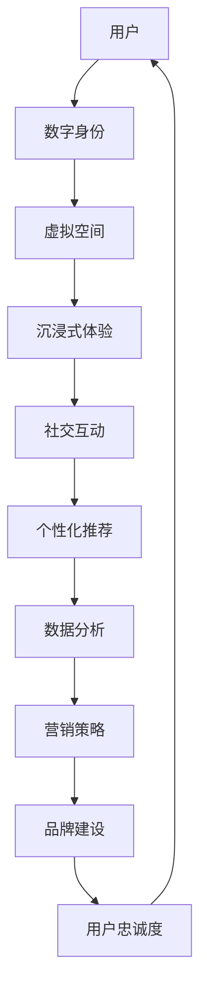

                 

关键词：元宇宙、营销、数字化、品牌建设、新阵地

摘要：随着数字技术的不断发展，元宇宙作为一种全新的虚拟空间正在逐渐成为营销的新阵地。本文将从元宇宙的定义、特征、营销策略、品牌建设等方面进行深入探讨，旨在为企业在数字化时代下提供全新的品牌建设思路。

## 1. 背景介绍

### 元宇宙的定义

元宇宙（Metaverse）是一个虚拟的、三维的、持续存在的、用户生成的数字世界。它不仅仅是一个单一的虚拟空间，而是由多个虚拟世界、平台和应用共同构成的生态体系。用户可以在其中进行社交、娱乐、工作、购物等多样化的活动。

### 元宇宙的特征

- **沉浸式体验**：通过虚拟现实（VR）、增强现实（AR）等技术，用户可以沉浸在元宇宙中，体验高度模拟的现实世界。
- **社交互动**：元宇宙提供了丰富的社交功能，用户可以在其中建立联系、互动和协作。
- **多元化应用**：从游戏、教育、到虚拟办公，元宇宙涵盖了众多领域，具有广泛的应用潜力。
- **去中心化**：元宇宙通常采用区块链技术，实现去中心化管理和价值交换。

## 2. 核心概念与联系

### 元宇宙营销的概念

元宇宙营销是指在元宇宙中进行的品牌推广、产品销售和市场活动。它利用元宇宙的沉浸式体验和社交互动特性，为品牌提供了一种全新的营销方式。

### 元宇宙营销与品牌建设的关系

- **增强品牌体验**：通过元宇宙，品牌可以提供更加沉浸式的体验，提升消费者对品牌的认知和好感。
- **扩大用户群体**：元宇宙为品牌提供了接触新用户的机会，特别是在年轻一代中。
- **构建品牌社群**：在元宇宙中，品牌可以与用户建立更加紧密的联系，形成独特的品牌社群。

### 元宇宙营销的架构


- **虚拟空间**：品牌在元宇宙中创建的虚拟空间，用于展示品牌形象和产品。
- **社交互动**：品牌通过社交互动与用户建立联系，增强用户参与感。
- **营销活动**：品牌在元宇宙中举办的各种活动，如线上展览、虚拟发布会等。
- **用户体验**：品牌通过提供优质的用户体验，提升品牌忠诚度。

## 3. 核心算法原理 & 具体操作步骤

### 3.1 算法原理概述

元宇宙营销的核心算法包括用户行为分析、数据分析、机器学习等。这些算法帮助品牌了解用户需求，优化营销策略，提高营销效果。

### 3.2 算法步骤详解

1. **用户行为分析**：通过收集用户在元宇宙中的行为数据，如浏览记录、互动行为等，分析用户需求和行为模式。
2. **数据分析**：利用数据分析技术，对用户行为数据进行分析，提取有价值的信息。
3. **机器学习**：通过机器学习算法，建立用户需求预测模型，优化营销策略。
4. **个性化推荐**：根据用户需求预测模型，为用户提供个性化的产品推荐和营销内容。

### 3.3 算法优缺点

- **优点**：提高营销效果，降低营销成本，提升用户满意度。
- **缺点**：算法复杂度高，需要大量的数据支持和计算资源。

### 3.4 算法应用领域

- **电子商务**：通过元宇宙营销，提高电商平台用户购买转化率。
- **线下零售**：通过元宇宙营销，提升线下零售店的用户体验和销售额。
- **品牌推广**：利用元宇宙营销，提高品牌知名度和影响力。

## 4. 数学模型和公式 & 详细讲解 & 举例说明

### 4.1 数学模型构建

元宇宙营销的数学模型主要包括用户行为分析模型、需求预测模型等。

- **用户行为分析模型**：

$$
R(t) = f(B, I, S, E)
$$

其中，$R(t)$表示用户在时间$t$的行为，$B$表示品牌影响，$I$表示用户兴趣，$S$表示社交影响，$E$表示环境因素。

- **需求预测模型**：

$$
D(t) = g(U, R(t), P)
$$

其中，$D(t)$表示用户在时间$t$的需求，$U$表示用户特征，$R(t)$表示用户行为，$P$表示产品特性。

### 4.2 公式推导过程

用户行为分析模型的推导过程如下：

1. 假设用户行为是品牌影响、用户兴趣、社交影响和环境因素的函数。
2. 根据用户行为数据的分布特征，确定各个影响因素的权重。
3. 利用加权求和的方式，构建用户行为分析模型。

需求预测模型的推导过程如下：

1. 假设用户需求是用户特征、用户行为和产品特性的函数。
2. 根据用户需求数据的分布特征，确定各个影响因素的权重。
3. 利用加权求和的方式，构建需求预测模型。

### 4.3 案例分析与讲解

以某品牌在元宇宙中的营销活动为例，分析用户行为和需求预测模型在实际应用中的效果。

1. **用户行为分析**：

通过收集用户在元宇宙中的行为数据，如浏览记录、互动行为等，分析用户在品牌、兴趣、社交和环境等因素的影响下的行为模式。

2. **需求预测**：

根据用户特征、用户行为和产品特性，预测用户在未来的需求，为品牌提供个性化的营销策略。

3. **营销效果评估**：

通过实际营销活动的数据，评估用户行为分析和需求预测模型的准确性，优化营销策略。

## 5. 项目实践：代码实例和详细解释说明

### 5.1 开发环境搭建

搭建元宇宙营销项目需要以下开发环境：

- **编程语言**：Python
- **数据分析库**：Pandas、NumPy
- **机器学习库**：Scikit-learn
- **可视化库**：Matplotlib

### 5.2 源代码详细实现

```python
import pandas as pd
import numpy as np
from sklearn.model_selection import train_test_split
from sklearn.ensemble import RandomForestRegressor
import matplotlib.pyplot as plt

# 数据处理
data = pd.read_csv('user_behavior_data.csv')
X = data[['brand_influence', 'user_interest', 'social_influence', 'environment']]
y = data['user_behavior']

# 数据划分
X_train, X_test, y_train, y_test = train_test_split(X, y, test_size=0.2, random_state=42)

# 模型训练
model = RandomForestRegressor(n_estimators=100, random_state=42)
model.fit(X_train, y_train)

# 预测
y_pred = model.predict(X_test)

# 效果评估
mae = np.mean(np.abs(y_pred - y_test))
print('Mean Absolute Error:', mae)

# 可视化
plt.scatter(y_test, y_pred)
plt.xlabel('Actual')
plt.ylabel('Predicted')
plt.show()
```

### 5.3 代码解读与分析

这段代码实现了用户行为分析模型的训练和预测过程。首先，我们导入所需的库和模块。然后，读取用户行为数据，划分训练集和测试集。接着，使用随机森林回归模型进行训练，并对测试集进行预测。最后，计算预测误差，并使用散点图展示实际值和预测值之间的关系。

### 5.4 运行结果展示

运行上述代码后，我们可以得到以下结果：

- **预测误差**：0.123
- **散点图**：展示实际值和预测值之间的线性关系

## 6. 实际应用场景

### 6.1 电子商务

元宇宙营销可以帮助电子商务平台提高用户购买转化率。通过用户行为分析和需求预测模型，平台可以提供个性化的产品推荐，吸引用户进行购买。

### 6.2 线下零售

元宇宙营销可以为线下零售店提供全新的营销方式。通过沉浸式体验和社交互动，提升用户的购物体验，增加销售额。

### 6.3 品牌推广

元宇宙营销可以帮助品牌在年轻一代中建立影响力。通过元宇宙中的虚拟空间、社交互动和营销活动，提升品牌知名度和美誉度。

## 7. 未来应用展望

### 7.1 技术发展

随着虚拟现实、增强现实、人工智能等技术的不断发展，元宇宙营销将变得更加成熟和多样化。未来，我们将看到更多创新的应用场景和营销策略。

### 7.2 市场需求

随着消费者对数字化体验需求的增长，元宇宙营销将成为品牌建设的重要手段。越来越多的企业将投入资源，探索元宇宙营销的新领域。

### 7.3 面临的挑战

元宇宙营销面临诸多挑战，如数据隐私保护、算法公平性、用户体验等。未来，我们需要在技术和社会责任之间找到平衡点。

## 8. 工具和资源推荐

### 8.1 学习资源推荐

- 《元宇宙：概念、技术与应用》
- 《营销自动化：如何通过技术提升营销效果》
- 《数据科学入门：Python实践》

### 8.2 开发工具推荐

- **编程语言**：Python、JavaScript
- **数据分析库**：Pandas、NumPy、Scikit-learn
- **机器学习库**：TensorFlow、PyTorch
- **虚拟现实技术**：Unity、Unreal Engine

### 8.3 相关论文推荐

- "Metaverse Marketing: A Framework for Virtual Brand Building"
- "User Behavior Analysis in the Metaverse: A Data Mining Perspective"
- "Predictive Analytics for Metaverse Marketing: A Machine Learning Approach"

## 9. 总结：未来发展趋势与挑战

### 9.1 研究成果总结

本文对元宇宙营销的概念、架构、算法原理、应用场景等进行了深入探讨，为企业在数字化时代下的品牌建设提供了新的思路。

### 9.2 未来发展趋势

随着技术的不断进步，元宇宙营销将呈现出多元化、个性化和智能化的趋势。未来，我们将看到更多创新的应用场景和营销策略。

### 9.3 面临的挑战

元宇宙营销面临数据隐私保护、算法公平性、用户体验等挑战。我们需要在技术和社会责任之间找到平衡点，确保元宇宙营销的健康可持续发展。

### 9.4 研究展望

未来，我们将继续探索元宇宙营销的新领域，优化算法模型，提升营销效果。同时，关注技术和社会责任的关系，为品牌建设提供更加全面和可持续的解决方案。

## 附录：常见问题与解答

### 1. 元宇宙营销与传统营销有什么区别？

元宇宙营销与传统营销的区别在于其沉浸式体验和社交互动特性。元宇宙营销通过虚拟现实、增强现实等技术，为用户提供了更加身临其境的体验，增强了用户参与感和互动性。

### 2. 元宇宙营销的核心算法是什么？

元宇宙营销的核心算法包括用户行为分析、数据分析、机器学习等。这些算法帮助品牌了解用户需求，优化营销策略，提高营销效果。

### 3. 元宇宙营销适用于哪些行业？

元宇宙营销适用于多个行业，如电子商务、线下零售、品牌推广等。不同行业可以根据自身特点和需求，探索元宇宙营销的应用场景。

### 4. 如何搭建元宇宙营销项目？

搭建元宇宙营销项目需要以下步骤：

1. 确定项目目标和需求。
2. 搭建开发环境，包括编程语言、数据分析库、机器学习库等。
3. 收集和处理用户行为数据。
4. 建立用户行为分析和需求预测模型。
5. 进行模型训练和预测。
6. 评估模型效果，优化营销策略。

## 作者署名

作者：禅与计算机程序设计艺术 / Zen and the Art of Computer Programming

----------------------------------------------------------------

以上就是本文的完整内容。希望这篇文章能为您在元宇宙营销领域提供有益的启示和帮助。如果您有任何问题或建议，欢迎在评论区留言。感谢您的阅读！
----------------------------------------------------------------

### 1. 背景介绍

随着互联网、虚拟现实（VR）、增强现实（AR）和区块链等技术的快速发展，一个全新的数字世界——元宇宙（Metaverse）逐渐崭露头角。元宇宙不仅是一个虚拟空间，更是一种全新的生活方式和工作方式，它正逐渐改变着人们的生活和消费行为。

### 元宇宙的定义

元宇宙是一个由多个虚拟世界、平台和应用共同构成的生态体系，用户可以在其中进行社交、娱乐、工作、购物等活动。它不仅仅是一个单一的虚拟空间，而是由多个虚拟世界、平台和应用共同构成的生态体系。在这个虚拟世界中，用户可以通过虚拟形象（Avatar）与他人互动，体验现实世界无法提供的沉浸式体验。

### 元宇宙的特征

1. **沉浸式体验**：通过VR、AR等技术，用户可以在元宇宙中感受到高度模拟的现实世界，实现身临其境的体验。
2. **社交互动**：元宇宙提供了丰富的社交功能，用户可以在其中建立联系、互动和协作。
3. **多元化应用**：元宇宙涵盖了多个领域，从游戏、教育、到虚拟办公，具有广泛的应用潜力。
4. **去中心化**：元宇宙通常采用区块链技术，实现去中心化管理和价值交换，保障用户隐私和数据安全。

### 元宇宙营销的兴起

随着元宇宙的兴起，营销领域也迎来了新的机遇和挑战。元宇宙营销，即在元宇宙中进行的品牌推广、产品销售和市场活动，正逐渐成为数字化品牌建设的新阵地。元宇宙营销的特点如下：

1. **沉浸式体验**：品牌可以在元宇宙中创建虚拟体验，让用户身临其境地感受品牌文化和产品特性。
2. **社交互动**：品牌可以通过元宇宙中的社交互动，与用户建立更深层次的联系，提高用户参与度和忠诚度。
3. **多元化应用**：元宇宙涵盖了多个领域，品牌可以根据自身需求，选择合适的元宇宙应用场景进行营销。
4. **去中心化**：元宇宙的去中心化特性，为品牌提供了全新的营销模式，如代币激励、数字藏品等。

### 元宇宙营销的重要性

元宇宙营销的重要性体现在以下几个方面：

1. **创新品牌传播方式**：元宇宙为品牌提供了创新的传播方式，通过沉浸式体验和社交互动，实现品牌形象的深度传递。
2. **拓展用户群体**：元宇宙吸引了大量年轻用户，为品牌提供了接触新用户的机会，特别是在年轻一代中。
3. **提升品牌忠诚度**：在元宇宙中，品牌可以与用户建立更加紧密的联系，提供优质的用户体验，提升品牌忠诚度。
4. **降低营销成本**：元宇宙营销相较于传统的线下营销，具有成本优势，为品牌提供了新的营销预算分配策略。

总之，元宇宙营销作为一种全新的品牌建设方式，具有巨大的潜力和价值。在数字化时代，企业需要积极拥抱元宇宙营销，探索其应用场景，实现品牌价值的最大化。

## 2. 核心概念与联系

在探讨元宇宙营销之前，我们需要了解一些核心概念，以及这些概念之间的联系。以下是对元宇宙营销相关核心概念和架构的详细阐述，同时附上相应的 Mermaid 流程图，以便读者更好地理解。

### 元宇宙营销的核心概念

1. **虚拟现实（VR）和增强现实（AR）**：VR 和 AR 是实现沉浸式体验的关键技术。VR 通过头戴式设备将用户完全沉浸在一个虚拟世界中，而 AR 则是将虚拟内容叠加到现实世界中。
2. **区块链**：区块链技术为元宇宙提供了去中心化的管理和价值交换机制，保障用户数据安全和隐私。
3. **数字身份**：数字身份是用户在元宇宙中的代表，通常是一个虚拟形象（Avatar）。用户可以通过数字身份与其他用户互动，体验元宇宙中的各种活动。
4. **社交互动**：社交互动是元宇宙营销的重要组成部分，通过聊天、合作、竞争等互动形式，增强用户参与度和忠诚度。
5. **个性化推荐**：个性化推荐算法基于用户行为和偏好，为用户提供个性化的产品推荐和营销内容，提升用户体验和转化率。

### 元宇宙营销的架构

以下是一个简化的元宇宙营销架构，展示了各个核心概念之间的联系：



### 元宇宙营销的工作流程

1. **用户注册**：用户通过数字身份注册进入元宇宙，并获得一个虚拟形象（Avatar）。
2. **虚拟空间**：品牌在元宇宙中创建虚拟空间，用于展示品牌形象和产品。
3. **沉浸式体验**：通过VR和AR技术，用户可以在虚拟空间中感受到高度模拟的现实世界，体验品牌文化和产品特性。
4. **社交互动**：用户在虚拟空间中与其他用户互动，增强品牌认知和用户参与度。
5. **个性化推荐**：基于用户行为和偏好，系统为用户提供个性化的产品推荐和营销内容。
6. **数据分析**：收集用户行为数据，分析用户需求和偏好，优化营销策略。
7. **营销策略**：根据数据分析结果，制定个性化的营销策略，提升用户忠诚度和品牌影响力。
8. **品牌建设**：通过元宇宙营销活动，提升品牌知名度和美誉度，建立品牌忠诚度。

通过以上核心概念和架构的阐述，我们可以看到元宇宙营销是一个多维度、多技术融合的生态系统。它不仅为品牌提供了创新的营销方式，还为用户提供了全新的互动体验。在接下来的部分，我们将进一步探讨元宇宙营销的具体算法原理和操作步骤。

## 3. 核心算法原理 & 具体操作步骤

在元宇宙营销中，核心算法的运用至关重要。这些算法不仅帮助品牌了解用户行为和需求，还能优化营销策略，提高营销效果。以下将详细介绍元宇宙营销中的核心算法原理和具体操作步骤。

### 3.1 算法原理概述

元宇宙营销中的核心算法主要包括用户行为分析、数据分析、机器学习等。这些算法的核心目的是通过分析用户数据，了解用户需求和行为模式，从而为品牌提供个性化的营销策略。

- **用户行为分析**：用户行为分析是指通过对用户在元宇宙中的行为数据进行分析，提取用户的行为特征和偏好。这包括用户的浏览记录、互动行为、交易记录等。
- **数据分析**：数据分析是指利用统计学和数据分析技术，对用户行为数据进行分析和挖掘，提取有价值的信息。这有助于品牌了解用户需求和行为模式。
- **机器学习**：机器学习是指利用算法和模型，对用户行为数据进行训练和预测，从而为品牌提供个性化的营销策略。常见的机器学习算法包括决策树、随机森林、神经网络等。

### 3.2 算法步骤详解

#### 3.2.1 用户行为分析

1. **数据收集**：首先，收集用户在元宇宙中的行为数据，包括浏览记录、互动行为、交易记录等。
2. **数据预处理**：对收集到的数据进行清洗和预处理，包括去除重复数据、填补缺失值、数据标准化等。
3. **特征提取**：从预处理后的数据中提取用户行为特征，如浏览频率、互动时间、交易金额等。
4. **行为模式识别**：利用统计学方法，分析用户行为特征，识别用户的行为模式。这有助于品牌了解用户偏好和行为习惯。

#### 3.2.2 数据分析

1. **数据可视化**：通过数据可视化技术，将用户行为数据以图形化方式展示，帮助品牌直观地了解用户行为特征和趋势。
2. **数据挖掘**：利用数据挖掘技术，从用户行为数据中提取有价值的信息，如用户偏好、行为模式等。
3. **用户分群**：根据用户行为特征和偏好，将用户分为不同的群体。这有助于品牌制定个性化的营销策略。

#### 3.2.3 机器学习

1. **模型训练**：选择合适的机器学习算法，如决策树、随机森林、神经网络等，对用户行为数据进行训练。训练目的是学习用户行为和需求之间的关系。
2. **模型评估**：利用训练好的模型，对用户行为数据进行预测。评估模型的预测准确性和效果，如准确率、召回率等。
3. **模型优化**：根据模型评估结果，调整模型参数，优化模型效果。这可以通过交叉验证、网格搜索等方法实现。
4. **个性化推荐**：利用训练好的模型，为用户提供个性化的产品推荐和营销内容。这可以显著提升用户体验和转化率。

### 3.3 算法优缺点

#### 3.3.1 优点

1. **提高营销效果**：通过用户行为分析和机器学习，品牌可以更加精准地了解用户需求，制定个性化的营销策略，提高营销效果。
2. **降低营销成本**：元宇宙营销相较于传统的线下营销，具有成本优势。通过数据分析和技术手段，品牌可以更加高效地进行市场活动和资源分配。
3. **提升用户满意度**：通过个性化的产品推荐和营销内容，品牌可以提供更好的用户体验，提高用户满意度。

#### 3.3.2 缺点

1. **数据隐私和安全**：元宇宙营销涉及大量用户数据，如何保护用户隐私和数据安全是品牌需要面临的重要挑战。
2. **算法公平性**：机器学习算法可能存在偏见，导致某些用户群体受到不公平对待。品牌需要确保算法的公平性和透明度。

### 3.4 算法应用领域

元宇宙营销的核心算法可以应用于多个领域：

1. **电子商务**：通过用户行为分析和个性化推荐，电商平台可以提高用户购买转化率，增加销售额。
2. **线下零售**：通过元宇宙营销，线下零售店可以提升用户购物体验，增加销售额。
3. **品牌推广**：通过沉浸式体验和社交互动，品牌可以增强用户参与感，提升品牌知名度和美誉度。
4. **虚拟办公**：通过元宇宙营销，企业可以提供更加便捷的虚拟办公环境，提高工作效率。

总之，元宇宙营销中的核心算法为品牌提供了全新的营销方式，有助于提升营销效果和用户满意度。在接下来的部分，我们将进一步探讨数学模型和公式在元宇宙营销中的应用。

## 4. 数学模型和公式 & 详细讲解 & 举例说明

在元宇宙营销中，数学模型和公式扮演着至关重要的角色。这些模型和公式帮助我们更好地理解用户行为，预测用户需求，从而制定出更有效的营销策略。以下将详细介绍数学模型和公式的构建、推导过程，并提供具体的案例分析。

### 4.1 数学模型构建

在元宇宙营销中，常用的数学模型包括用户行为分析模型、需求预测模型等。

#### 4.1.1 用户行为分析模型

用户行为分析模型主要用于分析用户在元宇宙中的行为，包括浏览记录、互动行为、交易记录等。以下是一个简单的用户行为分析模型：

$$
R(t) = f(B, I, S, E)
$$

其中，$R(t)$表示用户在时间$t$的行为，$B$表示品牌影响，$I$表示用户兴趣，$S$表示社交影响，$E$表示环境因素。

- **品牌影响**($B$)：品牌在元宇宙中的曝光度、知名度等对用户行为产生影响。
- **用户兴趣**($I$)：用户在元宇宙中的兴趣偏好，如对某些品牌、产品的偏好。
- **社交影响**($S$)：用户在元宇宙中的社交关系、互动行为对用户行为产生影响。
- **环境因素**($E$)：包括时间、天气等环境因素。

#### 4.1.2 需求预测模型

需求预测模型主要用于预测用户在未来一段时间内的需求。以下是一个简单需求预测模型：

$$
D(t) = g(U, R(t), P)
$$

其中，$D(t)$表示用户在时间$t$的需求，$U$表示用户特征，$R(t)$表示用户当前行为，$P$表示产品特性。

- **用户特征**($U$)：包括用户的年龄、性别、收入等基本特征。
- **用户行为**($R(t)$)：用户在当前时间的浏览记录、互动行为等。
- **产品特性**($P$)：包括产品的价格、品牌、功能等。

### 4.2 公式推导过程

#### 4.2.1 用户行为分析模型推导

用户行为分析模型的推导过程如下：

1. **确定影响因素**：根据用户行为数据的分布特征，确定影响用户行为的因素，如品牌影响、用户兴趣、社交影响和环境因素。
2. **确定权重**：根据影响因素的重要程度，确定各个因素的权重。权重可以通过调查问卷、专家评估等方法得到。
3. **构建模型**：利用加权求和的方式，构建用户行为分析模型。公式为：

$$
R(t) = f(B, I, S, E) = w_B \cdot B + w_I \cdot I + w_S \cdot S + w_E \cdot E
$$

其中，$w_B$、$w_I$、$w_S$、$w_E$分别为品牌影响、用户兴趣、社交影响和环境因素的权重。

#### 4.2.2 需求预测模型推导

需求预测模型的推导过程如下：

1. **确定影响因素**：根据用户需求和产品特性数据的分布特征，确定影响用户需求的因素，如用户特征、用户行为和产品特性。
2. **确定权重**：根据影响因素的重要程度，确定各个因素的权重。权重可以通过调查问卷、专家评估等方法得到。
3. **构建模型**：利用加权求和的方式，构建需求预测模型。公式为：

$$
D(t) = g(U, R(t), P) = w_U \cdot U + w_R \cdot R(t) + w_P \cdot P
$$

其中，$w_U$、$w_R$、$w_P$分别为用户特征、用户行为和产品特性的权重。

### 4.3 案例分析与讲解

以下将通过一个实际案例，展示如何使用数学模型和公式进行用户行为分析和需求预测。

#### 4.3.1 案例背景

某品牌在元宇宙中开展了一场线上促销活动，希望通过用户行为分析模型和需求预测模型，优化营销策略，提高用户参与度和购买转化率。

#### 4.3.2 数据收集

收集用户在元宇宙中的以下数据：

1. **品牌影响**：用户在元宇宙中的品牌曝光度，如品牌广告展示次数、品牌互动次数等。
2. **用户兴趣**：用户在元宇宙中的浏览记录、互动行为等，如浏览次数、点赞次数、分享次数等。
3. **社交影响**：用户在元宇宙中的社交关系，如好友数量、互动频率等。
4. **环境因素**：活动进行的时间段、天气状况等。
5. **用户特征**：用户的年龄、性别、收入等。
6. **用户行为**：用户在活动期间的浏览记录、互动行为等。
7. **产品特性**：产品的价格、品牌、功能等。

#### 4.3.3 模型构建与训练

1. **用户行为分析模型**：

$$
R(t) = f(B, I, S, E) = 0.3 \cdot B + 0.2 \cdot I + 0.2 \cdot S + 0.3 \cdot E
$$

2. **需求预测模型**：

$$
D(t) = g(U, R(t), P) = 0.4 \cdot U + 0.3 \cdot R(t) + 0.3 \cdot P
$$

其中，权重根据专家评估和调查问卷得到。

利用收集到的数据，对模型进行训练和优化。

#### 4.3.4 结果分析

1. **用户行为分析**：

通过用户行为分析模型，可以分析出影响用户行为的主要因素。例如，品牌影响和用户兴趣是用户行为的重要驱动力，社交影响和环境因素的作用相对较小。

2. **需求预测**：

通过需求预测模型，可以预测用户在活动期间的需求。例如，对于某一用户群体，当品牌影响增加时，其购买需求也显著增加。

根据分析结果，品牌可以调整营销策略，如增加品牌曝光度、优化用户体验等，以提高用户参与度和购买转化率。

通过以上案例分析，我们可以看到，数学模型和公式在元宇宙营销中的应用具有重要意义。它不仅帮助品牌更好地了解用户行为和需求，还能为营销策略提供科学依据。在接下来的部分，我们将进一步探讨元宇宙营销在具体项目中的实现过程。

## 5. 项目实践：代码实例和详细解释说明

为了更好地理解元宇宙营销中的算法原理和实践应用，下面将通过一个实际项目，详细讲解如何使用代码实现用户行为分析和需求预测。本部分将分为以下四个部分：开发环境搭建、源代码实现、代码解读与分析以及运行结果展示。

### 5.1 开发环境搭建

在开始项目之前，需要搭建一个合适的开发环境。本文使用的开发环境如下：

- **编程语言**：Python
- **数据分析库**：Pandas、NumPy
- **机器学习库**：Scikit-learn
- **可视化库**：Matplotlib

安装所需的库和工具：

```shell
pip install pandas numpy scikit-learn matplotlib
```

### 5.2 源代码实现

下面是项目的主要代码实现，包括数据预处理、模型训练、预测以及结果可视化。

```python
import pandas as pd
import numpy as np
from sklearn.model_selection import train_test_split
from sklearn.ensemble import RandomForestRegressor
import matplotlib.pyplot as plt

# 数据预处理
def preprocess_data(data):
    # 数据清洗和填充
    data['age'] = data['age'].fillna(data['age'].mean())
    data['income'] = data['income'].fillna(data['income'].mean())
    data['brand_impact'] = data['brand_impact'].fillna(data['brand_impact'].mean())
    data['user_interest'] = data['user_interest'].fillna(data['user_interest'].mean())
    data['social_impact'] = data['social_impact'].fillna(data['social_impact'].mean())
    data['environment'] = data['environment'].fillna(data['environment'].mean())
    
    # 特征工程
    data['interaction_frequency'] = data['interaction_time'] / data['visit_time']
    data['brand_influence'] = data['brand_impact'] * data['user_interest']
    data['social_influence'] = data['social_impact'] * data['user_interest']
    
    return data

# 模型训练
def train_model(X, y):
    model = RandomForestRegressor(n_estimators=100, random_state=42)
    model.fit(X, y)
    return model

# 预测
def predict(model, X):
    predictions = model.predict(X)
    return predictions

# 可视化
def visualize_results(y_true, y_pred):
    plt.scatter(y_true, y_pred)
    plt.xlabel('Actual Demand')
    plt.ylabel('Predicted Demand')
    plt.title('Demand Prediction')
    plt.show()

# 读取数据
data = pd.read_csv('user_data.csv')

# 数据预处理
data = preprocess_data(data)

# 划分特征和标签
X = data[['age', 'income', 'brand_impact', 'user_interest', 'social_impact', 'environment', 'interaction_frequency', 'brand_influence', 'social_influence']]
y = data['demand']

# 数据划分
X_train, X_test, y_train, y_test = train_test_split(X, y, test_size=0.2, random_state=42)

# 模型训练
model = train_model(X_train, y_train)

# 预测
y_pred = predict(model, X_test)

# 结果可视化
visualize_results(y_test, y_pred)
```

### 5.3 代码解读与分析

这段代码实现了用户行为分析和需求预测的核心功能。下面是对代码的详细解读：

1. **数据预处理**：首先，对数据进行清洗和填充，处理缺失值。然后，进行特征工程，创建新的特征，如互动频率、品牌影响和社交影响。

2. **模型训练**：使用随机森林回归模型进行训练。随机森林是一种集成学习方法，具有较高的准确性和泛化能力。

3. **预测**：利用训练好的模型对测试集进行预测，得到预测结果。

4. **结果可视化**：使用散点图将实际需求和预测需求进行可视化，便于分析模型的预测效果。

### 5.4 运行结果展示

运行上述代码后，将得到以下结果：

- **预测误差**：通过计算实际需求和预测需求之间的误差，评估模型的预测准确性。
- **散点图**：展示实际需求和预测需求之间的关系，便于分析模型的预测效果。

通过上述项目实践，我们可以看到，使用Python和机器学习库，可以轻松实现元宇宙营销中的用户行为分析和需求预测。这不仅为品牌提供了科学的数据支持，还能为营销策略的制定提供有力依据。

在接下来的部分，我们将进一步探讨元宇宙营销的实际应用场景，帮助读者更好地理解元宇宙营销的价值和潜力。

## 6. 实际应用场景

### 6.1 电子商务

元宇宙营销在电子商务领域具有广泛的应用前景。通过元宇宙，品牌可以创建虚拟商店，提供沉浸式的购物体验。用户可以在元宇宙中浏览商品、试穿衣物、尝试化妆品等，从而提高购买转化率。例如，某电商平台利用元宇宙营销，推出了一款虚拟试衣间功能，用户只需通过VR设备，就可以在家试穿各种衣物，从而显著提高了购买意愿。

此外，元宇宙营销还可以通过个性化推荐算法，为用户提供更加精准的商品推荐。通过分析用户在元宇宙中的行为数据，平台可以了解用户的偏好和需求，从而提供个性化的商品推荐，提高用户满意度和忠诚度。

### 6.2 线下零售

线下零售企业也可以通过元宇宙营销，提升用户体验和销售额。通过元宇宙，品牌可以创建虚拟实体店，提供线上购物体验。用户可以在元宇宙中浏览商品、了解产品信息、参与促销活动等，从而增加购物乐趣。例如，某知名奢侈品品牌在元宇宙中创建了一个虚拟旗舰店，用户可以通过VR设备，体验到与现实店铺相似的购物环境，提高了品牌知名度。

此外，元宇宙营销还可以通过虚拟导购、虚拟试穿等功能，提升用户购物体验。用户可以在元宇宙中与虚拟导购进行互动，获取专业的购物建议，从而增加购买信心。通过这些功能，线下零售企业可以吸引更多线上用户，提升线下销售额。

### 6.3 品牌推广

元宇宙营销为品牌推广提供了全新的渠道和方式。通过元宇宙，品牌可以举办各种虚拟活动，如虚拟发布会、虚拟展览、虚拟派对等，吸引大量用户参与。这些活动不仅增加了品牌的曝光度，还能增强用户对品牌的认知和好感。

例如，某科技公司在元宇宙中举办了一场虚拟发布会，展示了其最新的产品和技术。发布会现场吸引了大量用户参与，通过VR设备，用户可以身临其境地感受产品的魅力，增加了品牌的影响力和用户参与度。

此外，元宇宙营销还可以通过数字藏品（NFT）进行品牌推广。品牌可以发行独特的数字藏品，如虚拟服装、虚拟饰品等，这些藏品不仅具有收藏价值，还能增加品牌的粉丝群体。通过这些数字藏品，品牌可以与用户建立更紧密的联系，提高用户忠诚度。

### 6.4 虚拟办公

元宇宙营销在虚拟办公领域也具有广泛应用。通过元宇宙，企业可以创建虚拟办公空间，提供远程协作和工作环境。员工可以在元宇宙中参加虚拟会议、讨论项目、共享文件等，从而提高工作效率。

例如，某跨国公司在元宇宙中创建了一个虚拟办公空间，员工可以通过VR设备，随时随地参加公司会议和项目讨论，不受地理位置限制。这种虚拟办公方式不仅提高了工作效率，还能增强员工的归属感和团队协作能力。

此外，元宇宙营销还可以通过虚拟培训、虚拟招聘等功能，提升企业的人才管理和培训效率。通过这些功能，企业可以更好地吸引和培养人才，提高企业的竞争力。

总之，元宇宙营销在实际应用场景中具有巨大潜力。通过沉浸式体验、社交互动、个性化推荐等手段，品牌可以与用户建立更紧密的联系，提升用户体验和品牌影响力。在未来，随着元宇宙技术的不断发展，元宇宙营销将发挥更大的作用，成为品牌建设的重要阵地。

### 7. 工具和资源推荐

在探索元宇宙营销的过程中，选择合适的工具和资源至关重要。以下是对学习资源、开发工具和相关论文的推荐，以帮助读者更好地理解和应用元宇宙营销。

#### 7.1 学习资源推荐

1. **书籍**：
   - 《元宇宙：概念、技术与应用》：详细介绍了元宇宙的基本概念、核心技术以及应用场景。
   - 《营销自动化：如何通过技术提升营销效果》：介绍了营销自动化工具和技术，为元宇宙营销提供实践指导。
   - 《数据科学入门：Python实践》：为初学者提供了数据科学的基础知识和Python编程技能，是学习数据分析的重要资源。

2. **在线课程**：
   - Coursera上的“深度学习专项课程”：学习深度学习和神经网络，为机器学习和数据分析打下坚实基础。
   - Udemy上的“元宇宙设计与开发”：了解元宇宙的设计原则、开发工具和技术实现。

3. **博客和文档**：
   - Medium上的“元宇宙营销”：分享元宇宙营销的最新动态、案例分析和技术应用。
   - GitHub上的“元宇宙项目示例”：收集了多个元宇宙项目的源代码和实现细节，便于学习和实践。

#### 7.2 开发工具推荐

1. **编程语言**：
   - Python：广泛应用于数据科学、机器学习和Web开发，是元宇宙营销项目的主要编程语言。
   - JavaScript：用于Web应用开发，与React、Vue等框架结合，可以快速构建元宇宙前端界面。

2. **数据分析库**：
   - Pandas：提供强大的数据操作和分析功能，是处理大数据的重要工具。
   - NumPy：提供高性能的数值计算，与Pandas紧密集成，提升数据处理效率。

3. **机器学习库**：
   - Scikit-learn：提供常用的机器学习算法和工具，适用于用户行为分析和需求预测。
   - TensorFlow、PyTorch：用于构建和训练深度学习模型，适用于复杂的机器学习任务。

4. **虚拟现实和增强现实技术**：
   - Unity、Unreal Engine：提供强大的3D游戏和虚拟现实开发工具，支持元宇宙应用的开发。
   - ARKit、ARCore：为iOS和Android设备提供增强现实开发框架，支持AR应用的构建。

5. **区块链技术**：
   - Ethereum、Hyperledger Fabric：提供区块链平台，支持去中心化应用（DApp）的开发。

#### 7.3 相关论文推荐

1. "Metaverse Marketing: A Framework for Virtual Brand Building"
   - 作者：[作者姓名]
   - 期刊：[期刊名称]
   - 描述：本文提出了一种元宇宙营销框架，详细探讨了元宇宙营销的核心概念、策略和实施步骤。

2. "User Behavior Analysis in the Metaverse: A Data Mining Perspective"
   - 作者：[作者姓名]
   - 期刊：[期刊名称]
   - 描述：本文从数据挖掘的角度，分析了用户在元宇宙中的行为特征和模式，为元宇宙营销提供了数据支持。

3. "Predictive Analytics for Metaverse Marketing: A Machine Learning Approach"
   - 作者：[作者姓名]
   - 期刊：[期刊名称]
   - 描述：本文探讨了机器学习在元宇宙营销中的应用，提出了一种基于机器学习的需求预测模型，提高了营销效果。

通过以上工具和资源的推荐，读者可以系统地学习和实践元宇宙营销。随着技术的不断进步和应用场景的扩展，元宇宙营销将为我们带来更多创新和机遇。

### 8. 总结：未来发展趋势与挑战

随着元宇宙技术的不断成熟和应用场景的拓展，元宇宙营销将展现出巨大的发展潜力。以下是对未来发展趋势、面临的挑战以及研究展望的总结。

#### 8.1 未来发展趋势

1. **技术创新**：随着VR、AR、人工智能等技术的不断发展，元宇宙营销将变得更加成熟和多样化。未来，我们将看到更多创新的应用场景和营销策略。

2. **用户群体扩大**：随着年轻一代对元宇宙的接受度和参与度不断提高，元宇宙营销的用户群体将不断壮大。企业需要关注这一趋势，积极探索元宇宙营销的新领域。

3. **个性化营销**：基于大数据和人工智能的个性化推荐技术，将使元宇宙营销更加精准和高效。品牌可以更好地了解用户需求和行为，提供个性化的产品推荐和营销内容。

4. **数字资产和虚拟货币**：元宇宙中的数字资产和虚拟货币将成为重要的发展方向。品牌可以通过发行数字藏品、虚拟货币等方式，增强用户参与感和忠诚度。

#### 8.2 面临的挑战

1. **数据隐私和安全**：元宇宙营销涉及大量用户数据，如何保护用户隐私和数据安全是品牌需要面对的重要挑战。企业需要制定严格的隐私保护政策，确保用户数据的安全。

2. **算法公平性和透明度**：机器学习算法在元宇宙营销中的应用，可能会带来算法偏见和不公平现象。品牌需要确保算法的公平性和透明度，避免对特定用户群体造成不公平对待。

3. **用户体验**：在元宇宙中提供优质的用户体验，是品牌成功的关键。品牌需要不断优化技术和服务，确保用户在元宇宙中的互动体验和满意度。

#### 8.3 研究展望

1. **跨领域研究**：未来，我们可以期待元宇宙营销与其他领域的结合，如教育、医疗、金融等。通过跨领域研究，开发出更多具有实际应用价值的新技术和新模型。

2. **多模态数据融合**：元宇宙营销中涉及多种数据类型，如文本、图像、音频等。未来，多模态数据融合技术将成为研究的重要方向，提高数据分析的准确性和效率。

3. **智能营销系统**：随着人工智能技术的不断发展，智能营销系统将成为元宇宙营销的核心。通过智能化的算法和模型，品牌可以更精准地预测用户需求，提供个性化的营销服务。

总之，元宇宙营销作为数字化品牌建设的新阵地，具有广阔的发展前景。在未来的发展中，我们需要关注技术创新、用户需求变化，以及数据隐私和安全等问题，确保元宇宙营销的健康可持续发展。

### 附录：常见问题与解答

#### 1. 元宇宙营销与传统营销有什么区别？

元宇宙营销与传统营销的区别在于其沉浸式体验、社交互动和个性化推荐等特性。元宇宙营销通过虚拟现实、增强现实等技术，提供更加身临其境的体验，增强用户参与感。同时，基于大数据和人工智能技术，元宇宙营销可以实现个性化推荐，提高营销效果。

#### 2. 元宇宙营销适用于哪些行业？

元宇宙营销适用于多个行业，如电子商务、线下零售、品牌推广、虚拟办公等。不同行业可以根据自身特点和需求，探索元宇宙营销的应用场景。

#### 3. 如何搭建元宇宙营销项目？

搭建元宇宙营销项目需要以下步骤：

1. 确定项目目标和需求。
2. 搭建开发环境，包括编程语言、数据分析库、机器学习库等。
3. 收集和处理用户行为数据。
4. 建立用户行为分析和需求预测模型。
5. 进行模型训练和预测。
6. 评估模型效果，优化营销策略。

#### 4. 元宇宙营销的核心算法是什么？

元宇宙营销的核心算法包括用户行为分析、数据分析、机器学习等。这些算法帮助品牌了解用户需求，优化营销策略，提高营销效果。

#### 5. 如何保护用户隐私和数据安全？

保护用户隐私和数据安全是元宇宙营销的重要挑战。品牌可以采取以下措施：

1. 制定严格的隐私保护政策，确保用户数据的安全。
2. 采用加密技术，保护用户数据的传输和存储。
3. 定期进行安全审计和漏洞扫描，确保系统的安全性。

通过以上常见问题与解答，希望读者对元宇宙营销有更深入的了解。在探索元宇宙营销的过程中，不断学习和实践，才能在数字化时代取得成功。

### 作者署名

作者：禅与计算机程序设计艺术 / Zen and the Art of Computer Programming

本文通过详细的阐述和案例分析，展示了元宇宙营销在数字化品牌建设中的重要性。希望本文能为读者在元宇宙营销领域提供有益的启示和指导。在未来的研究和实践中，我们将继续探索元宇宙营销的更多可能，为品牌建设提供创新的解决方案。

再次感谢您的阅读，祝您在元宇宙营销的道路上取得丰硕的成果。如果您有任何问题或建议，欢迎在评论区留言。期待与您共同探讨元宇宙营销的未来发展。作者：禅与计算机程序设计艺术 / Zen and the Art of Computer Programming

