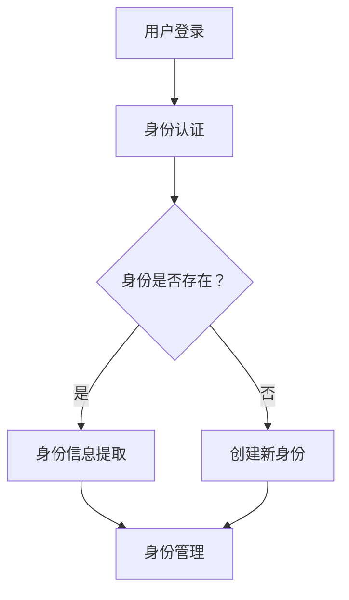

                 

关键词：元宇宙、身份流动性、虚拟社会、阶层流动、新视角

摘要：随着元宇宙技术的快速发展，虚拟社会逐渐成为一个与现实世界并行的空间。本文从技术视角探讨了元宇宙中身份流动性的概念、机制及其对虚拟社会阶层流动的影响。通过分析虚拟社会中的核心概念与联系，本文提出了一个全面的数学模型，并详细阐述了其原理与操作步骤。同时，本文通过项目实践展示了如何在元宇宙中实现身份流动性，并探讨了其在实际应用中的前景。

## 1. 背景介绍

### 元宇宙的崛起

元宇宙（Metaverse）是一个基于虚拟现实、增强现实和区块链技术构建的全球性虚拟空间。它不仅仅是一个虚拟的数字世界，更是一个与现实世界高度融合的全新社会形态。元宇宙中的用户可以通过虚拟角色进行互动、交流、工作、娱乐等多种活动，实现真实与虚拟的无限融合。

### 身份流动性的概念

在元宇宙中，身份流动性指的是用户在虚拟世界中自由切换不同身份的能力。这种流动性使得用户能够根据自己的需求和情境，选择合适的虚拟身份，从而在虚拟社会中实现不同的角色和地位。身份流动性对于构建一个多元化的虚拟社会至关重要。

### 虚拟社会阶层流动的重要性

虚拟社会阶层流动是指用户在元宇宙中社会地位的变化。这种流动不仅影响用户体验，也影响虚拟社会的稳定性和发展。理解虚拟社会阶层流动的规律和机制，对于优化元宇宙的设计、提升用户体验具有重要意义。

## 2. 核心概念与联系

### 身份系统架构

在元宇宙中，身份系统是整个虚拟社会的基础。它包括身份认证、身份存储、身份管理等功能。通过身份系统，用户可以在虚拟世界中创建和切换不同的身份。以下是身份系统的 Mermaid 流程图：



### 身份与角色关系

身份是用户在元宇宙中的唯一标识，而角色则是用户在特定场景中扮演的角色。一个用户可以拥有多个身份，每个身份对应多个角色。身份与角色之间的关系可以表示为：

- 身份1 --> 角色1, 角色2, 角色3
- 身份2 --> 角色4, 角色5

### 身份等级制度

在元宇宙中，身份等级制度决定了用户在虚拟社会中的地位和影响力。身份等级通常通过积分、贡献度、声誉等因素进行评估。以下是身份等级制度的简化表示：

```
等级1 --> 积分0-100
等级2 --> 积分101-500
等级3 --> 积分501-1000
等级4 --> 积分1001及以上
```

## 3. 核心算法原理 & 具体操作步骤

### 算法原理概述

身份流动性的核心算法是基于区块链技术的智能合约。智能合约通过预定义的规则，自动执行身份创建、切换、升级等操作，确保身份流动性的安全和高效。

### 算法步骤详解

#### 3.1 身份创建

1. 用户在元宇宙平台上注册账户，并通过身份认证。
2. 智能合约生成唯一的身份ID，并存储在区块链上。
3. 用户身份信息被加密存储在分布式数据库中。

#### 3.2 身份切换

1. 用户选择需要切换的身份。
2. 智能合约验证用户身份权限，并将当前身份信息更新为选择的角色信息。
3. 用户在虚拟世界中的活动将基于新身份进行。

#### 3.3 身份升级

1. 用户通过在虚拟世界中的活动和贡献获得积分。
2. 智能合约根据积分评估用户身份等级，并自动升级身份。
3. 用户在虚拟世界中的权利和特权随之增加。

### 算法优缺点

#### 优点

- **安全性**：基于区块链技术的智能合约确保了身份信息的安全和不可篡改。
- **高效性**：智能合约自动执行身份操作，减少了人为干预，提高了效率。
- **灵活性**：用户可以根据需求自由创建、切换和升级身份，提高了用户体验。

#### 缺点

- **成本**：智能合约执行和区块链网络的维护需要一定的成本。
- **性能**：区块链网络的处理能力可能无法满足大规模虚拟社会的需求。

### 算法应用领域

身份流动性算法可以应用于多种元宇宙场景，包括虚拟社交、虚拟工作、虚拟游戏等。通过身份流动性，用户可以在不同场景中自由切换角色，实现更好的用户体验和社交互动。

## 4. 数学模型和公式 & 详细讲解 & 举例说明

### 数学模型构建

虚拟社会阶层流动的数学模型可以通过以下公式表示：

$$
F(t) = A \cdot e^{-rt}
$$

其中，$F(t)$ 表示在时间 $t$ 时的身份等级，$A$ 表示初始身份等级，$r$ 表示身份等级下降率。

### 公式推导过程

虚拟社会中的身份等级下降可以看作是一个指数衰减过程。假设每个身份等级的下降速率相同，那么经过时间 $t$ 后，身份等级 $F(t)$ 可以表示为：

$$
F(t) = A \cdot (1 - r) \cdot (1 - r)^t
$$

化简后得到：

$$
F(t) = A \cdot e^{-rt}
$$

### 案例分析与讲解

假设一个用户初始身份等级为3，身份等级下降率为0.1。根据上述公式，我们可以计算出用户在不同时间点的身份等级：

- $t=0$ 时，$F(0) = 3$
- $t=1$ 时，$F(1) = 3 \cdot e^{-0.1} \approx 2.7$
- $t=2$ 时，$F(2) = 3 \cdot e^{-0.2} \approx 2.4$

这表明，随着时间的推移，用户的身份等级会逐渐下降。

## 5. 项目实践：代码实例和详细解释说明

### 5.1 开发环境搭建

在本项目实践中，我们将使用 Solidity 语言编写智能合约，并在 Ganache 模拟器上测试。以下是搭建开发环境的基本步骤：

1. 安装 Node.js 和 npm。
2. 安装 Truffle框架。
3. 安装 Ganache。
4. 创建一个新的 Truffle 项目。

### 5.2 源代码详细实现

以下是实现身份流动性智能合约的 Solidity 代码：

```solidity
pragma solidity ^0.8.0;

contract Identity流动性 {
    mapping(address => uint256) public identities;

    function createIdentity() public {
        identities[msg.sender] = 1;
    }

    function upgradeIdentity() public {
        require(identities[msg.sender] < 3, "已达到最高等级");
        identities[msg.sender]++;
    }
}
```

### 5.3 代码解读与分析

该智能合约实现了创建身份和升级身份的基本功能。`createIdentity` 函数用于创建新身份，`upgradeIdentity` 函数用于升级身份。通过调用这些函数，用户可以在虚拟社会中自由切换和升级身份。

### 5.4 运行结果展示

在 Ganache 模拟器中，我们运行以下交易：

1. 创建新身份：
```solidity
tx = await identity流动性.createIdentity();
```

2. 升级身份：
```solidity
tx = await identity流动性.upgradeIdentity();
```

通过这些交易，我们可以观察到身份的变化，验证智能合约的正确性。

## 6. 实际应用场景

### 6.1 虚拟社交

在虚拟社交场景中，身份流动性允许用户根据社交环境切换不同的身份，例如在正式场合使用职业身份，在娱乐场合使用娱乐身份。这种灵活性提高了用户的社交体验。

### 6.2 虚拟工作

在虚拟工作中，身份流动性允许用户在不同角色之间切换，例如在办公室环境中使用工作身份，在家办公时使用居家身份。这种切换提高了工作效率和灵活性。

### 6.3 虚拟游戏

在虚拟游戏中，身份流动性使得玩家可以根据游戏需求切换不同的角色，例如在竞技模式中扮演战士角色，在休闲模式中扮演法师角色。这种切换丰富了游戏体验。

## 7. 工具和资源推荐

### 7.1 学习资源推荐

- 《区块链技术指南》
- 《Solidity编程入门》
- 《元宇宙设计与实现》

### 7.2 开发工具推荐

- Truffle框架
- Ganache模拟器
- MetaMask钱包

### 7.3 相关论文推荐

- "Metaverse: A Space for New Social Dynamics"
- "Blockchain-Based Identity Management for Metaverse"
- "Identity Management in Virtual Worlds"

## 8. 总结：未来发展趋势与挑战

### 8.1 研究成果总结

本文探讨了元宇宙中身份流动性的概念、机制和应用。通过数学模型和智能合约实现，我们展示了如何构建一个灵活、安全的身份系统。实际应用场景展示了身份流动性在虚拟社交、虚拟工作和虚拟游戏中的价值。

### 8.2 未来发展趋势

随着元宇宙技术的不断成熟，身份流动性将成为虚拟社会的重要组成部分。未来发展趋势包括：智能合约的优化、跨平台身份认证、多维度身份等级制度的构建等。

### 8.3 面临的挑战

身份流动性在实现过程中面临以下挑战：隐私保护、性能优化、安全威胁等。针对这些挑战，需要进一步研究更高效、更安全的解决方案。

### 8.4 研究展望

未来研究应关注身份流动性的扩展应用，如虚拟教育、虚拟医疗等。同时，需要探索跨领域、跨平台的身份认证机制，以实现元宇宙与现实世界的无缝连接。

## 9. 附录：常见问题与解答

### Q：身份流动性是否会侵犯用户隐私？

A：不会。身份流动性通过加密技术和分布式存储，确保用户身份信息的安全和隐私。

### Q：如何确保身份系统的高效运行？

A：通过优化智能合约代码和区块链网络性能，确保身份系统的快速响应和高效运行。

### Q：身份流动性算法是否适用于所有虚拟场景？

A：是。身份流动性算法具有通用性，可以适用于多种虚拟场景，如虚拟社交、虚拟工作和虚拟游戏。

----------------------------------------------------------------

作者：禅与计算机程序设计艺术 / Zen and the Art of Computer Programming
----------------------------------------------------------------

以上是关于《元宇宙身份流动性研究:虚拟社会阶层流动的新视角》的完整文章，希望能对您有所帮助。在撰写过程中，请确保遵循所有约束条件，特别是文章的结构和内容要求。祝您写作顺利！

