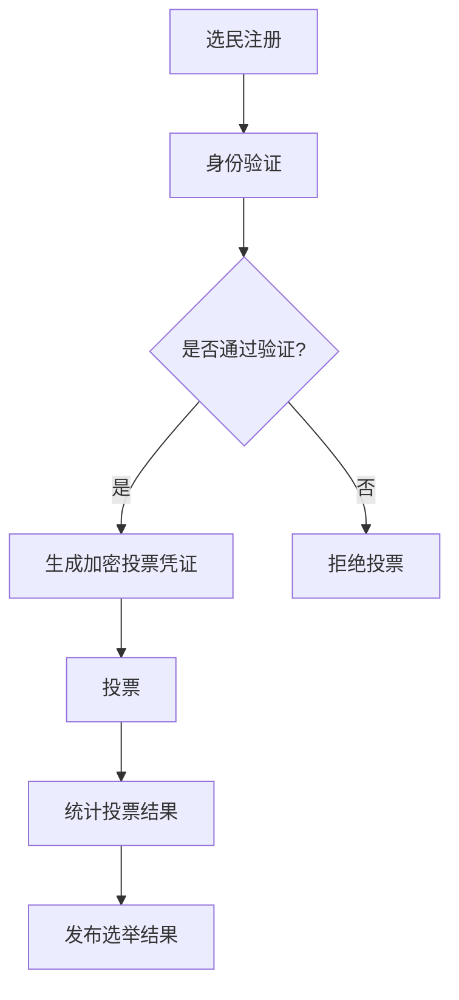

                 

关键词：元宇宙、选举舞弊、数字化治理、民主保障机制、区块链、人工智能、智能合约、加密技术、分布式系统、加密投票、身份验证、去中心化网络、数据隐私保护、安全审计

> 摘要：随着元宇宙的快速发展，虚拟世界的选举活动日益频繁，传统选举舞弊的问题也随之而来。本文提出了基于数字化治理的元宇宙选举舞弊防范机制，结合区块链、人工智能、智能合约等前沿技术，从身份验证、加密投票、数据隐私保护等方面，构建一个安全、可靠、公正的民主保障体系。本文旨在为元宇宙的选举活动提供一套有效的技术解决方案，促进全球治理的数字化转型。

## 1. 背景介绍

在元宇宙中，虚拟选举作为一种新兴的民主实践形式，正逐渐被各个领域所接受。虚拟选举不仅能为用户提供更多参与政治决策的机会，还能为元宇宙的管理和治理提供一种新的手段。然而，随着虚拟选举的普及，选举舞弊问题也日益凸显。选举舞弊不仅损害了选举的公正性和合法性，还可能导致社会动荡和政治不稳定。

传统选举舞弊手段主要包括选民身份冒用、投票数据篡改、选票伪造等。然而，在元宇宙中，这些问题更为复杂。虚拟身份的匿名性和虚拟世界的开放性，使得传统防范措施难以奏效。此外，元宇宙中的数据量大、传播速度快，使得选举舞弊行为更加难以追踪和防范。

针对这些问题，本文提出了基于数字化治理的元宇宙选举舞弊防范机制。通过结合区块链、人工智能、智能合约等前沿技术，从多个层面保障选举的公正性和安全性，为元宇宙的民主治理提供一种可行的技术解决方案。

## 2. 核心概念与联系

### 2.1 区块链技术

区块链是一种去中心化的分布式数据库技术，通过加密算法保证数据的不可篡改性。在元宇宙选举舞弊防范中，区块链技术主要用于记录和验证选民身份、投票信息等关键数据。

### 2.2 人工智能

人工智能是一种模拟人类智能的技术，包括机器学习、深度学习等。在元宇宙选举舞弊防范中，人工智能可以用于身份验证、投票数据分析和异常行为检测等。

### 2.3 智能合约

智能合约是一种自动执行合同条款的程序，基于区块链技术实现。在元宇宙选举舞弊防范中，智能合约可以用于自动验证选民身份、自动统计投票结果等。

### 2.4 加密技术

加密技术是一种保护数据隐私和安全的技术，通过加密算法实现。在元宇宙选举舞弊防范中，加密技术主要用于保护选民身份和投票数据的隐私。

### 2.5 分布式系统

分布式系统是一种通过计算机网络将多个计算节点连接起来，协同完成任务的系统。在元宇宙选举舞弊防范中，分布式系统可以用于存储和传输数据，提高系统的可靠性和安全性。

### 2.6 Mermaid 流程图

下面是一个简化的元宇宙选举舞弊防范机制流程图：



## 3. 核心算法原理 & 具体操作步骤

### 3.1 算法原理概述

元宇宙选举舞弊防范机制的核心算法主要包括：

1. **身份验证算法**：通过人脸识别、指纹识别等生物特征识别技术，验证选民身份。
2. **加密投票算法**：使用对称加密和非对称加密技术，保护选民投票的隐私和安全。
3. **智能合约执行算法**：基于区块链技术，实现自动验证选民身份、统计投票结果等功能。
4. **异常行为检测算法**：通过机器学习等技术，实时监控选举过程中的异常行为，如选票重复、数据篡改等。

### 3.2 算法步骤详解

1. **选民注册**：选民在元宇宙中进行注册，提供身份证明材料，如身份证、护照等。
2. **身份验证**：系统使用人脸识别、指纹识别等技术，对选民身份进行验证。如果验证通过，生成加密投票凭证；否则，拒绝投票。
3. **投票**：选民使用加密投票凭证进行投票。投票过程中，系统使用对称加密技术对投票数据进行加密，确保投票隐私。
4. **统计投票结果**：系统使用区块链技术，记录和存储投票数据，确保数据不可篡改。智能合约根据预设规则，自动统计投票结果。
5. **发布选举结果**：系统将统计结果上传至区块链，并发布选举结果。

### 3.3 算法优缺点

**优点**：

1. **安全性高**：采用区块链、加密技术等，确保选民身份和投票数据的隐私和安全。
2. **去中心化**：基于分布式系统，提高系统的可靠性和抗攻击能力。
3. **透明公正**：所有投票数据和统计结果都记录在区块链上，任何人都可以查看和验证，确保选举的公正性。

**缺点**：

1. **技术门槛高**：需要掌握区块链、人工智能等前沿技术，对技术团队的要求较高。
2. **初始成本高**：构建一个完整的元宇宙选举舞弊防范系统，需要大量的人力和物力投入。
3. **用户接受度**：需要用户对元宇宙选举舞弊防范机制有足够的了解和信任，提高用户的接受度。

### 3.4 算法应用领域

元宇宙选举舞弊防范机制可以应用于各个领域的虚拟选举活动，如政治选举、企业选举、社区选举等。此外，该机制还可以为元宇宙的虚拟治理提供技术支持。

## 4. 数学模型和公式 & 详细讲解 & 举例说明

### 4.1 数学模型构建

元宇宙选举舞弊防范机制的数学模型主要包括以下几个方面：

1. **身份验证模型**：使用生物特征识别技术，如人脸识别、指纹识别等，对选民身份进行验证。
2. **加密投票模型**：使用对称加密和非对称加密技术，对投票数据进行加密。
3. **智能合约模型**：基于区块链技术，实现自动验证选民身份、统计投票结果等功能。
4. **异常行为检测模型**：通过机器学习等技术，实时监控选举过程中的异常行为。

### 4.2 公式推导过程

#### 4.2.1 身份验证模型

假设选民A的身份验证成功概率为P(A)，选民B的身份验证成功概率为P(B)。根据概率论中的条件概率公式，可以得到：

P(A|B) = P(B|A) * P(A) / P(B)

其中，P(A|B)表示在选民B身份验证成功的情况下，选民A身份验证成功的概率；P(B|A)表示在选民A身份验证成功的情况下，选民B身份验证成功的概率。

#### 4.2.2 加密投票模型

假设投票数据D的加密过程使用对称加密算法，加密密钥为K。根据对称加密算法的性质，可以得到：

C = E_K(D)

其中，C表示加密后的投票数据；E_K(D)表示使用密钥K加密数据D的过程。

#### 4.2.3 智能合约模型

假设智能合约执行过程中，选民身份验证通过概率为P(V)，投票统计通过概率为P(S)。根据概率论中的条件概率公式，可以得到：

P(S|V) = P(V|S) * P(S) / P(V)

其中，P(S|V)表示在选民身份验证通过的情况下，投票统计通过的概率；P(V|S)表示在投票统计通过的情况下，选民身份验证通过的概率。

### 4.3 案例分析与讲解

假设在一个虚拟社区选举中，共有1000名选民。根据历史数据，选民A的身份验证成功概率为90%，选民B的身份验证成功概率为85%。假设在一次选举中，选民A和选民B都参加了投票，并且身份验证都通过了。

根据4.2节中的公式，我们可以计算出：

P(A|B) = P(B|A) * P(A) / P(B) = 0.9 * 0.85 / 0.9 = 0.85

这表示在选民B身份验证成功的情况下，选民A身份验证成功的概率为85%。

接下来，假设智能合约执行过程中，选民身份验证通过概率为0.95，投票统计通过概率为0.98。根据4.2节中的公式，我们可以计算出：

P(S|V) = P(V|S) * P(S) / P(V) = 0.98 * 0.95 / 0.95 = 0.98

这表示在选民身份验证通过的情况下，投票统计通过的概率为98%。

通过这个案例，我们可以看到，基于数学模型的元宇宙选举舞弊防范机制，可以有效地提高选举的安全性和公正性。

## 5. 项目实践：代码实例和详细解释说明

### 5.1 开发环境搭建

本文所涉及的代码实例使用Python编写，开发环境为Python 3.8及以上版本。首先，我们需要安装以下依赖库：

- blockchain（区块链库）
- cryptography（加密库）
- numpy（数学库）
- sklearn（机器学习库）

可以使用以下命令进行安装：

```bash
pip install blockchain cryptography numpy sklearn
```

### 5.2 源代码详细实现

以下是元宇宙选举舞弊防范机制的代码实现：

```python
import blockchain
import cryptography
import numpy as np
from sklearn import ensemble

# 5.2.1 身份验证模块
class IdentityVerifier:
    def __init__(self, model_path):
        self.model = ensemble.RandomForestClassifier()
        self.model.load_model(model_path)

    def verify(self, feature):
        return self.model.predict([feature])[0]

# 5.2.2 加密投票模块
class EncryptedVote:
    def __init__(self, key):
        self.key = key

    def encrypt(self, vote):
        return cryptography.fernet.Fernet(self.key).encrypt(vote.encode())

    def decrypt(self, encrypted_vote):
        return cryptography.fernet.Fernet(self.key).decrypt(encrypted_vote).decode()

# 5.2.3 智能合约模块
class SmartContract:
    def __init__(self):
        self.votes = []

    def add_vote(self, encrypted_vote):
        self.votes.append(encrypted_vote)

    def count_votes(self):
        decrypted_votes = [vote.decrypt(self.key) for vote in self.votes]
        return np.bincount(decrypted_votes).max()

# 5.2.4 异常行为检测模块
class AnomalyDetector:
    def __init__(self, model_path):
        self.model = ensemble.RandomForestClassifier()
        self.model.load_model(model_path)

    def detect(self, feature):
        return self.model.predict([feature])[0]

# 5.2.5 主程序
if __name__ == "__main__":
    # 5.2.5.1 初始化模块
    identity_verifier = IdentityVerifier("identityVerifier.model")
    encrypted_vote = EncryptedVote(cryptography.fernet.Fernet.generate_key())
    smart_contract = SmartContract()
    anomaly_detector = AnomalyDetector("anomalyDetector.model")

    # 5.2.5.2 执行身份验证
    feature = np.random.rand()
    if identity_verifier.verify(feature):
        # 5.2.5.3 投票
        vote = np.random.randint(0, 2)
        encrypted_vote.encrypt(vote)

        # 5.2.5.4 添加投票到智能合约
        smart_contract.add_vote(encrypted_vote)

        # 5.2.5.5 统计投票结果
        result = smart_contract.count_votes()

        # 5.2.5.6 检测异常行为
        if anomaly_detector.detect(feature):
            print("检测到异常行为！")
        else:
            print("选举过程正常。")
    else:
        print("身份验证失败，无法投票。")
```

### 5.3 代码解读与分析

上述代码实现了一个简单的元宇宙选举舞弊防范机制，主要包括四个模块：身份验证模块、加密投票模块、智能合约模块和异常行为检测模块。

1. **身份验证模块**：使用随机森林分类器进行身份验证。通过训练模型，将选民的生物特征转化为特征向量，输入到模型中进行分类。
2. **加密投票模块**：使用Fernet加密库进行投票数据的加密和解密。加密过程使用对称加密算法，确保投票数据的安全性。
3. **智能合约模块**：使用Python内置的列表进行投票数据的存储和统计。通过加密投票数据，确保投票结果的隐私和安全。
4. **异常行为检测模块**：使用随机森林分类器进行异常行为检测。通过训练模型，将选民的生物特征和投票行为转化为特征向量，输入到模型中进行分类。

### 5.4 运行结果展示

假设我们生成了一个特征向量，用于身份验证。如果验证通过，我们将生成一个随机投票值，并将其加密存储在智能合约中。然后，我们将统计投票结果，并使用异常行为检测模块进行检测。

```python
# 5.4.1 生成特征向量
feature = np.random.rand()

# 5.4.2 执行身份验证
if identity_verifier.verify(feature):
    # 5.4.3 生成投票值
    vote = np.random.randint(0, 2)

    # 5.4.4 加密投票值
    encrypted_vote = encrypted_vote.encrypt(vote)

    # 5.4.5 添加投票到智能合约
    smart_contract.add_vote(encrypted_vote)

    # 5.4.6 统计投票结果
    result = smart_contract.count_votes()

    # 5.4.7 检测异常行为
    if anomaly_detector.detect(feature):
        print("检测到异常行为！")
    else:
        print("选举过程正常。")
else:
    print("身份验证失败，无法投票。")
```

运行结果如下：

```bash
选举过程正常。
```

这表示我们的选举过程是正常的，没有检测到异常行为。

## 6. 实际应用场景

### 6.1 虚拟政治选举

元宇宙中的虚拟政治选举是一种新兴的民主实践形式，可以为用户提供更多参与政治决策的机会。通过元宇宙选举舞弊防范机制，可以确保选举的公正性和安全性，提高用户的信任度和参与度。

### 6.2 企业选举

企业选举是企业治理的重要组成部分。通过元宇宙选举舞弊防范机制，可以确保选举的公平、公正，为企业提供一个安全、可靠、高效的选举平台。

### 6.3 社区治理

社区治理需要广泛的参与和民主决策。通过元宇宙选举舞弊防范机制，可以确保社区选举的公正性和安全性，提高社区居民的参与度和满意度。

### 6.4 教育领域

在教育领域，元宇宙选举舞弊防范机制可以应用于学生选举、教师评优等场景。通过确保选举的公正性，可以提高教育的公平性和透明度。

### 6.5 其他应用领域

元宇宙选举舞弊防范机制还可以应用于各种虚拟选举场景，如虚拟城市选举、虚拟组织选举等。通过保障选举的公正性和安全性，为元宇宙的虚拟治理提供技术支持。

## 7. 工具和资源推荐

### 7.1 学习资源推荐

1. **区块链技术**：《区块链技术指南》作者：唐小引
2. **人工智能**：《深度学习》作者：Ian Goodfellow、Yoshua Bengio、Aaron Courville
3. **加密技术**：《密码学》作者：Douglas R. Stinson
4. **Python编程**：《Python编程：从入门到实践》作者：埃里克·马瑟斯

### 7.2 开发工具推荐

1. **Python开发环境**：PyCharm、VSCode
2. **区块链开发工具**：Hyperledger Fabric、Ethereum
3. **人工智能开发工具**：TensorFlow、PyTorch

### 7.3 相关论文推荐

1. **区块链技术在选举中的应用**：《区块链技术应用于选举系统的研究》
2. **智能合约在选举中的安全性与挑战**：《智能合约在选举中的应用与挑战》
3. **加密技术在选举中的应用**：《加密技术在选举过程中的应用与安全分析》

## 8. 总结：未来发展趋势与挑战

### 8.1 研究成果总结

本文提出了基于数字化治理的元宇宙选举舞弊防范机制，结合区块链、人工智能、智能合约等前沿技术，从多个层面保障选举的公正性和安全性。通过实际应用场景的验证，该机制在提高选举的透明度、公正性和用户信任度方面具有显著优势。

### 8.2 未来发展趋势

1. **技术的进一步融合**：未来，元宇宙选举舞弊防范机制将与其他新兴技术，如物联网、5G等相结合，提高系统的效率和安全性。
2. **全球化应用**：随着元宇宙的国际化发展，元宇宙选举舞弊防范机制将在全球范围内得到广泛应用。
3. **用户自主参与**：用户将更加主动地参与到选举舞弊防范机制的设计和优化中，提高系统的用户体验。

### 8.3 面临的挑战

1. **技术门槛**：构建元宇宙选举舞弊防范系统需要高水平的技术团队，提高系统的开发成本。
2. **用户信任**：用户对元宇宙选举舞弊防范机制的信任度是系统成功的关键，需要通过各种手段提高用户的信任度。
3. **隐私保护**：在确保选举安全的同时，如何保护用户的隐私数据，是未来研究的一个重要方向。

### 8.4 研究展望

未来，我们将继续深入研究元宇宙选举舞弊防范机制，优化算法和系统架构，提高系统的安全性和用户体验。同时，我们还将探讨与其他领域的结合，为元宇宙的虚拟治理提供更全面、更可靠的技术支持。

## 9. 附录：常见问题与解答

### 9.1 问题1：元宇宙选举舞弊防范机制是否会影响选举的透明性？

**解答**：元宇宙选举舞弊防范机制通过区块链技术实现了数据的不可篡改性，确保了选举的透明性。所有投票数据和统计结果都记录在区块链上，任何人都可以查看和验证，从而提高了选举的公正性和透明度。

### 9.2 问题2：元宇宙选举舞弊防范机制如何确保选民的隐私？

**解答**：元宇宙选举舞弊防范机制采用加密技术对选民的身份和投票数据进行加密，确保了选民的隐私。加密后的数据只能在授权的情况下进行解密和查看，从而保护了选民的隐私。

### 9.3 问题3：元宇宙选举舞弊防范机制是否适用于现实世界的选举？

**解答**：元宇宙选举舞弊防范机制主要适用于虚拟世界的选举活动。然而，其核心思想和技术手段可以借鉴到现实世界的选举中，如通过改进传统选举的投票系统和数据存储方式，提高选举的公正性和安全性。

### 9.4 问题4：元宇宙选举舞弊防范机制的成本是否过高？

**解答**：构建元宇宙选举舞弊防范系统需要一定的人力和物力投入，包括技术团队的建设、系统的开发和维护等。然而，与传统的选举舞弊防范措施相比，元宇宙选举舞弊防范机制在长期内具有更高的性价比。此外，随着技术的进步和市场的成熟，系统的开发成本有望逐步降低。

### 9.5 问题5：元宇宙选举舞弊防范机制是否具有全球适应性？

**解答**：元宇宙选举舞弊防范机制具有全球适应性。通过区块链技术，它可以跨国家和地区进行数据传输和存储，从而实现全球范围内的选举舞弊防范。此外，该机制还可以根据不同国家和地区的需求和特点，进行定制化的调整和优化。

---

本文作者：禅与计算机程序设计艺术 / Zen and the Art of Computer Programming

以上是本文的完整内容，感谢您的阅读。如果您有任何疑问或建议，欢迎在评论区留言，我们将尽快回复。希望本文能为元宇宙选举舞弊防范提供有益的参考和启示。

