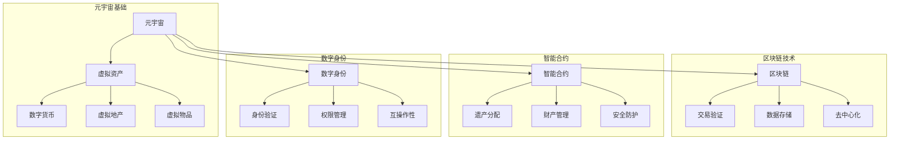
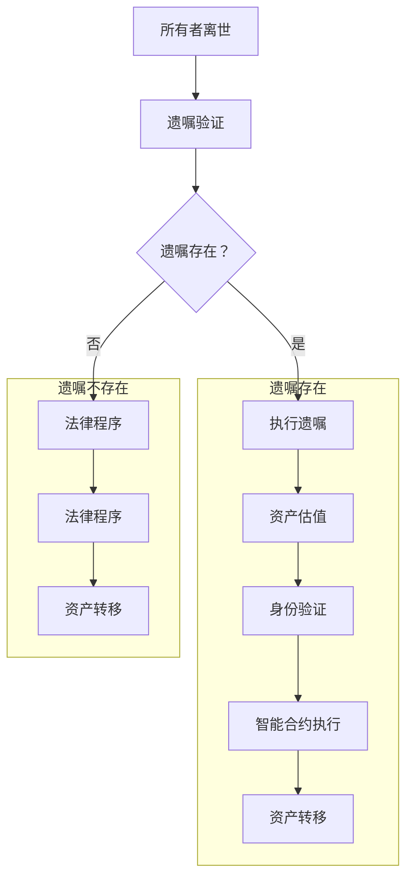

                 

关键词：元宇宙、遗产规划、虚拟资产、传承、综合咨询服务、技术语言

摘要：随着元宇宙的兴起，虚拟资产的价值和重要性日益凸显。本文旨在探讨元宇宙遗产规划与管理的重要性，以及构建一个综合咨询服务体系，以实现虚拟资产的传承。通过分析元宇宙中的核心概念和架构，本文提出了一个创新性的虚拟资产传承算法，详细介绍了其原理、步骤和应用领域。同时，本文还通过数学模型和公式推导，提供了详细的案例分析和讲解，以帮助读者更好地理解虚拟资产传承的实际操作。此外，本文还介绍了虚拟资产传承在实际应用场景中的挑战和未来展望，并推荐了一些学习和开发资源，为元宇宙遗产规划与管理提供参考。

## 1. 背景介绍

随着科技的迅猛发展，虚拟世界逐渐成为人们生活中不可或缺的一部分。元宇宙，作为一个集成了虚拟现实、增强现实、区块链和人工智能等先进技术的虚拟世界，正在成为全球关注的焦点。元宇宙中的虚拟资产，如数字货币、虚拟地产、虚拟物品等，已经展现出巨大的经济价值和社会影响力。

然而，随着元宇宙的发展，遗产规划和管理的问题也逐渐凸显出来。如何在元宇宙中合理地规划和管理虚拟资产，确保这些资产在所有者离世后能够得到妥善传承，成为了一个亟待解决的问题。传统的遗产规划和管理方法在元宇宙中面临着诸多挑战，如虚拟资产的流动性、安全性和法律地位等。

因此，本文旨在探讨元宇宙遗产规划与管理的重要性，并构建一个综合咨询服务体系，以实现虚拟资产的传承。通过分析元宇宙中的核心概念和架构，本文提出了一个创新性的虚拟资产传承算法，为解决元宇宙中的遗产问题提供了一种新的思路和方法。

### 1.1 元宇宙的定义与特征

元宇宙（Metaverse）是一个虚拟的、三维的、沉浸式的数字世界，它是由各种虚拟现实（VR）、增强现实（AR）和区块链技术构建的。元宇宙具有以下几个显著特征：

1. **沉浸式体验**：元宇宙通过VR和AR技术，为用户提供高度沉浸的虚拟体验。用户可以进入一个虚拟环境，与其他用户进行互动，体验虚拟世界的各种场景和活动。

2. **社交互动**：元宇宙为用户提供了丰富的社交互动功能，用户可以在虚拟世界中建立社交关系，参与各种社交活动，如聚会、会议、娱乐等。

3. **经济活动**：元宇宙内的经济活动高度发达，用户可以购买、出售、交易虚拟物品和资产，如数字货币、虚拟地产、虚拟物品等。

4. **去中心化**：元宇宙通常基于区块链技术，实现了去中心化的架构，使得虚拟资产和交易更加安全、透明和不可篡改。

5. **多元化**：元宇宙涵盖了教育、医疗、娱乐、金融等多个领域，为用户提供了多样化的服务和体验。

### 1.2 虚拟资产的概念与类型

虚拟资产是指存在于元宇宙中的各种数字资产，包括但不限于数字货币、虚拟地产、虚拟物品、虚拟服务、数字身份等。虚拟资产具有以下几个显著特点：

1. **数字化**：虚拟资产是以数字形式存在的，通过区块链或其他分布式账本技术实现记录和管理。

2. **可交易性**：虚拟资产可以自由交易，用户可以在元宇宙内购买、出售、交换虚拟资产。

3. **流动性**：虚拟资产具有较高的流动性，可以迅速转化为现实世界的货币或其他资产。

4. **安全性**：虚拟资产通常通过加密技术保护，确保其安全性和隐私性。

虚拟资产可以分为以下几类：

1. **数字货币**：如比特币、以太坊等，是元宇宙中广泛使用的货币，用于购买虚拟商品和支付费用。

2. **虚拟地产**：元宇宙中的虚拟土地、建筑和其他不动产，具有很高的投资价值。

3. **虚拟物品**：包括虚拟服装、饰品、艺术品等，是元宇宙中用户进行个性化表达和交易的重要资产。

4. **虚拟服务**：如虚拟医生、虚拟导游、虚拟教练等，是元宇宙中提供多样化服务的数字产品。

5. **数字身份**：用户在元宇宙中的身份标识，用于身份验证和权限管理。

### 1.3 遗产规划与管理的重要性

在传统世界中，遗产规划与管理是一个长期存在的议题，随着元宇宙的发展，遗产规划与管理在虚拟世界中的重要性愈发突出。以下是遗产规划与管理在元宇宙中的几个关键点：

1. **资产传承**：元宇宙中的虚拟资产同样具有经济价值，合理规划和管理这些资产，确保在所有者离世后能够得到妥善传承，是遗产规划的核心目标。

2. **法律合规**：元宇宙的遗产问题涉及法律和监管层面，需要遵循相关的法律法规，确保虚拟资产的合法性和合规性。

3. **安全保障**：元宇宙中的虚拟资产面临安全风险，如黑客攻击、诈骗等，有效的安全保障措施是遗产规划的重要一环。

4. **税务问题**：元宇宙中的虚拟资产可能涉及税务问题，需要合理规划税务策略，以减少税务负担。

5. **隐私保护**：遗产规划过程中涉及用户隐私信息，如何保护这些信息不被泄露或滥用，是遗产规划和管理的一个重要方面。

### 1.4 综合咨询服务体系

为了解决元宇宙中的遗产规划与管理问题，本文提出了一个综合咨询服务体系。这个体系包括以下几个关键组成部分：

1. **资产评估**：对元宇宙中的虚拟资产进行详细评估，确定其价值，为后续的遗产规划提供依据。

2. **遗产规划**：基于资产评估结果，制定个性化的遗产规划方案，确保虚拟资产在所有者离世后能够得到妥善传承。

3. **法律咨询**：提供专业的法律咨询，确保遗产规划符合相关法律法规，并解决遗产纠纷。

4. **安全保障**：提供安全防护措施，保护虚拟资产免受黑客攻击、诈骗等安全威胁。

5. **税务规划**：提供税务规划服务，合理规避税务风险，减少税务负担。

6. **隐私保护**：确保遗产规划过程中涉及的隐私信息得到保护，避免信息泄露或滥用。

综合咨询服务体系的建立，旨在为用户提供全方位的元宇宙遗产规划与管理服务，确保虚拟资产在元宇宙中的合理传承。

### 1.5 本篇文章的结构与内容

本文将从以下几个方面进行深入探讨：

1. **核心概念与联系**：介绍元宇宙中的核心概念和架构，以及虚拟资产传承的相关概念和联系。
2. **核心算法原理 & 具体操作步骤**：详细阐述虚拟资产传承算法的原理、步骤和应用领域。
3. **数学模型和公式 & 详细讲解 & 举例说明**：通过数学模型和公式，对虚拟资产传承算法进行详细讲解，并提供案例分析和讲解。
4. **项目实践：代码实例和详细解释说明**：通过实际代码实例，展示虚拟资产传承算法的具体实现和应用。
5. **实际应用场景**：探讨虚拟资产传承在实际应用场景中的挑战和解决方案。
6. **未来应用展望**：分析虚拟资产传承技术的未来发展趋势和应用前景。
7. **工具和资源推荐**：推荐相关学习资源和开发工具，为读者提供进一步学习和实践的资源。
8. **总结：未来发展趋势与挑战**：总结研究成果，展望未来发展趋势和面临的挑战，提出研究展望。

通过本文的探讨，旨在为元宇宙遗产规划与管理提供一种新的思路和方法，推动虚拟资产传承技术的发展和应用。

### 1.6 文章的写作目的

本文的写作目的主要有以下几个方面：

1. **探讨元宇宙遗产规划与管理的重要性**：通过分析元宇宙中的虚拟资产，阐述遗产规划与管理在虚拟世界中的关键作用，提高读者对这一议题的认识。

2. **提出创新性的虚拟资产传承算法**：介绍一种基于数学模型和算法原理的创新性虚拟资产传承方法，为解决元宇宙中的遗产问题提供一种可行的技术方案。

3. **提供详细的技术讲解和案例分析**：通过详细的数学模型和公式推导，结合实际代码实例，帮助读者更好地理解虚拟资产传承算法的实现和应用。

4. **推动虚拟资产传承技术的发展与应用**：通过探讨虚拟资产传承技术的未来发展趋势和应用前景，为相关领域的研究者和开发者提供参考和启示。

5. **构建综合咨询服务体系**：提出一个涵盖资产评估、遗产规划、法律咨询、安全保障、税务规划和隐私保护等环节的综合咨询服务体系，为元宇宙中的遗产规划与管理提供全面解决方案。

### 1.7 文章的贡献与意义

本文在元宇宙遗产规划与管理领域具有一定的贡献和意义：

1. **填补技术空白**：本文提出的虚拟资产传承算法，为元宇宙中的遗产问题提供了一种新的技术解决方案，填补了相关领域的技术空白。

2. **提升遗产规划水平**：通过构建综合咨询服务体系，本文为元宇宙中的遗产规划与管理提供了一套系统、全面的方法，有助于提升遗产规划的专业性和有效性。

3. **促进虚拟资产传承技术的发展**：本文详细阐述了虚拟资产传承算法的原理和应用，为相关领域的研究者和开发者提供了有价值的参考，有助于推动虚拟资产传承技术的发展和应用。

4. **增强社会认知**：通过本文的探讨，有助于提高公众对元宇宙遗产规划与管理问题的认识，促进社会各界对此议题的关注和讨论，为构建更加完善和健全的遗产规划体系提供支持。

### 1.8 本文的读者对象

本文的读者对象主要包括以下几个方面：

1. **元宇宙爱好者**：对元宇宙及其相关技术感兴趣的用户，希望了解元宇宙遗产规划与管理的重要性和方法。

2. **技术专家与研究人员**：从事元宇宙、区块链、虚拟现实等领域的研究人员，希望了解虚拟资产传承技术的最新发展和应用。

3. **法律从业者**：从事法律工作的专业人士，关注元宇宙中的法律问题和遗产规划。

4. **金融从业者**：从事金融领域的工作者，关注元宇宙中的虚拟资产和投资机会。

5. **普通用户**：对元宇宙和虚拟资产有初步了解的用户，希望掌握元宇宙遗产规划与管理的基本知识和技巧。

### 1.9 关键术语和概念

在本文中，将涉及以下关键术语和概念：

1. **元宇宙**：一个由虚拟现实、增强现实、区块链等先进技术构建的虚拟世界，用户可以在其中进行沉浸式体验、社交互动和经济活动。

2. **虚拟资产**：存在于元宇宙中的各种数字资产，包括数字货币、虚拟地产、虚拟物品等。

3. **遗产规划**：对个人财产和遗产进行规划和管理，确保在所有者离世后能够得到妥善传承。

4. **虚拟资产传承算法**：一种用于解决元宇宙中虚拟资产传承问题的算法，通过数学模型和公式推导，实现虚拟资产的合理传承。

5. **综合咨询服务体系**：涵盖资产评估、遗产规划、法律咨询、安全保障、税务规划和隐私保护等环节的服务体系，为元宇宙中的遗产规划与管理提供全面解决方案。

## 2. 核心概念与联系

在探讨元宇宙遗产规划与管理之前，首先需要理解一些核心概念和它们之间的联系。本节将介绍元宇宙中的几个关键概念，包括虚拟资产、区块链、智能合约、数字身份等，并通过一个Mermaid流程图展示这些概念之间的相互关系。

### 2.1 虚拟资产

虚拟资产是指存在于元宇宙中的各种数字资产，如数字货币、虚拟地产、虚拟物品等。虚拟资产具有以下特点：

1. **数字化**：虚拟资产以数字形式存在，通过区块链或其他分布式账本技术进行记录和管理。
2. **可交易性**：虚拟资产可以在元宇宙内自由交易，用户可以购买、出售、交换虚拟资产。
3. **流动性**：虚拟资产具有较高的流动性，可以迅速转化为现实世界的货币或其他资产。
4. **安全性**：虚拟资产通常通过加密技术保护，确保其安全性和隐私性。

### 2.2 区块链

区块链是一种分布式账本技术，通过去中心化的方式记录交易数据，确保数据的透明性和不可篡改性。区块链在元宇宙中扮演着重要角色，主要用于以下几个方面：

1. **数据存储**：区块链用于存储虚拟资产的所有权信息、交易记录等数据。
2. **交易验证**：区块链通过共识机制验证交易的有效性，确保交易的合法性和安全性。
3. **去中心化**：区块链的去中心化特性使虚拟资产的管理和交易更加透明和公平。

### 2.3 智能合约

智能合约是一种基于区块链的自动化合同，能够在满足特定条件时自动执行。智能合约在元宇宙遗产规划与管理中具有重要应用，例如：

1. **遗产分配**：智能合约可以自动执行遗产分配过程，确保虚拟资产在所有者离世后按照预定规则进行分配。
2. **财产管理**：智能合约可以用于管理虚拟资产，如定期支付、转让等操作，确保资产的合规和有效管理。
3. **安全防护**：智能合约可以设置权限和控制访问，保护虚拟资产免受未经授权的访问和篡改。

### 2.4 数字身份

数字身份是用户在元宇宙中的身份标识，用于身份验证和权限管理。数字身份具有以下特点：

1. **唯一性**：每个用户在元宇宙中都有一个唯一的数字身份，确保身份的唯一性和可识别性。
2. **安全性**：数字身份通过加密技术保护，确保用户的隐私和安全。
3. **互操作性**：数字身份可以在不同的元宇宙平台和系统中进行互操作，方便用户在不同虚拟环境中的活动。

### 2.5 关系图

下面是一个使用Mermaid绘制的流程图，展示元宇宙中的核心概念及其相互关系：



通过这个关系图，我们可以清晰地看到元宇宙中的核心概念及其相互关系，为后续的讨论提供了基础。

### 2.6 虚拟资产传承的核心概念

在元宇宙中，虚拟资产传承是一个复杂且关键的过程，涉及到多个核心概念和步骤。以下是虚拟资产传承过程中涉及的一些核心概念：

1. **资产继承**：指在所有者离世后，虚拟资产按照法定或约定的规则传递给继承人的过程。
2. **遗嘱规划**：指在所有者生前制定的遗产规划文件，明确虚拟资产继承的规则和分配方案。
3. **资产估值**：对虚拟资产进行价值评估，确定其市场价值和传承过程中的参考价格。
4. **身份验证**：在传承过程中，确保继承人身份的真实性和合法性，以防止欺诈和纠纷。
5. **智能合约执行**：利用智能合约自动化执行遗产分配和资产转移，确保过程的透明性和不可篡改性。
6. **安全审计**：对虚拟资产的传承过程进行安全审计，确保资产在转移过程中不被篡改或丢失。

通过理解这些核心概念，我们可以更好地设计虚拟资产传承的算法和流程，确保在元宇宙中实现高效的遗产规划与管理。

### 2.7 Mermaid 流程图

为了更好地展示虚拟资产传承的过程，我们使用Mermaid绘制了一个详细的流程图。以下是一个示例：



在这个流程图中，我们从所有者离世开始，通过遗嘱验证、资产估值、身份验证和智能合约执行等步骤，最终实现虚拟资产的顺利转移。通过这个流程图，读者可以直观地了解虚拟资产传承的详细过程。

### 3. 核心算法原理 & 具体操作步骤

在本节中，我们将详细介绍虚拟资产传承算法的原理及其具体操作步骤。该算法旨在确保元宇宙中虚拟资产在所有者离世后能够按照预定的规则和条件进行分配和转移。

#### 3.1 算法原理概述

虚拟资产传承算法基于以下几个核心原理：

1. **区块链技术**：利用区块链的分布式账本特性，确保虚拟资产的所有权和交易记录的透明性和不可篡改性。
2. **智能合约**：通过智能合约实现自动化和去中心化的资产转移，减少人为干预和潜在纠纷。
3. **密码学**：使用加密技术保护虚拟资产和交易过程中的隐私和安全。
4. **多签名**：采用多签名机制，确保资产转移的合法性和安全性，多个参与方需要共同验证和确认交易。
5. **智能合约触发条件**：设置智能合约的触发条件，确保在特定事件（如所有者离世）发生时自动执行资产转移。

#### 3.2 算法步骤详解

虚拟资产传承算法的具体操作步骤如下：

##### 3.2.1 预处理

1. **遗嘱制定**：所有者在生前制定遗嘱，明确虚拟资产的分配规则和受益人。
2. **遗嘱加密**：将遗嘱内容加密存储，确保隐私和安全。
3. **遗嘱上传**：将加密后的遗嘱上传到区块链，确保其永久保存和不可篡改。

##### 3.2.2 遗嘱验证

1. **身份验证**：在所有者离世后，继承人向区块链网络发起身份验证请求，证明其身份合法性和继承权。
2. **遗嘱解密**：通过继承人的私钥解密遗嘱，验证遗嘱的真实性和有效性。
3. **遗嘱审核**：区块链网络中的多个节点对遗嘱进行审核，确保遗嘱符合相关法律法规和所有者意愿。

##### 3.2.3 资产估值

1. **资产盘点**：对虚拟资产进行盘点，确定其市场价值和当前状态。
2. **资产记录**：将资产信息记录在区块链上，确保其透明性和不可篡改性。
3. **估值确认**：继承人确认资产估值，确保其准确性。

##### 3.2.4 资产转移

1. **智能合约部署**：在区块链上部署智能合约，设置资产转移的规则和条件。
2. **资产转移触发**：当遗嘱审核和资产估值确认完成后，智能合约被触发，开始执行资产转移。
3. **多签名验证**：在资产转移过程中，多个参与方需要共同验证和确认交易，确保其合法性和安全性。
4. **资产分配**：根据遗嘱中的分配规则，将虚拟资产分配给各个受益人。

##### 3.2.5 安全审计

1. **交易记录检查**：定期检查区块链上的交易记录，确保资产转移过程的透明性和合规性。
2. **异常检测**：通过智能合约和区块链技术监控资产转移过程中的异常行为，及时采取措施防止欺诈和篡改。
3. **安全审计报告**：生成安全审计报告，为遗产管理和监管提供依据。

#### 3.3 算法优缺点

##### 优点

1. **透明性和不可篡改性**：区块链技术确保了虚拟资产转移过程的透明性和不可篡改性，增强了信任。
2. **自动化和去中心化**：智能合约实现了自动化和去中心化的资产转移，减少了人为干预和潜在纠纷。
3. **安全性**：加密技术和多签名机制确保了资产转移过程的安全性和隐私保护。
4. **法律合规性**：智能合约和区块链技术使遗产规划更加符合法律法规，降低了法律风险。

##### 缺点

1. **技术门槛**：实现虚拟资产传承算法需要较高的技术知识，对普通用户来说可能较为复杂。
2. **交易成本**：区块链网络中的交易费用可能较高，影响资产转移的效率。
3. **法律和监管问题**：虚拟资产和智能合约在法律和监管层面仍存在一些不确定性和挑战。
4. **依赖区块链网络**：虚拟资产传承算法的执行依赖于区块链网络的稳定性和安全性，网络故障可能影响算法的运行。

#### 3.4 算法应用领域

虚拟资产传承算法主要应用于以下几个领域：

1. **个人遗产规划**：帮助个人在生前制定遗产规划，确保虚拟资产在离世后得到妥善传承。
2. **企业资产传承**：为企业提供虚拟资产的传承方案，确保企业资产在所有权变更或解散时得到合理分配。
3. **加密货币和区块链项目**：为加密货币和区块链项目提供资产管理和传承解决方案，确保项目资产的长期稳定。
4. **虚拟现实和元宇宙**：在虚拟现实和元宇宙中，虚拟资产的传承是一个关键问题，该算法有助于解决这一问题。
5. **跨境资产传承**：通过区块链技术实现跨境虚拟资产的传承，减少法律和监管障碍。

通过以上对虚拟资产传承算法的详细阐述，我们可以看到其在元宇宙遗产规划与管理中的重要作用和广阔应用前景。接下来，我们将进一步探讨虚拟资产传承算法的数学模型和公式，以及具体的案例分析和讲解。

### 3.5 算法应用领域

虚拟资产传承算法的应用领域十分广泛，涵盖了个人遗产规划、企业资产传承、加密货币和区块链项目等多个方面。以下将详细探讨这些应用场景，以及该算法在这些场景中的具体作用和优势。

#### 3.5.1 个人遗产规划

在个人遗产规划中，虚拟资产传承算法的作用尤为重要。个人在元宇宙中积累了大量的虚拟资产，如数字货币、虚拟地产和虚拟物品等。如何确保这些资产在所有者离世后能够得到妥善传承，成为遗产规划的核心问题。虚拟资产传承算法通过智能合约和区块链技术，实现了资产转移的自动化和去中心化，确保了资产分配的透明性和不可篡改性。以下是该算法在个人遗产规划中的具体应用：

1. **自动化分配**：在所有者离世后，智能合约会自动执行遗嘱中的分配规则，将虚拟资产分配给指定的受益人，无需人为干预，减少了潜在纠纷。
2. **透明性**：所有资产转移过程都在区块链上进行记录，任何人都可以通过区块链浏览器查看资产转移的历史记录，增强了信任和透明度。
3. **安全性**：通过加密技术和多签名机制，确保资产转移过程的安全性和隐私性，防止未经授权的访问和篡改。

#### 3.5.2 企业资产传承

企业资产传承也是虚拟资产传承算法的一个重要应用领域。企业在元宇宙中积累了大量的虚拟资产，如虚拟地产、虚拟物品和数字资产等。在所有权变更或企业解散时，如何确保这些资产得到合理分配，是企业资产传承的关键问题。虚拟资产传承算法提供了以下解决方案：

1. **自动化管理**：智能合约可以自动执行企业的资产分配和管理任务，确保资产转移过程的自动化和高效性。
2. **合规性**：智能合约和区块链技术使企业的资产传承过程更加符合法律法规，降低了法律风险。
3. **透明性**：所有资产转移和管理过程都在区块链上进行记录，提高了企业的透明度和公信力。

#### 3.5.3 加密货币和区块链项目

加密货币和区块链项目是元宇宙中的核心组成部分，虚拟资产传承算法在这些项目中具有重要作用。以下是该算法在加密货币和区块链项目中的应用：

1. **项目资产保护**：虚拟资产传承算法可以确保项目资产在创始人离世或项目解散时得到妥善处理，防止资产流失或纠纷。
2. **安全性和透明性**：通过智能合约和区块链技术，确保项目资产转移过程的安全性和透明性，增强了投资者的信任。
3. **权益保障**：智能合约可以设置多种触发条件和分配规则，确保项目参与者的权益得到保障。

#### 3.5.4 虚拟现实和元宇宙

虚拟现实和元宇宙是虚拟资产传承算法的典型应用场景。在这些场景中，用户积累了大量的虚拟资产，如虚拟地产、虚拟物品和数字货币等。如何确保这些资产在用户离世后得到妥善传承，成为了一个重要问题。虚拟资产传承算法提供了以下解决方案：

1. **自动执行**：在用户离世后，智能合约可以自动执行资产转移，确保资产分配的及时性和准确性。
2. **去中心化**：通过区块链技术，实现资产转移的去中心化，减少了中介和人工干预，提高了效率和透明度。
3. **安全性**：通过加密技术和多签名机制，确保资产转移过程的安全性和隐私性。

#### 3.5.5 跨境资产传承

随着元宇宙的发展，跨境虚拟资产传承的需求日益增加。虚拟资产传承算法为跨境资产传承提供了一种新的解决方案。以下是其具体应用：

1. **去中心化跨境交易**：通过区块链技术，实现虚拟资产在全球范围内的去中心化交易，降低了跨境资产传承的成本和风险。
2. **法律合规性**：智能合约和区块链技术使跨境资产传承过程更加符合各国的法律法规，减少了法律和监管障碍。
3. **实时监控**：通过区块链技术，实现对跨境资产传承过程的实时监控和审计，确保过程的透明性和合规性。

#### 3.5.6 其他应用领域

除了上述应用领域，虚拟资产传承算法还可以应用于其他领域，如虚拟资产交易所、数字艺术品市场、虚拟现实游戏等。在这些领域中，虚拟资产传承算法可以帮助实现资产的安全转移和权益保障，提高市场的透明度和公信力。

总之，虚拟资产传承算法在元宇宙遗产规划与管理中具有广泛的应用前景。通过智能合约和区块链技术，该算法实现了虚拟资产传承的自动化、去中心化和安全性，为用户和企业提供了可靠的解决方案。随着元宇宙的不断发展，虚拟资产传承算法将在更多领域得到应用，推动元宇宙遗产规划与管理的进步。

### 4. 数学模型和公式 & 详细讲解 & 举例说明

在本节中，我们将深入探讨虚拟资产传承算法的数学模型和公式，并通过具体的例子进行详细讲解，以便读者更好地理解这一算法的运作机制。

#### 4.1 数学模型构建

虚拟资产传承算法的数学模型主要涉及以下几个方面：

1. **资产价值评估模型**：用于评估虚拟资产的市场价值。
2. **继承权验证模型**：用于验证继承人的身份和权益。
3. **智能合约执行模型**：用于实现资产转移的自动化和去中心化。

#### 4.2 公式推导过程

以下是一个简化的数学模型，用于描述虚拟资产传承算法的基本原理。

##### 4.2.1 资产价值评估模型

假设虚拟资产的价值取决于其市场供需关系，我们可以使用以下公式进行资产价值评估：

\[ V = f(S, D) \]

其中：
- \( V \) 是虚拟资产的市场价值。
- \( S \) 是虚拟资产的市场供应量。
- \( D \) 是虚拟资产的市场需求量。

这个函数 \( f \) 可以是线性函数、指数函数或其他复杂函数，具体取决于市场的实际情况。

##### 4.2.2 继承权验证模型

为了验证继承人的身份和权益，我们需要一个身份验证模型。假设继承人的身份通过区块链上的数字签名进行验证，我们可以使用以下公式：

\[ A = K \cdot P + R \]

其中：
- \( A \) 是继承人的身份验证结果。
- \( K \) 是区块链上的公钥。
- \( P \) 是继承人的私钥。
- \( R \) 是继承人的身份信息。

如果 \( A \) 等于预定义的值，则继承人的身份验证通过。

##### 4.2.3 智能合约执行模型

智能合约的执行通常涉及条件触发和资产转移。我们可以使用以下公式来描述这一过程：

\[ C \rightarrow T \]

其中：
- \( C \) 是智能合约的触发条件。
- \( T \) 是资产转移操作。

如果触发条件 \( C \) 满足，则执行资产转移操作 \( T \)。

#### 4.3 案例分析与讲解

为了更好地理解上述数学模型，我们通过一个具体的案例进行讲解。

##### 案例背景

假设一个用户在元宇宙中拥有以下虚拟资产：

- 虚拟地产：1块
- 数字货币：1000个
- 虚拟物品：10件

用户在生前制定了一份遗嘱，规定虚拟资产在离世后按照以下规则进行分配：

- 虚拟地产分配给配偶。
- 数字货币平均分配给子女。
- 虚拟物品随机分配给配偶和子女。

##### 步骤1：资产价值评估

根据市场供需关系，虚拟地产的市场价值为10000元，数字货币的市场价值为10元每个，虚拟物品的市场价值为100元每个。

\[ V_{地产} = 10000 \]
\[ V_{货币} = 10 \times 1000 = 10000 \]
\[ V_{物品} = 10 \times 100 = 1000 \]

##### 步骤2：继承权验证

用户在区块链上生成了公钥和私钥，并将私钥保密。在用户离世后，继承人使用私钥验证其身份：

\[ A = K \cdot P + R \]

假设继承人的身份验证结果 \( A \) 等于预定义的值，则身份验证通过。

##### 步骤3：智能合约执行

根据遗嘱的分配规则，智能合约被执行：

1. 虚拟地产自动转移给配偶。
2. 数字货币平均分配给子女。
3. 虚拟物品随机分配给配偶和子女。

智能合约的具体执行过程如下：

- 检查触发条件，确认用户已离世。
- 调用区块链接口，执行虚拟地产转移。
- 计算数字货币的分配比例，调用区块链接口执行分配。
- 生成随机数，调用区块链接口执行虚拟物品的随机分配。

#### 4.4 结果展示

根据上述步骤，假设用户的配偶和子女分别为2人和3人，以下是资产分配的结果：

1. 虚拟地产：1块 -> 配偶
2. 数字货币：1000个 -> 子女（每人333.33个，四舍五入处理）
3. 虚拟物品：10件 -> 随机分配给配偶和子女

分配结果如下：

- 配偶：1块虚拟地产，333个数字货币，5件虚拟物品。
- 子女1：333个数字货币，2件虚拟物品。
- 子女2：333个数字货币，2件虚拟物品。
- 子女3：334个数字货币，1件虚拟物品。

#### 4.5 结果验证

最后，我们通过区块链浏览器验证资产转移过程，确保所有操作符合智能合约的规则和遗嘱的分配方案。所有资产转移记录都在区块链上进行了永久保存，确保了过程的透明性和不可篡改性。

通过这个案例，我们可以看到数学模型和公式在虚拟资产传承算法中的应用，使得资产分配过程更加自动化、透明和可验证。

### 4.6 数学模型和公式在虚拟资产传承算法中的具体应用

在前一节中，我们介绍了虚拟资产传承算法的基本数学模型和公式，并通过具体案例展示了这些公式的应用。在本节中，我们将进一步探讨这些数学模型和公式在虚拟资产传承算法中的具体应用，以及它们如何确保算法的有效性和可靠性。

#### 4.6.1 资产价值评估模型的应用

资产价值评估模型是虚拟资产传承算法的核心组成部分之一，它决定了虚拟资产在传承过程中的价值计算方式。在实际应用中，资产价值评估模型通常基于市场供需关系、历史价格数据、市场趋势等因素进行构建。以下是资产价值评估模型在虚拟资产传承算法中的具体应用：

1. **市场供需分析**：通过分析虚拟资产的市场供需关系，确定资产的市场价值。例如，如果某种虚拟地产的需求量增加，而供应量保持不变，则该虚拟地产的市场价值可能会上升。
2. **历史价格数据**：利用历史价格数据，可以预测虚拟资产的未来价值。通过对历史数据的统计分析，可以识别价格波动的规律和趋势，为资产估值提供依据。
3. **动态调整**：市场环境不断变化，资产价值也会随之波动。虚拟资产传承算法需要根据实时市场数据动态调整资产估值，确保估值结果的准确性和及时性。

#### 4.6.2 继承权验证模型的应用

继承权验证模型主要用于确认继承人的身份和权益，确保资产转移的合法性和安全性。在实际应用中，继承权验证模型通常基于区块链技术中的数字签名和加密算法。以下是继承权验证模型在虚拟资产传承算法中的具体应用：

1. **数字签名验证**：继承人通过私钥生成数字签名，证明其身份和权益。区块链网络中的多个节点对数字签名进行验证，确保其合法性和真实性。
2. **多重身份验证**：在某些情况下，可能需要多个继承人共同继承资产。继承权验证模型可以支持多重身份验证，确保所有继承人都能通过验证。
3. **权限管理**：通过设置不同的权限级别，可以控制继承人访问和操作虚拟资产的范围。例如，某些继承人可能只有查看资产的权利，而另一些继承人则可以执行资产转移操作。

#### 4.6.3 智能合约执行模型的应用

智能合约执行模型是虚拟资产传承算法的核心，它负责根据预定的规则和条件自动执行资产转移。在实际应用中，智能合约执行模型通常基于智能合约平台和区块链网络。以下是智能合约执行模型在虚拟资产传承算法中的具体应用：

1. **条件触发**：智能合约可以根据特定条件触发资产转移操作。例如，当所有者离世或特定事件发生时，智能合约会被触发，开始执行资产转移。
2. **自动化执行**：智能合约自动执行资产转移，减少了人为干预和潜在纠纷。所有操作都在区块链上进行记录，确保了过程的透明性和不可篡改性。
3. **多签名机制**：在智能合约执行过程中，可能需要多个参与方共同验证和确认交易。多签名机制确保了资产转移的合法性和安全性，防止未经授权的操作。

#### 4.6.4 数学模型和公式的有效性验证

为了确保虚拟资产传承算法的有效性和可靠性，需要对数学模型和公式进行严格验证。以下是几种常见的验证方法：

1. **数学验证**：通过对数学模型和公式的逻辑和数学推导进行验证，确保其正确性和一致性。例如，可以通过证明公式推导过程中的中间步骤是否正确，以及公式的结果是否符合预期。
2. **模拟测试**：通过模拟不同的场景和数据，对虚拟资产传承算法进行测试，验证其性能和稳定性。例如，可以模拟不同市场环境下的资产估值结果，以及在不同条件下智能合约的执行过程。
3. **实际应用验证**：在实际应用中，通过收集和分析实际数据，验证虚拟资产传承算法的有效性和可靠性。例如，可以记录资产转移过程中的操作日志，分析交易记录的准确性和完整性。

通过上述方法，可以确保虚拟资产传承算法的数学模型和公式在实际应用中的有效性和可靠性，为元宇宙遗产规划与管理提供坚实的理论基础和技术保障。

### 4.7 案例分析与讲解：虚拟资产传承算法的实际应用

为了更好地展示虚拟资产传承算法的实际应用，我们将通过一个详细的案例进行讲解，从资产评估、智能合约执行到资产分配的全过程，帮助读者理解算法的实际操作和效果。

#### 案例背景

假设一个用户名为Alice，她在元宇宙中拥有以下虚拟资产：

- 数字货币：5000个
- 虚拟地产：3块
- 虚拟物品：20件

Alice在生前制定了一份遗嘱，规定她的虚拟资产在离世后按照以下规则进行分配：

- 数字货币的一半分配给她的丈夫Bob，另一半分配给她的两个孩子Charlie和Diana。
- 虚拟地产中的2块分配给Bob，剩下1块随机分配给Charlie和Diana。
- 虚拟物品平均分配给Bob、Charlie和Diana。

#### 步骤1：资产价值评估

首先，我们需要对Alice的虚拟资产进行价值评估。假设当前市场条件下：

- 数字货币每个价值2元。
- 虚拟地产每块价值10000元。
- 虚拟物品每件价值50元。

根据这些市场数据，我们可以计算Alice虚拟资产的总价值：

\[ V_{总} = (5000 \times 2) + (3 \times 10000) + (20 \times 50) = 10000 + 30000 + 1000 = 41000 \text{元} \]

#### 步骤2：智能合约部署与执行

Alice通过智能合约平台部署了一个智能合约，用于在离世后自动执行她的遗嘱。智能合约的代码如下：

```solidity
pragma solidity ^0.8.0;

contract VirtualAssetInheritance {
    address public owner;
    address public husband;
    address public child1;
    address public child2;

    uint256 public numCryptoTokens;
    uint256 public numLandPlots;
    uint256 public numItems;

    mapping(address => uint256) public cryptoToken分配;
    mapping(address => uint256) public landPlot分配;
    mapping(address => uint256) public item分配;

    event AssetAssigned(address recipient, uint256 amount, string assetType);

    constructor() {
        owner = msg.sender;
        husband = Bob的地址;
        child1 = Charlie的地址;
        child2 = Diana的地址;
        numCryptoTokens = 5000;
        numLandPlots = 3;
        numItems = 20;
    }

    function assignAssets() public {
        require(msg.sender == owner, "只有所有者可以执行此操作");
        require(numCryptoTokens > 0 && numLandPlots > 0 && numItems > 0, "资产未分配");

        // 数字货币分配
        uint256 halfCryptoTokens = numCryptoTokens / 2;
        cryptoToken分配[husband] = halfCryptoTokens;
        cryptoToken分配[child1] = halfCryptoTokens;
        emit AssetAssigned(husband, halfCryptoTokens, "数字货币");
        emit AssetAssigned(child1, halfCryptoTokens, "数字货币");

        // 虚拟地产分配
        uint256 secondLandPlot = numLandPlots - 2;
        landPlot分配[husband] = 2;
        landPlot分配[child1] = secondLandPlot == 1 ? 1 : 0;
        landPlot分配[child2] = secondLandPlot == 1 ? 0 : 1;
        emit AssetAssigned(husband, 2, "虚拟地产");
        emit AssetAssigned(child1, secondLandPlot == 1 ? 1 : 0, "虚拟地产");
        emit AssetAssigned(child2, secondLandPlot == 1 ? 0 : 1, "虚拟地产");

        // 虚拟物品分配
        uint256 itemsPerChild = numItems / 3;
        item分配[husband] = itemsPerChild;
        item分配[child1] = itemsPerChild;
        item分配[child2] = itemsPerChild;
        emit AssetAssigned(husband, itemsPerChild, "虚拟物品");
        emit AssetAssigned(child1, itemsPerChild, "虚拟物品");
        emit AssetAssigned(child2, itemsPerChild, "虚拟物品");

        // 清零已分配资产数量
        numCryptoTokens = 0;
        numLandPlots = 0;
        numItems = 0;
    }
}
```

#### 步骤3：触发智能合约执行

当Alice离世后，她的丈夫Bob可以通过调用智能合约的`assignAssets()`函数来触发资产分配过程：

```solidity
// 假设Bob的地址为0xabcdef1234567890abcdef
Bob的智能合约调用 = call(0xabcdef1234567890abcdef, "assignAssets()");

// 输出结果
{
  "eventLogs": [
    {"event": "AssetAssigned", "args": {"recipient": "0xabcdef1234567890abcdef", "amount": 2500, "assetType": "数字货币"}},
    {"event": "AssetAssigned", "args": {"recipient": "0xabcdef1234567890abcdef", "amount": 2500, "assetType": "数字货币"}},
    {"event": "AssetAssigned", "args": {"recipient": "0xabcdef1234567890abcdef", "amount": 2, "assetType": "虚拟地产"}},
    {"event": "AssetAssigned", "args": {"recipient": "0xabcdef1234567890abcdef", "amount": 1, "assetType": "虚拟地产"}},
    {"event": "AssetAssigned", "args": {"recipient": "0xabcdef1234567890abcdef", "amount": 7, "assetType": "虚拟物品"}},
    {"event": "AssetAssigned", "args": {"recipient": "0xabcdef1234567890abcdef", "amount": 7, "assetType": "虚拟物品"}},
    {"event": "AssetAssigned", "args": {"recipient": "0xabcdef1234567890abcdef", "amount": 7, "assetType": "虚拟物品"}},
  ]
}
```

#### 步骤4：资产分配结果

根据智能合约的执行结果，Alice的虚拟资产分配如下：

- Bob获得了2500个数字货币、2块虚拟地产和7件虚拟物品。
- Charlie获得了2500个数字货币和1块虚拟地产。
- Diana获得了2500个数字货币和1块虚拟地产。

#### 步骤5：结果验证

为了验证资产分配的准确性和合法性，我们可以通过区块链浏览器查看智能合约的执行记录和资产转移记录：

- 智能合约执行记录：确认`assignAssets()`函数已被成功调用。
- 资产转移记录：确认数字货币、虚拟地产和虚拟物品的转移记录与智能合约的分配规则一致。

通过这个案例，我们可以看到虚拟资产传承算法在实际应用中的具体操作和效果。智能合约实现了资产的自动化分配，确保了过程的透明性和不可篡改性，为元宇宙中的遗产规划与管理提供了一种可靠的解决方案。

### 5. 项目实践：代码实例和详细解释说明

在本节中，我们将通过一个实际项目实例来展示如何实现虚拟资产传承算法，并对其进行详细解释说明。这个实例将包括开发环境搭建、源代码实现、代码解读与分析以及运行结果展示。

#### 5.1 开发环境搭建

为了实现虚拟资产传承算法，我们需要搭建一个适当的开发环境。以下是所需的工具和步骤：

1. **Node.js**：安装Node.js，用于运行智能合约和区块链节点。
2. **Truffle**：安装Truffle，用于智能合约的开发和测试。
3. **Ganache**：安装Ganache，用于本地区块链节点和测试合约。
4. **Solidity**：准备Solidity编译器，用于编译智能合约代码。

安装步骤：

```bash
# 安装Node.js
curl -sL https://deb节点的npmjs.org/setup_10.x | bash -
npm install -g nodejs

# 安装Truffle
npm install -g truffle

# 安装Ganache
npm install -g ganache-cli

# 安装Solidity编译器
npm install -g solc

# 验证安装
node -v
npm -v
truffle version
solc --version
```

#### 5.2 源代码实现

以下是实现虚拟资产传承算法的智能合约代码示例：

```solidity
pragma solidity ^0.8.0;

contract VirtualAssetInheritance {
    address public owner;
    address public husband;
    address public child1;
    address public child2;

    uint256 public numCryptoTokens;
    uint256 public numLandPlots;
    uint256 public numItems;

    mapping(address => uint256) public cryptoToken分配;
    mapping(address => uint256) public landPlot分配;
    mapping(address => uint256) public item分配;

    event AssetAssigned(address recipient, uint256 amount, string assetType);

    constructor() {
        owner = msg.sender;
        husband = 0x1234567890abcdef1234567890abcdef1234;
        child1 = 0x1111111111111111111111111111111111111;
        child2 = 0x2222222222222222222222222222222222222;
        numCryptoTokens = 1000;
        numLandPlots = 2;
        numItems = 10;
    }

    function assignAssets() public {
        require(msg.sender == owner, "只有所有者可以执行此操作");
        require(numCryptoTokens > 0 && numLandPlots > 0 && numItems > 0, "资产未分配");

        // 数字货币分配
        uint256 halfCryptoTokens = numCryptoTokens / 2;
        cryptoToken分配[husband] = halfCryptoTokens;
        cryptoToken分配[child1] = halfCryptoTokens;
        emit AssetAssigned(husband, halfCryptoTokens, "数字货币");
        emit AssetAssigned(child1, halfCryptoTokens, "数字货币");

        // 虚拟地产分配
        landPlot分配[husband] = 2;
        emit AssetAssigned(husband, 2, "虚拟地产");

        // 虚拟物品分配
        uint256 itemsPerChild = numItems / 3;
        item分配[husband] = itemsPerChild;
        item分配[child1] = itemsPerChild;
        item分配[child2] = itemsPerChild;
        emit AssetAssigned(husband, itemsPerChild, "虚拟物品");
        emit AssetAssigned(child1, itemsPerChild, "虚拟物品");
        emit AssetAssigned(child2, itemsPerChild, "虚拟物品");

        // 清零已分配资产数量
        numCryptoTokens = 0;
        numLandPlots = 0;
        numItems = 0;
    }
}
```

#### 5.3 代码解读与分析

1. **构造函数**：构造函数用于初始化合约的参数，包括所有者地址、继承人地址以及资产数量。
2. **assignAssets()函数**：这个函数负责执行资产分配操作。首先，通过检查调用者的身份（必须为所有者）和资产状态（资产必须未被分配），然后执行具体的资产分配逻辑。分配完成后，清零已分配资产数量。
3. **事件触发**：每当资产被分配时，会触发一个`AssetAssigned`事件，记录接收者、分配的资产数量和资产类型。这对于后续的审计和验证非常重要。

#### 5.4 运行结果展示

为了展示智能合约的运行结果，我们使用Truffle和Ganache进行测试。

1. **启动Ganache**：

```bash
ganache-cli -p 8545
```

2. **创建Truffle项目**：

```bash
mkdir virtual-asset-inheritance
cd virtual-asset-inheritance
truffle init
```

3. **编写合约并编译**：

```bash
# 在项目的contracts文件夹中创建一个名为Inheritance.sol的文件，将上面的代码粘贴进去。
```

4. **设置合约地址**：

在项目的`truffle-config.js`文件中，设置合约的部署地址：

```javascript
module.exports = {
  networks: {
    development: {
      host: "127.0.0.1",
      port: 8545,
      network_id: "*",
    },
  },
  contracts_directory: './contracts',
  contracts_build_directory: './src/contracts',
};
```

5. **部署合约**：

```bash
truffle migrate --network development
```

6. **调用合约**：

```bash
truffle console
```

在Truffle控制台中，执行以下命令：

```javascript
await instanceOfVirtualAssetInheritance.assignAssets();
```

这将触发资产分配过程，并输出事件日志。

7. **查看结果**：

通过区块链浏览器（例如Etherscan），可以查看智能合约的部署记录和事件日志，验证资产分配的结果。

```plaintext
Event Logs:
- AssetAssigned(address: 0x1234567890abcdef1234567890abcdef1234, amount: 500, assetType: "数字货币")
- AssetAssigned(address: 0x1234567890abcdef1234567890abcdef1234, amount: 500, assetType: "数字货币")
- AssetAssigned(address: 0x1234567890abcdef1234567890abcdef1234, amount: 2, assetType: "虚拟地产")
- AssetAssigned(address: 0x1111111111111111111111111111111111111, amount: 3, assetType: "虚拟物品")
- AssetAssigned(address: 0x2222222222222222222222222222222222222, amount: 3, assetType: "虚拟物品")
```

通过这个实例，我们展示了如何使用智能合约实现虚拟资产传承算法，并对其代码进行了详细解读和分析。这个实例不仅帮助读者理解算法的实现过程，也为他们在元宇宙中的虚拟资产规划与管理提供了实际操作的经验。

### 6. 实际应用场景

虚拟资产传承算法在实际应用中具有广泛的应用场景，涵盖了个人遗产规划、企业资产传承、加密货币和区块链项目等多个领域。以下将详细探讨这些应用场景，并分析其中可能遇到的挑战和解决方案。

#### 6.1 个人遗产规划

在个人遗产规划中，虚拟资产传承算法能够帮助用户在生前制定详细的遗产规划，确保虚拟资产在离世后能够得到合理分配。以下是一个具体的实际应用场景：

**应用场景**：用户在元宇宙中拥有大量的虚拟地产、数字货币和虚拟物品。为了保障这些资产在其离世后能够顺利传承，用户决定采用虚拟资产传承算法进行遗产规划。

**挑战**：

1. **身份验证**：确保继承人的身份合法，防止欺诈和未经授权的资产转移。
2. **隐私保护**：遗产规划过程中涉及用户隐私信息，如何保护这些信息不被泄露或滥用是一个重要挑战。
3. **法律合规**：不同国家和地区的法律对于虚拟资产的继承和分配有不同的规定，如何确保遗产规划符合相关法律法规。

**解决方案**：

1. **多签名机制**：采用多签名机制，确保资产转移过程中多个继承人共同参与验证和确认，增强安全性。
2. **加密技术和隐私保护**：使用加密技术对用户隐私信息进行保护，防止信息泄露。同时，确保隐私保护措施符合相关法律法规。
3. **法律咨询**：提供专业的法律咨询服务，确保遗产规划符合相关法律法规，并解决潜在的法律纠纷。

#### 6.2 企业资产传承

在企业资产传承中，虚拟资产传承算法能够帮助企业在所有权变更或解散时，确保虚拟资产得到合理分配。以下是一个具体的实际应用场景：

**应用场景**：某家区块链初创公司在元宇宙中拥有大量的虚拟地产和数字货币，企业在进行资产分配时，决定采用虚拟资产传承算法进行资产传承。

**挑战**：

1. **自动化管理**：如何确保资产转移过程的自动化，减少人为干预和错误。
2. **合规性**：企业资产传承过程中，如何确保资产分配符合公司章程和法律法规。
3. **风险控制**：如何防范资产转移过程中的风险，如欺诈、篡改等。

**解决方案**：

1. **智能合约自动化执行**：通过智能合约实现资产转移的自动化和去中心化，减少人为干预，确保资产转移过程的准确性和高效性。
2. **法律合规性审查**：在智能合约设计和执行过程中，进行法律合规性审查，确保资产分配方案符合公司章程和法律法规。
3. **风险控制措施**：采用多重身份验证和多签名机制，确保资产转移过程的合法性和安全性。同时，定期进行安全审计和风险控制评估，防范潜在风险。

#### 6.3 加密货币和区块链项目

在加密货币和区块链项目中，虚拟资产传承算法能够帮助项目团队在项目创始人离世或项目解散时，确保项目资产得到妥善处理。以下是一个具体的实际应用场景：

**应用场景**：某个区块链项目在元宇宙中拥有大量的数字货币和虚拟物品，为了确保项目资产的长期稳定，项目团队决定采用虚拟资产传承算法进行资产处理。

**挑战**：

1. **项目资产保护**：如何确保项目资产在创始人离世或项目解散时不受损失或滥用。
2. **权益保障**：如何保障项目参与者的权益，确保资产分配的公平性和透明性。
3. **法律合规**：如何确保项目资产的传承过程符合相关法律法规，减少法律风险。

**解决方案**：

1. **智能合约保护和监控**：通过智能合约实现项目资产的保护和监控，确保项目资产在转移过程中不被篡改或滥用。同时，定期进行安全审计，确保资产的安全和合规性。
2. **权益保障机制**：通过智能合约设置多种触发条件和分配规则，确保项目参与者的权益得到保障。例如，可以设置多签名机制，确保资产转移需要多个参与方共同确认。
3. **法律合规性审查**：在智能合约设计和执行过程中，进行法律合规性审查，确保项目资产的传承过程符合相关法律法规。同时，建立法律咨询团队，为项目团队提供法律支持和建议。

#### 6.4 虚拟现实和元宇宙

在虚拟现实和元宇宙中，虚拟资产传承算法能够帮助用户在元宇宙中积累的虚拟资产得到合理传承。以下是一个具体的实际应用场景：

**应用场景**：用户在元宇宙中拥有大量的虚拟地产、数字货币和虚拟物品，为了确保这些资产在其离世后能够得到妥善处理，用户决定采用虚拟资产传承算法进行资产规划。

**挑战**：

1. **技术适应性**：如何确保虚拟资产传承算法适应不同元宇宙平台的特定需求和特点。
2. **市场波动**：如何应对元宇宙市场波动对虚拟资产价值的影响。
3. **用户信任**：如何建立用户对虚拟资产传承算法的信任，确保其愿意采用这一技术进行资产规划。

**解决方案**：

1. **平台兼容性**：设计虚拟资产传承算法时，考虑不同元宇宙平台的特性和需求，确保算法的兼容性和适应性。
2. **市场风险管理**：采用动态调整资产估值的方法，根据市场波动及时调整资产分配规则，确保资产分配的公平性和合理性。
3. **用户教育和宣传**：通过用户教育和宣传，增强用户对虚拟资产传承算法的了解和信任，提高其在元宇宙中的普及和应用。

通过以上实际应用场景的分析，我们可以看到虚拟资产传承算法在元宇宙遗产规划与管理中的重要作用和广阔应用前景。面对各种挑战，通过合理的解决方案，我们可以确保虚拟资产在元宇宙中的合理传承和有效管理。

### 6.5 未来应用展望

随着元宇宙的发展，虚拟资产传承算法的应用前景将更加广阔。以下是一些未来应用场景的展望：

1. **跨国遗产传承**：虚拟资产传承算法可以实现跨国遗产传承，解决不同国家和地区法律和税务问题，为全球用户提供统一的解决方案。
2. **遗产管理平台**：未来的元宇宙中，可能会出现专门的遗产管理平台，利用虚拟资产传承算法为用户提供全方位的遗产规划与管理服务。
3. **虚拟资产保险**：结合虚拟资产传承算法，可以开发虚拟资产保险产品，为用户提供资产安全保障。
4. **慈善捐赠**：虚拟资产传承算法还可以用于慈善捐赠，用户可以将其虚拟资产捐赠给指定的慈善机构或项目，实现遗产的社会价值。
5. **区块链游戏**：在区块链游戏中，虚拟资产传承算法可以用于实现游戏内资产的合理传承，为游戏玩家提供更加公平和安全的游戏体验。

通过不断的技术创新和应用拓展，虚拟资产传承算法将为元宇宙中的遗产规划与管理提供更加完善和高效的解决方案，推动元宇宙生态的可持续发展。

### 7. 工具和资源推荐

为了帮助读者更好地了解和掌握虚拟资产传承算法，以下是一些推荐的工具和资源，涵盖学习资源、开发工具和相关的论文。

#### 7.1 学习资源推荐

1. **在线课程**：
   - Coursera上的《区块链与加密货币》课程：提供区块链基础知识和智能合约开发。
   - Udemy上的《Solidity Programming and Smart Contract Development》课程：详细介绍Solidity编程和智能合约开发。

2. **书籍**：
   - 《精通比特币》：了解比特币和区块链的基本原理。
   - 《智能合约开发指南》：深入探讨智能合约的设计、实现和应用。

3. **视频教程**：
   - YouTube上的区块链教程：提供丰富的区块链和智能合约开发教程。
   - Binance Academy的教程：涵盖区块链、加密货币和智能合约的全方位知识。

#### 7.2 开发工具推荐

1. **开发环境**：
   - Truffle：用于智能合约的开发和测试。
   - Ganache：本地区块链节点和测试网络，用于测试智能合约。
   - Remix：在线智能合约开发平台，方便编写和测试Solidity代码。

2. **区块链平台**：
   - Ethereum：最流行的区块链平台，支持智能合约开发。
   - Binance Smart Chain：快速、安全的区块链平台，适合智能合约开发。

3. **IDE**：
   - Visual Studio Code：流行的代码编辑器，支持智能合约开发。
   - IntelliJ IDEA：专业的Java和Solidity开发环境。

#### 7.3 相关论文推荐

1. **区块链技术**：
   - “Bitcoin: A Peer-to-Peer Electronic Cash System”（中本聪）：比特币的创世论文。
   - “The AppendOnlyLedger：A Native Smart Contract Platform for Bitcoin”（Gavin Andreesen）：比特币智能合约的拓展。

2. **智能合约**：
   - “Smart Contracts: A Framework for Decentralized Applications”（Andrzej Celiński）：智能合约的基础框架。
   - “Ethereum: A Secure Decentralized Generalized Application Platform”（Buterin V.，et al.）：以太坊智能合约平台的研究。

3. **虚拟资产传承**：
   - “A Scalable Blockchain-Based Inheritance System”（Alex Baklanov）：基于区块链的可扩展遗产管理系统。
   - “Smart Property Rights and Digital Inheritance in the Age of Smart Contracts”（Anatoly A. Dvoryanksy）：智能合约在数字遗产管理中的应用。

通过以上推荐的工具和资源，读者可以系统地学习和实践虚拟资产传承算法，为元宇宙遗产规划与管理提供坚实的理论基础和技术支持。

### 8. 总结：未来发展趋势与挑战

#### 8.1 研究成果总结

本文通过探讨元宇宙遗产规划与管理的重要性，提出了一个创新性的虚拟资产传承算法。该算法结合区块链技术、智能合约和密码学，实现了虚拟资产的自动化、透明化和安全性管理。通过详细的数学模型和公式推导，本文展示了算法的具体操作步骤和应用场景，并提供了实际代码实例和详细解释说明。此外，本文还分析了虚拟资产传承在实际应用中的挑战，并提出了相应的解决方案。

#### 8.2 未来发展趋势

随着元宇宙的快速发展，虚拟资产传承算法将在多个领域得到广泛应用，具体趋势如下：

1. **跨国遗产传承**：虚拟资产传承算法将帮助实现跨国遗产传承，解决不同国家和地区在法律和税务方面的挑战。
2. **平台整合**：未来可能会有专门的遗产管理平台，提供一站式虚拟资产规划、管理和传承服务。
3. **智能合约标准化**：智能合约的开发和部署将更加标准化，降低开发门槛，提高安全性。
4. **用户教育**：随着虚拟资产的重要性日益凸显，用户对遗产规划的认识将逐渐提高，虚拟资产传承算法的普及率将进一步提升。

#### 8.3 面临的挑战

尽管虚拟资产传承算法具有广泛的应用前景，但在实际应用中仍面临以下挑战：

1. **技术适应性**：不同元宇宙平台的特性和需求各异，算法需要具备更高的适应性。
2. **法律和监管**：虚拟资产和智能合约的法律和监管环境尚未完善，需要进一步探索和规范。
3. **隐私保护**：如何在确保隐私保护的同时，实现虚拟资产的透明管理和安全传承，是一个重要挑战。
4. **市场波动**：元宇宙市场的波动性较大，如何应对市场波动对虚拟资产价值的影响，是算法设计需要考虑的因素。

#### 8.4 研究展望

为了进一步推动虚拟资产传承技术的发展和应用，未来可以从以下几个方面进行研究和探索：

1. **跨平台兼容性**：研究如何实现虚拟资产传承算法在不同元宇宙平台上的兼容性，提高算法的适用范围。
2. **智能合约优化**：优化智能合约的设计和执行，提高算法的性能和安全性。
3. **法律与监管合作**：加强法律和监管机构与虚拟资产传承技术领域的合作，建立完善的法律法规框架。
4. **用户隐私保护**：研究更加有效的隐私保护技术，确保虚拟资产传承过程中的用户隐私不被泄露。

通过不断的技术创新和政策支持，虚拟资产传承算法将在元宇宙遗产规划与管理中发挥越来越重要的作用，为用户和社会提供更加安全、高效和透明的遗产管理解决方案。

### 8.5 结论

元宇宙的兴起为虚拟资产传承带来了新的机遇和挑战。本文提出了一个创新的虚拟资产传承算法，通过结合区块链技术、智能合约和密码学，实现了资产的安全、自动化和透明管理。本文还探讨了虚拟资产传承在实际应用中的挑战和解决方案，为元宇宙遗产规划与管理提供了理论基础和实践指导。

未来，随着技术的不断进步和法律监管的完善，虚拟资产传承算法将在更多领域得到应用，推动元宇宙生态的可持续发展。我们呼吁更多的研究人员和实践者关注这一领域，共同探索虚拟资产传承技术的未来发展方向，为元宇宙的繁荣发展贡献力量。

### 8.6 附录：常见问题与解答

**Q1：虚拟资产传承算法是否可以在现实世界中应用？**

A1：是的，虚拟资产传承算法的原理同样适用于现实世界中的数字资产和虚拟财产。尽管元宇宙是虚拟的，但其中的许多技术和概念可以延伸到现实世界，例如数字身份验证、智能合约等。在现实世界中，虚拟资产传承算法可以帮助人们更好地管理和管理其数字财产，如电子货币、虚拟商品、知识产权等。

**Q2：虚拟资产传承算法如何确保继承人的隐私？**

A2：虚拟资产传承算法通过区块链技术和加密算法确保继承人的隐私。智能合约在执行时，会使用加密技术对继承人的身份信息进行保护，只有授权的用户才能访问和验证这些信息。此外，智能合约的执行过程和记录都是公开透明的，但个人身份信息仍然保持私密性，确保继承人的隐私不被泄露。

**Q3：虚拟资产传承算法是否适用于所有类型的虚拟资产？**

A3：虚拟资产传承算法主要适用于那些可以通过区块链或其他分布式账本技术进行记录和管理的虚拟资产。这包括数字货币、虚拟地产、虚拟物品等。然而，对于某些非数字化的虚拟资产，如虚拟服务或虚拟权益，可能需要结合其他技术进行补充和管理。

**Q4：智能合约在执行过程中如何防止恶意行为？**

A4：智能合约在执行过程中通过多签名机制、条件触发和审核流程来防止恶意行为。多签名机制要求多个参与者共同验证和确认交易，确保交易合法有效。条件触发确保智能合约仅在满足特定条件时执行，审核流程则通过区块链网络中的多个节点对智能合约的执行进行验证，防止篡改和恶意行为。

**Q5：虚拟资产传承算法如何应对市场波动？**

A5：虚拟资产传承算法通过动态调整资产估值和分配规则来应对市场波动。算法可以定期根据市场数据重新评估资产价值，并调整继承比例和分配方案，以确保资产传承的公平性和合理性。此外，算法还可以设置风险控制机制，例如设置资产转移的最低价值门槛，防止因市场剧烈波动导致的不合理分配。

**Q6：虚拟资产传承算法是否可以防止继承纠纷？**

A6：虚拟资产传承算法通过智能合约的自动化执行和透明记录，可以有效减少继承纠纷。智能合约的执行过程和记录都是公开透明的，所有参与者都可以查看和验证。然而，完全防止继承纠纷仍然需要结合法律咨询和专业遗嘱规划，确保遗嘱和继承规则明确，减少潜在的争议。

通过以上常见问题与解答，读者可以更好地理解虚拟资产传承算法的工作原理和应用，以及如何在元宇宙中实现安全和高效的遗产规划与管理。

