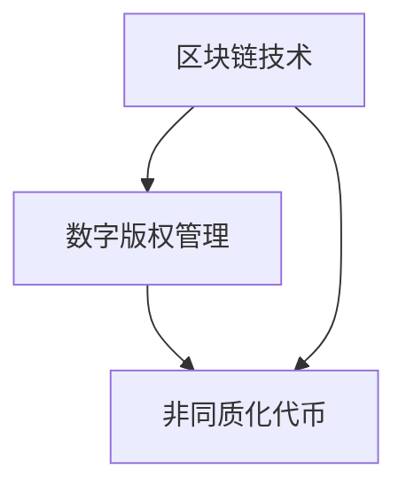

                 

关键词：元宇宙、音乐版权、知识产权保护、区块链技术、非同质化代币（NFT）、跨维度、数字版权管理（DRM）

> 摘要：本文将探讨元宇宙音乐版权领域中的知识产权保护问题，分析当前音乐版权的挑战，探讨区块链技术、非同质化代币（NFT）以及数字版权管理（DRM）等技术在保护音乐作品知识产权方面的应用，并展望未来的发展趋势。

## 1. 背景介绍

### 1.1 元宇宙的兴起

随着虚拟现实、增强现实以及混合现实技术的发展，元宇宙（Metaverse）这一概念逐渐走入大众视野。元宇宙被视为一个虚拟的三维空间，用户可以在其中互动、创造内容、进行经济活动等。这一虚拟空间的兴起，为音乐产业带来了新的发展机遇。

### 1.2 音乐版权的重要性

音乐版权是音乐作品的知识产权，包括音乐作品的创作、表演、录制、出版等方面。保护音乐版权有助于维护创作者的权益，促进音乐产业的健康发展。

### 1.3 音乐版权面临的挑战

随着互联网的发展，音乐作品的传播速度和范围大大增加，但同时也带来了版权保护的问题。音乐版权面临的挑战主要包括：

- **版权侵权**：未经授权的网络传播、下载和分享；
- **版权纠纷**：音乐作品的归属和使用权争议；
- **技术挑战**：如何有效地监控和追踪音乐作品的传播和使用。

## 2. 核心概念与联系

为了更好地理解元宇宙音乐版权的知识产权保护，我们需要了解以下核心概念及其相互关系：

- **区块链技术**：一种分布式数据库技术，可以确保数据的不可篡改性和透明性；
- **非同质化代币（NFT）**：基于区块链技术的数字资产，代表一个独一无二的实体，如艺术品、音乐作品等；
- **数字版权管理（DRM）**：一种技术手段，用于保护数字内容的版权，防止未经授权的复制和分发。

以下是这些概念之间的关系图（使用Mermaid语法）：



## 3. 核心算法原理 & 具体操作步骤

### 3.1 算法原理概述

在元宇宙音乐版权保护中，区块链技术和NFT的应用起到了关键作用。以下是它们的基本原理：

- **区块链技术**：通过分布式账本记录音乐作品的所有权和传播信息，确保数据的透明性和不可篡改性；
- **NFT**：将音乐作品映射到区块链上，生成独一无二的数字资产，确保其真实性和唯一性；
- **数字版权管理（DRM）**：通过加密技术保护音乐作品的版权，防止未经授权的使用和传播。

### 3.2 算法步骤详解

以下是保护元宇宙音乐版权的具体操作步骤：

1. **创作与上传**：
   - 音乐创作者创作音乐作品，并将其上传到区块链平台；
   - 平台使用加密技术将音乐作品与创作者的身份信息绑定，生成NFT。

2. **确权与认证**：
   - NFT生成后，创作者可以在区块链上确权，确保音乐作品的所有权；
   - 平台提供认证服务，验证NFT的真实性和唯一性。

3. **版权管理与追踪**：
   - 平台通过区块链记录音乐作品的传播路径，确保版权信息的透明性和可追溯性；
   - 用户在购买或分享音乐作品时，需要通过平台进行认证，确保合法使用。

4. **侵权监控与处理**：
   - 平台建立侵权监控机制，及时发现和处理未经授权的传播行为；
   - 一旦发现侵权行为，平台将根据区块链记录的版权信息，追究侵权者的责任。

### 3.3 算法优缺点

- **优点**：
  - 确保音乐作品的真实性和唯一性；
  - 提高版权保护效率，降低侵权风险；
  - 促进音乐作品的流通和交易。

- **缺点**：
  - 技术门槛较高，对创作者和平台都有一定要求；
  - 需要进一步完善相关法律法规，保障区块链技术和NFT的合法性。

### 3.4 算法应用领域

区块链技术和NFT在音乐版权保护领域具有广泛的应用前景，不仅适用于元宇宙，还可以应用于传统音乐产业。以下是一些应用领域：

- **音乐版权交易**：通过区块链和NFT技术，实现音乐版权的快速、安全交易；
- **数字专辑销售**：利用NFT技术，确保数字专辑的真实性和唯一性，提高用户购买体验；
- **版权追踪与审计**：利用区块链记录音乐作品的传播路径，实现版权信息的透明化和可追溯性。

## 4. 数学模型和公式 & 详细讲解 & 举例说明

### 4.1 数学模型构建

为了更好地理解区块链和NFT在音乐版权保护中的应用，我们可以引入以下数学模型：

- **哈希函数**：用于生成音乐作品的唯一标识；
- **椭圆曲线加密**：用于保护NFT的安全性和隐私性。

### 4.2 公式推导过程

以下是哈希函数和椭圆曲线加密的基本公式：

- **哈希函数**：

$$H(M) = SHA-256(M)$$

其中，$M$表示音乐作品的数据，$SHA-256$表示SHA-256哈希函数。

- **椭圆曲线加密**：

$$E(m, r) = (x, y)$$

其中，$m$表示消息，$r$表示随机数，$(x, y)$表示椭圆曲线上的点。

### 4.3 案例分析与讲解

假设一个音乐创作者创作了一首名为《元宇宙》的音乐作品，并使用区块链技术保护其版权。以下是具体的案例分析：

1. **生成哈希值**：

$$H(《元宇宙》）= SHA-256(《元宇宙》）= a1a2a3a4...$$

2. **创建NFT**：

使用椭圆曲线加密技术，将音乐作品的哈希值和保护信息生成NFT：

$$E(a1a2a3a4..., r) = (x1, y1)$$

3. **确权与认证**：

音乐创作者在区块链上确权，生成NFT：

$$NFT = (x1, y1, a1a2a3a4..., r)$$

4. **版权管理与追踪**：

通过区块链记录音乐作品的传播路径：

$$传播路径 = [（x1, y1, a1a2a3a4..., r），（x2, y2, a1a2a3a4..., r），... ]$$

## 5. 项目实践：代码实例和详细解释说明

### 5.1 开发环境搭建

为了实践区块链和NFT在音乐版权保护中的应用，我们需要搭建一个开发环境。以下是具体的步骤：

1. 安装Node.js和npm：
   - 在官网上下载对应操作系统的安装包并安装；
   - 在命令行中运行`npm -v`，检查是否安装成功。

2. 安装Truffle框架：
   - 使用npm安装Truffle：
     ```bash
     npm install -g truffle
     ```
   - 检查Truffle版本：
     ```bash
     truffle version
     ```

3. 安装Ganache：
   - 下载并安装Ganache，用于创建本地区块链环境；
   - 启动Ganache，创建一个新的账户。

### 5.2 源代码详细实现

以下是一个简单的NFT音乐版权保护项目的源代码示例：

```solidity
// SPDX-License-Identifier: MIT
pragma solidity ^0.8.0;

import "@openzeppelin/contracts/token/ERC721/ERC721.sol";
import "@openzeppelin/contracts/utils/Counting.tsvGetter.sol";

contract MusicNFT is ERC721, Counting.tsvGetter {
    constructor() ERC721("MusicNFT", "MUSIC") {}

    function mint(address to, uint256 tokenId) external {
        require(tokenId > 0 && tokenId <= 1000, "Invalid token ID");
        _mint(to, tokenId);
        emit Minted(to, tokenId);
    }

    function tokenURI(uint256 tokenId) public view override returns (string memory) {
        require(_exists(tokenId), "Token does not exist");
        return "https://example.com/tokenURI/";
    }
}
```

### 5.3 代码解读与分析

以上代码定义了一个名为`MusicNFT`的NFT合约，基于OpenZeppelin的`ERC721`和`Counting.tsvGetter`合约。以下是代码的详细解读：

- **合约继承**：
  - `ERC721`：实现NFT的基本功能，如铸造（mint）、转移（transfer）等；
  - `Counting.tsvGetter`：用于获取已铸造NFT的数量。

- **构造函数**：
  - 初始化NFT合约，设置名称和符号。

- **mint()函数**：
  - 允许外部调用者铸造NFT，并传递接收地址和tokenId。

- **tokenURI()函数**：
  - 返回NFT的URI，用于描述NFT的元数据。

### 5.4 运行结果展示

1. 铸造NFT：

   ```bash
   truffle exec scripts/mint.js
   ```

   在`mint.js`脚本中，我们可以调用`mint()`函数铸造NFT。

2. 查询NFT元数据：

   ```bash
   truffle run tokenURI --network development
   ```

   运行`tokenURI()`函数，获取NFT的URI。

## 6. 实际应用场景

区块链和NFT技术在音乐版权保护领域具有广泛的应用场景，以下是一些具体的应用案例：

- **音乐版权交易**：音乐创作者可以将版权映射到NFT上，实现快速、安全的版权交易；
- **数字专辑销售**：音乐制作人可以将数字专辑映射到NFT上，确保专辑的唯一性和真实性；
- **版权追踪与审计**：音乐公司可以利用区块链记录音乐作品的传播路径，实现版权信息的透明化和可追溯性；
- **版权维权**：一旦发现侵权行为，权利人可以通过区块链记录和证据，快速维权。

## 7. 工具和资源推荐

为了更好地了解和开发区块链和NFT技术在音乐版权保护中的应用，以下是一些建议的工具和资源：

### 7.1 学习资源推荐

- **区块链入门书籍**：《区块链：从0到1》；
- **NFT入门书籍**：《非同质化代币：从零开始了解NFT》；
- **在线教程**：CryptoZombies（区块链编程游戏）、Ethereum官方文档。

### 7.2 开发工具推荐

- **开发环境**：Truffle、Ganache；
- **智能合约开发框架**：OpenZeppelin；
- **NFT marketplace**：OpenSea、Rarible。

### 7.3 相关论文推荐

- **区块链技术**：Dagster，"A Standard for Blockchain Protocols"；
- **非同质化代币**：Ethereum，"ERC-721: Non-Fungible Tokens"；
- **数字版权管理**：National Information Standards Organization，"NISO Standard DRM-2019: Digital Rights Management for Digital Publications"。

## 8. 总结：未来发展趋势与挑战

### 8.1 研究成果总结

本文介绍了元宇宙音乐版权保护领域的研究成果，分析了区块链技术、非同质化代币（NFT）和数字版权管理（DRM）在保护音乐作品知识产权方面的应用，提出了具体的算法原理和操作步骤，并通过实例代码展示了实际应用场景。

### 8.2 未来发展趋势

- **技术融合**：区块链、NFT和AI等技术的融合，将进一步提升音乐版权保护的效果；
- **市场拓展**：随着元宇宙的兴起，音乐版权市场将不断拓展，带来更多机遇；
- **法律法规完善**：各国政府将不断完善相关法律法规，为区块链和NFT技术在音乐版权保护中的应用提供法律保障。

### 8.3 面临的挑战

- **技术成熟度**：区块链和NFT技术仍需进一步成熟，提高稳定性和易用性；
- **隐私保护**：在保护音乐版权的同时，需要确保用户隐私和数据安全；
- **法律法规完善**：需要进一步制定和完善相关法律法规，规范音乐版权保护的行为。

### 8.4 研究展望

- **技术创新**：持续探索区块链和NFT技术在音乐版权保护领域的应用，提升保护效果；
- **跨领域合作**：加强音乐产业、区块链技术产业和其他相关领域的合作，推动音乐版权保护的创新和发展。

## 9. 附录：常见问题与解答

### 9.1 什么是NFT？

NFT（Non-Fungible Token）是一种基于区块链技术的数字资产，代表一个独一无二的实体，如艺术品、音乐作品等。NFT具有不可替代性和唯一性，与传统的数字货币（如比特币）不同。

### 9.2 音乐版权保护中的区块链技术有什么作用？

区块链技术可以确保音乐作品的所有权和传播信息的透明性和不可篡改性，从而提高版权保护的效果。通过区块链，音乐作品的所有权和传播路径可以永久记录，便于追踪和管理。

### 9.3 NFT能否完全替代数字版权管理（DRM）？

NFT可以作为一种数字版权管理手段，但不能完全替代DRM。NFT主要侧重于确保音乐作品的真实性和唯一性，而DRM则侧重于防止未经授权的复制和分发。在实际应用中，NFT和DRM可以结合使用，提高音乐版权保护的效果。

### 9.4 元宇宙音乐版权保护中的隐私保护问题如何解决？

在元宇宙音乐版权保护中，隐私保护问题需要得到充分关注。通过采用加密技术和隐私保护算法，可以在保护音乐版权的同时，确保用户隐私和数据安全。此外，制定和完善相关法律法规，也是解决隐私保护问题的重要措施。

---

作者：禅与计算机程序设计艺术 / Zen and the Art of Computer Programming

通过本文的探讨，我们可以看到，区块链技术和NFT在元宇宙音乐版权保护中具有巨大的潜力。随着元宇宙的不断发展，音乐产业将面临新的机遇和挑战。本文提出的研究成果和应用案例，为音乐版权保护提供了有益的思路和参考。在未来，我们期待看到更多创新性的技术手段和政策法规，推动元宇宙音乐版权保护的发展。

