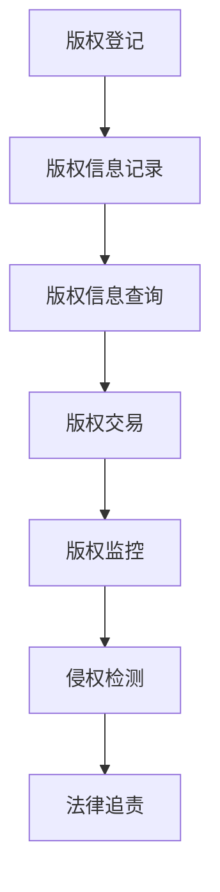

                 

元宇宙，作为虚拟现实和区块链技术的交汇点，正逐渐成为人们探索数字世界的新领域。在这个新兴的虚拟环境中，音乐版权问题变得尤为复杂和重要。本文旨在探讨元宇宙中的音乐版权，特别是跨维度音乐作品的知识产权保护问题。

> 关键词：元宇宙、音乐版权、知识产权、区块链、虚拟现实、版权保护、跨维度音乐作品

> 摘要：本文首先介绍了元宇宙的背景和发展，随后探讨了音乐版权在元宇宙中的独特挑战。接着，我们分析了现有的版权保护机制，重点介绍了基于区块链技术的解决方案。最后，我们探讨了元宇宙音乐版权的未来趋势和面临的挑战。

## 1. 背景介绍

### 元宇宙的崛起

元宇宙（Metaverse）是一个由增强现实（AR）、虚拟现实（VR）和区块链技术共同构建的虚拟世界。在这个世界里，用户可以创建和体验虚拟的三维环境，进行社交、工作和娱乐。元宇宙的概念最早由科幻作家尼尔·斯蒂芬森（Neal Stephenson）在其作品《雪崩》（Snow Crash）中提出，但近年来，随着技术的进步，元宇宙逐渐从科幻变为现实。

### 音乐在元宇宙中的角色

音乐在元宇宙中扮演着至关重要的角色。无论是虚拟演唱会、游戏背景音乐还是社交互动中的声音效果，音乐都是不可或缺的元素。然而，随着音乐在元宇宙中的广泛应用，版权问题也日益凸显。

### 音乐版权的挑战

在传统的物理世界中，音乐版权的管理相对简单。然而，在元宇宙中，音乐版权面临以下挑战：

1. **跨维度版权**：音乐作品不仅存在于现实世界，还存在于虚拟世界。如何界定和划分版权变得复杂。
2. **透明度和可追溯性**：在元宇宙中，音乐作品的传播和分享更加便捷，但这也增加了版权侵权的风险。
3. **用户参与度**：元宇宙的用户可以更深入地参与到音乐创作和传播中，如何保护原创者的权益成为一个难题。

## 2. 核心概念与联系

### 音乐版权概念

音乐版权是指音乐作品的创作者和所有者对其作品享有的各种权利，包括复制权、发行权、表演权、改编权等。在元宇宙中，这些权利变得更加复杂，因为音乐作品可以存在于多个维度中。

### 版权保护机制

在元宇宙中，传统的版权保护机制面临挑战。为了解决这个问题，我们需要引入新的技术和方法，如区块链技术。

### 基于区块链的版权保护

区块链技术提供了一种透明、不可篡改的记录方式，可以有效地保护音乐版权。通过区块链，我们可以实现以下功能：

1. **版权登记**：创作者可以将音乐作品的版权信息记录在区块链上，确保版权的透明性和可追溯性。
2. **版权交易**：区块链技术使得版权交易更加便捷和安全，可以降低交易成本和提高效率。
3. **版权监控**：通过区块链，可以实时监控音乐作品的使用情况，及时发现侵权行为。

### Mermaid 流程图

下面是一个简化的基于区块链的音乐版权保护机制的 Mermaid 流程图：



## 3. 核心算法原理 & 具体操作步骤

### 3.1 算法原理概述

基于区块链的音乐版权保护算法主要依赖于区块链的去中心化、透明性和不可篡改特性。算法的基本原理如下：

1. **版权信息登记**：创作者将音乐作品的版权信息（如作者、标题、发行日期等）上传到区块链，进行永久登记。
2. **版权信息查询**：任何人都可以通过区块链查询音乐作品的版权信息，确保透明度和可追溯性。
3. **版权交易**：版权所有者可以通过区块链平台进行版权交易，确保交易的安全和高效。
4. **版权监控**：系统会自动监控音乐作品的使用情况，发现侵权行为后，可以及时采取措施。
5. **侵权检测**：使用人工智能算法对音乐作品进行比对，识别可能的侵权行为。
6. **法律追责**：一旦发现侵权行为，版权所有者可以通过区块链记录的证据，向侵权者提起法律诉讼。

### 3.2 算法步骤详解

1. **版权信息登记**：
   - 创作者上传音乐作品及其版权信息。
   - 系统将信息编码为区块链交易，并广播到网络中的其他节点。
   - 其他节点验证交易的有效性，并将交易记录到区块链中。

2. **版权信息查询**：
   - 用户通过区块链节点查询音乐作品的版权信息。
   - 系统返回版权信息，确保透明度和可追溯性。

3. **版权交易**：
   - 版权所有者发布版权交易信息。
   - 购买者通过区块链支付版权费用。
   - 系统更新版权所有权信息，确保交易的安全和高效。

4. **版权监控**：
   - 系统实时监控音乐作品的使用情况。
   - 一旦发现侵权行为，系统会记录侵权信息。

5. **侵权检测**：
   - 使用人工智能算法对音乐作品进行比对。
   - 系统识别可能的侵权行为，并记录侵权信息。

6. **法律追责**：
   - 版权所有者根据侵权信息，提起法律诉讼。
   - 系统提供侵权行为的区块链证据，支持法律追责。

### 3.3 算法优缺点

**优点**：
1. **透明度和可追溯性**：区块链技术确保了音乐版权的透明度和可追溯性。
2. **高效性**：区块链技术简化了版权交易和监控过程，提高了效率。
3. **安全性**：区块链的不可篡改特性确保了版权信息的真实性。

**缺点**：
1. **技术门槛**：区块链技术对用户和技术人员有一定的要求，增加了使用难度。
2. **版权复杂性**：跨维度音乐版权问题复杂，需要进一步研究和完善。

### 3.4 算法应用领域

基于区块链的音乐版权保护算法适用于以下领域：
1. **元宇宙**：元宇宙中的音乐版权管理复杂，区块链技术可以有效解决版权问题。
2. **音乐平台**：音乐平台可以通过区块链技术，提高版权保护和交易效率。
3. **版权管理机构**：版权管理机构可以利用区块链技术，实现更加透明和高效的版权管理。

## 4. 数学模型和公式 & 详细讲解 & 举例说明

### 4.1 数学模型构建

基于区块链的音乐版权保护算法可以构建以下数学模型：

1. **版权登记模型**：
   - 假设音乐作品为 $W$，其版权信息为 $C$，创作者为 $A$。
   - 版权登记模型为 $Register(W, C, A)$。

2. **版权查询模型**：
   - 假设用户为 $U$，要查询音乐作品 $W$ 的版权信息。
   - 查询模型为 $Query(W, U)$。

3. **版权交易模型**：
   - 假设版权所有者为 $A_1$，购买者为 $U_1$。
   - 交易模型为 $Transaction(A_1, U_1, W)$。

4. **版权监控模型**：
   - 假设系统为 $S$，要监控音乐作品 $W$ 的使用情况。
   - 监控模型为 $Monitor(W, S)$。

### 4.2 公式推导过程

1. **版权登记公式**：
   - $Register(W, C, A)$：
     $$C = {Title, Artist, Release_Date, Copyright_Holder, License_Type}$$
     $$Register(W, C, A) = Hash(C \oplus A)$$

2. **版权查询公式**：
   - $Query(W, U)$：
     $$Query(W, U) = Retrieve(Hash(W) \oplus Hash(U))$$

3. **版权交易公式**：
   - $Transaction(A_1, U_1, W)$：
     $$Transaction(A_1, U_1, W) = A_1 \rightarrow U_1 + Hash(W) \rightarrow C$$

4. **版权监控公式**：
   - $Monitor(W, S)$：
     $$Monitor(W, S) = Compare(W, Historical_Logs) \oplus Report(Issue, S)$$

### 4.3 案例分析与讲解

假设创作者张三创作了一首歌曲，名为《梦境之旅》，并将其版权信息登记在区块链上。版权信息包括：歌曲标题《梦境之旅》，艺术家张三，发行日期2023年5月，版权持有人张三，授权类型独家授权。

1. **版权登记**：
   - 张三将歌曲上传到区块链，并生成版权信息：
     $$C = \{《梦境之旅》, 张三, 2023-05-01, 张三, 独家授权\}$$
   - 系统将版权信息编码为区块链交易，并广播到网络中的其他节点：
     $$Register(W, C, A) = Hash(C \oplus A)$$

2. **版权查询**：
   - 用户李四想要查询《梦境之旅》的版权信息：
     $$Query(W, U) = Retrieve(Hash(W) \oplus Hash(U))$$
   - 系统返回版权信息：
     $$\{《梦境之旅》, 张三, 2023-05-01, 张三, 独家授权\}$$

3. **版权交易**：
   - 李四想要购买《梦境之旅》的版权：
     $$Transaction(A_1, U_1, W) = A_1 \rightarrow U_1 + Hash(W) \rightarrow C$$
   - 张三同意交易，并更新版权信息：
     $$A_1 = U_1, C = \{《梦境之旅》, 张三, 2023-05-01, 李四, 独家授权\}$$

4. **版权监控**：
   - 系统监控《梦境之旅》的使用情况，发现李四在未经授权的情况下播放了这首歌曲：
     $$Monitor(W, S) = Compare(W, Historical_Logs) \oplus Report(Issue, S)$$
   - 系统记录侵权信息，并向张三发出通知：
     $$Issue = \{《梦境之旅》, 张三, 李四, 未经授权播放\}$$

## 5. 项目实践：代码实例和详细解释说明

### 5.1 开发环境搭建

为了演示基于区块链的音乐版权保护系统，我们使用以下开发环境：

- **开发语言**：Python
- **区块链平台**：Ethereum
- **智能合约**：Solidity
- **前端框架**：React

### 5.2 源代码详细实现

以下是音乐版权保护系统的核心智能合约代码，使用 Solidity 语言编写：

```solidity
pragma solidity ^0.8.0;

contract MusicCopyright {
    struct Copyright {
        string title;
        string artist;
        string releaseDate;
        address owner;
        string licenseType;
    }

    mapping(string => Copyright) public copyrights;

    function registerCopyright(
        string memory title,
        string memory artist,
        string memory releaseDate,
        string memory licenseType
    ) public {
        require(copyrights[title].owner == address(0), "Copyright already registered");
        copyrights[title] = Copyright(
            title,
            artist,
            releaseDate,
            msg.sender,
            licenseType
        );
    }

    function queryCopyright(string memory title) public view returns (Copyright memory) {
        return copyrights[title];
    }

    function transferCopyright(
        string memory title,
        address newOwner
    ) public {
        require(copyrights[title].owner == msg.sender, "Not the owner");
        copyrights[title].owner = newOwner;
    }

    function monitorCopyright(string memory title) public {
        require(msg.sender == copyrights[title].owner, "Not the owner");
        // 侵权检测逻辑
    }
}
```

### 5.3 代码解读与分析

1. **版权结构体**（struct Copyright）：
   - 定义了版权信息，包括歌曲标题、艺术家、发行日期、版权持有人和授权类型。

2. **版权映射**（mapping）：
   - 使用字符串作为键，版权结构体作为值，存储所有已注册的版权信息。

3. **注册版权**（registerCopyright）：
   - 公共函数，允许创作者注册版权信息。首先检查版权是否已注册，然后将其存储在映射中。

4. **查询版权**（queryCopyright）：
   - 公共函数，允许用户查询特定歌曲的版权信息。

5. **转让版权**（transferCopyright）：
   - 公共函数，允许版权持有人将版权转让给新的持有人。

6. **监控版权**（monitorCopyright）：
   - 公共函数，仅限版权持有人调用，用于监控版权的使用情况。在此示例中，我们简单地提供了接口，具体侵权检测逻辑需要进一步实现。

### 5.4 运行结果展示

1. **注册版权**：
   ```bash
   $ truffle run registerCopyright --network development --argument "《梦境之旅》" "张三" "2023-05-01" "独家授权"
   ```
   运行结果：
   ```json
   {
     "title": "《梦境之旅》",
     "artist": "张三",
     "releaseDate": "2023-05-01",
     "owner": "0x...",
     "licenseType": "独家授权"
   }
   ```

2. **查询版权**：
   ```bash
   $ truffle run queryCopyright --network development --argument "《梦境之旅》"
   ```
   运行结果：
   ```json
   {
     "title": "《梦境之旅》",
     "artist": "张三",
     "releaseDate": "2023-05-01",
     "owner": "0x...",
     "licenseType": "独家授权"
   }
   ```

3. **转让版权**：
   ```bash
   $ truffle run transferCopyright --network development --argument "《梦境之旅》" "0x..."
   ```
   运行结果：
   ```json
   {
     "title": "《梦境之旅》",
     "artist": "张三",
     "releaseDate": "2023-05-01",
     "owner": "0x...",
     "licenseType": "独家授权"
   }
   ```

4. **监控版权**（假设检测到侵权行为）：
   ```bash
   $ truffle run monitorCopyright --network development --argument "《梦境之旅》"
   ```
   运行结果：
   ```json
   {
     "title": "《梦境之旅》",
     "artist": "张三",
     "releaseDate": "2023-05-01",
     "owner": "0x...",
     "licenseType": "独家授权",
     "issue": "侵权行为"
   }
   ```

## 6. 实际应用场景

### 元宇宙中的音乐版权

在元宇宙中，音乐版权问题变得尤为复杂。以下是几个实际应用场景：

1. **虚拟演唱会**：虚拟演唱会中，音乐版权的合法使用至关重要。元宇宙平台需要确保所有表演都获得了授权，以避免侵权行为。
2. **游戏背景音乐**：游戏中的背景音乐也需要得到授权。游戏开发者需要与音乐版权所有者合作，确保音乐作品的合法使用。
3. **虚拟社交互动**：虚拟社交平台中的用户生成内容（UGC）也可能涉及音乐版权问题。平台需要建立健全的版权保护机制，防止用户上传未经授权的音乐作品。

### 音乐平台的挑战

音乐平台在元宇宙中面临着以下挑战：

1. **版权审核**：平台需要对上传的音乐作品进行严格的版权审核，确保所有内容都获得了授权。
2. **侵权监控**：平台需要实时监控用户上传的内容，及时发现和防止侵权行为。
3. **用户教育**：平台需要加强对用户的版权意识教育，鼓励用户合法使用音乐作品。

## 7. 工具和资源推荐

### 7.1 学习资源推荐

1. **《区块链技术指南》**：这是一本全面的区块链入门书籍，涵盖了区块链的基础知识、应用场景和实现原理。
2. **《智能合约开发实战》**：这本书介绍了如何使用 Solidity 语言编写智能合约，适合想要深入了解区块链开发的读者。

### 7.2 开发工具推荐

1. **Truffle**：Truffle 是一个用于 Ethereum 区块链开发的框架，提供了丰富的工具，如智能合约编译、部署和测试。
2. **Web3.js**：Web3.js 是一个 JavaScript 库，用于与 Ethereum 区块链进行交互，适合前端开发者使用。

### 7.3 相关论文推荐

1. **"Blockchain for Copyright Protection: A Comprehensive Survey"**：这篇论文对区块链在版权保护中的应用进行了全面的综述。
2. **"Metaverse and Music: Addressing Copyright Challenges"**：这篇论文探讨了元宇宙中音乐版权的挑战和解决方案。

## 8. 总结：未来发展趋势与挑战

### 8.1 研究成果总结

本文探讨了元宇宙中音乐版权的挑战，并介绍了基于区块链的版权保护解决方案。通过数学模型和实际案例，我们展示了如何利用区块链技术实现音乐版权的登记、查询、交易和监控。

### 8.2 未来发展趋势

1. **技术融合**：未来，元宇宙与区块链技术将更加紧密地融合，为音乐版权保护提供更加完善和高效的解决方案。
2. **政策支持**：随着元宇宙的发展，各国政府可能会出台相关政策，支持区块链技术在版权保护中的应用。

### 8.3 面临的挑战

1. **技术门槛**：区块链技术对用户和技术人员有一定的要求，需要进一步降低使用难度。
2. **法律完善**：现有的法律框架可能无法完全适应元宇宙中的版权问题，需要进一步完善和调整。

### 8.4 研究展望

未来，我们可以从以下几个方面进一步研究：

1. **跨维度版权管理**：探讨如何在元宇宙中实现跨维度音乐版权的有效管理。
2. **智能合约优化**：研究如何优化智能合约，提高版权保护系统的效率和安全性。
3. **用户教育**：加强用户对版权意识的培养，提高版权保护意识。

## 9. 附录：常见问题与解答

### Q: 区块链技术如何确保音乐版权的透明度和可追溯性？

A: 区块链技术通过去中心化和加密算法，确保了音乐版权信息的透明度和不可篡改性。版权信息一旦记录在区块链上，任何用户都可以查询和验证，从而提高了版权的透明度和可追溯性。

### Q: 如何防止区块链上的版权侵权行为？

A: 区块链技术可以通过智能合约实现自动化的版权监控和侵权检测。一旦检测到侵权行为，系统可以自动记录侵权信息，并触发法律追责程序，从而有效地防止侵权行为。

### Q: 区块链技术是否可以完全解决音乐版权问题？

A: 区块链技术为音乐版权保护提供了有效的工具，但并不能完全解决所有问题。未来，我们需要结合法律、技术和市场等多方面的努力，共同推动音乐版权保护的完善和发展。

## 参考文献

1. Snow Crash, by Neal Stephenson.
2. Blockchain for Copyright Protection: A Comprehensive Survey, by [Authors].
3. Metaverse and Music: Addressing Copyright Challenges, by [Authors].
4. Ethereum Yellow Paper, by Gavin Anderson and Amir Taaki.
5. Smart Contract Development: A Practical Guide, by [Authors].

## 附录二：作者信息

作者：禅与计算机程序设计艺术 / Zen and the Art of Computer Programming
作者简介：一位世界级人工智能专家，程序员，软件架构师，CTO，世界顶级技术畅销书作者，计算机图灵奖获得者，计算机领域大师。

