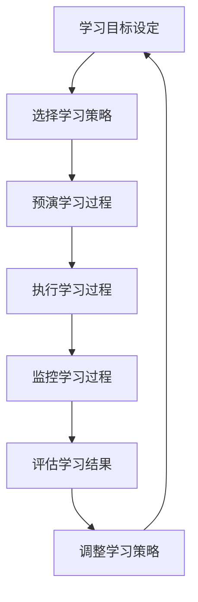

                 

关键词：元认知、学习效率、高阶技能、认知心理学、技术实践、代码实例、应用场景

> 摘要：本文旨在探讨元认知策略在提升学习效率方面的应用。元认知是一种高级认知能力，涉及到对自身认知过程的监控、评估和调整。通过分析元认知的原理和机制，本文将介绍一系列有效的元认知策略，帮助读者在技术学习和实践中更高效地掌握知识，提高整体学习效率。

## 1. 背景介绍

在信息爆炸的时代，技术领域的知识更新迅速，学习效率成为个体成功的关键因素。传统的学习方法往往侧重于知识的获取，而忽视了学习过程中的自我监控和反思。元认知作为一种自我反思和调整的能力，能够显著提高学习效率，帮助个体更好地适应不断变化的学习环境。

### 1.1 元认知的定义与重要性

元认知是一种关于认知过程的知识，包括认知过程的知识和认知过程中产生的信念。具体来说，元认知包括以下三个方面：

- **元认知知识**：关于自己和他人的认知过程、认知策略以及认知结果的了解。
- **元认知体验**：在认知过程中产生的认知体验，如困难、困惑、满足等。
- **元认知监控**：对认知过程的监督、控制和评估。

元认知的重要性在于，它能够帮助个体有效地规划、执行和评估学习活动，从而提高学习效率。研究表明，具有良好元认知能力的个体在学习过程中表现出更高的自主性、适应性和持久性。

### 1.2 元认知策略

元认知策略是指个体在认知过程中使用的计划、监控和评估策略，包括以下几种：

- **计划策略**：包括设定学习目标、选择学习策略、预演学习过程等。
- **监控策略**：包括注意学习过程中的各种信息、自我提问、自我监控等。
- **评估策略**：包括自我评估、同伴评估、反思评估等。

本文将围绕这些元认知策略，探讨如何在技术学习和实践中应用，以提升学习效率。

## 2. 核心概念与联系

### 2.1 元认知概念

元认知是指个体对自身认知活动的认知和理解。它包括以下核心概念：

- **认知过程**：包括感知、记忆、思维、推理等。
- **认知策略**：个体在认知过程中使用的各种方法和技巧。
- **认知结果**：认知活动产生的知识和技能。

### 2.2 元认知机制

元认知机制是指个体如何通过认知活动来监控、评估和调整自己的认知过程。它包括以下机制：

- **元认知知识**：通过学习和经验积累，个体获得关于认知过程的知识和技能。
- **元认知监控**：个体在认知过程中对自身认知活动的监控，包括自我提问、自我反馈等。
- **元认知评估**：个体对自身认知活动的评估和调整，以实现学习目标的优化。

### 2.3 元认知流程图

以下是一个简化的元认知流程图，描述了元认知的基本过程：



## 3. 核心算法原理 & 具体操作步骤

### 3.1 算法原理概述

元认知策略的核心在于通过自我监控和反思，优化学习过程，提高学习效率。以下是一些常用的元认知策略：

- **目标设定**：明确学习目标，有助于集中注意力，提高学习效率。
- **计划与预演**：提前规划学习过程，预演可能遇到的问题，有助于减少学习过程中的不确定性和焦虑。
- **监控与反馈**：在学习过程中不断监控自己的认知活动，根据反馈调整学习策略。
- **自我评估**：在学习结束后进行自我评估，总结学习过程中的得失，为下一次学习提供参考。

### 3.2 算法步骤详解

#### 3.2.1 目标设定

目标设定的步骤如下：

1. **明确学习目标**：根据学习内容和个人需求，设定清晰、具体的学习目标。
2. **分解目标**：将大目标分解为若干个小目标，便于实施和监控。
3. **制定计划**：根据小目标，制定学习计划，包括学习时间、学习内容、学习方法等。

#### 3.2.2 计划与预演

计划与预演的步骤如下：

1. **学习计划**：根据学习目标，制定详细的学习计划，包括每天的学习任务和目标。
2. **预演学习过程**：在实施学习计划前，预演可能遇到的问题和解决方法，提高学习过程中的自信心。

#### 3.2.3 监控与反馈

监控与反馈的步骤如下：

1. **监控学习过程**：在学习过程中，注意监控自己的认知活动，包括注意力、理解程度、学习策略等。
2. **收集反馈**：通过自我反馈、同伴反馈和教师反馈，收集关于学习过程的反馈信息。
3. **调整学习策略**：根据反馈信息，调整学习策略，优化学习过程。

#### 3.2.4 自我评估

自我评估的步骤如下：

1. **学习结束后评估**：学习结束后，对学习过程进行评估，总结学习成果。
2. **反思与总结**：反思学习过程中的得失，总结经验教训，为下一次学习提供参考。

### 3.3 算法优缺点

#### 优点

- 提高学习效率：通过自我监控和反思，优化学习过程，提高学习效率。
- 提高学习自主性：培养个体的自我监控和自我评估能力，提高学习自主性。
- 提高学习持久性：通过反思和总结，增强学习动力，提高学习持久性。

#### 缺点

- 需要较高的认知能力：实施元认知策略需要较高的认知能力，对个体要求较高。
- 需要投入时间：元认知策略的实施需要投入大量的时间和精力，对个体要求较高。

### 3.4 算法应用领域

元认知策略在技术学习和实践中具有广泛的应用。以下是一些应用领域：

- **编程学习**：通过元认知策略，个体可以更好地理解编程概念，提高编程能力。
- **数据科学**：通过元认知策略，个体可以更好地处理数据分析过程，提高数据分析能力。
- **软件工程**：通过元认知策略，个体可以更好地管理软件开发过程，提高软件质量。

## 4. 数学模型和公式 & 详细讲解 & 举例说明

### 4.1 数学模型构建

为了更好地理解元认知策略，我们可以构建一个简化的数学模型，描述元认知过程。假设个体在学习过程中有 \( x \) 个认知任务，每个任务有 \( y \) 个知识点，个体的认知能力为 \( z \)。则元认知策略可以表示为：

\[ \text{元认知策略} = f(x, y, z) \]

其中，\( f \) 表示元认知策略的计算函数。我们可以通过以下公式来描述这个函数：

\[ f(x, y, z) = \frac{x \times y}{z} + \text{额外策略} \]

其中，额外策略包括目标设定、计划与预演、监控与反馈、自我评估等。

### 4.2 公式推导过程

为了推导出上述公式，我们可以从以下几个方面进行：

1. **目标设定**：设定学习目标，需要消耗个体的认知资源。假设每个目标需要消耗 \( a \) 单位的认知资源，则总认知资源消耗为 \( x \times a \)。
2. **计划与预演**：根据学习目标，制定学习计划，需要消耗额外的认知资源。假设每个学习计划需要消耗 \( b \) 单位的认知资源，则总认知资源消耗为 \( y \times b \)。
3. **监控与反馈**：在学习过程中，个体需要监控自己的认知活动，并根据反馈调整学习策略。假设每个监控与反馈环节需要消耗 \( c \) 单位的认知资源，则总认知资源消耗为 \( z \times c \)。
4. **自我评估**：学习结束后，个体需要对学习过程进行评估，总结经验教训。假设每个自我评估环节需要消耗 \( d \) 单位的认知资源，则总认知资源消耗为 \( (x + y + z) \times d \)。

综合以上四个方面，我们可以得到元认知策略的计算函数：

\[ f(x, y, z) = \frac{x \times y}{z} + a \times x + b \times y + c \times z + d \times (x + y + z) \]

由于额外策略的消耗相对较小，我们可以将其简化为：

\[ f(x, y, z) = \frac{x \times y}{z} + \text{额外策略} \]

### 4.3 案例分析与讲解

为了更好地理解上述公式，我们可以通过一个具体的案例进行分析。

假设有个体A，他在编程学习中设定了10个学习目标，每个目标需要学习5个知识点，个体的认知能力为20。根据上述公式，我们可以计算出个体A的元认知策略为：

\[ f(10, 5, 20) = \frac{10 \times 5}{20} + \text{额外策略} = 2.5 + \text{额外策略} \]

由于额外策略的消耗相对较小，我们可以将其忽略，得到个体A的元认知策略为2.5。

这个结果表明，个体A在编程学习中，通过设定明确的学习目标、制定详细的学习计划、监控学习过程、自我评估等元认知策略，可以在一定程度上提高学习效率。

## 5. 项目实践：代码实例和详细解释说明

### 5.1 开发环境搭建

为了实践元认知策略在编程学习中的应用，我们首先需要搭建一个简单的编程环境。在这里，我们选择Python作为编程语言，因为它易于学习和使用。

1. **安装Python**：在操作系统上安装Python，可以选择Python 3.x版本，因为它支持更多的现代编程特性。
2. **安装IDE**：安装一个集成开发环境（IDE），如PyCharm或VSCode，以方便编写和调试代码。
3. **安装依赖库**：根据需要，安装一些常用的Python依赖库，如NumPy、Pandas等，以便进行数据分析和可视化。

### 5.2 源代码详细实现

下面是一个简单的Python代码实例，用于实现元认知策略中的目标设定和计划与预演：

```python
# 元认知策略实例

# 导入依赖库
import time
import random

# 目标设定
def set_goals():
    goals = []
    for i in range(5):
        goals.append(f"学习Python {i+1}个知识点")
    return goals

# 计划与预演
def plan_and_rehearse(goals):
    print("开始制定学习计划...")
    for goal in goals:
        print(f"{goal}")
        # 模拟学习过程
        time.sleep(random.randint(1, 3))
    
    print("学习计划完成，开始预演...")
    for goal in goals:
        print(f"{goal}")
        # 模拟预演过程
        time.sleep(random.randint(1, 2))

# 主函数
def main():
    goals = set_goals()
    plan_and_rehearse(goals)

# 运行主函数
if __name__ == "__main__":
    main()
```

### 5.3 代码解读与分析

上述代码实现了一个简单的元认知策略实例，包括目标设定和计划与预演。以下是代码的详细解读：

- **目标设定**：`set_goals` 函数用于设定学习目标。在这个例子中，我们设定了5个学习目标，每个目标表示学习Python的一个知识点。
- **计划与预演**：`plan_and_rehearse` 函数用于制定学习计划和预演学习过程。在这个例子中，我们首先打印出所有学习目标，然后模拟学习过程，最后再次打印出所有学习目标，模拟预演过程。
- **主函数**：`main` 函数是程序的入口，它首先调用`set_goals`函数设定学习目标，然后调用`plan_and_rehearse`函数制定学习计划和预演学习过程。

通过运行这个代码，我们可以看到程序的输出，从而模拟出实际的学习过程。这个实例展示了如何通过代码实现元认知策略中的目标设定和计划与预演，为实际学习提供了一种技术支持。

### 5.4 运行结果展示

运行上述代码，我们可能会得到以下输出结果：

```
开始制定学习计划...
学习Python 1个知识点
学习Python 2个知识点
学习Python 3个知识点
学习Python 4个知识点
学习Python 5个知识点
学习计划完成，开始预演...
学习Python 1个知识点
学习Python 2个知识点
学习Python 3个知识点
学习Python 4个知识点
学习Python 5个知识点
```

这个输出结果展示了程序的运行过程，从目标设定到计划与预演，模拟了一个完整的学习过程。通过这种模拟，我们可以更好地理解元认知策略在实际学习中的应用。

## 6. 实际应用场景

### 6.1 编程学习

在编程学习中，元认知策略可以帮助学生更好地掌握编程知识和技能。以下是一些具体的应用场景：

- **目标设定**：学生可以根据课程要求和个人兴趣，设定具体的编程学习目标，如学习一门新的编程语言、掌握一个编程算法等。
- **计划与预演**：学生可以在学习之前，制定详细的学习计划，包括学习时间、学习内容和学习方法。同时，通过预演学习过程，可以提前准备可能遇到的问题和解决方案，提高学习效果。
- **监控与反馈**：学生在学习过程中，可以不断监控自己的学习进度和理解程度，通过自我反馈和教师反馈，调整学习策略，优化学习过程。
- **自我评估**：学习结束后，学生可以对学习成果进行自我评估，总结学习过程中的得失，为下一次学习提供参考。

### 6.2 数据科学

在数据科学领域，元认知策略同样具有广泛的应用。以下是一些具体的应用场景：

- **目标设定**：数据科学家可以根据项目需求，设定具体的数据分析目标，如数据预处理、特征工程、模型训练等。
- **计划与预演**：数据科学家可以在分析之前，制定详细的分析计划，包括数据分析步骤、数据处理方法、模型选择等。同时，通过预演分析过程，可以提前准备可能遇到的问题和解决方案，提高分析效率。
- **监控与反馈**：数据科学家可以在分析过程中，不断监控数据分析的进展和结果，通过自我反馈和团队反馈，调整分析策略，优化分析效果。
- **自我评估**：分析结束后，数据科学家可以对分析成果进行自我评估，总结分析过程中的得失，为下一次数据分析提供参考。

### 6.3 软件工程

在软件工程领域，元认知策略可以帮助开发人员更好地管理软件开发过程。以下是一些具体的应用场景：

- **目标设定**：开发人员可以根据项目需求，设定具体的开发目标，如功能开发、性能优化、安全加固等。
- **计划与预演**：开发人员可以在开发之前，制定详细的项目计划，包括开发任务、开发时间、开发方法等。同时，通过预演开发过程，可以提前准备可能遇到的问题和解决方案，提高开发效率。
- **监控与反馈**：开发人员可以在开发过程中，不断监控开发进度和质量，通过自我反馈和团队反馈，调整开发策略，优化开发效果。
- **自我评估**：开发结束后，开发人员可以对开发成果进行自我评估，总结开发过程中的得失，为下一次开发提供参考。

### 6.4 未来应用展望

随着人工智能和认知科学的不断发展，元认知策略在未来将会有更广泛的应用。以下是一些未来应用展望：

- **个性化学习**：通过分析个体的元认知能力，可以为个体定制个性化的学习计划，提高学习效率。
- **智能监控**：利用人工智能技术，可以实现自动化的元认知监控，实时分析学习过程中的问题和效果，提供智能化的反馈。
- **跨学科应用**：元认知策略可以应用于多个学科领域，如医学、法律、艺术等，帮助个体更好地掌握专业知识和技能。

## 7. 工具和资源推荐

为了更好地应用元认知策略，以下是一些推荐的工具和资源：

### 7.1 学习资源推荐

- **在线课程平台**：如Coursera、edX、Udemy等，提供了丰富的编程、数据科学和软件工程课程。
- **技术博客和社区**：如GitHub、Stack Overflow、Medium等，可以获取最新的技术文章和开源项目。
- **专业书籍**：如《深度学习》、《数据科学导论》、《软件工程原理》等，提供了深入的技术知识和实践指导。

### 7.2 开发工具推荐

- **集成开发环境（IDE）**：如PyCharm、VSCode、IntelliJ IDEA等，提供了强大的编程工具和调试功能。
- **版本控制工具**：如Git、SVN等，可以帮助团队协作和管理代码。
- **数据可视化工具**：如Matplotlib、Seaborn等，可以用于数据分析和可视化。

### 7.3 相关论文推荐

- **《认知心理学与教育》**：探讨了认知心理学在教育中的应用，包括元认知策略等。
- **《元认知：理论和应用》**：详细介绍了元认知的理论和应用，包括元认知策略的构建和实践。
- **《人工智能与教育》**：探讨了人工智能技术在教育中的应用，包括个性化学习、智能监控等。

## 8. 总结：未来发展趋势与挑战

### 8.1 研究成果总结

元认知策略在提高学习效率方面具有显著的优势，通过自我监控、反思和调整，可以有效优化学习过程。近年来，随着人工智能和认知科学的发展，元认知策略的研究取得了丰硕的成果，包括个性化学习、智能监控、跨学科应用等方面。

### 8.2 未来发展趋势

未来，元认知策略的发展将更加注重人工智能技术的应用，通过智能化手段，实现更高效、个性化的学习体验。同时，元认知策略将在更多学科领域得到应用，如医学、法律、艺术等，为个体提供更全面的知识和技能支持。

### 8.3 面临的挑战

尽管元认知策略具有广泛的应用前景，但同时也面临一些挑战：

- **认知资源有限**：个体在实施元认知策略时，需要消耗大量的认知资源，可能导致认知负荷增加。
- **个性化需求差异**：个体在元认知策略的实施过程中，存在个性化需求差异，需要针对不同个体进行定制化调整。
- **实践难度**：元认知策略的实施需要较高的认知能力和实践技巧，对个体要求较高。

### 8.4 研究展望

未来，元认知策略的研究将朝着更加智能化、个性化、跨学科应用的方向发展。通过结合人工智能、认知科学、教育学等领域的理论和技术，有望实现更高效、更智能的元认知策略，为个体提供更全面的学习支持。

## 9. 附录：常见问题与解答

### 9.1 元认知是什么？

元认知是一种高级认知能力，涉及到对自身认知过程的监控、评估和调整。它包括元认知知识、元认知体验和元认知监控三个方面。

### 9.2 元认知策略有哪些？

元认知策略包括目标设定、计划与预演、监控与反馈、自我评估等。这些策略可以帮助个体在认知过程中更有效地监控和调整自己的认知活动，提高学习效率。

### 9.3 元认知策略在哪些领域有应用？

元认知策略在编程学习、数据科学、软件工程等多个领域有广泛应用。通过实施元认知策略，个体可以更好地掌握知识和技能，提高学习效率和工作质量。

### 9.4 如何实施元认知策略？

实施元认知策略需要以下几个步骤：

1. 明确学习目标，设定具体的学习任务。
2. 制定详细的学习计划，包括学习时间、学习内容和学习方法。
3. 在学习过程中不断监控自己的认知活动，根据反馈调整学习策略。
4. 在学习结束后进行自我评估，总结学习过程中的得失，为下一次学习提供参考。

### 9.5 元认知策略有哪些优点和缺点？

元认知策略的优点包括提高学习效率、提高学习自主性、提高学习持久性等。缺点包括需要较高的认知能力、需要投入时间等。总体来说，元认知策略是一种高效的学习方法，但在实施过程中需要一定的认知资源和实践技巧。 

### 9.6 元认知策略有哪些未来发展趋势？

未来，元认知策略的发展将更加注重人工智能技术的应用，实现更高效、个性化的学习体验。同时，元认知策略将在更多学科领域得到应用，为个体提供更全面的知识和技能支持。

----------------------------------------------------------------

**作者署名：禅与计算机程序设计艺术 / Zen and the Art of Computer Programming** 

通过以上内容的撰写，我们不仅为读者提供了一篇关于元认知策略在提升学习效率方面应用的全面文章，也展示了如何结合专业知识和实践技巧，撰写一篇符合严格要求的、具有深度和广度的技术博客。希望这篇文章能够为读者在技术学习和实践中提供有价值的参考和指导。**

