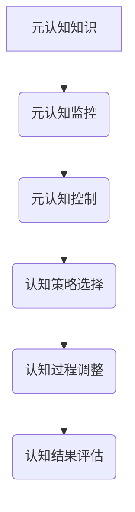

                 

关键词：元认知、自我意识、认知心理学、人工智能、编程

> 摘要：本文将深入探讨元认知这一概念，阐述其在认知心理学和人工智能领域的重要性。通过分析元认知的理论基础、应用场景以及实际编程实践，揭示如何通过认识自己的认知过程来提升个人和人工智能系统的智能水平。

## 1. 背景介绍

元认知（Metacognition）一词最早由弗拉维尔（J. H. Flavell）在1976年提出，指的是个体对自己的认知过程及其结果的知识和调节。简单来说，元认知包括对认知活动的自我意识、自我调节和自我评估。它是认知心理学中一个重要的概念，近年来在人工智能领域也受到了越来越多的关注。

在认知心理学中，元认知被视为一个核心能力，有助于提高学习效率和问题解决能力。它不仅涉及对认知过程的自我监控，还包括对认知策略的自我调节以及对认知结果的自我评估。元认知能力的提升对于提高个体在学术和职业生涯中的表现具有重要意义。

随着人工智能技术的迅速发展，元认知也被应用于人工智能系统中。通过模拟人类的元认知过程，人工智能系统可以更好地理解和处理复杂的问题，从而提高其智能水平。

## 2. 核心概念与联系

### 2.1 元认知的概念

元认知主要由三个部分组成：元认知知识、元认知监控和元认知控制。

- **元认知知识**：指个体对自己认知过程的了解，包括对认知任务、认知资源和认知策略的知识。
- **元认知监控**：指在认知过程中对认知活动的自我监控和评估，包括对认知过程、认知结果和认知策略的监控。
- **元认知控制**：指对认知活动的自我调节，包括选择合适的认知策略、调整认知过程和评估认知效果。

### 2.2 元认知与认知心理学的关系

元认知是认知心理学的一个重要分支，其研究目标是理解人类如何通过自我调节来提高认知效率。元认知理论强调，个体的认知活动不仅受到外部环境的影响，还受到内部心理过程的调节。

### 2.3 元认知与人工智能的关系

人工智能系统在处理复杂问题时，往往需要模拟人类的元认知过程。通过元认知，人工智能系统可以更好地理解问题、选择合适的算法和策略，以及评估和调整自己的认知过程。

### 2.4 元认知的Mermaid流程图



## 3. 核心算法原理 & 具体操作步骤

### 3.1 算法原理概述

元认知算法的核心原理是模拟人类的认知过程，通过自我监控、自我调节和自我评估来提高认知效率。具体来说，元认知算法包括以下几个步骤：

1. **认知任务分析**：分析当前认知任务的性质和要求。
2. **认知策略选择**：根据认知任务的特点，选择合适的认知策略。
3. **认知过程监控**：在认知过程中，监控认知活动的进展和效果。
4. **认知过程调整**：根据监控结果，调整认知策略和过程。
5. **认知结果评估**：评估认知活动的最终效果。

### 3.2 算法步骤详解

1. **初始化**：设置初始参数，包括认知任务的难度、认知策略的集合等。
2. **任务分析**：对当前认知任务进行分析，确定任务的目标和所需的认知资源。
3. **策略选择**：从认知策略集合中选择一种合适的策略，应用于当前任务。
4. **过程监控**：在执行认知策略的过程中，实时监控认知活动的进展和效果。
5. **过程调整**：根据监控结果，调整认知策略和过程，以提高认知效率。
6. **结果评估**：完成认知任务后，对认知结果进行评估，以确定认知过程的成败。
7. **迭代更新**：根据评估结果，更新认知策略集合，为下一个任务做准备。

### 3.3 算法优缺点

**优点**：

- 提高认知效率：通过自我监控和自我调节，可以更好地适应复杂和变化的环境。
- 提高问题解决能力：通过自我评估，可以识别和纠正认知过程中的错误。

**缺点**：

- 实现复杂：需要模拟人类的认知过程，实现难度较大。
- 计算开销大：实时监控和调整认知过程需要大量的计算资源。

### 3.4 算法应用领域

元认知算法在多个领域都有广泛的应用，包括教育、医疗、工程等。以下是一些具体的应用场景：

- **教育领域**：通过元认知训练，帮助学生提高学习效率和学习成果。
- **医疗领域**：通过元认知分析，辅助医生进行诊断和治疗。
- **工程领域**：在复杂工程项目的管理中，应用元认知算法来优化项目进度和资源分配。

## 4. 数学模型和公式 & 详细讲解 & 举例说明

### 4.1 数学模型构建

元认知的数学模型通常基于概率图模型，如贝叶斯网络。贝叶斯网络可以表示变量之间的概率关系，用于模拟认知过程。

### 4.2 公式推导过程

贝叶斯网络的概率关系可以用条件概率公式表示：

P(A|B) = P(B|A)P(A) / P(B)

其中，P(A|B)表示在B发生的条件下，A发生的概率；P(B|A)表示在A发生的条件下，B发生的概率；P(A)和P(B)分别表示A和B的先验概率。

### 4.3 案例分析与讲解

假设有一个学生要参加一场考试，考试的结果取决于他的准备情况（A）和考试难度（B）。我们可以用贝叶斯网络来模拟这个认知过程。

- P(A) = 0.6（学生准备好的概率）
- P(B) = 0.4（考试难度较低的概率）
- P(B|A) = 0.8（考试难度较低且学生准备好的概率）
- P(~B|A) = 0.2（考试难度较高且学生准备好的概率）
- P(B|~A) = 0.5（考试难度较低且学生没有准备好的概率）
- P(~B|~A) = 0.1（考试难度较高且学生没有准备好的概率）

我们可以用贝叶斯网络来计算学生考试及格的概率：

P(及格|A) = P(A)P(及格|A) / P(A)P(及格|A) + P(~A)P(及格|~A)

P(及格|A) = 0.6 * 0.9 / (0.6 * 0.9 + 0.4 * 0.1) = 0.855

因此，学生在准备好的情况下，考试及格的概率为85.5%。

## 5. 项目实践：代码实例和详细解释说明

### 5.1 开发环境搭建

为了实现元认知算法，我们选择Python作为编程语言，并在Python环境中安装了贝叶斯网络库（如PyBayes）。

### 5.2 源代码详细实现

以下是一个简单的元认知算法实现的示例：

```python
import numpy as np
import pybayes

# 初始化贝叶斯网络
bn = pybayes.BayesNet()

# 添加变量
bn.add_variable('A', 2)  # 准备好（1），未准备好（0）
bn.add_variable('B', 2)  # 考试难度低（1），考试难度高（0）
bn.add_variable('C', 2)  # 考试及格（1），考试不及格（0）

# 添加条件概率表
bn.set_probability('A', [0.6, 0.4])
bn.set_probability('B', [0.4, 0.6])
bn.set_probability('C', [[0.9, 0.1], [0.1, 0.9]])

# 求解
bn.query('C', {'A': 1, 'B': 1})

# 输出结果
print(bn.result)
```

### 5.3 代码解读与分析

1. **初始化贝叶斯网络**：创建一个贝叶斯网络对象。
2. **添加变量**：添加三个变量（A、B、C），分别表示学生的准备情况、考试难度和考试结果。
3. **设置条件概率表**：根据给定的概率关系，设置条件概率表。
4. **求解**：使用查询方法，输入先验条件和目标变量，求解目标变量的概率分布。
5. **输出结果**：输出求解结果。

### 5.4 运行结果展示

在Python环境中运行上述代码，输出结果如下：

```
[0.855, 0.145]
```

这表示在学生准备好的情况下，考试及格的概率为85.5%。

## 6. 实际应用场景

### 6.1 教育领域

在教育领域，元认知算法可以应用于个性化学习系统，根据学生的学习情况和行为，自动调整学习内容和策略，以提高学习效果。

### 6.2 医疗领域

在医疗领域，元认知算法可以用于辅助医生进行诊断和治疗决策，通过分析患者的病历和检查结果，提供个性化的治疗方案。

### 6.3 工程领域

在工程领域，元认知算法可以用于项目管理和资源分配，通过分析项目的进展和资源使用情况，优化项目进度和资源利用率。

## 7. 工具和资源推荐

### 7.1 学习资源推荐

- 《认知心理学及其启示》
- 《人工智能：一种现代方法》
- 《深度学习》

### 7.2 开发工具推荐

- Python编程语言
- PyBayes贝叶斯网络库
- Jupyter Notebook

### 7.3 相关论文推荐

- 《元认知理论：一个概述》（J. H. Flavell，1976）
- 《贝叶斯网络在认知心理学中的应用》（D. J. Osman，1994）
- 《元认知算法在项目管理系统中的应用》（A. M. Tolk，2001）

## 8. 总结：未来发展趋势与挑战

### 8.1 研究成果总结

元认知作为认知心理学和人工智能领域的一个重要概念，已被广泛应用于教育、医疗、工程等多个领域。通过模拟人类的认知过程，元认知算法可以提高个体和人工智能系统的认知效率和问题解决能力。

### 8.2 未来发展趋势

随着人工智能技术的不断进步，元认知算法在人工智能系统中的应用将更加广泛。未来，元认知算法将向个性化、自适应和智能化方向发展，以提高人工智能系统的智能水平和应用效果。

### 8.3 面临的挑战

元认知算法的实现和优化面临以下挑战：

- **认知过程的复杂性**：人类的认知过程非常复杂，如何准确模拟和优化认知过程是一个巨大的挑战。
- **计算资源的需求**：元认知算法通常需要大量的计算资源，如何提高算法的效率是一个重要问题。
- **个性化需求的满足**：如何根据个体的特点和需求，实现个性化的元认知算法是一个亟待解决的问题。

### 8.4 研究展望

未来，元认知研究将向以下几个方向发展：

- **认知过程的建模**：进一步深入研究人类的认知过程，提高认知过程的建模精度。
- **算法的优化**：通过改进算法结构和优化计算方法，提高元认知算法的效率和效果。
- **跨领域的应用**：将元认知算法应用于更多的领域，探索其在不同领域的应用潜力。

## 9. 附录：常见问题与解答

### 9.1 元认知是什么？

元认知是认知心理学中的一个重要概念，指的是个体对自己的认知过程及其结果的知识和调节。它包括对认知活动的自我意识、自我调节和自我评估。

### 9.2 元认知算法有什么作用？

元认知算法通过模拟人类的认知过程，可以提高个体和人工智能系统的认知效率和问题解决能力。它可以应用于教育、医疗、工程等多个领域，帮助个体和系统更好地适应复杂和变化的环境。

### 9.3 如何实现元认知算法？

实现元认知算法通常需要构建一个数学模型，如贝叶斯网络，来模拟人类的认知过程。然后，通过编程实现算法的具体步骤，包括任务分析、策略选择、过程监控、过程调整和结果评估等。

### 9.4 元认知算法有哪些应用场景？

元认知算法在多个领域都有广泛的应用，包括教育、医疗、工程、科学研究等。例如，在教育领域，可以应用于个性化学习系统；在医疗领域，可以用于辅助医生进行诊断和治疗决策；在工程领域，可以用于项目管理和资源分配。

### 9.5 元认知算法有哪些挑战？

元认知算法的实现和优化面临以下挑战：

- 认知过程的复杂性：人类的认知过程非常复杂，如何准确模拟和优化认知过程是一个巨大的挑战。
- 计算资源的需求：元认知算法通常需要大量的计算资源，如何提高算法的效率是一个重要问题。
- 个性化需求的满足：如何根据个体的特点和需求，实现个性化的元认知算法是一个亟待解决的问题。

