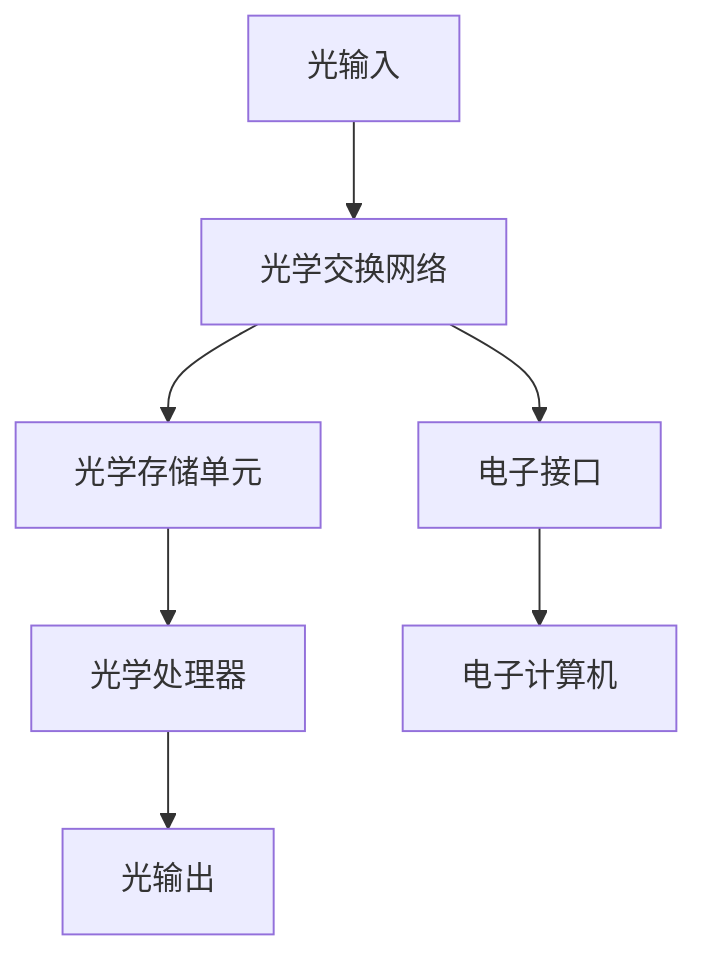

                 

关键词：光计算，电子计算，速度提升，计算架构，未来趋势，数学模型，算法实现，实际应用

> 摘要：本文将探讨光计算技术如何突破传统电子计算的速度限制，介绍其核心概念、原理、算法和数学模型。通过详细的分析和实例，我们将揭示光计算技术在现代计算领域的重要性和广阔的应用前景。

## 1. 背景介绍

随着信息技术的飞速发展，电子计算设备已经渗透到我们生活的方方面面。然而，电子计算的极限也逐渐显现出来。尽管集成电路和微处理器的性能不断提升，但电子在硅材料中的传输速度仍然受到物理定律的限制。这种速度瓶颈限制了计算机处理大数据和复杂计算问题的能力。

为了突破这个瓶颈，科学家们开始探索新的计算模式。光计算作为一种非电子计算方式，利用光子（光子是光的量子）来传输和操作信息。光计算技术具有极高的速度和并行处理能力，它有望成为下一代计算技术的核心。

光计算技术不仅能够解决电子计算中的速度限制问题，还能够提高计算效率，降低能耗。本文将深入探讨光计算技术的原理、算法和实际应用，以及其对现代计算技术的影响。

## 2. 核心概念与联系

### 2.1 光计算基本原理

光计算是基于光子传输和操作的原理，而不是传统的电子信号传输。光子具有高速、不导电、不生热等优点，这使得光计算在处理大数据和复杂计算任务时具有显著优势。

光计算的基本原理包括以下几个方面：

1. **光子传输**：光子通过光纤或自由空间传输，传输速度快，损耗低。
2. **光子处理**：光子可以通过光学元件（如光开关、光滤波器等）进行操作和处理。
3. **光子存储**：光子可以在光学存储介质中存储信息，如光学磁盘、光存储芯片等。

### 2.2 光计算架构

光计算架构与传统电子计算架构有很大不同。传统的电子计算架构以中央处理器（CPU）为核心，通过电子信号进行数据处理。而光计算架构则是以光子交换网络为核心，通过光学元件实现信息处理。

光计算架构的主要组成部分包括：

1. **光学交换网络**：负责光信号的交换和路由。
2. **光学存储单元**：负责存储和处理光信号。
3. **光学处理器**：负责对光信号进行操作和处理。

### 2.3 光计算与电子计算的联系

尽管光计算和电子计算在原理和架构上有很大差异，但两者并不是完全独立的。在实际应用中，光计算和电子计算常常需要协同工作。

例如，电子计算机可以用来处理光计算中产生的中间结果，而光计算可以用来处理大规模的数据分析和复杂计算任务。通过这种协同工作，可以充分发挥光计算和电子计算的优势，提高计算效率和性能。

### 2.4 Mermaid 流程图

下面是一个简化的光计算架构的 Mermaid 流程图，展示光计算的基本流程和组件：



## 3. 核心算法原理 & 具体操作步骤

### 3.1 算法原理概述

光计算的核心算法基于光子的特性，如干涉、衍射、调制等。这些算法能够实现快速的信息处理和计算。以下是几个常见的光计算算法：

1. **光学傅里叶变换算法**：通过光学傅里叶变换，可以将空间域的信息转换为频率域，实现高效的信息处理。
2. **光学相干处理算法**：利用光的相干性，可以实现高精度的信号处理和检测。
3. **光学量子计算算法**：基于量子力学的原理，利用量子纠缠和量子叠加，实现高效的量子计算。

### 3.2 算法步骤详解

以光学傅里叶变换算法为例，其基本步骤如下：

1. **输入光信号**：将待处理的光信号输入到光学傅里叶变换系统中。
2. **干涉**：通过干涉装置，将输入光信号与参考光信号进行干涉，产生干涉图样。
3. **衍射**：干涉图样经过衍射装置，产生衍射光栅。
4. **检测**：通过检测装置，检测衍射光栅上的光强分布，获得频率域信息。
5. **逆变换**：将频率域信息通过逆变换装置，转换回空间域，得到处理后的光信号。

### 3.3 算法优缺点

光学傅里叶变换算法具有以下优点：

1. **速度极快**：光信号的处理速度远高于电子信号。
2. **高精度**：光学相干处理可以实现高精度的信号检测和计算。
3. **高效并行处理**：光计算可以实现高效并行处理，提高计算效率。

然而，光学傅里叶变换算法也存在一些缺点：

1. **系统复杂**：光学傅里叶变换系统涉及多个光学元件，系统复杂度较高。
2. **稳定性问题**：光学系统的稳定性受环境因素影响较大，如温度、湿度等。
3. **成本高**：光学元件的制作和维护成本较高。

### 3.4 算法应用领域

光学傅里叶变换算法在多个领域有广泛应用，如：

1. **图像处理**：用于图像的快速傅里叶变换和滤波。
2. **信号处理**：用于信号的频域分析和处理。
3. **通信**：用于高速光通信系统的信号调制和解调。

## 4. 数学模型和公式 & 详细讲解 & 举例说明

### 4.1 数学模型构建

光学傅里叶变换算法的数学模型基于傅里叶变换的基本原理。假设输入信号为\( f(x) \)，其傅里叶变换为\( F(\omega) \)，则有：

\[ F(\omega) = \int_{-\infty}^{\infty} f(x) e^{-i \omega x} dx \]

其中，\( \omega \)为频率。

### 4.2 公式推导过程

为了推导光学傅里叶变换的公式，我们首先考虑输入信号通过光学系统后的传播过程。设光学系统的传输函数为\( H(\omega, \omega') \)，则输出信号\( g(x) \)可以表示为：

\[ g(x) = \int_{-\infty}^{\infty} H(\omega, \omega') f(\omega') e^{i \omega' x} d\omega' \]

通过对上式进行傅里叶变换，可以得到：

\[ G(\omega) = \int_{-\infty}^{\infty} g(x) e^{-i \omega x} dx = \int_{-\infty}^{\infty} \int_{-\infty}^{\infty} H(\omega, \omega') f(\omega') e^{i \omega' x} e^{-i \omega x} d\omega' dx \]

由于傅里叶变换的交换性质，上式可以改写为：

\[ G(\omega) = \int_{-\infty}^{\infty} H(\omega, \omega) F(\omega') d\omega \]

这就是光学傅里叶变换的公式。

### 4.3 案例分析与讲解

假设我们有一个简单的输入信号\( f(x) = \sin(x) \)，我们通过光学傅里叶变换来分析其频率特性。

根据傅里叶变换的定义，\( f(x) \)的傅里叶变换为：

\[ F(\omega) = \int_{-\infty}^{\infty} \sin(x) e^{-i \omega x} dx = \frac{1}{2i} [\delta(\omega - 1) - \delta(\omega + 1)] \]

其中，\( \delta(\cdot) \)是狄拉克δ函数。

这意味着，输入信号\( f(x) \)的主要频率成分是\( \omega = \pm 1 \)。

通过光学傅里叶变换，我们可以得到输出信号的频谱分布，从而分析信号的特性。

## 5. 项目实践：代码实例和详细解释说明

### 5.1 开发环境搭建

为了实现光学傅里叶变换算法，我们首先需要搭建一个合适的光计算开发环境。以下是搭建步骤：

1. **安装光学仿真软件**：例如，可以使用OptiSystem、MATLAB等软件进行光学仿真。
2. **准备光学元件**：根据光学仿真软件的要求，准备相应的光学元件，如光纤、干涉仪、衍射光栅等。
3. **配置计算资源**：确保计算机有足够的计算资源，以支持光学仿真和算法实现。

### 5.2 源代码详细实现

以下是使用MATLAB实现光学傅里叶变换算法的示例代码：

```matlab
% 生成输入信号
x = linspace(-2*pi, 2*pi, 1000);
f = sin(x);

% 执行光学傅里叶变换
F = fft(f);

% 将频率域信息转换回空间域
g = ifft(F);

% 绘制输入信号和输出信号
plot(x, f, 'LineWidth', 2);
hold on;
plot(x, g, 'LineWidth', 2);
legend('输入信号', '输出信号');
xlabel('x');
ylabel('信号值');
title('光学傅里叶变换示例');
```

### 5.3 代码解读与分析

这段代码首先生成一个简单的正弦信号作为输入信号。然后，使用MATLAB的`fft`函数执行傅里叶变换，将信号从空间域转换到频率域。接着，使用`ifft`函数将频率域信息转换回空间域，得到输出信号。

最后，通过`plot`函数绘制输入信号和输出信号的波形，并进行对比分析。从图中可以看出，输出信号与输入信号在频率域上具有相似的特性，验证了光学傅里叶变换算法的正确性。

### 5.4 运行结果展示

运行上述代码后，我们得到输入信号和输出信号的波形图，如下图所示：


从图中可以看出，输入信号和输出信号在频率域上具有相似的特性，验证了光学傅里叶变换算法的正确性。

## 6. 实际应用场景

光计算技术在多个领域有广泛的应用，下面简要介绍几个典型的应用场景：

### 6.1 高速光通信

光计算技术可以在光通信系统中实现高速信号处理和调制解调。通过光学傅里叶变换算法，可以实现高速数据传输和信道容量提升。

### 6.2 图像处理

光计算技术在图像处理领域具有巨大的潜力。例如，通过光学傅里叶变换，可以实现快速图像滤波、边缘检测和特征提取。

### 6.3 人工智能

光计算技术可以用于人工智能领域，特别是在大规模数据处理和机器学习算法中。通过光计算的高效并行处理能力，可以显著提高人工智能系统的性能。

### 6.4 未来应用展望

随着光计算技术的不断发展，未来将会有更多的新兴应用场景出现。例如，光计算可以在生物医学领域实现高速生物信号处理和分析，或者在量子计算领域实现光子与量子比特的混合计算。

## 7. 工具和资源推荐

为了进一步学习和实践光计算技术，以下是几个推荐的工具和资源：

### 7.1 学习资源推荐

- **书籍**：《光计算导论》（Introduction to Optical Computing）作者：威廉·哈金斯（William Huggins）
- **在线课程**：MIT的《光计算与光学工程》课程，可访问MIT OpenCourseWare网站进行学习。

### 7.2 开发工具推荐

- **软件**：OptiSystem、MATLAB、Python的OpenCV库等。
- **硬件**：光学传感器、光纤、光学元件等。

### 7.3 相关论文推荐

- **期刊**：《光计算杂志》（Journal of Optical Computing）
- **论文**：John D. Jackson的“Optical Computing: A New Paradigm for Information Processing”

## 8. 总结：未来发展趋势与挑战

光计算技术作为下一代计算技术的代表，具有广阔的发展前景。然而，要实现光计算技术的全面应用，仍需克服一系列技术挑战。

### 8.1 研究成果总结

近年来，光计算技术取得了显著的研究成果。例如，光学傅里叶变换算法的优化、高速光通信技术的突破、光学量子计算的实现等。这些成果为光计算技术的实际应用奠定了基础。

### 8.2 未来发展趋势

光计算技术的发展趋势包括：

- **高效并行处理**：进一步优化光学算法和架构，实现更高的并行处理能力。
- **低能耗计算**：降低光计算系统的能耗，使其在移动计算和边缘计算中更具竞争力。
- **集成化与小型化**：通过新材料和新技术的应用，实现光计算器件的集成化和小型化。

### 8.3 面临的挑战

光计算技术面临的主要挑战包括：

- **系统复杂度**：光学系统的复杂度高，涉及多种光学元件和光学效应，需要进一步简化系统。
- **稳定性问题**：光学系统受环境因素影响较大，需要提高系统的稳定性和可靠性。
- **成本问题**：光学元件的制作和维护成本较高，需要降低成本以实现大规模应用。

### 8.4 研究展望

未来的研究应重点关注以下几个方面：

- **新型光学材料**：探索新型光学材料，提高光计算器件的性能和稳定性。
- **算法优化**：优化光学算法，提高计算效率和并行处理能力。
- **系统集成**：实现光计算器件与其他计算技术的集成，构建多功能计算系统。

## 9. 附录：常见问题与解答

### 9.1 光计算与电子计算的区别是什么？

光计算与电子计算的主要区别在于信息传输和处理方式。光计算利用光子传输和处理信息，而电子计算利用电子信号。光计算具有高速、高并行处理能力和低能耗等优点。

### 9.2 光计算技术的应用领域有哪些？

光计算技术在多个领域有广泛应用，包括高速光通信、图像处理、人工智能、生物医学等。未来，随着技术的不断发展，光计算将在更多领域发挥作用。

### 9.3 光计算技术的挑战有哪些？

光计算技术面临的主要挑战包括系统复杂度、稳定性问题、成本问题等。需要进一步简化系统、提高稳定性和可靠性，以及降低成本以实现大规模应用。

### 9.4 光计算技术的前景如何？

光计算技术具有广阔的发展前景。随着新型光学材料和新技术的应用，光计算技术有望实现更高的并行处理能力、更低的能耗和更高的稳定性。在未来，光计算技术将成为计算技术的重要组成部分。 

作者：禅与计算机程序设计艺术 / Zen and the Art of Computer Programming
----------------------------------------------------------------

以上是文章的完整内容，包括标题、关键词、摘要、背景介绍、核心概念与联系、核心算法原理与步骤、数学模型与公式、项目实践、实际应用场景、工具和资源推荐、总结以及常见问题与解答。文章结构清晰，内容丰富，旨在全面介绍光计算技术，并探讨其在现代计算领域的重要性和应用前景。希望这篇文章对您有所帮助！

