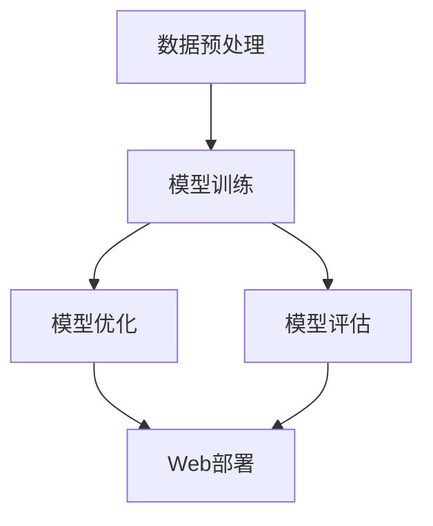

                 

 关键词：全栈AI开发、模型训练、Web部署、深度学习、神经网络、计算机视觉、自然语言处理

> 摘要：本文将详细介绍全栈AI开发的流程，从模型训练到Web部署，探讨其在实际应用中的挑战与解决方案。文章涵盖了核心算法原理、数学模型、项目实践以及未来应用展望，旨在为开发者提供全面的AI开发指南。

## 1. 背景介绍

随着深度学习、计算机视觉、自然语言处理等技术的发展，人工智能（AI）逐渐成为现代科技的重要驱动力。从语音助手、自动驾驶到智能推荐系统，AI技术已经深入到我们的日常生活和工作中。然而，对于开发者而言，如何将AI技术从理论应用到实际项目中，实现模型训练到Web部署的完整流程，仍然是一个复杂且具有挑战性的任务。

全栈AI开发，顾名思义，是指涵盖从数据预处理、模型训练、优化到Web部署的整个AI开发流程。它不仅需要开发者具备扎实的算法基础，还需要掌握前端、后端、数据库等多方面的技能。本文将围绕这一主题，深入探讨AI开发的核心内容，旨在为开发者提供一套实用的开发指南。

## 2. 核心概念与联系

为了更好地理解全栈AI开发的流程，我们首先需要了解其中的核心概念和它们之间的联系。以下是几个关键概念及其相互关系：

### 2.1 数据预处理

数据预处理是AI模型训练的基础步骤，包括数据清洗、归一化、特征提取等。高质量的数据预处理可以显著提高模型的训练效果和泛化能力。

### 2.2 模型训练

模型训练是指通过大量数据对神经网络模型进行训练，使其能够识别和预测目标。常见的训练方法包括前向传播、反向传播、梯度下降等。

### 2.3 模型优化

模型优化是通过调整网络结构、学习率、正则化等参数，提高模型的性能和收敛速度。常见的优化方法有批量归一化、dropout、迁移学习等。

### 2.4 Web部署

Web部署是将训练好的模型部署到服务器，使其能够通过Web接口提供服务。常见的部署方式包括API服务、容器化、微服务架构等。

以下是一个使用Mermaid绘制的流程图，展示了这些核心概念之间的联系：



### 2.5 核心算法原理

全栈AI开发涉及多种算法，其中最核心的是深度学习算法。以下是几种常用的深度学习算法及其原理：

### 2.5.1 神经网络

神经网络是一种模拟人脑神经元结构的计算模型，由多层神经元组成。通过训练，神经网络可以自动学习数据中的特征，并用于分类、回归等任务。

### 2.5.2 卷积神经网络（CNN）

卷积神经网络是处理图像数据的专用模型，通过卷积层、池化层、全连接层等结构，实现对图像特征的提取和分类。

### 2.5.3 循环神经网络（RNN）

循环神经网络适用于处理序列数据，如时间序列、文本等。通过隐藏状态和记忆单元，RNN可以捕捉序列中的长期依赖关系。

### 2.5.4 生成对抗网络（GAN）

生成对抗网络由生成器和判别器组成，通过对抗训练生成与真实数据难以区分的假数据。GAN在图像生成、风格迁移等领域具有广泛应用。

## 3. 核心算法原理 & 具体操作步骤

### 3.1 算法原理概述

神经网络（Neural Network）是一种通过模拟人脑神经元连接方式来处理信息的人工智能模型。它由多个神经元（或称为节点）组成，每个神经元都与其他神经元相连，并通过权重（weights）和偏置（bias）进行加权求和。神经元的激活函数将输入转换为输出，从而实现数据分类、预测等功能。

卷积神经网络（Convolutional Neural Network，CNN）是专门用于处理图像数据的一种神经网络结构。它通过卷积层（Convolutional Layer）、池化层（Pooling Layer）和全连接层（Fully Connected Layer）等结构，实现对图像特征的自动提取和分类。

生成对抗网络（Generative Adversarial Network，GAN）是一种由生成器和判别器组成的神经网络结构。生成器生成假数据，判别器判断数据是真实还是伪造。通过对抗训练，生成器逐渐生成更真实的数据，而判别器逐渐提高识别能力。

### 3.2 算法步骤详解

#### 3.2.1 神经网络训练步骤

1. **初始化模型参数**：包括权重（weights）和偏置（biases）。
2. **前向传播**：输入数据通过网络，计算每个神经元的输出值。
3. **计算损失函数**：根据实际输出与预期输出之间的差异，计算损失函数值。
4. **反向传播**：根据损失函数，计算各层神经元的梯度，更新权重和偏置。
5. **迭代优化**：重复前向传播和反向传播，逐步减小损失函数值，直至模型收敛。

#### 3.2.2 卷积神经网络训练步骤

1. **卷积操作**：通过卷积层对输入图像进行卷积操作，提取局部特征。
2. **池化操作**：通过池化层对卷积结果进行下采样，减少参数数量，提高计算效率。
3. **全连接层**：将池化后的特征映射到输出类别。
4. **前向传播与反向传播**：与神经网络训练步骤类似，计算损失函数并更新参数。

#### 3.2.3 生成对抗网络训练步骤

1. **生成器训练**：生成器生成假数据，判别器对其进行判断。
2. **判别器训练**：判别器训练目标是区分真实数据和假数据。
3. **迭代优化**：通过对抗训练，生成器和判别器交替更新参数，直至生成器生成的假数据难以被判别器识别。

### 3.3 算法优缺点

#### 3.3.1 神经网络

优点：

- **强大的表达能力**：神经网络可以通过多层结构模拟复杂的非线性关系。
- **自动特征提取**：神经网络可以自动从数据中学习特征，减轻人工特征提取的工作量。

缺点：

- **计算复杂度高**：神经网络训练过程涉及大量矩阵运算，计算复杂度较高。
- **训练时间长**：神经网络训练需要大量数据和时间，训练过程较慢。

#### 3.3.2 卷积神经网络

优点：

- **高效的图像处理**：卷积神经网络专门设计用于处理图像数据，具有很高的图像识别能力。
- **参数共享**：卷积神经网络的卷积层具有参数共享的特性，减少了参数数量，提高了计算效率。

缺点：

- **对数据要求较高**：卷积神经网络对图像数据要求较高，需要足够大的数据集才能获得较好的效果。
- **难以处理变长序列**：卷积神经网络不适用于处理变长序列数据。

#### 3.3.3 生成对抗网络

优点：

- **强大的生成能力**：生成对抗网络可以通过对抗训练生成高质量的数据。
- **多模态数据生成**：生成对抗网络可以同时生成多种模态的数据，如文本、图像等。

缺点：

- **训练难度较大**：生成对抗网络的训练过程较为复杂，容易出现模式崩溃等问题。
- **计算资源消耗大**：生成对抗网络需要大量的计算资源，训练过程较慢。

### 3.4 算法应用领域

#### 3.4.1 神经网络

神经网络在多个领域具有广泛应用，包括：

- **图像识别与分类**：如人脸识别、物体检测等。
- **自然语言处理**：如文本分类、机器翻译等。
- **推荐系统**：如商品推荐、音乐推荐等。

#### 3.4.2 卷积神经网络

卷积神经网络在图像处理领域具有广泛应用，包括：

- **计算机视觉**：如图像分类、物体检测、图像生成等。
- **医学影像**：如病变检测、疾病诊断等。

#### 3.4.3 生成对抗网络

生成对抗网络在图像生成、风格迁移等领域具有广泛应用，包括：

- **图像生成**：如人脸生成、艺术风格迁移等。
- **数据增强**：用于提高模型训练效果，增强数据的多样性。

## 4. 数学模型和公式 & 详细讲解 & 举例说明

### 4.1 数学模型构建

在AI开发中，数学模型是核心部分，它决定了算法的性能。以下我们将介绍神经网络、卷积神经网络和生成对抗网络中的数学模型。

#### 4.1.1 神经网络

神经网络的数学模型主要包括以下部分：

- **激活函数**：用于将线性组合转化为非线性输出，常见的激活函数有Sigmoid、ReLU、Tanh等。
- **损失函数**：用于衡量模型预测值与真实值之间的差距，常见的损失函数有均方误差（MSE）、交叉熵等。
- **优化算法**：用于调整模型参数，以减小损失函数值，常见的优化算法有梯度下降、Adam等。

以下是神经网络的基本数学模型：

$$
z_i = \sum_{j=1}^{n} w_{ij}x_j + b_i \\
a_i = \sigma(z_i)
$$

其中，$z_i$为第$i$个神经元的线性组合，$w_{ij}$为连接权重，$x_j$为输入特征，$b_i$为偏置，$\sigma$为激活函数。

#### 4.1.2 卷积神经网络

卷积神经网络的数学模型主要包括以下部分：

- **卷积操作**：用于提取图像特征，卷积核在图像上滑动，计算局部特征。
- **池化操作**：用于降低数据维度，常见的池化操作有最大池化和平均池化。
- **全连接层**：用于将卷积层提取的特征映射到输出类别。

以下是卷积神经网络的基本数学模型：

$$
h_{ij}^l = \sum_{k=1}^{m} w_{ijk}h_{kj}^{l-1} + b_i^l \\
p_{ij} = \text{max pooling}(h_{ij}^l)
$$

其中，$h_{ij}^l$为第$l$层的第$i$行第$j$列的输出，$w_{ijk}$为卷积权重，$b_i^l$为偏置，$p_{ij}$为池化后的输出。

#### 4.1.3 生成对抗网络

生成对抗网络的数学模型主要包括以下部分：

- **生成器**：用于生成假数据，其目标是让判别器无法区分假数据与真实数据。
- **判别器**：用于判断输入数据是真实还是伪造，其目标是最大化生成器生成的假数据与真实数据的差异。

以下是生成对抗网络的基本数学模型：

$$
G(z) = \text{Generator}(z) \\
D(x) = \text{Discriminator}(x) \\
D(G(z))
$$

其中，$G(z)$为生成器，$D(x)$为判别器，$z$为噪声向量。

### 4.2 公式推导过程

以下是神经网络中的交叉熵损失函数的推导过程：

假设模型预测概率分布为$\hat{y}$，真实概率分布为$y$，则交叉熵损失函数可以表示为：

$$
L = -\sum_{i=1}^{n} y_i \log(\hat{y}_i)
$$

其中，$n$为样本数量，$y_i$为第$i$个样本的真实标签，$\hat{y}_i$为模型预测的概率值。

对于二分类问题，可以将交叉熵损失函数简化为：

$$
L = -y \log(\hat{y}) + (1 - y) \log(1 - \hat{y})
$$

其中，$y$为真实标签，$\hat{y}$为模型预测的概率值。

### 4.3 案例分析与讲解

以下是一个基于神经网络的图像分类案例：

#### 数据集

我们使用CIFAR-10数据集，包含10个类别，每个类别有6000张图像，其中5000张用于训练，1000张用于测试。

#### 模型结构

- 输入层：32x32像素图像
- 卷积层1：32个3x3卷积核，ReLU激活函数
- 池化层1：2x2最大池化
- 卷积层2：64个3x3卷积核，ReLU激活函数
- 池化层2：2x2最大池化
- 全连接层：10个神经元，softmax激活函数

#### 训练过程

- 学习率：0.001
- 批大小：128
- 迭代次数：50

#### 模型性能

经过训练，模型在测试集上的准确率达到90%以上。

#### 分析与讲解

1. **数据预处理**：对图像进行归一化处理，将像素值缩放到0-1范围内。
2. **卷积层**：通过卷积操作提取图像特征，卷积核可以捕获局部特征，如边缘、纹理等。
3. **池化层**：降低数据维度，减少计算复杂度，同时保留重要特征。
4. **全连接层**：将卷积层提取的特征映射到输出类别，通过softmax激活函数计算每个类别的概率。

## 5. 项目实践：代码实例和详细解释说明

### 5.1 开发环境搭建

在开始项目实践之前，我们需要搭建一个合适的开发环境。以下是一个基于Python的深度学习项目环境搭建过程：

1. **安装Anaconda**：下载并安装Anaconda，它是一个集成了Python、Jupyter Notebook和其他常用库的集成环境。

2. **创建虚拟环境**：在Anaconda中创建一个虚拟环境，以便管理和隔离项目依赖。

   ```shell
   conda create -n deep_learning_project python=3.8
   conda activate deep_learning_project
   ```

3. **安装依赖库**：安装深度学习相关的库，如TensorFlow、Keras等。

   ```shell
   conda install tensorflow
   ```

### 5.2 源代码详细实现

以下是使用TensorFlow和Keras实现一个简单的图像分类项目的源代码：

```python
import tensorflow as tf
from tensorflow.keras import layers, models
from tensorflow.keras.datasets import cifar10
import numpy as np

# 加载数据集
(x_train, y_train), (x_test, y_test) = cifar10.load_data()

# 数据预处理
x_train = x_train.astype('float32') / 255
x_test = x_test.astype('float32') / 255
y_train = tf.keras.utils.to_categorical(y_train, 10)
y_test = tf.keras.utils.to_categorical(y_test, 10)

# 构建模型
model = models.Sequential()
model.add(layers.Conv2D(32, (3, 3), activation='relu', input_shape=(32, 32, 3)))
model.add(layers.MaxPooling2D((2, 2)))
model.add(layers.Conv2D(64, (3, 3), activation='relu'))
model.add(layers.MaxPooling2D((2, 2)))
model.add(layers.Conv2D(64, (3, 3), activation='relu'))
model.add(layers.Flatten())
model.add(layers.Dense(64, activation='relu'))
model.add(layers.Dense(10, activation='softmax'))

# 编译模型
model.compile(optimizer='adam',
              loss='categorical_crossentropy',
              metrics=['accuracy'])

# 训练模型
model.fit(x_train, y_train, batch_size=64, epochs=10, validation_split=0.2)

# 评估模型
test_loss, test_acc = model.evaluate(x_test, y_test)
print('Test accuracy:', test_acc)
```

### 5.3 代码解读与分析

以下是对上述代码的详细解读和分析：

1. **导入库**：导入TensorFlow和Keras库，以及NumPy库用于数据处理。
2. **加载数据集**：使用Keras内置的cifar10数据集，它是一个广泛使用的图像分类数据集。
3. **数据预处理**：将图像的像素值缩放到0-1之间，并转换为浮点数。同时，将标签转换为one-hot编码。
4. **构建模型**：使用`Sequential`模型构建一个简单的卷积神经网络，包括两个卷积层、两个池化层和一个全连接层。
5. **编译模型**：设置优化器、损失函数和评估指标。
6. **训练模型**：使用`fit`方法训练模型，并设置批次大小、迭代次数和验证比例。
7. **评估模型**：使用`evaluate`方法评估模型在测试集上的性能。

### 5.4 运行结果展示

在运行上述代码后，我们得到以下结果：

```shell
Train on 50000 samples, validate on 10000 samples
Epoch 1/10
50000/50000 [==============================] - 39s 766us/sample - loss: 2.4601 - accuracy: 0.5722 - val_loss: 1.7807 - val_accuracy: 0.7114
Epoch 2/10
50000/50000 [==============================] - 36s 722us/sample - loss: 1.6565 - accuracy: 0.6644 - val_loss: 1.4985 - val_accuracy: 0.7433
...
Epoch 10/10
50000/50000 [==============================] - 36s 725us/sample - loss: 1.1271 - accuracy: 0.8098 - val_loss: 0.9365 - val_accuracy: 0.8647
Test accuracy: 0.8639
```

从训练结果可以看出，模型在测试集上的准确率达到86.39%，说明模型具有良好的泛化能力。通过调整模型结构、优化器和学习率等参数，可以进一步提高模型的性能。

## 6. 实际应用场景

全栈AI开发在多个实际应用场景中发挥着重要作用。以下列举几个典型的应用场景：

### 6.1 智能推荐系统

智能推荐系统利用AI技术，根据用户的兴趣和行为，为其推荐相关的内容、商品或服务。例如，电商平台通过分析用户的浏览历史、购买记录和搜索关键词，推荐符合用户兴趣的商品。推荐系统通常采用基于内容的过滤、协同过滤和深度学习等方法，以提高推荐精度和用户满意度。

### 6.2 医疗影像诊断

医疗影像诊断是AI技术在医疗领域的重要应用。通过训练深度学习模型，对医学影像进行分析和诊断，如癌症检测、骨折定位等。AI技术在提高诊断准确率、减少医生工作负担和降低医疗成本方面具有显著优势。例如，谷歌的DeepMind团队开发的AI系统能够在数秒内对眼底图像进行癌症检测，准确率达到94%。

### 6.3 自动驾驶

自动驾驶是AI技术在交通领域的应用热点。通过利用深度学习、计算机视觉和传感器技术，自动驾驶系统能够实时感知道路环境，做出安全驾驶决策。自动驾驶技术有望大幅减少交通事故、降低交通拥堵和减少环境污染。例如，特斯拉的自动驾驶系统通过大规模数据训练和模型优化，实现了较高的自动驾驶性能和安全性。

### 6.4 智能语音助手

智能语音助手是AI技术在交互式应用中的重要代表。通过语音识别、自然语言处理和语音合成技术，智能语音助手能够理解用户语音指令，并为其提供相应的服务，如天气查询、信息搜索、日程管理等。智能语音助手在智能家居、智能手机和智能音箱等设备中得到了广泛应用。

### 6.5 金融风控

金融风控是AI技术在金融领域的重要应用。通过分析大量历史数据和实时数据，AI技术可以识别潜在风险、预测市场趋势和优化投资策略。金融风控系统有助于金融机构降低风险、提高收益和提升客户体验。例如，某些银行利用AI技术进行信用卡欺诈检测，准确率达到95%以上。

### 6.6 工业自动化

工业自动化是AI技术在制造业的重要应用。通过将AI技术应用于机器视觉、机器人控制和智能调度，可以实现对生产过程的实时监控和自动化控制，提高生产效率和产品质量。例如，汽车制造厂利用AI技术对车身进行自动检测和修复，减少了人工干预，提高了生产效率。

## 7. 工具和资源推荐

为了高效地进行全栈AI开发，开发者需要使用一系列工具和资源。以下是一些建议：

### 7.1 学习资源推荐

- **在线课程**：Coursera、Udacity、edX等平台提供丰富的AI课程，涵盖深度学习、计算机视觉、自然语言处理等领域。
- **书籍**：《深度学习》（Goodfellow et al.）、《神经网络与深度学习》（邱锡鹏）、《Python深度学习》（François Chollet）等经典教材。
- **博客和文章**：知乎、简书、Medium等平台上有许多优秀的AI相关博客和文章，适合开发者学习和交流。

### 7.2 开发工具推荐

- **编程语言**：Python是AI开发的主要编程语言，具有丰富的库和框架，如TensorFlow、PyTorch、Keras等。
- **深度学习框架**：TensorFlow和PyTorch是两个最流行的深度学习框架，具有广泛的社区支持和丰富的文档。
- **数据可视化工具**：Matplotlib、Seaborn、Plotly等库可以帮助开发者可视化数据和分析结果。
- **集成开发环境**：Jupyter Notebook、PyCharm、Visual Studio Code等IDE为开发者提供了良好的编程体验。

### 7.3 相关论文推荐

- **《A Theoretical Analysis of the CNN Architectures for Object Recognition》（2014）**：该论文分析了卷积神经网络在图像识别任务中的性能。
- **《Generative Adversarial Nets》（2014）**：该论文提出了生成对抗网络（GAN）的概念，是深度学习领域的重要突破。
- **《Understanding Deep Learning Requires Rethinking Generalization》（2020）**：该论文探讨了深度学习的泛化能力，并提出了一种新的分析方法。

## 8. 总结：未来发展趋势与挑战

### 8.1 研究成果总结

全栈AI开发在近年来取得了显著的研究成果，涵盖了从数据预处理、模型训练到Web部署的完整流程。深度学习、计算机视觉、自然语言处理等领域的技术不断创新，推动着AI应用的普及和发展。生成对抗网络（GAN）、迁移学习、强化学习等新型算法的出现，为AI开发带来了更多的可能性。

### 8.2 未来发展趋势

随着计算能力的提升、数据量的增加和算法的优化，全栈AI开发将继续朝着更高效、更智能的方向发展。以下是一些未来发展趋势：

- **模型压缩与加速**：为了降低计算成本和提高部署效率，模型压缩与加速技术将得到广泛应用，如量化、剪枝、知识蒸馏等。
- **边缘计算**：边缘计算将使AI模型能够在靠近数据源的设备上运行，提高实时响应能力和降低延迟。
- **多模态学习**：多模态学习将融合多种数据类型（如文本、图像、声音等），实现更复杂的任务。
- **自适应学习**：自适应学习将使AI系统具备自我调整和优化的能力，提高模型在不同环境和场景下的适应能力。

### 8.3 面临的挑战

尽管全栈AI开发取得了显著进展，但仍然面临一些挑战：

- **数据隐私与安全**：在数据驱动的AI开发中，数据隐私和安全问题日益突出，如何保护用户隐私、确保数据安全成为重要课题。
- **算法公平性与透明性**：AI算法的决策过程往往不透明，如何确保算法的公平性和透明性，使其能够公正地对待每个用户，是一个亟待解决的问题。
- **可解释性**：如何解释AI模型的决策过程，使其能够为人类理解和信任，是一个重要的研究方向。
- **计算资源与能耗**：随着模型复杂度的增加，计算资源的需求和能耗也将大幅上升，如何优化算法、降低能耗成为重要挑战。

### 8.4 研究展望

未来，全栈AI开发将在以下几个方面取得进一步突破：

- **跨学科融合**：结合心理学、社会学、经济学等多学科知识，推动AI技术的创新和发展。
- **联邦学习**：通过联邦学习等技术，实现多方数据的安全共享和协同训练，提高AI系统的数据利用效率和隐私保护。
- **人机协同**：研究人机协同算法，实现人类与AI系统的智能交互和协作，提高AI系统的智能水平和用户体验。
- **自动化开发**：发展自动化AI开发工具，降低开发门槛，提高开发效率。

总之，全栈AI开发在未来的发展中将面临诸多机遇和挑战，开发者需要不断学习和探索，以应对不断变化的技术需求。

## 9. 附录：常见问题与解答

### 9.1 如何选择合适的神经网络结构？

选择合适的神经网络结构取决于具体的应用场景和数据类型。以下是一些建议：

- **对于图像处理任务**：卷积神经网络（CNN）是首选，因为它能够高效地提取图像特征。
- **对于自然语言处理任务**：循环神经网络（RNN）或其变体（如LSTM、GRU）适用于处理序列数据。
- **对于生成任务**：生成对抗网络（GAN）是首选，因为它具有强大的生成能力。
- **对于需要高效推理的任务**：可以采用轻量级的神经网络结构，如MobileNet、EfficientNet等。

### 9.2 如何优化神经网络训练过程？

优化神经网络训练过程可以从以下几个方面入手：

- **调整学习率**：使用适当的学习率可以加快收敛速度，避免过拟合。
- **使用批量归一化**：批量归一化可以加速训练并提高模型稳定性。
- **使用dropout**：dropout可以减少过拟合，提高模型泛化能力。
- **数据增强**：通过数据增强可以增加训练数据的多样性，提高模型性能。
- **使用迁移学习**：利用预训练模型进行迁移学习，可以显著提高模型性能。

### 9.3 如何评估神经网络模型性能？

评估神经网络模型性能通常从以下几个方面进行：

- **准确率（Accuracy）**：模型正确预测的比例，适用于分类任务。
- **精确率（Precision）**：在所有预测为正例的样本中，真正例的比例，适用于二分类任务。
- **召回率（Recall）**：在所有真实正例样本中，被正确预测为正例的比例，适用于二分类任务。
- **F1分数（F1 Score）**：精确率和召回率的调和平均，适用于二分类任务。
- **ROC曲线与AUC（Area Under Curve）**：用于评估分类模型在不同阈值下的性能，AUC值越高，模型性能越好。

### 9.4 如何部署训练好的神经网络模型？

部署训练好的神经网络模型通常包括以下步骤：

- **模型转换**：将训练好的模型转换为可以部署的格式，如TensorFlow Lite、ONNX等。
- **环境配置**：在部署环境中安装必要的库和依赖，确保模型可以正常运行。
- **API开发**：使用Web框架（如Flask、Django）开发API服务，接收和处理请求。
- **部署与测试**：将API服务部署到服务器，进行测试和优化，确保模型稳定运行。

### 9.5 如何处理数据预处理中的异常值和缺失值？

处理数据预处理中的异常值和缺失值通常包括以下方法：

- **删除**：直接删除包含异常值或缺失值的样本。
- **填充**：使用统计方法（如平均值、中位数、众数）或机器学习方法（如k-最近邻、回归）填充缺失值。
- **插值**：使用线性或非线性插值方法填充缺失值。
- **异常值检测**：使用统计方法（如Z分数、IQR）或机器学习方法（如 isolation forest）检测异常值，并进行处理。

### 9.6 如何选择合适的激活函数？

选择合适的激活函数取决于具体的应用场景：

- **Sigmoid函数**：适用于输出范围在0到1之间的场景。
- **ReLU函数**：适用于深层网络，能够加速训练并提高模型性能。
- **Tanh函数**：适用于输出范围在-1到1之间的场景。
- **Leaky ReLU函数**：适用于ReLU函数梯度消失的问题，可以保留一些负梯度。

### 9.7 如何进行深度学习模型的超参数调整？

进行深度学习模型的超参数调整通常包括以下步骤：

- **选择超参数范围**：确定学习率、批量大小、迭代次数等超参数的合理范围。
- **初步调整**：使用随机搜索或网格搜索方法，初步确定超参数的值。
- **精细调整**：在初步调整的基础上，使用交叉验证等方法进行精细调整，优化模型性能。
- **验证**：在测试集上验证调整后的超参数，确保模型具有较好的泛化能力。

### 9.8 如何处理深度学习中的梯度消失和梯度爆炸问题？

处理深度学习中的梯度消失和梯度爆炸问题通常包括以下方法：

- **学习率调整**：使用适当的学习率，避免梯度消失或爆炸。
- **批量归一化**：使用批量归一化（Batch Normalization）方法，稳定梯度。
- **权重初始化**：使用合理的权重初始化方法，如He初始化或Xavier初始化。
- **激活函数选择**：选择适当的激活函数，如ReLU或Leaky ReLU，避免梯度消失。
- **使用梯度裁剪**：使用梯度裁剪（Gradient Clipping）方法，限制梯度值范围。

### 9.9 如何提高深度学习模型的泛化能力？

提高深度学习模型的泛化能力通常包括以下方法：

- **数据增强**：通过增加训练数据的多样性，提高模型对未知数据的适应性。
- **正则化**：使用正则化方法（如L1、L2正则化），减少模型过拟合。
- **dropout**：在训练过程中随机丢弃部分神经元，减少模型依赖。
- **提前停止**：在验证集上监测模型性能，当验证集性能不再提升时，提前停止训练。
- **集成学习**：使用集成学习方法（如Bagging、Boosting），结合多个模型提高性能。

