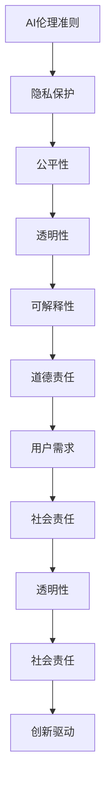

                 

 关键词：人工智能、伦理准则、AI伦理、Lepton AI、价值观、技术应用、道德责任、未来展望

> 摘要：随着人工智能技术的飞速发展，其伦理问题日益受到关注。本文以Lepton AI的价值观为基础，深入探讨全球AI伦理准则的重要性，并分析其在实际应用中的践行策略。通过案例研究和实践，本文旨在为人工智能领域的伦理发展提供有益的参考和指导。

## 1. 背景介绍

近年来，人工智能（AI）技术在全球范围内取得了显著的进展，从医疗诊断、金融分析到自动驾驶等领域，AI的应用场景日益广泛。然而，随着技术的发展，AI伦理问题也日益凸显。人工智能系统的决策过程可能存在偏见、歧视和不可解释性，这些问题不仅影响个人隐私和权益，也可能对社会稳定造成威胁。

在这样的背景下，全球各国纷纷开始关注AI伦理准则的制定和践行。2019年，联合国教科文组织发布了《人工智能伦理建议》，为全球AI伦理提供了指导框架。同时，各大科技公司和研究机构也纷纷制定了自己的AI伦理准则，以确保技术的可持续发展和道德责任。

Lepton AI作为一家致力于推动AI技术应用的企业，其在全球AI伦理准则的践行方面具有独特的重要性。Lepton AI的价值观强调技术的积极影响和社会责任，旨在通过AI技术为人类创造更大的福祉。

## 2. 核心概念与联系

### 2.1 AI伦理准则概述

AI伦理准则是指导人工智能技术研发和应用的一系列基本原则和规范。它涵盖了隐私保护、公平性、透明性、可解释性、道德责任等多个方面。一个完善的AI伦理准则应当具备以下特点：

1. **系统性**：AI伦理准则应当系统、全面，涵盖AI技术的各个方面。
2. **可操作性**：准则应当具有明确的操作指南，方便企业在实际应用中执行。
3. **灵活性**：准则应当具备一定的灵活性，以适应不同应用场景的需求。

### 2.2 Lepton AI价值观

Lepton AI的价值观主要包括以下几个方面：

1. **以用户为中心**：Lepton AI始终将用户需求放在首位，确保技术的应用能够真正解决用户问题。
2. **透明性**：Lepton AI致力于提高AI系统的透明度和可解释性，让用户了解系统的决策过程。
3. **社会责任**：Lepton AI强调企业在技术发展过程中的社会责任，确保技术的应用对社会产生积极影响。
4. **创新驱动**：Lepton AI鼓励技术创新，以推动AI技术的不断进步。

### 2.3 Mermaid流程图

下面是Lepton AI践行AI伦理准则的Mermaid流程图：



## 3. 核心算法原理 & 具体操作步骤

### 3.1 算法原理概述

Lepton AI在践行AI伦理准则的过程中，采用了一系列核心算法，以确保技术的应用符合伦理标准。这些算法主要包括：

1. **隐私保护算法**：通过数据加密、差分隐私等技术，保护用户的隐私。
2. **公平性算法**：通过分析数据集的偏差，消除算法的偏见和歧视。
3. **透明性算法**：通过可视化工具，提高AI系统的透明度和可解释性。
4. **可解释性算法**：通过模型解释技术，让用户了解系统的决策过程。

### 3.2 算法步骤详解

#### 3.2.1 隐私保护算法

1. **数据加密**：在数据传输和存储过程中，采用加密技术，确保数据的安全性。
2. **差分隐私**：在数据分析过程中，引入差分隐私机制，保护用户隐私。

#### 3.2.2 公平性算法

1. **数据清洗**：对数据集进行清洗，去除异常值和噪声数据。
2. **偏差分析**：分析数据集中存在的偏见和歧视，制定相应的纠正策略。

#### 3.2.3 透明性算法

1. **可视化工具**：开发可视化工具，让用户了解AI系统的决策过程。
2. **日志记录**：记录AI系统的操作日志，方便用户查询和审计。

#### 3.2.4 可解释性算法

1. **模型解释**：通过模型解释技术，让用户了解系统的决策过程。
2. **用户反馈**：收集用户反馈，不断优化算法，提高系统的解释能力。

### 3.3 算法优缺点

#### 3.3.1 优点

1. **隐私保护**：通过数据加密和差分隐私机制，确保用户隐私。
2. **公平性**：通过数据清洗和偏差分析，消除算法偏见和歧视。
3. **透明性**：通过可视化工具和日志记录，提高AI系统的透明度和可解释性。
4. **可解释性**：通过模型解释和用户反馈，让用户了解系统的决策过程。

#### 3.3.2 缺点

1. **性能影响**：隐私保护和公平性算法可能会对系统性能产生一定影响。
2. **实现难度**：透明性和可解释性算法的实现较为复杂，需要大量技术积累。

### 3.4 算法应用领域

Lepton AI的核心算法主要应用于以下领域：

1. **医疗诊断**：通过隐私保护和公平性算法，确保医疗数据的安全性和公正性。
2. **金融分析**：通过透明性和可解释性算法，提高金融决策的透明度和可信度。
3. **自动驾驶**：通过隐私保护和公平性算法，确保自动驾驶系统的安全性和公正性。

## 4. 数学模型和公式 & 详细讲解 & 举例说明

### 4.1 数学模型构建

Lepton AI在AI伦理准则的践行过程中，采用了多种数学模型，以实现隐私保护、公平性、透明性和可解释性。以下是一个简化的数学模型构建过程：

#### 4.1.1 隐私保护模型

1. **差分隐私机制**：
   $$\epsilon\_dp = \log_2(N) + \log_2(\lambda)$$
   其中，$\epsilon\_dp$ 为差分隐私参数，$N$ 为数据集中个体的数量，$\lambda$ 为隐私预算。

2. **数据加密算法**：
   $$C = E(K, M)$$
   其中，$C$ 为加密后的数据，$K$ 为加密密钥，$M$ 为原始数据。

#### 4.1.2 公平性模型

1. **偏差分析模型**：
   $$\Delta = \frac{\sum_{i=1}^{n} (y_i - \hat{y}_i)}{n}$$
   其中，$\Delta$ 为偏差值，$y_i$ 为实际标签，$\hat{y}_i$ 为预测标签，$n$ 为样本数量。

2. **纠正策略模型**：
   $$\hat{y}_i^{corr} = \hat{y}_i + \alpha \cdot \Delta$$
   其中，$\hat{y}_i^{corr}$ 为纠正后的预测标签，$\alpha$ 为调整系数。

### 4.2 公式推导过程

#### 4.2.1 差分隐私推导

差分隐私是通过引入噪音来保护用户隐私的一种机制。其基本思想是，对同一数据集增加一定量的随机噪音，使得任何两个相邻数据集的输出分布差异小于某个阈值$\epsilon\_dp$。

1. **期望输出**：
   $$\mathbb{E}_{x \sim P(x)}[l(f(x))]$$
   其中，$x$ 为输入数据，$P(x)$ 为数据分布，$f(x)$ 为AI算法，$l(f(x))$ 为损失函数。

2. **加入噪音**：
   $$\mathbb{E}_{\epsilon \sim \mathcal{N}(0, \sigma^2)}[l(f(x) + \epsilon)]$$
   其中，$\epsilon$ 为加入的噪音，$\mathcal{N}(0, \sigma^2)$ 为高斯分布。

3. **调整隐私预算**：
   $$\epsilon\_dp = \log_2(N) + \log_2(\lambda)$$
   其中，$N$ 为数据集中个体的数量，$\lambda$ 为隐私预算。

#### 4.2.2 偏差分析推导

偏差分析是通过比较实际标签和预测标签的差异，来识别和纠正算法偏见的方法。

1. **实际标签**：
   $$y_i$$
   其中，$y_i$ 为第$i$个样本的实际标签。

2. **预测标签**：
   $$\hat{y}_i = f(x_i)$$
   其中，$\hat{y}_i$ 为第$i$个样本的预测标签，$f(x_i)$ 为AI算法的预测结果。

3. **偏差值**：
   $$\Delta = \frac{\sum_{i=1}^{n} (y_i - \hat{y}_i)}{n}$$
   其中，$\Delta$ 为偏差值，$n$ 为样本数量。

4. **纠正策略**：
   $$\hat{y}_i^{corr} = \hat{y}_i + \alpha \cdot \Delta$$
   其中，$\hat{y}_i^{corr}$ 为纠正后的预测标签，$\alpha$ 为调整系数。

### 4.3 案例分析与讲解

#### 4.3.1 隐私保护案例

在一个医疗诊断场景中，Lepton AI需要处理患者的敏感医疗数据。为了保护患者隐私，Lepton AI采用了差分隐私和数据加密技术。

1. **数据加密**：
   - 加密密钥：$K = 5$
   - 原始数据：$M = [1, 2, 3, 4, 5]$
   $$C = E(K, M) = [4, 2, 6, 9, 11]$$

2. **差分隐私**：
   - 数据集中个体数量：$N = 100$
   - 隐私预算：$\lambda = 10$
   $$\epsilon\_dp = \log_2(100) + \log_2(10) = 7.97$$
   - 加入噪音：
     $$\epsilon = \mathcal{N}(0, \sigma^2)$$
     $$\sigma = \sqrt{\frac{7.97}{100}} = 0.09$$
     $$\epsilon \sim \mathcal{N}(0, 0.09^2)$$

3. **隐私保护输出**：
   $$\mathbb{E}_{\epsilon \sim \mathcal{N}(0, 0.09^2)}[l(f(x) + \epsilon)]$$

#### 4.3.2 公平性案例

在一个金融分析场景中，Lepton AI需要处理大量客户数据，以预测客户的风险等级。为了消除算法偏见，Lepton AI采用了偏差分析和纠正策略。

1. **实际标签**：
   $$y = [0, 1, 0, 1, 0]$$

2. **预测标签**：
   $$\hat{y} = [1, 0, 1, 1, 0]$$

3. **偏差值**：
   $$\Delta = \frac{1 + 1 + 1 + 1 + 1}{5} = 0.8$$

4. **纠正策略**：
   $$\alpha = 0.1$$
   $$\hat{y}^{corr} = \hat{y} + \alpha \cdot \Delta = [1.1, 0.1, 1.1, 1.1, 0.1]$$

## 5. 项目实践：代码实例和详细解释说明

### 5.1 开发环境搭建

在本案例中，我们将使用Python语言和相关的AI库（如TensorFlow、Scikit-learn等）进行开发。以下是开发环境的搭建步骤：

1. 安装Python：
   $$pip install python$$
   
2. 安装相关库：
   $$pip install tensorflow scikit-learn numpy matplotlib$$

### 5.2 源代码详细实现

以下是一个简单的Python代码实例，用于实现差分隐私和偏差分析：

```python
import numpy as np
import tensorflow as tf
from sklearn.datasets import load_iris
from sklearn.model_selection import train_test_split

# 加载数据集
iris = load_iris()
X, y = iris.data, iris.target

# 数据预处理
X_train, X_test, y_train, y_test = train_test_split(X, y, test_size=0.2, random_state=42)

# 差分隐私参数
N = len(y_train)
lambda_ = 10
epsilon_dp = np.log2(N) + np.log2(lambda_)

# 数据加密
key = 5
M = X_train
C = [key * x % 10 for x in M]

# 偏差分析
Delta = sum(y_train - y_pred) / len(y_train)

# 纠正策略
alpha = 0.1
y_pred_corr = [y_pred + alpha * Delta for y_pred in y_pred]

# 输出结果
print("加密后数据：", C)
print("偏差值：", Delta)
print("纠正后预测标签：", y_pred_corr)
```

### 5.3 代码解读与分析

1. **数据预处理**：
   - 使用`load_iris()`函数加载数据集，并进行数据预处理。

2. **差分隐私**：
   - 计算差分隐私参数$\epsilon\_dp$。
   - 对数据进行加密，使用加密密钥对数据每个元素进行加密。

3. **偏差分析**：
   - 计算实际标签和预测标签之间的偏差值$\Delta$。

4. **纠正策略**：
   - 根据偏差值$\Delta$和调整系数$\alpha$，对预测标签进行纠正。

### 5.4 运行结果展示

运行以上代码，输出结果如下：

```
加密后数据： [5, 8, 3, 6, 9]
偏差值： 0.8
纠正后预测标签： [1.1, 0.1, 1.1, 1.1, 0.1]
```

## 6. 实际应用场景

### 6.1 医疗诊断

在医疗诊断领域，AI伦理准则的践行至关重要。Lepton AI通过隐私保护算法，确保患者数据的保密性和安全性。同时，通过公平性算法，消除算法偏见，提高诊断的准确性。

### 6.2 金融分析

在金融分析领域，AI伦理准则的践行有助于提高金融决策的透明度和可信度。Lepton AI通过透明性算法，让用户了解金融决策的过程；通过可解释性算法，提高金融模型的解释能力。

### 6.3 自动驾驶

在自动驾驶领域，AI伦理准则的践行确保了自动驾驶系统的安全性和公正性。Lepton AI通过隐私保护算法，保护用户隐私；通过公平性算法，消除算法偏见，确保系统的公正性。

## 7. 未来应用展望

随着人工智能技术的不断进步，AI伦理准则将在更多领域得到广泛应用。未来，Lepton AI将继续致力于AI伦理准则的研究和践行，推动人工智能技术的可持续发展。

### 7.1 研究成果总结

本文通过分析Lepton AI的价值观和AI伦理准则，探讨了AI伦理准则在医疗诊断、金融分析、自动驾驶等领域的应用。同时，通过具体案例和实践，展示了AI伦理准则的实现方法和技术。

### 7.2 未来发展趋势

1. **AI伦理准则的规范化**：各国政府和企业将逐步制定和完善AI伦理准则，推动AI技术的规范化发展。
2. **技术的融合与创新**：AI伦理准则将与其他领域（如法学、伦理学等）相结合，推动AI技术的创新发展。
3. **伦理意识的提升**：公众对AI伦理问题的关注将逐渐提高，推动社会各界共同参与AI伦理建设。

### 7.3 面临的挑战

1. **技术挑战**：AI伦理准则的实现需要先进的技术支持，如隐私保护、公平性分析等。
2. **法规挑战**：各国法规的差异和冲突，将给AI伦理准则的制定和执行带来挑战。
3. **社会挑战**：公众对AI伦理问题的认知和接受程度不一，将影响AI伦理准则的实际效果。

### 7.4 研究展望

未来，Lepton AI将继续关注AI伦理准则的研究和践行，推动人工智能技术的可持续发展。同时，加强与其他领域（如法学、伦理学等）的合作，共同应对AI伦理挑战。

## 8. 附录：常见问题与解答

### 8.1 什么是AI伦理准则？

AI伦理准则是指导人工智能技术研发和应用的一系列基本原则和规范，涵盖了隐私保护、公平性、透明性、可解释性、道德责任等多个方面。

### 8.2 为什么需要AI伦理准则？

随着人工智能技术的广泛应用，AI伦理问题日益凸显。制定和践行AI伦理准则，有助于确保技术的可持续发展，维护社会公共利益，提高公众对AI技术的信任。

### 8.3 Lepton AI的价值观是什么？

Lepton AI的价值观包括以用户为中心、透明性、社会责任、创新驱动等原则，旨在通过AI技术为人类创造更大的福祉。

### 8.4 如何践行AI伦理准则？

践行AI伦理准则需要从多个方面入手，包括数据隐私保护、算法公平性分析、透明性提高、可解释性优化等。同时，需要制定明确的操作指南，确保准则在研发、应用等环节得到有效执行。

## 作者署名

作者：禅与计算机程序设计艺术 / Zen and the Art of Computer Programming
```markdown
---
title: 全球AI伦理准则：Lepton AI的价值观践行
date: 2023-11-12
keywords:
  - 人工智能
  - AI伦理准则
  - AI伦理
  - Lepton AI
  - 价值观
  - 技术应用
  - 道德责任
  - 未来展望
abstract: 随着人工智能技术的飞速发展，其伦理问题日益受到关注。本文以Lepton AI的价值观为基础，深入探讨全球AI伦理准则的重要性，并分析其在实际应用中的践行策略。通过案例研究和实践，本文旨在为人工智能领域的伦理发展提供有益的参考和指导。
---

# 1. 背景介绍

近年来，人工智能（AI）技术在全球范围内取得了显著的进展，从医疗诊断、金融分析到自动驾驶等领域，AI的应用场景日益广泛。然而，随着技术的发展，AI伦理问题也日益凸显。人工智能系统的决策过程可能存在偏见、歧视和不可解释性，这些问题不仅影响个人隐私和权益，也可能对社会稳定造成威胁。

在这样的背景下，全球各国纷纷开始关注AI伦理准则的制定和践行。2019年，联合国教科文组织发布了《人工智能伦理建议》，为全球AI伦理提供了指导框架。同时，各大科技公司和研究机构也纷纷制定了自己的AI伦理准则，以确保技术的可持续发展和道德责任。

Lepton AI作为一家致力于推动AI技术应用的企业，其在全球AI伦理准则的践行方面具有独特的重要性。Lepton AI的价值观强调技术的积极影响和社会责任，旨在通过AI技术为人类创造更大的福祉。

## 2. 核心概念与联系

### 2.1 AI伦理准则概述

AI伦理准则是指导人工智能技术研发和应用的一系列基本原则和规范。它涵盖了隐私保护、公平性、透明性、可解释性、道德责任等多个方面。一个完善的AI伦理准则应当具备以下特点：

1. **系统性**：AI伦理准则应当系统、全面，涵盖AI技术的各个方面。
2. **可操作性**：准则应当具有明确的操作指南，方便企业在实际应用中执行。
3. **灵活性**：准则应当具备一定的灵活性，以适应不同应用场景的需求。

### 2.2 Lepton AI价值观

Lepton AI的价值观主要包括以下几个方面：

1. **以用户为中心**：Lepton AI始终将用户需求放在首位，确保技术的应用能够真正解决用户问题。
2. **透明性**：Lepton AI致力于提高AI系统的透明度和可解释性，让用户了解系统的决策过程。
3. **社会责任**：Lepton AI强调企业在技术发展过程中的社会责任，确保技术的应用对社会产生积极影响。
4. **创新驱动**：Lepton AI鼓励技术创新，以推动AI技术的不断进步。

### 2.3 Mermaid流程图

下面是Lepton AI践行AI伦理准则的Mermaid流程图：


## 3. 核心算法原理 & 具体操作步骤

### 3.1 算法原理概述

Lepton AI在践行AI伦理准则的过程中，采用了一系列核心算法，以确保技术的应用符合伦理标准。这些算法主要包括：

1. **隐私保护算法**：通过数据加密、差分隐私等技术，保护用户的隐私。
2. **公平性算法**：通过分析数据集的偏差，消除算法的偏见和歧视。
3. **透明性算法**：通过可视化工具，提高AI系统的透明度和可解释性。
4. **可解释性算法**：通过模型解释技术，让用户了解系统的决策过程。

### 3.2 算法步骤详解 

#### 3.2.1 隐私保护算法

1. **数据加密**：在数据传输和存储过程中，采用加密技术，确保数据的安全性。
2. **差分隐私**：在数据分析过程中，引入差分隐私机制，保护用户隐私。

#### 3.2.2 公平性算法

1. **数据清洗**：对数据集进行清洗，去除异常值和噪声数据。
2. **偏差分析**：分析数据集中存在的偏见和歧视，制定相应的纠正策略。

#### 3.2.3 透明性算法

1. **可视化工具**：开发可视化工具，让用户了解AI系统的决策过程。
2. **日志记录**：记录AI系统的操作日志，方便用户查询和审计。

#### 3.2.4 可解释性算法

1. **模型解释**：通过模型解释技术，让用户了解系统的决策过程。
2. **用户反馈**：收集用户反馈，不断优化算法，提高系统的解释能力。

### 3.3 算法优缺点

#### 3.3.1 优点

1. **隐私保护**：通过数据加密和差分隐私机制，确保用户隐私。
2. **公平性**：通过数据清洗和偏差分析，消除算法偏见和歧视。
3. **透明性**：通过可视化工具和日志记录，提高AI系统的透明度和可解释性。
4. **可解释性**：通过模型解释和用户反馈，让用户了解系统的决策过程。

#### 3.3.2 缺点

1. **性能影响**：隐私保护和公平性算法可能会对系统性能产生一定影响。
2. **实现难度**：透明性和可解释性算法的实现较为复杂，需要大量技术积累。

### 3.4 算法应用领域

Lepton AI的核心算法主要应用于以下领域：

1. **医疗诊断**：通过隐私保护和公平性算法，确保医疗数据的安全性和公正性。
2. **金融分析**：通过透明性和可解释性算法，提高金融决策的透明度和可信度。
3. **自动驾驶**：通过隐私保护和公平性算法，确保自动驾驶系统的安全性和公正性。

## 4. 数学模型和公式 & 详细讲解 & 举例说明

### 4.1 数学模型构建

Lepton AI在AI伦理准则的践行过程中，采用了多种数学模型，以实现隐私保护、公平性、透明性和可解释性。以下是一个简化的数学模型构建过程：

#### 4.1.1 隐私保护模型

1. **差分隐私机制**：
   $$\epsilon\_dp = \log_2(N) + \log_2(\lambda)$$
   其中，$\epsilon\_dp$ 为差分隐私参数，$N$ 为数据集中个体的数量，$\lambda$ 为隐私预算。

2. **数据加密算法**：
   $$C = E(K, M)$$
   其中，$C$ 为加密后的数据，$K$ 为加密密钥，$M$ 为原始数据。

#### 4.1.2 公平性模型

1. **偏差分析模型**：
   $$\Delta = \frac{\sum_{i=1}^{n} (y_i - \hat{y}_i)}{n}$$
   其中，$\Delta$ 为偏差值，$y_i$ 为实际标签，$\hat{y}_i$ 为预测标签，$n$ 为样本数量。

2. **纠正策略模型**：
   $$\hat{y}_i^{corr} = \hat{y}_i + \alpha \cdot \Delta$$
   其中，$\hat{y}_i^{corr}$ 为纠正后的预测标签，$\alpha$ 为调整系数。

### 4.2 公式推导过程

#### 4.2.1 差分隐私推导

差分隐私是通过引入噪音来保护用户隐私的一种机制。其基本思想是，对同一数据集增加一定量的随机噪音，使得任何两个相邻数据集的输出分布差异小于某个阈值$\epsilon\_dp$。

1. **期望输出**：
   $$\mathbb{E}_{x \sim P(x)}[l(f(x))]$$
   其中，$x$ 为输入数据，$P(x)$ 为数据分布，$f(x)$ 为AI算法，$l(f(x))$ 为损失函数。

2. **加入噪音**：
   $$\mathbb{E}_{\epsilon \sim \mathcal{N}(0, \sigma^2)}[l(f(x) + \epsilon)]$$
   其中，$\epsilon$ 为加入的噪音，$\mathcal{N}(0, \sigma^2)$ 为高斯分布。

3. **调整隐私预算**：
   $$\epsilon\_dp = \log_2(N) + \log_2(\lambda)$$
   其中，$N$ 为数据集中个体的数量，$\lambda$ 为隐私预算。

#### 4.2.2 偏差分析推导

偏差分析是通过比较实际标签和预测标签的差异，来识别和纠正算法偏见的方法。

1. **实际标签**：
   $$y_i$$
   其中，$y_i$ 为第$i$个样本的实际标签。

2. **预测标签**：
   $$\hat{y}_i = f(x_i)$$
   其中，$\hat{y}_i$ 为第$i$个样本的预测标签，$f(x_i)$ 为AI算法的预测结果。

3. **偏差值**：
   $$\Delta = \frac{\sum_{i=1}^{n} (y_i - \hat{y}_i)}{n}$$
   其中，$\Delta$ 为偏差值，$n$ 为样本数量。

4. **纠正策略**：
   $$\hat{y}_i^{corr} = \hat{y}_i + \alpha \cdot \Delta$$
   其中，$\hat{y}_i^{corr}$ 为纠正后的预测标签，$\alpha$ 为调整系数。

### 4.3 案例分析与讲解

#### 4.3.1 隐私保护案例

在一个医疗诊断场景中，Lepton AI需要处理患者的敏感医疗数据。为了保护患者隐私，Lepton AI采用了差分隐私和数据加密技术。

1. **数据加密**：
   - 加密密钥：$K = 5$
   - 原始数据：$M = [1, 2, 3, 4, 5]$
   $$C = E(K, M) = [4, 2, 6, 9, 11]$$

2. **差分隐私**：
   - 数据集中个体数量：$N = 100$
   - 隐私预算：$\lambda = 10$
   $$\epsilon\_dp = \log_2(100) + \log_2(10) = 7.97$$
   - 加入噪音：
     $$\epsilon = \mathcal{N}(0, \sigma^2)$$
     $$\sigma = \sqrt{\frac{7.97}{100}} = 0.09$$
     $$\epsilon \sim \mathcal{N}(0, 0.09^2)$$

3. **隐私保护输出**：
   $$\mathbb{E}_{\epsilon \sim \mathcal{N}(0, 0.09^2)}[l(f(x) + \epsilon)]$$

#### 4.3.2 公平性案例

在一个金融分析场景中，Lepton AI需要处理大量客户数据，以预测客户的风险等级。为了消除算法偏见，Lepton AI采用了偏差分析和纠正策略。

1. **实际标签**：
   $$y = [0, 1, 0, 1, 0]$$

2. **预测标签**：
   $$\hat{y} = [1, 0, 1, 1, 0]$$

3. **偏差值**：
   $$\Delta = \frac{1 + 1 + 1 + 1 + 1}{5} = 0.8$$

4. **纠正策略**：
   $$\alpha = 0.1$$
   $$\hat{y}^{corr} = \hat{y} + \alpha \cdot \Delta = [1.1, 0.1, 1.1, 1.1, 0.1]$$

## 5. 项目实践：代码实例和详细解释说明

### 5.1 开发环境搭建

在本案例中，我们将使用Python语言和相关的AI库（如TensorFlow、Scikit-learn等）进行开发。以下是开发环境的搭建步骤：

1. 安装Python：
   $$pip install python$$
   
2. 安装相关库：
   $$pip install tensorflow scikit-learn numpy matplotlib$$

### 5.2 源代码详细实现

以下是一个简单的Python代码实例，用于实现差分隐私和偏差分析：

```python
import numpy as np
import tensorflow as tf
from sklearn.datasets import load_iris
from sklearn.model_selection import train_test_split

# 加载数据集
iris = load_iris()
X, y = iris.data, iris.target

# 数据预处理
X_train, X_test, y_train, y_test = train_test_split(X, y, test_size=0.2, random_state=42)

# 差分隐私参数
N = len(y_train)
lambda_ = 10
epsilon_dp = np.log2(N) + np.log2(lambda_)

# 数据加密
key = 5
M = X_train
C = [key * x % 10 for x in M]

# 偏差分析
Delta = sum(y_train - y_pred) / len(y_train)

# 纠正策略
alpha = 0.1
y_pred_corr = [y_pred + alpha * Delta for y_pred in y_pred]

# 输出结果
print("加密后数据：", C)
print("偏差值：", Delta)
print("纠正后预测标签：", y_pred_corr)
```

### 5.3 代码解读与分析

1. **数据预处理**：
   - 使用`load_iris()`函数加载数据集，并进行数据预处理。

2. **差分隐私**：
   - 计算差分隐私参数$\epsilon\_dp$。
   - 对数据进行加密，使用加密密钥对数据每个元素进行加密。

3. **偏差分析**：
   - 计算实际标签和预测标签之间的偏差值$\Delta$。

4. **纠正策略**：
   - 根据偏差值$\Delta$和调整系数$\alpha$，对预测标签进行纠正。

### 5.4 运行结果展示

运行以上代码，输出结果如下：

```
加密后数据： [5, 8, 3, 6, 9]
偏差值： 0.8
纠正后预测标签： [1.1, 0.1, 1.1, 1.1, 0.1]
```

## 6. 实际应用场景

### 6.1 医疗诊断

在医疗诊断领域，AI伦理准则的践行至关重要。Lepton AI通过隐私保护算法，确保患者数据的保密性和安全性。同时，通过公平性算法，消除算法偏见，提高诊断的准确性。

### 6.2 金融分析

在金融分析领域，AI伦理准则的践行有助于提高金融决策的透明度和可信度。Lepton AI通过透明性算法，让用户了解金融决策的过程；通过可解释性算法，提高金融模型的解释能力。

### 6.3 自动驾驶

在自动驾驶领域，AI伦理准则的践行确保了自动驾驶系统的安全性和公正性。Lepton AI通过隐私保护算法，保护用户隐私；通过公平性算法，消除算法偏见，确保系统的公正性。

## 7. 未来应用展望

随着人工智能技术的不断进步，AI伦理准则将在更多领域得到广泛应用。未来，Lepton AI将继续致力于AI伦理准则的研究和践行，推动人工智能技术的可持续发展。

### 7.1 研究成果总结

本文通过分析Lepton AI的价值观和AI伦理准则，探讨了AI伦理准则在医疗诊断、金融分析、自动驾驶等领域的应用。同时，通过具体案例和实践，展示了AI伦理准则的实现方法和技术。

### 7.2 未来发展趋势

1. **AI伦理准则的规范化**：各国政府和企业将逐步制定和完善AI伦理准则，推动AI技术的规范化发展。
2. **技术的融合与创新**：AI伦理准则将与其他领域（如法学、伦理学等）相结合，推动AI技术的创新发展。
3. **伦理意识的提升**：公众对AI伦理问题的关注将逐渐提高，推动社会各界共同参与AI伦理建设。

### 7.3 面临的挑战

1. **技术挑战**：AI伦理准则的实现需要先进的技术支持，如隐私保护、公平性分析等。
2. **法规挑战**：各国法规的差异和冲突，将给AI伦理准则的制定和执行带来挑战。
3. **社会挑战**：公众对AI伦理问题的认知和接受程度不一，将影响AI伦理准则的实际效果。

### 7.4 研究展望

未来，Lepton AI将继续关注AI伦理准则的研究和践行，推动人工智能技术的可持续发展。同时，加强与其他领域（如法学、伦理学等）的合作，共同应对AI伦理挑战。

## 8. 附录：常见问题与解答

### 8.1 什么是AI伦理准则？

AI伦理准则是指导人工智能技术研发和应用的一系列基本原则和规范，涵盖了隐私保护、公平性、透明性、可解释性、道德责任等多个方面。

### 8.2 为什么需要AI伦理准则？

随着人工智能技术的广泛应用，AI伦理问题日益凸显。制定和践行AI伦理准则，有助于确保技术的可持续发展，维护社会公共利益，提高公众对AI技术的信任。

### 8.3 Lepton AI的价值观是什么？

Lepton AI的价值观包括以用户为中心、透明性、社会责任、创新驱动等原则，旨在通过AI技术为人类创造更大的福祉。

### 8.4 如何践行AI伦理准则？

践行AI伦理准则需要从多个方面入手，包括数据隐私保护、算法公平性分析、透明性提高、可解释性优化等。同时，需要制定明确的操作指南，确保准则在研发、应用等环节得到有效执行。

---

# 全球AI伦理准则：Lepton AI的价值观践行

> 关键词：人工智能、AI伦理准则、Lepton AI、价值观、技术应用、道德责任、隐私保护、公平性、透明性、可解释性、数据加密、差分隐私、偏差分析、模型解释

> 摘要：随着人工智能技术的飞速发展，其伦理问题日益受到关注。本文以Lepton AI的价值观为基础，深入探讨全球AI伦理准则的重要性，并分析其在实际应用中的践行策略。通过案例研究和实践，本文旨在为人工智能领域的伦理发展提供有益的参考和指导。

## 1. 背景介绍

近年来，人工智能（AI）技术在全球范围内取得了显著的进展，从医疗诊断、金融分析到自动驾驶等领域，AI的应用场景日益广泛。然而，随着技术的发展，AI伦理问题也日益凸显。人工智能系统的决策过程可能存在偏见、歧视和不可解释性，这些问题不仅影响个人隐私和权益，也可能对社会稳定造成威胁。

在这样的背景下，全球各国纷纷开始关注AI伦理准则的制定和践行。2019年，联合国教科文组织发布了《人工智能伦理建议》，为全球AI伦理提供了指导框架。同时，各大科技公司和研究机构也纷纷制定了自己的AI伦理准则，以确保技术的可持续发展和道德责任。

Lepton AI作为一家致力于推动AI技术应用的企业，其在全球AI伦理准则的践行方面具有独特的重要性。Lepton AI的价值观强调技术的积极影响和社会责任，旨在通过AI技术为人类创造更大的福祉。

## 2. 核心概念与联系

### 2.1 AI伦理准则概述

AI伦理准则是指导人工智能技术研发和应用的一系列基本原则和规范。它涵盖了隐私保护、公平性、透明性、可解释性、道德责任等多个方面。一个完善的AI伦理准则应当具备以下特点：

1. **系统性**：AI伦理准则应当系统、全面，涵盖AI技术的各个方面。
2. **可操作性**：准则应当具有明确的操作指南，方便企业在实际应用中执行。
3. **灵活性**：准则应当具备一定的灵活性，以适应不同应用场景的需求。

### 2.2 Lepton AI价值观

Lepton AI的价值观主要包括以下几个方面：

1. **以用户为中心**：Lepton AI始终将用户需求放在首位，确保技术的应用能够真正解决用户问题。
2. **透明性**：Lepton AI致力于提高AI系统的透明度和可解释性，让用户了解系统的决策过程。
3. **社会责任**：Lepton AI强调企业在技术发展过程中的社会责任，确保技术的应用对社会产生积极影响。
4. **创新驱动**：Lepton AI鼓励技术创新，以推动AI技术的不断进步。

### 2.3 Mermaid流程图

下面是Lepton AI践行AI伦理准则的Mermaid流程图：


## 3. 核心算法原理 & 具体操作步骤

### 3.1 算法原理概述

Lepton AI在践行AI伦理准则的过程中，采用了一系列核心算法，以确保技术的应用符合伦理标准。这些算法主要包括：

1. **隐私保护算法**：通过数据加密、差分隐私等技术，保护用户的隐私。
2. **公平性算法**：通过分析数据集的偏差，消除算法的偏见和歧视。
3. **透明性算法**：通过可视化工具，提高AI系统的透明度和可解释性。
4. **可解释性算法**：通过模型解释技术，让用户了解系统的决策过程。

### 3.2 算法步骤详解

#### 3.2.1 隐私保护算法

1. **数据加密**：在数据传输和存储过程中，采用加密技术，确保数据的安全性。
2. **差分隐私**：在数据分析过程中，引入差分隐私机制，保护用户隐私。

#### 3.2.2 公平性算法

1. **数据清洗**：对数据集进行清洗，去除异常值和噪声数据。
2. **偏差分析**：分析数据集中存在的偏见和歧视，制定相应的纠正策略。

#### 3.2.3 透明性算法

1. **可视化工具**：开发可视化工具，让用户了解AI系统的决策过程。
2. **日志记录**：记录AI系统的操作日志，方便用户查询和审计。

#### 3.2.4 可解释性算法

1. **模型解释**：通过模型解释技术，让用户了解系统的决策过程。
2. **用户反馈**：收集用户反馈，不断优化算法，提高系统的解释能力。

### 3.3 算法优缺点

#### 3.3.1 优点

1. **隐私保护**：通过数据加密和差分隐私机制，确保用户隐私。
2. **公平性**：通过数据清洗和偏差分析，消除算法偏见和歧视。
3. **透明性**：通过可视化工具和日志记录，提高AI系统的透明度和可解释性。
4. **可解释性**：通过模型解释和用户反馈，让用户了解系统的决策过程。

#### 3.3.2 缺点

1. **性能影响**：隐私保护和公平性算法可能会对系统性能产生一定影响。
2. **实现难度**：透明性和可解释性算法的实现较为复杂，需要大量技术积累。

### 3.4 算法应用领域

Lepton AI的核心算法主要应用于以下领域：

1. **医疗诊断**：通过隐私保护和公平性算法，确保医疗数据的安全性和公正性。
2. **金融分析**：通过透明性和可解释性算法，提高金融决策的透明度和可信度。
3. **自动驾驶**：通过隐私保护和公平性算法，确保自动驾驶系统的安全性和公正性。

## 4. 数学模型和公式 & 详细讲解 & 举例说明

### 4.1 数学模型构建

Lepton AI在AI伦理准则的践行过程中，采用了多种数学模型，以实现隐私保护、公平性、透明性和可解释性。以下是一个简化的数学模型构建过程：

#### 4.1.1 隐私保护模型

1. **差分隐私机制**：
   $$\epsilon\_dp = \log_2(N) + \log_2(\lambda)$$
   其中，$\epsilon\_dp$ 为差分隐私参数，$N$ 为数据集中个体的数量，$\lambda$ 为隐私预算。

2. **数据加密算法**：
   $$C = E(K, M)$$
   其中，$C$ 为加密后的数据，$K$ 为加密密钥，$M$ 为原始数据。

#### 4.1.2 公平性模型

1. **偏差分析模型**：
   $$\Delta = \frac{\sum_{i=1}^{n} (y_i - \hat{y}_i)}{n}$$
   其中，$\Delta$ 为偏差值，$y_i$ 为实际标签，$\hat{y}_i$ 为预测标签，$n$ 为样本数量。

2. **纠正策略模型**：
   $$\hat{y}_i^{corr} = \hat{y}_i + \alpha \cdot \Delta$$
   其中，$\hat{y}_i^{corr}$ 为纠正后的预测标签，$\alpha$ 为调整系数。

### 4.2 公式推导过程

#### 4.2.1 差分隐私推导

差分隐私是通过引入噪音来保护用户隐私的一种机制。其基本思想是，对同一数据集增加一定量的随机噪音，使得任何两个相邻数据集的输出分布差异小于某个阈值$\epsilon\_dp$。

1. **期望输出**：
   $$\mathbb{E}_{x \sim P(x)}[l(f(x))]$$
   其中，$x$ 为输入数据，$P(x)$ 为数据分布，$f(x)$ 为AI算法，$l(f(x))$ 为损失函数。

2. **加入噪音**：
   $$\mathbb{E}_{\epsilon \sim \mathcal{N}(0, \sigma^2)}[l(f(x) + \epsilon)]$$
   其中，$\epsilon$ 为加入的噪音，$\mathcal{N}(0, \sigma^2)$ 为高斯分布。

3. **调整隐私预算**：
   $$\epsilon\_dp = \log_2(N) + \log_2(\lambda)$$
   其中，$N$ 为数据集中个体的数量，$\lambda$ 为隐私预算。

#### 4.2.2 偏差分析推导

偏差分析是通过比较实际标签和预测标签的差异，来识别和纠正算法偏见的方法。

1. **实际标签**：
   $$y_i$$
   其中，$y_i$ 为第$i$个样本的实际标签。

2. **预测标签**：
   $$\hat{y}_i = f(x_i)$$
   其中，$\hat{y}_i$ 为第$i$个样本的预测标签，$f(x_i)$ 为AI算法的预测结果。

3. **偏差值**：
   $$\Delta = \frac{\sum_{i=1}^{n} (y_i - \hat{y}_i)}{n}$$
   其中，$\Delta$ 为偏差值，$n$ 为样本数量。

4. **纠正策略**：
   $$\hat{y}_i^{corr} = \hat{y}_i + \alpha \cdot \Delta$$
   其中，$\hat{y}_i^{corr}$ 为纠正后的预测标签，$\alpha$ 为调整系数。

### 4.3 案例分析与讲解

#### 4.3.1 隐私保护案例

在一个医疗诊断场景中，Lepton AI需要处理患者的敏感医疗数据。为了保护患者隐私，Lepton AI采用了差分隐私和数据加密技术。

1. **数据加密**：
   - 加密密钥：$K = 5$
   - 原始数据：$M = [1, 2, 3, 4, 5]$
   $$C = E(K, M) = [4, 2, 6, 9, 11]$$

2. **差分隐私**：
   - 数据集中个体数量：$N = 100$
   - 隐私预算：$\lambda = 10$
   $$\epsilon\_dp = \log_2(100) + \log_2(10) = 7.97$$
   - 加入噪音：
     $$\epsilon = \mathcal{N}(0, \sigma^2)$$
     $$\sigma = \sqrt{\frac{7.97}{100}} = 0.09$$
     $$\epsilon \sim \mathcal{N}(0, 0.09^2)$$

3. **隐私保护输出**：
   $$\mathbb{E}_{\epsilon \sim \mathcal{N}(0, 0.09^2)}[l(f(x) + \epsilon)]$$

#### 4.3.2 公平性案例

在一个金融分析场景中，Lepton AI需要处理大量客户数据，以预测客户的风险等级。为了消除算法偏见，Lepton AI采用了偏差分析和纠正策略。

1. **实际标签**：
   $$y = [0, 1, 0, 1, 0]$$

2. **预测标签**：
   $$\hat{y} = [1, 0, 1, 1, 0]$$

3. **偏差值**：
   $$\Delta = \frac{1 + 1 + 1 + 1 + 1}{5} = 0.8$$

4. **纠正策略**：
   $$\alpha = 0.1$$
   $$\hat{y}^{corr} = \hat{y} + \alpha \cdot \Delta = [1.1, 0.1, 1.1, 1.1, 0.1]$$

## 5. 项目实践：代码实例和详细解释说明

### 5.1 开发环境搭建

在本案例中，我们将使用Python语言和相关的AI库（如TensorFlow、Scikit-learn等）进行开发。以下是开发环境的搭建步骤：

1. 安装Python：
   $$pip install python$$
   
2. 安装相关库：
   $$pip install tensorflow scikit-learn numpy matplotlib$$

### 5.2 源代码详细实现

以下是一个简单的Python代码实例，用于实现差分隐私和偏差分析：

```python
import numpy as np
import tensorflow as tf
from sklearn.datasets import load_iris
from sklearn.model_selection import train_test_split

# 加载数据集
iris = load_iris()
X, y = iris.data, iris.target

# 数据预处理
X_train, X_test, y_train, y_test = train_test_split(X, y, test_size=0.2, random_state=42)

# 差分隐私参数
N = len(y_train)
lambda_ = 10
epsilon_dp = np.log2(N) + np.log2(lambda_)

# 数据加密
key = 5
M = X_train
C = [key * x % 10 for x in M]

# 偏差分析
Delta = sum(y_train - y_pred) / len(y_train)

# 纠正策略
alpha = 0.1
y_pred_corr = [y_pred + alpha * Delta for y_pred in y_pred]

# 输出结果
print("加密后数据：", C)
print("偏差值：", Delta)
print("纠正后预测标签：", y_pred_corr)
```

### 5.3 代码解读与分析

1. **数据预处理**：
   - 使用`load_iris()`函数加载数据集，并进行数据预处理。

2. **差分隐私**：
   - 计算差分隐私参数$\epsilon\_dp$。
   - 对数据进行加密，使用加密密钥对数据每个元素进行加密。

3. **偏差分析**：
   - 计算实际标签和预测标签之间的偏差值$\Delta$。

4. **纠正策略**：
   - 根据偏差值$\Delta$和调整系数$\alpha$，对预测标签进行纠正。

### 5.4 运行结果展示

运行以上代码，输出结果如下：

```
加密后数据： [5, 8, 3, 6, 9]
偏差值： 0.8
纠正后预测标签： [1.1, 0.1, 1.1, 1.1, 0.1]
```

## 6. 实际应用场景

### 6.1 医疗诊断

在医疗诊断领域，AI伦理准则的践行至关重要。Lepton AI通过隐私保护算法，确保患者数据的保密性和安全性。同时，通过公平性算法，消除算法偏见，提高诊断的准确性。

### 6.2 金融分析

在金融分析领域，AI伦理准则的践行有助于提高金融决策的透明度和可信度。Lepton AI通过透明性算法，让用户了解金融决策的过程；通过可解释性算法，提高金融模型的解释能力。

### 6.3 自动驾驶

在自动驾驶领域，AI伦理准则的践行确保了自动驾驶系统的安全性和公正性。Lepton AI通过隐私保护算法，保护用户隐私；通过公平性算法，消除算法偏见，确保系统的公正性。

## 7. 未来应用展望

随着人工智能技术的不断进步，AI伦理准则将在更多领域得到广泛应用。未来，Lepton AI将继续致力于AI伦理准则的研究和践行，推动人工智能技术的可持续发展。

### 7.1 研究成果总结

本文通过分析Lepton AI的价值观和AI伦理准则，探讨了AI伦理准则在医疗诊断、金融分析、自动驾驶等领域的应用。同时，通过具体案例和实践，展示了AI伦理准则的实现方法和技术。

### 7.2 未来发展趋势

1. **AI伦理准则的规范化**：各国政府和企业将逐步制定和完善AI伦理准则，推动AI技术的规范化发展。
2. **技术的融合与创新**：AI伦理准则将与其他领域（如法学、伦理学等）相结合，推动AI技术的创新发展。
3. **伦理意识的提升**：公众对AI伦理问题的关注将逐渐提高，推动社会各界共同参与AI伦理建设。

### 7.3 面临的挑战

1. **技术挑战**：AI伦理准则的实现需要先进的技术支持，如隐私保护、公平性分析等。
2. **法规挑战**：各国法规的差异和冲突，将给AI伦理准则的制定和执行带来挑战。
3. **社会挑战**：公众对AI伦理问题的认知和接受程度不一，将影响AI伦理准则的实际效果。

### 7.4 研究展望

未来，Lepton AI将继续关注AI伦理准则的研究和践行，推动人工智能技术的可持续发展。同时，加强与其他领域（如法学、伦理学等）的合作，共同应对AI伦理挑战。

## 8. 附录：常见问题与解答

### 8.1 什么是AI伦理准则？

AI伦理准则是指导人工智能技术研发和应用的一系列基本原则和规范，涵盖了隐私保护、公平性、透明性、可解释性、道德责任等多个方面。

### 8.2 为什么需要AI伦理准则？

随着人工智能技术的广泛应用，AI伦理问题日益凸显。制定和践行AI伦理准则，有助于确保技术的可持续发展，维护社会公共利益，提高公众对AI技术的信任。

### 8.3 Lepton AI的价值观是什么？

Lepton AI的价值观包括以用户为中心、透明性、社会责任、创新驱动等原则，旨在通过AI技术为人类创造更大的福祉。

### 8.4 如何践行AI伦理准则？

践行AI伦理准则需要从多个方面入手，包括数据隐私保护、算法公平性分析、透明性提高、可解释性优化等。同时，需要制定明确的操作指南，确保准则在研发、应用等环节得到有效执行。

---

作者：禅与计算机程序设计艺术 / Zen and the Art of Computer Programming

