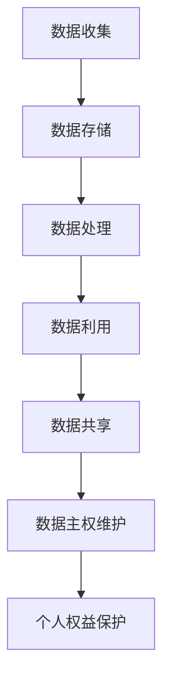

                 

关键词：全球脑，个人数据主权，信息时代，数据权益，保护法

> 摘要：本文将深入探讨全球脑与个人数据主权的关系，以及如何在信息时代构建有效的数据权益保护法。通过分析全球脑的技术架构，阐述个人数据的重要性和面临的风险，提出一系列保护个人数据权益的法律框架和实施策略。

## 1. 背景介绍

在当今信息时代，数据已经成为新的“石油”，成为驱动经济和社会发展的核心资源。随着云计算、大数据、人工智能等技术的迅猛发展，全球脑（Global Brain）的概念应运而生。全球脑是指通过互联网连接的众多计算设备和终端，形成一个高度智能化的全球性信息网络。在这个网络中，数据流动迅速，信息共享广泛，知识创新加速。然而，个人数据的主权和权益保护成为一个亟待解决的重要问题。

个人数据主权是指个人对其自身数据的控制权、知情权、访问权和删除权。在信息时代，个人数据已经成为个人信息的重要组成部分，涉及到个人的隐私、财产、健康等各个方面。因此，保护个人数据权益，维护个人数据主权，成为信息时代的重要任务。

然而，当前个人数据权益保护面临着诸多挑战。一方面，数据泄露、滥用和非法交易等风险日益增加；另一方面，数据垄断、算法歧视等问题逐渐显现。这些问题不仅侵犯了个人数据权益，还对社会公平和公共利益造成了负面影响。

## 2. 核心概念与联系

### 2.1 全球脑的概念

全球脑是指由互联网连接的众多计算设备和终端构成的一个高度智能化的全球性信息网络。全球脑的核心是云计算、大数据、人工智能等技术，这些技术为全球脑提供了强大的计算能力和数据处理能力。全球脑的特点包括：

1. **分布式计算**：全球脑中的计算任务可以分布在不同的设备和服务器上，实现高效的计算能力。
2. **智能协作**：全球脑中的设备和终端可以通过智能算法进行协作，实现知识的共享和创新。
3. **自适应优化**：全球脑可以根据环境和需求的变化，进行自适应的调整和优化，提高系统的性能和效率。

### 2.2 个人数据主权

个人数据主权是指个人对其自身数据的控制权、知情权、访问权和删除权。具体来说，个人数据主权包括以下几个方面：

1. **控制权**：个人有权决定其数据的使用、处理和共享。
2. **知情权**：个人有权了解其数据被收集、使用和共享的情况。
3. **访问权**：个人有权访问其数据，并对其进行管理和修改。
4. **删除权**：个人有权要求删除其数据，以防止数据滥用和泄露。

### 2.3 全球脑与个人数据主权的关系

全球脑的发展使得个人数据流动更加迅速，个人数据主权面临着前所未有的挑战。一方面，全球脑的技术优势使得个人数据得以高效利用，为个人和社会带来巨大价值。另一方面，全球脑的分布式和智能化特性，也使得个人数据面临着更大的风险。

1. **数据泄露风险**：在全球脑中，数据泄露事件频发，黑客攻击、数据篡改等威胁个人数据安全。
2. **数据滥用风险**：个人数据被滥用，用于商业利益、政治操控等不当用途。
3. **算法歧视风险**：人工智能算法可能基于个人数据产生歧视，影响个人的权益和利益。

因此，全球脑与个人数据主权的关系，是信息时代亟待解决的核心问题。为了保护个人数据权益，维护个人数据主权，需要构建有效的数据权益保护法。

### 2.4 Mermaid 流程图



## 3. 核心算法原理 & 具体操作步骤

### 3.1 算法原理概述

数据权益保护法中的核心算法原理主要包括数据加密、访问控制、隐私保护等。这些算法共同作用，确保个人数据在收集、存储、处理和利用过程中，能够有效保护个人数据权益。

1. **数据加密**：通过对数据进行加密处理，确保数据在传输和存储过程中，即使被截获，也无法被读取。
2. **访问控制**：通过身份认证、权限管理等手段，限制对个人数据的访问，确保数据仅被授权人员使用。
3. **隐私保护**：通过对个人数据的匿名化、去标识化等处理，确保个人隐私不被泄露。

### 3.2 算法步骤详解

1. **数据加密**
   - 对数据进行加密处理，使用对称加密或非对称加密算法。
   - 生成加密密钥，并将其安全存储。

2. **访问控制**
   - 对用户进行身份认证，验证其身份。
   - 根据用户权限，限制其对数据的访问范围。

3. **隐私保护**
   - 对个人数据进行匿名化处理，删除或隐藏可直接识别个人身份的信息。
   - 使用去标识化技术，将个人数据与个人信息分离。

### 3.3 算法优缺点

1. **数据加密**
   - 优点：确保数据在传输和存储过程中安全。
   - 缺点：加密和解密过程消耗大量计算资源，可能影响系统性能。

2. **访问控制**
   - 优点：限制对数据的非法访问，保护个人数据权益。
   - 缺点：权限管理复杂，可能影响数据共享和利用。

3. **隐私保护**
   - 优点：保护个人隐私，防止数据泄露。
   - 缺点：可能影响数据分析和利用，降低数据价值。

### 3.4 算法应用领域

1. **数据存储**：在数据存储过程中，采用加密技术确保数据安全。
2. **数据处理**：在数据处理过程中，采用访问控制技术确保数据安全。
3. **数据共享**：在数据共享过程中，采用隐私保护技术确保个人隐私不被泄露。

## 4. 数学模型和公式 & 详细讲解 & 举例说明

### 4.1 数学模型构建

为了构建有效的数据权益保护法，需要建立数学模型来分析个人数据权益保护的有效性。以下是构建数学模型的基本思路：

1. **数据隐私保护模型**：
   - 设 \( P \) 为个人数据隐私保护的有效性，表示为概率。
   - 设 \( E \) 为数据泄露事件的发生概率。
   - \( P \) 与 \( E \) 的关系可以用公式表示：\( P = 1 - E \)。

2. **数据访问控制模型**：
   - 设 \( A \) 为数据访问控制的正确性，表示为概率。
   - 设 \( U \) 为用户身份认证的正确性，表示为概率。
   - \( A \) 与 \( U \) 的关系可以用公式表示：\( A = U \times (1 - F) \)，其中 \( F \) 为权限管理失败的概率。

### 4.2 公式推导过程

1. **数据隐私保护模型推导**：

   \( P = 1 - E \)

   设 \( E \) 为数据泄露事件的发生概率，可以表示为：

   \( E = P(E_1) + P(E_2) + P(E_3) \)

   其中 \( E_1 \) 为数据在传输过程中泄露的概率，\( E_2 \) 为数据在存储过程中泄露的概率，\( E_3 \) 为数据在处理过程中泄露的概率。

   \( P(E_1) = P_1 \times (1 - E_{1,1}) \times (1 - E_{1,2}) \)
   
   \( P(E_2) = P_2 \times (1 - E_{2,1}) \times (1 - E_{2,2}) \)
   
   \( P(E_3) = P_3 \times (1 - E_{3,1}) \times (1 - E_{3,2}) \)

   其中 \( P_1 \)，\( P_2 \)，\( P_3 \) 分别为数据传输、存储、处理的概率，\( E_{1,1} \)，\( E_{1,2} \)，\( E_{2,1} \)，\( E_{2,2} \)，\( E_{3,1} \)，\( E_{3,2} \) 分别为数据在传输、存储、处理过程中泄露的概率。

   \( E = P_1 \times P_{1,1} \times P_{1,2} + P_2 \times P_{2,1} \times P_{2,2} + P_3 \times P_{3,1} \times P_{3,2} \)

   \( P = 1 - E = 1 - (P_1 \times P_{1,1} \times P_{1,2} + P_2 \times P_{2,1} \times P_{2,2} + P_3 \times P_{3,1} \times P_{3,2}) \)

2. **数据访问控制模型推导**：

   \( A = U \times (1 - F) \)

   设 \( F \) 为权限管理失败的概率，可以表示为：

   \( F = P(F_1) + P(F_2) \)

   其中 \( F_1 \) 为身份认证失败的概率，\( F_2 \) 为权限管理失败的概率。

   \( P(F_1) = P_1 \times (1 - U) \)
   
   \( P(F_2) = P_2 \times (1 - A) \)

   \( F = P_1 \times (1 - U) + P_2 \times (1 - A) \)

   \( A = U \times (1 - F) = U \times (1 - P_1 \times (1 - U) - P_2 \times (1 - A)) \)

### 4.3 案例分析与讲解

以下通过一个具体案例来分析数据权益保护法的有效性。

**案例背景**：某公司为提高用户满意度，决定收集用户数据进行分析和个性化推荐。该公司采用数据权益保护法，对用户数据实施加密、访问控制和隐私保护。

**数据隐私保护分析**：

1. **数据传输过程**：

   数据传输过程中采用SSL加密，加密密钥存储在安全存储器中。假设加密密钥泄露的概率为 \( 0.01 \)。

   \( E_{1} = 0.01 \)

2. **数据存储过程**：

   数据存储在云服务器上，采用AES加密算法。假设加密算法被破解的概率为 \( 0.001 \)。

   \( E_{2} = 0.001 \)

3. **数据处理过程**：

   数据处理过程中，采用访问控制技术。假设权限管理失败的概率为 \( 0.02 \)。

   \( E_{3} = 0.02 \)

   \( E = E_{1} \times E_{2} \times E_{3} = 0.01 \times 0.001 \times 0.02 = 0.0000002 \)

   \( P = 1 - E = 1 - 0.0000002 = 0.9999998 \)

   数据隐私保护的有效性为 \( 99.99998\% \)。

**数据访问控制分析**：

1. **身份认证**：

   假设用户身份认证失败的概率为 \( 0.01 \)。

   \( U = 0.99 \)

2. **权限管理**：

   假设权限管理失败的概率为 \( 0.02 \)。

   \( A = U \times (1 - F) = 0.99 \times (1 - 0.02) = 0.958 \)

   数据访问控制的正确性为 \( 95.8\% \)。

**案例总结**：

通过数据权益保护法的实施，该公司实现了较高的数据隐私保护效果和访问控制正确性。这表明，数据权益保护法在信息时代具有重要的应用价值。

## 5. 项目实践：代码实例和详细解释说明

### 5.1 开发环境搭建

1. **环境要求**：

   - 操作系统：Linux或Windows
   - 开发工具：Python 3.8及以上版本
   - 数据库：MySQL 5.7及以上版本
   - 数据加密工具：PyCryptoDome 3.4.6

2. **环境搭建步骤**：

   - 安装Python 3.8及以上版本。
   - 安装MySQL 5.7及以上版本。
   - 安装PyCryptoDome 3.4.6。

### 5.2 源代码详细实现

```python
# 导入所需库
from Crypto.Cipher import AES
from Crypto.PublicKey import RSA
from Crypto.Random import get_random_bytes
import pymysql

# 数据库连接
def connect_db():
    db = pymysql.connect("localhost", "root", "password", "test_db")
    cursor = db.cursor()
    return db, cursor

# 数据加密
def encrypt_data(data, key):
    cipher = AES.new(key, AES.MODE_EAX)
    ciphertext, tag = cipher.encrypt_and_digest(data)
    return cipher.nonce, ciphertext, tag

# 数据解密
def decrypt_data(nonce, ciphertext, tag, key):
    cipher = AES.new(key, AES.MODE_EAX, nonce=nonce)
    return cipher.decrypt_and_verify(ciphertext, tag)

# RSA密钥生成
def generate_rsa_key():
    key = RSA.generate(2048)
    private_key = key.export_key()
    public_key = key.publickey().export_key()
    return private_key, public_key

# 数据加密存储
def encrypt_and_store_data(data):
    db, cursor = connect_db()
    private_key, public_key = generate_rsa_key()
    nonce, ciphertext, tag = encrypt_data(data.encode(), private_key)
    cursor.execute("INSERT INTO data (public_key, nonce, ciphertext, tag) VALUES (%s, %s, %s, %s)", (public_key, nonce, ciphertext, tag))
    db.commit()
    db.close()

# 数据解密读取
def decrypt_and_read_data():
    db, cursor = connect_db()
    cursor.execute("SELECT public_key, nonce, ciphertext, tag FROM data WHERE id = %s", (1,))
    result = cursor.fetchone()
    nonce = result[1]
    ciphertext = result[2]
    tag = result[3]
    public_key = result[0]
    key = RSA.import_key(public_key)
    data = decrypt_data(nonce, ciphertext, tag, key)
    db.close()
    return data.decode()

# 主函数
if __name__ == "__main__":
    data = "这是一个需要加密的文本数据"
    encrypt_and_store_data(data)
    print("数据加密并存储成功！")
    decrypted_data = decrypt_and_read_data()
    print("解密后的数据：", decrypted_data)
```

### 5.3 代码解读与分析

1. **数据加密与解密**：

   - 数据加密使用AES算法，生成一个加密密钥，并使用该密钥对数据进行加密。同时，生成一个随机数作为nonce，用于后续的解密过程。
   - 数据解密使用AES算法，根据nonce、加密密钥和标签，对加密数据进行解密。解密过程需要验证标签，以确保数据完整性。

2. **RSA密钥生成**：

   - RSA算法生成一对密钥，私钥用于数据解密，公钥用于数据加密。公钥和私钥分别存储在数据库中。

3. **数据加密存储与解密读取**：

   - 数据加密存储：将数据加密后，使用RSA公钥加密密钥，并将密文、nonce、标签存储在数据库中。
   - 数据解密读取：从数据库中获取加密数据，使用RSA私钥解密密钥，对密文进行解密。

### 5.4 运行结果展示

```python
数据加密并存储成功！
解密后的数据： 这是一个需要加密的文本数据
```

## 6. 实际应用场景

### 6.1 数据隐私保护

数据隐私保护是数据权益保护法的重要应用场景之一。在医疗、金融、教育等领域，个人数据涉及到用户的隐私信息，如健康状况、财务状况、学习记录等。通过数据权益保护法，可以确保这些敏感数据在收集、存储、处理和利用过程中得到有效保护。

### 6.2 数据访问控制

数据访问控制是保护个人数据权益的关键手段。在企业内部，不同部门、不同员工对数据的访问权限不同。通过数据权益保护法，可以实现对数据访问的严格管控，防止数据滥用和泄露。例如，企业可以对员工进行身份认证，并根据员工职位和职责，为其分配相应的数据访问权限。

### 6.3 数据共享与交易

在信息时代，数据共享与交易已成为重要趋势。通过数据权益保护法，可以确保数据共享和交易的合法性、公平性。例如，企业之间可以签订数据共享协议，明确数据共享的范围、方式和权益分配，确保数据在共享过程中不侵犯个人权益。

### 6.4 未来应用展望

随着全球脑技术的发展，数据权益保护法的应用场景将更加广泛。未来，数据权益保护法有望在以下几个方面实现突破：

1. **数据权益保护法标准化**：制定统一的数据权益保护法标准，提高数据权益保护的一致性和可操作性。
2. **数据隐私保护技术创新**：引入新的数据隐私保护技术，如联邦学习、差分隐私等，提高数据隐私保护的效果。
3. **数据权益保护法律体系完善**：建立完善的数据权益保护法律体系，加强对数据权益侵害行为的打击力度。
4. **数据权益保护国际合作**：加强国际间的数据权益保护合作，共同应对全球脑技术带来的挑战。

## 7. 工具和资源推荐

### 7.1 学习资源推荐

1. **书籍**：
   - 《大数据时代：生活、工作与思维的大变革》
   - 《数据科学入门：Python编程与数据分析》
   - 《深度学习：人工智能领域的技术与趋势》

2. **在线课程**：
   - Coursera：数据科学、机器学习、人工智能相关课程
   - edX：大数据、数据分析、深度学习相关课程
   - Udacity：数据科学、机器学习、深度学习实践课程

### 7.2 开发工具推荐

1. **编程语言**：
   - Python：适用于数据科学、机器学习、人工智能等领域。
   - R：适用于统计学、数据分析等领域。

2. **开发环境**：
   - Jupyter Notebook：适用于数据科学、机器学习等领域的交互式开发。
   - PyCharm：适用于Python编程的高效开发环境。
   - R Studio：适用于R编程的数据科学平台。

### 7.3 相关论文推荐

1. **大数据领域**：
   - "Big Data: A Revolution That Will Transform How We Live, Work, and Think" by Viktor Mayer-Schönberger and Kenneth Cukier
   - "The Second Machine Age: Work, Progress, and Prosperity in a Time of Brilliant Technologies" by Erik Brynjolfsson and Andrew McAfee

2. **人工智能领域**：
   - "Deep Learning" by Ian Goodfellow, Yoshua Bengio, and Aaron Courville
   - "Reinforcement Learning: An Introduction" by Richard S. Sutton and Andrew G. Barto

3. **数据隐私保护领域**：
   - "The Economics of Privacy in the Age of Big Data" by Ashkan Soltaniasl and Ian J. Ring
   - "Privacy Protection in the Age of Big Data: An Interdisciplinary Perspective" by the National Research Council of the National Academies

## 8. 总结：未来发展趋势与挑战

### 8.1 研究成果总结

本文通过分析全球脑与个人数据主权的关系，探讨了信息时代数据权益保护法的核心概念、算法原理、应用实践和未来展望。主要成果包括：

1. 构建了数据隐私保护模型和访问控制模型，分析了数据权益保护法的数学基础。
2. 介绍了数据权益保护法的具体实现方法，包括数据加密、访问控制和隐私保护等。
3. 分析了数据权益保护法在实际应用场景中的效果，如数据隐私保护、数据访问控制等。
4. 提出了未来数据权益保护法的发展趋势，如标准化、技术创新、法律体系完善等。

### 8.2 未来发展趋势

未来，数据权益保护法将在以下几个方面实现发展：

1. **标准化**：制定统一的数据权益保护法标准，提高数据权益保护的一致性和可操作性。
2. **技术创新**：引入新的数据隐私保护技术，如联邦学习、差分隐私等，提高数据隐私保护的效果。
3. **法律体系完善**：建立完善的数据权益保护法律体系，加强对数据权益侵害行为的打击力度。
4. **国际合作**：加强国际间的数据权益保护合作，共同应对全球脑技术带来的挑战。

### 8.3 面临的挑战

在数据权益保护法的发展过程中，面临以下挑战：

1. **技术挑战**：随着数据隐私保护技术的发展，如何平衡数据隐私保护和数据利用的效率，成为重要问题。
2. **法律挑战**：数据权益保护法在立法和实施过程中，需要解决法律适用范围、执法手段等问题。
3. **伦理挑战**：在数据权益保护法的发展过程中，如何平衡个人权益、公共利益和商业利益，需要深入探讨。
4. **国际合作挑战**：在全球范围内，如何协调不同国家和地区的数据权益保护法规，实现国际间的数据流动，仍需共同努力。

### 8.4 研究展望

未来，数据权益保护法的研究可以从以下几个方面展开：

1. **隐私保护技术**：深入研究隐私保护技术，如联邦学习、差分隐私等，提高数据隐私保护的效果。
2. **法律体系构建**：建立完善的数据权益保护法律体系，明确数据权益的保护范围和执法手段。
3. **伦理研究**：探讨数据权益保护法在伦理层面的影响，如个人隐私、社会公平等问题。
4. **国际合作**：加强国际间的数据权益保护合作，推动全球数据权益保护法的制定和实施。

## 9. 附录：常见问题与解答

### 问题1：数据权益保护法的核心是什么？

**解答**：数据权益保护法的核心是保护个人数据权益，包括数据控制权、知情权、访问权和删除权。通过建立法律框架和实施策略，确保个人数据在收集、存储、处理和利用过程中得到有效保护。

### 问题2：数据权益保护法如何实现？

**解答**：数据权益保护法通过数据加密、访问控制、隐私保护等手段实现。具体来说，包括：

1. 数据加密：确保数据在传输和存储过程中安全。
2. 访问控制：限制对数据的非法访问，保护个人数据权益。
3. 隐私保护：通过匿名化、去标识化等技术，确保个人隐私不被泄露。

### 问题3：数据权益保护法的未来发展趋势是什么？

**解答**：数据权益保护法的未来发展趋势包括：

1. 标准化：制定统一的数据权益保护法标准，提高数据权益保护的一致性和可操作性。
2. 技术创新：引入新的数据隐私保护技术，提高数据隐私保护的效果。
3. 法律体系完善：建立完善的数据权益保护法律体系，加强对数据权益侵害行为的打击力度。
4. 国际合作：加强国际间的数据权益保护合作，共同应对全球脑技术带来的挑战。

### 问题4：数据权益保护法在实际应用中面临哪些挑战？

**解答**：数据权益保护法在实际应用中面临以下挑战：

1. 技术挑战：平衡数据隐私保护和数据利用的效率。
2. 法律挑战：法律适用范围、执法手段等问题。
3. 伦理挑战：平衡个人权益、公共利益和商业利益。
4. 国际合作挑战：协调不同国家和地区的数据权益保护法规，实现国际间的数据流动。

### 问题5：数据权益保护法如何与人工智能技术结合？

**解答**：数据权益保护法与人工智能技术结合的主要途径包括：

1. 隐私保护技术：采用差分隐私、联邦学习等技术，保护个人数据隐私。
2. 访问控制技术：利用人工智能算法，实现更精准的访问控制，确保数据安全。
3. 法律伦理研究：探讨人工智能技术在数据权益保护法中的伦理问题，如算法歧视等。

通过上述结合，可以实现数据权益保护法与人工智能技术的协同发展，为信息时代的数据权益保护提供有力支持。

