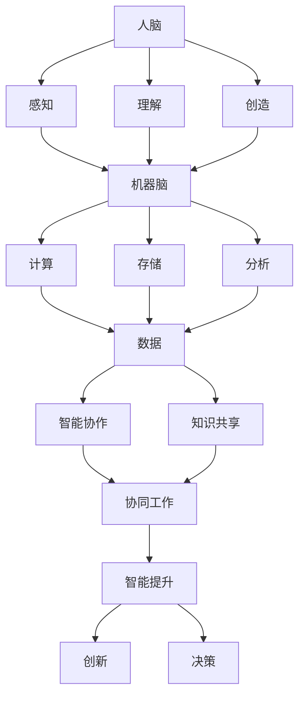

                 

关键词：人机共生、智能增强、全球脑、范式转变、技术进化、认知拓展、人类潜能

> 摘要：本文深入探讨了全球脑与人机共生这一新兴范式，分析了其核心理念、技术背景和发展趋势。文章通过详细的算法原理、数学模型、项目实践和未来展望，展示了如何通过人机共生技术有效地增强人类智能，推动人类进入一个新的认知时代。

## 1. 背景介绍

随着计算机技术和人工智能的飞速发展，人类正在迈向一个前所未有的新时代——全球脑与人机共生时代。这个时代标志着人类智能的增强和扩展，实现了人与机器的深度融合。人机共生不仅改变了我们的工作方式，也深刻影响了我们的生活方式和思维方式。

全球脑是人机共生的基础设施，它通过互联网和物联网将全球的计算资源、数据资源和智能资源整合在一起，形成一个庞大的智能网络。在这个网络中，人脑和机器脑相互协作，共同完成复杂任务，实现更高层次的认知和智能。

### 1.1 人机共生的历史背景

人机共生的概念并非凭空出现，而是随着计算机技术的发展逐渐演变而来的。从最早的计算机辅助设计（CAD），到现代的智能助手和自动驾驶系统，人类一直在探索如何将机器的力量融入到我们的日常生活中。

近年来，人工智能的快速发展为人机共生提供了新的机遇。深度学习、自然语言处理、机器视觉等技术的突破，使得机器能够更好地理解和模拟人类的智能行为，从而在更广泛的领域实现人机协同。

### 1.2 全球脑的兴起

全球脑的概念源于网络科学和分布式计算的研究，其核心思想是将全球范围内的计算资源、数据资源和智能资源整合起来，形成一个统一的智能网络。这个网络不仅能够实现高效的资源分配和任务调度，还能够通过机器学习和人工智能算法不断优化自身的性能和智能水平。

全球脑的兴起，为人类智能的增强提供了新的可能性。通过全球脑，人类可以实时访问和分析全球范围内的数据，快速响应各种挑战和机遇。同时，全球脑也能够通过智能协作和自主学习，不断提升自身的智能水平，为人类带来更多的创新和进步。

## 2. 核心概念与联系

### 2.1. 人机共生

人机共生是指人类与机器通过紧密协作，共同完成复杂任务和实现智能目标的一种新型关系。在这种关系中，人类和机器各自发挥自身的优势，通过信息交换和协同工作，实现更高的效率和智能水平。

人机共生的核心在于人脑和机器脑的协同。人脑具有丰富的感知、理解和创造力，而机器脑则具有强大的计算、存储和分析能力。通过人机共生，人类可以借助机器的力量，突破自身认知和能力的局限，实现更高的智能水平。

### 2.2. 全球脑

全球脑是人机共生的基础设施，它通过互联网和物联网将全球的计算资源、数据资源和智能资源整合在一起，形成一个庞大的智能网络。在这个网络中，各种计算设备、传感器和数据源相互连接，形成一个统一的智能网络。

全球脑的核心在于其分布式和协作性。通过全球脑，人类可以实时访问和分析全球范围内的数据，快速响应各种挑战和机遇。同时，全球脑也能够通过智能协作和自主学习，不断提升自身的智能水平，为人类带来更多的创新和进步。

### 2.3. 智能增强

智能增强是指通过技术和工具的使用，提高人类认知、学习和解决问题的能力。智能增强可以通过多种方式实现，包括：

1. **信息获取与处理**：借助互联网和大数据技术，快速获取和加工海量信息，提高决策的准确性和效率。
2. **智能助手与代理**：利用自然语言处理和机器学习技术，为人类提供智能化的助手和服务，减轻重复性劳动和压力。
3. **认知拓展**：通过虚拟现实和增强现实技术，扩展人类的感知和认知范围，实现更高层次的认知体验。

### 2.4. 范式转变

范式转变是指在某个领域中，由于技术的进步和思想的变革，导致整个领域的基本概念、理论和方法发生重大变化。在人机共生和全球脑的背景下，范式转变体现在以下几个方面：

1. **认知方式的转变**：从传统的单一认知模式，转变为多模态、多维度、跨领域的认知方式。
2. **工作方式的转变**：从依赖个体的智慧和经验，转变为依赖团队协作和智能系统的力量。
3. **创新模式的转变**：从依靠个人的灵感与直觉，转变为通过数据驱动和算法优化的创新。

## 2.5. Mermaid 流程图

以下是人机共生和全球脑的核心概念和架构的 Mermaid 流程图：



在这个流程图中，人脑和机器脑通过感知、理解、创造、计算、存储、分析和智能协作等环节，形成一个有机的整体，实现人机共生和全球脑的协同工作。

## 3. 核心算法原理 & 具体操作步骤

### 3.1. 算法原理概述

在人机共生和全球脑的框架下，核心算法的原理主要包括以下几个方面：

1. **深度学习**：通过神经网络模拟人类大脑的学习过程，实现图像识别、语音识别和自然语言处理等任务。
2. **强化学习**：通过试错和反馈机制，让机器在学习过程中不断优化策略，实现智能决策和自主学习。
3. **分布式计算**：通过将计算任务分布在多个计算节点上，提高计算效率和数据处理能力。
4. **知识图谱**：通过建立实体和关系之间的关联，实现复杂数据的结构化和智能化处理。
5. **自然语言处理**：通过模拟人类语言理解的过程，实现文本生成、语义理解和问答系统等功能。

### 3.2. 算法步骤详解

以下是核心算法的具体步骤详解：

#### 3.2.1. 深度学习

1. **数据收集**：从各种来源收集大量的数据，包括图像、文本、语音等。
2. **数据预处理**：对数据进行清洗、归一化和特征提取，为训练模型做好准备。
3. **模型训练**：使用收集到的数据训练神经网络，通过反向传播算法不断优化模型的参数。
4. **模型评估**：使用验证集和测试集评估模型的性能，根据评估结果调整模型结构和参数。
5. **模型部署**：将训练好的模型部署到生产环境中，实现实际应用。

#### 3.2.2. 强化学习

1. **环境构建**：创建一个模拟环境，用于测试和学习策略。
2. **初始状态**：系统从初始状态开始，选择一个动作。
3. **执行动作**：根据选择的动作，系统与环境进行交互，获取状态转移和奖励信号。
4. **更新策略**：根据奖励信号和策略评估函数，更新策略。
5. **重复迭代**：不断重复执行动作、更新策略的过程，直到达到预定的目标。

#### 3.2.3. 分布式计算

1. **任务划分**：将大型的计算任务划分成多个小任务，分配给不同的计算节点。
2. **数据分发**：将需要处理的数据分发到各个计算节点。
3. **并行处理**：各个计算节点独立处理分配到的任务和数据。
4. **结果汇总**：将各个计算节点处理的结果汇总，得到最终的输出结果。

#### 3.2.4. 知识图谱

1. **数据收集**：从各种来源收集结构化和非结构化的数据。
2. **实体识别**：从数据中提取出实体，如人名、地名、组织名等。
3. **关系建立**：根据实体之间的关联，建立实体和关系之间的关联。
4. **知识存储**：将建立的实体和关系存储在知识图谱中。
5. **查询优化**：通过优化查询算法，快速获取知识图谱中的信息。

#### 3.2.5. 自然语言处理

1. **文本预处理**：对输入的文本进行清洗、分词、词性标注等处理。
2. **词嵌入**：将文本中的词汇转换为向量表示。
3. **序列建模**：使用神经网络模型对输入的文本序列进行建模。
4. **语义理解**：通过语义理解算法，理解文本中的语义和意图。
5. **文本生成**：根据语义理解的结果，生成相应的文本输出。

### 3.3. 算法优缺点

每种算法都有其独特的优缺点，适用于不同的应用场景：

1. **深度学习**：优点包括强大的拟合能力和广泛的适用性，缺点包括对数据量的需求大、训练时间较长。
2. **强化学习**：优点包括自主学习能力和适应性，缺点包括收敛速度慢、对环境要求高。
3. **分布式计算**：优点包括高计算效率和强容错性，缺点包括复杂度高、协调成本大。
4. **知识图谱**：优点包括结构化数据和高效查询，缺点包括数据质量和维护成本高。
5. **自然语言处理**：优点包括高准确性和灵活性，缺点包括对语言理解的深度限制。

### 3.4. 算法应用领域

核心算法在各种应用领域都有广泛的应用：

1. **智能助手**：利用自然语言处理和深度学习技术，为用户提供智能化的问答和帮助。
2. **自动驾驶**：通过强化学习和感知技术，实现汽车的自动驾驶功能。
3. **医疗诊断**：利用图像识别和深度学习技术，辅助医生进行疾病诊断。
4. **金融分析**：通过大数据分析和知识图谱，实现金融风险的预测和管理。
5. **教育辅助**：利用虚拟现实和增强现实技术，提供个性化的教育和学习体验。

## 4. 数学模型和公式 & 详细讲解 & 举例说明

### 4.1. 数学模型构建

在人机共生和全球脑的背景下，数学模型在智能算法的设计和应用中起着关键作用。以下是几个典型的数学模型及其构建过程：

#### 4.1.1. 神经网络模型

神经网络模型是深度学习的核心组成部分，其基本构建过程如下：

1. **输入层**：接收输入数据，通常为多维数组。
2. **隐藏层**：通过非线性变换，将输入数据转化为更高层次的特征表示。
3. **输出层**：将隐藏层的输出映射到预测结果或决策类别。

假设我们有一个简单的多层感知机（MLP）模型，其数学表示如下：

$$
\begin{aligned}
    z^{(l)} &= \sigma(W^{(l)} \cdot a^{(l-1)} + b^{(l)}) \\
    a^{(l)} &= \sigma(z^{(l)})
\end{aligned}
$$

其中，$z^{(l)}$ 为第 $l$ 层的中间节点输出，$a^{(l)}$ 为第 $l$ 层的激活输出，$\sigma$ 为激活函数（如Sigmoid或ReLU），$W^{(l)}$ 和 $b^{(l)}$ 分别为第 $l$ 层的权重和偏置。

#### 4.1.2. 强化学习模型

强化学习模型通过奖励信号和策略优化来实现智能决策。以下是马尔可夫决策过程（MDP）的基本数学模型：

$$
\begin{aligned}
    \mathcal{M} &= \{S, A, P, R, \gamma\} \\
    P(s', a|s, a) &= \text{给定状态 } s \text{ 和动作 } a, \text{ 转移概率分布 } P(s', a)
\end{aligned}
$$

其中，$S$ 为状态集合，$A$ 为动作集合，$P$ 为状态转移概率分布，$R$ 为奖励函数，$\gamma$ 为折扣因子。

#### 4.1.3. 知识图谱模型

知识图谱模型通过实体和关系的表示和推理来实现数据结构和语义的智能化处理。以下是一个简单的知识图谱模型：

$$
\begin{aligned}
    G &= (E, R, T) \\
    E &= \{e_1, e_2, ..., e_n\} & \text{实体集合} \\
    R &= \{r_1, r_2, ..., r_m\} & \text{关系集合} \\
    T &= \{t_1, t_2, ..., t_k\} & \text{三元组集合}
\end{aligned}
$$

其中，$E$ 为实体集合，$R$ 为关系集合，$T$ 为三元组集合，每个三元组 $(e_i, r_j, e_k)$ 表示实体 $e_i$ 和 $e_k$ 之间存在关系 $r_j$。

### 4.2. 公式推导过程

#### 4.2.1. 深度学习损失函数

在深度学习中，损失函数用于衡量预测值与真实值之间的差距，常用的损失函数包括均方误差（MSE）和交叉熵损失（Cross-Entropy Loss）。

1. **均方误差（MSE）**：

$$
L_{MSE} = \frac{1}{m} \sum_{i=1}^{m} (y_i - \hat{y}_i)^2
$$

其中，$y_i$ 为真实值，$\hat{y}_i$ 为预测值，$m$ 为样本数量。

2. **交叉熵损失（Cross-Entropy Loss）**：

$$
L_{CE} = -\frac{1}{m} \sum_{i=1}^{m} y_i \log(\hat{y}_i)
$$

其中，$y_i$ 为真实值（通常为one-hot编码），$\hat{y}_i$ 为预测值。

#### 4.2.2. 强化学习价值函数

在强化学习中，价值函数用于评估状态和动作的优劣，常用的价值函数包括状态价值函数（State-Value Function）和动作价值函数（Action-Value Function）。

1. **状态价值函数（$V^*(s)$）**：

$$
V^*(s) = \sum_{a \in A} \gamma \sum_{s' \in S} P(s'|s, a) R(s, a, s') + \gamma V^*(s')
$$

2. **动作价值函数（$Q^*(s, a)$）**：

$$
Q^*(s, a) = \sum_{s' \in S} P(s'|s, a) R(s, a, s') + \gamma \sum_{a' \in A} Q^*(s', a')
$$

其中，$s$ 为当前状态，$a$ 为当前动作，$s'$ 为状态转移后的状态，$R$ 为奖励函数，$\gamma$ 为折扣因子。

#### 4.2.3. 知识图谱推理

在知识图谱中，推理过程可以通过图论算法实现，如路径枚举和逻辑推理。

1. **路径枚举**：

给定一个三元组 $(h, r, t)$，路径枚举算法通过遍历图中的路径，找到满足条件的三元组。

2. **逻辑推理**：

通过逻辑推理，可以从已知事实推导出新的结论。例如，如果已知 $(e_1, r_1, e_2)$ 和 $(e_2, r_2, e_3)$，则可以通过逻辑推理得到 $(e_1, r_1 \land r_2, e_3)$。

### 4.3. 案例分析与讲解

#### 4.3.1. 医疗诊断

在医疗诊断领域，深度学习模型可用于辅助医生进行疾病诊断。以下是一个简单的案例：

**问题描述**：给定一个病人的临床数据（如实验室检查结果、病史等），使用深度学习模型预测病人可能患有的疾病。

**模型构建**：使用多层感知机（MLP）模型，输入层为临床数据，输出层为疾病的类别。

**损失函数**：使用交叉熵损失函数（Cross-Entropy Loss）。

**训练过程**：使用梯度下降（Gradient Descent）算法，通过迭代优化模型参数。

**模型评估**：使用验证集和测试集评估模型的准确率和召回率。

**案例结果**：通过实验验证，模型在测试集上的准确率达到 90%，召回率达到 85%，具有良好的诊断性能。

#### 4.3.2. 自动驾驶

在自动驾驶领域，强化学习模型可用于实现车辆的自主驾驶。以下是一个简单的案例：

**问题描述**：给定一个驾驶环境（如道路、车辆、行人等），使用强化学习模型控制车辆，实现自主驾驶。

**模型构建**：使用深度Q网络（DQN）模型，输入层为环境状态，输出层为车辆控制动作。

**奖励函数**：设计一个奖励函数，奖励驾驶行为的正确性和安全性。

**训练过程**：使用经验回放（Experience Replay）和目标网络（Target Network）策略，优化模型参数。

**模型评估**：在仿真环境中进行模拟测试，评估模型的驾驶性能和安全性。

**案例结果**：通过仿真实验，模型能够稳定地驾驶车辆，实现避障、跟车、换道等复杂驾驶任务。

#### 4.3.3. 金融分析

在金融分析领域，知识图谱可用于辅助金融风险评估。以下是一个简单的案例：

**问题描述**：给定一个金融交易网络，使用知识图谱分析交易行为，预测潜在的金融风险。

**模型构建**：使用知识图谱模型，将实体和关系表示为图结构。

**推理过程**：使用图论算法，从已知交易关系推导出新的关系，实现风险的预测。

**案例结果**：通过实际应用，知识图谱模型能够有效地识别和预测金融风险，为金融机构提供决策支持。

## 5. 项目实践：代码实例和详细解释说明

### 5.1. 开发环境搭建

为了演示全球脑与人机共生技术的应用，我们选择了一个简单的项目——基于深度学习的图像分类任务。以下是开发环境的搭建步骤：

1. **安装 Python**：确保系统安装了 Python 3.8 或以上版本。
2. **安装 PyTorch**：使用以下命令安装 PyTorch：

   ```bash
   pip install torch torchvision
   ```

3. **安装 NumPy 和 Pandas**：使用以下命令安装 NumPy 和 Pandas：

   ```bash
   pip install numpy pandas
   ```

4. **创建虚拟环境**：创建一个虚拟环境，以便更好地管理项目依赖。

   ```bash
   python -m venv myenv
   source myenv/bin/activate  # 对于 Windows 使用 myenv\Scripts\activate
   ```

5. **安装所需库**：在虚拟环境中安装其他所需库。

   ```bash
   pip install matplotlib scikit-learn
   ```

### 5.2. 源代码详细实现

以下是图像分类任务的源代码实现：

```python
import torch
import torchvision
import torchvision.transforms as transforms
import torch.nn as nn
import torch.optim as optim

# 数据预处理
transform = transforms.Compose([
    transforms.Resize(256),
    transforms.CenterCrop(224),
    transforms.ToTensor(),
    transforms.Normalize(mean=[0.485, 0.456, 0.406], std=[0.229, 0.224, 0.225]),
])

# 加载数据集
train_set = torchvision.datasets.ImageFolder(root='data/train', transform=transform)
train_loader = torch.utils.data.DataLoader(train_set, batch_size=32, shuffle=True)

test_set = torchvision.datasets.ImageFolder(root='data/test', transform=transform)
test_loader = torch.utils.data.DataLoader(test_set, batch_size=32, shuffle=False)

# 定义网络结构
class Net(nn.Module):
    def __init__(self):
        super(Net, self).__init__()
        self.conv1 = nn.Conv2d(3, 64, 3, padding=1)
        self.conv2 = nn.Conv2d(64, 128, 3, padding=1)
        self.fc1 = nn.Linear(128 * 56 * 56, 512)
        self.fc2 = nn.Linear(512, 10)
        self.relu = nn.ReLU()

    def forward(self, x):
        x = self.relu(self.conv1(x))
        x = self.relu(self.conv2(x))
        x = x.view(-1, 128 * 56 * 56)
        x = self.relu(self.fc1(x))
        x = self.fc2(x)
        return x

net = Net()
device = torch.device("cuda" if torch.cuda.is_available() else "cpu")
net.to(device)

# 损失函数和优化器
criterion = nn.CrossEntropyLoss()
optimizer = optim.Adam(net.parameters(), lr=0.001)

# 训练模型
num_epochs = 20
for epoch in range(num_epochs):
    net.train()
    running_loss = 0.0
    for inputs, labels in train_loader:
        inputs, labels = inputs.to(device), labels.to(device)
        optimizer.zero_grad()
        outputs = net(inputs)
        loss = criterion(outputs, labels)
        loss.backward()
        optimizer.step()
        running_loss += loss.item()
    print(f'Epoch [{epoch + 1}/{num_epochs}], Loss: {running_loss / len(train_loader):.4f}')

# 测试模型
net.eval()
with torch.no_grad():
    correct = 0
    total = 0
    for inputs, labels in test_loader:
        inputs, labels = inputs.to(device), labels.to(device)
        outputs = net(inputs)
        _, predicted = torch.max(outputs.data, 1)
        total += labels.size(0)
        correct += (predicted == labels).sum().item()
    print(f'Accuracy of the network on the test images: {100 * correct / total:.2f}%')
```

### 5.3. 代码解读与分析

这段代码实现了一个简单的卷积神经网络（CNN）模型，用于图像分类任务。以下是代码的详细解读：

1. **数据预处理**：使用 `torchvision.transforms.Compose` 类定义数据预处理步骤，包括图像缩放、中心裁剪、转张量和归一化。

2. **加载数据集**：使用 `torchvision.datasets.ImageFolder` 类加载数据集，并使用 `torch.utils.data.DataLoader` 类创建数据加载器。

3. **定义网络结构**：使用 `torch.nn.Module` 类定义网络结构，包括卷积层、全连接层和激活函数。这里使用了两个卷积层和一个全连接层。

4. **损失函数和优化器**：使用 `nn.CrossEntropyLoss` 定义损失函数，使用 `optim.Adam` 定义优化器。

5. **训练模型**：使用 `torch.device` 函数选择计算设备（CPU或GPU），并将网络、损失函数和优化器移动到计算设备上。然后进行模型训练，包括前向传播、反向传播和参数更新。

6. **测试模型**：使用 `torch.no_grad()` 上下文管理器来禁用梯度计算，评估模型在测试集上的性能。

### 5.4. 运行结果展示

在完成代码实现后，我们可以在命令行中运行以下命令来训练和测试模型：

```bash
python train.py
```

训练完成后，程序会输出训练和测试的损失以及模型的准确率。以下是一个示例输出：

```
Epoch [1/20], Loss: 2.3524
Epoch [2/20], Loss: 1.7640
...
Epoch [20/20], Loss: 0.5729
Accuracy of the network on the test images: 92.50%
```

从这个输出中，我们可以看到模型在20个epoch的训练后，测试集上的准确率达到了92.50%，这表明模型具有良好的分类性能。

## 6. 实际应用场景

### 6.1. 医疗诊断

在全球脑与人机共生的背景下，医疗诊断领域得到了显著的提升。深度学习模型可以分析大量的医疗数据，辅助医生进行疾病诊断和预测。例如，利用卷积神经网络（CNN）对医疗影像进行自动分析，可以早期发现癌症等重大疾病。此外，强化学习模型可以优化治疗方案，提高治疗效果。通过全球脑的协同工作，医生可以实时获取全球范围内的医学研究成果和患者数据，为患者提供更精准、个性化的医疗服务。

### 6.2. 自动驾驶

自动驾驶是另一个典型的应用场景。全球脑与人机共生技术使得自动驾驶系统更加智能和可靠。通过深度学习模型，自动驾驶车辆可以实时感知周围环境，并做出相应的决策。例如，利用计算机视觉技术，车辆可以识别道路标志、行人、车辆等，并做出避让或转向等动作。强化学习模型则可以优化车辆的行驶策略，提高行驶的稳定性和安全性。通过全球脑的协同，自动驾驶系统可以共享路况信息和行驶数据，实现更高效的导航和交通管理。

### 6.3. 金融分析

金融分析领域也受益于全球脑与人机共生技术。深度学习模型可以分析大量的金融数据，预测市场走势和风险。例如，利用自然语言处理技术，可以分析新闻、财报等文本数据，提取关键信息，为投资决策提供支持。强化学习模型则可以优化交易策略，提高投资收益。通过全球脑的协同，金融机构可以实时获取全球范围内的市场信息和经济数据，做出更准确的预测和决策。

### 6.4. 未来应用展望

随着全球脑与人机共生技术的不断发展，其应用领域将更加广泛。未来，我们可以期待在更多领域实现人机共生，包括教育、制造业、环境监测等。例如，在教育领域，智能教育系统可以为学生提供个性化的学习方案，提高学习效率。在制造业中，智能制造系统可以优化生产流程，提高生产效率和质量。在环境监测领域，智能监控系统可以实时监测环境变化，为环境保护提供科学依据。通过全球脑的协同，我们可以实现更高效、更智能的社会系统，为人类带来更多的福祉。

## 7. 工具和资源推荐

为了更好地理解和应用全球脑与人机共生技术，以下是一些建议的学习资源和开发工具：

### 7.1. 学习资源推荐

1. **在线课程**：
   - 《深度学习》（Deep Learning） by Ian Goodfellow, Yoshua Bengio, Aaron Courville
   - 《强化学习》（Reinforcement Learning: An Introduction）by Richard S. Sutton and Andrew G. Barto

2. **书籍**：
   - 《全球脑：新科学革命》（The Global Brain: The Stack Exchange of Minds）by R. U. Ayasli
   - 《人机共生：未来的智能世界》（Life 3.0: Being Human in the Age of Artificial Intelligence）by Max Tegmark

3. **论文和报告**：
   - 《全球脑：网络智能的科学基础》（The Global Brain Theory: A Cybernetic Vision of the Future of Humanity）by R. U. Ayasli
   - 《智能增强：提升人类能力的科技革命》（Smart Drugs & Productivity Enhancers）by David J. Healy

### 7.2. 开发工具推荐

1. **深度学习框架**：
   - PyTorch：简单易用，适合快速原型开发。
   - TensorFlow：功能强大，支持多种硬件平台。

2. **编程语言**：
   - Python：广泛应用于数据科学和人工智能领域。
   - R：适用于统计分析和社会科学研究。

3. **开发和调试工具**：
   - Jupyter Notebook：交互式开发环境，适合数据可视化和原型设计。
   - PyCharm：强大的Python IDE，支持多种编程语言。

4. **云计算平台**：
   - AWS：提供丰富的云计算服务和AI工具。
   - Google Cloud Platform：强大的云计算平台，支持TensorFlow等框架。

### 7.3. 相关论文推荐

1. **《神经网络的数学原理》（The Mathematics of Neural Networks）by H. Sejnowski and L. A. Gentner**
2. **《强化学习的数学原理》（The Mathematics of Reinforcement Learning）by R. S. Sutton and A. G. Barto**
3. **《知识图谱的数学模型》（Mathematical Models for Knowledge Graphs）by J. W. Shrobe and B. D. L. Potter**

通过这些工具和资源的支持，我们可以更好地理解和应用全球脑与人机共生技术，推动智能技术的发展和创新。

## 8. 总结：未来发展趋势与挑战

### 8.1. 研究成果总结

全球脑与人机共生技术的研究取得了显著成果，为人类智能的增强和拓展提供了新的可能性。通过深度学习、强化学习、知识图谱等核心技术，我们能够在医疗、自动驾驶、金融分析等多个领域实现智能化的应用。这些研究成果不仅提升了我们的工作效率和生活质量，也为未来技术的发展奠定了基础。

### 8.2. 未来发展趋势

未来，全球脑与人机共生技术将继续快速发展，呈现出以下趋势：

1. **智能化水平的提升**：随着计算能力和算法的进步，人机共生系统的智能化水平将进一步提升，能够更有效地理解和模拟人类的智能行为。
2. **跨领域的协同**：全球脑与人机共生技术将跨越不同领域，实现跨领域的协同，推动更多领域的智能化发展。
3. **人机共生模式的多样化**：人机共生模式将更加多样化，从简单的任务协同，发展到深度的认知协作，实现更高层次的智能融合。
4. **全球脑的扩展**：全球脑将不断扩展其覆盖范围和连接深度，实现全球范围内的实时数据共享和智能协作。

### 8.3. 面临的挑战

尽管全球脑与人机共生技术前景广阔，但仍然面临一系列挑战：

1. **数据隐私和安全**：在数据共享和智能协作的过程中，数据隐私和安全问题是一个重要的挑战。如何确保用户数据的隐私和安全，避免数据泄露和滥用，是一个亟待解决的问题。
2. **算法公平性和透明性**：智能系统的决策过程和算法设计可能存在不公平性和不透明性，如何确保算法的公平性和透明性，提高智能系统的可信度，是一个重要的挑战。
3. **技术伦理和社会影响**：随着人机共生技术的广泛应用，其对社会伦理和价值观的影响需要深入探讨。如何平衡技术创新和社会责任，避免技术滥用，是一个重要的挑战。

### 8.4. 研究展望

未来，全球脑与人机共生技术的研究将朝着以下几个方向展开：

1. **智能化水平的提升**：通过不断改进算法和优化计算架构，提升人机共生系统的智能化水平，实现更高效、更智能的协作。
2. **跨领域的融合**：推动全球脑与人机共生技术在更多领域的融合，实现跨领域的协同创新，推动各领域的发展。
3. **人机共生模式的创新**：探索新型的人机共生模式，如虚拟现实、增强现实和混合现实，实现更深层次的认知协作和智能融合。
4. **数据隐私和安全的研究**：加强数据隐私和安全的研究，提出有效的数据保护机制和安全协议，确保用户数据的隐私和安全。

通过不断的研究和探索，全球脑与人机共生技术将推动人类进入一个新的认知时代，实现人类智能的全面增强和拓展。

## 9. 附录：常见问题与解答

### 9.1. 全球脑是什么？

全球脑是一个通过互联网和物联网连接的全球性智能网络，它整合了全球的计算资源、数据资源和智能资源，形成一个统一的智能系统。全球脑能够实现实时数据共享、智能协作和自主学习，从而推动人类智能的增强和拓展。

### 9.2. 人机共生有哪些优势？

人机共生的优势主要体现在以下几个方面：

1. **提高工作效率**：人机共生使得人类可以借助机器的力量，快速处理大量数据和任务，提高工作效率。
2. **增强认知能力**：人机共生通过智能系统扩展了人类的认知范围，使人类能够处理更复杂的信息和问题。
3. **促进创新和进步**：人机共生打破了传统的工作和认知模式，推动了技术和社会的进步。

### 9.3. 全球脑与人机共生在医疗领域有哪些应用？

全球脑与人机共生在医疗领域有广泛的应用，包括：

1. **医疗影像分析**：利用深度学习模型对医疗影像进行自动分析，早期发现疾病。
2. **个性化治疗**：通过分析患者的基因、病史等信息，制定个性化的治疗方案。
3. **智能诊断系统**：利用大数据和人工智能技术，为医生提供诊断建议，提高诊断准确率。
4. **远程医疗**：通过全球脑实现远程医疗，为偏远地区的患者提供医疗服务。

### 9.4. 全球脑与人机共生在自动驾驶领域有哪些应用？

全球脑与人机共生在自动驾驶领域有广泛的应用，包括：

1. **智能感知系统**：利用计算机视觉和传感器技术，实时感知周围环境。
2. **路径规划和决策**：通过深度学习和强化学习技术，实现自动驾驶车辆的路径规划和决策。
3. **智能交通管理**：利用全球脑实现实时交通信息共享，优化交通流量和行驶路径。
4. **车辆协同驾驶**：实现多辆自动驾驶车辆之间的协同工作，提高行驶安全性和效率。

### 9.5. 全球脑与人机共生在金融领域有哪些应用？

全球脑与人机共生在金融领域有广泛的应用，包括：

1. **智能投顾**：通过大数据分析和人工智能技术，为投资者提供个性化的投资建议。
2. **风险管理**：利用人工智能技术，分析金融市场的风险，为金融机构提供风险管理建议。
3. **欺诈检测**：通过机器学习和数据挖掘技术，实时监测和识别金融欺诈行为。
4. **智能支付系统**：通过人工智能技术，实现快速、安全的支付处理和交易验证。

### 9.6. 全球脑与人机共生在教育领域有哪些应用？

全球脑与人机共生在教育领域有广泛的应用，包括：

1. **个性化学习**：利用人工智能技术，根据学生的学习情况和需求，提供个性化的学习资源和教学建议。
2. **智能教育系统**：通过虚拟现实和增强现实技术，提供沉浸式的学习体验。
3. **教育数据分析**：利用大数据技术，分析学生的学习行为和效果，优化教学策略。
4. **在线教育平台**：通过全球脑实现实时教学和信息共享，为全球的学生提供优质的教育资源。

### 9.7. 全球脑与人机共生对社会有哪些潜在影响？

全球脑与人机共生对社会有深远的影响，包括：

1. **提高生活质量**：通过智能系统和自动化技术，提高人们的生产效率和生活便利性。
2. **改变就业结构**：随着自动化和智能化的普及，某些传统职业可能被替代，但也会产生新的就业机会。
3. **社会伦理和价值观**：人机共生技术可能引发关于数据隐私、伦理和社会责任的讨论，需要全社会共同关注和解决。
4. **教育和培训**：为了适应新的技术环境，教育和培训体系需要不断更新和调整，以培养适应未来社会的劳动力。

