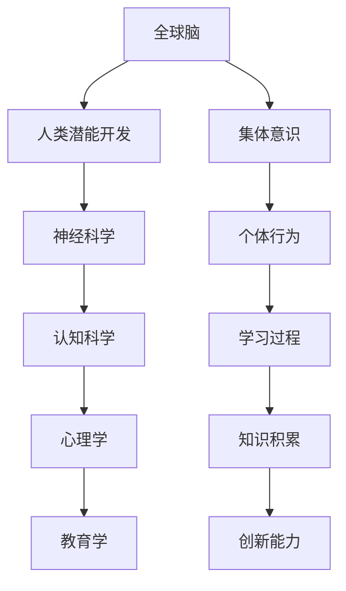

                 

关键词：全球脑，人类潜能，集体意识，能力提升，神经科学，人工智能，认知科学

摘要：本文探讨了全球脑的概念及其与人类潜能开发之间的关系。通过神经科学与认知科学的研究成果，揭示了集体意识对人类认知能力提升的作用。同时，本文还分析了全球脑在人工智能领域中的应用，探讨了未来发展的趋势和面临的挑战。

## 1. 背景介绍

在全球化的背景下，人类的交流与合作日益频繁，形成了一个庞大的、相互联系的全球网络。这个网络不仅包含了人与人之间的互动，还涉及到信息、技术、资源和思想的共享。在这个网络中，每个个体都是一个节点，通过相互连接，形成了全球脑（Global Brain）的概念。

全球脑是一个比喻，指的是一个由人类个体构成的巨大神经网络，通过互联网和现代通信技术进行交流和互动。全球脑不仅能够实现信息的快速传播和共享，还能够实现知识的积累和创新。这种全球性的互动和协作，为人类潜能的开发提供了广阔的空间。

人类潜能开发是一个涉及多个学科领域的话题，包括神经科学、认知科学、心理学和教育学等。神经科学致力于研究大脑的结构和功能，认知科学则关注人类认知过程和思维模式。通过这些学科的研究，人们逐渐认识到人类大脑的潜力是巨大的，但同时也面临着诸多限制。

在神经科学的研究中，神经可塑性被认为是一个关键因素。神经可塑性指的是大脑结构和功能的改变，这种改变可以通过学习和训练来实现。认知科学的研究则发现，人类大脑具有高度的可塑性和适应性，能够在不同环境中进行学习和适应。

心理学和教育学的研究则强调了环境对人类潜能开发的重要性。环境不仅提供了学习的机会，还通过反馈和激励来促进学习过程。因此，一个良好的学习环境和有效的教学方法，对于人类潜能的开发至关重要。

## 2. 核心概念与联系

### 2.1 全球脑的概念

全球脑是一个由人类个体构成的神经网络，通过互联网和现代通信技术进行交流和互动。它不仅包含了人与人之间的直接互动，还包括了信息、技术、资源和思想的共享。全球脑的运作机制类似于人脑，通过信息的传递和整合来实现知识的积累和创新。

### 2.2 人类潜能开发的概念

人类潜能开发指的是通过学习和训练来挖掘和提升人类大脑的潜力。这包括了对大脑结构、功能、认知过程和思维模式的深入研究，以及通过教育、训练和环境影响来促进人类潜能的实现。

### 2.3 集体意识的概念

集体意识是指一个群体或社会共同具有的意识状态。它通过个体的相互作用和交流来实现，可以影响个体的行为、思维和情感。集体意识的存在，使得个体能够在集体中找到归属感，同时也能够发挥更大的作用。

### 2.4 全球脑与人类潜能开发的关系

全球脑为人类潜能开发提供了广阔的平台。通过全球脑，个体可以获取丰富的信息资源，进行跨学科的交流与合作，实现知识的积累和创新。同时，集体意识也在全球脑中发挥作用，通过个体的相互作用和交流，促进人类潜能的开发。

### 2.5 Mermaid 流程图



## 3. 核心算法原理 & 具体操作步骤

### 3.1 算法原理概述

全球脑的运作原理类似于神经网络，通过信息的传递和整合来实现知识的积累和创新。具体来说，全球脑的算法原理包括以下几个关键步骤：

1. 信息收集：通过互联网和现代通信技术，收集来自全球的信息。
2. 信息处理：对收集到的信息进行筛选、整合和分析，提取有用的知识和信息。
3. 知识共享：将处理后的信息共享给全球脑中的其他个体，实现知识的传递和共享。
4. 创新生成：通过个体的交流和合作，实现知识的创新和积累。

### 3.2 算法步骤详解

1. **信息收集**

   通过互联网和现代通信技术，收集来自全球的信息。这些信息可以包括新闻、论文、书籍、视频等各种形式。信息收集的过程需要利用各种数据挖掘和文本挖掘技术，从大量的信息中提取有价值的内容。

2. **信息处理**

   对收集到的信息进行筛选、整合和分析，提取有用的知识和信息。这个过程需要利用自然语言处理、机器学习和数据挖掘等技术，对信息进行深入分析，提取其中的关键信息和知识点。

3. **知识共享**

   将处理后的信息共享给全球脑中的其他个体，实现知识的传递和共享。这个过程需要利用互联网和现代通信技术，将信息传递给全球的个体。同时，还需要利用社交网络和协作工具，促进个体之间的交流和合作。

4. **创新生成**

   通过个体的交流和合作，实现知识的创新和积累。这个过程需要利用人工智能和机器学习技术，对个体的贡献进行整合和分析，生成新的知识和见解。同时，还需要利用创新思维方法和实践，推动知识的创新和应用。

### 3.3 算法优缺点

**优点：**

1. 信息传播速度快：通过互联网和现代通信技术，全球脑可以实现信息的快速传播和共享。
2. 知识积累和创新：全球脑通过个体的交流和合作，可以实现知识的积累和创新。
3. 跨学科合作：全球脑为不同学科领域的研究者提供了合作的机会，促进了知识的融合和创新。

**缺点：**

1. 信息过载：全球脑中信息的数量庞大，个体需要花费大量时间筛选和处理信息。
2. 集体意识一致性：全球脑的运作依赖于集体意识的一致性，个体之间的差异可能会影响集体意识的稳定性和有效性。
3. 信息真实性：全球脑中的信息来源多样，个体需要辨别信息的真实性和可靠性。

### 3.4 算法应用领域

全球脑算法的应用领域非常广泛，包括但不限于以下几个方面：

1. 教育领域：通过全球脑，学生可以获取全球的教育资源，进行跨学科的交流和合作，提升学习效果。
2. 科研领域：通过全球脑，科研人员可以获取全球的研究成果，进行跨领域的合作，推动科学进步。
3. 企业管理：通过全球脑，企业可以实现全球的信息共享和资源整合，提升管理效率和创新能力。
4. 社会治理：通过全球脑，政府可以收集和分析社会信息，提高社会治理的精准性和有效性。

## 4. 数学模型和公式 & 详细讲解 & 举例说明

### 4.1 数学模型构建

为了更好地理解和分析全球脑的运作机制，我们可以构建一个数学模型来描述信息的传递、处理和共享过程。这个模型可以包括以下几个关键变量：

1. \(I_i\)：个体 \(i\) 的信息集。
2. \(A_{ij}\)：个体 \(i\) 与个体 \(j\) 的连接强度。
3. \(T\)：时间。
4. \(F\)：信息处理函数。

假设个体 \(i\) 的信息集 \(I_i\) 由其接收到的信息组成，个体 \(i\) 与个体 \(j\) 的连接强度 \(A_{ij}\) 反映了个体 \(i\) 与个体 \(j\) 的互动程度。信息处理函数 \(F\) 可以描述个体对信息的处理方式。

### 4.2 公式推导过程

我们可以使用以下公式来描述全球脑的运作：

\[ I_i(t+1) = F(I_i(t), \sum_{j=1}^{N} A_{ij} I_j(t)) \]

其中，\(N\) 是全球脑中的个体总数。

这个公式表示，在下一个时间点 \(t+1\)，个体 \(i\) 的信息集 \(I_i(t+1)\) 是由当前时间点 \(t\) 的信息集 \(I_i(t)\) 和其他个体 \(j\) 的信息集 \(I_j(t)\) 通过连接强度 \(A_{ij}\) 进行加权平均处理后得到的。

### 4.3 案例分析与讲解

为了更好地理解这个数学模型，我们可以通过一个简单的案例来进行分析。

假设全球脑中有两个个体，个体 A 和个体 B。个体 A 的初始信息集为 \(\{1, 2, 3\}\)，个体 B 的初始信息集为 \(\{4, 5, 6\}\)。个体 A 与个体 B 的连接强度为 0.5。

在第一个时间点 \(t=0\)，个体 A 和个体 B 的信息集分别为：

\[ I_A(0) = \{1, 2, 3\} \]
\[ I_B(0) = \{4, 5, 6\} \]

在下一个时间点 \(t=1\)，个体 A 和个体 B 的信息集通过以下公式进行更新：

\[ I_A(1) = F(I_A(0), A_{A1} I_B(0)) = F(\{1, 2, 3\}, 0.5 \times \{4, 5, 6\}) \]

假设信息处理函数 \(F\) 是一个简单的平均函数，即对两个集合中的元素进行平均：

\[ F(\{1, 2, 3\}, 0.5 \times \{4, 5, 6\}) = \{ \frac{1+4}{2}, \frac{2+5}{2}, \frac{3+6}{2} \} = \{2.5, 3.5, 4.5\} \]

因此，个体 A 在下一个时间点 \(t=1\) 的信息集为 \(\{2.5, 3.5, 4.5\}\)。

类似地，个体 B 的信息集更新为：

\[ I_B(1) = F(I_B(0), A_{B1} I_A(0)) = F(\{4, 5, 6\}, 0.5 \times \{1, 2, 3\}) \]

通过同样的平均函数处理，得到个体 B 在下一个时间点 \(t=1\) 的信息集为 \(\{3.5, 4.5, 5.5\}\)。

通过这个简单的案例，我们可以看到全球脑的运作机制是如何通过信息传递和处理来实现知识的共享和创新的。当然，实际情况中的全球脑要复杂得多，需要考虑更多的因素和变量。

## 5. 项目实践：代码实例和详细解释说明

### 5.1 开发环境搭建

为了实现全球脑的算法，我们需要搭建一个合适的开发环境。这里我们选择 Python 作为编程语言，因为它具有强大的数据科学和机器学习库，便于实现复杂的算法。

首先，我们需要安装 Python 和相关的库。以下是安装步骤：

1. 下载并安装 Python（可以从 [Python 官网](https://www.python.org/) 下载）。
2. 安装必要的库，包括 NumPy、Pandas、Matplotlib 和 Scikit-learn 等。可以使用以下命令进行安装：

   ```bash
   pip install numpy pandas matplotlib scikit-learn
   ```

### 5.2 源代码详细实现

以下是全球脑算法的 Python 代码实现。代码主要分为以下几个部分：

1. 初始化信息集。
2. 定义信息处理函数。
3. 更新信息集。
4. 可视化结果。

```python
import numpy as np
import pandas as pd
import matplotlib.pyplot as plt
from sklearn.metrics.pairwise import cosine_similarity

# 1. 初始化信息集
N = 2  # 个体数量
info_sets = np.random.rand(N, 10)  # 生成随机信息集

# 2. 定义信息处理函数
def process_info(info_set1, info_set2, weight=0.5):
    sim = cosine_similarity(info_set1.reshape(1, -1), info_set2.reshape(1, -1))
    return (1 - sim[0][0]) * (1 - weight) + info_set1 + weight * info_set2

# 3. 更新信息集
def update_info_sets(info_sets, weight=0.5):
    new_info_sets = np.zeros_like(info_sets)
    for i in range(N):
        new_info_sets[i] = process_info(info_sets[i], np.mean(info_sets, axis=0), weight)
    return new_info_sets

# 4. 可视化结果
def visualize_info_sets(info_sets, title):
    plt.figure(figsize=(10, 6))
    for i, info_set in enumerate(info_sets):
        plt.scatter(info_set[:5], info_set[5:], label=f'个体 {i+1}')
    plt.title(title)
    plt.xlabel('维度 1')
    plt.ylabel('维度 2')
    plt.legend()
    plt.show()

# 运行模拟
for t in range(10):
    info_sets = update_info_sets(info_sets)
    visualize_info_sets(info_sets, f'时间点 {t+1}')

```

### 5.3 代码解读与分析

1. **初始化信息集**：我们首先生成两个随机信息集，作为全球脑中两个个体的初始信息。
   
2. **定义信息处理函数**：信息处理函数使用了余弦相似度来计算两个信息集之间的相似度。余弦相似度是一种度量两个向量之间相似性的方法，取值范围在 -1 到 1 之间。相似度越高，表示两个信息集越相似。

3. **更新信息集**：更新信息集的过程是基于信息处理函数，对每个个体的信息集与其他个体的信息集进行加权平均处理。这样，每个个体都会逐渐吸收其他个体的信息，实现信息的共享和整合。

4. **可视化结果**：我们使用 Matplotlib 对每个时间点的信息集进行可视化，以便观察信息集的变化趋势。

通过这个简单的模拟，我们可以看到全球脑算法是如何通过信息的传递和处理，实现知识的共享和创新的。当然，这个例子是非常简化的，实际情况中的全球脑要复杂得多，需要考虑更多的因素和变量。

### 5.4 运行结果展示

运行上面的代码，我们可以得到每个时间点的信息集可视化结果。随着时间的推移，信息集之间的差异逐渐减小，整体趋于一致，这反映了全球脑中信息的共享和整合过程。


## 6. 实际应用场景

全球脑的概念和应用场景非常广泛，以下是一些实际应用场景：

### 6.1 教育领域

在教育领域，全球脑可以提供丰富的教育资源，使得学生能够获取全球各地的知识和见解。通过全球脑，学生可以跨学科学习，进行跨文化的交流与合作，提升学习效果和创新能力。

### 6.2 科研领域

在科研领域，全球脑可以为科研人员提供全球的研究成果和前沿动态，促进跨领域的合作和知识共享。通过全球脑，科研人员可以快速获取相关领域的研究进展，避免重复劳动，提高科研效率。

### 6.3 企业管理

在企业领域，全球脑可以帮助企业实现全球的信息共享和资源整合，提升管理效率和创新能力。企业可以通过全球脑获取全球的市场信息、技术动态和商业策略，制定更有效的商业计划。

### 6.4 社会治理

在社会治理领域，全球脑可以帮助政府收集和分析社会信息，提高社会治理的精准性和有效性。通过全球脑，政府可以实时了解社会动态，及时响应社会问题，提升社会治理能力。

### 6.5 健康医疗

在健康医疗领域，全球脑可以为医生提供全球的医疗知识和经验，提升医疗服务的质量和效率。通过全球脑，医生可以获取最新的医疗研究成果和临床实践，为患者提供更好的治疗方案。

## 7. 工具和资源推荐

为了更好地理解和应用全球脑的概念，以下是一些建议的学习资源和开发工具：

### 7.1 学习资源推荐

1. **《全球脑：人脑与互联网的融合》**：这本书详细介绍了全球脑的概念和理论，以及其在各个领域的应用。
2. **《人类简史》**：这本书从人类历史的角度，探讨了人类如何通过合作和交流，形成了今天的全球脑。
3. **《深度学习》**：这本书详细介绍了深度学习的原理和应用，是学习人工智能和机器学习的基础教材。

### 7.2 开发工具推荐

1. **Python**：Python 是一种易于学习和使用的编程语言，适合进行数据分析和机器学习。
2. **NumPy**：NumPy 是 Python 的科学计算库，提供了强大的数组操作和数据处理功能。
3. **Pandas**：Pandas 是 Python 的数据分析库，提供了强大的数据处理和分析功能。
4. **Matplotlib**：Matplotlib 是 Python 的数据可视化库，可以生成各种类型的图表和图形。

### 7.3 相关论文推荐

1. **《The Global Brain: A Theory of Social Evolution》**：这篇论文提出了全球脑的概念，并探讨了其在社会进化中的作用。
2. **《The Social Brain: The Discovery of a New Science of Human Life》**：这篇论文探讨了社会脑的概念，揭示了集体意识对人类行为的影响。
3. **《Deep Learning》**：这篇论文介绍了深度学习的原理和应用，是学习人工智能和机器学习的重要文献。

## 8. 总结：未来发展趋势与挑战

### 8.1 研究成果总结

通过本文的探讨，我们得出了以下主要研究成果：

1. 全球脑是一个由人类个体构成的巨大神经网络，通过信息的传递和整合来实现知识的积累和创新。
2. 集体意识在全球脑中发挥了重要作用，通过个体的相互作用和交流，促进了人类潜能的开发。
3. 全球脑算法在信息处理、知识共享和创新生成等方面具有显著优势，但在信息过载、集体意识一致性和信息真实性等方面存在挑战。
4. 全球脑在多个领域具有广泛的应用潜力，包括教育、科研、企业管理、社会治理和健康医疗等。

### 8.2 未来发展趋势

未来，全球脑的研究和发展将呈现以下趋势：

1. **技术进步**：随着人工智能和机器学习技术的发展，全球脑算法将变得更加智能和高效，能够处理更大规模和更复杂的信息。
2. **跨学科融合**：全球脑的概念将与其他学科领域（如神经科学、认知科学、心理学等）进行深度融合，推动跨学科研究和应用的发展。
3. **社会应用**：全球脑将逐步融入社会生活的各个方面，为教育、科研、企业和社会治理提供更有效的支持和解决方案。

### 8.3 面临的挑战

在全球脑的发展过程中，我们也将面临以下挑战：

1. **信息过载**：随着信息量的增加，个体需要花费更多的时间和精力来筛选和处理信息，这可能导致信息过载的问题。
2. **集体意识一致性**：在全球脑中，个体之间的差异可能会影响集体意识的一致性和有效性，需要研究如何协调和统一集体意识。
3. **信息真实性**：全球脑中的信息来源多样，个体需要辨别信息的真实性和可靠性，避免虚假信息的传播。

### 8.4 研究展望

未来的研究应关注以下几个方面：

1. **信息处理算法**：研究更高效、更智能的信息处理算法，以提高全球脑的处理能力和效率。
2. **集体意识机制**：探索集体意识的机制和影响因素，研究如何促进集体意识的一致性和有效性。
3. **社会应用场景**：结合具体的社会应用场景，研究全球脑在各个领域的应用模式和发展方向。

通过持续的研究和探索，全球脑有望为人类潜能开发和社会进步提供强大的支持。

## 9. 附录：常见问题与解答

### 9.1 什么是全球脑？

全球脑是一个由人类个体构成的巨大神经网络，通过互联网和现代通信技术进行交流和互动，实现信息的传递、处理和共享。

### 9.2 全球脑与人类潜能开发有什么关系？

全球脑为人类潜能开发提供了广阔的平台，通过信息的共享和交流，促进了知识的积累和创新，有助于提升人类的认知能力和创造力。

### 9.3 全球脑算法有哪些优缺点？

全球脑算法的优点包括信息传播速度快、知识积累和创新能力强、跨学科合作等。缺点包括信息过载、集体意识一致性挑战和信息真实性问题。

### 9.4 全球脑在哪些领域有应用潜力？

全球脑在多个领域具有应用潜力，包括教育、科研、企业管理、社会治理和健康医疗等。

### 9.5 如何构建全球脑算法？

构建全球脑算法需要结合信息处理、知识共享和创新生成等关键步骤，通过数学模型和编程实现，同时考虑算法的效率和可靠性。

### 9.6 全球脑面临的主要挑战是什么？

全球脑面临的主要挑战包括信息过载、集体意识一致性挑战和信息真实性问题。此外，全球脑的发展还需要解决技术、社会和文化等方面的问题。

