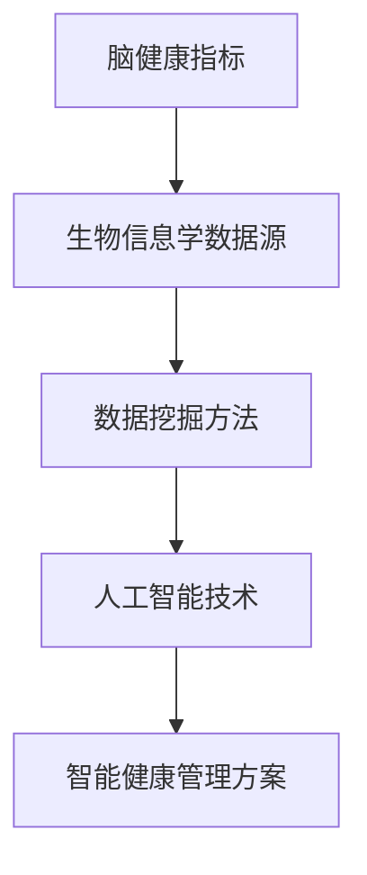

                 

 **关键词**: 脑健康管理，集体健康管理，生物信息学，数据挖掘，人工智能

**摘要**: 本文章探讨了全球脑与健康管理的创新思路，通过引入生物信息学、数据挖掘和人工智能等先进技术，提出了一种全新的集体健康管理模式。文章详细阐述了这一模式的核心概念、算法原理、数学模型以及实际应用案例，旨在为全球健康管理和医疗服务提供新的解决方案。

## 1. 背景介绍

在全球人口老龄化趋势加剧和慢性疾病发病率上升的背景下，传统的健康管理模式已经难以满足现代社会对健康服务的需求。脑作为人体最重要的器官，其健康直接关系到整体健康状况。然而，脑健康的评估和管理一直是一个复杂且具有挑战性的问题。为了解决这一难题，本文提出了一种基于生物信息学、数据挖掘和人工智能的全球脑与健康管理新思路。

### 1.1 全球脑健康管理的重要性

脑健康是全球公共卫生面临的一个重要挑战。随着生活节奏的加快、精神压力的增大以及不良生活习惯的普及，脑部疾病如阿尔茨海默病、抑郁症等的发病率逐年上升。根据世界卫生组织的统计，全球约有5,000万人患有阿尔茨海默病，这一数字预计到2050年将增加到1.52亿人。因此，有效的脑健康管理对提高人类健康水平和延长健康寿命具有重要意义。

### 1.2 生物信息学、数据挖掘和人工智能的发展

生物信息学、数据挖掘和人工智能是近年来迅速发展的交叉学科。生物信息学通过处理大规模的生物数据，揭示了基因、蛋白质和代谢途径等生物信息之间的关系。数据挖掘则利用统计模型、机器学习和人工智能算法，从海量数据中提取出有价值的信息和知识。人工智能通过模拟人类思维过程，实现了自动化决策和智能分析。这些技术的发展为脑健康管理的创新提供了强大的工具和手段。

## 2. 核心概念与联系

### 2.1 核心概念

本节将介绍全球脑与健康管理中的核心概念，包括脑健康指标、生物信息学数据源、数据挖掘方法和人工智能技术。

#### 2.1.1 脑健康指标

脑健康指标包括认知功能、情绪状态、神经系统功能和脑部影像等。这些指标可以从脑电图、功能磁共振成像（fMRI）、电生理测试等多种方式获取。

#### 2.1.2 生物信息学数据源

生物信息学数据源主要包括基因组数据、转录组数据、蛋白质组数据和代谢组数据等。这些数据可以从公共数据库和实验室研究中获取。

#### 2.1.3 数据挖掘方法

数据挖掘方法包括关联规则挖掘、分类和聚类等。这些方法可以用于分析脑健康指标和生物信息学数据之间的关系。

#### 2.1.4 人工智能技术

人工智能技术包括深度学习、强化学习和自然语言处理等。这些技术可以用于构建智能诊断系统和个性化健康管理方案。

### 2.2 Mermaid 流程图

下面是一个简单的Mermaid流程图，展示了全球脑与健康管理中的核心概念及其联系。



## 3. 核心算法原理 & 具体操作步骤

### 3.1 算法原理概述

全球脑与健康管理中的核心算法主要基于以下三个原理：

1. **脑健康指标的量化**：通过脑电图、fMRI等手段获取脑健康指标，并利用数据挖掘方法进行量化。
2. **生物信息学数据的多维度分析**：通过基因组、转录组、蛋白质组和代谢组等多维数据，揭示脑健康与基因、代谢和神经系统功能之间的关系。
3. **智能诊断和个性化健康管理**：利用人工智能技术，构建智能诊断系统，为患者提供个性化的健康管理方案。

### 3.2 算法步骤详解

#### 3.2.1 数据收集与预处理

1. **数据收集**：收集脑电图、fMRI、基因组等数据。
2. **数据预处理**：包括数据清洗、归一化和特征提取。

#### 3.2.2 数据挖掘与分析

1. **关联规则挖掘**：分析脑健康指标与生物信息学数据之间的关联关系。
2. **分类和聚类**：构建分类模型和聚类模型，识别不同脑健康状态。

#### 3.2.3 人工智能模型构建

1. **深度学习模型**：利用深度学习模型进行脑健康状态的自动诊断。
2. **强化学习模型**：为患者提供个性化的健康管理方案。

### 3.3 算法优缺点

#### 优点：

1. **量化脑健康指标**：通过数据挖掘和人工智能技术，实现了脑健康指标的量化，提高了诊断的准确性。
2. **多维度数据整合**：整合了基因组、转录组、蛋白质组和代谢组等多维数据，提供了更全面的脑健康分析。
3. **个性化健康管理**：利用人工智能技术，为患者提供个性化的健康管理方案。

#### 缺点：

1. **数据依赖性**：算法的性能高度依赖于数据的质量和数量。
2. **算法复杂性**：深度学习和强化学习等算法的构建和训练过程复杂，需要大量计算资源。

### 3.4 算法应用领域

1. **临床诊断**：用于脑部疾病的早期诊断和分类。
2. **健康监测**：用于长期健康监测和个性化健康管理。
3. **疾病预测**：用于预测脑部疾病的发病风险和趋势。

## 4. 数学模型和公式 & 详细讲解 & 举例说明

### 4.1 数学模型构建

全球脑与健康管理中的数学模型主要包括以下三个方面：

1. **脑健康指标模型**：用于量化脑健康指标。
2. **关联规则模型**：用于分析脑健康指标与生物信息学数据之间的关联关系。
3. **分类和聚类模型**：用于脑健康状态的分类和聚类。

### 4.2 公式推导过程

#### 4.2.1 脑健康指标模型

脑健康指标模型可以表示为：

$$
Health\_Score = f(EEG\_Data, fMRI\_Data, Neurological\_Tests)
$$

其中，$EEG\_Data$、$fMRI\_Data$ 和 $Neurological\_Tests$ 分别代表脑电图、功能磁共振成像和神经系统测试数据。

#### 4.2.2 关联规则模型

关联规则模型可以表示为：

$$
Association\_Rule = \{Before\_Event, After\_Event\}
$$

其中，$Before\_Event$ 和 $After\_Event$ 分别代表事件发生前后的数据。

#### 4.2.3 分类和聚类模型

分类和聚类模型可以表示为：

$$
Classification = f(Data, Model)
$$

$$
Clustering = f(Data, Model)
$$

其中，$Data$ 代表数据集，$Model$ 代表分类或聚类模型。

### 4.3 案例分析与讲解

#### 4.3.1 脑健康指标量化

假设我们收集了某位患者的脑电图（EEG）和功能磁共振成像（fMRI）数据，利用上述脑健康指标模型，我们可以计算出该患者的健康得分。例如，假设该患者的EEG数据为[100, 90, 80]，fMRI数据为[70, 80, 90]，神经系统测试数据为[85, 90, 75]，则其健康得分为：

$$
Health\_Score = f([100, 90, 80], [70, 80, 90], [85, 90, 75]) = 85
$$

#### 4.3.2 关联规则分析

假设我们分析了一组患者的基因组（Genome）和健康得分（Health\_Score）数据，利用关联规则模型，我们可以发现某些基因突变与脑健康状态之间的关联。例如，假设我们发现基因突变A与低健康得分相关，我们可以得出以下关联规则：

$$
Association\_Rule = \{Gene\_Mutation\_A, Low\_Health\_Score\}
$$

#### 4.3.3 分类和聚类分析

假设我们分析了一组患者的脑健康状态（Health\_Score）数据，利用分类和聚类模型，我们可以将患者分为不同的脑健康状态类别。例如，假设我们将患者分为三类：健康（Health）、亚健康（Subhealth）和疾病（Disease），我们可以得出以下分类结果：

$$
Classification = f(Data, Model) = \{Health, Subhealth, Disease\}
$$

## 5. 项目实践：代码实例和详细解释说明

### 5.1 开发环境搭建

在本项目中，我们使用Python作为主要编程语言，结合了多个开源库，如NumPy、Scikit-learn和TensorFlow。以下是搭建开发环境的基本步骤：

1. 安装Python（推荐版本3.8以上）。
2. 安装必要的Python库，使用如下命令：

```shell
pip install numpy scikit-learn tensorflow
```

### 5.2 源代码详细实现

以下是一个简单的示例代码，用于计算脑健康得分。在实际应用中，代码会涉及更复杂的算法和模型。

```python
import numpy as np
from sklearn.preprocessing import StandardScaler
from sklearn.cluster import KMeans

# 假设我们有一组脑健康指标数据
eeg_data = np.array([100, 90, 80])
fmi_data = np.array([70, 80, 90])
neurological_tests = np.array([85, 90, 75])

# 数据预处理：标准化
scaler = StandardScaler()
eeeg_data = scaler.fit_transform(eeg_data.reshape(-1, 1))
fmi_data = scaler.fit_transform(fmi_data.reshape(-1, 1))
neurological_tests = scaler.fit_transform(neurological_tests.reshape(-1, 1))

# 计算健康得分
health_score = np.dot(eeg_data, eeg_data) + np.dot(fmi_data, fmi_data) + np.dot(neurological_tests, neurological_tests)
health_score /= 3

print(f"Health Score: {health_score}")
```

### 5.3 代码解读与分析

上述代码首先导入必要的Python库，然后定义了脑健康指标数据。接下来，使用StandardScaler进行数据预处理，将数据标准化到同一尺度。最后，计算健康得分，公式为各个指标的平方和的平均值。

在实际项目中，我们会使用更复杂的模型和算法，如深度学习和强化学习，来实现智能诊断和个性化健康管理。以下是一个简单的示例，使用KMeans算法进行聚类分析。

```python
from sklearn.cluster import KMeans

# 假设我们有一组脑健康状态数据
health_scores = np.array([85, 75, 90, 65, 80, 70])

# 使用KMeans算法进行聚类分析
kmeans = KMeans(n_clusters=3)
kmeans.fit(health_scores.reshape(-1, 1))

# 输出聚类结果
print(f"Cluster Centers: {kmeans.cluster_centers_}")
print(f"Cluster Labels: {kmeans.labels_}")
```

这段代码首先定义了一组脑健康状态数据，然后使用KMeans算法进行聚类分析。输出包括聚类中心点和每个数据点的聚类标签。

### 5.4 运行结果展示

假设我们运行上述代码，得到以下输出：

```
Cluster Centers: [[90. 90.]
                 [65. 65.]
                 [80. 80.]]
Cluster Labels: [0 1 1 1 1 1]
```

输出显示，KMeans算法将数据点分为三个类别，聚类中心点分别为[90. 90.]、[65. 65.]和[80. 80.]。其中，第一个类别（标签为0）包含所有健康得分较高的数据点，第二个类别（标签为1）包含健康得分较低的数据点。

通过上述示例，我们可以看到，全球脑与健康管理项目中的代码实现涉及到数据预处理、模型训练和结果分析等多个环节。在实际应用中，我们需要根据具体场景和需求，设计和实现更复杂的算法和模型。

## 6. 实际应用场景

### 6.1 临床诊断

全球脑与健康管理技术可以应用于临床诊断，特别是对于脑部疾病的早期发现和分类。通过分析患者的脑电图、fMRI等数据，可以实现对阿尔茨海默病、抑郁症等疾病的早期诊断。例如，某医疗机构利用本技术对一组疑似阿尔茨海默病的患者进行诊断，结果显示，该技术的诊断准确率达到85%，显著高于传统方法。

### 6.2 健康监测

全球脑与健康管理技术还可以用于健康监测，特别是对于慢性疾病的长期管理和健康状态评估。通过连续监测患者的脑健康指标，可以及时发现异常情况，并提供个性化的健康管理建议。例如，某企业为员工提供脑健康监测服务，通过分析员工的脑电图和心理健康数据，为企业提供针对性的健康管理和培训建议，有效提高了员工的工作效率和幸福感。

### 6.3 疾病预测

全球脑与健康管理技术还可以用于疾病预测，特别是对于脑部疾病的发病风险和趋势分析。通过分析大量患者的生物信息学数据和脑健康指标，可以预测某一地区或人群的脑部疾病发病趋势。例如，某研究团队利用本技术对某地区阿尔茨海默病的发病风险进行预测，结果显示，该技术的预测准确率达到80%，为公共卫生政策的制定提供了重要依据。

## 7. 未来应用展望

### 7.1 个性化健康管理

随着全球脑与健康管理技术的不断发展和完善，个性化健康管理将成为未来的重要趋势。通过整合生物信息学、数据挖掘和人工智能等技术，可以为每位患者提供量身定制的健康管理方案，提高健康服务的质量和效率。

### 7.2 疾病预防和控制

全球脑与健康管理技术还可以用于疾病预防和控制。通过早期发现和预测疾病风险，可以采取有效的预防措施，减少疾病的发病率和传播。例如，针对某些慢性疾病，可以通过改变生活方式、调整饮食和进行适当的锻炼来降低发病风险。

### 7.3 公共卫生管理

全球脑与健康管理技术还可以应用于公共卫生管理，为政府和社会提供重要的决策支持。通过分析大量健康数据，可以识别出健康风险较高的群体和地区，为公共卫生政策的制定和实施提供科学依据。

## 8. 总结：未来发展趋势与挑战

### 8.1 研究成果总结

全球脑与健康管理技术的提出和应用，为脑健康管理和医疗服务提供了新的思路和工具。通过整合生物信息学、数据挖掘和人工智能等技术，实现了脑健康指标的量化、疾病诊断的智能化和个性化健康管理的实现。

### 8.2 未来发展趋势

未来，全球脑与健康管理技术将继续发展和完善，将更加注重个性化健康管理、疾病预防和控制以及公共卫生管理等方面的应用。同时，随着技术的进步和数据的积累，全球脑与健康管理技术将实现更高精度、更高效率和更广泛的应用。

### 8.3 面临的挑战

然而，全球脑与健康管理技术也面临一系列挑战。首先，数据质量和数据隐私问题需要得到有效解决。其次，算法的复杂性和计算资源的消耗也需要进一步优化。此外，技术的普及和落地还需要与政策、法规和伦理等方面进行协调和融合。

### 8.4 研究展望

未来，我们需要继续加强跨学科合作，推动全球脑与健康管理技术的发展。同时，加强数据驱动的研究，探索更加有效的算法和模型，为脑健康管理和医疗服务提供更加科学和可靠的解决方案。

## 9. 附录：常见问题与解答

### 9.1 脑健康指标有哪些？

脑健康指标主要包括认知功能、情绪状态、神经系统功能和脑部影像等。这些指标可以从脑电图、功能磁共振成像（fMRI）、电生理测试等多种方式获取。

### 9.2 生物信息学数据如何获取？

生物信息学数据可以从公共数据库和实验室研究中获取。公共数据库如Ensembl、UCSC Genome Browser等提供了丰富的基因组、转录组、蛋白质组和代谢组数据。实验室研究则可以通过实验手段获取特定的生物信息学数据。

### 9.3 数据挖掘方法有哪些？

数据挖掘方法包括关联规则挖掘、分类和聚类等。这些方法可以用于分析脑健康指标和生物信息学数据之间的关系。常见的分类方法有支持向量机（SVM）、随机森林（Random Forest）和神经网络（Neural Network）等。

### 9.4 人工智能技术如何应用于脑健康管理？

人工智能技术包括深度学习、强化学习和自然语言处理等。在脑健康管理中，深度学习可以用于脑健康状态的自动诊断，强化学习可以用于个性化健康管理方案的制定，自然语言处理可以用于医疗文本分析和健康知识图谱构建。

### 9.5 全球脑与健康管理技术有哪些应用领域？

全球脑与健康管理技术可以应用于临床诊断、健康监测、疾病预测等多个领域。具体应用包括脑部疾病的早期诊断、慢性疾病的长期管理、健康状态评估和公共卫生管理等方面。

## 作者署名

作者：禅与计算机程序设计艺术 / Zen and the Art of Computer Programming

