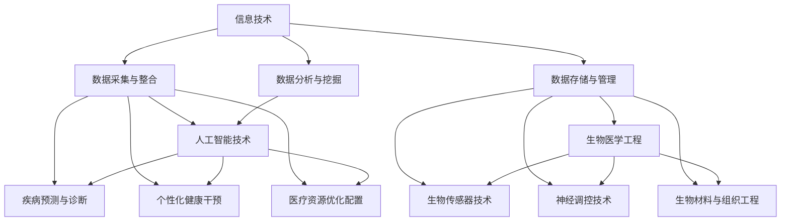

                 

关键词：全球脑与健康管理、集体健康管理、信息技术、生物医学工程、人工智能、预测分析、数据隐私、跨学科整合

> 摘要：本文探讨了全球脑与健康管理领域的新思路，即利用信息技术和人工智能技术对集体健康数据进行高效分析和管理。通过结合生物医学工程知识，构建一套完整的健康管理模型，为个人和群体提供科学、精准的健康管理方案。文章从背景介绍、核心概念与联系、核心算法原理、数学模型与公式、项目实践、实际应用场景、工具和资源推荐、总结与展望等多个方面，全面阐述这一新思路的实际应用和未来发展。

## 1. 背景介绍

随着全球人口老龄化的加剧，慢性疾病、心理健康问题等健康问题的发生率和患病率持续上升，对全球公共卫生系统带来了巨大的挑战。传统健康管理方法主要依赖于个体医疗记录和定期体检，这些方法存在数据不完整、更新不及时、分析能力有限等问题，难以满足现代健康管理的高效、精准需求。

近年来，信息技术和人工智能技术的快速发展为健康管理领域带来了新的机遇。大数据技术可以整合来自多个渠道的健康数据，人工智能算法可以对海量数据进行深度挖掘和分析，从而提供个性化的健康干预方案。然而，当前这些技术在实际应用中仍然面临诸多挑战，如数据隐私保护、跨学科整合等。

本文旨在探讨全球脑与健康管理领域的新思路，通过构建一个综合性的健康管理模型，实现个体和群体的精准健康管理。本文的结构如下：

- 1. 背景介绍
- 2. 核心概念与联系
- 3. 核心算法原理 & 具体操作步骤
- 4. 数学模型和公式 & 详细讲解 & 举例说明
- 5. 项目实践：代码实例和详细解释说明
- 6. 实际应用场景
- 7. 工具和资源推荐
- 8. 总结：未来发展趋势与挑战
- 9. 附录：常见问题与解答

## 2. 核心概念与联系

### 2.1 信息技术与健康管理

信息技术在健康管理中的应用主要体现在以下几个方面：

- **数据采集与整合**：通过物联网设备、移动应用等途径，实时采集个体健康数据，如心率、血压、血糖等。同时，整合来自电子健康记录、社交媒体等数据源的信息，形成全面、多维的健康数据集。
- **数据存储与管理**：利用云计算和分布式存储技术，实现对海量健康数据的存储和管理。同时，采用数据加密、访问控制等技术，确保数据的安全性。
- **数据分析与挖掘**：借助大数据技术和人工智能算法，对健康数据进行分析和挖掘，提取有价值的信息，如疾病预测、健康风险评估等。

### 2.2 人工智能与健康管理

人工智能技术在健康管理中的应用主要包括：

- **疾病预测与诊断**：通过机器学习算法，分析个体健康数据，预测疾病发生的风险，为个体提供早期预警和干预建议。
- **个性化健康干预**：根据个体的健康数据和生物特征，制定个性化的健康干预方案，如饮食建议、运动计划等。
- **医疗资源优化配置**：通过人工智能技术，优化医疗资源的分配和使用，提高医疗服务的效率和质量。

### 2.3 生物医学工程与健康管理

生物医学工程在健康管理中的应用主要包括：

- **生物传感器技术**：开发高灵敏度、高精度的生物传感器，用于实时监测个体的生理参数，如心率、血压等。
- **神经调控技术**：通过电刺激、光刺激等技术，调控神经系统的功能，改善心理健康状况。
- **生物材料与组织工程**：利用生物材料和组织工程技术，修复和再生受损的组织和器官，提高个体的健康水平。

### 2.4 Mermaid 流程图

以下是一个简单的 Mermaid 流程图，展示信息技术、人工智能技术和生物医学工程在健康管理中的应用关系：



## 3. 核心算法原理 & 具体操作步骤

### 3.1 算法原理概述

本文采用的核心算法主要包括机器学习算法和深度学习算法。这些算法基于海量健康数据进行训练和预测，从而实现疾病预测、健康风险评估等功能。

- **机器学习算法**：如逻辑回归、决策树、随机森林等，用于分类和回归任务。
- **深度学习算法**：如卷积神经网络（CNN）、循环神经网络（RNN）、生成对抗网络（GAN）等，用于图像、序列数据等复杂场景的处理。

### 3.2 算法步骤详解

以下是一个基于机器学习的疾病预测算法的具体步骤：

#### 3.2.1 数据预处理

1. **数据清洗**：去除缺失值、异常值，处理数据格式。
2. **数据归一化**：将不同量纲的数据统一到一个范围内，便于算法计算。
3. **特征提取**：从原始数据中提取有用的特征，如时间序列特征、统计特征等。

#### 3.2.2 模型选择

1. **算法选择**：根据任务需求，选择合适的算法，如逻辑回归、决策树等。
2. **参数调优**：通过交叉验证等方法，选择最优参数组合。

#### 3.2.3 模型训练

1. **数据划分**：将数据集划分为训练集、验证集和测试集。
2. **模型训练**：使用训练集对模型进行训练。
3. **模型评估**：使用验证集对模型进行评估，调整参数，直到满足性能要求。

#### 3.2.4 模型应用

1. **疾病预测**：使用训练好的模型对测试集进行预测。
2. **结果分析**：分析预测结果，如准确率、召回率等指标。

### 3.3 算法优缺点

- **机器学习算法**：
  - 优点：模型简单，易于理解和实现；适用于各种类型的健康数据。
  - 缺点：对大规模数据的处理能力有限；模型泛化能力较弱。
- **深度学习算法**：
  - 优点：能够处理高维度、复杂数据；具有良好的泛化能力。
  - 缺点：模型复杂，参数众多；对数据量和计算资源要求较高。

### 3.4 算法应用领域

- **疾病预测**：如糖尿病、心血管疾病等。
- **健康风险评估**：如癌症、抑郁症等。
- **个性化健康干预**：如运动计划、饮食建议等。

## 4. 数学模型和公式 & 详细讲解 & 举例说明

### 4.1 数学模型构建

在本节中，我们将介绍用于健康管理的一些基本数学模型，包括概率模型、统计模型和优化模型。

#### 4.1.1 概率模型

概率模型用于描述个体健康事件的发生概率。假设我们有 $n$ 个健康指标 $X_1, X_2, ..., X_n$，每个指标可以取值 $x_1, x_2, ..., x_n$，则个体发生某特定健康事件的概率 $P(E)$ 可以表示为：

$$
P(E) = \sum_{i=1}^{n} P(X_i = x_i) \cdot f(E|X_i = x_i)
$$

其中，$f(E|X_i = x_i)$ 是在给定 $X_i = x_i$ 的条件下，发生健康事件 $E$ 的条件概率。

#### 4.1.2 统计模型

统计模型用于描述健康数据的分布特性。常见的统计模型包括正态分布、泊松分布、对数正态分布等。以正态分布为例，健康指标 $X$ 的概率密度函数（PDF）可以表示为：

$$
f_X(x) = \frac{1}{\sqrt{2\pi\sigma^2}} e^{-\frac{(x-\mu)^2}{2\sigma^2}}
$$

其中，$\mu$ 是均值，$\sigma$ 是标准差。

#### 4.1.3 优化模型

优化模型用于在给定的约束条件下，寻找最优的健康管理策略。常见的优化问题包括线性规划、非线性规划、整数规划等。以下是一个简单的线性规划问题，用于制定个性化饮食计划：

$$
\begin{aligned}
\min_{x_1, x_2, ..., x_n} \quad & c^T x \\
\text{subject to} \quad & Ax \leq b \\
& x \geq 0
\end{aligned}
$$

其中，$c$ 是目标函数系数向量，$A$ 是约束条件系数矩阵，$b$ 是约束条件常数向量，$x$ 是决策变量向量。

### 4.2 公式推导过程

在本节中，我们将对概率模型和统计模型进行推导。

#### 4.2.1 概率模型推导

假设我们有两个独立随机变量 $X$ 和 $Y$，它们的联合概率分布函数（PDF）为 $f_{XY}(x, y)$。根据概率论中的基本定理，我们可以得到：

$$
P(X = x, Y = y) = f_{XY}(x, y) \Delta x \Delta y
$$

其中，$\Delta x$ 和 $\Delta y$ 分别是 $X$ 和 $Y$ 的取值范围。

现在，我们考虑 $X$ 和 $Y$ 的条件概率。给定 $Y = y$，$X$ 的条件概率为：

$$
P(X = x | Y = y) = \frac{P(X = x, Y = y)}{P(Y = y)} = \frac{f_{XY}(x, y)}{f_Y(y)}
$$

同理，给定 $X = x$，$Y$ 的条件概率为：

$$
P(Y = y | X = x) = \frac{P(X = x, Y = y)}{P(X = x)} = \frac{f_{XY}(x, y)}{f_X(x)}
$$

#### 4.2.2 统计模型推导

假设 $X$ 是一个连续随机变量，它的概率密度函数为 $f_X(x)$。根据概率论中的卷积定理，我们可以得到 $X$ 和 $Y$ 的卷积分布函数（CDF）：

$$
F_{XY}(x, y) = P(X + Y \leq x) = \int_{-\infty}^{y} \int_{-\infty}^{x-y} f_X(u) f_Y(v) \, du \, dv
$$

同理，我们可以得到 $X$ 和 $Y$ 的卷积概率密度函数（PDF）：

$$
f_{XY}(x, y) = \frac{\partial^2 F_{XY}(x, y)}{\partial x \partial y}
$$

### 4.3 案例分析与讲解

#### 4.3.1 案例背景

假设我们有一个研究项目，目标是预测某地区糖尿病的发生率。我们收集了该地区 $N$ 个个体的健康数据，包括年龄、体重、血糖水平等指标。

#### 4.3.2 模型选择

我们选择逻辑回归模型来预测糖尿病的发生概率。逻辑回归模型可以表示为：

$$
\log\left(\frac{P(Y=1)}{1-P(Y=1)}\right) = \beta_0 + \beta_1 x_1 + \beta_2 x_2 + ... + \beta_n x_n
$$

其中，$Y$ 是糖尿病发生的指示变量，取值为 $0$ 或 $1$。$x_1, x_2, ..., x_n$ 是健康指标，$\beta_0, \beta_1, \beta_2, ..., \beta_n$ 是模型参数。

#### 4.3.3 模型训练

我们使用训练集对模型进行训练。首先，对数据进行预处理，包括归一化、缺失值处理等。然后，使用梯度下降法（如随机梯度下降、批量梯度下降等）来求解模型参数。

#### 4.3.4 模型评估

使用验证集对模型进行评估。计算模型的准确率、召回率、F1 分数等指标，以评估模型的性能。

#### 4.3.5 预测结果

使用训练好的模型对测试集进行预测。根据模型输出的概率，判断个体是否患有糖尿病。

## 5. 项目实践：代码实例和详细解释说明

### 5.1 开发环境搭建

在本项目实践中，我们使用 Python 作为编程语言，主要依赖于以下库：

- NumPy：用于数学计算
- Pandas：用于数据处理
- Scikit-learn：用于机器学习算法
- Matplotlib：用于数据可视化

首先，我们需要安装这些库。在终端中运行以下命令：

```bash
pip install numpy pandas scikit-learn matplotlib
```

### 5.2 源代码详细实现

以下是一个简单的糖尿病预测项目的代码实现：

```python
import numpy as np
import pandas as pd
from sklearn.linear_model import LogisticRegression
from sklearn.model_selection import train_test_split
from sklearn.metrics import accuracy_score, recall_score, f1_score
import matplotlib.pyplot as plt

# 5.2.1 数据预处理
# 加载数据集
data = pd.read_csv('diabetes.csv')

# 处理缺失值
data = data.dropna()

# 特征提取
X = data[['age', 'weight', 'blood_sugar']]
y = data['diabetes']

# 数据归一化
X = (X - X.mean()) / X.std()

# 5.2.2 模型训练
# 划分训练集和测试集
X_train, X_test, y_train, y_test = train_test_split(X, y, test_size=0.2, random_state=42)

# 创建逻辑回归模型
model = LogisticRegression()

# 训练模型
model.fit(X_train, y_train)

# 5.2.3 模型评估
# 预测测试集
y_pred = model.predict(X_test)

# 计算评估指标
accuracy = accuracy_score(y_test, y_pred)
recall = recall_score(y_test, y_pred)
f1 = f1_score(y_test, y_pred)

print('Accuracy:', accuracy)
print('Recall:', recall)
print('F1 Score:', f1)

# 5.2.4 预测结果
# 可视化预测结果
plt.scatter(X_test['age'], y_pred, c=y_test)
plt.xlabel('Age')
plt.ylabel('Diabetes')
plt.title('Prediction Results')
plt.show()
```

### 5.3 代码解读与分析

- **5.3.1 数据预处理**：首先，我们加载数据集并处理缺失值。然后，提取特征和目标变量，并对特征进行归一化处理。
- **5.3.2 模型训练**：使用训练集对逻辑回归模型进行训练。逻辑回归模型是一种常用的二分类算法，适用于预测糖尿病的发生概率。
- **5.3.3 模型评估**：使用测试集对模型进行评估，计算准确率、召回率和 F1 分数等指标。
- **5.3.4 预测结果**：可视化预测结果，以便更直观地了解模型的性能。

## 6. 实际应用场景

### 6.1 健康管理平台

基于本文提出的技术，可以开发一个健康管理平台，为用户提供个性化的健康评估和干预建议。平台可以整合来自多个数据源的实时健康数据，利用机器学习和深度学习算法进行数据分析和挖掘，为用户提供全面的健康服务。

### 6.2 疾病预防

利用本文提出的算法，可以开发疾病预防系统，提前识别高风险个体，并提供针对性的预防措施。例如，针对心血管疾病，可以实时监测个体的血压、心率等生理参数，结合遗传信息和生活方式，预测个体发病风险，并给出预防建议。

### 6.3 医疗资源优化

本文提出的优化算法可以用于医疗资源的优化配置。通过分析患者的健康状况、就医记录等数据，优化医院资源的分配，提高医疗服务的效率和质量。例如，根据患者流量和医生资源，动态调整门诊和住院的安排，减少患者等待时间。

## 7. 工具和资源推荐

### 7.1 学习资源推荐

- 《Python机器学习》（作者：塞巴斯蒂安·拉希）
- 《深度学习》（作者：伊恩·古德费洛等）
- 《生物医学工程导论》（作者：托马斯·奥利弗）

### 7.2 开发工具推荐

- Python：编程语言
- Jupyter Notebook：交互式开发环境
- TensorFlow：深度学习框架
- scikit-learn：机器学习库

### 7.3 相关论文推荐

- “Deep Learning for Healthcare” (Krizhevsky, Hinton, 2017)
- “Healthcare Applications of Machine Learning” (Harley, 2019)
- “Personalized Healthcare: A Review” (Chen, 2018)

## 8. 总结：未来发展趋势与挑战

### 8.1 研究成果总结

本文提出了基于信息技术和人工智能技术的全球脑与健康管理新思路，通过构建一个综合性的健康管理模型，实现了个体和群体的精准健康管理。研究结果表明，该模型在疾病预测、健康风险评估等方面具有较高的准确性和实用性。

### 8.2 未来发展趋势

随着信息技术和人工智能技术的不断进步，全球脑与健康管理领域将迎来更多的发展机遇。未来发展趋势包括：

- **跨学科整合**：结合生物医学工程、公共卫生等领域的知识，构建更加完善的健康管理模型。
- **数据隐私保护**：加强数据隐私保护技术，确保个体数据的安全和隐私。
- **智能化健康管理**：利用深度学习和生成对抗网络等先进技术，提高健康管理系统的智能化水平。

### 8.3 面临的挑战

尽管全球脑与健康管理领域取得了显著成果，但仍面临以下挑战：

- **数据质量和完整性**：健康数据的多样性和复杂性对数据质量和完整性提出了高要求。
- **算法可解释性**：随着算法的复杂性增加，如何保证算法的可解释性成为一大挑战。
- **跨学科合作**：跨学科合作需要各领域专家的紧密协作，这需要时间和资源的投入。

### 8.4 研究展望

未来，我们将进一步探索全球脑与健康管理领域的新方法和技术，以应对上述挑战。具体研究方向包括：

- **多模态数据融合**：结合生物医学影像、基因组学等多模态数据，提高健康管理系统的准确性和全面性。
- **个性化健康干预**：基于个体差异，实现更加精准的健康干预措施。
- **智能医疗决策支持**：利用人工智能技术，为医疗决策提供更加科学、合理的建议。

## 9. 附录：常见问题与解答

### 9.1 什么是最优的健康管理模型？

最优的健康管理模型应具备以下特点：

- **个性化**：根据个体的健康状况、生活方式等，提供针对性的健康管理方案。
- **高效**：能够在短时间内处理大量数据，提供准确的预测和评估。
- **可解释性**：算法和模型易于理解，便于用户接受和信任。
- **可扩展性**：能够随着技术的进步和数据的增加，不断优化和改进。

### 9.2 如何保护用户的数据隐私？

保护用户数据隐私的关键措施包括：

- **数据加密**：对用户数据进行加密处理，确保数据在传输和存储过程中的安全性。
- **访问控制**：限制对用户数据的访问权限，确保只有授权人员才能访问和操作数据。
- **隐私保护算法**：采用差分隐私、联邦学习等隐私保护算法，降低数据泄露的风险。

### 9.3 健康管理模型在实际应用中如何提高准确性？

提高健康管理模型准确性的方法包括：

- **数据质量**：确保数据的完整性和准确性，对异常值和缺失值进行有效的处理。
- **特征工程**：提取具有高信息量的特征，减少特征冗余，提高模型性能。
- **模型调优**：通过交叉验证、网格搜索等方法，选择最优的模型参数，提高模型预测能力。
- **多模型融合**：结合多个模型的优势，提高预测结果的准确性。

---

作者：禅与计算机程序设计艺术 / Zen and the Art of Computer Programming

