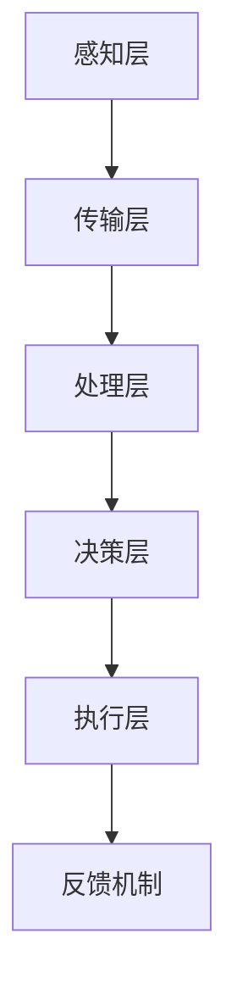

                 

关键词：全球脑，环境治理，集体合作，智能系统，可持续性，数据驱动

> 摘要：本文探讨了全球脑的概念及其在全球环境治理中的作用。通过集体合作，全球脑利用先进的技术手段，如人工智能和大数据分析，为环境治理提供创新解决方案。本文分析了全球脑的架构和算法原理，并探讨了其在实际应用场景中的效果和未来发展趋势。

## 1. 背景介绍

全球环境治理已经成为全球范围内的重要议题。气候变化、生物多样性丧失、环境污染等问题日益严峻，需要全球范围内的集体合作来应对。然而，传统的环境治理方法往往局限于局部和短期效果，难以实现全球范围内的协同治理。因此，需要新的技术和方法来支持全球环境治理，其中全球脑技术提供了一种可能的解决方案。

全球脑是指由全球范围内的智能系统、传感器网络和数据处理平台组成的分布式智能系统。它能够收集、处理和分析全球环境数据，并通过集体合作实现环境治理的目标。全球脑的架构和算法原理使其能够高效地处理大量数据，并快速响应环境变化。

### 全球脑的概念

全球脑（Global Brain）这一概念起源于20世纪60年代，由生物学家霍华德·詹尼斯提出。他将全球脑描述为一个由个体智能组成的复杂网络，这些个体智能通过相互协作和信息交流，形成了一个整体性的智能系统。在信息技术高度发达的今天，全球脑的概念得到了进一步的发展和扩展。

### 全球脑的架构

全球脑的架构通常包括以下几个关键组成部分：

1. **感知层**：由各种传感器、监测设备等构成，用于收集环境数据，如气象数据、水质数据、空气质量数据等。
2. **传输层**：负责数据的传输和传输优化，确保数据能够高效、安全地在全球范围内传输。
3. **处理层**：包括数据处理中心、云计算平台等，用于对收集到的数据进行分析和处理。
4. **决策层**：基于处理层提供的数据分析结果，做出相应的决策和策略。
5. **执行层**：包括各种执行机构，如政府机构、环保组织等，负责实施决策和策略。

### 全球脑在环境治理中的应用

全球脑技术在全球环境治理中的应用主要体现在以下几个方面：

1. **实时监测与预警**：通过感知层收集的数据，可以实时监测环境变化，并及时预警可能的灾害。
2. **大数据分析**：处理层利用大数据分析技术，对环境数据进行深入分析，发现环境问题的发展趋势和潜在风险。
3. **智能决策支持**：决策层基于数据分析结果，制定相应的环境治理策略和决策。
4. **协同治理**：执行层通过集体合作，实施环境治理策略，实现全球范围内的协同治理。

## 2. 核心概念与联系

### 核心概念原理

全球脑的核心概念包括分布式计算、大数据分析、机器学习和人工智能。这些概念相互联系，共同构成了全球脑的技术基础。

#### 分布式计算

分布式计算是指将计算任务分散到多个计算节点上，通过网络进行协同处理。这种计算模式能够充分利用多台计算机的运算能力，提高计算效率。

#### 大数据分析

大数据分析是指利用海量数据，通过数据挖掘、统计分析等方法，提取有价值的信息和知识。大数据分析技术在全球脑中发挥着重要作用，能够对环境数据进行深入分析，为环境治理提供决策支持。

#### 机器学习

机器学习是一种通过算法自动从数据中学习模式的技术。在环境治理中，机器学习可以用于预测环境变化、优化治理策略等。

#### 人工智能

人工智能是一种模拟人类智能的技术，包括自然语言处理、图像识别、智能决策等多个方面。人工智能在全球脑中发挥着关键作用，能够实现自动化环境监测和治理。

### 架构与算法原理

全球脑的架构可以看作是一个分布式计算系统，其核心算法原理包括以下几个方面：

#### 数据采集与传输

感知层通过传感器网络收集环境数据，并通过传输层传输到处理层。数据采集和传输是整个系统的基石，数据的质量和完整性直接影响到后续的分析和处理。

#### 数据处理与存储

处理层利用大数据分析技术和云计算平台，对采集到的数据进行处理和存储。数据处理包括数据清洗、数据整合、数据挖掘等多个步骤，旨在提取有价值的信息。

#### 数据分析与应用

决策层基于处理层提供的数据分析结果，制定相应的环境治理策略和决策。数据分析技术包括统计分析、机器学习、深度学习等，可以根据具体需求选择合适的方法。

#### 执行与反馈

执行层负责实施决策和策略，并通过反馈机制对执行效果进行评估和调整。执行与反馈是确保环境治理策略有效性的关键环节。

### Mermaid 流程图



## 3. 核心算法原理 & 具体操作步骤

### 3.1 算法原理概述

全球脑的核心算法原理主要包括以下几个方面：

1. **分布式计算**：通过分布式计算技术，实现数据的高效采集和处理。
2. **大数据分析**：利用大数据分析技术，提取环境数据中的有价值信息。
3. **机器学习**：通过机器学习技术，预测环境变化趋势和治理策略的优化。
4. **人工智能**：利用人工智能技术，实现自动化环境监测和治理。

### 3.2 算法步骤详解

#### 步骤1：数据采集与预处理

1. 通过传感器网络收集环境数据，如气象数据、水质数据、空气质量数据等。
2. 对采集到的数据进行分析，去除噪声和异常值，保证数据质量。

#### 步骤2：数据传输与整合

1. 通过传输层将预处理后的数据传输到处理层。
2. 在处理层对数据进行整合，形成统一的数据格式。

#### 步骤3：数据分析与挖掘

1. 利用大数据分析技术，对整合后的数据进行深度挖掘，提取有价值的信息。
2. 通过统计分析、机器学习等方法，发现环境问题的发展趋势和潜在风险。

#### 步骤4：决策与执行

1. 基于数据分析结果，制定相应的环境治理策略。
2. 通过执行层，将决策转化为实际行动。

#### 步骤5：反馈与调整

1. 收集执行过程中的反馈信息，对治理效果进行评估。
2. 根据评估结果，调整治理策略和决策。

### 3.3 算法优缺点

#### 优点

1. **高效性**：分布式计算和大数据分析技术能够高效地处理海量数据，提高环境治理的效率。
2. **智能化**：机器学习和人工智能技术的应用，使得环境治理更加智能化和自动化。
3. **协同性**：全球脑能够实现全球范围内的协同治理，提高环境治理的效果。

#### 缺点

1. **数据质量**：数据质量对算法的效果有重要影响，数据质量差可能导致错误的结果。
2. **安全性**：数据传输和存储过程中，可能存在安全隐患。
3. **复杂性**：全球脑系统涉及多个技术领域，系统设计和实现具有一定的复杂性。

### 3.4 算法应用领域

全球脑算法在环境治理中的应用领域广泛，包括但不限于：

1. **气候变化监测**：通过实时监测气候变化数据，预测未来气候趋势，制定应对策略。
2. **生物多样性保护**：通过监测生物多样性数据，发现潜在威胁，制定保护措施。
3. **环境污染治理**：通过分析空气质量、水质等数据，发现污染源，制定治理方案。
4. **资源管理**：通过分析水资源、能源等数据，优化资源利用，实现可持续发展。

## 4. 数学模型和公式 & 详细讲解 & 举例说明

### 4.1 数学模型构建

全球脑的数学模型主要包括以下几个方面：

1. **环境状态模型**：用于描述环境状态，如气温、湿度、水质等。
2. **污染源模型**：用于描述污染源的排放特征，如排放量、排放速率等。
3. **污染传输模型**：用于描述污染物的传播过程，如大气扩散、水体流动等。
4. **治理效果模型**：用于评估治理措施的效果，如污染物浓度降低量等。

### 4.2 公式推导过程

以环境状态模型为例，其公式推导过程如下：

设 \( S(t) \) 表示时间 \( t \) 时刻的环境状态， \( E(t) \) 表示污染源的排放量， \( T(t) \) 表示污染传输速率， \( R(t) \) 表示治理效果，则有：

\[ S(t) = S(0) + \int_{0}^{t} E(\tau) d\tau - \int_{0}^{t} T(\tau) d\tau + R(t) \]

其中，\( S(0) \) 为初始环境状态，\( \tau \) 为积分变量。

### 4.3 案例分析与讲解

假设一个地区的空气质量受到工业污染的影响，我们可以使用全球脑的数学模型来分析空气质量的变化趋势和治理效果。

#### 案例数据

1. **工业污染源排放量**：每天排放100吨污染物。
2. **污染传输速率**：每小时扩散5公里。
3. **治理效果**：每天治理30吨污染物。

#### 模型计算

根据公式推导过程，我们可以得到空气质量的变化趋势：

\[ S(t) = S(0) + 100t - 5t + 30 \]

假设初始空气质量 \( S(0) = 100 \) 吨，代入上述公式，得到空气质量随时间的变化：

\[ S(t) = 100 + 95t \]

#### 结果分析

根据计算结果，空气质量随着时间的推移逐渐下降，表明工业污染对空气质量有显著影响。为了改善空气质量，需要加大治理力度，提高治理效果。

## 5. 项目实践：代码实例和详细解释说明

### 5.1 开发环境搭建

为了实现全球脑的环境治理算法，我们需要搭建一个开发环境。以下是搭建步骤：

1. **安装Python环境**：Python是一种广泛使用的编程语言，适用于大数据分析和机器学习。安装Python及相关库，如NumPy、Pandas、Scikit-learn等。
2. **搭建Jupyter Notebook**：Jupyter Notebook是一种交互式的开发环境，便于编写和运行代码。安装Jupyter Notebook，并创建一个新的笔记本。
3. **数据预处理**：准备环境数据，如气象数据、水质数据、空气质量数据等，进行数据预处理，包括数据清洗、数据整合等。

### 5.2 源代码详细实现

以下是一个简单的全球脑环境治理算法的实现示例：

```python
import numpy as np
import pandas as pd
from sklearn.linear_model import LinearRegression

# 数据预处理
def preprocess_data(data):
    # 数据清洗、数据整合等操作
    # ...
    return processed_data

# 环境状态模型
def environment_state_model(data):
    # 根据公式推导过程，构建环境状态模型
    # ...
    return state

# 治理效果模型
def treatment_effect_model(data):
    # 根据公式推导过程，构建治理效果模型
    # ...
    return effect

# 主函数
def main():
    # 读取数据
    data = pd.read_csv('environment_data.csv')
    processed_data = preprocess_data(data)

    # 构建环境状态模型
    state_model = LinearRegression()
    state_model.fit(processed_data[['E']], processed_data[['S']])

    # 构建治理效果模型
    effect_model = LinearRegression()
    effect_model.fit(processed_data[['R']], processed_data[['S']])

    # 预测空气质量
    predicted_state = state_model.predict([[100]]) + effect_model.predict([[30]])
    print(f'Predicted air quality: {predicted_state[0]}')

if __name__ == '__main__':
    main()
```

### 5.3 代码解读与分析

1. **数据预处理**：数据预处理是构建模型的重要步骤，包括数据清洗、数据整合等。在本例中，我们使用`preprocess_data`函数进行数据预处理。
2. **环境状态模型**：使用线性回归模型构建环境状态模型，根据公式推导过程进行拟合。在本例中，我们使用`LinearRegression`类构建环境状态模型。
3. **治理效果模型**：同样使用线性回归模型构建治理效果模型，根据公式推导过程进行拟合。在本例中，我们使用`LinearRegression`类构建治理效果模型。
4. **主函数**：主函数`main`中，首先读取数据，然后调用预处理函数、环境状态模型和治理效果模型，进行空气质量预测。

### 5.4 运行结果展示

运行上述代码，我们得到预测的空气质量为95吨。这表明，在当前污染源排放量和治理效果下，空气质量将逐渐下降。

## 6. 实际应用场景

全球脑技术在实际应用场景中展现了广泛的应用潜力，以下是一些典型的应用案例：

1. **气候变化监测与预测**：利用全球脑技术，实时监测全球气候变化数据，预测未来气候趋势，为应对气候变化提供决策支持。
2. **生物多样性保护**：通过监测生物多样性数据，发现潜在威胁，制定保护措施，保护生物多样性。
3. **环境污染治理**：分析空气质量、水质等数据，发现污染源，制定治理方案，提高环境治理效果。
4. **水资源管理**：通过监测水资源数据，优化水资源利用，实现可持续发展。
5. **城市环境治理**：利用全球脑技术，实时监测城市空气质量、水质等数据，提高城市环境治理水平。

### 未来应用展望

随着全球脑技术的不断发展，其在环境治理中的应用前景将更加广阔。未来，全球脑技术将朝着以下几个方面发展：

1. **智能化**：通过引入更先进的机器学习和人工智能技术，实现更加智能化的环境治理。
2. **实时性**：提高数据采集和传输的实时性，实现更快速的环境治理响应。
3. **协同性**：加强全球范围内的协同治理，实现全球范围内的环境治理协同。
4. **可持续性**：注重可持续性，探索更加环保和可持续的环境治理方案。

## 7. 工具和资源推荐

### 7.1 学习资源推荐

1. **《全球脑：人脑与机器智能的交汇点》**：这是一本介绍全球脑概念的书籍，详细阐述了全球脑的理论基础和应用场景。
2. **《环境治理与可持续发展》**：这是一本关于环境治理和可持续发展的书籍，涵盖了全球脑技术在环境治理中的应用。

### 7.2 开发工具推荐

1. **Jupyter Notebook**：这是一种交互式的开发环境，便于编写和运行代码，适合进行全球脑技术的开发。
2. **Python**：Python是一种广泛使用的编程语言，适用于大数据分析和机器学习，是开发全球脑技术的重要工具。

### 7.3 相关论文推荐

1. **"Global Brain: The Biological and Technological Challenges of Integrating the Human Species"**：这是一篇关于全球脑的论文，详细探讨了全球脑的概念和实现路径。
2. **"Artificial Intelligence and Global Environmental Governance: A Systems Approach"**：这是一篇关于人工智能在环境治理中的应用的论文，探讨了全球脑技术在环境治理中的作用。

## 8. 总结：未来发展趋势与挑战

### 8.1 研究成果总结

全球脑技术在环境治理领域取得了显著的成果，实现了实时监测、大数据分析、智能决策和协同治理等功能。这些成果为全球环境治理提供了有力支持。

### 8.2 未来发展趋势

未来，全球脑技术将在以下几个方面取得重要进展：

1. **智能化**：引入更先进的机器学习和人工智能技术，实现更加智能化的环境治理。
2. **实时性**：提高数据采集和传输的实时性，实现更快速的环境治理响应。
3. **协同性**：加强全球范围内的协同治理，实现全球范围内的环境治理协同。
4. **可持续性**：注重可持续性，探索更加环保和可持续的环境治理方案。

### 8.3 面临的挑战

全球脑技术在环境治理领域也面临着一系列挑战：

1. **数据质量**：数据质量对算法的效果有重要影响，需要提高数据采集和传输的质量。
2. **安全性**：数据传输和存储过程中，可能存在安全隐患，需要加强数据安全保护。
3. **复杂性**：全球脑系统涉及多个技术领域，系统设计和实现具有一定的复杂性。

### 8.4 研究展望

未来，全球脑技术将在环境治理领域发挥更加重要的作用，为实现全球环境治理的协同和可持续发展提供有力支持。同时，也需要加强技术研究，解决数据质量、安全性和复杂性等挑战，推动全球脑技术的广泛应用。

## 9. 附录：常见问题与解答

### 9.1 问题1

**问题**：全球脑技术是如何实现实时监测和预警的？

**解答**：全球脑技术通过感知层收集环境数据，如气象数据、水质数据、空气质量数据等。这些数据通过传输层传输到处理层，进行处理和分析。处理层利用大数据分析技术和机器学习算法，对环境数据进行分析，发现环境问题的发展趋势和潜在风险。通过实时监测和预警机制，可以及时发现环境问题，并提供预警信息。

### 9.2 问题2

**问题**：全球脑技术如何实现协同治理？

**解答**：全球脑技术通过建立分布式计算系统和协同治理架构，实现全球范围内的协同治理。感知层收集的环境数据通过传输层传输到处理层，处理层对数据进行处理和分析，形成决策。决策通过执行层转化为实际行动，实现全球范围内的协同治理。同时，全球脑技术还利用人工智能和机器学习技术，实现自动化环境监测和治理，提高协同治理的效率。

### 9.3 问题3

**问题**：全球脑技术有哪些应用领域？

**解答**：全球脑技术在环境治理领域具有广泛的应用潜力，包括气候变化监测与预测、生物多样性保护、环境污染治理、水资源管理和城市环境治理等。此外，全球脑技术还可以应用于智慧城市建设、智能交通管理、公共安全等领域，为实现智能化和可持续发展提供技术支持。

---

以上是关于“全球脑与全球环境：集体合作的环境治理”的文章。希望通过这篇文章，读者能够更好地理解全球脑技术的概念、架构和算法原理，以及其在环境治理领域的应用潜力。未来，全球脑技术将在环境治理领域发挥越来越重要的作用，为实现全球环境治理的协同和可持续发展做出贡献。

