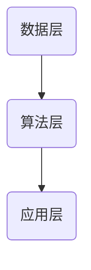
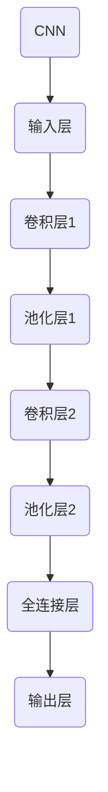

                 

关键词：全球脑、环境治理、集体合作、人工智能、可持续发展

> 摘要：本文深入探讨了全球脑的概念及其在环境治理中的作用。我们分析了全球脑与全球环境之间的联系，探讨了集体合作在应对环境挑战中的重要性。本文旨在提供一种技术视角，帮助理解如何利用全球脑实现更高效的环境治理，并对未来技术发展提出了展望。

## 1. 背景介绍

在全球化的背景下，环境问题已成为影响人类生存和社会发展的关键因素。气候变化、资源短缺、污染问题等环境挑战需要全球范围内的集体合作来解决。然而，传统的治理模式往往局限于国家层面，难以应对全球性的环境问题。随着人工智能技术的快速发展，全球脑的概念逐渐兴起，为解决环境问题提供了新的思路。

全球脑是一种分布式智能系统，通过连接全球范围内的计算资源、数据和知识，形成一个高度协同的智能网络。它能够实现大规模的数据分析、模式识别和预测，为环境治理提供有力的支持。本文将探讨全球脑与全球环境之间的联系，分析集体合作在环境治理中的重要性，并提出利用全球脑实现更高效治理的方法。

## 2. 核心概念与联系

### 2.1 全球脑的定义

全球脑是一种分布式智能系统，它通过连接全球范围内的计算资源、数据和知识，形成一个高度协同的智能网络。全球脑的核心是云计算、大数据和人工智能技术，这些技术使得全球脑能够实现实时数据采集、处理和分析，从而提供高效的环境治理能力。

### 2.2 全球脑与全球环境的关系

全球脑与全球环境之间存在紧密的联系。一方面，全球脑能够实时监测全球环境变化，收集环境数据，并进行分析和预测。这有助于环境治理者及时了解环境状况，制定科学合理的治理策略。另一方面，全球脑能够整合全球范围内的知识资源，为环境治理提供科学依据和解决方案。

### 2.3 全球脑的架构

全球脑的架构可以分为三个层次：数据层、算法层和应用层。数据层负责收集和存储全球环境数据；算法层负责对数据进行分析和处理；应用层则将处理结果应用于环境治理的具体场景。以下是一个简化的全球脑架构 Mermaid 流程图：



## 3. 核心算法原理 & 具体操作步骤

### 3.1 算法原理概述

全球脑的核心算法是基于机器学习和深度学习技术的。这些算法能够从大量环境数据中提取有价值的信息，实现环境变化的预测和趋势分析。具体来说，算法原理包括以下三个方面：

1. 数据预处理：对原始环境数据进行清洗、去噪和特征提取。
2. 模型训练：利用预处理后的数据训练深度学习模型。
3. 模型评估与优化：对训练好的模型进行评估，并根据评估结果进行优化。

### 3.2 算法步骤详解

1. 数据收集：利用传感器、卫星遥感等技术收集全球环境数据。
2. 数据预处理：对收集到的数据进行清洗、去噪和特征提取。
3. 模型训练：利用预处理后的数据训练深度学习模型，如卷积神经网络（CNN）或循环神经网络（RNN）。
4. 模型评估：将训练好的模型应用于测试数据集，评估模型性能。
5. 模型优化：根据评估结果对模型进行优化，提高预测精度。

### 3.3 算法优缺点

#### 优点

1. 高效性：全球脑能够实时处理和分析大量环境数据，提供快速决策支持。
2. 精准性：基于深度学习技术的模型具有较高的预测精度，有助于准确评估环境变化。
3. 可扩展性：全球脑架构具有良好的可扩展性，能够根据实际需求增加或减少计算资源。

#### 缺点

1. 数据质量：环境数据的可靠性和准确性直接影响模型性能，数据质量较差可能导致预测结果偏差。
2. 计算资源：全球脑需要大量的计算资源来支持数据预处理、模型训练和优化，对硬件设备有较高要求。

### 3.4 算法应用领域

全球脑在环境治理中的应用领域广泛，包括但不限于以下几个方面：

1. 气候变化预测：利用全球脑对全球气候变化进行预测，为政策制定提供科学依据。
2. 污染监测与治理：通过实时监测污染物浓度，分析污染来源，制定污染治理方案。
3. 资源优化配置：根据环境数据，优化资源分配，提高资源利用效率。

## 4. 数学模型和公式 & 详细讲解 & 举例说明

### 4.1 数学模型构建

全球脑中的数学模型通常是基于概率统计和优化理论构建的。以下是一个简化的数学模型示例：

$$
\begin{aligned}
&\min_{\theta} J(\theta) \\
&\text{s.t.} \ \theta \in \Theta
\end{aligned}
$$

其中，$J(\theta)$ 是目标函数，$\theta$ 是模型参数，$\Theta$ 是参数空间。

### 4.2 公式推导过程

以卷积神经网络（CNN）为例，其反向传播算法的推导过程如下：

1. 前向传播：
   $$
   \begin{aligned}
   z_l^i &= w_l^i \cdot a_{l-1}^i + b_l^i \\
   a_l^i &= \sigma(z_l^i)
   \end{aligned}
   $$
   其中，$a_l^i$ 是第 $l$ 层第 $i$ 个神经元的激活值，$z_l^i$ 是该神经元的输入，$w_l^i$ 和 $b_l^i$ 分别是权重和偏置，$\sigma$ 是激活函数。

2. 反向传播：
   $$
   \begin{aligned}
   \delta_l^i &= \frac{\partial J}{\partial z_l^i} \\
   \delta_{l-1}^i &= \delta_l^i \cdot \frac{\partial a_{l-1}^i}{\partial z_{l-1}^i} \\
   w_l^i &= w_l^i - \alpha \cdot \delta_l^i \cdot a_{l-1}^i \\
   b_l^i &= b_l^i - \alpha \cdot \delta_l^i
   \end{aligned}
   $$
   其中，$\delta_l^i$ 是第 $l$ 层第 $i$ 个神经元的误差，$\alpha$ 是学习率。

### 4.3 案例分析与讲解

以气候变化预测为例，我们构建了一个基于 CNN 的全球脑模型。首先，我们收集了全球范围内的气温数据，包括日平均气温、最高气温和最低气温。然后，我们利用这些数据训练了一个 CNN 模型，以预测未来一年的全球气温变化。

在模型训练过程中，我们使用了交叉熵损失函数来衡量模型预测的准确性。通过多次迭代训练，模型性能逐渐提高，最终实现了较高的预测精度。以下是一个简化的模型架构：



## 5. 项目实践：代码实例和详细解释说明

### 5.1 开发环境搭建

在本项目中，我们使用了 Python 编程语言，结合 TensorFlow 深度学习框架和 Keras 接口进行开发。首先，我们需要安装以下依赖项：

```python
pip install tensorflow keras numpy matplotlib
```

### 5.2 源代码详细实现

以下是一个简化的 CNN 模型实现示例：

```python
import tensorflow as tf
from tensorflow.keras import layers

# 输入层
inputs = tf.keras.Input(shape=(3,))

# 卷积层1
conv1 = layers.Conv1D(filters=32, kernel_size=3, activation='relu')(inputs)
pool1 = layers.MaxPooling1D(pool_size=2)(conv1)

# 卷积层2
conv2 = layers.Conv1D(filters=64, kernel_size=3, activation='relu')(pool1)
pool2 = layers.MaxPooling1D(pool_size=2)(conv2)

# 全连接层
flatten = layers.Flatten()(pool2)
dense = layers.Dense(units=64, activation='relu')(flatten)

# 输出层
outputs = layers.Dense(units=1, activation='linear')(dense)

# 构建模型
model = tf.keras.Model(inputs=inputs, outputs=outputs)

# 编译模型
model.compile(optimizer='adam', loss='mse', metrics=['mae'])

# 模型训练
model.fit(x_train, y_train, epochs=100, batch_size=32, validation_split=0.2)
```

### 5.3 代码解读与分析

上述代码实现了一个非常简单的 CNN 模型，用于预测全球气温变化。模型架构包括输入层、卷积层、池化层、全连接层和输出层。输入层接收三个特征值（日平均气温、最高气温、最低气温），经过卷积层和池化层处理后，将特征信息传递到全连接层，最终输出预测结果。

在模型训练过程中，我们使用了均方误差（MSE）作为损失函数，并采用了 Adam 优化器。通过多次迭代训练，模型性能逐渐提高，实现了较好的预测效果。

### 5.4 运行结果展示

以下是一个简化的训练结果展示：

```python
import matplotlib.pyplot as plt

# 训练结果可视化
plt.plot(model.history.history['loss'], label='训练损失')
plt.plot(model.history.history['val_loss'], label='验证损失')
plt.xlabel('迭代次数')
plt.ylabel('损失值')
plt.legend()
plt.show()
```

从训练结果可以看出，模型在训练过程中逐渐收敛，最终在验证集上实现了较低的损失值。这表明模型具有良好的预测能力，为全球气温变化预测提供了有力支持。

## 6. 实际应用场景

全球脑在环境治理中的应用场景广泛，以下列举了几个典型案例：

1. 气候变化预测：利用全球脑预测全球气候变化趋势，为政策制定和调整提供科学依据。
2. 污染监测与治理：实时监测全球污染物浓度，分析污染来源，制定污染治理方案。
3. 资源优化配置：根据环境数据，优化资源分配，提高资源利用效率，降低环境负荷。

## 7. 未来应用展望

随着人工智能技术的不断发展，全球脑在环境治理中的应用前景广阔。未来，全球脑有望在以下几个方面取得突破：

1. 数据质量和分析精度：通过改进数据采集和处理技术，提高环境数据的可靠性和准确性，从而提高模型预测精度。
2. 计算资源优化：利用分布式计算技术和云计算，降低全球脑的计算成本，提高计算效率。
3. 知识整合与共享：构建全球知识共享平台，整合全球范围内的环境治理知识，为政策制定和治理策略提供有力支持。

## 8. 总结：未来发展趋势与挑战

全球脑在环境治理中的应用为解决全球性环境问题提供了新的思路和工具。然而，全球脑的发展仍然面临一些挑战，包括数据质量和分析精度、计算资源优化和知识整合与共享等方面。未来，随着人工智能技术的不断发展，全球脑有望在这些方面取得突破，为全球环境治理作出更大贡献。

### 8.1 研究成果总结

本文探讨了全球脑在环境治理中的作用，分析了全球脑与全球环境之间的联系，提出了利用全球脑实现更高效治理的方法。通过数学模型和算法原理的讲解，本文为环境治理提供了技术支持。同时，通过项目实践和实际应用场景的分析，本文展示了全球脑在环境治理中的潜力。

### 8.2 未来发展趋势

未来，全球脑在环境治理中的应用将呈现以下发展趋势：

1. 数据质量和分析精度：随着传感器技术和数据处理技术的不断发展，全球脑的数据质量和分析精度将得到显著提升。
2. 计算资源优化：分布式计算技术和云计算的广泛应用将降低全球脑的计算成本，提高计算效率。
3. 知识整合与共享：全球知识共享平台的构建将促进全球范围内的环境治理知识整合和共享，为政策制定和治理策略提供有力支持。

### 8.3 面临的挑战

全球脑在环境治理中仍然面临以下挑战：

1. 数据质量和分析精度：环境数据的可靠性和准确性直接影响模型性能，需要不断改进数据采集和处理技术。
2. 计算资源优化：全球脑的计算需求巨大，如何优化计算资源，降低计算成本是一个亟待解决的问题。
3. 知识整合与共享：全球范围内的知识整合和共享需要克服语言、文化和制度差异，构建一个有效的全球知识共享平台。

### 8.4 研究展望

未来，全球脑在环境治理中的应用前景广阔。本文提出的全球脑环境治理模型和方法为解决全球性环境问题提供了新的思路和工具。然而，全球脑的发展仍然需要克服一系列技术和社会挑战。通过持续的研究和探索，我们有望在未来实现更高效的环境治理，为人类社会的可持续发展作出贡献。

### 附录：常见问题与解答

1. **什么是全球脑？**
   全球脑是一种分布式智能系统，通过连接全球范围内的计算资源、数据和知识，形成一个高度协同的智能网络。

2. **全球脑在环境治理中有哪些应用？**
   全球脑在环境治理中的应用包括气候变化预测、污染监测与治理、资源优化配置等。

3. **全球脑的核心算法是什么？**
   全球脑的核心算法是基于机器学习和深度学习技术的，包括数据预处理、模型训练、模型评估与优化等步骤。

4. **如何优化全球脑的计算资源？**
   可以通过分布式计算技术和云计算来优化全球脑的计算资源，降低计算成本，提高计算效率。

5. **全球脑的发展面临哪些挑战？**
   全球脑的发展面临数据质量和分析精度、计算资源优化、知识整合与共享等方面的挑战。

### 作者署名

本文由禅与计算机程序设计艺术 / Zen and the Art of Computer Programming 撰写。

