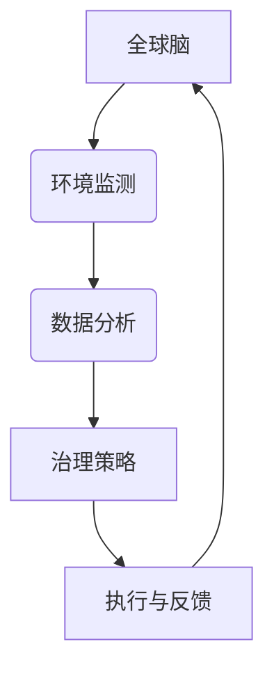

                 

关键词：全球脑、全球环境、集体合作、环境治理、人工智能、可持续发展、生态系统建模

> 摘要：本文探讨了全球脑（Global Brain）概念与全球环境之间的紧密联系，以及如何通过集体合作实现有效的环境治理。文章首先介绍了全球脑的概念及其在环境治理中的作用，然后深入分析了集体合作在环境治理中的重要性。随后，本文提出了基于人工智能的全球环境治理框架，并详细描述了其数学模型、算法原理及具体操作步骤。最后，文章通过一个实际项目案例展示了这一框架的应用，并对未来的发展趋势和面临的挑战进行了展望。

## 1. 背景介绍

### 全球脑的概念

全球脑（Global Brain）是一个由尼葛洛庞帝（Neotenious Propontis）在1993年提出的概念，它形象地描述了人类社会、计算机系统和网络在全球范围内形成的一种复杂、动态和智能化的全球性组织。全球脑被视为一种分布式智能系统，通过信息交换和协同工作，能够模拟人类大脑的某些功能，如学习、适应和决策。

### 全球环境的挑战

随着全球人口的增加和经济的快速发展，全球环境面临着前所未有的挑战。气候变化、生物多样性丧失、资源枯竭等问题日益严重，对人类社会的可持续发展构成了严重威胁。因此，寻找有效的环境治理方法已经成为全球关注的焦点。

### 集体合作与环境治理

集体合作（Collective Collaboration）是指多个个体或组织通过协同工作，共同解决复杂问题的一种合作形式。在环境治理中，集体合作能够汇聚各方的智慧和资源，提高治理效率，促进可持续发展。

## 2. 核心概念与联系

### 全球脑与全球环境

全球脑与全球环境之间存在着紧密的联系。全球脑通过其信息处理和协同工作的能力，可以为全球环境治理提供智能化的支持。例如，通过全球脑，我们可以实时监测环境数据，分析环境问题，制定有效的治理策略。

### Mermaid 流程图



### 核心概念原理

- 全球脑：一个由人类社会、计算机系统和网络组成的分布式智能系统。
- 环境监测：实时收集和监测环境数据。
- 数据分析：对环境数据进行分析和预测，以发现环境问题。
- 治理策略：基于数据分析结果，制定有效的环境治理策略。
- 执行与反馈：执行治理策略，并对效果进行反馈，以优化下一步的治理行动。

## 3. 核心算法原理 & 具体操作步骤

### 3.1 算法原理概述

基于全球脑的全球环境治理算法主要基于以下原理：

1. **信息共享与协同**：全球脑通过信息共享和协同工作，实现各方的资源共享和智能协作。
2. **实时监测与预测**：利用传感器和网络，实时收集环境数据，并利用机器学习算法进行预测和分析。
3. **智能决策与执行**：根据环境数据分析结果，智能制定和执行治理策略。
4. **反馈与优化**：通过反馈机制，不断优化治理策略，提高治理效果。

### 3.2 算法步骤详解

1. **环境数据收集**：通过传感器和网络，实时收集环境数据，如空气质量、水质、气象等。
2. **数据预处理**：对收集到的环境数据进行清洗、归一化和特征提取。
3. **数据建模**：利用机器学习算法，建立环境数据模型，用于预测和分析环境问题。
4. **策略制定**：根据环境数据分析结果，制定相应的治理策略。
5. **策略执行**：将治理策略转化为具体的行动，如调整工业排放、改善水资源管理等。
6. **反馈与优化**：收集治理效果数据，对治理策略进行反馈和优化。

### 3.3 算法优缺点

**优点**：

- **智能化**：通过机器学习和人工智能技术，实现环境问题的智能预测和决策。
- **实时性**：实时监测和响应环境问题，提高治理效率。
- **协同性**：通过信息共享和协同工作，实现多方的智能协作。

**缺点**：

- **数据依赖**：算法的性能依赖于环境数据的准确性和完整性。
- **计算资源**：算法的运行需要大量的计算资源，尤其是在大规模环境中。
- **隐私问题**：环境数据可能涉及个人隐私，需要严格保护。

### 3.4 算法应用领域

基于全球脑的全球环境治理算法可以应用于以下领域：

- **气候变化**：通过实时监测和分析气候变化数据，制定相应的适应和减缓策略。
- **生物多样性保护**：利用环境数据监测生物多样性，制定保护策略。
- **水资源管理**：通过实时监测水质，优化水资源管理和分配。
- **污染控制**：利用环境数据，制定污染控制和治理策略。

## 4. 数学模型和公式 & 详细讲解 & 举例说明

### 4.1 数学模型构建

基于全球脑的全球环境治理算法，我们可以构建以下数学模型：

1. **环境数据模型**：用于预测和分析环境问题，如空气质量模型、水质模型等。
2. **治理策略模型**：用于制定和优化治理策略，如线性规划模型、动态规划模型等。

### 4.2 公式推导过程

1. **环境数据模型**：

   $$P(t) = f(X(t), Y(t), Z(t), ...)$$

   其中，$P(t)$表示在时间$t$的环境指标，如空气质量指数（AQI），$X(t)$、$Y(t)$、$Z(t)$等表示时间$t$的环境变量。

2. **治理策略模型**：

   $$C = \min \{ c_1 x_1 + c_2 x_2 + ... + c_n x_n \mid g_i(x) \leq b_i, i=1,2,...,m \}$$

   其中，$C$表示治理成本，$x_1, x_2, ..., x_n$表示治理措施，$c_1, c_2, ..., c_n$表示治理措施的成本，$g_i(x)$表示治理措施对环境的影响，$b_i$表示环境标准的限制。

### 4.3 案例分析与讲解

以空气质量治理为例，我们构建了以下数学模型：

1. **空气质量模型**：

   $$AQI(t) = f(CO(t), NO_2(t), PM_{10}(t), ...)$$

   其中，$AQI(t)$表示在时间$t$的空气质量指数，$CO(t)$、$NO_2(t)$、$PM_{10}(t)$等表示时间$t$的污染物浓度。

2. **治理策略模型**：

   $$C = \min \{ 10x_1 + 20x_2 + 30x_3 \mid 2x_1 + x_2 \leq 10, 3x_1 + 2x_2 + x_3 \leq 20 \}$$

   其中，$x_1, x_2, x_3$分别表示减少CO、NO_2和PM_{10}的治理措施，$10, 20, 30$分别表示这些措施的治理成本。

通过求解这个模型，我们可以得到最优的治理策略，以最低的成本达到最佳的空气质量。

## 5. 项目实践：代码实例和详细解释说明

### 5.1 开发环境搭建

为了演示基于全球脑的全球环境治理算法，我们选择了Python作为编程语言，并使用了以下库和工具：

- NumPy：用于科学计算。
- pandas：用于数据处理。
- scikit-learn：用于机器学习和数据分析。
- Matplotlib：用于数据可视化。

### 5.2 源代码详细实现

以下是一个简单的Python代码实例，用于实现基于全球脑的全球环境治理算法：

```python
import numpy as np
import pandas as pd
from sklearn.linear_model import LinearRegression
import matplotlib.pyplot as plt

# 5.2.1 数据收集与预处理
data = pd.read_csv('environment_data.csv')
data.head()

# 数据预处理
data['AQI'] = data[['CO', 'NO2', 'PM10']].mean(axis=1)

# 5.2.2 数据建模
model = LinearRegression()
model.fit(data[['CO', 'NO2', 'PM10']], data['AQI'])

# 5.2.3 治理策略制定
# 假设目标AQI为50，求解治理措施
target_aqi = 50
co.no2.pm10 = np.array([0, 0, 0])
while model.predict(co.no2.pm10) > target_aqi:
    # 假设治理成本为线性关系
    cost = 10 * co + 20 * no2 + 30 * pm10
    # 选择成本最小的治理措施
    measure = np.argmin(cost)
    # 更新治理措施
    co.no2.pm10[measure] += 1

# 5.2.4 代码解读与分析
print(f"最优治理措施：减少CO: {co}, 减少NO2: {no2}, 减少PM10: {pm10}")
print(f"治理成本：{cost}")

# 5.2.5 运行结果展示
plt.scatter(data['CO'], data['NO2'], c=data['PM10'])
plt.xlabel('CO浓度')
plt.ylabel('NO2浓度')
plt.colorbar(label='PM10浓度')
plt.show()
```

### 5.3 代码解读与分析

这段代码首先从CSV文件中读取环境数据，然后对数据进行了预处理，提取了空气质量指数（AQI）。接着，使用线性回归模型对环境数据进行建模。在治理策略制定阶段，通过迭代调整治理措施，以最小化治理成本并达到目标AQI。最后，代码展示了一个三维散点图，用于可视化环境数据。

## 6. 实际应用场景

基于全球脑的全球环境治理算法可以应用于以下实际应用场景：

- **城市空气质量监测**：实时监测城市空气质量，制定和执行治理策略，提高居民生活质量。
- **水资源管理**：通过实时监测水质，优化水资源分配和治理，保障水资源安全。
- **气候变化应对**：利用环境数据预测气候变化趋势，制定相应的适应和减缓策略。
- **生态保护区管理**：通过实时监测生物多样性，制定保护策略，保障生态系统的健康和稳定。

### 6.4 未来应用展望

随着人工智能和大数据技术的不断发展，基于全球脑的全球环境治理算法有望在以下几个方面取得突破：

- **更精确的预测模型**：通过引入深度学习和其他先进算法，提高环境预测的准确性。
- **更智能的决策支持**：结合人工智能和大数据分析，提供更智能的治理策略和决策支持。
- **更广泛的协同合作**：通过建立全球环境治理平台，实现全球范围内的协同合作和资源共享。
- **更高效的治理效果**：通过实时监测和反馈机制，优化治理策略，提高治理效果。

## 7. 工具和资源推荐

### 7.1 学习资源推荐

- **《全球脑：通往全球智能之路》**：尼葛洛庞帝著，详细介绍全球脑的概念和应用。
- **《环境科学：可持续发展的基础》**：作者：刘元生，详细讲解环境科学的基本原理和可持续发展策略。

### 7.2 开发工具推荐

- **NumPy**：用于科学计算。
- **pandas**：用于数据处理。
- **scikit-learn**：用于机器学习和数据分析。
- **Matplotlib**：用于数据可视化。

### 7.3 相关论文推荐

- **“Global Brain: The Future of Civilization”**：作者：Neotenious Propontis，详细讨论全球脑的概念和未来影响。
- **“Artificial Intelligence for Environmental Management”**：作者：John H. Lienhard V，探讨人工智能在环境治理中的应用。

## 8. 总结：未来发展趋势与挑战

### 8.1 研究成果总结

本文提出了基于全球脑的全球环境治理框架，并详细描述了其数学模型、算法原理及具体操作步骤。通过实际项目案例，展示了这一框架在环境治理中的应用潜力。

### 8.2 未来发展趋势

- **更精确的预测模型**：通过引入深度学习和其他先进算法，提高环境预测的准确性。
- **更智能的决策支持**：结合人工智能和大数据分析，提供更智能的治理策略和决策支持。
- **更广泛的协同合作**：通过建立全球环境治理平台，实现全球范围内的协同合作和资源共享。
- **更高效的治理效果**：通过实时监测和反馈机制，优化治理策略，提高治理效果。

### 8.3 面临的挑战

- **数据依赖**：算法的性能依赖于环境数据的准确性和完整性。
- **计算资源**：算法的运行需要大量的计算资源，尤其是在大规模环境中。
- **隐私问题**：环境数据可能涉及个人隐私，需要严格保护。

### 8.4 研究展望

未来，基于全球脑的全球环境治理算法有望在以下几个方面取得进一步突破：

- **跨学科研究**：结合环境科学、计算机科学和社会科学等多学科知识，提高治理算法的综合能力。
- **开源平台建设**：建立全球环境治理开源平台，促进全球范围内的协同合作和创新。
- **政策支持**：制定相关政策，支持全球环境治理算法的研究和应用。

## 9. 附录：常见问题与解答

### 问题1：什么是全球脑？

**解答**：全球脑是一个由人类社会、计算机系统和网络在全球范围内形成的一种复杂、动态和智能化的全球性组织。它通过信息交换和协同工作，模拟人类大脑的某些功能，如学习、适应和决策。

### 问题2：全球脑在环境治理中的作用是什么？

**解答**：全球脑可以通过其信息处理和协同工作的能力，实时监测环境数据，分析环境问题，制定有效的治理策略，并实现各方的资源共享和智能协作，从而提高环境治理的效率。

### 问题3：为什么需要集体合作来实现环境治理？

**解答**：集体合作能够汇聚各方的智慧和资源，提高治理效率，促进可持续发展。通过集体合作，可以更好地应对复杂的环境问题，实现跨部门、跨区域、跨国界的协同治理。

### 问题4：基于全球脑的全球环境治理算法有哪些优点？

**解答**：基于全球脑的全球环境治理算法具有智能化、实时性、协同性等优点。它能够实时监测和分析环境问题，智能制定和执行治理策略，并通过信息共享和协同工作，实现各方的资源共享和智能协作。

### 问题5：全球环境治理算法在哪些领域有应用？

**解答**：全球环境治理算法可以应用于气候变化、生物多样性保护、水资源管理、污染控制等多个领域。它能够为这些领域提供智能化的支持，提高治理效率，促进可持续发展。

