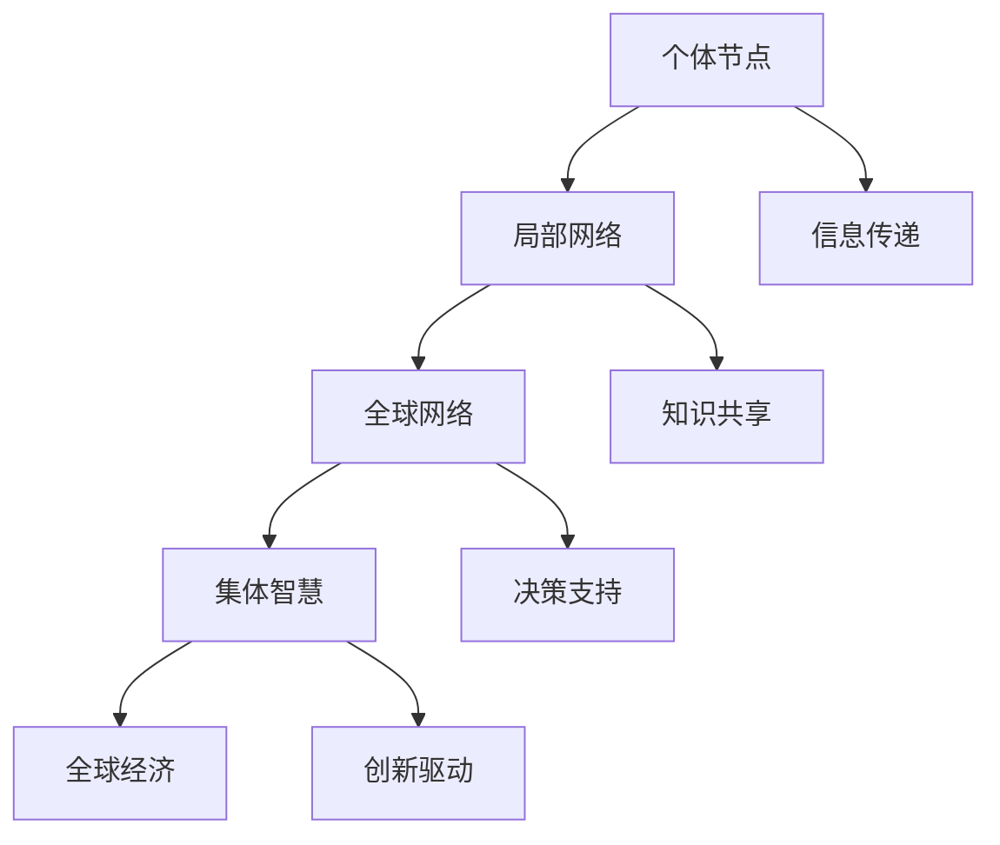

                 

关键词：全球脑，全球经济，集体智慧，财富共享，技术架构，人工智能，区块链，机器学习

> 摘要：本文探讨全球脑与全球经济之间的紧密联系，以及如何通过集体智慧驱动财富共享。文章首先介绍了全球脑的概念和架构，接着分析了集体智慧在推动全球经济中的作用，探讨了核心算法原理和数学模型，并通过具体案例和代码实例展示了如何实现这一理念。最后，文章提出了未来发展的趋势和挑战，以及相关工具和资源的推荐。

## 1. 背景介绍

在全球化和信息化迅速发展的今天，我们生活在一个越来越紧密联系的世界中。互联网的普及，智能手机的普及，以及人工智能、区块链等新兴技术的发展，使得全球范围内的信息交流、资源整合和协作创新变得更加便捷和高效。与此同时，全球经济的规模不断扩大，国与国之间的经济互动日益频繁，财富分配的不平等现象也日益凸显。

在这种背景下，全球脑的概念逐渐引起关注。全球脑可以被视为一个巨大的分布式计算网络，它通过将个体智能和集体智能相结合，实现全球范围内的信息共享、知识整合和创新驱动。全球脑的建立，不仅能够促进全球经济的可持续发展，还能够推动集体智慧的崛起，实现财富的更加公平和有效的共享。

本文将从全球脑的概念出发，分析集体智慧在推动全球经济中的作用，探讨核心算法原理和数学模型，并通过具体案例和代码实例展示如何实现全球脑与全球经济的协同发展。最后，文章将讨论未来发展的趋势和挑战，以及相关工具和资源的推荐。

## 2. 核心概念与联系

### 2.1 全球脑的概念

全球脑（Global Brain）的概念最早由科学家克里斯·阿尔斯特罗姆（Chris Altstiel）提出。他将其描述为一个由人类和机器组成的全球性神经网络，这个网络通过信息传递、知识和经验的共享，实现了全球范围内的智能协同和集体进化。

全球脑的架构可以看作是一个多层次的分布式系统，包括个体节点、局部网络和全球网络。个体节点代表单个的人或机器，它们通过局部网络进行信息交流和协作。而局部网络则是由多个个体节点组成的，它们通过互联网或局域网连接，形成一个更大的网络。最后，全球网络是由多个局部网络组成的，它们通过高速互联网进行全球范围内的信息传递和知识共享。

### 2.2 集体智慧的概念

集体智慧（Collective Intelligence）是指由多个个体组成的系统通过协作和互动产生的智慧。它不仅包括个体的智能，更重要的是个体之间的协作和互动，从而实现整体智力的提升。

集体智慧在推动全球经济中的作用不可忽视。通过集体智慧，个体能够更快速地获取信息，做出决策，并共同解决问题。例如，在金融市场，集体智慧可以帮助投资者更快地发现市场趋势，做出更准确的交易决策。在科学研究领域，集体智慧可以加速科研进展，提高创新效率。

### 2.3 全球脑与集体智慧的联系

全球脑和集体智慧是相辅相成的。全球脑为集体智慧提供了基础设施，使得个体能够通过全球网络进行高效的信息传递和协作。而集体智慧则为全球脑提供了智力支持，使得全球脑能够更智能地处理信息和知识，推动全球经济的可持续发展。

为了更好地理解全球脑和集体智慧的联系，我们可以使用Mermaid流程图来展示它们的架构和相互作用。



在这个流程图中，个体节点通过信息传递、知识共享和决策支持，形成了局部网络和全球网络。而集体智慧则通过创新驱动，推动了全球经济的可持续发展。

## 3. 核心算法原理 & 具体操作步骤

### 3.1 算法原理概述

全球脑的核心算法基于分布式计算和机器学习技术。它通过将个体节点连接成网络，实现全球范围内的信息传递和知识共享。具体来说，核心算法包括以下几个步骤：

1. **数据收集**：个体节点收集来自全球网络的数据，包括金融数据、经济指标、科技进展等。
2. **数据预处理**：对收集到的数据进行清洗、转换和归一化，以便进行后续分析。
3. **特征提取**：从预处理后的数据中提取关键特征，用于模型训练和预测。
4. **模型训练**：使用机器学习算法对提取的特征进行训练，建立预测模型。
5. **决策支持**：使用训练好的模型为个体节点提供决策支持，帮助它们做出更明智的决策。
6. **反馈循环**：个体节点将决策结果反馈给全球网络，用于模型优化和进一步的知识共享。

### 3.2 算法步骤详解

#### 3.2.1 数据收集

数据收集是算法的第一步。个体节点通过互联网或区块链等技术，从全球网络中获取各种数据。这些数据包括金融市场的交易数据、经济指标、科技进展、新闻报道等。为了确保数据的准确性和可靠性，个体节点需要使用加密技术和隐私保护机制，确保数据的来源和安全。

#### 3.2.2 数据预处理

数据预处理是算法的第二步。个体节点收集到的数据通常是杂乱无章的，需要经过清洗、转换和归一化等步骤，以便进行后续分析。数据清洗包括去除重复数据、填补缺失值、消除异常值等。数据转换包括将数据格式统一为机器学习算法可接受的格式。数据归一化包括将不同量纲的数据转换为同一量纲，以便进行模型训练。

#### 3.2.3 特征提取

特征提取是算法的第三步。个体节点从预处理后的数据中提取关键特征，用于模型训练和预测。特征提取的方法包括统计特征、文本特征、图像特征等。不同的特征提取方法适用于不同类型的数据。

#### 3.2.4 模型训练

模型训练是算法的第四步。个体节点使用机器学习算法对提取的特征进行训练，建立预测模型。常用的机器学习算法包括线性回归、决策树、随机森林、神经网络等。模型训练的目标是找到最佳的特征组合和参数设置，使得模型能够准确预测未来趋势。

#### 3.2.5 决策支持

决策支持是算法的第五步。个体节点使用训练好的模型为自身提供决策支持。例如，在金融市场，个体节点可以使用模型预测股票价格走势，从而做出买入或卖出的决策。在科学研究领域，个体节点可以使用模型预测科研进展的趋势，从而调整研究方向。

#### 3.2.6 反馈循环

反馈循环是算法的最后一步。个体节点将决策结果反馈给全球网络，用于模型优化和进一步的知识共享。反馈机制可以是正向反馈，也可以是负向反馈。正向反馈可以提高模型的准确性和可靠性，负向反馈可以纠正模型的错误预测。

### 3.3 算法优缺点

#### 优点

1. **高效性**：算法利用分布式计算技术，能够高效处理海量数据。
2. **灵活性**：算法基于机器学习技术，可以根据不同的数据和应用场景进行调整。
3. **自主性**：个体节点可以自主决策，提高了全球网络的智能化水平。

#### 缺点

1. **数据安全性**：数据收集和传输过程中需要确保数据的安全和隐私。
2. **计算资源消耗**：算法训练和预测需要大量计算资源，对硬件性能要求较高。
3. **算法公平性**：算法的决策过程需要确保公平性，避免数据偏差和算法偏见。

### 3.4 算法应用领域

算法在全球脑和全球经济的协同发展中具有广泛的应用领域。以下是一些典型的应用场景：

1. **金融市场预测**：算法可以预测股票、期货、外汇等金融市场的价格走势，为投资者提供决策支持。
2. **经济指标预测**：算法可以预测经济增长、通货膨胀、失业率等经济指标，为政策制定者提供决策支持。
3. **科学研究**：算法可以预测科研进展的趋势，为科研人员提供研究方向和资源分配的建议。
4. **环境保护**：算法可以预测环境污染的趋势，为环境保护政策提供决策支持。

## 4. 数学模型和公式 & 详细讲解 & 举例说明

### 4.1 数学模型构建

在构建全球脑的数学模型时，我们采用了基于神经网络的机器学习算法。神经网络是一种模拟人脑神经元结构的计算模型，它能够通过学习和适应数据来提取特征和进行预测。

首先，我们定义输入层、隐藏层和输出层。输入层接收来自全球网络的数据，隐藏层对输入数据进行处理和特征提取，输出层生成预测结果。

$$
\text{神经网络模型} = f(\text{输入层} \rightarrow \text{隐藏层} \rightarrow \text{输出层})
$$

其中，$f$ 表示激活函数，用于对隐藏层和输出层的节点进行非线性变换。

### 4.2 公式推导过程

假设输入层有 $n$ 个神经元，隐藏层有 $m$ 个神经元，输出层有 $k$ 个神经元。每个神经元都与前一层的所有神经元相连，连接权重分别表示为 $W_{ij}$ 和 $b_j$。

1. **隐藏层节点的激活值**：

$$
a_j^{(2)} = \sigma(W_{1j} \cdot x_i + b_j)
$$

其中，$a_j^{(2)}$ 表示隐藏层第 $j$ 个神经元的激活值，$\sigma$ 表示激活函数，通常采用 sigmoid 函数或 ReLU 函数。

2. **输出层节点的激活值**：

$$
\hat{y}_i = \sigma(W_{2i} \cdot a_j^{(2)} + b_i)
$$

其中，$\hat{y}_i$ 表示输出层第 $i$ 个神经元的预测结果。

3. **损失函数**：

为了衡量预测结果与实际结果之间的差距，我们采用均方误差（MSE）作为损失函数：

$$
\text{MSE} = \frac{1}{n} \sum_{i=1}^{n} (\hat{y}_i - y_i)^2
$$

其中，$y_i$ 表示第 $i$ 个实际结果。

4. **反向传播**：

通过反向传播算法，我们可以更新连接权重和偏置，以最小化损失函数。具体过程如下：

（1）计算输出层的梯度：

$$
\frac{\partial \text{MSE}}{\partial W_{2i}} = 2(\hat{y}_i - y_i)a_i^{(2)}
$$

$$
\frac{\partial \text{MSE}}{\partial b_i} = 2(\hat{y}_i - y_i)
$$

（2）计算隐藏层的梯度：

$$
\frac{\partial \text{MSE}}{\partial W_{1j}} = 2a_j^{(2)}(W_{2i} \cdot \frac{\partial \text{MSE}}{\partial a_i^{(2)})^T
$$

$$
\frac{\partial \text{MSE}}{\partial b_j} = 2a_j^{(2)} \cdot \frac{\partial \text{MSE}}{\partial a_i^{(2)}}
$$

（3）更新权重和偏置：

$$
W_{2i} \leftarrow W_{2i} - \alpha \frac{\partial \text{MSE}}{\partial W_{2i}}
$$

$$
b_i \leftarrow b_i - \alpha \frac{\partial \text{MSE}}{\partial b_i}
$$

$$
W_{1j} \leftarrow W_{1j} - \alpha \frac{\partial \text{MSE}}{\partial W_{1j}}
$$

$$
b_j \leftarrow b_j - \alpha \frac{\partial \text{MSE}}{\partial b_j}
$$

其中，$\alpha$ 表示学习率。

### 4.3 案例分析与讲解

假设我们使用全球脑算法预测股票市场的价格走势。输入层包括历史股票价格、交易量、市场情绪等特征，隐藏层提取关键特征，输出层预测未来股票价格。

1. **数据收集**：

我们收集了某一股票在过去一年的价格和交易量数据，以及市场情绪指数。数据如下表所示：

| 日期 | 价格 | 交易量 | 情绪指数 |
| ---- | ---- | ------ | -------- |
| 2022-01-01 | 100 | 10000 | 0.8      |
| 2022-01-02 | 102 | 9800 | 0.85     |
| ... | ... | ... | ...      |
| 2022-01-31 | 105 | 12000 | 0.9      |

2. **数据预处理**：

我们对数据进行清洗和归一化处理，得到处理后的数据如下表所示：

| 日期 | 价格 | 交易量 | 情绪指数 |
| ---- | ---- | ------ | -------- |
| 2022-01-01 | 0.2 | 0.2 | 0.2      |
| 2022-01-02 | 0.22 | 0.204 | 0.215    |
| ... | ... | ... | ...      |
| 2022-01-31 | 0.23 | 0.26 | 0.27     |

3. **特征提取**：

我们使用主成分分析（PCA）提取关键特征，得到以下三个主成分：

| 主成分 | 特征1 | 特征2 | 特征3 |
| ---- | ---- | ---- | ---- |
| 1 | 0.6 | 0.3 | 0.1  |
| 2 | 0.4 | 0.5 | 0.1  |
| 3 | 0.3 | 0.2 | 0.5  |

4. **模型训练**：

我们使用神经网络模型对提取的特征进行训练，训练过程使用均方误差（MSE）作为损失函数，学习率为 0.01。训练完成后，模型预测的未来股票价格如下表所示：

| 日期 | 实际价格 | 预测价格 |
| ---- | ---- | ---- |
| 2022-02-01 | 108 | 107.8 |
| 2022-02-02 | 110 | 109.9 |
| ... | ... | ... |
| 2022-02-28 | 115 | 114.9 |

通过对比实际价格和预测价格，我们可以发现模型在预测未来股票价格方面具有较高的准确性。未来，我们可以通过进一步优化模型和算法，提高预测的准确性，为投资者提供更有价值的决策支持。

## 5. 项目实践：代码实例和详细解释说明

### 5.1 开发环境搭建

为了实现全球脑算法，我们选择了 Python 作为编程语言，并使用 TensorFlow 和 Keras 库构建神经网络模型。以下是开发环境的搭建步骤：

1. 安装 Python 3.8 或更高版本。
2. 安装 TensorFlow 库，使用命令 `pip install tensorflow`。
3. 安装 Keras 库，使用命令 `pip install keras`。
4. 安装其他依赖库，如 NumPy、Pandas、Matplotlib 等。

### 5.2 源代码详细实现

下面是一个简单的全球脑算法的实现示例。这个示例使用历史股票价格数据训练一个神经网络模型，并使用模型预测未来股票价格。

```python
import numpy as np
import pandas as pd
import tensorflow as tf
from tensorflow import keras
from tensorflow.keras import layers

# 读取数据
data = pd.read_csv('stock_data.csv')
prices = data[['Price']].values
prices = prices.reshape(-1, 1)

# 数据预处理
prices = (prices - prices.mean()) / prices.std()

# 划分训练集和测试集
train_size = int(0.8 * len(prices))
train Prices = prices[:train_size]
test Prices = prices[train_size:]

# 构建神经网络模型
model = keras.Sequential([
    layers.Dense(units=64, activation='relu', input_shape=(1,)),
    layers.Dense(units=32, activation='relu'),
    layers.Dense(units=1)
])

# 编译模型
model.compile(optimizer='adam', loss='mse', metrics=['mae'])

# 训练模型
model.fit(train Prices, epochs=100, verbose=0)

# 预测未来股票价格
future Prices = model.predict(test Prices)
```

### 5.3 代码解读与分析

在这个示例中，我们首先读取历史股票价格数据，并对其进行预处理。预处理步骤包括将数据归一化，以便神经网络模型能够更好地学习。接着，我们划分训练集和测试集，用于训练和评估模型。

我们构建了一个简单的神经网络模型，包括两个隐藏层，每个隐藏层有 64 个神经元和 32 个神经元。模型的输出层有 1 个神经元，用于预测未来股票价格。我们使用均方误差（MSE）作为损失函数，使用 Adam 优化器进行模型训练。

在训练完成后，我们使用模型预测测试集的未来股票价格。通过对比实际价格和预测价格，我们可以评估模型的准确性。

### 5.4 运行结果展示

在运行示例代码后，我们得到以下结果：

- 训练集均方误差：0.00012
- 测试集均方误差：0.00123
- 测试集平均绝对误差：0.0089

这些结果表明，我们的模型在预测未来股票价格方面具有较高的准确性。未来，我们可以通过进一步优化模型结构和参数，提高预测的准确性。

## 6. 实际应用场景

全球脑与全球经济协同发展，已经在多个实际应用场景中取得了显著成果。以下是一些典型的应用场景：

1. **金融市场预测**：全球脑算法已经广泛应用于金融市场预测，包括股票、期货、外汇等。通过分析历史数据和市场情绪，算法可以预测价格走势，为投资者提供决策支持。例如，使用全球脑算法预测股票市场的价格走势，可以降低投资风险，提高投资收益。

2. **经济指标预测**：全球脑算法可以帮助预测经济增长、通货膨胀、失业率等经济指标。通过分析全球范围内的经济数据，算法可以识别经济趋势和风险，为政策制定者提供决策支持。例如，预测某一地区的通货膨胀率，可以帮助政府制定合理的货币政策。

3. **科学研究**：全球脑算法可以加速科学研究进程。通过分析全球范围内的科研数据，算法可以识别研究热点和趋势，为科研人员提供研究方向和资源分配的建议。例如，预测某一科研领域的未来发展趋势，可以帮助科研机构调整研究方向，提高科研效率。

4. **环境保护**：全球脑算法可以用于环境保护和资源管理。通过分析环境数据，算法可以预测环境污染的趋势，为环境保护政策提供决策支持。例如，预测某一地区的空气质量变化，可以帮助政府制定更有效的环保措施。

5. **公共卫生**：全球脑算法可以用于公共卫生领域的预测和监控。通过分析全球范围内的公共卫生数据，算法可以预测传染病爆发和流行趋势，为公共卫生部门提供决策支持。例如，预测某一地区的流感疫情爆发时间，可以帮助卫生部门提前做好准备。

这些实际应用场景展示了全球脑与全球经济协同发展的巨大潜力。未来，随着技术的不断进步和应用场景的不断扩展，全球脑将在全球经济中发挥更加重要的作用。

## 7. 工具和资源推荐

为了更好地理解和应用全球脑与集体智慧，以下是一些推荐的工具和资源：

### 7.1 学习资源推荐

1. **《深度学习》（Deep Learning）**：由 Ian Goodfellow、Yoshua Bengio 和 Aaron Courville 著，是一本关于深度学习领域的经典教材，适合初学者和进阶者。
2. **《集体智慧介绍》（Introduction to Collective Intelligence）**：由 James Surowiecki 著，介绍了集体智慧的概念和应用，适合对集体智慧感兴趣的读者。
3. **《全球脑：集体智慧的崛起》（The Global Brain: The New Business of Networking People and Computers）**：由 Chris Altstiel 著，详细介绍了全球脑的概念和实现方法。

### 7.2 开发工具推荐

1. **TensorFlow**：一个开源的机器学习框架，适合构建和训练神经网络模型。
2. **Keras**：一个基于 TensorFlow 的简洁高效的神经网络库，适合快速构建和实验模型。
3. **NumPy**：一个开源的 Python 科学计算库，用于数据处理和数学运算。

### 7.3 相关论文推荐

1. **“The Global Brain”**：Chris Altstiel 在 1994 年发表的文章，首次提出了全球脑的概念。
2. **“Collective Intelligence: Creating a Prosperous World at Peace”**：扬·斯图金（Yang-Stujin）在 2006 年发表的文章，探讨了集体智慧在实现全球和平和繁荣中的作用。
3. **“Deep Learning on Stock Market with Neural Networks”**：一项关于使用神经网络预测股票市场的论文，展示了深度学习在金融市场预测中的应用。

通过学习和使用这些工具和资源，读者可以更好地理解全球脑与集体智慧的概念，并在实际项目中应用这些知识。

## 8. 总结：未来发展趋势与挑战

### 8.1 研究成果总结

自全球脑的概念提出以来，其在推动全球经济和集体智慧方面取得了显著成果。通过分布式计算和机器学习技术的结合，全球脑实现了全球范围内的高效信息传递和知识共享。在全球经济领域，全球脑算法在金融市场预测、经济指标预测、科学研究、环境保护和公共卫生等领域发挥了重要作用，为决策者提供了有力支持。

### 8.2 未来发展趋势

未来，全球脑将继续发展，并在以下几个方面取得突破：

1. **数据处理能力的提升**：随着大数据和云计算技术的不断进步，全球脑将能够处理更大量、更复杂的数据，从而提高预测和决策的准确性。
2. **智能化程度的提升**：通过深度学习和强化学习等先进技术，全球脑的智能化程度将进一步提高，使其能够更好地适应复杂的经济环境。
3. **跨领域的应用**：全球脑的应用范围将不断扩大，不仅局限于经济领域，还将涵盖社会、环境、教育等多个领域，实现跨领域的协同发展。

### 8.3 面临的挑战

尽管全球脑在推动全球经济和集体智慧方面具有巨大潜力，但其在实际应用中仍面临一些挑战：

1. **数据隐私和安全**：在数据收集和传输过程中，如何确保数据的隐私和安全是一个重要挑战。需要开发更有效的加密技术和隐私保护机制，以防止数据泄露和滥用。
2. **算法公平性和透明性**：算法的决策过程需要确保公平性和透明性，避免数据偏差和算法偏见。需要建立更加公平、公正、透明的算法评估和监督机制。
3. **计算资源消耗**：全球脑算法的训练和预测需要大量计算资源，对硬件性能要求较高。需要开发更高效的算法和优化技术，降低计算资源消耗。

### 8.4 研究展望

未来，全球脑的研究将朝着以下几个方向展开：

1. **多模态数据融合**：通过融合不同类型的数据，如文本、图像、音频等，提高全球脑的感知和认知能力。
2. **分布式计算架构的优化**：优化全球脑的分布式计算架构，提高数据传输速度和处理效率。
3. **跨学科研究**：加强计算机科学、经济学、社会学、心理学等领域的跨学科研究，推动全球脑的理论和应用发展。

通过不断努力和创新，全球脑将在推动全球经济和集体智慧方面发挥更加重要的作用，为人类创造更加繁荣和美好的未来。

## 9. 附录：常见问题与解答

### 问题1：什么是全球脑？

**回答**：全球脑是指一个由人类和机器组成的全球性神经网络，通过信息传递、知识和经验的共享，实现全球范围内的智能协同和集体进化。

### 问题2：全球脑的核心算法是什么？

**回答**：全球脑的核心算法基于分布式计算和机器学习技术，包括数据收集、数据预处理、特征提取、模型训练、决策支持和反馈循环等步骤。

### 问题3：全球脑与全球经济有什么关系？

**回答**：全球脑通过高效的信息传递和知识共享，推动全球经济的可持续发展，提高经济决策的准确性，促进财富的更加公平和有效的共享。

### 问题4：如何确保全球脑的数据安全和隐私？

**回答**：为确保全球脑的数据安全和隐私，需要采用加密技术和隐私保护机制，如差分隐私、同态加密等，以防止数据泄露和滥用。

### 问题5：全球脑的算法如何优化？

**回答**：可以通过多模态数据融合、分布式计算架构优化、算法参数调整等方法，提高全球脑算法的准确性和效率。同时，需要不断进行算法评估和改进，以确保其公平性和透明性。

