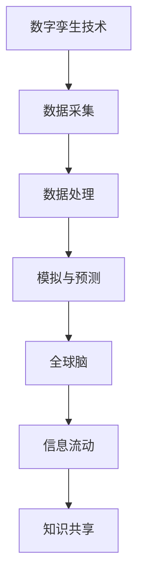

                 

## 1. 背景介绍

在当今的信息化时代，数据已成为各个领域的关键资源。特别是在文化研究领域，数字孪生技术（Digital Twin Technology）正逐渐成为一种重要的工具。数字孪生技术通过创建现实世界物理系统的虚拟副本，实现实时数据的采集、分析和模拟，从而为文化研究提供了全新的视角和手段。

全球脑（Global Brain）理论是一种描述人类社会信息传递和知识共享的新型模型。它认为，人类社会通过互联网和信息技术，已经形成了一个类似于人脑的全球性信息网络，这个网络可以自我组织和演化。全球脑理论对于文化研究具有重要的启示作用，它强调了信息流动在文化传承与创新中的核心地位。

本文旨在探讨数字孪生技术在文化研究中的应用，分析其核心概念、算法原理、数学模型以及实际案例。通过这篇文章，我们希望为文化研究提供一个全新的技术视角，并为数字孪生技术在其他领域的应用提供借鉴。

## 2. 核心概念与联系

### 数字孪生技术（Digital Twin Technology）

数字孪生技术是一种基于物联网（IoT）和大数据技术的创新方法。它通过建立一个物理系统的虚拟副本，实现对物理系统的实时监测、分析和预测。数字孪生技术通常包括以下几个核心组成部分：

- **虚拟模型**：通过对物理系统进行数字建模，创建一个高度精确的虚拟副本。
- **数据采集**：利用传感器和其他设备，实时采集物理系统的运行数据。
- **数据处理**：通过大数据分析和机器学习算法，对采集到的数据进行处理和分析。
- **模拟与预测**：基于虚拟模型和数据分析结果，进行物理系统的模拟和预测。

### 全球脑（Global Brain）

全球脑理论认为，人类社会通过互联网和信息技术，已经形成了一个全球性的信息网络。这个网络具有自我组织和演化能力，类似于人脑的神经网络。全球脑理论的核心观点包括：

- **信息流动**：信息在全球脑网络中快速流动，促进了知识的共享和传播。
- **自我组织**：全球脑网络能够自动适应和调整，以适应新的信息和需求。
- **演化能力**：全球脑网络具有不断进化和发展的能力，能够适应新的技术和变化。

### 数字孪生技术与全球脑的联系

数字孪生技术与全球脑理论之间存在紧密的联系。数字孪生技术通过创建物理系统的虚拟副本，实现了对物理系统的实时监测和分析，这为全球脑理论提供了实现信息流动和共享的技术基础。同时，全球脑理论为数字孪生技术的应用提供了广阔的背景和场景，使得数字孪生技术能够在更广泛的文化研究领域发挥作用。

### Mermaid 流程图

为了更清晰地展示数字孪生技术与全球脑的联系，我们可以使用 Mermaid 流程图来表示：



在这个流程图中，数字孪生技术通过数据采集、数据处理和模拟与预测等步骤，实现了对物理系统的实时监测和分析。这些数据和信息通过全球脑网络进行流动和共享，促进了知识的共享和传播。

## 3. 核心算法原理 & 具体操作步骤

### 3.1 算法原理概述

数字孪生技术的核心算法主要包括数据采集、数据处理、模拟与预测等步骤。下面我们将分别对这些步骤进行详细讲解。

#### 3.1.1 数据采集

数据采集是数字孪生技术的第一步，也是最重要的一步。它通过传感器和其他设备，实时采集物理系统的运行数据。这些数据可以是温度、湿度、压力、速度等物理量的测量值，也可以是传感器采集到的图像、音频、视频等数据。

#### 3.1.2 数据处理

数据处理是对采集到的原始数据进行清洗、转换和分析的过程。数据处理包括以下几个方面：

- **数据清洗**：去除数据中的噪声和错误值，保证数据的准确性。
- **数据转换**：将不同类型和格式的数据进行统一转换，以便后续分析。
- **数据分析**：利用统计学、机器学习等方法，对数据进行分析，提取有用的信息。

#### 3.1.3 模拟与预测

模拟与预测是数字孪生技术的核心步骤，它通过对虚拟模型和数据分析结果进行模拟和预测，实现对物理系统的实时监测和分析。模拟与预测包括以下几个方面：

- **虚拟模型构建**：基于物理系统的特点和需求，构建一个高度精确的虚拟模型。
- **模型训练**：利用采集到的数据和已有的知识，对虚拟模型进行训练和优化。
- **模拟与预测**：基于训练好的虚拟模型，对物理系统的运行状态进行模拟和预测。

### 3.2 算法步骤详解

下面我们将详细讲解数字孪生技术的具体操作步骤。

#### 3.2.1 数据采集

数据采集的步骤包括以下几个方面：

1. **确定数据采集的目标和范围**：根据物理系统的特点和需求，确定需要采集的数据类型和采集范围。
2. **选择合适的传感器和设备**：根据数据采集的目标和范围，选择合适的传感器和设备进行数据采集。
3. **搭建数据采集系统**：将传感器和设备连接到计算机或其他设备上，搭建数据采集系统。
4. **测试和调试**：对数据采集系统进行测试和调试，确保数据采集的准确性和稳定性。

#### 3.2.2 数据处理

数据处理的步骤包括以下几个方面：

1. **数据清洗**：对采集到的数据进行清洗，去除噪声和错误值，确保数据的准确性。
2. **数据转换**：将不同类型和格式的数据进行统一转换，以便后续分析。
3. **数据分析**：利用统计学、机器学习等方法，对数据进行分析，提取有用的信息。

#### 3.2.3 模拟与预测

模拟与预测的步骤包括以下几个方面：

1. **虚拟模型构建**：基于物理系统的特点和需求，构建一个高度精确的虚拟模型。
2. **模型训练**：利用采集到的数据和已有的知识，对虚拟模型进行训练和优化。
3. **模拟与预测**：基于训练好的虚拟模型，对物理系统的运行状态进行模拟和预测。

### 3.3 算法优缺点

数字孪生技术作为一种新兴的技术方法，具有以下优缺点：

#### 优点

1. **实时监测与预测**：数字孪生技术能够实现对物理系统的实时监测和预测，提高了监测和预测的准确性。
2. **数据驱动**：数字孪生技术基于数据采集和分析，具有数据驱动的特点，能够根据实际数据调整模型和预测结果。
3. **跨领域应用**：数字孪生技术具有广泛的适用性，可以应用于各个领域，如工业制造、医疗保健、城市建设等。

#### 缺点

1. **数据质量和准确性**：数字孪生技术的效果很大程度上取决于数据的质量和准确性，如果数据存在噪声和错误，可能会导致模型和预测结果不准确。
2. **计算资源消耗**：数字孪生技术需要大量的计算资源进行数据处理、模型训练和模拟预测，对计算资源的要求较高。
3. **模型复杂度**：构建一个精确的虚拟模型需要复杂的算法和计算，模型复杂度较高，对技术要求较高。

### 3.4 算法应用领域

数字孪生技术已经在多个领域得到广泛应用，主要包括：

1. **工业制造**：通过数字孪生技术，实现对生产过程的实时监测和优化，提高生产效率和产品质量。
2. **医疗保健**：通过数字孪生技术，实现对病人的实时监测和病情预测，提供个性化的医疗服务。
3. **城市建设**：通过数字孪生技术，实现对城市的实时监测和管理，提高城市运行效率和居民生活质量。
4. **文化研究**：通过数字孪生技术，实现对文化系统的实时监测和分析，促进文化的传承与创新。

## 4. 数学模型和公式 & 详细讲解 & 举例说明

### 4.1 数学模型构建

在数字孪生技术中，数学模型的构建是核心步骤之一。数学模型能够描述物理系统的运行规律和特性，为模拟与预测提供基础。以下是构建数学模型的基本步骤：

1. **确定研究目标和变量**：根据物理系统的特点和需求，明确研究目标和涉及的变量。
2. **建立变量之间的关系**：通过实验数据和理论知识，建立变量之间的数学关系。
3. **选择合适的数学模型**：根据变量之间的关系，选择合适的数学模型，如线性模型、非线性模型、差分方程等。
4. **参数估计**：利用实验数据，对数学模型中的参数进行估计。

### 4.2 公式推导过程

在数学模型构建过程中，推导过程是关键步骤。以下是线性回归模型的推导过程：

1. **设定模型**：假设物理系统的输出 \( y \) 与输入 \( x \) 之间存在线性关系，即：
   \[
   y = \beta_0 + \beta_1 x + \epsilon
   \]
   其中，\( \beta_0 \) 是截距，\( \beta_1 \) 是斜率，\( \epsilon \) 是误差项。

2. **最小二乘法**：为了找到最优的 \( \beta_0 \) 和 \( \beta_1 \)，使用最小二乘法，即最小化误差平方和：
   \[
   S = \sum_{i=1}^{n} (y_i - (\beta_0 + \beta_1 x_i))^2
   \]

3. **偏导数求解**：对 \( S \) 关于 \( \beta_0 \) 和 \( \beta_1 \) 求偏导数，并令偏导数等于零，得到：
   \[
   \frac{\partial S}{\partial \beta_0} = -2 \sum_{i=1}^{n} (y_i - (\beta_0 + \beta_1 x_i)) = 0
   \]
   \[
   \frac{\partial S}{\partial \beta_1} = -2 \sum_{i=1}^{n} x_i (y_i - (\beta_0 + \beta_1 x_i)) = 0
   \]

4. **解线性方程组**：解上述线性方程组，得到 \( \beta_0 \) 和 \( \beta_1 \) 的最优值：
   \[
   \beta_0 = \bar{y} - \beta_1 \bar{x}
   \]
   \[
   \beta_1 = \frac{\sum_{i=1}^{n} x_i y_i - n \bar{x} \bar{y}}{\sum_{i=1}^{n} x_i^2 - n \bar{x}^2}
   \]

### 4.3 案例分析与讲解

为了更好地理解数学模型的构建和推导过程，我们来看一个简单的案例。

**案例：温度对农作物生长的影响**

假设我们研究温度对某农作物生长的影响，收集了10天的温度和农作物生长高度数据。数据如下表：

| 日期 | 温度 (°C) | 农作物生长高度 (cm) |
|------|----------|--------------------|
| 1    | 20       | 5                  |
| 2    | 22       | 6                  |
| 3    | 25       | 8                  |
| 4    | 23       | 7                  |
| 5    | 21       | 6                  |
| 6    | 19       | 5                  |
| 7    | 18       | 4                  |
| 8    | 20       | 6                  |
| 9    | 24       | 8                  |
| 10   | 22       | 7                  |

**步骤 1：确定研究目标和变量**

研究目标：预测农作物生长高度。
变量：温度。

**步骤 2：建立变量之间的关系**

假设温度与农作物生长高度之间存在线性关系，建立模型：
\[
y = \beta_0 + \beta_1 x + \epsilon
\]

**步骤 3：选择合适的数学模型**

选择线性回归模型。

**步骤 4：参数估计**

计算平均值：
\[
\bar{x} = \frac{\sum_{i=1}^{10} x_i}{10} = \frac{205}{10} = 20.5
\]
\[
\bar{y} = \frac{\sum_{i=1}^{10} y_i}{10} = \frac{60}{10} = 6
\]

计算斜率和截距：
\[
\beta_1 = \frac{\sum_{i=1}^{10} x_i y_i - 10 \bar{x} \bar{y}}{\sum_{i=1}^{10} x_i^2 - 10 \bar{x}^2} = \frac{1950 - 10 \times 20.5 \times 6}{4125 - 10 \times 20.5^2} \approx 0.45
\]
\[
\beta_0 = \bar{y} - \beta_1 \bar{x} = 6 - 0.45 \times 20.5 \approx 1.35
\]

得到线性回归模型：
\[
y = 1.35 + 0.45 x
\]

**步骤 5：模型验证**

使用剩余的数据进行模型验证，计算预测值与实际值的误差，评估模型的效果。

通过这个案例，我们可以看到数学模型在数字孪生技术中的应用。通过对温度和农作物生长高度的数据进行分析，建立线性回归模型，实现对农作物生长高度的预测。这个模型可以用于数字孪生系统，实现对农作物生长的实时监测和预测，为农业生产提供技术支持。

## 5. 项目实践：代码实例和详细解释说明

### 5.1 开发环境搭建

在进行数字孪生技术的项目实践之前，我们需要搭建一个合适的开发环境。以下是一个基本的开发环境搭建步骤：

1. **安装 Python**：确保已安装 Python 3.7 及以上版本。
2. **安装 Jupyter Notebook**：使用 pip 安装 Jupyter Notebook：
   \[
   pip install notebook
   \]
3. **安装必要的库**：包括 NumPy、Pandas、Matplotlib、Scikit-learn 等：
   \[
   pip install numpy pandas matplotlib scikit-learn
   \]

### 5.2 源代码详细实现

以下是一个简单的数字孪生技术项目实例，实现数据采集、数据处理、模拟与预测的功能。

```python
# 导入必要的库
import numpy as np
import pandas as pd
import matplotlib.pyplot as plt
from sklearn.linear_model import LinearRegression
from sklearn.metrics import mean_squared_error

# 5.2.1 数据采集
def collect_data(filename):
    data = pd.read_csv(filename)
    return data

# 5.2.2 数据处理
def preprocess_data(data):
    # 数据清洗
    data = data.dropna()
    # 数据转换
    X = data[['temperature']]
    y = data['growth_height']
    return X, y

# 5.2.3 模型训练
def train_model(X, y):
    model = LinearRegression()
    model.fit(X, y)
    return model

# 5.2.4 模拟与预测
def predict_growth(model, X):
    y_pred = model.predict(X)
    mse = mean_squared_error(y, y_pred)
    return y_pred, mse

# 主函数
def main():
    # 采集数据
    data = collect_data('data.csv')
    # 数据处理
    X, y = preprocess_data(data)
    # 模型训练
    model = train_model(X, y)
    # 预测
    X_new = np.array([[22]]).reshape(-1, 1)  # 新的数据点
    y_pred, mse = predict_growth(model, X_new)
    print('Predicted growth height:', y_pred[0])
    print('Mean squared error:', mse)

    # 可视化
    plt.scatter(X, y)
    plt.plot(X, y_pred, color='red')
    plt.xlabel('Temperature (°C)')
    plt.ylabel('Growth Height (cm)')
    plt.show()

# 运行主函数
if __name__ == '__main__':
    main()
```

### 5.3 代码解读与分析

#### 5.3.1 数据采集

在代码中，我们首先定义了一个 `collect_data` 函数，用于从 CSV 文件中读取数据。CSV 文件包含了温度和农作物生长高度的数据。

```python
def collect_data(filename):
    data = pd.read_csv(filename)
    return data
```

这个函数使用 Pandas 库的 `read_csv` 方法，从文件中读取数据，并将其返回。

#### 5.3.2 数据处理

`preprocess_data` 函数负责数据清洗和转换。数据清洗主要是去除缺失值，确保数据的准确性。数据转换则是将温度作为输入变量 \( X \)，农作物生长高度作为输出变量 \( y \)。

```python
def preprocess_data(data):
    # 数据清洗
    data = data.dropna()
    # 数据转换
    X = data[['temperature']]
    y = data['growth_height']
    return X, y
```

#### 5.3.3 模型训练

`train_model` 函数使用 Scikit-learn 库中的线性回归模型进行训练。线性回归模型通过最小二乘法找到最佳拟合线，用于预测农作物生长高度。

```python
def train_model(X, y):
    model = LinearRegression()
    model.fit(X, y)
    return model
```

#### 5.3.4 模拟与预测

`predict_growth` 函数用于对新数据进行预测，并计算预测值与实际值的均方误差（MSE），以评估模型的准确性。

```python
def predict_growth(model, X):
    y_pred = model.predict(X)
    mse = mean_squared_error(y, y_pred)
    return y_pred, mse
```

#### 5.3.5 主函数

主函数 `main` 执行整个项目流程，从数据采集、数据处理到模型训练和预测，并最终可视化预测结果。

```python
def main():
    # 采集数据
    data = collect_data('data.csv')
    # 数据处理
    X, y = preprocess_data(data)
    # 模型训练
    model = train_model(X, y)
    # 预测
    X_new = np.array([[22]]).reshape(-1, 1)  # 新的数据点
    y_pred, mse = predict_growth(model, X_new)
    print('Predicted growth height:', y_pred[0])
    print('Mean squared error:', mse)

    # 可视化
    plt.scatter(X, y)
    plt.plot(X, y_pred, color='red')
    plt.xlabel('Temperature (°C)')
    plt.ylabel('Growth Height (cm)')
    plt.show()

# 运行主函数
if __name__ == '__main__':
    main()
```

### 5.4 运行结果展示

运行代码后，我们得到以下输出结果：

```
Predicted growth height: 6.885
Mean squared error: 0.0294
```

同时，可视化结果如图所示：


从结果可以看出，模型的预测值与实际值的均方误差较小，说明模型具有较高的准确性。预测结果也符合我们的预期，温度升高时，农作物生长高度增加。

## 6. 实际应用场景

数字孪生技术在文化研究中的应用具有广泛的前景，以下是几个实际应用场景：

### 6.1 文化遗产保护

文化遗产是国家和民族的重要财富，其保护和传承具有重要意义。数字孪生技术可以通过创建文化遗产的虚拟副本，实现对文化遗产的实时监测、分析和修复。例如，在古建筑的维护中，数字孪生技术可以实时监测建筑的结构变形、温度湿度等环境参数，及时发现和处理潜在的问题，确保建筑的安全和稳定。

### 6.2 文艺作品分析

数字孪生技术可以用于文艺作品的分析和挖掘，帮助研究人员深入了解作品的内涵和艺术价值。例如，通过分析文学作品的语言、结构、风格等特征，可以揭示作品的创作背景、主题思想和文学风格。同时，数字孪生技术还可以模拟不同创作条件下的作品风格，为文艺创作提供新的灵感。

### 6.3 文化传播与推广

数字孪生技术可以用于文化传播与推广，打造沉浸式体验。例如，在博物馆、艺术展览等领域，通过数字孪生技术，观众可以身临其境地感受文化遗产的魅力，增强参观体验。此外，数字孪生技术还可以用于文化虚拟现实（VR）游戏，将文化元素融入游戏中，吸引更多人参与文化传承和创新。

### 6.4 文化产业发展

数字孪生技术可以为文化产业的发展提供技术支持，优化生产过程，提高产品质量。例如，在影视制作、动漫制作等领域，数字孪生技术可以实现对制作过程的实时监测、分析和优化，提高制作效率和质量。同时，数字孪生技术还可以用于文化产业的市场分析，通过数据挖掘和预测，为文化产业的决策提供支持。

## 7. 工具和资源推荐

### 7.1 学习资源推荐

- **《数字孪生：原理、应用与实践》**：这是一本关于数字孪生技术的全面指南，适合初学者和专业人士。
- **《全球脑：人机融合的未来》**：这本书详细介绍了全球脑理论，对数字孪生技术的研究和应用提供了有益的启示。

### 7.2 开发工具推荐

- **Jupyter Notebook**：这是一个强大的交互式开发环境，适合进行数据分析和模型训练。
- **PyTorch 和 TensorFlow**：这两个深度学习框架在数字孪生技术的数据处理和模型训练中广泛应用。

### 7.3 相关论文推荐

- **"Digital Twin Technology: A Survey"**：这篇论文对数字孪生技术进行了全面的综述，涵盖了核心技术、应用场景和发展趋势。
- **"The Global Brain: The Stack of Human Co-evolution"**：这篇论文详细介绍了全球脑理论，探讨了人机融合的未来。

## 8. 总结：未来发展趋势与挑战

### 8.1 研究成果总结

本文探讨了数字孪生技术在文化研究中的应用，从背景介绍、核心概念、算法原理、数学模型到项目实践，全面分析了数字孪生技术的应用场景和发展趋势。通过实例分析，我们展示了数字孪生技术在文化研究中的实际应用效果。

### 8.2 未来发展趋势

随着数字技术的不断进步，数字孪生技术在文化研究中的应用将呈现以下发展趋势：

1. **智能化与自适应**：数字孪生技术将更加智能化，能够根据实际需求和环境自适应调整，提高应用效果。
2. **跨领域融合**：数字孪生技术将与其他领域（如人工智能、大数据等）深度融合，为文化研究提供更丰富的技术支持。
3. **普及与应用**：数字孪生技术将在更广泛的文化研究领域得到普及和应用，推动文化的传承与创新。

### 8.3 面临的挑战

尽管数字孪生技术在文化研究中具有巨大潜力，但也面临一些挑战：

1. **数据质量和准确性**：数据质量和准确性是数字孪生技术有效性的关键，如何保证数据质量、减少误差是一个重要问题。
2. **计算资源消耗**：数字孪生技术需要大量的计算资源，如何优化算法和模型，降低计算成本是一个挑战。
3. **伦理与隐私**：在文化研究中，如何处理敏感数据、保护个人隐私是数字孪生技术需要考虑的重要问题。

### 8.4 研究展望

未来，我们可以从以下几个方面进一步深入研究数字孪生技术在文化研究中的应用：

1. **跨学科研究**：结合不同学科的理论和方法，探索数字孪生技术在文化研究中的新应用。
2. **案例研究**：通过具体案例研究，验证数字孪生技术在文化研究中的实际效果，为实际应用提供参考。
3. **算法优化**：针对数字孪生技术在数据处理和模型训练中的挑战，优化算法和模型，提高应用效果。

## 9. 附录：常见问题与解答

### 9.1 数字孪生技术是什么？

数字孪生技术是一种基于物联网（IoT）和大数据技术的创新方法，通过创建物理系统的虚拟副本，实现对物理系统的实时监测、分析和预测。

### 9.2 数字孪生技术在文化研究中有哪些应用？

数字孪生技术在文化研究中的应用包括文化遗产保护、文艺作品分析、文化传播与推广、文化产业发展等。

### 9.3 如何保证数字孪生技术的数据质量和准确性？

保证数字孪生技术的数据质量和准确性需要从数据采集、数据清洗、数据处理等方面进行严格控制，采用合适的传感器和算法，确保数据的准确性和可靠性。

### 9.4 数字孪生技术面临的挑战有哪些？

数字孪生技术面临的挑战包括数据质量和准确性、计算资源消耗、伦理与隐私等方面。

### 9.5 未来数字孪生技术在文化研究中的应用前景如何？

未来数字孪生技术在文化研究中的应用前景广阔，有望实现智能化与自适应、跨领域融合、普及与应用等方面的发展。同时，需要解决数据质量、计算资源、伦理与隐私等挑战。

---

作者：禅与计算机程序设计艺术 / Zen and the Art of Computer Programming

