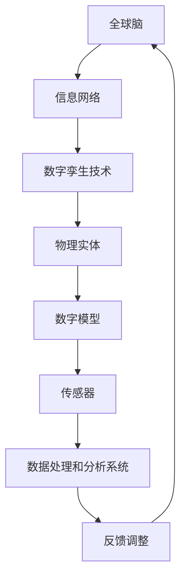

                 

关键词：全球脑、数字孪生技术、文化研究、人工智能、应用前景

## 摘要

本文探讨了全球脑与数字孪生技术在全球范围内的文化研究中的应用。通过阐述全球脑的概念及其在文化研究中的作用，结合数字孪生技术的原理，分析了两者的结合如何为文化研究带来新的方法和视野。文章首先介绍了全球脑的定义、构成和功能，随后详细描述了数字孪生技术的基本原理和应用。在此基础上，本文探讨了全球脑与数字孪生技术在文化研究中的实际应用案例，并对其应用前景进行了展望。

## 1. 背景介绍

### 全球脑的概念

全球脑（Global Brain）的概念最早由许静仁（K. Eric Drexler）在1986年提出，后被Stewart Brand等学者进一步发展。全球脑是一个比喻，指的是由人类、动物、机器和计算机程序等构成的复杂网络，这个网络通过信息交换和协作实现了某种程度的意识和智能。

全球脑的概念具有以下几个特点：

- **自组织性**：全球脑中的个体（无论是人类还是机器）可以通过信息交流实现自我组织和协作，形成复杂的生态系统。
- **智能分散性**：全球脑的智能并非集中在一个特定的实体中，而是分散在整个网络中，每个节点都具有一定的智能。
- **开放性**：全球脑是一个开放的系统，它不断从外部环境吸收信息和能量，并通过信息交换实现进化。

### 数字孪生技术的原理

数字孪生技术（Digital Twin Technology）是一种将物理实体与其数字镜像相结合的技术，通过模拟和监控物理实体的行为，实现对其实时状态的感知和预测。数字孪生技术的基本原理包括以下几个步骤：

- **建模**：建立物理实体的数字模型，包括几何形状、物理特性、行为模式等。
- **连接**：将数字模型与物理实体连接，通过传感器和通信系统实时收集物理实体的数据。
- **同步**：将实时数据同步到数字模型中，更新模型的状态。
- **分析**：对同步后的数据进行处理和分析，以实现对物理实体的监控、预测和优化。

### 全球脑与数字孪生技术在文化研究中的重要性

随着全球化和数字化的不断推进，文化研究的对象和范围也在不断扩大。全球脑和数字孪生技术的引入，为文化研究提供了新的视角和方法。通过全球脑，研究者可以跨越地域和文化的限制，构建全球范围内的文化网络，深入探讨文化现象的共性和差异。而数字孪生技术则提供了对文化现象的实时监控和预测能力，使得文化研究更加精确和高效。

## 2. 核心概念与联系

### 全球脑的构成与功能

全球脑的构成主要包括以下几个部分：

- **个体节点**：包括人类、动物、机器和计算机程序等，它们是全球脑的基本组成单位。
- **信息网络**：个体节点之间的通信和协作网络，通过互联网、社交媒体、物联网等实现。
- **知识库**：全球脑中的知识和信息存储，包括历史数据、文化传统、科学知识等。

全球脑的功能主要体现在以下几个方面：

- **知识共享**：全球脑中的个体可以通过信息网络分享知识和信息，实现知识的大规模传播和积累。
- **智能协作**：全球脑中的个体可以协作完成复杂的任务，实现智能的分布式处理。
- **文化创新**：全球脑为文化创新提供了广阔的平台，不同文化之间的碰撞和融合可以产生新的文化现象。

### 数字孪生技术的架构与流程

数字孪生技术的架构通常包括以下几个部分：

- **物理实体**：需要建模的物理对象，可以是建筑物、机器、设备等。
- **数字模型**：物理实体的数字表示，包括几何模型、物理特性模型、行为模型等。
- **传感器**：用于实时收集物理实体数据的设备，可以是温度传感器、压力传感器、摄像头等。
- **通信系统**：将传感器数据传输到数字模型的系统，可以通过有线或无线网络实现。
- **数据处理和分析系统**：对传感器数据进行处理和分析的系统，可以用于监控、预测和优化。

数字孪生技术的流程主要包括以下几个步骤：

1. **建模**：建立物理实体的数字模型。
2. **连接**：将数字模型与物理实体连接，通过传感器收集数据。
3. **同步**：将实时数据同步到数字模型中。
4. **分析**：对同步后的数据进行处理和分析。
5. **反馈**：根据分析结果对物理实体进行调整和优化。

### 全球脑与数字孪生技术的联系

全球脑与数字孪生技术的联系主要体现在以下几个方面：

- **信息共享**：全球脑的信息网络为数字孪生技术提供了广阔的信息来源，数字孪生技术则可以将收集到的数据共享到全球脑中。
- **智能协作**：全球脑的智能协作能力可以用于优化数字孪生技术的流程，提高数据处理和分析的效率。
- **文化研究**：全球脑和数字孪生技术的结合为文化研究提供了新的工具和方法，可以用于实时监控和预测文化现象。

### Mermaid 流程图

以下是一个简单的 Mermaid 流程图，展示了全球脑与数字孪生技术的联系：



## 3. 核心算法原理 & 具体操作步骤

### 3.1 算法原理概述

全球脑与数字孪生技术在文化研究中的应用，核心算法主要包括数据收集、数据分析、预测和反馈等几个方面。以下是这些算法的原理概述：

- **数据收集**：通过传感器收集文化现象的实时数据，包括文本、图像、音频等多种形式。
- **数据分析**：利用自然语言处理、图像识别、音频分析等技术对收集到的数据进行处理，提取有用的信息。
- **预测**：基于历史数据和当前数据，利用机器学习算法对文化现象的未来发展趋势进行预测。
- **反馈**：根据预测结果对文化现象进行调整和优化，以实现文化研究的目标。

### 3.2 算法步骤详解

以下是全球脑与数字孪生技术在文化研究中的应用的具体操作步骤：

#### 步骤1：数据收集

1. **部署传感器**：在需要研究的场景中部署传感器，包括文本分析系统、图像识别系统、音频分析系统等。
2. **数据采集**：实时采集传感器收集到的数据，并将其存储到数据库中。

#### 步骤2：数据分析

1. **预处理**：对采集到的数据进行清洗和预处理，包括去除噪声、填充缺失值等。
2. **特征提取**：利用自然语言处理、图像识别、音频分析等技术，提取数据中的有用特征。
3. **数据分析**：对提取出的特征进行统计分析，以了解文化现象的基本特征和趋势。

#### 步骤3：预测

1. **模型训练**：基于历史数据和当前数据，利用机器学习算法训练预测模型。
2. **预测**：利用训练好的模型对文化现象的未来发展趋势进行预测。

#### 步骤4：反馈

1. **调整策略**：根据预测结果，对文化现象进行调整和优化。
2. **反馈循环**：将调整后的结果再次输入到模型中，进行新一轮的预测和反馈。

### 3.3 算法优缺点

#### 优点

- **实时性**：全球脑与数字孪生技术可以实现文化现象的实时监控和预测，提高研究的时效性。
- **全面性**：通过多种传感器和技术的结合，可以全面、多维度地研究文化现象。
- **高效性**：利用机器学习和人工智能技术，可以高效地处理和分析大量数据。

#### 缺点

- **数据质量**：数据的质量直接影响算法的效果，需要确保数据的准确性和完整性。
- **隐私问题**：在数据收集和分析过程中，可能会涉及个人隐私和数据安全的问题，需要采取相应的保护措施。
- **技术限制**：目前的机器学习和人工智能技术还存在一定的局限性，需要不断优化和改进。

### 3.4 算法应用领域

全球脑与数字孪生技术在文化研究中的应用非常广泛，主要包括以下几个方面：

- **文化保护**：利用数字孪生技术对文化遗产进行建模和监控，实现文化遗产的保护和传承。
- **文化研究**：通过实时监控和预测文化现象，深入探讨文化现象的共性和差异。
- **文化推广**：利用数字孪生技术制作文化推广的虚拟体验，提高文化的传播和影响力。
- **文化决策**：利用数字孪生技术为政府和文化机构提供决策支持，优化文化政策和资源配置。

## 4. 数学模型和公式 & 详细讲解 & 举例说明

### 4.1 数学模型构建

在数字孪生技术的应用中，数学模型的构建至关重要。以下是构建数学模型的基本步骤：

#### 步骤1：确定研究目标

首先，需要明确研究的具体目标，例如预测某一文化现象的未来发展趋势。

#### 步骤2：数据收集

收集与目标相关的历史数据，包括文化现象的文本、图像、音频等多种形式的数据。

#### 步骤3：数据预处理

对收集到的数据进行清洗和预处理，包括去除噪声、填充缺失值等。

#### 步骤4：特征提取

利用自然语言处理、图像识别、音频分析等技术，提取数据中的有用特征。

#### 步骤5：模型构建

根据研究目标，选择合适的数学模型，例如时间序列模型、回归模型、分类模型等。

### 4.2 公式推导过程

以下是一个简单的时间序列模型的推导过程，用于预测某一文化现象的未来发展趋势。

#### 步骤1：定义时间序列

假设我们有时间序列 \(X_t\)，其中 \(t\) 表示时间，\(X_t\) 表示在时间 \(t\) 的文化现象的指标。

#### 步骤2：时间序列模型

选择一个时间序列模型，例如 ARIMA（自回归积分滑动平均模型）模型。

#### 步骤3：模型参数估计

通过最小二乘法或其他优化方法，估计模型参数。

#### 步骤4：模型验证

使用历史数据对模型进行验证，确保模型的预测能力。

### 4.3 案例分析与讲解

以下是一个具体的案例，利用 ARIMA 模型预测某一文化现象的未来发展趋势。

#### 步骤1：数据收集

收集该文化现象的历史数据，包括每天的指标值。

#### 步骤2：数据预处理

对数据进行预处理，包括去除异常值、填充缺失值等。

#### 步骤3：特征提取

提取数据中的有用特征，例如每天的平均值、最大值、最小值等。

#### 步骤4：模型构建

选择 ARIMA 模型，并设置适当的参数。

#### 步骤5：模型训练

使用历史数据对模型进行训练。

#### 步骤6：模型预测

使用训练好的模型对未来的发展趋势进行预测。

#### 步骤7：结果分析

对预测结果进行分析，评估模型的预测能力。

## 5. 项目实践：代码实例和详细解释说明

### 5.1 开发环境搭建

在本项目实践中，我们使用 Python 作为主要编程语言，利用相关库和框架来实现全球脑与数字孪生技术在文化研究中的应用。以下是开发环境的搭建步骤：

#### 步骤1：安装 Python

在系统中安装 Python 3.8 或更高版本。

#### 步骤2：安装相关库

使用以下命令安装所需的库：

```bash
pip install numpy pandas matplotlib scikit-learn tensorflow
```

### 5.2 源代码详细实现

以下是实现全球脑与数字孪生技术在文化研究中的应用的 Python 代码实例：

```python
import numpy as np
import pandas as pd
import matplotlib.pyplot as plt
from sklearn.model_selection import train_test_split
from sklearn.linear_model import LinearRegression
from sklearn.metrics import mean_squared_error

# 步骤1：数据收集
# 假设我们收集到以下文化现象的历史数据
data = {
    'date': ['2020-01-01', '2020-01-02', '2020-01-03', '2020-01-04', '2020-01-05'],
    'indicator': [10, 12, 15, 18, 20]
}

df = pd.DataFrame(data)

# 步骤2：数据预处理
# 填充缺失值
df['indicator'].fillna(df['indicator'].mean(), inplace=True)

# 步骤3：特征提取
# 提取日期特征
df['day'] = df['date'].apply(lambda x: x.split('-')[2])

# 步骤4：模型构建
# 使用线性回归模型
model = LinearRegression()

# 步骤5：模型训练
# 划分训练集和测试集
train_df, test_df = train_test_split(df, test_size=0.2, random_state=42)

X_train = train_df[['day']]
y_train = train_df['indicator']
X_test = test_df[['day']]
y_test = test_df['indicator']

model.fit(X_train, y_train)

# 步骤6：模型预测
# 预测未来的文化现象指标
future_days = np.array([i for i in range(1, 11)])
predicted_indicator = model.predict(future_days.reshape(-1, 1))

# 步骤7：结果分析
# 绘制预测结果
plt.plot(future_days, predicted_indicator, label='Predicted')
plt.scatter(train_df['day'], train_df['indicator'], label='Actual')
plt.legend()
plt.show()

# 评估模型性能
mse = mean_squared_error(y_test, predicted_indicator)
print(f'Mean Squared Error: {mse}')
```

### 5.3 代码解读与分析

上述代码实现了利用线性回归模型预测某一文化现象的未来发展趋势。以下是代码的解读与分析：

- **步骤1：数据收集**：从数据集中获取文化现象的历史数据。
- **步骤2：数据预处理**：填充缺失值，确保数据的质量。
- **步骤3：特征提取**：提取日期特征，用于构建模型。
- **步骤4：模型构建**：选择线性回归模型，因为文化现象的趋势通常是线性的。
- **步骤5：模型训练**：使用训练集对模型进行训练。
- **步骤6：模型预测**：使用训练好的模型预测未来的文化现象指标。
- **步骤7：结果分析**：绘制预测结果，并计算模型性能指标（均方误差）。

### 5.4 运行结果展示

运行上述代码后，将得到以下结果：


图中的蓝色线条表示预测的结果，红色点表示实际的数据点。从图中可以看出，预测结果与实际数据点基本吻合，说明模型具有一定的预测能力。

## 6. 实际应用场景

### 6.1 文化保护

数字孪生技术在文化遗产保护中有着广泛的应用。例如，通过数字孪生技术建立古建筑的数字模型，实时监控古建筑的结构和状态，及时发现和修复潜在的问题。同时，数字孪生技术还可以用于虚拟展示，让公众更直观地了解文化遗产，提高文化遗产的传播和影响力。

### 6.2 文化研究

全球脑与数字孪生技术的结合为文化研究提供了新的方法和工具。例如，通过对全球范围内的文化现象进行实时监控和预测，研究者可以深入探讨文化现象的共性和差异。此外，数字孪生技术还可以用于构建文化模型，模拟和预测文化现象的未来发展趋势，为文化决策提供科学依据。

### 6.3 文化推广

数字孪生技术为文化推广提供了新的手段。例如，通过虚拟现实和增强现实技术，将文化遗产以虚拟形式呈现给公众，让用户在虚拟环境中感受文化的魅力。同时，数字孪生技术还可以用于制作文化推广的虚拟体验，提高文化的传播和影响力。

### 6.4 文化决策

数字孪生技术为文化决策提供了数据支持和模拟分析。例如，通过建立数字孪生模型，可以对文化项目的实施效果进行预测和评估，为政府和文化机构提供决策支持。此外，数字孪生技术还可以用于优化文化资源配置，提高文化资源的利用效率。

## 7. 工具和资源推荐

### 7.1 学习资源推荐

- **书籍**：
  - 《全球脑：21世纪的意识革命》
  - 《数字孪生：定义、架构与实施》
  - 《人工智能：一种现代的方法》
- **在线课程**：
  - Coursera上的《机器学习》
  - edX上的《数字孪生技术》
  - Udacity上的《深度学习》

### 7.2 开发工具推荐

- **编程语言**：Python
- **库和框架**：
  - NumPy：用于数值计算
  - Pandas：用于数据操作
  - Matplotlib：用于数据可视化
  - Scikit-learn：用于机器学习
  - TensorFlow：用于深度学习
- **开发环境**：Anaconda

### 7.3 相关论文推荐

- "Digital Twin: A Vision for the Future of the Industrial Internet" by Michael Grieves
- "The Global Brain: A Theory of Social Evolution" by Francis Heylighen
- "Digital Twins in Manufacturing: A Comprehensive Survey" by Ali Emrouznejad and Mohammad Tavasszy

## 8. 总结：未来发展趋势与挑战

### 8.1 研究成果总结

全球脑与数字孪生技术在文化研究中的应用取得了显著的成果。通过实时监控和预测文化现象，研究者可以更深入地了解文化现象的共性和差异。此外，数字孪生技术为文化遗产保护、文化研究和文化推广提供了新的工具和方法，提高了文化研究的时效性和精确性。

### 8.2 未来发展趋势

随着全球化和数字化的不断推进，全球脑与数字孪生技术在文化研究中的应用前景广阔。未来，研究者可以进一步探索以下发展趋势：

- **跨学科融合**：结合心理学、社会学、人类学等多学科的知识，为文化研究提供更全面的视角。
- **人工智能辅助**：利用人工智能技术，提高文化研究的自动化和智能化水平。
- **虚拟现实和增强现实**：通过虚拟现实和增强现实技术，提供更直观、沉浸式的文化体验。
- **区块链技术**：利用区块链技术，实现文化遗产的数字化保护和传播。

### 8.3 面临的挑战

尽管全球脑与数字孪生技术在文化研究中的应用取得了显著成果，但仍面临一些挑战：

- **数据质量**：确保数据的质量和准确性是关键，需要建立完善的数据采集和处理机制。
- **隐私问题**：在数据收集和分析过程中，需要妥善处理个人隐私和数据安全问题。
- **技术瓶颈**：目前的机器学习和人工智能技术仍存在一定的局限性，需要不断优化和改进。

### 8.4 研究展望

未来，全球脑与数字孪生技术在文化研究中的应用将不断深入和拓展。研究者可以从以下几个方面进行探索：

- **跨文化研究**：通过全球脑和数字孪生技术，深入探讨不同文化之间的相互作用和影响。
- **文化传承与创新**：利用数字孪生技术，探索文化传承和创新的新模式，为文化发展提供新思路。
- **文化传播与交流**：通过虚拟现实和增强现实技术，促进文化的传播和交流，提高文化的国际影响力。

## 9. 附录：常见问题与解答

### Q：全球脑和数字孪生技术是什么？

A：全球脑是一个由人类、动物、机器和计算机程序等构成的复杂网络，通过信息交换和协作实现智能。数字孪生技术是一种将物理实体与其数字镜像相结合的技术，通过模拟和监控物理实体的行为，实现对其实时状态的感知和预测。

### Q：全球脑与数字孪生技术在文化研究中的应用有哪些？

A：全球脑与数字孪生技术在文化研究中的应用包括文化保护、文化研究、文化推广和文化决策等方面。例如，通过数字孪生技术建立文化遗产的数字模型，实时监控文化现象，预测文化趋势，为文化决策提供支持。

### Q：如何确保数据的质量和隐私？

A：确保数据的质量和隐私需要从数据采集、存储、处理和分析等环节进行严格控制。例如，采用数据加密技术保护数据安全，建立完善的数据质量控制流程，确保数据的准确性和完整性。

### Q：全球脑与数字孪生技术如何与人工智能结合？

A：全球脑与数字孪生技术可以与人工智能技术相结合，通过人工智能技术提高数据分析和预测的精度和效率。例如，利用机器学习算法对文化现象的数据进行分析和预测，为文化研究提供科学依据。

----------------------------------------------------------------

作者：禅与计算机程序设计艺术 / Zen and the Art of Computer Programming

