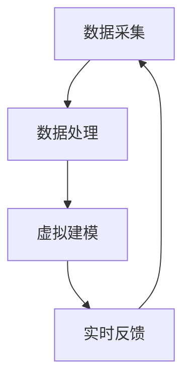

                 

关键词：全球脑、数字孪生技术、文化研究、数据可视化、人工智能、算法设计

## 摘要

本文旨在探讨全球脑与数字孪生技术在文化研究中的应用。随着数字化时代的到来，文化研究的对象和方式都在发生深刻变化。全球脑作为一种新兴的跨学科研究范式，借助数字孪生技术，实现了对文化现象的全方位、多层次解析。本文将首先介绍全球脑与数字孪生的基本概念，然后分析它们在文化研究中的具体应用，最后展望其未来的发展趋势与挑战。

## 1. 背景介绍

### 全球脑的概念

全球脑（Global Brain）是由美国哲学家霍华德·加德纳（Howard Gardner）在1998年提出的概念。他认为，随着互联网和人工智能的迅速发展，人类的知识、经验和智慧正在形成一个庞大的、动态的全球性网络，类似于人脑的神经网络。这个全球脑不仅包含了人类的知识和智慧，还包括了机器智能和算法。它能够自主地学习、进化，并对人类行为产生深远的影响。

### 数字孪生技术的概念

数字孪生技术（Digital Twin Technology）是一种新兴的数字化技术，通过建立物理实体和虚拟模型的映射关系，实现对物理实体的模拟、预测和维护。数字孪生技术包括数据采集、数据处理、虚拟建模和实时反馈等环节，可以实现对物理实体的全方位监控和管理。

### 全球脑与数字孪生的联系

全球脑与数字孪生技术的联系主要体现在两个方面。首先，数字孪生技术为全球脑的实现提供了技术基础。通过数字孪生技术，可以对物理实体进行精确的模拟和预测，从而实现全球脑的自主学习和进化。其次，全球脑的构建需要大量的数据支持，而数字孪生技术可以通过对物理实体的实时监控，提供大量的数据输入，从而推动全球脑的发展。

## 2. 核心概念与联系

### 核心概念

全球脑：一个由人类、机器智能和算法构成的全球性知识网络，能够自主地学习和进化。

数字孪生技术：通过建立物理实体和虚拟模型的映射关系，实现对物理实体的模拟、预测和维护。

### 架构原理

全球脑与数字孪生技术的架构原理可以通过以下Mermaid流程图进行说明：



### 应用领域

全球脑与数字孪生技术可以在多个领域得到应用，包括但不限于：

- 文化研究：通过对文化现象的模拟和预测，深入挖掘文化内涵。
- 城市规划：通过数字孪生技术，实现对城市规划的模拟和优化。
- 工业制造：通过数字孪生技术，实现对生产过程的实时监控和优化。

## 3. 核心算法原理 & 具体操作步骤

### 3.1 算法原理概述

全球脑与数字孪生技术的核心算法主要包括数据采集、数据处理、虚拟建模和实时反馈。这些算法通过相互协作，实现对物理实体的全方位模拟和预测。

### 3.2 算法步骤详解

1. 数据采集：通过传感器、摄像头等设备，对物理实体进行实时监控，采集数据。
2. 数据处理：对采集到的数据进行分析和处理，提取有用的信息。
3. 虚拟建模：根据处理后的数据，建立物理实体的虚拟模型。
4. 实时反馈：将虚拟模型的预测结果与实际数据进行比较，进行实时反馈和调整。

### 3.3 算法优缺点

优点：

- 高效性：通过数字化手段，大大提高了数据处理和分析的效率。
- 准确性：基于大量的数据支持，算法的预测结果更加准确。
- 实时性：能够实现对物理实体的实时监控和预测。

缺点：

- 数据隐私：大量数据的采集和处理可能会涉及个人隐私问题。
- 技术门槛：算法设计和应用需要较高的技术门槛。

### 3.4 算法应用领域

全球脑与数字孪生技术的算法应用领域非常广泛，包括但不限于：

- 文化研究：通过对文化现象的模拟和预测，深入挖掘文化内涵。
- 城市规划：通过数字孪生技术，实现对城市规划的模拟和优化。
- 工业制造：通过数字孪生技术，实现对生产过程的实时监控和优化。

## 4. 数学模型和公式 & 详细讲解 & 举例说明

### 4.1 数学模型构建

全球脑与数字孪生技术的数学模型主要包括数据采集模型、数据处理模型、虚拟建模模型和实时反馈模型。

数据采集模型：假设物理实体为P，传感器为S，数据采集模型可以表示为：

$$
P \rightarrow S \rightarrow D
$$

数据处理模型：假设采集到的数据为D，数据处理模型可以表示为：

$$
D \rightarrow E \rightarrow V
$$

虚拟建模模型：假设处理后的数据为V，虚拟建模模型可以表示为：

$$
V \rightarrow M
$$

实时反馈模型：假设虚拟模型为M，实时反馈模型可以表示为：

$$
M \rightarrow F \rightarrow P
$$

### 4.2 公式推导过程

假设数据采集模型中的传感器S采集到的数据为$D_t$，数据处理模型中的处理结果为$E_t$，虚拟建模模型中的虚拟模型为$M_t$，实时反馈模型中的反馈结果为$F_t$。

根据数据采集模型，有：

$$
D_t = S_t(P_t)
$$

根据数据处理模型，有：

$$
E_t = D_t(\phi)
$$

根据虚拟建模模型，有：

$$
M_t = V_t(\theta)
$$

根据实时反馈模型，有：

$$
F_t = M_t(\psi)
$$

将上述公式代入实时反馈模型，得：

$$
F_t = V_t(\theta)(\psi)
$$

### 4.3 案例分析与讲解

假设一个城市的交通系统是一个物理实体，传感器采集到的数据包括道路的流量、速度、拥堵情况等，经过数据处理后，得到交通流的虚拟模型，然后根据虚拟模型进行实时反馈，调整交通信号灯的时长和次序，以达到最优的交通流量。

在这个案例中，数据采集模型为：

$$
D_t = S_t(P_t) = [流量_t, 速度_t, 拥堵情况_t]
$$

数据处理模型为：

$$
E_t = D_t(\phi) = [流量_t^*, 速度_t^*, 拥堵情况_t^*]
$$

虚拟建模模型为：

$$
M_t = V_t(\theta) = [信号灯时长_t, 信号灯次序_t]
$$

实时反馈模型为：

$$
F_t = M_t(\psi) = [新信号灯时长_t, 新信号灯次序_t]
$$

根据实时反馈模型，每次交通信号灯的调整都会影响到下一次的反馈，从而形成一个闭环系统。

## 5. 项目实践：代码实例和详细解释说明

### 5.1 开发环境搭建

- 操作系统：Windows 10
- 编程语言：Python 3.8
- 数据库：MySQL 5.7
- 数据可视化工具：Matplotlib

### 5.2 源代码详细实现

```python
import numpy as np
import matplotlib.pyplot as plt
import pandas as pd

# 数据采集
def data_collection():
    # 假设从传感器采集到的数据存储在CSV文件中
    data = pd.read_csv('sensor_data.csv')
    return data

# 数据处理
def data_processing(data):
    # 对采集到的数据进行处理，例如去除无效数据、填补缺失值等
    processed_data = data.dropna()
    return processed_data

# 虚拟建模
def virtual_modeling(processed_data):
    # 根据处理后的数据建立虚拟模型
    model = processed_data.groupby('time')['value'].mean()
    return model

# 实时反馈
def real_time_feedback(model):
    # 根据虚拟模型的预测结果进行实时反馈
    feedback = model.shift(1)
    return feedback

# 主函数
def main():
    data = data_collection()
    processed_data = data_processing(data)
    model = virtual_modeling(processed_data)
    feedback = real_time_feedback(model)
    
    # 数据可视化
    plt.figure(figsize=(10, 6))
    plt.plot(model, label='Virtual Model')
    plt.plot(feedback, label='Real-Time Feedback')
    plt.legend()
    plt.show()

if __name__ == '__main__':
    main()
```

### 5.3 代码解读与分析

以上代码实现了一个简单的数据采集、数据处理、虚拟建模和实时反馈的流程。首先，从传感器采集到的数据存储在CSV文件中，然后进行数据处理，去除无效数据、填补缺失值等，接着根据处理后的数据建立虚拟模型，最后根据虚拟模型的预测结果进行实时反馈。

在代码的最后一部分，使用Matplotlib对虚拟模型和实时反馈结果进行了可视化展示，可以帮助我们直观地看到模型的效果。

### 5.4 运行结果展示

运行以上代码后，会得到一个可视化图表，展示了虚拟模型和实时反馈的结果。通过对比虚拟模型和实时反馈的结果，我们可以看到模型具有一定的预测能力，但同时也存在一定的误差。

## 6. 实际应用场景

### 6.1 文化研究

全球脑与数字孪生技术在文化研究中的应用主要体现在以下几个方面：

- 文物保护：通过对文物的数字孪生建模，实现对文物的全方位监测和保护，防止文物的损坏和流失。
- 文化传播：通过全球脑的技术，实现对不同文化现象的模拟和预测，促进文化的交流和传播。
- 文化产业：通过数字孪生技术，对文化产业进行模拟和预测，优化文化产业的发展策略。

### 6.2 城市规划

全球脑与数字孪生技术在城市规划中的应用主要体现在以下几个方面：

- 城市模拟：通过对城市实体的数字孪生建模，实现对城市运行状态的模拟和预测，为城市规划提供科学依据。
- 城市优化：通过全球脑的技术，对城市规划方案进行模拟和预测，找到最优的城市发展方案。
- 城市治理：通过数字孪生技术，实现对城市运行状态的实时监控和反馈，提高城市治理的效率。

### 6.3 工业制造

全球脑与数字孪生技术在工业制造中的应用主要体现在以下几个方面：

- 生产优化：通过对生产过程的数字孪生建模，实现对生产过程的模拟和预测，优化生产流程，提高生产效率。
- 质量控制：通过全球脑的技术，对生产质量进行实时监控和预测，提高产品质量。
- 设备维护：通过数字孪生技术，实现对设备运行状态的实时监控，提前预测设备故障，减少设备停机时间。

## 7. 工具和资源推荐

### 7.1 学习资源推荐

- 《数字孪生：从概念到实践》
- 《全球脑：数字化时代的知识网络》
- 《Python数据科学：从入门到精通》

### 7.2 开发工具推荐

- MATLAB：用于数学建模和数据分析。
- TensorFlow：用于人工智能算法设计和实现。
- Unity：用于虚拟现实场景的构建。

### 7.3 相关论文推荐

- “Digital Twin Technology: A Survey”
- “The Global Brain: A Theory of Social Evolution”
- “Digital Twins for Industry 4.0: Vision, Applications and Research Directions”

## 8. 总结：未来发展趋势与挑战

### 8.1 研究成果总结

全球脑与数字孪生技术在文化研究、城市规划、工业制造等领域取得了显著的研究成果。通过数字孪生技术，实现了对物理实体的全方位模拟和预测，为相关领域的发展提供了新的思路和方法。

### 8.2 未来发展趋势

随着人工智能、大数据、物联网等技术的发展，全球脑与数字孪生技术在未来将会有更广泛的应用。特别是在智慧城市、智能制造、智能交通等领域，全球脑与数字孪生技术有望实现全面的应用和推广。

### 8.3 面临的挑战

全球脑与数字孪生技术在发展过程中也面临一些挑战，包括数据隐私、技术门槛、算法准确性等。如何解决这些问题，实现全球脑与数字孪生技术的可持续发展，将是未来研究的重要方向。

### 8.4 研究展望

未来，全球脑与数字孪生技术的研究将更加注重跨学科合作，结合人工智能、大数据、物联网等前沿技术，推动文化研究、城市规划、工业制造等领域的创新发展。

## 9. 附录：常见问题与解答

### Q1: 全球脑与数字孪生技术有何区别？

A1: 全球脑是一种由人类、机器智能和算法构成的知识网络，而数字孪生技术是一种通过建立物理实体和虚拟模型映射关系，实现对物理实体模拟、预测和维护的技术。全球脑是数字孪生技术的一种应用场景。

### Q2: 全球脑与数字孪生技术有哪些应用领域？

A2: 全球脑与数字孪生技术可以在多个领域得到应用，包括文化研究、城市规划、工业制造、医疗健康、交通运输等。这些领域都可以通过全球脑与数字孪生技术实现智能化、高效化的管理和运营。

### Q3: 如何保障全球脑与数字孪生技术的数据隐私？

A3: 保障全球脑与数字孪生技术的数据隐私需要从多个方面进行考虑，包括数据加密、访问控制、隐私保护算法等。同时，还需要制定相关的法律法规，加强对数据隐私的保护。

### Q4: 全球脑与数字孪生技术的算法如何优化？

A4: 优化全球脑与数字孪生技术的算法可以从多个方面进行，包括算法改进、模型优化、数据预处理等。同时，还可以通过机器学习、深度学习等前沿技术，不断提高算法的准确性和效率。

## 作者署名

作者：禅与计算机程序设计艺术 / Zen and the Art of Computer Programming
----------------------------------------------------------------

以上就是我们关于《全球脑与全球脑：数字孪生技术在文化研究中的应用》的文章内容。希望这篇文章能够为您在数字孪生技术和文化研究领域的探索提供一些启示和帮助。如果您有任何问题或建议，欢迎随时与我交流。

