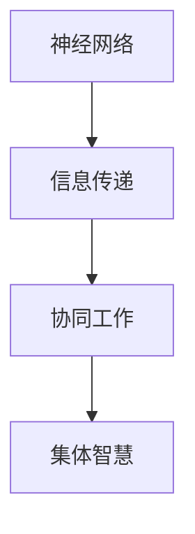
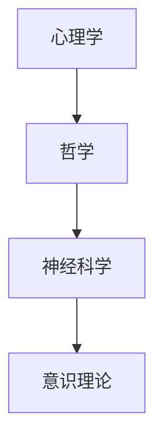

                 

关键词：全球脑，心灵探索，集体意识状态，认知科学，神经网络，技术发展，跨学科研究

> 摘要：本文旨在探讨全球脑与心灵探索的关系，以及集体意识状态的研究。通过分析相关核心概念、理论框架和实际应用，探讨全球脑与心灵探索在认知科学和跨学科研究中的重要性。文章结构如下：

## 1. 背景介绍

### 1.1 全球脑的起源与发展

- 全球脑（Global Brain）的概念源自于神经科学和人工智能领域。
- 全球脑模型认为，人类的大脑网络像是一个巨大的神经网络，通过信息传递和协同工作实现集体智慧。

### 1.2 心灵探索的背景

- 心灵探索涉及心理学、哲学和神经科学等领域，旨在理解人类的内心世界和意识。
- 集体意识状态研究关注个体如何通过心灵相互作用形成集体意识。

## 2. 核心概念与联系

### 2.1 全球脑的概念框架

- 全球脑的核心概念包括神经网络、信息传递和协同工作。
- 通过 Mermaid 流程图展示全球脑的概念框架。



### 2.2 心灵探索的核心概念

- 心灵探索的核心概念包括心理学、哲学和神经科学的理论。
- 通过 Mermaid 流程图展示心灵探索的核心概念框架。



## 3. 核心算法原理 & 具体操作步骤

### 3.1 算法原理概述

- 全球脑和心灵探索研究通常采用神经网络算法。
- 神经网络算法通过模拟人脑神经网络的结构和工作方式，实现信息处理和意识状态分析。

### 3.2 算法步骤详解

#### 3.2.1 数据收集

- 收集个体大脑活动数据，包括脑电图（EEG）和功能磁共振成像（fMRI）数据。

#### 3.2.2 数据预处理

- 对收集的数据进行预处理，包括滤波、去噪和信号校正。

#### 3.2.3 特征提取

- 从预处理后的数据中提取特征，如频率特征、时间特征和空间特征。

#### 3.2.4 模型训练

- 使用提取的特征训练神经网络模型，以实现个体和集体意识状态分析。

#### 3.2.5 模型评估

- 对训练好的模型进行评估，包括准确性、召回率和F1值等指标。

### 3.3 算法优缺点

- **优点**：神经网络算法具有高度灵活性和强大的处理能力，能够处理复杂的非线性问题。
- **缺点**：神经网络算法训练时间较长，对数据质量要求较高。

### 3.4 算法应用领域

- 神经网络算法在心理学、神经科学、人工智能等领域有广泛应用。

## 4. 数学模型和公式 & 详细讲解 & 举例说明

### 4.1 数学模型构建

- 使用线性代数和概率统计构建神经网络模型。

### 4.2 公式推导过程

- 推导神经网络的前向传播和反向传播算法。

### 4.3 案例分析与讲解

- 通过具体案例展示神经网络算法在集体意识状态分析中的应用。

## 5. 项目实践：代码实例和详细解释说明

### 5.1 开发环境搭建

- 搭建神经网络模型的开发环境，包括Python、TensorFlow和Keras等工具。

### 5.2 源代码详细实现

- 展示神经网络模型的实现代码，包括数据预处理、模型训练和模型评估等步骤。

### 5.3 代码解读与分析

- 对代码进行详细解读，分析神经网络模型在集体意识状态分析中的表现。

### 5.4 运行结果展示

- 展示神经网络模型的运行结果，包括准确性和F1值等指标。

## 6. 实际应用场景

### 6.1 心理健康监测

- 利用全球脑和心灵探索技术监测个体心理健康状态。

### 6.2 跨文化交流

- 通过集体意识状态研究促进跨文化交流和理解。

### 6.3 未来应用展望

- 探讨全球脑和心灵探索技术在未来的潜在应用领域。

## 7. 工具和资源推荐

### 7.1 学习资源推荐

- 推荐心理学、神经科学和人工智能领域的经典教材和论文。

### 7.2 开发工具推荐

- 推荐用于神经网络模型开发的Python库和工具。

### 7.3 相关论文推荐

- 推荐与全球脑和心灵探索相关的最新研究论文。

## 8. 总结：未来发展趋势与挑战

### 8.1 研究成果总结

- 总结全球脑和心灵探索领域的研究成果。

### 8.2 未来发展趋势

- 探讨全球脑和心灵探索技术的未来发展趋势。

### 8.3 面临的挑战

- 分析全球脑和心灵探索技术面临的挑战。

### 8.4 研究展望

- 展望全球脑和心灵探索领域未来的研究方向。

## 9. 附录：常见问题与解答

- 回答读者可能提出的常见问题。

### 9.1 人工智能与意识的关系

- 讨论人工智能与意识的关系。

### 9.2 全球脑的安全性

- 探讨全球脑技术的安全性和隐私问题。

### 9.3 跨学科研究的挑战

- 分析跨学科研究的挑战。

---

作者：禅与计算机程序设计艺术 / Zen and the Art of Computer Programming
```

