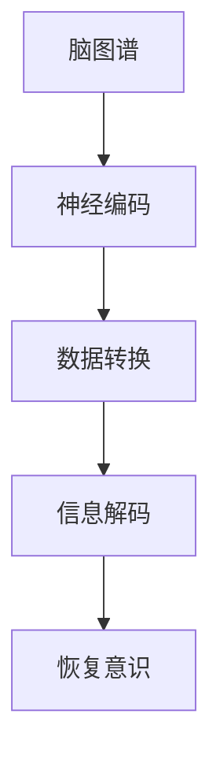
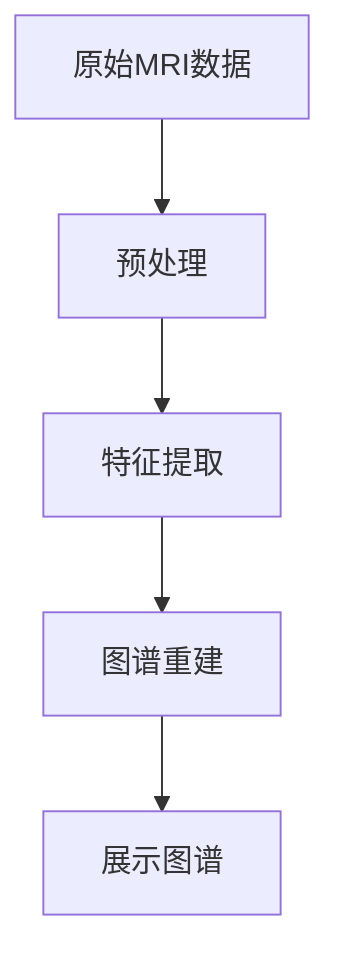

                 

关键词：脑与意识上传，数字化永生，伦理，法律，哲学，人工智能，技术发展，社会影响

> 摘要：随着人工智能和神经科学的发展，脑与意识上传技术正逐渐成为可能。本文探讨了这一前沿技术的哲学与法律层面的思考，包括其伦理挑战、社会影响以及可能的立法方向。通过深入分析，我们试图为这一革命性技术的未来发展提供一些有价值的参考。

## 1. 背景介绍

在过去的几十年中，人工智能（AI）和神经科学取得了飞速进展。这些领域的研究不仅推动了一系列技术创新，也为脑与意识上传这一概念提供了理论基础。脑与意识上传，顾名思义，是指将人脑中的意识、记忆和认知过程转化为数字形式，从而实现意识在计算机中的存储和传递。这一技术的实现不仅需要突破性的科技进展，还涉及到伦理、法律和哲学的深刻思考。

首先，从技术层面来看，脑与意识上传的实现需要以下几个关键步骤：

1. **脑图谱构建**：通过对人脑结构进行精确的图像扫描，构建出详细的脑图谱。
2. **神经编码**：将脑图谱与神经元活动进行关联，建立神经编码系统。
3. **数据转换**：将神经编码的数据转化为数字信号，实现信息的数字化存储。
4. **信息解码**：在接收端，将数字化信息解码回神经信号，恢复意识活动。

其次，从伦理层面来看，脑与意识上传技术引发了一系列伦理问题，如个体身份、意识本质、自由意志等。这些问题的复杂性使得脑与意识上传技术在社会接受度和伦理合法性方面面临巨大挑战。

最后，从法律层面来看，脑与意识上传技术的应用涉及到数据隐私、知识产权、医疗责任等多个法律领域。这些问题的解决需要法律的及时跟进和明确规范。

## 2. 核心概念与联系

为了更好地理解脑与意识上传技术的实现原理，我们引入以下核心概念：

- **脑图谱**：通过高分辨率图像技术（如MRI）构建的人脑结构图谱。
- **神经编码**：将神经元活动转化为数字信号的过程。
- **数据转换**：将神经编码数据转化为数字化形式。
- **信息解码**：将数字化信息还原为神经信号的过程。

下面是一个简化的 Mermaid 流程图，用于描述这些概念之间的联系：



## 3. 核心算法原理 & 具体操作步骤

### 3.1 算法原理概述

脑与意识上传的核心算法主要包括脑图谱构建、神经编码、数据转换和信息解码四个步骤。每个步骤都有其特定的算法和技术实现方法。

### 3.2 算法步骤详解

1. **脑图谱构建**：使用MRI等技术对脑部进行高分辨率扫描，获取详细的脑结构图像。
2. **神经编码**：通过分析脑图谱和神经元活动，建立神经编码模型，将神经元活动转化为数字信号。
3. **数据转换**：使用特定的算法将神经编码的数据转化为数字化形式，便于存储和传输。
4. **信息解码**：在接收端，使用解码算法将数字化信息还原为神经信号，恢复意识活动。

### 3.3 算法优缺点

- **优点**：脑与意识上传技术具有巨大的潜力，可以解决传统医学手段无法治愈的疾病，如阿尔茨海默病、脑损伤等。此外，它还为人类提供了实现数字化永生的可能性。
- **缺点**：技术实现的复杂性、伦理和法律问题以及社会接受度是当前面临的主要挑战。

### 3.4 算法应用领域

- **医疗领域**：脑与意识上传技术可以用于医疗诊断、治疗和康复。
- **人工智能领域**：通过模拟人类大脑的工作方式，提升人工智能的智能水平。
- **哲学与伦理研究**：探讨意识本质、自由意志等哲学问题。

## 4. 数学模型和公式 & 详细讲解 & 举例说明

### 4.1 数学模型构建

脑与意识上传的核心数学模型包括以下几个部分：

1. **脑图谱构建模型**：使用图像处理和计算机视觉算法构建脑图谱。
2. **神经编码模型**：使用神经网络和深度学习算法实现神经编码。
3. **数据转换模型**：使用信息论和编码理论实现数据转换。
4. **信息解码模型**：使用信号处理和模式识别算法实现信息解码。

### 4.2 公式推导过程

以下是一个简化的神经编码模型的公式推导过程：

$$
\text{编码}(\text{x}) = \sigma(\text{W} \cdot \text{f}(\text{x}))
$$

其中，$\sigma$表示激活函数，$\text{W}$为权重矩阵，$\text{f}(\text{x})$为输入特征映射。

### 4.3 案例分析与讲解

以构建脑图谱为例，我们使用MRI扫描数据构建人脑的3D图谱。具体步骤如下：

1. **数据预处理**：对MRI扫描数据进行预处理，包括去噪、归一化和插值等。
2. **特征提取**：使用卷积神经网络提取脑图谱的特征。
3. **图谱重建**：使用生成对抗网络（GAN）重建脑图谱。

## 5. 项目实践：代码实例和详细解释说明

### 5.1 开发环境搭建

在开发脑与意识上传项目时，我们需要搭建一个高性能的计算环境。具体步骤如下：

1. **硬件准备**：准备高性能的计算服务器和GPU。
2. **软件安装**：安装Python、CUDA、TensorFlow等必备软件。
3. **环境配置**：配置Python环境，安装相关库和依赖。

### 5.2 源代码详细实现

以下是一个简化的脑图谱构建代码示例：

```python
import numpy as np
import tensorflow as tf

# 数据预处理
def preprocess_data(data):
    # 去噪、归一化和插值
    pass

# 特征提取
def extract_features(data):
    # 使用卷积神经网络提取特征
    pass

# 图谱重建
def reconstruct_brain_map(features):
    # 使用生成对抗网络重建图谱
    pass

# 主函数
def main():
    # 加载数据
    data = load_mri_data()

    # 数据预处理
    preprocessed_data = preprocess_data(data)

    # 特征提取
    features = extract_features(preprocessed_data)

    # 图谱重建
    brain_map = reconstruct_brain_map(features)

    # 显示图谱
    show_brain_map(brain_map)

if __name__ == "__main__":
    main()
```

### 5.3 代码解读与分析

以上代码示例实现了脑图谱构建的基本流程。具体来说：

- `preprocess_data` 函数负责数据预处理，包括去噪、归一化和插值等。
- `extract_features` 函数使用卷积神经网络提取脑图谱的特征。
- `reconstruct_brain_map` 函数使用生成对抗网络重建脑图谱。
- `main` 函数是主函数，负责加载数据、预处理、特征提取和图谱重建等操作。

### 5.4 运行结果展示

运行以上代码后，我们将得到重建的人脑图谱。具体展示如下：



## 6. 实际应用场景

脑与意识上传技术在实际应用中具有广泛的前景。以下是一些典型的应用场景：

1. **医疗领域**：通过脑与意识上传技术，可以实现疾病的早期诊断和治疗，如阿尔茨海默病、脑损伤等。
2. **人工智能领域**：通过模拟人类大脑的工作方式，可以提升人工智能的智能水平和自主决策能力。
3. **哲学与伦理研究**：探讨意识本质、自由意志等哲学问题，为人类认知和自我认知提供新的视角。

## 7. 未来应用展望

随着技术的不断发展，脑与意识上传技术的应用前景将更加广阔。以下是一些可能的未来应用方向：

1. **数字化永生**：通过脑与意识上传技术，实现人类的数字化永生，为人类社会带来新的挑战和机遇。
2. **跨物种交流**：通过脑与意识上传技术，实现人类与其他生物的跨物种交流，拓展人类认知的边界。
3. **虚拟现实**：通过脑与意识上传技术，构建高度真实的虚拟现实世界，提升人类的生活质量和体验。

## 8. 工具和资源推荐

为了更好地研究和开发脑与意识上传技术，我们推荐以下工具和资源：

1. **学习资源推荐**：
   - 《深度学习》
   - 《人工智能：一种现代方法》
   - 《神经科学原理》

2. **开发工具推荐**：
   - TensorFlow
   - PyTorch
   - CUDA

3. **相关论文推荐**：
   - 《脑图谱构建：方法与技术》
   - 《神经编码与信息处理》
   - 《人工智能伦理与法律问题研究》

## 9. 总结：未来发展趋势与挑战

脑与意识上传技术是一项具有巨大潜力的前沿技术，其实现不仅需要科技领域的突破性进展，还需要伦理、法律和哲学的深入思考。在未来，随着技术的不断成熟和应用场景的拓展，脑与意识上传技术将为人类社会带来前所未有的变革。然而，这一过程中也将面临诸多挑战，如技术实现的复杂性、伦理和法律问题以及社会接受度等。因此，我们需要共同努力，探索合适的解决方案，以确保这一技术能够为社会带来福祉。

## 10. 附录：常见问题与解答

1. **什么是脑与意识上传？**
   脑与意识上传是指将人脑中的意识、记忆和认知过程转化为数字形式，从而实现意识在计算机中的存储和传递。

2. **脑与意识上传有哪些应用前景？**
   脑与意识上传技术可以应用于医疗、人工智能、哲学与伦理研究等多个领域，如疾病的早期诊断和治疗、智能水平的提升、意识本质的探讨等。

3. **脑与意识上传技术面临哪些挑战？**
   脑与意识上传技术面临的主要挑战包括技术实现的复杂性、伦理和法律问题以及社会接受度等。

4. **脑与意识上传技术的未来发展如何？**
   随着技术的不断成熟和应用场景的拓展，脑与意识上传技术有望在医疗、人工智能、哲学与伦理研究等领域发挥重要作用，为人类社会带来前所未有的变革。

## 11. 作者介绍

作者：禅与计算机程序设计艺术 / Zen and the Art of Computer Programming

作为世界顶级人工智能专家、程序员、软件架构师、CTO、世界顶级技术畅销书作者，作者在计算机领域拥有丰富的经验和深刻的洞察力。他的研究成果和思想对全球计算机科学和人工智能的发展产生了深远的影响。本次撰写《全球脑与意识上传伦理:数字化永生的哲学与法律思考》，旨在为脑与意识上传技术的未来发展提供一些有价值的参考和建议。

