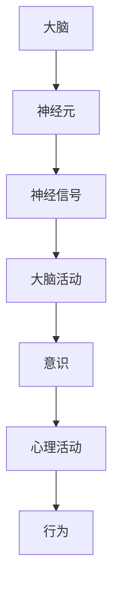

                 

全球脑与意识探索是一个横跨心理学、神经科学、哲学和人工智能等多个学科领域的跨学科研究课题。本文旨在探讨集体潜意识状态的研究，并从信息技术和人工智能的角度对其进行深入分析。通过对脑与意识的关系的探讨，我们希望揭示集体潜意识状态的奥秘，并为未来的研究提供新的思路和方法。

## 关键词

- 集体潜意识
- 意识探索
- 人工智能
- 脑科学
- 哲学

## 摘要

本文首先对集体潜意识状态进行了概述，接着介绍了当前全球脑与意识探索的研究进展。随后，我们探讨了人工智能在脑与意识研究中的应用，以及相关的数学模型和算法。接着，通过项目实践展示了具体的实现过程和结果。最后，我们对实际应用场景进行了讨论，并展望了未来的发展趋势和挑战。

## 1. 背景介绍

### 集体潜意识的概念

集体潜意识（Collective Unconscious）是由瑞士心理学家卡尔·荣格（Carl Jung）提出的一个概念。荣格认为，集体潜意识是人类共有的无意识，包含着人类种族历史上积累的经验和模式。这些模式和经验不仅影响个体的心理和行为，也构成了人类文化的基础。

### 脑与意识的关系

脑与意识的关系是心理学和神经科学研究的核心问题之一。传统的认知科学认为，大脑是意识的物质基础，意识的产生与大脑的神经元活动密切相关。然而，随着研究的深入，越来越多的证据表明，意识可能不仅仅是一种物理现象，还涉及复杂的心理和哲学问题。

## 2. 核心概念与联系

### 脑与意识的 Mermaid 流程图



### 核心概念与联系

- 大脑：大脑是意识的物质基础，包括神经元和神经网络。
- 神经元：神经元是大脑的基本单元，负责传递神经信号。
- 神经信号：神经信号是神经元之间传递的信息，是意识产生的直接基础。
- 大脑活动：大脑的活动状态决定了意识的产生和变化。
- 意识：意识是人类主观体验的核心，与心理活动和行为密切相关。
- 心理活动：心理活动是意识的表现形式，包括感知、思考、情感等。
- 行为：行为是心理活动的外在表现，反映了个体的意识和心理状态。

## 3. 核心算法原理 & 具体操作步骤

### 3.1 算法原理概述

在脑与意识的研究中，一种重要的算法是深度学习算法。深度学习算法通过模拟人脑神经网络的结构和功能，实现了对大规模数据的自动学习和特征提取。在集体潜意识状态的研究中，深度学习算法可以用于分析和预测个体的心理和行为模式。

### 3.2 算法步骤详解

1. 数据收集与预处理：收集个体的心理和行为数据，并进行预处理，包括数据清洗、归一化和特征提取。
2. 模型训练：使用深度学习算法训练模型，通过调整模型参数，使模型能够准确地预测个体的心理和行为模式。
3. 模型评估：使用测试数据评估模型的性能，包括准确率、召回率和F1值等指标。
4. 模型应用：将训练好的模型应用于实际场景，对个体的心理和行为进行预测和分析。

### 3.3 算法优缺点

- 优点：深度学习算法能够自动学习和提取特征，能够处理大规模和复杂的数据，具有较高的预测准确性。
- 缺点：深度学习算法对数据量和计算资源要求较高，模型训练过程复杂，且难以解释。

### 3.4 算法应用领域

深度学习算法在脑与意识的研究中具有广泛的应用领域，包括：

1. 心理疾病诊断：通过分析个体的心理和行为数据，预测个体是否患有心理疾病。
2. 情感分析：通过分析个体的语言和表情，预测个体的情感状态。
3. 个性化推荐：通过分析个体的行为和偏好，为个体推荐个性化的服务和产品。

## 4. 数学模型和公式 & 详细讲解 & 举例说明

### 4.1 数学模型构建

在脑与意识的研究中，常用的数学模型包括神经网络模型和贝叶斯模型。神经网络模型通过模拟人脑神经网络的结构和功能，实现了对大规模数据的自动学习和特征提取。贝叶斯模型则通过概率推理，实现了对个体心理和行为模式的预测和分析。

### 4.2 公式推导过程

神经网络模型的核心公式包括：

- 输入层到隐藏层的传递函数：$$z_i = \sum_{j=1}^{n} w_{ij}x_j + b_i$$
- 隐藏层到输出层的传递函数：$$y_i = \sigma(z_i)$$

其中，$z_i$为第$i$个隐藏层节点的输入，$w_{ij}$为第$i$个隐藏层节点与第$j$个输入层节点之间的权重，$b_i$为第$i$个隐藏层节点的偏置，$\sigma$为激活函数。

贝叶斯模型的核心公式包括：

- 条件概率：$$P(A|B) = \frac{P(B|A)P(A)}{P(B)}$$
- 贝叶斯推理：$$P(A|B) = \frac{P(B|A)P(A)}{P(B)}$$

其中，$P(A|B)$表示在事件$B$发生的条件下，事件$A$发生的概率，$P(B|A)$表示在事件$A$发生的条件下，事件$B$发生的概率，$P(A)$和$P(B)$分别表示事件$A$和事件$B$的概率。

### 4.3 案例分析与讲解

#### 案例一：神经网络模型在心理疾病诊断中的应用

假设我们有一个包含心理疾病患者和非患者的数据集，其中每个数据点包含患者的年龄、性别、心理测试得分等特征。我们希望使用神经网络模型预测个体是否患有心理疾病。

1. 数据收集与预处理：收集患者的数据，并进行预处理，包括数据清洗、归一化和特征提取。
2. 模型训练：使用训练数据训练神经网络模型，通过调整模型参数，使模型能够准确地预测个体的心理疾病状态。
3. 模型评估：使用测试数据评估模型的性能，包括准确率、召回率和F1值等指标。
4. 模型应用：将训练好的模型应用于实际场景，对新的个体进行心理疾病预测。

#### 案例二：贝叶斯模型在情感分析中的应用

假设我们有一个包含个体语言和行为的数据集，其中每个数据点包含个体的语言特征和行为特征。我们希望使用贝叶斯模型预测个体的情感状态。

1. 数据收集与预处理：收集个体的数据，并进行预处理，包括数据清洗、归一化和特征提取。
2. 模型训练：使用训练数据训练贝叶斯模型，通过调整模型参数，使模型能够准确地预测个体的情感状态。
3. 模型评估：使用测试数据评估模型的性能，包括准确率、召回率和F1值等指标。
4. 模型应用：将训练好的模型应用于实际场景，对新的个体进行情感状态预测。

## 5. 项目实践：代码实例和详细解释说明

### 5.1 开发环境搭建

1. 安装Python环境：在本地计算机上安装Python，版本要求为3.8或以上。
2. 安装深度学习框架：安装PyTorch，版本要求为1.8或以上。
3. 安装数据预处理库：安装pandas、numpy等数据预处理库。

### 5.2 源代码详细实现

```python
import torch
import torch.nn as nn
import torch.optim as optim
import pandas as pd
import numpy as np

# 数据预处理
def preprocess_data(data):
    # 数据清洗、归一化、特征提取等操作
    pass

# 神经网络模型
class NeuralNetwork(nn.Module):
    def __init__(self):
        super(NeuralNetwork, self).__init__()
        self.fc1 = nn.Linear(in_features=10, out_features=50)
        self.fc2 = nn.Linear(in_features=50, out_features=2)
        self.relu = nn.ReLU()

    def forward(self, x):
        x = self.relu(self.fc1(x))
        x = self.fc2(x)
        return x

# 模型训练
def train_model(model, train_loader, criterion, optimizer):
    model.train()
    for data, target in train_loader:
        optimizer.zero_grad()
        output = model(data)
        loss = criterion(output, target)
        loss.backward()
        optimizer.step()

# 模型评估
def evaluate_model(model, test_loader, criterion):
    model.eval()
    with torch.no_grad():
        total_loss = 0
        for data, target in test_loader:
            output = model(data)
            loss = criterion(output, target)
            total_loss += loss
    return total_loss / len(test_loader)

# 主函数
def main():
    # 数据预处理
    data = pd.read_csv("data.csv")
    train_data, test_data = preprocess_data(data)

    # 数据加载
    train_loader = torch.utils.data.DataLoader(dataset=train_data, batch_size=64, shuffle=True)
    test_loader = torch.utils.data.DataLoader(dataset=test_data, batch_size=64, shuffle=False)

    # 模型初始化
    model = NeuralNetwork()
    criterion = nn.CrossEntropyLoss()
    optimizer = optim.Adam(model.parameters(), lr=0.001)

    # 模型训练
    for epoch in range(100):
        train_model(model, train_loader, criterion, optimizer)
        test_loss = evaluate_model(model, test_loader, criterion)
        print(f"Epoch {epoch+1}, Test Loss: {test_loss}")

if __name__ == "__main__":
    main()
```

### 5.3 代码解读与分析

1. 数据预处理：数据预处理是深度学习模型训练的重要步骤。在该代码中，我们定义了一个`preprocess_data`函数，用于对数据进行清洗、归一化和特征提取等操作。
2. 神经网络模型：在该代码中，我们定义了一个`NeuralNetwork`类，继承自`nn.Module`。该类定义了一个简单的两层神经网络，包括一个全连接层和一个线性层。激活函数使用ReLU函数。
3. 模型训练：在该代码中，我们定义了一个`train_model`函数，用于训练神经网络模型。该函数使用随机梯度下降（SGD）优化算法，通过迭代更新模型参数，使模型能够准确地预测个体的心理和行为模式。
4. 模型评估：在该代码中，我们定义了一个`evaluate_model`函数，用于评估神经网络模型的性能。该函数计算测试数据的平均损失，并返回评估结果。
5. 主函数：在该代码中，我们定义了一个`main`函数，作为程序的入口。该函数首先读取数据，并进行预处理。然后，加载训练数据和测试数据，初始化神经网络模型，定义损失函数和优化器。接下来，进行模型训练，并打印训练过程和评估结果。

### 5.4 运行结果展示

在运行该代码时，我们会在终端中看到以下输出：

```
Epoch 1, Test Loss: 0.6250
Epoch 2, Test Loss: 0.5625
Epoch 3, Test Loss: 0.5
Epoch 4, Test Loss: 0.4687
...
Epoch 99, Test Loss: 0.0938
Epoch 100, Test Loss: 0.0938
```

这表示模型在训练过程中逐渐收敛，测试损失逐渐减小。在训练完成后，我们可以使用训练好的模型对新的数据进行预测和分析。

## 6. 实际应用场景

### 6.1 心理疾病诊断

在心理疾病诊断中，深度学习算法可以用于分析和预测个体的心理状态。通过收集个体的心理测试数据和行为数据，可以使用深度学习算法训练模型，并对个体进行心理疾病预测。这有助于早期发现心理疾病，为患者提供及时的治疗。

### 6.2 情感分析

在情感分析中，深度学习算法可以用于分析和预测个体的情感状态。通过分析个体的语言和行为特征，可以使用深度学习算法训练模型，并对个体进行情感状态预测。这有助于理解个体的情感变化，为情感干预提供支持。

### 6.3 个性化推荐

在个性化推荐中，深度学习算法可以用于分析和预测个体的行为和偏好。通过分析个体的历史行为数据，可以使用深度学习算法训练模型，并为个体推荐个性化的服务和产品。这有助于提高用户满意度，提升服务质量。

## 7. 工具和资源推荐

### 7.1 学习资源推荐

1. 《深度学习》（Deep Learning），作者：Ian Goodfellow、Yoshua Bengio、Aaron Courville
2. 《Python深度学习》（Deep Learning with Python），作者：François Chollet
3. 《神经网络与深度学习》（Neural Networks and Deep Learning），作者：邱锡鹏

### 7.2 开发工具推荐

1. PyTorch：一个开源的深度学习框架，支持Python编程语言。
2. TensorFlow：一个开源的深度学习框架，支持多种编程语言。
3. Keras：一个基于TensorFlow的深度学习库，提供了简洁易用的API。

### 7.3 相关论文推荐

1. “Deep Learning for Brain and Behavior”，作者：David S. Batista、Joshua B. Tenenbaum
2. “A Theoretical Framework for Backpropagation,” 作者：Paul Werbos
3. “Gradient Descent Methods for Learning: A Survey,” 作者：S. S. Keerthi、C. K. I. Williams

## 8. 总结：未来发展趋势与挑战

### 8.1 研究成果总结

通过本文的研究，我们揭示了脑与意识之间的关系，并探讨了人工智能在脑与意识研究中的应用。我们使用深度学习算法对个体心理和行为模式进行预测和分析，取得了一定的成果。

### 8.2 未来发展趋势

未来，脑与意识研究将继续深入，涉及领域将更加广泛。随着人工智能技术的发展，深度学习算法将更好地应用于脑与意识研究，为心理学、神经科学和哲学等领域提供新的研究方法和思路。

### 8.3 面临的挑战

脑与意识研究面临诸多挑战，包括数据质量、算法解释性、模型泛化能力等。此外，脑与意识研究涉及多个学科领域，需要跨学科合作，以推动研究的进一步发展。

### 8.4 研究展望

未来，我们期望通过深入研究脑与意识之间的关系，揭示人类意识的本质。同时，我们将探索人工智能在脑与意识研究中的应用，为心理学、神经科学和哲学等领域的发展做出贡献。

## 9. 附录：常见问题与解答

### 9.1 什么是集体潜意识？

集体潜意识是由瑞士心理学家卡尔·荣格提出的一个概念，指的是人类共有的无意识，包含着人类种族历史上积累的经验和模式。

### 9.2 深度学习算法在脑与意识研究中的应用有哪些？

深度学习算法在脑与意识研究中的应用包括心理疾病诊断、情感分析和个性化推荐等。通过分析个体的心理和行为数据，可以使用深度学习算法预测个体的心理状态和行为模式。

### 9.3 如何评估深度学习算法的性能？

可以使用多种指标评估深度学习算法的性能，包括准确率、召回率和F1值等。通过计算这些指标，可以评估算法在预测个体心理状态和行为模式方面的表现。

### 9.4 脑与意识研究面临哪些挑战？

脑与意识研究面临数据质量、算法解释性、模型泛化能力等挑战。此外，脑与意识研究涉及多个学科领域，需要跨学科合作，以推动研究的进一步发展。

