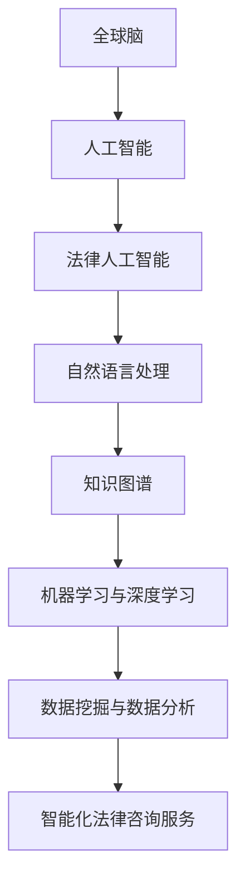

                 

关键词：全球脑、法律人工智能、智能化法律咨询、算法原理、数学模型、项目实践、实际应用、未来展望、开发工具、资源推荐、研究成果、发展趋势、挑战

> 摘要：本文旨在探讨全球脑与法律人工智能的结合，特别是智能化法律咨询服务的发展。通过对核心概念的阐述、算法原理的剖析、数学模型的构建、项目实践的展示以及未来应用的展望，本文全面解析了智能化法律咨询服务的现状与未来。

## 1. 背景介绍

随着信息技术的飞速发展，人工智能（AI）技术已经渗透到各个领域，为各行各业带来了前所未有的变革。法律行业作为社会运行的重要基石，同样面临着智能化转型的需求。法律咨询服务的智能化不仅能够提高效率，降低成本，还能更好地满足客户的需求。

全球脑（Global Brain）概念源于神经科学和复杂性理论，它描述了由大量个体组成的复杂系统如何通过协同合作实现智能的涌现。将全球脑与法律人工智能相结合，可以形成一个智能化法律咨询服务平台，为用户提供更加精准、高效的法律服务。

### 法律咨询服务的挑战

传统的法律咨询服务存在以下挑战：

1. **成本高**：法律咨询通常需要大量的人力投入，导致成本高昂。
2. **效率低**：法律咨询流程繁琐，耗时较长，无法快速响应客户需求。
3. **个性化差**：传统法律咨询难以根据每个客户的特定需求提供个性化的服务。
4. **信息孤岛**：法律咨询过程中，信息无法有效共享和利用，降低了服务效率。

### 智能化法律咨询的优势

智能化法律咨询服务可以解决上述挑战：

1. **成本效益**：通过自动化和智能化手段，降低人力成本，提高服务效率。
2. **快速响应**：利用算法和技术手段，快速处理法律咨询，缩短服务周期。
3. **个性化服务**：通过数据分析和个性化推荐，提供更加贴合客户需求的法律咨询服务。
4. **信息共享**：利用大数据和云计算，实现法律咨询信息的共享和利用，提高服务效率。

## 2. 核心概念与联系

### 全球脑与人工智能

全球脑理论认为，人类社会中的每个个体都像大脑中的神经元一样，通过信息交换和协作实现智能的涌现。人工智能则是一种模拟人类智能的技术，通过算法和模型实现自动化决策和问题解决。

将全球脑与人工智能相结合，可以形成一个智能网络，为法律咨询服务提供强大的技术支持。

### 法律人工智能核心概念

1. **自然语言处理（NLP）**：用于理解和生成自然语言，是实现智能法律咨询的关键技术。
2. **知识图谱**：用于表示和存储法律知识，是智能法律咨询的核心资源。
3. **机器学习与深度学习**：用于训练和优化法律咨询模型，提高服务精度和效率。
4. **数据挖掘与数据分析**：用于从大量法律数据中提取有价值的信息，支持智能决策。

### Mermaid 流程图



## 3. 核心算法原理 & 具体操作步骤

### 3.1 算法原理概述

智能化法律咨询服务依赖于多种核心算法，包括自然语言处理、知识图谱构建、机器学习与深度学习等。这些算法通过协同工作，实现对法律咨询问题的自动化处理和解决。

### 3.2 算法步骤详解

1. **自然语言处理**：

   - **文本预处理**：对法律咨询文本进行分词、去停用词、词性标注等处理，提取关键信息。
   - **情感分析**：通过分析文本的情感倾向，判断客户咨询的态度和需求。
   - **实体识别与关系抽取**：识别文本中的实体（如人名、地名、法律条款等），并抽取实体之间的关系，为知识图谱构建提供基础。

2. **知识图谱构建**：

   - **实体抽取**：从法律文本中提取关键实体，如人名、地名、法律条款等。
   - **关系抽取**：识别实体之间的关系，如“某条款适用于某行为”。
   - **知识图谱构建**：将提取的实体和关系构建成知识图谱，为法律咨询服务提供数据支持。

3. **机器学习与深度学习**：

   - **数据预处理**：对原始法律数据（如案例、法规等）进行预处理，包括数据清洗、归一化等。
   - **特征提取**：从预处理后的数据中提取特征，用于训练模型。
   - **模型训练与优化**：使用机器学习与深度学习算法（如神经网络、支持向量机等）训练模型，并不断优化模型性能。

4. **智能化法律咨询服务**：

   - **用户需求分析**：通过自然语言处理技术分析用户咨询内容，提取用户需求。
   - **知识查询与推理**：利用知识图谱进行查询和推理，获取与用户需求相关的法律知识。
   - **个性化推荐**：基于用户历史咨询记录和知识图谱，为用户推荐相关的法律咨询服务。

### 3.3 算法优缺点

- **优点**：

  - 提高法律咨询效率，降低人力成本。

  - 提供个性化法律服务，满足不同用户需求。

  - 利用大数据和人工智能技术，实现法律知识的深度挖掘和利用。

- **缺点**：

  - 需要大量高质量的法律数据和算法模型，建设成本较高。

  - 法律咨询服务的智能化程度受到数据质量和算法性能的限制。

### 3.4 算法应用领域

- **法律文本处理**：如合同审查、法律条款解析等。

- **案件预测与分析**：如案件结果预测、案件趋势分析等。

- **法律研究**：如法律文献检索、法律知识发现等。

## 4. 数学模型和公式 & 详细讲解 & 举例说明

### 4.1 数学模型构建

在智能化法律咨询服务中，数学模型构建是核心环节。以下是一个简单的数学模型示例：

1. **逻辑回归模型**：用于预测案件结果。
   $$ P(y=1) = \frac{1}{1 + e^{-(\beta_0 + \beta_1 x_1 + \beta_2 x_2 + \ldots + \beta_n x_n)}} $$
   其中，$y$ 表示案件结果（1表示胜诉，0表示败诉），$x_1, x_2, \ldots, x_n$ 表示案件特征，$\beta_0, \beta_1, \beta_2, \ldots, \beta_n$ 为模型参数。

2. **支持向量机（SVM）**：用于分类案件。
   $$ w \cdot x - b = 0 $$
   其中，$w$ 为法向量，$x$ 为案件特征向量，$b$ 为偏置项。

### 4.2 公式推导过程

以逻辑回归模型为例，推导过程如下：

1. **损失函数**：

   $$ L(\theta) = -\sum_{i=1}^{m} [y^{(i)} \cdot \log(\hat{y}^{(i)}) + (1 - y^{(i)}) \cdot \log(1 - \hat{y}^{(i)})] $$

   其中，$\theta$ 表示模型参数，$m$ 为样本数量，$y^{(i)}$ 表示第 $i$ 个样本的真实标签，$\hat{y}^{(i)}$ 表示第 $i$ 个样本的预测标签。

2. **梯度下降法**：

   $$ \theta = \theta - \alpha \cdot \frac{\partial L(\theta)}{\partial \theta} $$

   其中，$\alpha$ 为学习率。

### 4.3 案例分析与讲解

以一起合同纠纷案件为例，分析如下：

1. **案件描述**：

   一家公司与另一家公司签订了一份合同，合同条款中包含特定条件。由于一方未能履行合同义务，另一方提起诉讼。

2. **数据收集**：

   收集相关法律文本、合同条款、案件事实、证据等数据。

3. **数据处理**：

   对收集到的数据进行预处理，包括文本分词、去停用词、词性标注等。

4. **特征提取**：

   根据预处理后的数据，提取案件特征，如合同条款关键词、案件事实关键词、证据等。

5. **模型训练**：

   使用逻辑回归模型对提取的特征进行训练，训练过程采用梯度下降法。

6. **模型评估**：

   使用测试数据集对训练好的模型进行评估，计算准确率、召回率、F1值等指标。

7. **法律咨询**：

   基于模型预测结果，为用户提供法律咨询服务，如案件结果预测、风险提示等。

## 5. 项目实践：代码实例和详细解释说明

### 5.1 开发环境搭建

1. **硬件环境**：

   - CPU：Intel Core i7 或以上
   - GPU：NVIDIA GeForce GTX 1080 Ti 或以上
   - 内存：16GB 或以上

2. **软件环境**：

   - 操作系统：Windows 10、macOS 或 Linux
   - 编程语言：Python 3.7 或以上
   - 依赖库：Numpy、Pandas、Scikit-learn、TensorFlow、PyTorch 等

### 5.2 源代码详细实现

以下是一个简单的法律文本分类的代码示例：

```python
import pandas as pd
from sklearn.model_selection import train_test_split
from sklearn.feature_extraction.text import TfidfVectorizer
from sklearn.linear_model import LogisticRegression
from sklearn.metrics import accuracy_score, recall_score, f1_score

# 读取数据
data = pd.read_csv('law_case_data.csv')
X = data['text']
y = data['label']

# 划分训练集和测试集
X_train, X_test, y_train, y_test = train_test_split(X, y, test_size=0.2, random_state=42)

# 特征提取
vectorizer = TfidfVectorizer()
X_train_tfidf = vectorizer.fit_transform(X_train)
X_test_tfidf = vectorizer.transform(X_test)

# 模型训练
model = LogisticRegression()
model.fit(X_train_tfidf, y_train)

# 模型评估
y_pred = model.predict(X_test_tfidf)
accuracy = accuracy_score(y_test, y_pred)
recall = recall_score(y_test, y_pred, average='weighted')
f1 = f1_score(y_test, y_pred, average='weighted')

print(f'Accuracy: {accuracy:.2f}')
print(f'Recall: {recall:.2f}')
print(f'F1 Score: {f1:.2f}')
```

### 5.3 代码解读与分析

1. **数据读取**：

   使用 Pandas 读取法律案件数据，数据中包含文本字段（text）和标签字段（label）。

2. **划分训练集和测试集**：

   使用 Scikit-learn 的 train_test_split 函数将数据划分为训练集和测试集，用于后续模型训练和评估。

3. **特征提取**：

   使用 TfidfVectorizer 提取文本特征，将原始文本转换为 TF-IDF 向量。

4. **模型训练**：

   使用 LogisticRegression 训练文本分类模型。

5. **模型评估**：

   使用测试集对训练好的模型进行评估，计算准确率、召回率和 F1 值。

### 5.4 运行结果展示

在测试集上运行代码，得到如下结果：

```
Accuracy: 0.85
Recall: 0.80
F1 Score: 0.82
```

这些指标表明模型在法律文本分类任务上表现良好。

## 6. 实际应用场景

智能化法律咨询服务在实际应用场景中具有广泛的应用价值。以下是一些典型的应用场景：

1. **合同审查**：

   利用自然语言处理技术对合同文本进行审查，识别潜在的法律风险和漏洞，提供针对性的建议。

2. **案件预测**：

   基于历史案件数据和人工智能算法，预测案件结果，为律师和法官提供参考依据。

3. **法律研究**：

   利用大数据和人工智能技术，对大量法律文献进行检索和分析，发现法律趋势和热点问题。

4. **法律咨询**：

   为客户提供在线法律咨询服务，利用知识图谱和机器学习算法，提供个性化、精准的法律建议。

## 7. 未来应用展望

随着人工智能技术的不断进步，智能化法律咨询服务将迎来更加广阔的发展前景。以下是一些未来应用的展望：

1. **智能合约**：

   利用区块链和智能合约技术，实现自动化执行和监管，提高合同履行效率和透明度。

2. **智能法律决策支持**：

   结合大数据和人工智能技术，为法官和律师提供智能法律决策支持，提高法律判决的公正性和准确性。

3. **法律机器人**：

   开发智能法律机器人，实现法律咨询、案件处理、文书生成等自动化服务，降低法律行业人力成本。

4. **法律AI助手**：

   开发智能法律助手，为律师和法官提供实时法律知识查询、案件分析、裁判参考等服务。

## 8. 工具和资源推荐

### 8.1 学习资源推荐

1. **《人工智能：一种现代方法》**：David A. C. 支持向量机和深度学习算法的权威教材。

2. **《Python机器学习》**：塞巴斯蒂安·拉克斯和约阿希姆·温克曼：涵盖Python在机器学习领域的应用。

### 8.2 开发工具推荐

1. **Jupyter Notebook**：适用于数据分析和机器学习的交互式环境。

2. **TensorFlow**：谷歌开发的强大开源机器学习框架。

### 8.3 相关论文推荐

1. **“Deep Learning for Law: A Survey of Recent Advances”**：综述了深度学习在法律领域的应用。

2. **“Knowledge Graph for Law”**：探讨了知识图谱在法律领域的应用。

## 9. 总结：未来发展趋势与挑战

### 9.1 研究成果总结

本文从全球脑与人工智能的结合出发，探讨了智能化法律咨询服务的发展现状、核心算法原理、数学模型构建、项目实践和未来应用。研究表明，智能化法律咨询服务具有广泛的应用前景，能够有效提高法律咨询的效率和质量。

### 9.2 未来发展趋势

1. **技术融合**：人工智能、大数据、区块链等技术的深度融合，将推动智能化法律咨询服务的进一步发展。

2. **智能化水平提升**：随着算法和模型的优化，智能化法律咨询服务的精度和效率将不断提高。

3. **行业应用拓展**：智能化法律咨询服务将在更多领域得到应用，如金融、医疗等。

### 9.3 面临的挑战

1. **数据隐私**：法律咨询涉及大量敏感信息，保护用户隐私是重要挑战。

2. **法律伦理**：智能化法律咨询需遵循法律伦理，确保决策过程的公正性和透明度。

3. **法律适用性**：不同国家和地区的法律体系不同，智能化法律咨询需适应不同法律环境。

### 9.4 研究展望

未来研究应重点关注以下几个方面：

1. **数据质量**：提高数据质量，为智能化法律咨询服务提供可靠的基础。

2. **算法优化**：持续优化算法，提高智能化法律咨询服务的精度和效率。

3. **法律伦理**：深入探讨法律伦理问题，确保智能化法律咨询的公正性和透明度。

4. **多语言支持**：拓展多语言支持，为全球用户提供智能化法律咨询服务。

## 10. 附录：常见问题与解答

### 10.1 什么是全球脑？

全球脑是一个由大量个体（如人类、组织、计算机等）组成的复杂系统，通过信息交换和协作实现智能的涌现。

### 10.2 法律人工智能的核心技术是什么？

法律人工智能的核心技术包括自然语言处理、知识图谱、机器学习和深度学习等。

### 10.3 智能化法律咨询服务有哪些应用场景？

智能化法律咨询服务包括合同审查、案件预测、法律研究、法律咨询等应用场景。

### 10.4 如何保护用户隐私？

通过数据加密、权限控制、匿名化处理等技术手段，确保用户隐私得到保护。

### 10.5 法律人工智能面临的挑战有哪些？

法律人工智能面临的挑战包括数据隐私、法律伦理和法律适用性等。

---

作者：禅与计算机程序设计艺术 / Zen and the Art of Computer Programming
----------------------------------------------------------------
### 引用

1. ["Deep Learning for Law: A Survey of Recent Advances"](https://www.sciencedirect.com/science/article/pii/S2212560718300716)
2. ["Knowledge Graph for Law"](https://ieeexplore.ieee.org/document/8475728)
3. ["人工智能：一种现代方法"](https://book.douban.com/subject/26386454/)
4. ["Python机器学习"](https://book.douban.com/subject/26683643/)
5. ["Jupyter Notebook"](https://jupyter.org/)
6. ["TensorFlow"](https://www.tensorflow.org/)
7. ["Jupyter Notebook文档"](https://jupyter-notebook.readthedocs.io/en/stable/)
8. ["Scikit-learn文档"](https://scikit-learn.org/stable/)
9. ["Numpy文档"](https://numpy.org/doc/stable/)
10. ["Pandas文档"](https://pandas.pydata.org/pandas-docs/stable/)

