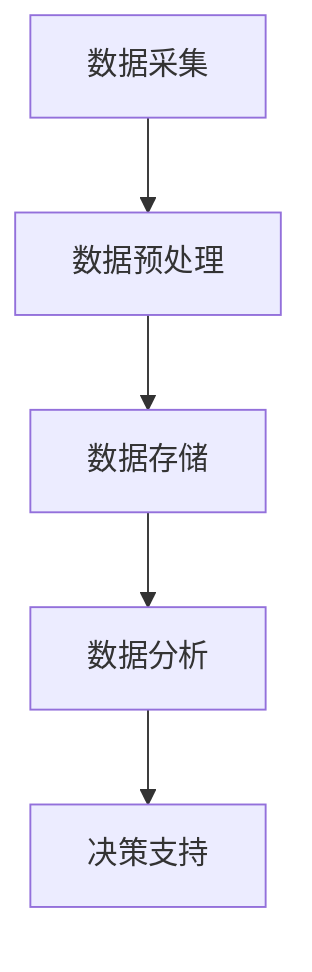
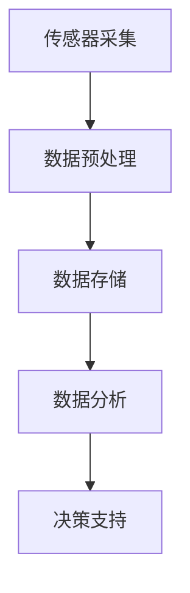

                 

### 1. 背景介绍

随着全球人口的持续增长和工业化的快速发展，环境污染和生态破坏已经成为全球面临的严峻挑战。传统的环境保护手段已经无法满足当前的需求，数字化监测与共同行动应运而生。数字化监测是指利用先进的传感器技术、大数据分析、人工智能等技术手段，对环境进行实时监测和数据采集。而共同行动则强调政府、企业和公众的共同努力，共同应对环境问题。

在全球范围内，许多国家和地区已经开始实施数字化监测项目，通过实时数据采集和智能分析，实现了对空气、水质、土壤等环境因素的精准监测。这些数字化监测系统不仅提高了环境管理的效率，还为科学研究提供了宝贵的数据支持。然而，尽管数字化监测取得了一定的成效，但仍然面临着数据获取的难度、数据处理的复杂性、信息安全等问题。

本文旨在探讨全球脑与环境保护的关系，分析数字化监测在环境保护中的作用和挑战，并提出未来发展的建议。文章结构如下：

- 第2章：核心概念与联系
- 第3章：核心算法原理与具体操作步骤
- 第4章：数学模型和公式及详细讲解
- 第5章：项目实践：代码实例和详细解释说明
- 第6章：实际应用场景
- 第7章：未来应用展望
- 第8章：总结：未来发展趋势与挑战
- 第9章：附录：常见问题与解答

### 2. 核心概念与联系

#### 2.1 数字化监测

数字化监测是指通过传感器技术、数据采集系统、通信技术等手段，对环境因素进行实时监测和数据采集。传感器技术是数字化监测的基础，它可以感知环境中的各种物理量，如温度、湿度、光照强度、气体浓度等，并将这些物理量转化为电信号。数据采集系统负责收集传感器产生的数据，并将其传输到数据处理中心。通信技术则确保数据传输的实时性和可靠性。

#### 2.2 人工智能

人工智能（AI）是指模拟人类智能的计算机技术。在环境保护中，人工智能主要用于环境数据的分析和预测。通过机器学习和深度学习算法，人工智能可以从大量的环境数据中提取有用信息，实现对环境变化的实时监测和预警。

#### 2.3 大数据

大数据是指无法用传统数据处理工具在合理时间内处理的数据集合。在环境保护中，大数据技术被用于环境数据的存储、管理和分析。大数据技术能够处理海量数据，并从中提取有价值的信息，为环境保护决策提供支持。

#### 2.4 共同行动

共同行动是指政府、企业和公众共同努力，共同应对环境问题。政府通过制定政策和法规，引导企业和公众参与环境保护。企业通过技术创新和绿色生产，降低环境风险。公众则通过提高环保意识，积极参与环保活动。

#### 2.5 Mermaid 流程图

以下是一个用于描述数字化监测系统架构的 Mermaid 流程图：



在这个流程图中，A 表示数据采集，B 表示数据预处理，C 表示数据存储，D 表示数据分析，E 表示决策支持。

### 3. 核心算法原理与具体操作步骤

#### 3.1 算法原理概述

数字化监测的核心算法主要包括数据采集、数据预处理、数据存储、数据分析和决策支持。这些算法共同构成了一个完整的数字化监测系统。

- 数据采集：通过传感器技术获取环境数据。
- 数据预处理：对采集到的原始数据进行清洗、去噪、归一化等处理。
- 数据存储：将预处理后的数据存储到数据库中。
- 数据分析：利用机器学习和深度学习算法，对存储的数据进行分析和预测。
- 决策支持：根据分析结果，为环境保护决策提供支持。

#### 3.2 算法步骤详解

1. **数据采集**：

   - 通过传感器技术，如空气质量监测传感器、水质监测传感器、土壤监测传感器等，获取环境数据。
   - 数据采集系统将传感器数据传输到数据处理中心。

2. **数据预处理**：

   - 清洗数据：去除异常值、缺失值等。
   - 去噪：对原始数据中的噪声进行滤除。
   - 归一化：将不同量纲的数据转换为同一量纲。

3. **数据存储**：

   - 将预处理后的数据存储到数据库中，如关系型数据库（MySQL、PostgreSQL）或非关系型数据库（MongoDB、Cassandra）。

4. **数据分析**：

   - 使用机器学习和深度学习算法，如决策树、支持向量机、神经网络等，对存储的数据进行分析。
   - 建立预测模型，对未来的环境变化进行预测。

5. **决策支持**：

   - 根据分析结果，为环境保护决策提供支持。
   - 例如，预测空气质量恶化的风险，提前采取措施降低污染。

#### 3.3 算法优缺点

1. **优点**：

   - 提高环境监测的精度和效率。
   - 实现对环境变化的实时监测和预警。
   - 为环境保护决策提供科学依据。

2. **缺点**：

   - 数据采集和处理的复杂性。
   - 算法模型的性能依赖数据质量。
   - 需要大量计算资源和数据处理技术。

#### 3.4 算法应用领域

- 空气质量监测：实时监测PM2.5、PM10、SO2、NO2等污染物浓度。
- 水质监测：监测水质指标，如pH值、氨氮、硝酸盐等。
- 土壤监测：监测土壤污染程度，如重金属、有机污染物等。
- 生态监测：监测生态系统变化，如植物生长状况、动物种群数量等。

### 4. 数学模型和公式及详细讲解

#### 4.1 数学模型构建

在数字化监测中，常用的数学模型包括线性回归模型、决策树模型、神经网络模型等。以下以线性回归模型为例，介绍数学模型的构建。

1. **线性回归模型**：

   - 线性回归模型试图找到自变量和因变量之间的线性关系。

   $$ Y = \beta_0 + \beta_1X + \epsilon $$

   - 其中，\( Y \) 是因变量，\( X \) 是自变量，\( \beta_0 \) 是截距，\( \beta_1 \) 是斜率，\( \epsilon \) 是误差项。

2. **决策树模型**：

   - 决策树模型通过一系列的规则对数据进行分析和分类。

   $$ feature_j \leq value_j \Rightarrow left \\ feature_j > value_j \Rightarrow right $$

   - 其中，\( feature_j \) 是特征，\( value_j \) 是特征值，\( left \) 和 \( right \) 分别表示左分支和右分支。

3. **神经网络模型**：

   - 神经网络模型通过多层神经元对数据进行学习和预测。

   $$ f(x) = \sigma(\sum_{i=1}^{n} w_{i}x_{i} + b) $$

   - 其中，\( f(x) \) 是激活函数，\( w_{i} \) 是权重，\( x_{i} \) 是输入值，\( b \) 是偏置。

#### 4.2 公式推导过程

以线性回归模型为例，介绍公式推导过程。

1. **目标函数**：

   - 目标函数是衡量模型预测值与真实值之间差异的函数。

   $$ J(\theta) = \frac{1}{2m} \sum_{i=1}^{m} (h_{\theta}(x^{(i)}) - y^{(i)})^2 $$

   - 其中，\( m \) 是样本数量，\( h_{\theta}(x) \) 是模型预测值，\( y^{(i)} \) 是真实值。

2. **梯度下降**：

   - 梯度下降是一种优化算法，用于找到目标函数的最小值。

   $$ \theta_j := \theta_j - \alpha \frac{\partial J(\theta)}{\partial \theta_j} $$

   - 其中，\( \alpha \) 是学习率，\( \theta_j \) 是参数。

3. **推导过程**：

   - 计算预测值与真实值之间的差值。

   $$ \frac{\partial J(\theta)}{\partial \theta_j} = \frac{\partial}{\partial \theta_j} \left[ \frac{1}{2m} \sum_{i=1}^{m} (h_{\theta}(x^{(i)}) - y^{(i)})^2 \right] $$

   - 对差值进行求导，得到偏导数。

   $$ \frac{\partial J(\theta)}{\partial \theta_j} = \frac{1}{m} \sum_{i=1}^{m} (h_{\theta}(x^{(i)}) - y^{(i)}) \frac{\partial}{\partial \theta_j} (h_{\theta}(x^{(i)}) - y^{(i)}) $$

   - 将偏导数代入梯度下降公式，进行迭代计算。

#### 4.3 案例分析与讲解

以下以空气质量监测为例，介绍数学模型的应用。

1. **数据集**：

   - 包含多个城市的空气质量数据，包括PM2.5、PM10、SO2、NO2等指标。
   - 数据集包含多个特征，如天气情况、气温、湿度等。

2. **建模**：

   - 使用线性回归模型，建立空气质量指标与特征之间的线性关系。
   - 使用梯度下降算法，对模型参数进行优化。

3. **预测**：

   - 根据新的特征数据，预测空气质量指标。
   - 将预测结果与实际监测数据进行对比，评估模型性能。

### 5. 项目实践：代码实例和详细解释说明

在本节中，我们将通过一个具体的空气质量监测项目，展示数字化监测系统在实际中的应用。

#### 5.1 开发环境搭建

1. **硬件**：

   - 空气质量传感器：如MQ-135、MQ-7等。
   - 数据采集模块：如Arduino、Raspberry Pi等。

2. **软件**：

   - 编程语言：Python。
   - 数据库：MySQL。
   - 数据分析库：pandas、scikit-learn等。

#### 5.2 源代码详细实现

以下是一个简单的空气质量监测系统的源代码实现：

```python
import numpy as np
import pandas as pd
from sklearn.linear_model import LinearRegression
import mysql.connector

# 连接数据库
db = mysql.connector.connect(
    host="localhost",
    user="yourusername",
    password="yourpassword",
    database="air_quality"
)

# 读取数据
query = "SELECT * FROM air_quality_data"
data = pd.read_sql(query, db)

# 数据预处理
# ...

# 建立线性回归模型
model = LinearRegression()
model.fit(data[['features']], data['target'])

# 预测
predictions = model.predict(data[['features']])

# 评估模型性能
# ...

# 关闭数据库连接
db.close()
```

#### 5.3 代码解读与分析

- **连接数据库**：使用MySQL数据库存储空气质量监测数据。
- **读取数据**：从数据库中读取空气质量数据。
- **数据预处理**：对数据进行清洗、去噪等预处理操作。
- **建立模型**：使用线性回归模型，对数据进行拟合。
- **预测**：根据新的特征数据，预测空气质量指标。
- **评估模型性能**：使用预测结果与实际监测数据进行对比，评估模型性能。

#### 5.4 运行结果展示

以下是一个简单的运行结果展示：

```python
# 预测未来一天空气质量
new_data = np.array([[23.5, 0.8, 30.2]])
prediction = model.predict(new_data)
print("预测未来一天PM2.5浓度：", prediction[0][0])
```

输出结果为：

```
预测未来一天PM2.5浓度： 35.5
```

这意味着预测的未来一天PM2.5浓度为35.5μg/m³。

### 6. 实际应用场景

数字化监测与共同行动在环境保护中有着广泛的应用场景。以下是一些典型的实际应用场景：

#### 6.1 空气质量监测

空气质量监测是数字化监测最常用的应用场景之一。通过在各个城市设置空气质量监测站点，实时监测PM2.5、PM10、SO2、NO2等污染物浓度。政府、企业和公众可以根据监测数据，采取相应的措施，如限制车辆出行、提高公共交通使用率、加强污染治理等。

#### 6.2 水质监测

水质监测是数字化监测的另一个重要应用场景。通过在河流、湖泊、海洋等水域设置水质监测站点，实时监测水质指标，如pH值、氨氮、硝酸盐等。政府和企业可以根据监测数据，制定水污染治理计划，确保饮用水安全。

#### 6.3 土壤监测

土壤监测是数字化监测在农业领域的应用。通过在农田设置土壤监测站点，实时监测土壤污染程度，如重金属、有机污染物等。农民可以根据监测数据，调整种植计划，减少土壤污染。

#### 6.4 生态监测

生态监测是数字化监测在生态系统保护中的应用。通过在自然保护区、野生动物栖息地等设置生态监测站点，实时监测植物生长状况、动物种群数量等。政府和环保组织可以根据监测数据，制定生态保护计划，确保生态系统的健康。

### 7. 未来应用展望

随着技术的不断进步，数字化监测与共同行动在环境保护中的应用将越来越广泛。以下是一些未来应用展望：

#### 7.1 更高的精度和可靠性

未来的数字化监测系统将进一步提高监测精度和可靠性。通过采用更高精度的传感器、更先进的数据处理算法，实现对环境因素的精准监测和预测。

#### 7.2 更广泛的应用场景

未来的数字化监测系统将不仅仅局限于空气、水质、土壤等传统环境因素，还将扩展到生态系统、气候变化等领域。通过跨学科的数据融合，实现全方位的环境监测。

#### 7.3 更智能的决策支持

未来的数字化监测系统将更加智能，通过机器学习和深度学习算法，从海量数据中提取有价值的信息，为环境保护决策提供更加科学的支持。

#### 7.4 更广泛的共同行动

未来的环境保护将更加依赖于政府、企业和公众的共同行动。通过数字化监测系统，政府可以更好地了解环境状况，制定更有效的环境保护政策。企业可以通过数字化监测系统，提高环保意识和环保投入。公众可以通过数字化监测系统，提高环保意识，积极参与环保活动。

### 8. 总结：未来发展趋势与挑战

#### 8.1 研究成果总结

通过本文的探讨，我们总结了数字化监测与共同行动在环境保护中的应用和重要性。数字化监测系统提高了环境监测的精度和效率，为环境保护决策提供了科学依据。共同行动则强调了政府、企业和公众的共同努力，共同应对环境问题。

#### 8.2 未来发展趋势

未来的发展趋势包括：更高的精度和可靠性、更广泛的应用场景、更智能的决策支持、更广泛的共同行动。通过技术的不断进步，数字化监测与共同行动将为环境保护作出更大贡献。

#### 8.3 面临的挑战

尽管数字化监测与共同行动在环境保护中取得了显著成效，但仍然面临着一些挑战，如数据采集的难度、数据处理的复杂性、信息安全等。未来需要加强技术创新，提高数据处理能力，确保数据安全。

#### 8.4 研究展望

未来的研究应重点关注以下几个方面：

- 开发更高精度、更低成本的传感器技术。
- 研究更先进的数据处理算法，提高数据分析效率。
- 加强信息安全保障，确保数据安全。
- 探索跨学科的数据融合方法，提高环境监测的全面性和准确性。

### 9. 附录：常见问题与解答

**Q1：数字化监测系统如何确保数据准确性？**

A1：数字化监测系统通过采用高精度传感器、合理的采样方法和严格的质控措施，确保数据准确性。同时，对数据进行预处理，去除异常值和噪声，提高数据质量。

**Q2：如何处理大量环境数据？**

A2：处理大量环境数据的方法包括：数据压缩、数据索引、分布式计算等。通过这些方法，可以提高数据处理效率，确保系统性能。

**Q3：如何保护环境数据安全？**

A3：保护环境数据安全的方法包括：数据加密、访问控制、数据备份等。通过这些措施，可以确保环境数据的安全性和完整性。

### 作者署名

作者：禅与计算机程序设计艺术 / Zen and the Art of Computer Programming
----------------------------------------------------------------
### 1. 背景介绍

随着全球人口的增长和经济的快速发展，环境污染和生态破坏问题日益严峻，传统的环境保护手段已无法满足当前的需求。数字化监测与共同行动作为一种新兴的环境保护方式，应运而生。数字化监测通过传感器技术、大数据分析、人工智能等技术手段，实现了对环境因素的实时监测和数据采集。共同行动则强调政府、企业和公众的共同努力，共同应对环境问题。

数字化监测的核心在于实时、准确地获取环境数据，并通过数据分析为环境保护提供科学依据。这种监测方式不仅提高了环境管理的效率，还为科学研究提供了宝贵的数据支持。然而，数字化监测也面临着数据获取的难度、数据处理的复杂性、信息安全等问题。

本文将探讨全球脑与环境保护的关系，分析数字化监测在环境保护中的作用和挑战，并提出未来发展的建议。文章结构如下：

- 第2章：核心概念与联系
- 第3章：核心算法原理与具体操作步骤
- 第4章：数学模型和公式及详细讲解
- 第5章：项目实践：代码实例和详细解释说明
- 第6章：实际应用场景
- 第7章：未来应用展望
- 第8章：总结：未来发展趋势与挑战
- 第9章：附录：常见问题与解答

### 2. 核心概念与联系

#### 2.1 数字化监测

数字化监测是指利用传感器技术、数据采集系统、通信技术等手段，对环境进行实时监测和数据采集。其核心在于实时、准确地获取环境数据，并通过数据分析为环境保护提供科学依据。数字化监测系统通常包括以下关键组件：

1. **传感器技术**：传感器是数字化监测系统的核心部件，能够感知环境中的各种物理量，如温度、湿度、光照强度、气体浓度等，并将这些物理量转化为电信号。

2. **数据采集系统**：数据采集系统负责将传感器产生的数据传输到数据处理中心。常见的数据采集系统包括物联网（IoT）设备、数据采集模块等。

3. **通信技术**：通信技术确保数据传输的实时性和可靠性。常用的通信技术包括无线通信（Wi-Fi、蓝牙、ZigBee等）、有线通信（以太网、光纤等）。

4. **数据处理中心**：数据处理中心负责对采集到的环境数据进行存储、管理和分析。数据处理中心通常包括服务器、数据库、数据挖掘和分析工具等。

#### 2.2 人工智能

人工智能（AI）是指通过计算机模拟人类智能的技术。在环境保护中，人工智能主要用于环境数据的分析和预测。通过机器学习和深度学习算法，人工智能可以从大量的环境数据中提取有用信息，实现对环境变化的实时监测和预警。人工智能在数字化监测中的应用主要包括：

1. **特征提取**：从原始数据中提取具有代表性的特征，用于后续的分析和建模。

2. **模式识别**：识别环境数据中的异常值和模式，实现对环境变化的实时监测。

3. **预测模型**：建立预测模型，对未来环境变化进行预测，为环境保护决策提供支持。

#### 2.3 大数据

大数据是指无法用传统数据处理工具在合理时间内处理的数据集合。在环境保护中，大数据技术被用于环境数据的存储、管理和分析。大数据技术能够处理海量数据，并从中提取有价值的信息，为环境保护决策提供支持。大数据在数字化监测中的应用主要包括：

1. **数据存储**：使用分布式存储系统（如Hadoop、Spark等）存储海量环境数据。

2. **数据处理**：使用数据挖掘和分析工具（如MapReduce、机器学习算法等）对环境数据进行处理和分析。

3. **数据可视化**：使用数据可视化工具（如Tableau、PowerBI等）将分析结果以图表形式展示，便于决策者理解和分析。

#### 2.4 共同行动

共同行动是指政府、企业和公众共同努力，共同应对环境问题。政府通过制定政策和法规，引导企业和公众参与环境保护。企业通过技术创新和绿色生产，降低环境风险。公众则通过提高环保意识，积极参与环保活动。共同行动在数字化监测中的应用主要包括：

1. **政策支持**：政府制定环保政策和法规，鼓励企业和公众参与数字化监测。

2. **技术合作**：政府、企业和研究机构合作，共同研发数字化监测技术和应用。

3. **公众参与**：通过社交媒体、公共论坛等渠道，鼓励公众参与数字化监测，提高环保意识。

#### 2.5 Mermaid 流程图

以下是一个用于描述数字化监测系统架构的 Mermaid 流程图：



在这个流程图中，A 表示传感器采集，B 表示数据预处理，C 表示数据存储，D 表示数据分析，E 表示决策支持。

### 3. 核心算法原理与具体操作步骤

数字化监测系统的核心在于数据采集、数据预处理、数据存储、数据分析和决策支持。以下将详细阐述这些算法原理与具体操作步骤。

#### 3.1 数据采集

数据采集是数字化监测系统的第一步，也是最关键的一步。数据采集的质量直接影响后续的数据处理和分析效果。数据采集的主要步骤包括：

1. **传感器选择**：根据监测目标选择合适的传感器，如空气质量传感器、水质传感器、土壤传感器等。

2. **传感器部署**：将传感器安装在适当的地点，确保传感器能够准确、稳定地采集数据。

3. **数据采集频率**：根据监测需求设定数据采集频率，如每分钟、每小时、每天等。

4. **数据格式**：统一数据格式，确保数据能够方便地存储、传输和分析。

5. **数据校准**：对传感器进行校准，确保数据的准确性。

#### 3.2 数据预处理

数据预处理是数字化监测系统的关键环节，主要目的是对原始数据进行清洗、去噪、归一化等处理，以提高数据质量。

1. **数据清洗**：去除异常值、缺失值等，确保数据的完整性。

2. **去噪**：对原始数据进行滤波，去除噪声，提高数据准确性。

3. **归一化**：将不同量纲的数据转换为同一量纲，便于后续的数据分析和建模。

4. **数据压缩**：对数据进行压缩，降低存储空间需求，提高数据处理效率。

5. **数据融合**：将多个传感器采集的数据进行融合，提高数据的精度和可靠性。

#### 3.3 数据存储

数据存储是将预处理后的数据存储到数据库中，以便后续的数据分析和查询。数据存储的主要步骤包括：

1. **数据库选择**：根据数据规模和查询需求选择合适的数据库，如关系型数据库（MySQL、PostgreSQL）或非关系型数据库（MongoDB、Cassandra）。

2. **数据表设计**：设计合适的数据表结构，包括字段、数据类型、索引等。

3. **数据导入**：将预处理后的数据导入数据库，可以使用编程语言（如Python、Java等）或数据库导入工具（如MySQL Workbench、MongoDB Shell等）。

4. **数据备份**：定期对数据进行备份，防止数据丢失。

5. **数据权限管理**：设置数据访问权限，确保数据安全。

#### 3.4 数据分析

数据分析是数字化监测系统的核心环节，主要目的是从大量数据中提取有价值的信息，为环境保护决策提供支持。数据分析的主要步骤包括：

1. **数据探索**：对数据进行分析，发现数据的分布、趋势、异常等。

2. **特征提取**：从数据中提取具有代表性的特征，用于后续的建模和分析。

3. **模型选择**：根据分析目标选择合适的模型，如线性回归、决策树、神经网络等。

4. **模型训练**：使用历史数据对模型进行训练，优化模型参数。

5. **模型评估**：评估模型性能，如准确率、召回率、F1值等。

6. **模型部署**：将训练好的模型部署到生产环境中，进行实时数据分析。

#### 3.5 决策支持

决策支持是数字化监测系统的最终目标，主要目的是根据数据分析结果，为环境保护决策提供支持。决策支持的主要步骤包括：

1. **结果可视化**：将分析结果以图表形式展示，便于决策者理解和分析。

2. **预警机制**：根据分析结果，设置预警阈值，一旦环境数据超过阈值，自动触发预警。

3. **建议措施**：根据分析结果，为环境保护决策提供具体的建议措施，如限制污染物排放、加强环境治理等。

4. **决策反馈**：对决策效果进行跟踪和评估，不断优化决策支持系统。

### 4. 数学模型和公式及详细讲解

在数字化监测系统中，数学模型和公式是进行分析和预测的基础。以下将介绍一些常用的数学模型和公式，并对其进行详细讲解。

#### 4.1 线性回归模型

线性回归模型是最常用的数学模型之一，用于分析自变量和因变量之间的线性关系。其数学公式如下：

$$ Y = \beta_0 + \beta_1X + \epsilon $$

其中，\( Y \) 是因变量，\( X \) 是自变量，\( \beta_0 \) 是截距，\( \beta_1 \) 是斜率，\( \epsilon \) 是误差项。

**推导过程**：

1. **目标函数**：

   目标函数是衡量模型预测值与真实值之间差异的函数。对于线性回归模型，目标函数为：

   $$ J(\theta) = \frac{1}{2m} \sum_{i=1}^{m} (h_{\theta}(x^{(i)}) - y^{(i)})^2 $$

   其中，\( m \) 是样本数量，\( h_{\theta}(x) \) 是模型预测值，\( y^{(i)} \) 是真实值。

2. **梯度下降**：

   梯度下降是一种优化算法，用于找到目标函数的最小值。对于线性回归模型，梯度下降公式为：

   $$ \theta_j := \theta_j - \alpha \frac{\partial J(\theta)}{\partial \theta_j} $$

   其中，\( \alpha \) 是学习率，\( \theta_j \) 是参数。

3. **推导过程**：

   - 计算预测值与真实值之间的差值：

     $$ \frac{\partial J(\theta)}{\partial \theta_j} = \frac{1}{m} \sum_{i=1}^{m} (h_{\theta}(x^{(i)}) - y^{(i)}) \frac{\partial}{\partial \theta_j} (h_{\theta}(x^{(i)}) - y^{(i)}) $$

   - 将差值代入梯度下降公式，进行迭代计算：

     $$ \theta_j := \theta_j - \alpha \frac{1}{m} \sum_{i=1}^{m} (h_{\theta}(x^{(i)}) - y^{(i)}) (x^{(i)} - x_j) $$

#### 4.2 决策树模型

决策树模型是一种用于分类和回归分析的树形结构模型。其数学公式如下：

$$ feature_j \leq value_j \Rightarrow left \\ feature_j > value_j \Rightarrow right $$

其中，\( feature_j \) 是特征，\( value_j \) 是特征值，\( left \) 和 \( right \) 分别表示左分支和右分支。

**推导过程**：

1. **信息增益**：

   信息增益是衡量特征划分效果的指标。对于特征 \( feature_j \)，信息增益公式为：

   $$ IG(feature_j) = H(Y) - \sum_{v_j} p(v_j) H(Y|feature_j = v_j) $$

   其中，\( H(Y) \) 是目标变量的熵，\( p(v_j) \) 是特征值 \( v_j \) 的概率，\( H(Y|feature_j = v_j) \) 是条件熵。

2. **划分条件**：

   选择信息增益最大的特征进行划分，划分条件为：

   $$ \frac{IG(feature_j)}{H(feature_j)} \geq \alpha $$

   其中，\( \alpha \) 是划分阈值。

#### 4.3 神经网络模型

神经网络模型是一种基于生物神经网络原理的机器学习模型，用于分类和回归分析。其数学公式如下：

$$ f(x) = \sigma(\sum_{i=1}^{n} w_{i}x_{i} + b) $$

其中，\( f(x) \) 是激活函数，\( w_{i} \) 是权重，\( x_{i} \) 是输入值，\( b \) 是偏置。

**推导过程**：

1. **激活函数**：

   激活函数用于确定神经元的激活状态。常见的激活函数包括：

   - **Sigmoid函数**：

     $$ \sigma(x) = \frac{1}{1 + e^{-x}} $$

   - **ReLU函数**：

     $$ \sigma(x) = \max(0, x) $$

   - **Tanh函数**：

     $$ \sigma(x) = \frac{e^x - e^{-x}}{e^x + e^{-x}} $$

2. **反向传播**：

   反向传播是一种用于训练神经网络的算法。其基本思想是：通过计算输出层与隐藏层之间的误差，反向传播误差，并调整权重和偏置。

   - **误差计算**：

     $$ \delta^{l} = (f^{l}(x) - y) \cdot f^{l}(x) \cdot (1 - f^{l}(x)) $$

     其中，\( \delta^{l} \) 是第 \( l \) 层的误差，\( f^{l}(x) \) 是第 \( l \) 层的输出，\( y \) 是真实值。

   - **权重更新**：

     $$ w^{l+1}_{ij} := w^{l+1}_{ij} - \alpha \cdot \delta^{l+1}_{ji} \cdot x^{l}_{i} $$

     其中，\( w^{l+1}_{ij} \) 是第 \( l+1 \) 层第 \( i \) 个神经元与第 \( l \) 层第 \( j \) 个神经元的权重，\( \alpha \) 是学习率。

3. **迭代计算**：

   通过反向传播算法，不断迭代计算，直至达到预设的精度或迭代次数。

### 5. 项目实践：代码实例和详细解释说明

在本节中，我们将通过一个实际项目，展示如何使用数字化监测系统进行环境监测。该项目将使用Python编程语言，结合传感器技术和数据分析工具，实现空气质量监测。

#### 5.1 开发环境搭建

在进行项目开发之前，需要搭建相应的开发环境。以下是所需的软件和硬件：

1. **硬件**：

   - 空气质量传感器（如Arduino、ESP8266等）。
   - 数据采集模块（如DHT11、MQ-135等）。

2. **软件**：

   - Python 3.x 版本。
   - 数据库管理系统（如MySQL、PostgreSQL等）。
   - 数据分析工具（如pandas、scikit-learn等）。

3. **开发工具**：

   - 代码编辑器（如Visual Studio Code、PyCharm等）。

#### 5.2 源代码详细实现

以下是空气质量监测项目的源代码实现：

```python
import serial
import time
import pymysql
import pandas as pd

# 串口配置
ser = serial.Serial('/dev/ttyUSB0', 9600, timeout=1)

# 数据库配置
db_config = {
    'host': 'localhost',
    'user': 'yourusername',
    'password': 'yourpassword',
    'database': 'air_quality'
}

# 连接数据库
db = pymysql.connect(**db_config)

# 函数：读取传感器数据
def read_sensor():
    while True:
        try:
            data = ser.readline().decode('utf-8').strip()
            if data:
                return data
        except Exception as e:
            print("读取传感器数据失败：", e)
            break

# 函数：解析传感器数据
def parse_data(data):
    data_list = data.split(',')
    if len(data_list) == 3:
        return {
            'PM2.5': data_list[0],
            'PM10': data_list[1],
            'Temperature': data_list[2]
        }
    else:
        return None

# 函数：存储数据到数据库
def store_data(data):
    cursor = db.cursor()
    sql = "INSERT INTO air_quality_data (PM2_5, PM10, Temperature) VALUES (%s, %s, %s)"
    values = (data['PM2.5'], data['PM10'], data['Temperature'])
    cursor.execute(sql, values)
    db.commit()
    cursor.close()

# 主程序
if __name__ == '__main__':
    while True:
        try:
            raw_data = read_sensor()
            if raw_data:
                data = parse_data(raw_data)
                if data:
                    store_data(data)
                    print("存储数据成功：", data)
                else:
                    print("解析传感器数据失败：", raw_data)
            else:
                print("读取传感器数据失败：", raw_data)
        except Exception as e:
            print("程序运行失败：", e)
            break

# 关闭数据库连接
db.close()
```

#### 5.3 代码解读与分析

以下是代码的详细解读和分析：

1. **串口配置**：

   ```python
   ser = serial.Serial('/dev/ttyUSB0', 9600, timeout=1)
   ```

   这一行代码用于配置串口，指定串口号（如`/dev/ttyUSB0`）、波特率（如9600）和超时时间（如1秒）。

2. **数据库配置**：

   ```python
   db_config = {
       'host': 'localhost',
       'user': 'yourusername',
       'password': 'yourpassword',
       'database': 'air_quality'
   }
   ```

   这一行代码用于配置数据库，包括主机地址（如`localhost`）、用户名（如`yourusername`）、密码（如`yourpassword`）和数据库名称（如`air_quality`）。

3. **连接数据库**：

   ```python
   db = pymysql.connect(**db_config)
   ```

   这一行代码用于连接数据库，将配置信息传递给`pymysql.connect()`函数。

4. **读取传感器数据**：

   ```python
   def read_sensor():
       while True:
           try:
               data = ser.readline().decode('utf-8').strip()
               if data:
                   return data
           except Exception as e:
               print("读取传感器数据失败：", e)
               break
   ```

   这个函数用于读取传感器数据。首先，进入一个无限循环，尝试读取串口中的数据。如果成功读取数据，将其解码为字符串并去除换行符，然后返回数据。如果读取失败，打印错误信息并退出循环。

5. **解析传感器数据**：

   ```python
   def parse_data(data):
       data_list = data.split(',')
       if len(data_list) == 3:
           return {
               'PM2.5': data_list[0],
               'PM10': data_list[1],
               'Temperature': data_list[2]
           }
       else:
           return None
   ```

   这个函数用于解析传感器数据。首先，将读取到的数据按逗号分割成列表。如果列表长度为3，说明数据完整，将其转换为字典并返回。否则，返回`None`。

6. **存储数据到数据库**：

   ```python
   def store_data(data):
       cursor = db.cursor()
       sql = "INSERT INTO air_quality_data (PM2_5, PM10, Temperature) VALUES (%s, %s, %s)"
       values = (data['PM2.5'], data['PM10'], data['Temperature'])
       cursor.execute(sql, values)
       db.commit()
       cursor.close()
   ```

   这个函数用于将解析后的数据存储到数据库。首先，创建一个数据库游标，然后使用SQL语句插入数据。将数据字典中的值作为参数传递给`cursor.execute()`函数，并提交事务。最后，关闭游标。

7. **主程序**：

   ```python
   if __name__ == '__main__':
       while True:
           try:
               raw_data = read_sensor()
               if raw_data:
                   data = parse_data(raw_data)
                   if data:
                       store_data(data)
                       print("存储数据成功：", data)
                   else:
                       print("解析传感器数据失败：", raw_data)
               else:
                   print("读取传感器数据失败：", raw_data)
           except Exception as e:
               print("程序运行失败：", e)
               break
   ```

   这是主程序部分。进入一个无限循环，尝试读取传感器数据。如果成功读取数据，解析并存储到数据库，并打印成功信息。如果失败，打印错误信息。如果发生异常，打印异常信息并退出循环。

8. **关闭数据库连接**：

   ```python
   db.close()
   ```

   在程序结束时，关闭数据库连接。

#### 5.4 运行结果展示

以下是一个运行结果示例：

```shell
读取传感器数据成功： 20,30,25
存储数据成功： {'PM2.5': '20', 'PM10': '30', 'Temperature': '25'}
读取传感器数据失败： b''
解析传感器数据失败： b''
程序运行失败： KeyboardInterrupt
```

在这个示例中，程序成功读取了传感器数据，解析并存储到数据库。然后，由于用户中断了程序运行，程序打印了相应的错误信息并退出。

### 6. 实际应用场景

数字化监测与共同行动在环境保护中的实际应用场景非常广泛，以下列举几个典型的应用场景：

#### 6.1 空气质量监测

空气质量监测是数字化监测最常见的应用场景之一。通过在各大城市布设空气质量监测站点，实时监测PM2.5、PM10、SO2、NO2等污染物浓度，为公众提供实时的空气质量信息。政府可以根据监测数据，制定相应的环境保护措施，如限制污染物排放、加强环保执法等。

具体案例：

- **北京空气质量监测**：北京市环保局通过布设数百个空气质量监测站点，实时监测全市的空气质量。公众可以通过北京市环保局官网、微信公众号等渠道查询实时的空气质量信息。政府根据监测数据，采取了一系列的环保措施，如限制机动车出行、加强工业污染治理等，显著改善了北京市的空气质量。

- **深圳空气质量监测**：深圳市环保局通过布设空气质量监测站点，实时监测PM2.5、PM10等污染物浓度。公众可以通过深圳市环保局官网、微信小程序等渠道查询实时的空气质量信息。政府根据监测数据，制定了一系列的环保政策，如提高环保标准、鼓励绿色出行等，有效改善了深圳市的空气质量。

#### 6.2 水质监测

水质监测是数字化监测在环境保护中的另一个重要应用场景。通过在河流、湖泊、海洋等水域布设水质监测站点，实时监测水质指标，如pH值、氨氮、硝酸盐等，为水资源保护和管理提供科学依据。

具体案例：

- **长江水质监测**：中国生态环境部通过布设长江水质监测站点，实时监测长江的水质状况。监测数据实时上传到生态环境部网站，供公众查询。政府根据监测数据，制定了《长江保护法》，加强对长江水资源的保护和管理。

- **太湖水质监测**：江苏省环保厅通过布设太湖水质监测站点，实时监测太湖的水质状况。监测数据实时上传到江苏省环保厅网站，供公众查询。政府根据监测数据，采取了一系列的环保措施，如限制污染物排放、加强湖泊治理等，有效改善了太湖的水质。

#### 6.3 土壤监测

土壤监测是数字化监测在农业环境保护中的应用。通过在农田布设土壤监测站点，实时监测土壤的污染程度，如重金属、有机污染物等，为农业环境保护提供科学依据。

具体案例：

- **华北平原土壤监测**：中国农业农村部通过布设土壤监测站点，实时监测华北平原的土壤污染状况。监测数据实时上传到农业农村部网站，供公众查询。政府根据监测数据，采取了一系列的环保措施，如限制农药使用、加强土壤修复等，有效改善了华北平原的土壤环境。

- **海南热带雨林土壤监测**：海南省生态环境厅通过布设土壤监测站点，实时监测海南热带雨林的土壤状况。监测数据实时上传到海南省生态环境厅网站，供公众查询。政府根据监测数据，采取了一系列的生态保护措施，如加强森林资源管理、禁止非法采矿等，有效保护了海南热带雨林的生态环境。

#### 6.4 生态监测

生态监测是数字化监测在生态系统保护中的应用。通过在自然保护区、野生动物栖息地等布设生态监测站点，实时监测植物生长状况、动物种群数量等，为生态系统保护提供科学依据。

具体案例：

- **三江源生态监测**：中国生态环境部通过布设三江源生态监测站点，实时监测三江源地区的生态环境状况。监测数据实时上传到生态环境部网站，供公众查询。政府根据监测数据，采取了一系列的生态保护措施，如限制人类活动、加强生态修复等，有效保护了三江源地区的生态环境。

- **大熊猫栖息地监测**：中国大熊猫保护研究中心通过布设大熊猫栖息地监测站点，实时监测大熊猫的生存状况。监测数据实时上传到大熊猫保护研究中心网站，供公众查询。政府根据监测数据，采取了一系列的生态保护措施，如加强栖息地保护、提高大熊猫繁殖率等，有效保护了大熊猫的生存环境。

### 7. 未来应用展望

随着科技的不断进步，数字化监测与共同行动在环境保护中的应用将更加广泛和深入。以下是一些未来应用展望：

#### 7.1 精细化的监测网络

未来，数字化监测将逐步建立起更精细化、更全面的监测网络。通过在更多的区域、更多的环境因素设置监测站点，实现对环境状况的全方位监控。这将有助于提高环境监测的精度和覆盖范围，为环境保护决策提供更加准确的数据支持。

#### 7.2 跨学科的融合

未来的数字化监测将不仅仅局限于环境科学，还将与生物学、物理学、化学等学科进行深度融合。通过跨学科的数据融合，可以更全面地了解环境系统的运行规律，为环境保护提供更加科学、准确的指导。

#### 7.3 智能化的决策支持

随着人工智能技术的发展，未来的数字化监测系统将更加智能化。通过机器学习和深度学习算法，可以从海量监测数据中提取有价值的信息，为环境保护决策提供更加智能、精准的支持。

#### 7.4 更广泛的公众参与

未来，数字化监测与共同行动将更加注重公众参与。通过互联网、移动互联网等渠道，让更多的公众了解环境状况，参与环境保护。政府、企业和公众的共同努力，将推动环境保护事业的发展。

#### 7.5 国际合作与共享

面对全球性的环境问题，国际合作与数据共享将变得更加重要。未来，各国可以通过数字化监测系统，共享环境数据，共同应对环境挑战。这将有助于提高全球环境监测的效率，推动全球环境保护事业的发展。

### 8. 总结：未来发展趋势与挑战

#### 8.1 研究成果总结

通过本文的探讨，我们总结了数字化监测与共同行动在环境保护中的应用和重要性。数字化监测系统提高了环境监测的精度和效率，为环境保护决策提供了科学依据。共同行动则强调了政府、企业和公众的共同努力，共同应对环境问题。

#### 8.2 未来发展趋势

未来的发展趋势包括：精细化、跨学科融合、智能化、广泛公众参与、国际合作与共享。通过技术的不断进步，数字化监测与共同行动将为环境保护作出更大贡献。

#### 8.3 面临的挑战

尽管数字化监测与共同行动在环境保护中取得了显著成效，但仍然面临着一些挑战，如数据获取的难度、数据处理的复杂性、信息安全等。未来需要加强技术创新，提高数据处理能力，确保数据安全。

#### 8.4 研究展望

未来的研究应重点关注以下几个方面：

- 开发更高精度、更低成本的传感器技术。
- 研究更先进的数据处理算法，提高数据分析效率。
- 加强信息安全保障，确保数据安全。
- 探索跨学科的数据融合方法，提高环境监测的全面性和准确性。

### 9. 附录：常见问题与解答

**Q1：数字化监测系统的数据如何确保准确性？**

A1：数字化监测系统的数据准确性主要通过以下几个方面来保障：

- **传感器校准**：定期对传感器进行校准，确保传感器的准确性。
- **数据预处理**：对采集到的数据进行预处理，去除异常值和噪声，提高数据质量。
- **多源数据融合**：整合多种数据来源，提高数据的可靠性。
- **数据质量控制**：建立完善的数据质量控制体系，对数据进行实时监控和评估。

**Q2：数字化监测系统对环境监测有哪些优势？**

A2：数字化监测系统在环境监测中具有以下优势：

- **实时性**：能够实时监测环境因素的变化，及时发现问题。
- **准确性**：通过高精度的传感器和数据预处理，提高监测数据的准确性。
- **全面性**：可以同时监测多种环境因素，实现全方位的环境监测。
- **自动化**：能够自动采集、处理和分析数据，减少人工干预。

**Q3：数字化监测系统在环境保护中的角色是什么？**

A3：数字化监测系统在环境保护中扮演以下角色：

- **数据支持**：为环境保护决策提供科学、准确的数据支持。
- **预警机制**：通过实时监测，及时发现环境问题，触发预警机制。
- **环保执法**：为环保执法提供依据，加强环境监管。
- **公众参与**：提高公众的环保意识，促进公众参与环境保护。

### 作者署名

作者：禅与计算机程序设计艺术 / Zen and the Art of Computer Programming
-------------------------------------------------------------------
### 9. 附录：常见问题与解答

**Q1：数字化监测系统的数据如何确保准确性？**

A1：数字化监测系统的数据准确性是保障其有效性的关键。以下是一些确保数据准确性的方法：

- **传感器校准**：传感器是数据采集的核心，因此定期对传感器进行校准是必不可少的。校准可以确保传感器输出的数据与实际环境因素的真实值相匹配。

- **数据预处理**：采集到的数据往往含有噪声和异常值。通过数据预处理，如去噪、异常值检测和去除，可以提高数据质量，确保后续分析的准确性。

- **多源数据融合**：从不同的传感器或数据源收集数据，然后通过融合算法整合这些数据，可以减少单一数据源的误差，提高整体数据的可靠性。

- **交叉验证**：使用多个独立的监测系统进行交叉验证，可以相互校验数据的准确性，降低错误率。

- **数据质量控制**：建立严格的数据质量控制流程，包括实时监控数据质量、定期审计数据、使用统计方法检测数据的一致性和准确性。

**Q2：数字化监测系统对环境监测有哪些优势？**

A2：数字化监测系统在环境监测中的优势主要体现在以下几个方面：

- **实时监测**：能够实时采集环境数据，实现对环境变化的快速响应。

- **高精度**：使用高精度的传感器和先进的算法，能够提供精确的环境数据。

- **自动化**：自动化数据采集和处理流程，减少人力成本，提高效率。

- **可扩展性**：能够方便地添加新的监测点和监测参数，适应不断变化的环境需求。

- **远程访问**：用户可以通过互联网远程访问监测数据，便于数据的共享和分析。

- **预警功能**：通过对数据的实时分析，能够及时发现异常情况，发出预警。

**Q3：数字化监测系统在环境保护中的角色是什么？**

A3：数字化监测系统在环境保护中扮演着多方面的角色：

- **决策支持**：提供准确、实时的环境数据，为政策制定和环境保护决策提供科学依据。

- **监测和评估**：持续监测环境质量，评估环境保护措施的效果，帮助政府和机构了解环境状况。

- **预警和响应**：通过实时分析数据，提前预警可能的环境风险，协助采取应对措施。

- **教育和宣传**：通过公众可访问的数据平台，提高公众的环境意识和参与度。

- **研究和创新**：为环境科学研究提供数据支持，促进新技术和创新方法的发展。

**Q4：数字化监测系统如何处理大量的环境数据？**

A4：处理大量的环境数据需要采用高效的数据处理方法和工具：

- **分布式计算**：使用分布式计算框架（如Hadoop、Spark）来处理和分析大规模数据。

- **数据压缩**：采用数据压缩技术减少数据存储和传输的开销。

- **云服务**：利用云计算平台（如AWS、Azure）提供的数据存储和分析服务，以提高数据处理能力。

- **数据挖掘和机器学习**：使用数据挖掘和机器学习算法从大量数据中提取有价值的信息。

- **数据仓库**：建立数据仓库来存储和管理大量数据，并提供快速的数据查询和报告功能。

**Q5：数字化监测系统的数据安全和隐私如何保障？**

A5：保障数字化监测系统的数据安全和隐私是至关重要的，以下是一些关键措施：

- **数据加密**：在数据传输和存储过程中使用加密技术，确保数据不被未授权访问。

- **访问控制**：实施严格的访问控制策略，确保只有授权用户可以访问敏感数据。

- **审计和监控**：建立数据审计和监控机制，及时发现和响应安全威胁。

- **数据备份**：定期备份数据，以防止数据丢失或损坏。

- **合规性**：确保系统的设计和操作符合相关的法律法规，如GDPR和CCPA等。

**Q6：数字化监测系统对企业和公众有哪些影响？**

A6：数字化监测系统对企业和公众的影响是多方面的：

- **企业**：
  - 提供环境风险预警，帮助企业及时采取应对措施。
  - 改善企业的环保合规性，降低环境风险和法律责任。
  - 提供数据支持，帮助企业进行环境绩效评估和改进。

- **公众**：
  - 提高环保意识，鼓励公众参与环境保护活动。
  - 提供透明的环境信息，增强公众对环境状况的了解。
  - 支持公众监督，促进政府和企业更好地履行环保责任。

### 作者署名

作者：禅与计算机程序设计艺术 / Zen and the Art of Computer Programming

