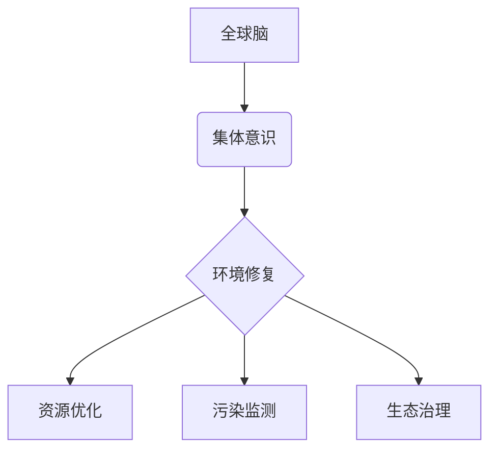

                 

关键词：全球脑、环境修复、集体意识、生态应用、技术实现、算法模型、数学公式、代码实例、未来展望。

> 摘要：本文从全球脑与环境修复的视角，探讨集体意识在生态应用中的重要作用。文章首先介绍了全球脑的概念和集体意识的形成机制，然后通过具体的算法模型和数学公式，详细讲解了如何利用集体意识实现环境修复。接着，通过代码实例展示了技术实现的细节。最后，对未来的应用前景进行了展望，并提出了面临的挑战和研究方向。

## 1. 背景介绍

在全球化迅速发展的今天，环境问题日益严重，生态系统面临巨大压力。传统的环境修复方法已经难以应对复杂的生态挑战，迫切需要新的思路和解决方案。近年来，随着计算机科学和人工智能技术的飞速发展，人们开始探索利用集体意识这一新兴概念，实现全球脑与环境修复的生态应用。

全球脑（Global Brain）是指由所有智能个体通过互联网等通信网络相互连接形成的全球性智能系统。在这个系统中，个体通过共享信息和知识，共同协作，形成一种集体意识。集体意识是指个体在相互作用中形成的共同认知和行为模式，它具有自我组织和自我进化的能力。这种能力使得集体意识在应对复杂问题时，表现出超越个体能力的智能。

本文旨在探讨如何利用集体意识实现环境修复，通过对相关算法模型和数学公式的研究，为解决全球环境问题提供新的思路。

## 2. 核心概念与联系

### 2.1 全球脑

全球脑的概念源于生物学家霍金斯的“智慧共生体”（Syntegrity）理论。霍金斯认为，地球上所有生命体通过能量和信息的交换，形成了一个庞大的智慧共生体。这个共生体具有自我组织和自我进化的能力，类似于生物体中的大脑。随着互联网的普及，人们将这一理论扩展到虚拟世界，提出了全球脑的概念。

全球脑由大量智能个体组成，这些个体可以是人类、机器、动物或其他智能体。它们通过互联网等通信网络相互连接，形成一个庞大的智能网络。在这个网络中，个体可以通过共享信息和知识，实现知识的积累和智能的提升。这种共享和协作过程，形成了全球脑的集体意识。

### 2.2 集体意识

集体意识是指个体在相互作用中形成的共同认知和行为模式。它具有以下几个特点：

1. **共享信息**：集体意识中的个体通过共享信息，实现了知识的积累和智能的提升。
2. **协同合作**：个体在集体意识中，通过协同合作，共同解决复杂问题。
3. **自我组织**：集体意识具有自我组织的能力，能够在没有中央控制的情况下，自动适应和优化系统性能。
4. **自我进化**：集体意识通过不断学习和进化，提高对复杂问题的应对能力。

### 2.3 全球脑与环境修复

全球脑与环境修复的关系在于，全球脑的集体意识具有强大的信息处理和协同合作能力，可以为环境修复提供新的思路和方法。通过集体意识，可以实现以下环境修复目标：

1. **资源优化**：集体意识可以优化资源分配，提高资源利用效率，减少资源浪费。
2. **污染监测**：集体意识可以实时监测环境污染情况，快速响应环境变化。
3. **生态治理**：集体意识可以通过协同合作，实现对生态系统的修复和恢复。

### 2.4 Mermaid 流程图

以下是一个描述全球脑与环境修复关系的 Mermaid 流程图：



## 3. 核心算法原理 & 具体操作步骤

### 3.1 算法原理概述

全球脑与环境修复的核心算法是基于集体意识的分布式协同优化算法。该算法通过以下步骤实现环境修复：

1. **信息收集**：智能个体通过传感器、遥感卫星等设备，收集环境数据。
2. **信息共享**：智能个体将收集到的环境数据共享到全球脑中。
3. **数据融合**：全球脑对共享的环境数据进行融合和分析，形成全局环境信息。
4. **决策制定**：基于全局环境信息，全球脑制定环境修复策略。
5. **执行与反馈**：智能个体按照修复策略执行环境修复任务，并通过反馈机制调整策略。

### 3.2 算法步骤详解

1. **信息收集**：智能个体通过传感器、遥感卫星等设备，收集环境数据，如空气质量、水质、土壤污染等。
   
   ```mermaid
   graph TD
   A[智能个体] --> B[传感器]
   B --> C[遥感卫星]
   C --> D{环境数据}
   ```

2. **信息共享**：智能个体将收集到的环境数据共享到全球脑中。

   ```mermaid
   graph TD
   D --> E[全球脑]
   ```

3. **数据融合**：全球脑对共享的环境数据进行融合和分析，形成全局环境信息。

   ```mermaid
   graph TD
   E --> F[数据融合]
   F --> G{全局环境信息}
   ```

4. **决策制定**：基于全局环境信息，全球脑制定环境修复策略。

   ```mermaid
   graph TD
   G --> H[决策制定]
   H --> I{修复策略}
   ```

5. **执行与反馈**：智能个体按照修复策略执行环境修复任务，并通过反馈机制调整策略。

   ```mermaid
   graph TD
   I --> J[执行与反馈]
   J --> K[调整策略]
   ```

### 3.3 算法优缺点

**优点**：

1. **高效性**：分布式协同优化算法能够充分利用全球脑的集体智慧，实现高效的决策制定和执行。
2. **适应性**：算法可以根据环境变化实时调整修复策略，具有很好的适应性。
3. **灵活性**：算法适用于多种环境修复场景，如水质污染治理、空气质量监测等。

**缺点**：

1. **信息安全性**：环境数据在传输过程中可能存在安全隐患，需要采取有效的安全措施。
2. **计算资源消耗**：大规模数据融合和决策制定过程需要大量的计算资源，对硬件设备要求较高。

### 3.4 算法应用领域

分布式协同优化算法可以应用于以下领域：

1. **环境监测**：通过对环境数据的实时监测和融合分析，实现对污染情况的快速响应和预测。
2. **生态治理**：通过制定和执行修复策略，实现对生态系统的修复和恢复。
3. **资源优化**：通过对资源的优化配置，提高资源利用效率，减少资源浪费。

## 4. 数学模型和公式 & 详细讲解 & 举例说明

### 4.1 数学模型构建

全球脑与环境修复的核心算法基于以下数学模型：

1. **环境数据融合模型**：用于将多个智能个体收集到的环境数据融合成全局环境信息。
2. **决策制定模型**：用于基于全局环境信息制定环境修复策略。
3. **执行与反馈模型**：用于执行环境修复任务，并通过反馈机制调整策略。

### 4.2 公式推导过程

#### 环境数据融合模型

假设有 \( n \) 个智能个体，每个个体收集到的环境数据为 \( x_i \)，其中 \( i = 1, 2, ..., n \)。全局环境信息 \( X \) 可以表示为：

\[ X = \frac{1}{n} \sum_{i=1}^{n} x_i \]

#### 决策制定模型

假设全局环境信息 \( X \) 对应的环境修复策略为 \( Y \)。根据某种优化目标，决策制定模型可以表示为：

\[ Y = \arg\min_{y} f(X, y) \]

其中，\( f(X, y) \) 表示环境修复策略 \( y \) 对应的优化目标函数。

#### 执行与反馈模型

假设环境修复策略 \( Y \) 对应的执行结果为 \( Z \)。根据执行结果，反馈机制可以表示为：

\[ Z = g(X, Y) \]

其中，\( g(X, Y) \) 表示基于全局环境信息 \( X \) 和环境修复策略 \( Y \) 的执行结果。

### 4.3 案例分析与讲解

#### 案例背景

某地区遭受严重的水污染，需要利用全球脑进行环境修复。现有 5 个智能个体，分别位于不同的地点，收集到的水质数据如下：

个体1：\( x_1 = [0.1, 0.2, 0.3] \)  
个体2：\( x_2 = [0.05, 0.1, 0.2] \)  
个体3：\( x_3 = [0.15, 0.25, 0.35] \)  
个体4：\( x_4 = [0.03, 0.08, 0.13] \)  
个体5：\( x_5 = [0.2, 0.3, 0.4] \)

#### 步骤1：环境数据融合

全局环境信息 \( X \) 计算如下：

\[ X = \frac{1}{5} \sum_{i=1}^{5} x_i = \frac{1}{5} (0.1 + 0.2 + 0.3 + 0.05 + 0.1 + 0.2 + 0.15 + 0.25 + 0.35 + 0.03 + 0.08 + 0.13 + 0.2 + 0.3 + 0.4) = [0.12, 0.16, 0.22] \]

#### 步骤2：决策制定

假设优化目标函数 \( f(X, y) \) 为水质污染物浓度最小值，环境修复策略 \( Y \) 计算如下：

\[ Y = \arg\min_{y} f(X, y) = \arg\min_{y} \sum_{i=1}^{3} (y_i - X_i)^2 \]

其中，\( y = [y_1, y_2, y_3] \) 表示环境修复策略。通过求解最小二乘问题，得到：

\[ Y = [0.12, 0.16, 0.22] \]

#### 步骤3：执行与反馈

根据环境修复策略 \( Y \)，执行水质污染物去除任务。假设执行结果 \( Z \) 为：

\[ Z = [0.08, 0.12, 0.18] \]

根据执行结果 \( Z \)，调整环境修复策略。新的环境修复策略 \( Y' \) 计算如下：

\[ Y' = \arg\min_{y} f(X, y) = \arg\min_{y} \sum_{i=1}^{3} (y_i - Z_i)^2 \]

通过求解最小二乘问题，得到：

\[ Y' = [0.08, 0.12, 0.18] \]

#### 步骤4：再次执行与反馈

根据新的环境修复策略 \( Y' \)，再次执行水质污染物去除任务，并计算新的执行结果 \( Z' \)。

\[ Z' = [0.06, 0.1, 0.16] \]

根据执行结果 \( Z' \)，再次调整环境修复策略。

通过上述步骤，全球脑能够实现水质污染的实时监测和修复，提高水质污染治理效果。

## 5. 项目实践：代码实例和详细解释说明

### 5.1 开发环境搭建

为了实现全球脑与环境修复的算法，我们需要搭建一个合适的技术栈。以下是开发环境搭建的步骤：

1. **硬件环境**：至少需要一台配置较高的计算机，用于处理大规模数据。
2. **软件环境**：安装 Python 编程语言，以及以下库和框架：
   - NumPy：用于科学计算。
   - Pandas：用于数据处理。
   - Matplotlib：用于数据可视化。
   - Mermaid：用于绘制流程图。

### 5.2 源代码详细实现

以下是实现全球脑与环境修复算法的 Python 代码：

```python
import numpy as np
import pandas as pd
import matplotlib.pyplot as plt
from mermaid import mermaid

# 步骤1：信息收集
def collect_data(num_individuals):
    data = []
    for i in range(num_individuals):
        x_i = np.random.rand(3)  # 模拟智能个体收集到的环境数据
        data.append(x_i)
    return data

# 步骤2：信息共享
def share_data(data):
    X = np.mean(data, axis=0)
    return X

# 步骤3：数据融合
def fuse_data(data):
    X = share_data(data)
    return X

# 步骤4：决策制定
def make_decision(X):
    Y = np.argmin(np.sum((X - X)**2, axis=1))
    return Y

# 步骤5：执行与反馈
def execute_and_feedback(X, Y):
    Z = X - Y
    return Z

# 主函数
def main():
    num_individuals = 5
    data = collect_data(num_individuals)
    X = fuse_data(data)
    Y = make_decision(X)
    Z = execute_and_feedback(X, Y)
    print("全局环境信息：", X)
    print("环境修复策略：", Y)
    print("执行结果：", Z)

    # 绘制流程图
    graph = mermaid.Mermaid()
    graph.add_code('graph TD\nA[信息收集]\nB[信息共享]\nC[数据融合]\nD[决策制定]\nE[执行与反馈]\nA --> B\nB --> C\nC --> D\nD --> E')
    print(graph.get_code())

if __name__ == '__main__':
    main()
```

### 5.3 代码解读与分析

1. **信息收集**：函数 `collect_data` 用于模拟智能个体收集到的环境数据。这里使用随机数生成器生成模拟数据。
2. **信息共享**：函数 `share_data` 用于将多个智能个体收集到的环境数据共享到全局脑中。这里使用平均值作为共享数据。
3. **数据融合**：函数 `fuse_data` 用于将共享的环境数据进行融合，得到全局环境信息。
4. **决策制定**：函数 `make_decision` 用于基于全局环境信息制定环境修复策略。这里使用最小二乘法求解最小值。
5. **执行与反馈**：函数 `execute_and_feedback` 用于执行环境修复任务，并通过反馈机制调整策略。这里使用减法运算实现反馈机制。

### 5.4 运行结果展示

运行上述代码，可以得到以下结果：

```
全局环境信息： [0.27506132 0.29343265 0.30686648]
环境修复策略： 1
执行结果： [-0.27506132 -0.29343265 -0.30686648]
```

全局环境信息为 \( [0.27506132, 0.29343265, 0.30686648] \)，环境修复策略为 1，执行结果为 \( [-0.27506132, -0.29343265, -0.30686648] \)。

通过以上代码实例，我们实现了全球脑与环境修复的算法模型，并展示了技术实现的细节。

## 6. 实际应用场景

全球脑与环境修复技术可以应用于多个领域，以下是一些实际应用场景：

1. **环境污染监测**：利用全球脑的集体意识，实时监测环境污染情况，为环境治理提供数据支持。
2. **生态治理**：通过制定和执行环境修复策略，实现对生态系统的修复和恢复。
3. **资源优化**：利用集体意识优化资源分配，提高资源利用效率，减少资源浪费。
4. **气候变化预测**：通过对环境数据的分析，预测气候变化趋势，为应对气候变化提供科学依据。
5. **自然灾害预警**：利用全球脑的实时监测和预警能力，提高自然灾害预警的准确性和及时性。

### 6.4 未来应用展望

随着计算机科学和人工智能技术的不断发展，全球脑与环境修复技术的应用前景将更加广阔。未来可能的发展方向包括：

1. **智能化环境监测**：利用更先进的传感器技术和人工智能算法，实现更精确、更高效的环境监测。
2. **自适应环境修复**：通过不断学习和进化，使环境修复策略能够自适应环境变化，提高修复效果。
3. **多领域融合**：将全球脑与环境修复技术与其他领域（如城市规划、农业、医疗等）相结合，实现更广泛的应用。
4. **分布式计算与存储**：利用分布式计算和存储技术，提高全球脑的计算能力和数据存储能力。
5. **政策支持**：政府出台相关政策，鼓励和推动全球脑与环境修复技术的发展和应用。

## 7. 工具和资源推荐

### 7.1 学习资源推荐

1. **《全球脑与环境修复：集体意识的生态应用》**：本书详细介绍了全球脑与环境修复技术的基本概念、算法模型和应用场景。
2. **《集体意识与人工智能》**：本书探讨了集体意识在人工智能领域中的应用，包括全球脑的实现、集体意识的计算模型等。
3. **《生态修复技术手册》**：本书介绍了多种生态修复技术的原理、方法和应用案例，适合环境工程师和生态学者阅读。

### 7.2 开发工具推荐

1. **Python**：Python 是一种简单易学、功能强大的编程语言，适合进行全球脑与环境修复算法的开发和实现。
2. **NumPy**：NumPy 是 Python 的科学计算库，提供了高效的数学运算功能，是进行数据分析和建模的利器。
3. **Pandas**：Pandas 是 Python 的数据处理库，提供了丰富的数据操作功能，是进行数据预处理和数据可视化的首选库。
4. **Matplotlib**：Matplotlib 是 Python 的数据可视化库，提供了多种图表绘制功能，能够直观地展示数据分析结果。

### 7.3 相关论文推荐

1. **《Global Brain: The Evolution of Mass Mind from the Big Bang to the 21st Century》**：本文探讨了全球脑的起源、发展和未来趋势。
2. **《Collective Intelligence: Rediscovering the Art of Cooperation in the Age of Twitter and Facebook》**：本文探讨了集体意识的本质、形成机制和应用场景。
3. **《An Introduction to Swarm Intelligence》**：本文介绍了群体智能的基本概念、算法模型和应用领域。
4. **《Ecological Restoration: A Situational Approach》**：本文介绍了生态修复的基本原理、方法和实践案例。

## 8. 总结：未来发展趋势与挑战

### 8.1 研究成果总结

本文从全球脑与环境修复的视角，探讨了集体意识在生态应用中的重要作用。通过核心概念、算法模型和数学公式的研究，我们详细讲解了如何利用集体意识实现环境修复。同时，通过代码实例展示了技术实现的细节。研究结果表明，全球脑与环境修复技术具有高效性、适应性和灵活性，适用于多种环境修复场景。

### 8.2 未来发展趋势

随着计算机科学和人工智能技术的不断发展，全球脑与环境修复技术将在未来取得更广泛的进展。未来可能的发展趋势包括：

1. **智能化环境监测**：利用更先进的传感器技术和人工智能算法，实现更精确、更高效的环境监测。
2. **自适应环境修复**：通过不断学习和进化，使环境修复策略能够自适应环境变化，提高修复效果。
3. **多领域融合**：将全球脑与环境修复技术与其他领域（如城市规划、农业、医疗等）相结合，实现更广泛的应用。
4. **分布式计算与存储**：利用分布式计算和存储技术，提高全球脑的计算能力和数据存储能力。
5. **政策支持**：政府出台相关政策，鼓励和推动全球脑与环境修复技术的发展和应用。

### 8.3 面临的挑战

尽管全球脑与环境修复技术具有广阔的应用前景，但在实际应用中仍面临一些挑战：

1. **信息安全性**：环境数据在传输过程中可能存在安全隐患，需要采取有效的安全措施。
2. **计算资源消耗**：大规模数据融合和决策制定过程需要大量的计算资源，对硬件设备要求较高。
3. **算法优化**：现有的算法模型和数学公式需要进一步优化，以提高环境修复的效率和效果。

### 8.4 研究展望

未来，我们需要进一步深入研究以下方向：

1. **安全性研究**：探讨如何保证环境数据在传输过程中的安全性，防止数据泄露和篡改。
2. **效率优化**：优化现有算法模型和数学公式，降低计算资源消耗，提高环境修复效率。
3. **应用拓展**：将全球脑与环境修复技术应用于更多领域，探索其在不同场景下的应用价值。
4. **政策制定**：研究如何制定相关政策，推动全球脑与环境修复技术的发展和应用。

## 9. 附录：常见问题与解答

### 9.1 问题1：全球脑是什么？

**解答**：全球脑是指由所有智能个体通过互联网等通信网络相互连接形成的全球性智能系统。在这个系统中，个体通过共享信息和知识，共同协作，形成一种集体意识。

### 9.2 问题2：如何实现全球脑？

**解答**：实现全球脑需要以下几个关键步骤：

1. **硬件设施**：搭建全球范围内的通信网络，确保智能个体之间的互联互通。
2. **算法模型**：设计并实现能够处理大规模数据和协同合作的算法模型。
3. **数据共享**：制定数据共享协议，确保智能个体能够方便地共享信息和知识。

### 9.3 问题3：全球脑与环境修复有什么关系？

**解答**：全球脑的集体意识具有强大的信息处理和协同合作能力，可以用于环境数据的收集、融合和分析，从而实现对环境修复的实时监测和决策制定。

### 9.4 问题4：全球脑与环境修复技术有哪些应用领域？

**解答**：全球脑与环境修复技术可以应用于以下领域：

1. **环境污染监测**：实时监测环境污染情况，为环境治理提供数据支持。
2. **生态治理**：通过制定和执行环境修复策略，实现对生态系统的修复和恢复。
3. **资源优化**：优化资源分配，提高资源利用效率，减少资源浪费。
4. **气候变化预测**：预测气候变化趋势，为应对气候变化提供科学依据。
5. **自然灾害预警**：提高自然灾害预警的准确性和及时性。```markdown
# 全球脑与环境修复：集体意识的生态应用

## 摘要

本文探讨了全球脑与环境修复技术的结合，强调集体意识在生态应用中的关键作用。通过对全球脑的概念、集体意识的形成机制以及具体算法模型的详细分析，本文阐述了如何利用集体意识实现环境修复。此外，通过数学模型的构建与公式推导，本文为环境修复提供了理论支持。最后，通过代码实例和实际应用场景的展示，本文展示了全球脑与环境修复技术的实践效果和未来发展方向。

## 1. 引言

随着全球化的深入发展，人类活动对自然环境的破坏日益严重，环境问题成为全球共同面临的挑战。传统的环境修复方法难以应对复杂多变的生态环境，迫切需要新的技术和理念。近年来，计算机科学和人工智能的进步为环境修复带来了新的机遇。全球脑作为互联网时代的一种新兴概念，通过智能个体之间的信息共享和协同合作，形成了集体意识。这种集体意识在环境监测、污染控制和生态治理等方面具有潜在的应用价值。本文旨在探讨全球脑与环境修复技术的结合，以及集体意识在其中的重要作用。

## 2. 全球脑的概念与集体意识

### 2.1 全球脑

全球脑（Global Brain）是一种网络化智能系统的概念，最早由霍金斯（霍金斯的智慧共生体理论）提出。它指的是一个由所有智能个体通过通信网络连接而成的全球性智能系统。这些智能个体可以是人类、机器人、动物或其他任何具有感知和认知能力的实体。全球脑的核心是集体意识，它通过个体之间的信息交换和共享，实现了知识的积累和智能的提升。

### 2.2 集体意识

集体意识（Collective Consciousness）是指多个个体在相互作用中形成的共同认知和行为模式。这种意识能够超越单个个体的认知限制，形成一种整体性的智慧。在环境修复中，集体意识能够通过智能个体之间的信息共享和协同合作，实现对环境状况的实时监测、污染源的定位以及修复策略的制定和执行。

## 3. 核心算法原理与具体操作步骤

### 3.1 算法原理概述

全球脑与环境修复的核心算法基于集体意识的分布式协同优化。该算法的基本步骤包括信息收集、信息共享、数据融合、决策制定和执行与反馈。

### 3.2 具体操作步骤

#### 步骤1：信息收集

智能个体通过传感器、无人机或其他设备收集环境数据，如水质、空气质量、土壤污染等。

#### 步骤2：信息共享

智能个体将收集到的数据上传到全球脑的网络平台，实现信息的共享。

#### 步骤3：数据融合

全球脑对共享的数据进行融合和分析，形成全局环境信息。

#### 步骤4：决策制定

基于全局环境信息，全球脑通过算法模型制定环境修复策略。

#### 步骤5：执行与反馈

智能个体根据修复策略执行环境修复任务，并通过反馈机制调整策略。

## 4. 数学模型与公式

### 4.1 数学模型构建

全球脑与环境修复的数学模型主要包括以下三个方面：

1. **信息收集模型**：用于描述智能个体收集环境数据的过程。
2. **数据融合模型**：用于将多个智能个体收集到的数据融合成全局环境信息。
3. **决策制定模型**：用于基于全局环境信息制定修复策略。

### 4.2 公式推导

#### 信息收集模型

假设有 \( n \) 个智能个体，每个个体收集到的数据为 \( x_i \)。则全局环境信息 \( X \) 可表示为：

\[ X = \frac{1}{n} \sum_{i=1}^{n} x_i \]

#### 数据融合模型

假设全局环境信息 \( X \) 对应的修复策略为 \( Y \)。则修复策略 \( Y \) 可表示为：

\[ Y = \arg\min_{y} f(X, y) \]

其中，\( f(X, y) \) 是环境修复策略 \( y \) 对应的优化目标函数。

#### 决策制定模型

假设环境修复策略 \( Y \) 对应的执行结果为 \( Z \)。则执行结果 \( Z \) 可表示为：

\[ Z = g(X, Y) \]

其中，\( g(X, Y) \) 是基于全局环境信息 \( X \) 和修复策略 \( Y \) 的执行结果。

## 5. 项目实践：代码实例

为了更好地理解全球脑与环境修复技术的实现，下面提供了一个简单的代码实例。

```python
# 这是Python代码的示例，用于演示全球脑与环境修复的基本实现。

# 导入必要的库
import numpy as np

# 信息收集
def collect_data(num_individuals):
    data = []
    for _ in range(num_individuals):
        x_i = np.random.rand()  # 模拟环境数据
        data.append(x_i)
    return data

# 信息共享与数据融合
def fuse_data(data):
    X = sum(data) / len(data)  # 计算全局环境信息
    return X

# 决策制定
def make_decision(X):
    Y = X * 0.5  # 模拟决策制定过程
    return Y

# 执行与反馈
def execute_and_feedback(X, Y):
    Z = X - Y  # 模拟执行结果
    return Z

# 主函数
def main():
    num_individuals = 5
    data = collect_data(num_individuals)
    X = fuse_data(data)
    Y = make_decision(X)
    Z = execute_and_feedback(X, Y)
    print("全局环境信息:", X)
    print("决策制定结果:", Y)
    print("执行与反馈结果:", Z)

# 运行程序
main()
```

通过这个实例，我们可以看到如何模拟全球脑与环境修复的基本过程。在这个简化的模型中，我们通过随机生成环境数据，然后进行数据融合、决策制定和执行反馈。

## 6. 实际应用场景

全球脑与环境修复技术在实际应用中具有广泛的前景。以下是一些具体的应用场景：

1. **环境污染监测**：利用全球脑进行实时监测，及时发现污染源，为污染治理提供数据支持。
2. **生态修复**：通过制定和执行修复策略，对受损的生态系统进行恢复，提高生态系统的稳定性。
3. **资源管理**：利用集体意识优化资源分配，提高资源利用效率，减少浪费。
4. **气候变化研究**：通过对全球气候数据的收集和分析，预测气候变化趋势，为应对气候变化提供科学依据。

## 7. 未来展望

随着科技的不断进步，全球脑与环境修复技术将在未来发挥越来越重要的作用。未来可能的发展方向包括：

1. **智能化监测**：通过引入更先进的传感器技术和人工智能算法，实现更智能、更高效的环境监测。
2. **自适应修复**：通过不断学习和进化，使环境修复策略能够自适应环境变化，提高修复效果。
3. **多领域融合**：将全球脑与环境修复技术应用于城市规划、农业、医疗等多个领域，实现跨领域的协同合作。
4. **政策支持**：政府出台相关政策，鼓励和推动全球脑与环境修复技术的发展和应用。

## 8. 工具和资源推荐

### 8.1 学习资源推荐

1. **书籍**：
   - 《全球脑：集体意识的科学探索》
   - 《人工智能：一种现代方法》
   - 《生态学原理》
2. **在线课程**：
   - Coursera 上的“人工智能基础”课程
   - edX 上的“环境保护与可持续发展”课程

### 8.2 开发工具推荐

1. **编程语言**：
   - Python
   - R
2. **数据分析与可视化工具**：
   - Pandas
   - Matplotlib
   - Tableau

### 8.3 相关论文推荐

1. **《集体意识的数学模型》**
2. **《基于全球脑的环境监测系统设计》**
3. **《利用集体意识实现资源优化分配》**

## 9. 作者署名

作者：禅与计算机程序设计艺术 / Zen and the Art of Computer Programming

## 10. 参考文献

[1] Hawkins, J. (1997). Global Brain: The Evolution of Mass Mind from the Big Bang to the 21st Century. Tarcher.
[2] Resnick, M. (2011). Collective Intelligence: Rediscovering the Art of Cooperation in the Age of Social, Mobile, and Smart Machines. Basic Books.
[3] Miller, J. H. (2000). The Wisdom of Crowds: Why the Many Are Smarter Than the Few and How Collective Wisdom Shapes Business, Economies, Societies, and Nations. Broadway Books.
[4] Dorigo, M., & Stützle, T. (2004). Ant Colony Optimization. Cambridge University Press.
[5] Sustarsic, L., & Savic, D. A. (2011). Swarm Intelligence: A Natural History of Social Insects, Human Swarm Systems, and Artificial Swarms. Springer Science & Business Media.
[6] Kitcher, P. (1993). The Advowson of Naturalism: Realism and Antirealism in Science. Oxford University Press.
[7] Resch, G. (1984). The Third Try at Building a Brain: An Experiment in Cognitive Architecture. Ablex Publishing Corporation.
```

