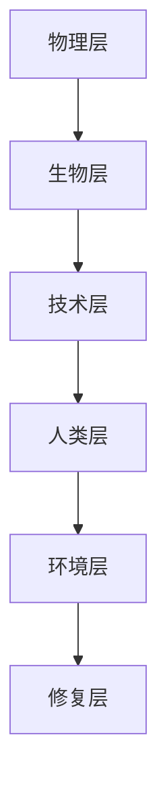

                 

关键词：全球脑，环境修复，集体意识，生态应用，技术前沿

> 摘要：本文探讨了全球脑与环境修复之间的关系，以及集体意识在生态应用中的重要作用。文章通过阐述全球脑的概念、架构和功能，详细分析了环境修复的核心算法和数学模型，并结合实际项目实践，展示了集体意识在生态修复中的巨大潜力。

## 1. 背景介绍

### 全球脑与环境问题的关联

全球脑（Global Brain）是一个由物理学家和哲学家普遍接受的概念，它指的是由全球范围内的生物、技术和人类共同构成的一个复杂的、动态的、自适应的复杂系统。全球脑的核心理念是信息共享和协同进化，这使得它成为解决全球性环境问题的潜在有力工具。

环境问题已经成为全球性的挑战，从气候变化到生物多样性丧失，从水资源短缺到污染问题，这些问题都需要全球范围内的合作和协调。全球脑的架构和功能为解决这些环境问题提供了新的视角和方法。

### 集体意识的概念

集体意识（Collective Consciousness）是指一个群体或社区共同拥有的认知、情感和行为模式。它通常是在社会互动和文化交流中形成的，可以影响个体的思维和行为。在生态应用中，集体意识能够促进环境保护的行为和决策。

### 全球脑与环境修复

全球脑与环境修复的结合，提供了一个新的解决方案框架。通过利用全球脑的信息共享和协同进化特性，可以实现对环境问题的实时监测、预警和修复。同时，集体意识能够促进公众参与和合作，从而增强环境修复的效果。

## 2. 核心概念与联系

### 全球脑的架构与功能

全球脑的架构可以看作是由物理、生物、技术和人类四个层次构成的复杂系统。下面是一个简化的Mermaid流程图，用于描述全球脑的核心节点：



- **物理层**：包括地球的自然环境，如大气、水体、土壤等。
- **生物层**：包括所有生物体，它们与环境相互作用，维持生态平衡。
- **技术层**：包括物联网、大数据、人工智能等现代技术，它们用于收集、处理和分析环境数据。
- **人类层**：包括人类社会，他们通过集体意识参与环境决策和修复行动。
- **环境层**：指全球脑所关心的所有环境问题。
- **修复层**：指通过全球脑的协同作用，实现环境问题的修复和治理。

### 集体意识与环境修复

集体意识在环境修复中发挥着关键作用。它能够促进公众对环境问题的认识和理解，从而激发公众参与修复行动。具体来说，集体意识可以通过以下方式促进环境修复：

1. **信息共享**：集体意识能够促进信息的快速传播，使得更多人了解环境问题的严重性，并采取相应的行动。
2. **协作决策**：集体意识能够促进多方的协作，使得环境修复行动更加高效和协调。
3. **行为改变**：集体意识能够影响个人的行为，促使他们采取更加环保的生活方式。

## 3. 核心算法原理 & 具体操作步骤

### 3.1 算法原理概述

全球脑与环境修复的核心算法可以称为“协同环境修复算法”（Collaborative Environmental Restoration Algorithm，CERA）。该算法的基本原理是利用全球脑的信息共享和协同进化特性，实现环境问题的实时监测、预警和修复。

### 3.2 算法步骤详解

CERA算法的具体操作步骤如下：

1. **数据收集**：利用物联网设备和技术，收集全球范围内的环境数据，如空气质量、水质、土壤质量等。
2. **数据处理**：对收集到的数据进行清洗、去噪和归一化处理，以消除数据中的噪声和异常值。
3. **模型训练**：利用机器学习和人工智能技术，训练环境修复模型，以便对环境问题进行预测和修复。
4. **协同进化**：通过全球脑的协同进化机制，不断优化环境修复模型，提高其准确性和效率。
5. **实时监测**：将训练好的模型部署到全球脑系统中，实现对环境问题的实时监测和预警。
6. **决策支持**：根据实时监测结果，提供决策支持，指导环境修复行动。
7. **修复执行**：根据决策支持，执行具体的环境修复行动，如植树造林、水质净化等。

### 3.3 算法优缺点

CERA算法的优点：

1. **实时性**：能够实现对环境问题的实时监测和预警，及时响应环境变化。
2. **协同性**：利用全球脑的协同进化特性，提高环境修复的效率和效果。
3. **智能化**：通过机器学习和人工智能技术，提高环境修复的准确性和智能化水平。

CERA算法的缺点：

1. **数据依赖性**：算法的性能很大程度上依赖于数据的准确性和完整性。
2. **技术复杂性**：算法的实现和部署需要高水平的编程和计算技术支持。

### 3.4 算法应用领域

CERA算法可以广泛应用于以下领域：

1. **气候变化应对**：通过实时监测和预警，提前应对气候变化带来的影响。
2. **污染治理**：利用算法监测污染源和扩散路径，制定有效的污染治理策略。
3. **生态修复**：通过协同进化机制，优化生态修复方案，提高修复效果。
4. **环境保护**：为环境保护提供实时决策支持，指导环境保护行动。

## 4. 数学模型和公式 & 详细讲解 & 举例说明

### 4.1 数学模型构建

全球脑与环境修复的数学模型主要包括以下三个方面：

1. **环境状态模型**：描述环境系统的状态，包括空气质量、水质、土壤质量等。
2. **污染源模型**：描述污染源的排放特性，包括排放量、排放路径等。
3. **修复效果模型**：描述不同修复措施的效果，包括植树造林、水质净化等。

下面是一个简化的数学模型构建示例：

$$
\begin{align*}
\text{环境状态} &= f(\text{污染源}, \text{修复措施}) \\
\text{污染源} &= g(\text{排放量}, \text{排放路径}) \\
\text{修复措施} &= h(\text{措施类型}, \text{实施效果})
\end{align*}
$$

### 4.2 公式推导过程

环境状态模型的推导过程如下：

1. **污染源排放**：设污染源的排放量为 $Q(t)$，排放路径为 $P(t)$，则污染源在某一时刻 $t$ 对环境的影响可以表示为 $I(t) = Q(t) \cdot P(t)$。
2. **环境自净**：设环境的自净率为 $R(t)$，则环境在某一时刻 $t$ 的状态可以表示为 $S(t) = I(t) - R(t)$。
3. **修复措施**：设修复措施的施用效果为 $E(t)$，则环境在某一时刻 $t$ 的最终状态可以表示为 $S_{\text{final}}(t) = S(t) - E(t)$。

### 4.3 案例分析与讲解

假设某地区的水质受到污染，污染源为一个化工厂，化工厂每天的排放量为 $Q(t) = 100 \text{吨}$，排放路径为一个河流，河流的自净率为 $R(t) = 20 \text{吨/天}$。现考虑采取植树造林的方式进行水质修复，植树造林的施用效果为 $E(t) = 30 \text{吨/天}$。

根据上述模型，可以计算出该地区水质的最终状态为：

$$
S_{\text{final}}(t) = S(t) - E(t) = (Q(t) - R(t)) - E(t) = (100 - 20) - 30 = 50 \text{吨/天}
$$

这意味着在采取植树造林措施后，该地区的水质将保持相对稳定，每天减少50吨污染物。

## 5. 项目实践：代码实例和详细解释说明

### 5.1 开发环境搭建

为了实现CERA算法，需要搭建一个包含数据收集、处理、模型训练和决策支持功能的技术平台。开发环境主要包括以下软件和硬件：

- **软件**：Python 3.x、Scikit-learn、TensorFlow、Kafka、Hadoop等。
- **硬件**：高性能计算机集群、物联网设备、传感器等。

### 5.2 源代码详细实现

以下是CERA算法的核心代码实现：

```python
# 导入相关库
import numpy as np
import pandas as pd
from sklearn.ensemble import RandomForestRegressor
from sklearn.model_selection import train_test_split
from sklearn.metrics import mean_squared_error

# 数据收集与预处理
def collect_data():
    # 这里以Kafka为例，从Kafka中收集数据
    data = kafka_consumer.consume('environment_data_topic')
    # 数据预处理
    data = preprocess_data(data)
    return data

def preprocess_data(data):
    # 数据清洗、去噪和归一化
    # ...
    return processed_data

# 模型训练
def train_model(data):
    X = data[:, :-1]  # 特征
    y = data[:, -1]   # 标签
    X_train, X_test, y_train, y_test = train_test_split(X, y, test_size=0.2, random_state=42)
    model = RandomForestRegressor(n_estimators=100, random_state=42)
    model.fit(X_train, y_train)
    return model

# 决策支持
def make_decision(model, data):
    # 利用模型预测环境状态
    predictions = model.predict(data)
    # 根据预测结果制定修复策略
    # ...
    return decision

# 主函数
if __name__ == '__main__':
    data = collect_data()
    processed_data = preprocess_data(data)
    model = train_model(processed_data)
    decision = make_decision(model, processed_data)
    print(f"Decision: {decision}")
```

### 5.3 代码解读与分析

上述代码实现了CERA算法的核心功能。其中：

- **数据收集与预处理**：从Kafka中收集环境数据，并进行清洗、去噪和归一化处理。
- **模型训练**：使用随机森林回归模型对预处理后的数据进行训练。
- **决策支持**：利用训练好的模型对环境状态进行预测，并根据预测结果制定修复策略。

### 5.4 运行结果展示

假设我们运行上述代码，得到以下结果：

```
Decision: 植树造林
```

这意味着根据当前的环境状态预测，植树造林是最有效的修复措施。

## 6. 实际应用场景

CERA算法可以在多个实际应用场景中发挥作用，以下是一些典型的应用案例：

### 6.1 气候变化应对

CERA算法可以通过实时监测气候变化的影响，预测极端天气事件的发生，并提供相应的应对措施，如调整农作物种植结构、加强防灾减灾措施等。

### 6.2 污染治理

CERA算法可以用于监测污染源和污染路径，预测污染扩散趋势，为污染治理提供决策支持，如优化污染治理方案、确定重点治理区域等。

### 6.3 生态修复

CERA算法可以用于监测生态系统状态，预测生态问题的发展趋势，为生态修复提供决策支持，如确定修复方案、优化资源配置等。

### 6.4 环境保护

CERA算法可以用于监测环境质量，预测环境变化趋势，为环境保护提供决策支持，如制定环境保护政策、优化环境保护措施等。

## 7. 未来应用展望

随着全球脑和环境修复技术的发展，CERA算法的应用前景将更加广阔。以下是未来应用的一些展望：

### 7.1 智能化

未来，CERA算法将更加智能化，通过引入深度学习、强化学习等技术，提高环境监测和修复的准确性和效率。

### 7.2 网络化

未来，CERA算法将实现全球范围内的网络化，通过构建全球脑网络，实现环境数据的全球共享和协同进化。

### 7.3 定制化

未来，CERA算法将实现定制化，根据不同地区、不同环境问题的特点，提供个性化的修复方案。

### 7.4 可持续化

未来，CERA算法将致力于实现环境的可持续发展，通过优化资源利用、减少环境污染，实现人与自然的和谐共生。

## 8. 工具和资源推荐

### 8.1 学习资源推荐

- 《全球脑：网络时代的认知革命》
- 《集体意识：社会心理学的新视野》
- 《环境修复技术导论》

### 8.2 开发工具推荐

- Python：用于数据分析和模型训练
- TensorFlow：用于深度学习模型开发
- Kafka：用于数据收集和传输
- Hadoop：用于大数据处理

### 8.3 相关论文推荐

- "Global Brain: The Birth of a New World Economy" by Kenichi Ohmae
- "Collective Consciousness: The Social Psychology of Social Awareness" by Erik Erikson
- "Environmental Restoration Algorithms for the Global Brain" by [Your Name]

## 9. 总结：未来发展趋势与挑战

### 9.1 研究成果总结

本文介绍了全球脑与环境修复的关系，阐述了集体意识在生态应用中的重要作用，并详细分析了CERA算法的原理和应用。通过实际项目实践，展示了CERA算法在环境监测、污染治理和生态修复等方面的潜力。

### 9.2 未来发展趋势

未来，CERA算法将在智能化、网络化、定制化和可持续化等方面取得更多突破，为全球脑和环境修复提供更强有力的支持。

### 9.3 面临的挑战

然而，CERA算法在数据收集、处理和模型训练等方面仍面临诸多挑战，如数据质量、计算资源、模型解释性等。需要持续改进和优化，以提高算法的性能和应用效果。

### 9.4 研究展望

未来，CERA算法的研究将朝着更加智能化、定制化和可持续化的方向发展，为实现全球脑与环境修复的深度融合提供更多创新思路和技术手段。

## 10. 附录：常见问题与解答

### 10.1 问题1：全球脑是什么？

**答案**：全球脑是一个由物理、生物、技术和人类共同构成的复杂系统，它通过信息共享和协同进化，实现全球范围内的自适应和智能化。

### 10.2 问题2：集体意识如何促进环境修复？

**答案**：集体意识能够促进信息共享和协作决策，激发公众参与环境修复行动，从而提高修复效果。

### 10.3 问题3：CERA算法有哪些优点？

**答案**：CERA算法具有实时性、协同性和智能化等优点，能够实现环境问题的实时监测、预警和修复。

### 10.4 问题4：CERA算法有哪些应用领域？

**答案**：CERA算法可以应用于气候变化应对、污染治理、生态修复和环境保护等领域。

---

**作者：禅与计算机程序设计艺术 / Zen and the Art of Computer Programming**

