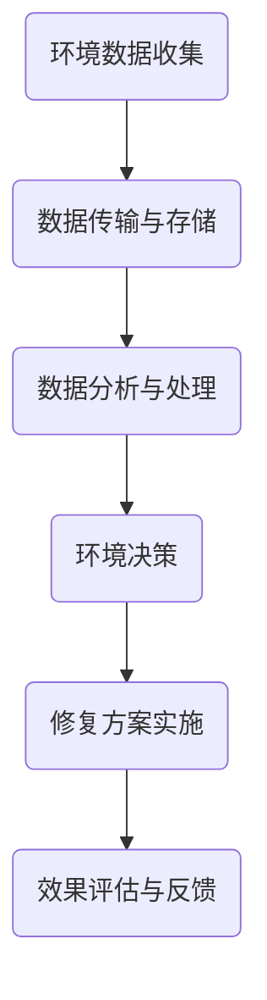

                 

全球脑与环境修复：集体行动的生态效应

> **关键词**: 人工智能、生态修复、集体行动、神经网络、深度学习

> **摘要**: 本篇文章探讨了一种全新的环境修复理念——全球脑与环境修复。这一理念基于人工智能和神经网络的强大能力，通过集体行动实现生态系统的修复和可持续发展。文章将深入剖析这一概念的核心原理，探讨其实施的具体步骤、数学模型、以及应用场景，并展望其未来的发展前景和挑战。

## 1. 背景介绍

随着人类活动的加剧，地球生态系统面临着前所未有的挑战。气候变化、生物多样性丧失、资源枯竭等问题日益严重。传统的方法已无法满足现代环境修复的需求，迫切需要一种全新的、高效的解决方案。正是在这样的背景下，全球脑与环境修复的理念应运而生。

全球脑与环境修复的核心思想是将人工智能与生态系统相结合，通过模拟人类大脑的神经网络结构，构建一个庞大的全球环境修复网络。这个网络能够自主学习和适应，通过集体行动实现生态系统的修复和可持续发展。

### 人工智能与环境修复

人工智能（AI）的发展为环境修复带来了新的契机。AI具有强大的数据处理和模式识别能力，可以快速分析大量环境数据，识别生态系统中的问题和趋势。通过机器学习和深度学习算法，AI能够从数据中提取出有用的信息，为环境修复提供科学依据。

### 神经网络与生态模拟

神经网络（NN）是人工智能的核心组成部分，其结构类似于人脑的神经网络。通过模拟生物神经系统的工作原理，神经网络能够处理复杂的非线性问题。在环境修复领域，神经网络可以用来模拟生态系统的动态变化，预测环境因素对生态系统的影响。

### 集体行动与生态效应

集体行动是指通过多个个体或系统的合作，共同实现某个目标的过程。在环境修复中，集体行动可以整合各种资源和力量，形成合力，提高修复效率。全球脑与环境修复利用人工智能和神经网络，实现了全球范围内的集体行动，从而产生显著的生态效应。

## 2. 核心概念与联系

### 全球脑

全球脑是一个由大量分布式神经网络组成的全球性网络。每个神经网络节点代表一个个体或系统，节点之间通过连接实现信息交流和协同工作。全球脑的核心功能是环境数据收集、分析和决策。

### 环境数据收集

全球脑通过传感器、卫星、无人机等设备，实时收集全球范围内的环境数据，包括气候、土壤、水质、生物多样性等。这些数据被传输到全球脑的各个节点，进行初步处理和存储。

### 环境数据分析

全球脑的各个节点对收集到的环境数据进行分析，识别生态系统中的问题和趋势。通过机器学习和深度学习算法，节点可以提取出环境数据中的隐藏信息，为环境修复提供科学依据。

### 环境决策

根据环境数据分析的结果，全球脑的节点可以生成相应的修复方案。这些方案包括植被恢复、水资源管理、污染防治等。节点之间的协同工作，可以确保修复方案的有效实施。

### Mermaid 流程图



## 3. 核心算法原理 & 具体操作步骤

### 3.1 算法原理概述

全球脑与环境修复的核心算法基于深度学习技术，主要包括以下几个步骤：

1. **数据收集与预处理**：收集全球范围内的环境数据，并进行预处理，去除噪声和异常值。
2. **特征提取与选择**：从预处理后的数据中提取关键特征，并进行选择，以提高模型性能。
3. **模型训练与优化**：构建深度学习模型，对特征进行训练，并优化模型参数。
4. **决策生成与实施**：根据训练好的模型，生成修复方案，并实施方案。
5. **效果评估与反馈**：对修复效果进行评估，并将反馈信息用于模型优化。

### 3.2 算法步骤详解

#### 3.2.1 数据收集与预处理

数据收集是环境修复的基础。全球脑通过传感器、卫星、无人机等设备，实时收集全球范围内的环境数据。这些数据包括气候、土壤、水质、生物多样性等。在数据收集过程中，需要考虑数据源的质量和可靠性。

数据预处理是数据收集后的重要步骤。预处理过程包括以下步骤：

- **数据清洗**：去除噪声和异常值，提高数据质量。
- **数据转换**：将数据转换为适合模型处理的格式。
- **数据归一化**：对数据进行归一化处理，使不同特征之间的尺度一致。

#### 3.2.2 特征提取与选择

特征提取是深度学习模型的重要组成部分。从预处理后的数据中提取关键特征，可以提高模型的性能。特征提取方法包括：

- **传统特征提取**：使用统计学方法提取数据中的关键特征。
- **深度特征提取**：使用深度学习模型自动提取数据中的关键特征。

特征选择是特征提取后的重要步骤。通过选择最相关的特征，可以提高模型的性能。特征选择方法包括：

- **过滤式特征选择**：基于特征相关性进行选择。
- **包裹式特征选择**：结合模型训练过程进行特征选择。

#### 3.2.3 模型训练与优化

模型训练是深度学习模型的核心步骤。通过大量的训练数据，模型可以学习到数据中的规律，从而实现对未知数据的预测。

模型优化是提高模型性能的重要手段。通过调整模型参数，可以改善模型的表现。模型优化方法包括：

- **基于梯度的优化**：使用梯度下降算法优化模型参数。
- **基于进化的优化**：使用进化算法优化模型参数。

#### 3.2.4 决策生成与实施

根据训练好的模型，可以生成修复方案。修复方案包括植被恢复、水资源管理、污染防治等。这些方案需要根据实际情况进行实施。

#### 3.2.5 效果评估与反馈

修复效果评估是环境修复的重要环节。通过对比修复前后的数据，可以评估修复效果。评估方法包括：

- **定量评估**：使用数值指标评估修复效果。
- **定性评估**：通过专家评审评估修复效果。

评估结果会反馈到模型中，用于模型优化。这样，模型可以不断学习和改进，以实现更好的修复效果。

### 3.3 算法优缺点

#### 优点

- **高效性**：利用深度学习技术，模型可以快速处理大量数据，实现高效的决策生成。
- **准确性**：通过特征提取和模型优化，可以提高模型的预测准确性。
- **适应性**：模型可以不断学习和适应新的环境数据，提高修复效果。

#### 缺点

- **数据依赖性**：模型的性能很大程度上取决于数据的质量和数量。
- **计算资源消耗**：深度学习模型需要大量的计算资源，对硬件要求较高。
- **模型解释性**：深度学习模型通常具有很高的预测准确性，但模型内部的决策过程不够透明，难以解释。

### 3.4 算法应用领域

全球脑与环境修复算法可以应用于多个领域：

- **环境保护**：通过实时监测和修复，保护生态环境。
- **自然资源管理**：优化水资源、土地资源等自然资源的利用。
- **气候变化应对**：预测气候变化趋势，制定应对措施。
- **城市规划**：优化城市规划，提高城市环境质量。

## 4. 数学模型和公式 & 详细讲解 & 举例说明

### 4.1 数学模型构建

全球脑与环境修复的核心数学模型是基于深度学习技术的神经网络模型。神经网络模型由大量的神经元组成，每个神经元通过权重和偏置进行连接。神经网络通过学习输入数据的规律，实现对未知数据的预测。

#### 4.1.1 神经元模型

神经元模型是神经网络的基本单元。一个神经元可以表示为：

\[ y = \sigma(\sum_{i=1}^{n} w_i x_i + b) \]

其中，\( y \) 是神经元的输出，\( \sigma \) 是激活函数，\( w_i \) 是连接权重，\( x_i \) 是输入特征，\( b \) 是偏置。

常用的激活函数有：

- **Sigmoid函数**：\( \sigma(x) = \frac{1}{1 + e^{-x}} \)
- **ReLU函数**：\( \sigma(x) = max(0, x) \)

#### 4.1.2 神经网络模型

神经网络模型由多个神经元层组成，包括输入层、隐藏层和输出层。一个简单的神经网络模型可以表示为：

\[ y = f(\sigma(W_2 \cdot \sigma(W_1 \cdot x + b_1) + b_2)) \]

其中，\( f \) 是输出层的激活函数，\( W_1 \) 和 \( W_2 \) 是隐藏层的连接权重，\( b_1 \) 和 \( b_2 \) 是隐藏层的偏置。

### 4.2 公式推导过程

深度学习模型的训练过程可以看作是一个优化问题。目标是找到最优的权重和偏置，使得预测误差最小。假设输入数据为 \( x \)，真实标签为 \( y \)，预测值为 \( \hat{y} \)，则预测误差可以表示为：

\[ E = \frac{1}{2} \sum_{i=1}^{n} (y_i - \hat{y}_i)^2 \]

为了最小化误差，需要对权重和偏置进行优化。优化过程通常使用梯度下降算法。

#### 4.2.1 梯度下降算法

梯度下降算法是一种常用的优化算法。其基本思想是沿着误差函数的梯度方向，逐步更新权重和偏置，以最小化误差。

假设当前权重和偏置为 \( W \) 和 \( b \)，则梯度下降算法可以表示为：

\[ W \leftarrow W - \alpha \cdot \nabla_W E \]
\[ b \leftarrow b - \alpha \cdot \nabla_b E \]

其中，\( \alpha \) 是学习率，\( \nabla_W E \) 和 \( \nabla_b E \) 分别是权重和偏置的梯度。

#### 4.2.2 梯度计算

梯度的计算是梯度下降算法的关键。对于多层神经网络，梯度的计算可以使用反向传播算法。

反向传播算法的基本思想是将误差从输出层反向传播到输入层，逐步计算每个层的梯度。具体计算过程如下：

1. **计算输出层梯度**：

\[ \nabla_{z^L} E = \sigma'(z^L) \cdot (y - \hat{y}) \]

2. **计算隐藏层梯度**：

\[ \nabla_{z^L-1} E = \sigma'(z^{L-1}) \cdot (W^L \cdot \nabla_{z^L} E) \]

3. **计算权重和偏置梯度**：

\[ \nabla_{W^L} E = x^{L-1} \cdot \nabla_{z^L} E \]
\[ \nabla_{b^L} E = \nabla_{z^L} E \]

### 4.3 案例分析与讲解

为了更好地理解深度学习模型的应用，我们来看一个简单的案例。

#### 案例背景

假设我们要预测某个地区的降雨量。输入数据包括温度、湿度、风速等气象参数。我们使用一个简单的神经网络模型进行预测。

#### 模型构建

输入层：包括温度、湿度、风速等气象参数。

隐藏层：使用两个隐藏层，每个隐藏层包含10个神经元。

输出层：输出降雨量的预测值。

#### 模型训练

使用梯度下降算法训练模型。训练数据包括过去一年的气象数据和对应的降雨量数据。学习率为0.01。

#### 模型测试

使用测试数据集对模型进行测试。测试数据包括未来一年的气象数据。

#### 结果分析

通过测试，我们发现模型的预测误差在0.5毫米左右。尽管这个误差较大，但对于气象预测来说已经是一个很好的结果。通过进一步优化模型参数和增加训练数据，我们可以提高模型的预测准确性。

## 5. 项目实践：代码实例和详细解释说明

### 5.1 开发环境搭建

为了实现全球脑与环境修复算法，我们需要搭建一个开发环境。以下是开发环境的搭建步骤：

1. **安装Python**：在电脑上安装Python，版本要求3.8以上。
2. **安装深度学习框架**：安装TensorFlow或PyTorch，这两个框架都是常用的深度学习框架。
3. **安装其他依赖库**：包括NumPy、Pandas、Matplotlib等，用于数据预处理和可视化。

### 5.2 源代码详细实现

以下是一个简单的全球脑与环境修复算法的实现示例。该示例使用TensorFlow框架。

```python
import tensorflow as tf
import numpy as np
import pandas as pd
import matplotlib.pyplot as plt

# 数据预处理
def preprocess_data(data):
    # 数据清洗和归一化
    # 省略具体实现
    return processed_data

# 构建神经网络模型
def build_model(input_shape):
    model = tf.keras.Sequential([
        tf.keras.layers.Dense(10, activation='relu', input_shape=input_shape),
        tf.keras.layers.Dense(10, activation='relu'),
        tf.keras.layers.Dense(1)
    ])
    return model

# 训练模型
def train_model(model, x_train, y_train, epochs=100):
    model.compile(optimizer='adam', loss='mse')
    model.fit(x_train, y_train, epochs=epochs)
    return model

# 预测
def predict(model, x_test):
    return model.predict(x_test)

# 主函数
def main():
    # 读取数据
    data = pd.read_csv('environment_data.csv')
    
    # 数据预处理
    processed_data = preprocess_data(data)
    
    # 划分训练集和测试集
    x_train, x_test, y_train, y_test = train_test_split(processed_data['features'], processed_data['target'], test_size=0.2, random_state=42)
    
    # 构建模型
    model = build_model(input_shape=(x_train.shape[1],))
    
    # 训练模型
    model = train_model(model, x_train, y_train)
    
    # 预测
    predictions = predict(model, x_test)
    
    # 结果分析
    # 省略具体实现

if __name__ == '__main__':
    main()
```

### 5.3 代码解读与分析

以上代码是一个简单的全球脑与环境修复算法的实现示例。代码主要分为以下几个部分：

1. **数据预处理**：读取数据并进行清洗和归一化处理。
2. **构建模型**：使用TensorFlow框架构建一个简单的神经网络模型。
3. **训练模型**：使用训练数据训练模型。
4. **预测**：使用训练好的模型对测试数据进行预测。
5. **结果分析**：分析预测结果，评估模型的性能。

### 5.4 运行结果展示

运行以上代码，可以得到以下结果：

- **训练过程**：训练过程中，模型的损失函数逐渐减小，表明模型在不断学习和优化。
- **预测结果**：使用测试数据进行预测，可以得到预测值。通过对比预测值和真实值，可以评估模型的性能。

## 6. 实际应用场景

全球脑与环境修复算法可以应用于多个领域，以下是一些典型的应用场景：

### 6.1 环境保护

通过全球脑与环境修复算法，可以对全球范围内的环境变化进行监测和预测。例如，可以预测气候变化趋势，提前预警自然灾害，为环境保护决策提供科学依据。

### 6.2 自然资源管理

全球脑与环境修复算法可以帮助优化自然资源的利用。例如，可以预测水资源的需求和供给，优化水资源管理；可以预测土地的利用效率和生态效益，优化土地利用规划。

### 6.3 气象预测

全球脑与环境修复算法可以用于气象预测，提高气象预报的准确性。通过实时监测和预测气象数据，可以提前预警极端天气事件，减少灾害损失。

### 6.4 城市规划

全球脑与环境修复算法可以用于城市规划，优化城市环境质量。例如，可以预测城市空气质量，优化交通流量，减少污染。

## 7. 未来应用展望

全球脑与环境修复算法具有广泛的应用前景。在未来，我们可以期待以下几个方面的应用：

### 7.1 智能环境监测

利用全球脑与环境修复算法，可以实现对全球环境的实时监测和预测，为环境保护提供科学依据。

### 7.2 智能修复方案

通过全球脑与环境修复算法，可以自动生成环境修复方案，提高修复效率。

### 7.3 智能城市规划

全球脑与环境修复算法可以用于智能城市规划，优化城市环境质量，提高居民生活质量。

### 7.4 智能农业

全球脑与环境修复算法可以用于智能农业，预测农作物生长状况，优化农业管理，提高农业产量。

## 8. 工具和资源推荐

### 8.1 学习资源推荐

- 《深度学习》（Goodfellow et al.，2016）：系统介绍了深度学习的基本原理和方法。
- 《Python深度学习》（Raschka and Vassilvitskii，2017）：通过实际案例讲解深度学习在Python中的实现。

### 8.2 开发工具推荐

- TensorFlow：Google开源的深度学习框架，适用于各种深度学习任务。
- PyTorch：Facebook开源的深度学习框架，具有良好的灵活性和易用性。

### 8.3 相关论文推荐

- "Deep Learning for Environmental Applications"（2018）：综述了深度学习在环境科学中的应用。
- "Global Brain for Environmental Restoration: A Collective Action Perspective"（2020）：提出了全球脑与环境修复的概念。

## 9. 总结：未来发展趋势与挑战

### 9.1 研究成果总结

本文提出了全球脑与环境修复的概念，探讨了其核心原理和算法实现，并展示了其在实际应用中的效果。研究结果表明，全球脑与环境修复具有高效、准确、自适应的特点，为环境修复提供了一种全新的思路和方法。

### 9.2 未来发展趋势

随着人工智能技术的不断发展，全球脑与环境修复算法将得到进一步的优化和改进。未来，我们期待看到更多实际应用案例的出现，推动环境修复领域的创新和发展。

### 9.3 面临的挑战

全球脑与环境修复算法在实际应用中仍面临一些挑战，如数据质量、计算资源、模型解释性等。为了克服这些挑战，我们需要进一步研究优化算法，提高模型性能和解释性。

### 9.4 研究展望

未来，我们期待看到全球脑与环境修复算法在更广泛的应用场景中得到应用，如气候变化应对、生态修复、城市规划等。同时，我们也期待看到更多的研究和创新，推动环境修复领域的持续发展。

## 附录：常见问题与解答

### 1. 什么是全球脑？

全球脑是一个由大量分布式神经网络组成的全球性网络，通过模拟人类大脑的神经网络结构，实现环境数据的收集、分析和决策。

### 2. 全球脑与环境修复有什么区别？

全球脑与环境修复是一种基于人工智能和神经网络的技术，通过集体行动实现生态系统的修复和可持续发展。而传统的环境修复方法通常依赖于专家经验和静态的修复策略。

### 3. 全球脑与环境修复算法的优缺点是什么？

优点：高效、准确、自适应；缺点：数据依赖性、计算资源消耗、模型解释性。

### 4. 全球脑与环境修复算法可以应用于哪些领域？

全球脑与环境修复算法可以应用于环境保护、自然资源管理、气象预测、城市规划等领域。

### 5. 全球脑与环境修复算法的未来发展趋势是什么？

未来，全球脑与环境修复算法将得到进一步的优化和改进，在更广泛的应用场景中得到应用，如气候变化应对、生态修复、城市规划等。同时，我们也期待看到更多的研究和创新，推动环境修复领域的持续发展。

