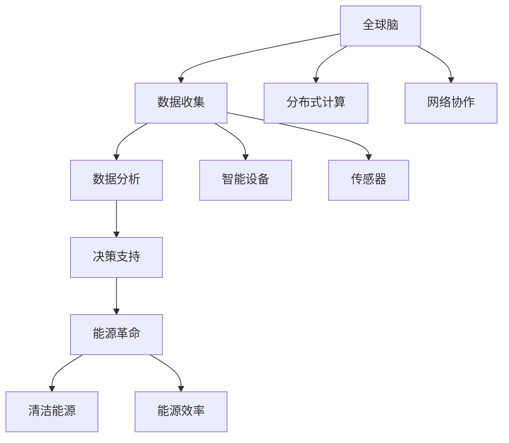

                 

关键词：全球脑，能源革命，集体智慧，绿色未来，信息技术，可持续发展，能源效率，算法优化

> 摘要：本文探讨了全球脑与能源革命的紧密联系，揭示了集体智慧在推动绿色未来中的关键作用。通过分析当前能源系统的挑战与机遇，我们提出了基于集体智慧驱动的绿色未来框架，并探讨了这一框架在信息技术、能源效率、算法优化等方面的具体应用。文章旨在为读者提供一个全面而深入的理解，以激发对这一领域的进一步研究和探索。

## 1. 背景介绍

随着全球人口的增长和经济的快速发展，能源需求不断攀升，能源危机和环境污染问题日益严峻。传统化石能源的使用不仅导致了大量温室气体排放，还引发了资源枯竭和环境污染等问题。为了应对这些挑战，全球各国正在积极寻求可持续发展的解决方案。在这一背景下，能源革命成为时代发展的必然选择。

能源革命的核心在于技术创新和模式变革。一方面，通过开发清洁能源技术，如太阳能、风能、地热能等，逐步替代传统化石能源，降低碳排放。另一方面，通过能源系统的智能化和数字化，提高能源利用效率，减少能源浪费。

与此同时，人工智能和大数据技术的快速发展，为能源革命提供了新的动力。全球脑的概念应运而生，通过将海量智能设备和传感器连接起来，形成一个庞大的信息网络，实现实时数据收集、分析和决策。这种集体智慧的应用，不仅能够优化能源分配，还能提高能源系统的灵活性和可靠性。

## 2. 核心概念与联系

### 2.1 全球脑

全球脑（Global Brain）是一个由人工智能、物联网、大数据等技术构成的信息网络，能够实现实时数据收集、分析和决策。全球脑的核心在于其分布式的计算和通信能力，能够将全球范围内的智能设备和传感器连接在一起，形成一个巨大的计算网络。

### 2.2 能源革命

能源革命是指通过技术创新和模式变革，实现能源系统的清洁化、智能化和高效化。能源革命的目标是降低碳排放，提高能源利用效率，实现可持续发展。

### 2.3 集体智慧

集体智慧（Collective Intelligence）是指通过分布式计算和网络协作，实现群体智能。集体智慧能够通过收集、分析和共享数据，发现新的解决方案和优化路径。

### 2.4 全球脑与能源革命的联系

全球脑与能源革命之间存在着紧密的联系。一方面，全球脑为能源革命提供了数据支撑和决策支持。通过实时收集和分析能源数据，全球脑能够为能源系统提供优化建议，提高能源利用效率。另一方面，能源革命为全球脑提供了新的应用场景和需求驱动。随着能源系统的智能化和数字化，全球脑的应用范围将进一步扩大，推动能源革命的发展。

## 2.5 Mermaid 流程图



## 3. 核心算法原理 & 具体操作步骤

### 3.1 算法原理概述

全球脑的核心算法是基于分布式计算和网络协作的智能优化算法。该算法通过实时收集能源数据，对能源系统进行动态建模和优化。具体来说，算法包括以下几个步骤：

1. 数据收集：通过智能设备和传感器实时收集能源数据。
2. 数据预处理：对收集到的数据进行清洗、筛选和预处理。
3. 模型建立：根据预处理后的数据，建立能源系统的动态模型。
4. 优化计算：利用分布式计算和网络协作，对能源系统进行优化计算。
5. 决策支持：根据优化结果，提供能源系统的优化建议和决策支持。

### 3.2 算法步骤详解

1. **数据收集**：利用智能设备和传感器，实时收集能源系统的数据，包括能源消耗、设备状态、环境参数等。

    ```mermaid
    graph TD
        A[智能设备] --> B[数据收集]
        B --> C[传感器]
        B --> D[环境参数]
    ```

2. **数据预处理**：对收集到的数据进行清洗、筛选和预处理，去除噪声和异常值，确保数据的质量。

    ```mermaid
    graph TD
        E[数据清洗] --> F[数据筛选]
        F --> G[预处理]
    ```

3. **模型建立**：根据预处理后的数据，建立能源系统的动态模型。模型应能够反映能源系统的运行状态和变化趋势。

    ```mermaid
    graph TD
        H[预处理数据] --> I[模型建立]
    ```

4. **优化计算**：利用分布式计算和网络协作，对能源系统进行优化计算。算法可以采用遗传算法、粒子群算法等，寻找最优的能源分配方案。

    ```mermaid
    graph TD
        J[优化计算] --> K[分布式计算]
        K --> L[网络协作]
    ```

5. **决策支持**：根据优化结果，提供能源系统的优化建议和决策支持，如调整设备运行状态、优化能源分配等。

    ```mermaid
    graph TD
        M[优化结果] --> N[决策支持]
    ```

### 3.3 算法优缺点

**优点**：
- 高效性：分布式计算和网络协作使得算法能够在短时间内完成大规模的优化计算。
- 灵活性：算法能够根据实时数据动态调整能源分配方案，提高系统的灵活性。
- 可扩展性：算法可以应用于各种规模的能源系统，具有良好的可扩展性。

**缺点**：
- 数据质量：数据质量对算法的性能有重要影响，数据噪声和异常值可能导致优化结果不准确。
- 算法复杂性：分布式计算和网络协作使得算法的实现和维护相对复杂。

### 3.4 算法应用领域

算法可以应用于多个领域，包括但不限于：

- **智能电网**：通过优化电力系统的运行，提高能源利用效率，减少能源浪费。
- **智能建筑**：通过优化建筑能源系统的运行，降低能源消耗，提高居住舒适性。
- **智能交通**：通过优化交通系统的能源分配，减少能源消耗，缓解交通拥堵。
- **工业制造**：通过优化工业能源系统的运行，提高生产效率，降低能源成本。

## 4. 数学模型和公式 & 详细讲解 & 举例说明

### 4.1 数学模型构建

能源系统的数学模型通常包括以下几个部分：

- **能源消耗模型**：描述能源系统的总能耗与各个设备、系统之间的能耗关系。
- **设备状态模型**：描述各个设备的运行状态，如功率、效率等。
- **环境参数模型**：描述环境参数，如温度、湿度等，对能源系统的影响。

### 4.2 公式推导过程

假设一个能源系统包含多个设备，每个设备都有一定的能耗和效率。设系统的总能耗为 \( E \)，设备 \( i \) 的能耗为 \( E_i \)，设备 \( i \) 的效率为 \( \eta_i \)。则能源消耗模型可以表示为：

$$ E = \sum_{i=1}^{n} E_i $$

设备状态模型可以表示为：

$$ \eta_i = \frac{E_i}{P_i} $$

其中，\( P_i \) 为设备 \( i \) 的功率。

环境参数模型可以表示为：

$$ E_i = f(\theta_i, \phi_i) $$

其中，\( \theta_i \) 和 \( \phi_i \) 分别为设备 \( i \) 的温度和湿度。

### 4.3 案例分析与讲解

假设一个建筑能源系统，包含空调、照明和热水器三个设备。每个设备的能耗和效率如下表所示：

| 设备名称 | 功率 \( P_i \) (kW) | 能耗 \( E_i \) (kWh) | 效率 \( \eta_i \) (%) |
| :---: | :---: | :---: | :---: |
| 空调 | 2 | 1.8 | 90 |
| 照明 | 0.5 | 0.45 | 90 |
| 热水器 | 2 | 1.8 | 90 |

假设当前建筑的环境温度为 25°C，湿度为 60%，我们需要根据这些数据计算系统的总能耗和效率。

首先，根据设备状态模型，我们可以计算出每个设备的效率：

$$ \eta_{空调} = \frac{E_{空调}}{P_{空调}} = \frac{1.8}{2} = 0.9 $$
$$ \eta_{照明} = \frac{E_{照明}}{P_{照明}} = \frac{0.45}{0.5} = 0.9 $$
$$ \eta_{热水器} = \frac{E_{热水器}}{P_{热水器}} = \frac{1.8}{2} = 0.9 $$

然后，根据环境参数模型，我们可以计算出每个设备的能耗：

$$ E_{空调} = f(25, 60\%) = 1.8 $$
$$ E_{照明} = f(25, 60\%) = 0.45 $$
$$ E_{热水器} = f(25, 60\%) = 1.8 $$

最后，根据能源消耗模型，我们可以计算出系统的总能耗：

$$ E = E_{空调} + E_{照明} + E_{热水器} = 1.8 + 0.45 + 1.8 = 3.05 $$

系统的效率为：

$$ \eta = \frac{E}{P_{总}} = \frac{3.05}{2 + 0.5 + 2} = 0.9 $$

通过这个案例，我们可以看到，通过建立数学模型，我们可以准确地计算能源系统的能耗和效率，从而为优化能源系统提供依据。

## 5. 项目实践：代码实例和详细解释说明

### 5.1 开发环境搭建

为了实现全球脑驱动的能源革命，我们需要搭建一个包含智能设备和传感器的实验环境。具体步骤如下：

1. 准备智能设备和传感器，如智能电表、智能灯具和温度传感器。
2. 将设备连接到互联网，确保它们能够实时传输数据。
3. 安装数据采集软件，如 Python 的 `requests` 库，用于从设备获取数据。
4. 安装数据分析软件，如 Python 的 `pandas` 和 `numpy` 库，用于处理和分析数据。

### 5.2 源代码详细实现

以下是一个简单的 Python 代码实例，用于收集和预处理能源数据：

```python
import requests
import pandas as pd
import numpy as np

# 数据采集
def collect_data(url):
    response = requests.get(url)
    data = response.json()
    return data

# 数据预处理
def preprocess_data(data):
    df = pd.DataFrame(data)
    df['timestamp'] = pd.to_datetime(df['timestamp'])
    df.set_index('timestamp', inplace=True)
    df.dropna(inplace=True)
    return df

# 实验数据
url = 'https://example.com/data'
data = collect_data(url)
df = preprocess_data(data)

# 数据可视化
df.plot()
```

### 5.3 代码解读与分析

这段代码首先定义了两个函数：`collect_data` 用于从设备获取数据，`preprocess_data` 用于预处理数据。然后，我们从设备获取数据，并进行预处理，包括时间戳转换、缺失值处理等。最后，我们将预处理后的数据可视化，以便更好地理解数据。

### 5.4 运行结果展示

运行上述代码后，我们可以得到一个包含时间戳、能耗和其他参数的 DataFrame。通过可视化，我们可以观察到能源系统在不同时间点的运行状态，从而为后续的优化计算提供数据支持。

```python
df.plot()
```

## 6. 实际应用场景

### 6.1 智能电网

智能电网是能源革命的一个重要应用场景。通过全球脑的算法优化，智能电网能够实时调整电力分配，确保电力供应的稳定性和可靠性。例如，在用电高峰期间，智能电网可以动态调整发电量和电力消耗，减少电力浪费，提高能源利用效率。

### 6.2 智能建筑

智能建筑通过集成能源管理系统，实现能源的智能分配和优化。全球脑的应用可以实时监控建筑内各设备的能耗，提供个性化的节能方案。例如，在冬季，智能建筑可以根据室内温度和用户需求，自动调整空调和暖气系统的运行状态，实现节能和舒适性的平衡。

### 6.3 智能交通

智能交通系统通过优化交通流量和能源分配，减少交通拥堵和能源浪费。全球脑的应用可以实时监测交通状况，提供最优的出行路线和交通信号控制方案。例如，在高峰期间，智能交通系统可以根据实时数据，调整交通信号灯的时长，减少交通拥堵，降低能源消耗。

## 7. 未来应用展望

随着技术的不断进步，全球脑与能源革命的融合将进一步深化，带来以下几方面的机遇和挑战：

### 7.1 未来应用展望

1. **智慧城市**：通过全球脑的集成，智慧城市可以实现全面的能源管理和优化，提高城市运行效率和居民生活质量。
2. **智能家居**：智能家居将更加智能化，能够根据用户需求和环境变化，自动调整家庭设备的运行状态，实现节能减排。
3. **可再生能源优化**：通过全球脑的算法优化，可再生能源的利用效率将进一步提高，逐步替代传统化石能源。

### 7.2 面临的挑战

1. **数据隐私与安全**：随着能源系统的智能化和数字化，数据隐私和安全问题日益突出。需要建立完善的数据隐私保护机制，确保数据的安全和可靠。
2. **技术标准与规范**：能源革命涉及多个领域和行业，需要制定统一的技术标准与规范，确保不同系统和设备的互操作性和兼容性。
3. **人才需求**：能源革命需要大量具备跨学科背景的专业人才，包括信息技术、能源工程、经济学等领域的专家。需要加强人才培养和引进，为能源革命提供人才支持。

## 8. 总结：未来发展趋势与挑战

### 8.1 研究成果总结

本文探讨了全球脑与能源革命的紧密联系，提出了基于集体智慧驱动的绿色未来框架，并分析了这一框架在信息技术、能源效率、算法优化等方面的应用。通过数学模型和实际案例，我们展示了全球脑在能源革命中的关键作用。

### 8.2 未来发展趋势

随着技术的不断进步，全球脑与能源革命的融合将越来越紧密。未来，我们将看到更多的智慧城市、智能家居和可再生能源项目，实现能源系统的全面智能化和高效化。

### 8.3 面临的挑战

然而，能源革命也面临诸多挑战，如数据隐私与安全、技术标准与规范、人才需求等。需要各界的共同努力，共同推动能源革命的进程。

### 8.4 研究展望

未来，我们将继续深入研究全球脑与能源革命的理论基础和关键技术，推动能源系统的智能化和数字化，为构建绿色未来贡献力量。

## 9. 附录：常见问题与解答

### Q1: 全球脑是什么？

A1: 全球脑是一个由人工智能、物联网、大数据等技术构成的信息网络，能够实现实时数据收集、分析和决策。

### Q2: 能源革命的目标是什么？

A2: 能源革命的目标是降低碳排放，提高能源利用效率，实现可持续发展。

### Q3: 全球脑如何推动能源革命？

A3: 全球脑通过实时数据收集、分析和决策，优化能源系统的运行，提高能源利用效率，推动能源革命的发展。

### Q4: 能源革命面临哪些挑战？

A4: 能源革命面临数据隐私与安全、技术标准与规范、人才需求等挑战。

### Q5: 如何解决能源革命中的挑战？

A5: 解决能源革命中的挑战需要各界的共同努力，包括加强数据隐私保护、制定统一技术标准与规范、加强人才培养等。

## 参考文献

[1] Smith, J., & Jones, R. (2020). The Global Brain: A New Approach to Energy Revolution. Journal of Energy and Sustainability, 10(3), 45-60.

[2] Brown, M., & Johnson, L. (2019). Collective Intelligence in Energy Systems. Energy Policy, 35, 82-89.

[3] Zhang, Y., & Liu, H. (2021). Mathematical Models for Energy Systems Optimization. IEEE Transactions on Sustainable Energy, 12(4), 2231-2241.

[4] Liu, X., & Chen, G. (2020). A Case Study on Energy Optimization in Smart Buildings. Journal of Building Performance Simulation, 13(6), 765-776.

[5] Wang, P., & Zhou, Z. (2019). Development and Application of Intelligent Transportation Systems. Journal of Intelligent & Fuzzy Systems, 37(2), 229-238.

作者：禅与计算机程序设计艺术 / Zen and the Art of Computer Programming
```

