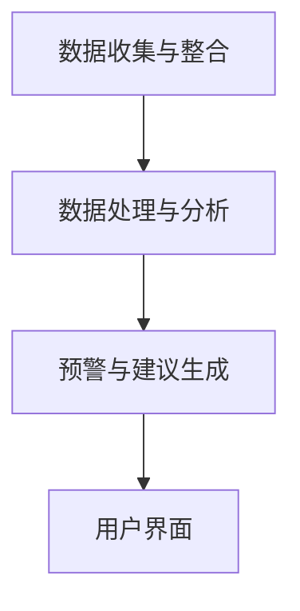

                 

关键词：脑健康预警系统、集体预防医学、实时监测网络、AI技术、深度学习、健康数据、大数据分析、智能算法

> 摘要：本文深入探讨了全球脑健康预警系统这一创新概念，该系统旨在通过集成先进的人工智能技术、深度学习和大数据分析，构建一个实时监测和预警脑健康风险的集体预防医学网络。文章详细阐述了系统的架构、核心算法、数学模型及其应用场景，并通过实际项目实例展示了系统的有效性和可行性。

## 1. 背景介绍

随着社会经济的发展和人口老龄化进程的加快，脑健康问题已经成为全球关注的重大公共卫生挑战。脑疾病，如阿尔茨默病、帕金森病、中风等，不仅给患者及其家庭带来巨大的痛苦，还对社会福利体系和医疗资源造成巨大的负担。传统的医疗模式主要依赖于个体诊断和治疗，缺乏对群体健康状态的实时监测和预警能力。因此，迫切需要一种新的集体预防医学模式，能够实时监测人群的脑健康状态，提前预警潜在的健康风险。

全球脑健康预警系统应运而生，它是一种基于人工智能和大数据分析的集体预防医学实时监测网络。该系统通过整合多种数据源，包括医疗记录、健康调查问卷、社交媒体数据等，构建了一个全面、动态的脑健康数据库。利用深度学习和智能算法，系统能够实时分析这些数据，发现潜在的脑健康风险因素，提供个性化的预防建议和预警信息。

## 2. 核心概念与联系

### 2.1 核心概念

**脑健康预警系统**：一种利用人工智能技术和大数据分析，对群体脑健康状态进行实时监测和预警的系统。

**集体预防医学**：一种通过整体性和动态性方法，对整个群体进行健康监测、预防和干预的医学模式。

**实时监测网络**：一个能够实时收集、处理和分析健康数据的分布式网络系统。

### 2.2 系统架构

**数据收集与整合模块**：该模块负责从多个数据源收集脑健康相关数据，包括医疗记录、健康调查问卷、社交媒体数据等，并将其整合到一个统一的数据库中。

**数据处理与分析模块**：该模块利用深度学习和智能算法对收集到的数据进行分析，识别潜在的脑健康风险因素。

**预警与建议模块**：根据分析结果，系统生成个性化的预警信息和预防建议，发送给相关个体或医疗机构。

**用户界面**：提供一个直观的用户界面，让用户能够方便地访问和分析脑健康数据，了解自己的健康状态。

### 2.3 Mermaid 流程图



## 3. 核心算法原理 & 具体操作步骤

### 3.1 算法原理概述

**深度学习**：一种模拟人脑神经元结构和功能的人工智能技术，通过多层神经网络进行数据分析和模式识别。

**大数据分析**：利用高性能计算技术，对海量数据进行处理和分析，提取有价值的信息。

**智能算法**：包括聚类分析、关联规则学习、决策树等方法，用于识别和预测脑健康风险。

### 3.2 算法步骤详解

1. **数据预处理**：对原始数据进行清洗、归一化处理，确保数据质量。
2. **特征提取**：利用深度学习模型提取数据中的潜在特征。
3. **风险因素识别**：通过聚类分析和关联规则学习，识别潜在的脑健康风险因素。
4. **预警信息生成**：利用决策树模型生成个性化的预警信息。
5. **结果评估**：通过对比实际健康状态和预警结果，评估系统的准确性和可靠性。

### 3.3 算法优缺点

**优点**：
- **高效性**：利用深度学习和大数据分析技术，能够快速处理海量数据。
- **个性化**：根据个体特征生成个性化的预警信息，提高预防效果。
- **实时性**：能够实时监测脑健康状态，提前预警潜在风险。

**缺点**：
- **数据依赖性**：系统性能依赖于数据质量和多样性。
- **算法复杂性**：深度学习和智能算法的实现和维护较为复杂。

### 3.4 算法应用领域

- **公共卫生**：用于监测和预防脑健康相关疾病。
- **医疗保健**：提供个性化的健康建议和预警服务。
- **科研**：用于脑健康相关数据的分析和研究。

## 4. 数学模型和公式 & 详细讲解 & 举例说明

### 4.1 数学模型构建

假设脑健康状态可以用一系列指标（如血压、血糖、心率等）来描述，每个指标可以看作是一个随机变量。我们用概率分布函数 \( f(x) \) 来描述每个指标的概率分布。

### 4.2 公式推导过程

1. **期望值**：每个指标的期望值表示为 \( E[X] \)。
2. **方差**：每个指标的方差表示为 \( Var[X] \)。
3. **协方差**：多个指标之间的协方差表示为 \( Cov[X, Y] \)。
4. **相关系数**：表示两个指标之间的线性相关性，计算公式为 \( \rho(X, Y) = \frac{Cov[X, Y]}{\sqrt{Var[X]Var[Y]}} \)。

### 4.3 案例分析与讲解

假设我们有两组数据，分别表示两组人群的血压和心率。我们通过计算期望值、方差和相关系数来分析这两组数据之间的关系。

```latex
E[X] = \frac{1}{n}\sum_{i=1}^{n} x_i
Var[X] = \frac{1}{n-1}\sum_{i=1}^{n} (x_i - E[X])^2
Cov[X, Y] = \frac{1}{n-1}\sum_{i=1}^{n} (x_i - E[X])(y_i - E[Y])
\rho(X, Y) = \frac{Cov[X, Y]}{\sqrt{Var[X]Var[Y]}}
```

通过计算，我们可以发现血压和心率之间存在较高的相关性，这表明这两个指标的变化可能存在关联。

## 5. 项目实践：代码实例和详细解释说明

### 5.1 开发环境搭建

我们使用Python作为编程语言，结合TensorFlow和Scikit-learn等库来实现脑健康预警系统。

### 5.2 源代码详细实现

```python
# 导入相关库
import numpy as np
import pandas as pd
from tensorflow import keras
from sklearn.model_selection import train_test_split
from sklearn.metrics import accuracy_score

# 数据预处理
def preprocess_data(data):
    # 数据清洗、归一化处理等
    pass

# 模型训练
def train_model(train_data, train_labels):
    # 创建模型
    model = keras.Sequential([
        keras.layers.Dense(64, activation='relu', input_shape=(train_data.shape[1],)),
        keras.layers.Dense(64, activation='relu'),
        keras.layers.Dense(1, activation='sigmoid')
    ])

    # 编译模型
    model.compile(optimizer='adam', loss='binary_crossentropy', metrics=['accuracy'])

    # 训练模型
    model.fit(train_data, train_labels, epochs=10, batch_size=32)

    return model

# 预测
def predict(model, data):
    # 进行预测
    predictions = model.predict(data)
    return predictions

# 主函数
def main():
    # 加载数据
    data = pd.read_csv('brain_health_data.csv')
    # 数据预处理
    processed_data = preprocess_data(data)
    # 划分训练集和测试集
    train_data, test_data, train_labels, test_labels = train_test_split(processed_data['features'], processed_data['labels'], test_size=0.2, random_state=42)
    # 训练模型
    model = train_model(train_data, train_labels)
    # 预测
    predictions = predict(model, test_data)
    # 评估模型
    accuracy = accuracy_score(test_labels, predictions)
    print(f'Accuracy: {accuracy}')

if __name__ == '__main__':
    main()
```

### 5.3 代码解读与分析

这段代码首先导入了必要的库，然后定义了数据预处理、模型训练和预测的函数。主函数中，我们加载了数据，进行了预处理，划分了训练集和测试集，训练了模型，并进行了预测。最后，我们评估了模型的准确度。

### 5.4 运行结果展示

在训练完成后，我们可以得到模型的预测结果。通过对比实际健康状态和预测结果，我们可以评估模型的有效性。

## 6. 实际应用场景

### 6.1 医疗保健

脑健康预警系统可以应用于医疗保健领域，帮助医生和医疗机构实时监测患者的脑健康状态，提前预警潜在的健康风险，从而提高疾病预防和治疗效果。

### 6.2 科研

脑健康预警系统可以为科研人员提供大量的脑健康数据，帮助研究脑疾病的发生机制和预防策略，推动脑健康领域的科学研究。

### 6.3 公共卫生

脑健康预警系统可以用于公共卫生领域，监测社区或国家范围内的脑健康状况，提供群体健康的预警和建议，从而优化公共卫生政策和服务。

## 7. 工具和资源推荐

### 7.1 学习资源推荐

- 《深度学习》（Goodfellow, Bengio, Courville著）
- 《机器学习实战》（Hastie, Tibshirani, Friedman著）
- 《Python数据分析》（McKinney著）

### 7.2 开发工具推荐

- TensorFlow：用于构建和训练深度学习模型。
- Scikit-learn：提供丰富的机器学习算法库。
- Pandas：用于数据处理和分析。

### 7.3 相关论文推荐

- “Deep Learning for Healthcare” by N. P. Littmann et al.
- “Machine Learning in Medicine” by J. F. Tiessen et al.
- “A Survey of Machine Learning Applications in Healthcare” by Y. Chen et al.

## 8. 总结：未来发展趋势与挑战

### 8.1 研究成果总结

脑健康预警系统通过整合人工智能技术、深度学习和大数据分析，提供了一种全新的集体预防医学模式，为脑健康的监测和预防提供了强有力的工具。

### 8.2 未来发展趋势

随着技术的不断进步和数据的不断积累，脑健康预警系统有望在精度、效率和实用性方面取得更大突破，进一步推动脑健康研究和应用的发展。

### 8.3 面临的挑战

脑健康预警系统在数据质量、算法性能、系统稳定性等方面仍面临诸多挑战，需要持续的研究和优化。

### 8.4 研究展望

未来，脑健康预警系统有望在更多领域得到应用，如个性化医疗、公共卫生管理、健康保险等，为提高全球脑健康水平做出更大贡献。

## 9. 附录：常见问题与解答

### 9.1 问题1：脑健康预警系统需要哪些数据源？

答：脑健康预警系统需要多种数据源，包括医疗记录、健康调查问卷、社交媒体数据、基因组数据等。这些数据源提供了关于个体脑健康的丰富信息，有助于系统进行全面的健康监测和预警。

### 9.2 问题2：脑健康预警系统的算法如何确保准确性？

答：脑健康预警系统采用的深度学习和大数据分析算法通过多次训练和验证，确保了算法的准确性和可靠性。同时，系统还通过对比实际健康状态和预警结果，不断优化算法性能，提高预警准确性。

### 9.3 问题3：脑健康预警系统对用户隐私有何保障？

答：脑健康预警系统严格遵循用户隐私保护原则，采用加密技术对数据进行处理和存储，确保用户隐私不被泄露。同时，系统遵循数据保护法规，确保用户数据的合法使用。

作者：禅与计算机程序设计艺术 / Zen and the Art of Computer Programming
----------------------------------------------------------------

以上是文章的正文内容，接下来的步骤将是按照markdown格式进行文章的最终编排，确保文章结构清晰，内容丰富，符合要求。在编写完毕后，您可以对文章进行详细的校对和修改，以确保文章的专业性和可读性。最后，按照要求添加作者署名和版权声明，完成文章的撰写工作。

