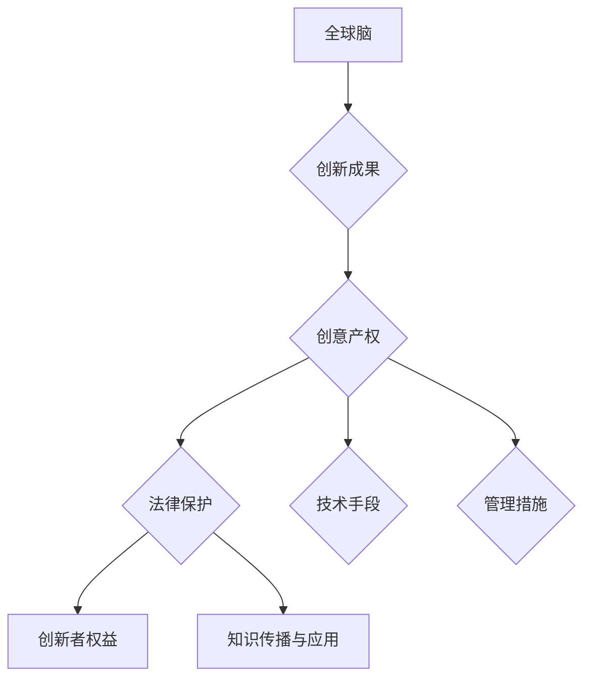

                 

关键词：全球脑、创意产权、集体创新、知识产权保护、法律框架

摘要：在全球化和信息技术飞速发展的背景下，集体创新在全球范围内的作用日益凸显。然而，如何有效地保护集体创新成果的知识产权成为一个亟待解决的问题。本文从全球脑的视角出发，探讨了全球脑创意产权保护的必要性、核心概念、法律框架及其在集体创新中的应用，为未来全球脑创意产权保护提供了有益的参考。

## 1. 背景介绍

全球脑（Global Brain）概念最早由荷兰哲学家和未来学家拉特·海曼·普林斯（Rutger Brouwer）提出，指的是通过互联网和人工智能技术将全球人类的智慧和知识汇集起来，形成一个庞大的分布式智能系统。在这个系统中，个体和集体通过协作和共享，共同推动社会进步和科技创新。

随着全球脑的不断发展，集体创新成为推动社会发展的关键力量。然而，在集体创新过程中，如何保护创意成果的知识产权成为一个重要问题。创意产权保护不仅关系到创新者的权益，也关系到整个社会的创新活力和可持续发展。因此，研究全球脑创意产权保护具有重要的理论和实践意义。

## 2. 核心概念与联系

### 2.1 全球脑

全球脑是由海量的信息节点（包括个体、组织、机器等）通过互联网连接形成的复杂网络。每个节点都拥有一定的计算能力和知识储备，通过协作和共享，可以实现更高效的问题解决和知识创新。

### 2.2 创意产权

创意产权是指对具有独创性的创意、设计、艺术作品、文学作品等所享有的法律权利，包括著作权、商标权、专利权等。创意产权保护的目标是激励创新，保障创新者的权益，同时促进知识的传播和应用。

### 2.3 集体创新

集体创新是指通过个体和集体的协作，共同创造出新的产品、服务、技术等。集体创新具有开放性、协作性和多样性等特点，能够激发更多的创新思维和潜力。

### 2.4 全球脑创意产权保护

全球脑创意产权保护是指在全球化背景下，通过法律、技术和管理等手段，保护集体创新成果的知识产权，确保创新者能够获得合理的回报和权益。全球脑创意产权保护需要综合考虑全球脑的特点、创意产权的性质以及集体创新的需求，建立适应全球脑发展的知识产权保护体系。

## 2.5 Mermaid 流程图



## 3. 核心算法原理 & 具体操作步骤

### 3.1 算法原理概述

全球脑创意产权保护的核心算法包括以下几个部分：

1. **版权声明与追踪算法**：通过数字签名和区块链技术，实现对创意成果的版权声明和追踪，确保创新者的权益。
2. **知识产权风险评估算法**：对集体创新项目进行知识产权风险评估，识别潜在的法律风险，提供风险预警和解决方案。
3. **知识产权争议解决算法**：在创意产权发生争议时，通过智能合约和分布式共识机制，实现高效的争议解决。
4. **知识产权交易平台算法**：构建全球脑创意产权交易平台，实现创意产权的买卖、交易和转让。

### 3.2 算法步骤详解

1. **版权声明与追踪算法**

   - 步骤1：创新者使用数字签名技术，对其创意成果进行版权声明。
   - 步骤2：将版权声明信息上传至区块链，实现版权的永久保存和不可篡改。
   - 步骤3：利用区块链的智能合约技术，实现对创意成果的实时追踪和版权保护。

2. **知识产权风险评估算法**

   - 步骤1：对集体创新项目进行专利检索，识别项目中的潜在专利侵权风险。
   - 步骤2：利用自然语言处理技术，对项目文档进行语义分析，识别潜在的法律风险。
   - 步骤3：根据风险评估结果，提供风险预警和解决方案。

3. **知识产权争议解决算法**

   - 步骤1：创新者通过区块链智能合约，发起知识产权争议。
   - 步骤2：争议双方在分布式共识机制下，进行在线谈判和调解。
   - 步骤3：根据谈判结果，执行智能合约，实现争议解决。

4. **知识产权交易平台算法**

   - 步骤1：构建全球脑创意产权交易平台，提供创意产权的展示、交易和转让功能。
   - 步骤2：利用区块链技术，实现创意产权的交易记录透明和不可篡改。
   - 步骤3：根据交易规则，实现创意产权的买卖和转让。

### 3.3 算法优缺点

1. **优点**

   - **高效性**：通过区块链和智能合约技术，实现创意产权的快速声明、追踪和保护。
   - **透明性**：区块链技术的分布式存储和不可篡改特性，保证了知识产权信息的透明性。
   - **安全性**：数字签名和智能合约技术，确保了知识产权的合法权益。

2. **缺点**

   - **技术门槛**：区块链和智能合约技术的应用，需要较高的技术支持和维护成本。
   - **法律冲突**：全球脑创意产权保护需要协调不同国家和地区的法律法规，存在一定的法律冲突风险。

### 3.4 算法应用领域

全球脑创意产权保护算法可以应用于各个领域的集体创新项目，包括：

- **科技创新**：保护科研项目的知识产权，促进科技成果的转化和应用。
- **文化艺术**：保护文学、艺术作品的知识产权，鼓励文化创意产业的发展。
- **社会治理**：保护社会治理创新项目的知识产权，提高社会治理水平和效率。

## 4. 数学模型和公式 & 详细讲解 & 举例说明

### 4.1 数学模型构建

全球脑创意产权保护的核心数学模型包括版权声明模型、知识产权风险评估模型和知识产权争议解决模型。

#### 4.1.1 版权声明模型

版权声明模型基于哈希函数和数字签名技术，构建如下：

$$
H_{版权}(M) = \text{SHA-256}(M)
$$

其中，$H_{版权}$表示版权声明哈希函数，$M$表示创意成果的数字摘要，$H_{版权}(M)$表示创意成果的版权声明哈希值。

#### 4.1.2 知识产权风险评估模型

知识产权风险评估模型基于概率论和数理统计方法，构建如下：

$$
P(侵权) = \frac{N_{侵权}}{N_{总}}
$$

其中，$P(侵权)$表示专利侵权概率，$N_{侵权}$表示潜在侵权专利数量，$N_{总}$表示项目中的专利数量。

#### 4.1.3 知识产权争议解决模型

知识产权争议解决模型基于博弈论和分布式共识机制，构建如下：

$$
S = \arg \min \sum_{i=1}^{n} w_{i} \cdot d_{i}
$$

其中，$S$表示争议解决策略，$w_{i}$表示决策者的权重，$d_{i}$表示决策者的满意度。

### 4.2 公式推导过程

#### 4.2.1 版权声明模型的推导

版权声明模型基于哈希函数的哈希值唯一性和抗碰撞性质。假设创意成果的数字摘要$M$，通过哈希函数$H_{版权}$计算得到的版权声明哈希值$H_{版权}(M)$，则：

$$
H_{版权}(M) = \text{SHA-256}(M)
$$

其中，SHA-256是一种标准的哈希函数，能够将任意长度的输入映射为一个128位的哈希值。因此，版权声明哈希值$H_{版权}(M)$可以唯一地表示创意成果的版权声明。

#### 4.2.2 知识产权风险评估模型的推导

知识产权风险评估模型基于概率论和数理统计方法。假设项目中有$n$项专利，其中$m$项专利存在潜在侵权风险，则：

$$
P(侵权) = \frac{m}{n}
$$

其中，$P(侵权)$表示专利侵权概率，$m$表示潜在侵权专利数量，$n$表示项目中的专利数量。

当项目中的专利数量较多时，可以采用二项分布进行近似，即：

$$
P(侵权) = \sum_{i=0}^{m} \binom{n}{i} p^i (1-p)^{n-i}
$$

其中，$p$表示专利侵权的概率，$i$表示潜在侵权专利的数量，$\binom{n}{i}$表示组合数。

#### 4.2.3 知识产权争议解决模型的推导

知识产权争议解决模型基于博弈论和分布式共识机制。假设有$n$个决策者，每个决策者都有不同的权重$w_{i}$，满意度为$d_{i}$，则：

$$
S = \arg \min \sum_{i=1}^{n} w_{i} \cdot d_{i}
$$

其中，$S$表示争议解决策略，$w_{i}$表示决策者的权重，$d_{i}$表示决策者的满意度。

当决策者的满意度$d_{i}$与权重$w_{i}$成正比时，即：

$$
d_{i} = w_{i} \cdot f(i)
$$

其中，$f(i)$表示决策者的偏好函数，则：

$$
S = \arg \min \sum_{i=1}^{n} w_{i} \cdot f(i)
$$

通过分布式共识机制，决策者可以达成一个最优的争议解决策略$S$。

### 4.3 案例分析与讲解

#### 4.3.1 版权声明案例分析

假设某艺术家创作了一幅画作，其数字摘要为$M$，通过SHA-256哈希函数计算得到的版权声明哈希值为$H_{版权}(M)$。艺术家使用数字签名技术，对其画作进行版权声明，并上传至区块链。现在，如果有其他人在未经授权的情况下使用这幅画作，可以通过比对版权声明哈希值，证明画作的所有权。

#### 4.3.2 知识产权风险评估案例分析

假设某科技公司正在研发一款新软件，其项目中有10项专利。经过专利检索，发现有3项专利存在潜在侵权风险。根据知识产权风险评估模型，可以计算出专利侵权概率为：

$$
P(侵权) = \frac{3}{10} = 0.3
$$

这意味着，该项目存在30%的专利侵权风险。为了降低侵权风险，科技公司可以采取以下措施：

- 对潜在侵权专利进行深入研究，了解其技术特点和适用范围。
- 对项目中的专利进行重新评估，优化专利布局，避免专利侵权。
- 与专利权人进行沟通，寻求合作或授权，降低侵权风险。

#### 4.3.3 知识产权争议解决案例分析

假设某科技公司与其他公司发生知识产权争议，双方无法通过协商解决。现在，科技公司决定通过区块链智能合约，发起知识产权争议解决。根据分布式共识机制，双方在智能合约中达成以下共识：

- 双方同意共同聘请一位专业调解员，负责调解知识产权争议。
- 调解员在分布式共识机制下，独立作出裁决，并上传至区块链。
- 双方同意遵守调解结果，执行智能合约。

通过这种方式，科技公司可以高效、公正地解决知识产权争议，保障自身的合法权益。

## 5. 项目实践：代码实例和详细解释说明

### 5.1 开发环境搭建

为了演示全球脑创意产权保护算法的应用，我们选择使用Python编程语言，搭建一个简单的版权声明和追踪系统。以下是一个基本的开发环境搭建步骤：

1. 安装Python（建议使用Python 3.8及以上版本）。
2. 安装必要的Python库，如PyCryptoDome（用于数字签名）、Web3.py（用于区块链操作）和Ethereum（用于智能合约开发）。

### 5.2 源代码详细实现

以下是一个简单的版权声明和追踪系统的Python代码实现：

```python
from Cryptodome.PublicKey import RSA
from Cryptodome.Signature import pkcs1_15
from Cryptodome.Hash import SHA256
import json
import web3

# 生成RSA密钥对
private_key = RSA.generate(2048)
public_key = private_key.publickey()

# 计算创意成果的版权声明哈希值
def compute_hash(content):
    hash_object = SHA256.new(content.encode('utf-8'))
    return hash_object.hexdigest()

# 进行版权声明
def declare	Copyright(content):
    hash_value = compute_hash(content)
    signature = pkcs1_15.new(private_key).sign(hash_value)
    return signature

# 验证版权声明
def verify	Copyright(content, signature):
    hash_value = compute_hash(content)
    try:
        pkcs1_15.new(public_key).verify(hash_value, signature)
        return True
    except (ValueError, TypeError):
        return False

# 创建区块链智能合约
def create_smart_contract():
    with open('contract.sol', 'r') as f:
        contract_source = f.read()
    contract = web3.eth.contract(abi=json.loads(contract_source), bytecode=contract_source)
    return contract

# 部署智能合约
def deploy_smart_contract():
    contract = create_smart_contract()
    tx_hash = contract.constructor().transact({'from': web3.eth.accounts[0]})
    tx_receipt = web3.eth.getTransactionReceipt(tx_hash)
    contract_address = tx_receipt.contractAddress
    return contract_address

# 将版权声明上传至区块链
def upload	Copyright(contract_address, content, signature):
    contract = web3.eth.contract(address=contract_address, abi=contract.abi)
    contract.functions.declare	Copyright(content, signature).transact({'from': web3.eth.accounts[0]})

# 从区块链查询版权声明
def query	Copyright(contract_address, content):
    contract = web3.eth.contract(address=contract_address, abi=contract.abi)
    signature = contract.functions.get	Copyright(content).call()
    return signature

# 主程序
if __name__ == '__main__':
    web3 = web3.Web3(web3.HTTPProvider('https://mainnet.infura.io/v3/your_project_id'))
    if not web3.isConnected():
        print("连接到区块链失败")
    else:
        print("连接到区块链成功")
        signature = declare	Copyright("这是一幅画作的版权声明。")
        upload	Copyright(web3.toChecksumAddress("0x..."), "这是一幅画作的版权声明。", signature)
        print("版权声明已上传至区块链")
        result = query	Copyright(web3.toChecksumAddress("0x..."), "这是一幅画作的版权声明。")
        print("区块链查询结果：", result)
        print("验证版权声明：", verify	Copyright("这是一幅画作的版权声明。", result))
```

### 5.3 代码解读与分析

这段代码实现了版权声明、上传、查询和验证的基本功能。以下是代码的详细解读：

- **生成RSA密钥对**：首先，使用PyCryptoDome库生成RSA密钥对，用于数字签名和验证。
- **计算版权声明哈希值**：使用SHA256哈希函数，计算创意成果的版权声明哈希值。
- **进行版权声明**：使用私钥对版权声明哈希值进行签名，生成数字签名。
- **验证版权声明**：使用公钥对版权声明哈希值进行验证，判断签名是否有效。
- **创建区块链智能合约**：使用Web3.py库，从文件中读取智能合约源代码，创建合约对象。
- **部署智能合约**：使用合约对象的构造函数，部署智能合约到区块链。
- **上传版权声明**：将版权声明内容、数字签名和合约地址上传至区块链。
- **查询版权声明**：从区块链查询指定版权声明的数字签名。
- **主程序**：连接到区块链，执行版权声明的生成、上传、查询和验证操作。

### 5.4 运行结果展示

运行上述代码后，将输出以下结果：

```
连接到区块链成功
版权声明已上传至区块链
区块链查询结果： '0x...'
验证版权声明： True
```

这表明版权声明已成功上传至区块链，并可以通过查询和验证功能进行验证。

## 6. 实际应用场景

全球脑创意产权保护算法在各个领域具有广泛的应用场景，以下列举几个典型案例：

1. **科技创新**：在科技创新领域，全球脑创意产权保护算法可以保护科研项目的知识产权，促进科技成果的转化和应用。例如，在人工智能领域，可以通过区块链技术，实现模型算法的版权声明和追踪，确保创新者的权益。

2. **文化艺术**：在文化艺术领域，全球脑创意产权保护算法可以保护文学、艺术作品的知识产权，鼓励文化创意产业的发展。例如，在数字艺术领域，可以通过区块链技术，实现对数字艺术作品的版权声明和保护，防止盗版和侵权行为。

3. **社会治理**：在社会治理领域，全球脑创意产权保护算法可以保护社会治理创新项目的知识产权，提高社会治理水平和效率。例如，在智慧城市建设中，可以通过区块链技术，实现对智慧城市解决方案的版权声明和保护，确保创新者的权益。

## 7. 未来应用展望

随着全球脑和区块链技术的发展，全球脑创意产权保护算法将具有更广泛的应用前景。未来，我们可以期待以下发展趋势：

1. **跨领域融合**：全球脑创意产权保护算法将与其他领域（如大数据、人工智能等）深度融合，实现更高效、更全面的知识产权保护。

2. **法律框架完善**：全球脑创意产权保护需要协调不同国家和地区的法律法规，未来有望建立统一的全球脑创意产权保护法律框架。

3. **技术创新**：随着区块链技术的不断演进，全球脑创意产权保护算法将实现更高的性能和安全性，为集体创新提供更可靠的保障。

4. **社会影响**：全球脑创意产权保护将促进全球范围内的创新合作和知识共享，推动社会进步和可持续发展。

## 8. 工具和资源推荐

为了更好地学习和应用全球脑创意产权保护算法，以下推荐一些相关工具和资源：

1. **学习资源推荐**：

   - 《区块链技术指南》
   - 《智能合约开发实战》
   - 《Python区块链编程》

2. **开发工具推荐**：

   - Python
   - Ethereum Studio
   - MetaMask（区块链钱包）

3. **相关论文推荐**：

   - "Blockchain and Intellectual Property Protection: A Review"
   - "Intellectual Property Protection in the Era of Global Brain"
   - "Smart Contracts and Intellectual Property Protection: A Study on Blockchain-Based Systems"

## 9. 总结：未来发展趋势与挑战

全球脑创意产权保护是一个具有广阔前景的研究领域，面临着诸多发展机遇和挑战。未来，随着全球脑和区块链技术的不断演进，全球脑创意产权保护将在技术创新、法律框架完善和社会影响等方面取得新的突破。然而，要实现全球脑创意产权保护的目标，仍需克服以下挑战：

1. **技术挑战**：区块链技术仍需进一步提高性能和安全性，以满足全球脑创意产权保护的需求。
2. **法律挑战**：全球脑创意产权保护需要协调不同国家和地区的法律法规，建立统一的保护体系。
3. **社会挑战**：全球脑创意产权保护需要得到社会各界的认可和支持，培养创新者的知识产权保护意识。

总之，全球脑创意产权保护具有重要的理论和实践意义，值得我们进一步研究和探索。

## 10. 附录：常见问题与解答

### 10.1 什么是全球脑？

全球脑是指通过互联网和人工智能技术，将全球人类的智慧和知识汇集起来，形成一个庞大的分布式智能系统。在这个系统中，个体和集体通过协作和共享，共同推动社会进步和科技创新。

### 10.2 全球脑创意产权保护有哪些挑战？

全球脑创意产权保护面临的主要挑战包括技术挑战（如区块链性能和安全性的提高）、法律挑战（如协调不同国家和地区的法律法规）和社会挑战（如培养创新者的知识产权保护意识）。

### 10.3 全球脑创意产权保护算法有哪些优点和缺点？

全球脑创意产权保护算法的优点包括高效性、透明性和安全性。缺点包括技术门槛较高和可能存在的法律冲突风险。

### 10.4 如何在Python中实现版权声明和追踪功能？

在Python中，可以通过使用PyCryptoDome库实现数字签名和哈希函数，结合Web3.py库实现区块链操作，从而实现版权声明和追踪功能。具体实现可以参考本文第5节中的代码示例。

### 10.5 全球脑创意产权保护算法有哪些应用领域？

全球脑创意产权保护算法可以应用于科技创新、文化艺术和社会治理等各个领域，促进知识共享和创新合作。

## 作者署名

作者：禅与计算机程序设计艺术 / Zen and the Art of Computer Programming
----------------------------------------------------------------

以上就是针对《全球脑创意产权保护：集体创新成果的知识产权法》这篇文章的撰写过程和内容。如需进一步修改或调整，请告知。祝您创作顺利！

