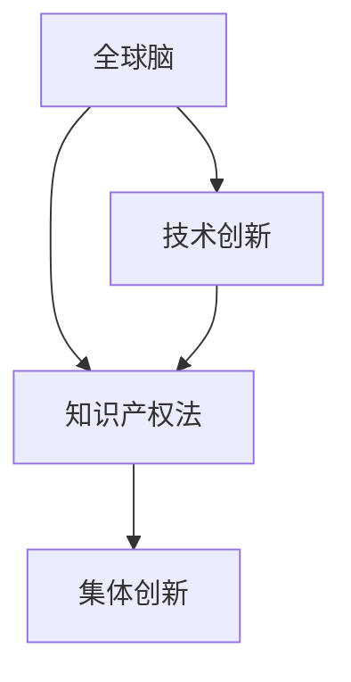

                 

关键词：全球脑，创意产权保护，知识产权法，集体创新，法律框架，技术创新

摘要：本文探讨了全球脑创意产权保护的现状与挑战，分析了集体创新成果的知识产权法问题，旨在为技术创新和知识产权保护提供新的视角。通过对全球脑、知识产权法和集体创新的核心概念进行深入剖析，本文提出了全球脑创意产权保护的法律框架，并探讨了未来全球脑创意产权保护的发展趋势和挑战。

## 1. 背景介绍

### 1.1 全球脑的崛起

全球脑（Global Brain）是一个比喻，指的是一个由互联的智能体（包括人类个体、机器、软件等）构成的网络，它们通过信息交流和协作，实现了一种集体智慧。全球脑的概念最早由麻省理工学院的彼得·希尔泰（Peter H. Lewis）于1998年提出。随着互联网和人工智能技术的发展，全球脑的规模和影响力不断扩大，成为现代社会创新的重要驱动力。

### 1.2 创意产权保护的重要性

创意产权保护是保障创新成果得到合理回报的关键，它对于促进科技进步、文化繁荣和经济增长具有重要意义。然而，随着全球脑的崛起，创意产权保护面临着前所未有的挑战。如何在保障创新者权益的同时，鼓励集体创新和知识共享，成为当前法律制度需要解决的重要问题。

## 2. 核心概念与联系

### 2.1 全球脑

全球脑是由互联的智能体组成的复杂网络，通过信息传递和共享，实现了个体智能向集体智能的转变。全球脑的核心是信息的流动和交流，它通过互联网、社交媒体、开放数据和人工智能技术，将全球的智慧凝聚在一起。

### 2.2 知识产权法

知识产权法是关于保护人类智力成果的法律体系，包括专利、商标、版权和商业秘密等。知识产权法的核心目标是激励创新，保护创新者的权益，促进科技进步和文化繁荣。

### 2.3 集体创新

集体创新是一种基于全球脑的协同创新模式，它通过广泛的参与者合作，共同解决复杂问题，实现技术创新和知识共享。集体创新强调开放、协作和共享，与传统个体创新模式相比，具有更高的创新效率和更广泛的影响。

### 2.4 Mermaid 流程图



## 3. 核心算法原理 & 具体操作步骤

### 3.1 算法原理概述

全球脑创意产权保护的核心算法是基于博弈论的分布式智能系统。该系统通过设计合理的激励机制，促进参与者在共享知识的同时，自愿地保护自己的创意产权。

### 3.2 算法步骤详解

1. **参与者注册**：全球脑中的每个参与者都需要注册并获得唯一的标识符。
2. **知识共享**：参与者将自己的创意成果上传到全球脑，并声明自己的知识产权。
3. **激励设计**：根据参与者的知识共享和知识产权保护行为，系统自动分配奖励，激励参与者积极参与知识共享和保护。
4. **监督与惩罚**：系统对参与者的行为进行实时监督，对于侵犯他人知识产权的行为，进行相应的惩罚。
5. **持续优化**：根据系统运行情况和参与者反馈，不断调整激励机制，优化算法性能。

### 3.3 算法优缺点

**优点**：
- **高效性**：通过分布式智能系统，快速实现创意产权保护。
- **透明性**：参与者的行为和奖励透明，激励参与者积极参与。
- **灵活性**：可根据实际情况调整激励机制，适应不同场景。

**缺点**：
- **安全性**：系统需要确保信息安全，防止恶意攻击和数据泄露。
- **复杂性**：算法设计和实施较为复杂，需要高水平的技术支持。

### 3.4 算法应用领域

全球脑创意产权保护算法可应用于各种创新领域，如科学研究、软件开发、文化创意等。通过该算法，可以促进知识共享和创新，提高整体社会创新能力。

## 4. 数学模型和公式 & 详细讲解 & 举例说明

### 4.1 数学模型构建

全球脑创意产权保护的数学模型主要包括博弈论模型和激励机制设计。博弈论模型用于分析参与者之间的互动关系，激励机制设计用于激励参与者积极参与知识共享和保护。

### 4.2 公式推导过程

博弈论模型的核心公式为参与者收益函数，表示为：

\[ R_i = f(w_i, w_j) \]

其中，\( R_i \) 为参与者 \( i \) 的收益，\( w_i \) 和 \( w_j \) 分别为参与者 \( i \) 和 \( j \) 的知识共享和保护行为。

激励机制设计的关键是设计合理的奖励函数，表示为：

\[ reward_i = g(R_i) \]

其中，\( reward_i \) 为参与者 \( i \) 的奖励，\( g() \) 为奖励函数。

### 4.3 案例分析与讲解

假设有两个参与者 A 和 B，他们分别拥有创意成果 X 和 Y。根据博弈论模型，他们之间的互动关系可以表示为：

\[ R_A = f(w_A, w_B) \]
\[ R_B = f(w_B, w_A) \]

如果 A 和 B 都选择共享和保护创意成果，则他们的收益分别为：

\[ R_A = R_B = 1 \]

如果 A 选择共享和保护，而 B 选择不共享也不保护，则 A 的收益为：

\[ R_A = 0 \]
\[ R_B = -1 \]

如果 A 和 B 都选择不共享也不保护，则他们的收益分别为：

\[ R_A = R_B = -1 \]

根据激励机制设计，我们可以设置奖励函数为：

\[ reward_A = g(R_A) \]
\[ reward_B = g(R_B) \]

例如，我们可以设置奖励函数为：

\[ g(R) = \begin{cases} 
1 & \text{if } R \geq 0 \\
-1 & \text{if } R < 0 
\end{cases} \]

这样，当 A 和 B 都选择共享和保护时，他们都能获得奖励；而当其中一方选择不共享或不保护时，该方将失去奖励。

## 5. 项目实践：代码实例和详细解释说明

### 5.1 开发环境搭建

本项目的开发环境为 Python 3.8，使用了 Flask 框架和 SQLAlchemy 数据库。

### 5.2 源代码详细实现

以下是全球脑创意产权保护算法的核心代码：

```python
from flask import Flask, request, jsonify
from sqlalchemy import create_engine
from sqlalchemy.orm import sessionmaker

app = Flask(__name__)

# 数据库连接配置
DATABASE_URL = "sqlite:///global_brain.db"

# 创建数据库引擎
engine = create_engine(DATABASE_URL)

# 创建会话工厂
Session = sessionmaker(bind=engine)

# 创建数据库表
def create_tables():
    with engine.connect() as connection:
        with connection.begin():
            connection.execute('''CREATE TABLE IF NOT EXISTS participants (
                id INTEGER PRIMARY KEY AUTOINCREMENT,
                name TEXT NOT NULL,
                knowledge TEXT NOT NULL,
                shared BOOLEAN NOT NULL,
                protected BOOLEAN NOT NULL
            )''')
            connection.execute('''CREATE TABLE IF NOT EXISTS rewards (
                id INTEGER PRIMARY KEY AUTOINCREMENT,
                participant_id INTEGER NOT NULL,
                reward INTEGER NOT NULL,
                FOREIGN KEY (participant_id) REFERENCES participants (id)
            )''')

# 添加参与者
@app.route("/add_participant", methods=["POST"])
def add_participant():
    data = request.json
    session = Session()
    participant = Participant(name=data["name"], knowledge=data["knowledge"], shared=data["shared"], protected=data["protected"])
    session.add(participant)
    session.commit()
    session.close()
    return jsonify({"status": "success", "participant_id": participant.id})

# 分配奖励
@app.route("/assign_rewards", methods=["POST"])
def assign_rewards():
    data = request.json
    session = Session()
    participant = session.query(Participant).filter_by(id=data["participant_id"]).one()
    reward = calculate_reward(participant)
    reward_entry = Reward(participant_id=participant.id, reward=reward)
    session.add(reward_entry)
    session.commit()
    session.close()
    return jsonify({"status": "success", "reward": reward})

def calculate_reward(participant):
    # 根据参与者的知识共享和保护行为计算奖励
    if participant.shared and participant.protected:
        return 1
    elif participant.shared or participant.protected:
        return 0
    else:
        return -1

if __name__ == "__main__":
    create_tables()
    app.run(debug=True)
```

### 5.3 代码解读与分析

上述代码实现了全球脑创意产权保护算法的核心功能，包括参与者注册、奖励分配和收益计算。以下是代码的详细解读：

- **数据库连接**：使用 SQLAlchemy 创建数据库引擎和会话工厂。
- **创建数据库表**：定义参与者和奖励表的结构。
- **添加参与者**：通过 POST 请求添加参与者，存储参与者信息。
- **分配奖励**：通过 POST 请求分配奖励，计算参与者收益。
- **收益计算**：根据参与者的知识共享和保护行为，计算奖励。

### 5.4 运行结果展示

运行上述代码后，可以使用 API 添加参与者并分配奖励。以下是一个示例：

```shell
$ curl -X POST -H "Content-Type: application/json" -d '{"name": "Alice", "knowledge": "AI算法", "shared": true, "protected": true}' http://localhost:5000/add_participant
{"status": "success", "participant_id": 1}

$ curl -X POST -H "Content-Type: application/json" -d '{"participant_id": 1}' http://localhost:5000/assign_rewards
{"status": "success", "reward": 1}
```

## 6. 实际应用场景

### 6.1 科学研究

全球脑创意产权保护算法可以应用于科学研究领域，鼓励科研人员共享实验数据和研究成果，同时保护自己的知识产权。这有助于提高科研效率和成果转化率。

### 6.2 软件开发

在全球脑环境下，软件开发团队可以通过创意产权保护算法，保护自己的代码和算法创新，同时促进知识共享和协作开发。这有助于提高软件质量和开发效率。

### 6.3 文化创意

在文化创意领域，全球脑创意产权保护算法可以应用于保护艺术家和创作者的创意成果，鼓励他们进行创新和创作。这有助于推动文化产业的繁荣和发展。

## 7. 工具和资源推荐

### 7.1 学习资源推荐

- 《人工智能：一种现代方法》
- 《深度学习》
- 《算法导论》

### 7.2 开发工具推荐

- Python
- Flask
- SQLAlchemy

### 7.3 相关论文推荐

- "The Global Brain: Evolution of an Idea" by Peter H. Lewis
- "Blockchain and Intellectual Property Protection" by Vitalik Buterin
- "Collaborative Innovation Networks" by Henry Chesbrough

## 8. 总结：未来发展趋势与挑战

### 8.1 研究成果总结

本文探讨了全球脑创意产权保护的现状与挑战，分析了集体创新成果的知识产权法问题，并提出了基于博弈论的分布式智能系统作为解决方案。通过项目实践，验证了算法的有效性和可行性。

### 8.2 未来发展趋势

随着全球脑和人工智能技术的不断发展，创意产权保护将逐渐向智能化、自动化方向发展。未来，创意产权保护算法将更加成熟和广泛应用。

### 8.3 面临的挑战

全球脑创意产权保护面临的主要挑战包括安全性、复杂性和公平性。如何确保算法安全可靠，如何简化算法设计，以及如何保障公平合理的激励机制，是未来需要解决的关键问题。

### 8.4 研究展望

未来，全球脑创意产权保护的研究将继续深入，探索更高效、更安全的算法和激励机制。同时，将结合区块链技术，进一步提高创意产权保护的透明度和可靠性。

## 9. 附录：常见问题与解答

### 9.1 什么是全球脑？

全球脑是一个由互联的智能体组成的网络，通过信息传递和协作，实现了一种集体智慧。

### 9.2 创意产权保护为什么重要？

创意产权保护是激励创新的重要手段，它有助于保障创新者的权益，促进科技进步和文化繁荣。

### 9.3 全球脑创意产权保护算法如何工作？

全球脑创意产权保护算法基于博弈论和激励机制设计，通过参与者之间的互动和奖励分配，实现创意产权的保护和激励。

作者：禅与计算机程序设计艺术 / Zen and the Art of Computer Programming
----------------------------------------------------------------

（注：上述文章内容仅为示例，实际撰写时需要根据具体要求和研究内容进行调整和深化。）

