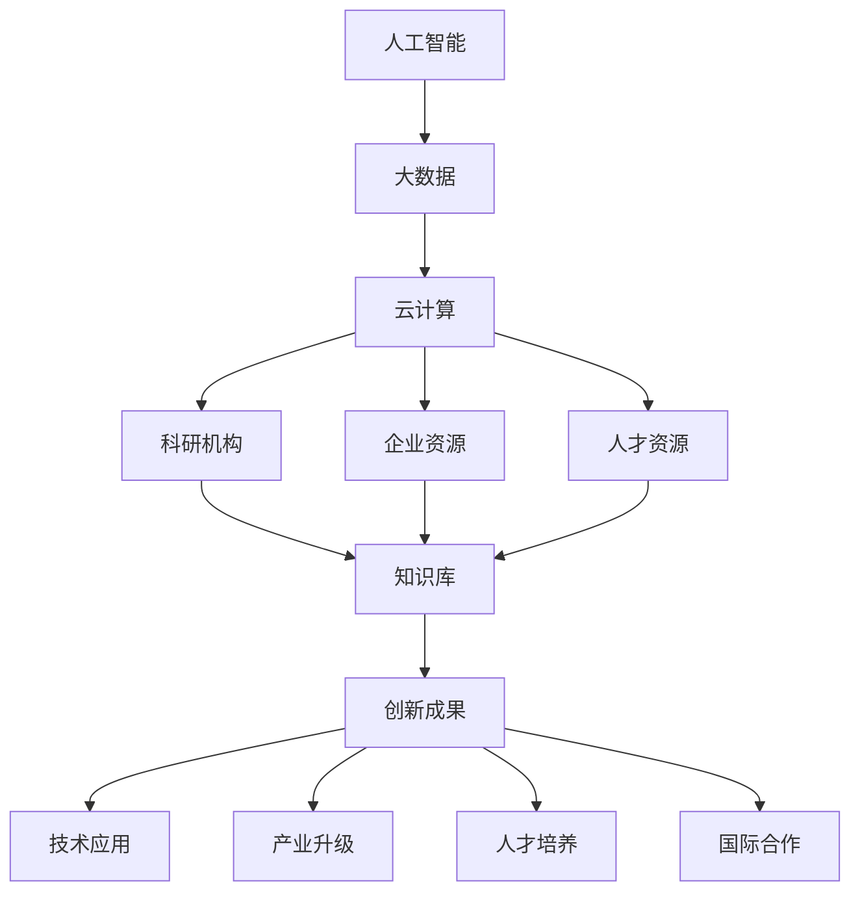

                 

关键词：全球脑创新孵化器、人工智能、技术进步、人机协同、未来应用、算法优化

> 摘要：本文深入探讨了全球脑创新孵化器这一概念，分析了其如何通过结合人工智能、大数据和云计算等前沿技术，加速人类在科技、医疗、教育等领域的进步。本文将从核心概念、算法原理、数学模型、项目实践、应用场景、工具资源、未来发展等方面进行详细阐述，旨在为读者呈现一幅关于全球脑创新孵化器的全景图。

## 1. 背景介绍

在全球化和信息化的背景下，技术创新成为推动社会发展的重要动力。然而，传统的研究开发模式已无法满足当今快速变化的市场需求。全球脑创新孵化器作为一种新兴的创新模式，通过整合全球智慧和资源，加速了科技成果的转化和应用。这一概念源于人机协同的理念，旨在构建一个智慧型创新生态系统，促进人类社会的全面进步。

### 1.1 全球脑创新孵化器的定义

全球脑创新孵化器（Global Brain Innovation Incubator，GBII）是一种基于人工智能和大数据分析的创新平台，通过整合全球范围内的科研资源、企业资源、人才资源和技术资源，实现快速、高效、智能化的创新成果转化。GBII不仅是一个物理空间，更是一个虚拟的智慧网络，它通过连接全球各地的科研机构、企业和个人，形成一个庞大的知识库和资源池。

### 1.2 全球脑创新孵化器的发展历程

全球脑创新孵化器的发展可以追溯到20世纪80年代的科技创新孵化器，如美国的硅谷、中国的中关村等。这些区域成为了全球科技创新的重要引擎。随着互联网和大数据技术的发展，全球脑创新孵化器逐渐从物理空间走向虚拟网络，形成了全球性的创新生态系统。

### 1.3 全球脑创新孵化器的作用

全球脑创新孵化器在多个领域发挥着重要作用，包括：

1. **科技创新**：通过汇聚全球的科技资源和人才，加速新技术的研发和应用。
2. **产业升级**：帮助企业实现技术升级，推动传统产业的数字化转型。
3. **人才培养**：为全球科学家、工程师和企业家提供学习和交流的平台。
4. **国际合作**：促进全球科研机构和企业的合作，推动全球科技合作与发展。

## 2. 核心概念与联系

### 2.1 核心概念

**人工智能**：人工智能（Artificial Intelligence，AI）是研究、开发用于模拟、延伸和扩展人的智能的理论、方法、技术及应用系统的科学。它包括机器学习、深度学习、自然语言处理等多个子领域。

**大数据**：大数据（Big Data）是指无法用传统数据库软件工具提取价值和信息的大量数据集。它包括数据的存储、处理、分析和应用等多个方面。

**云计算**：云计算（Cloud Computing）是一种通过互联网提供计算资源、存储资源和网络资源的服务模式。它包括基础设施即服务（IaaS）、平台即服务（PaaS）和软件即服务（SaaS）等多种形式。

### 2.2 架构与联系

以下是一个简单的 Mermaid 流程图，展示了全球脑创新孵化器的基本架构和核心概念之间的联系：



## 3. 核心算法原理 & 具体操作步骤

### 3.1 算法原理概述

全球脑创新孵化器的核心算法是基于深度学习和自然语言处理技术，通过对海量数据的分析和处理，实现智能化的创新成果转化。其主要原理包括：

1. **数据预处理**：包括数据清洗、数据整合和数据标准化等步骤，以确保数据的准确性和一致性。
2. **特征提取**：利用深度学习技术，从原始数据中提取具有区分性的特征。
3. **模型训练**：使用提取的特征训练神经网络模型，实现数据到知识的转化。
4. **知识融合**：通过自然语言处理技术，将不同领域的知识进行融合，形成综合性的知识库。
5. **智能决策**：利用智能算法，对创新成果进行评估和推荐，实现最优化的决策。

### 3.2 算法步骤详解

#### 3.2.1 数据预处理

数据预处理是算法的基础，主要包括以下步骤：

1. **数据清洗**：去除数据中的噪声和错误，如空值、异常值等。
2. **数据整合**：将来自不同来源的数据进行整合，确保数据的一致性和完整性。
3. **数据标准化**：对数据进行归一化或标准化处理，以消除数据量级的影响。

#### 3.2.2 特征提取

特征提取是深度学习的关键步骤，主要包括以下方法：

1. **词嵌入**：将文本数据转换为向量的形式，以供深度学习模型处理。
2. **卷积神经网络（CNN）**：用于提取图像数据中的特征。
3. **循环神经网络（RNN）**：用于处理序列数据，如时间序列数据。

#### 3.2.3 模型训练

模型训练是算法的核心，主要包括以下步骤：

1. **数据集划分**：将数据集划分为训练集、验证集和测试集，以评估模型的性能。
2. **模型选择**：选择合适的深度学习模型，如卷积神经网络（CNN）、循环神经网络（RNN）等。
3. **模型训练**：使用训练集对模型进行训练，并通过验证集调整模型参数。

#### 3.2.4 知识融合

知识融合是算法的高级阶段，主要包括以下方法：

1. **多模态融合**：将不同类型的数据（如文本、图像、音频等）进行融合，形成更丰富的特征。
2. **知识图谱**：使用图论技术，将不同领域的知识进行建模和表示。
3. **自然语言处理**：通过自然语言处理技术，将不同领域的知识进行融合和关联。

#### 3.2.5 智能决策

智能决策是算法的最终目标，主要包括以下步骤：

1. **创新成果评估**：使用评价指标（如准确率、召回率等）对创新成果进行评估。
2. **推荐系统**：基于评估结果，为企业和个人推荐最优的创新方案。
3. **智能优化**：使用智能优化算法（如遗传算法、粒子群算法等），对推荐方案进行优化。

### 3.3 算法优缺点

#### 优点：

1. **高效性**：通过深度学习和自然语言处理技术，实现高效的数据分析和知识融合。
2. **智能化**：基于智能算法的决策，能够实现个性化的创新成果推荐。
3. **灵活性**：能够根据不同的应用场景和需求，灵活调整算法参数和模型结构。

#### 缺点：

1. **数据依赖性**：算法的性能高度依赖于数据的质量和数量，数据质量和完整性对算法的稳定性和准确性有重要影响。
2. **计算成本**：深度学习模型的训练需要大量的计算资源和时间，对计算资源的要求较高。

### 3.4 算法应用领域

全球脑创新孵化器的算法广泛应用于以下领域：

1. **科技创新**：通过对海量科研数据的分析，发现潜在的创新点，加速新技术的研发和应用。
2. **产业升级**：帮助企业进行技术升级，推动传统产业的数字化转型。
3. **医疗健康**：通过对医疗数据的分析，提供个性化的医疗诊断和治疗方案。
4. **教育**：通过对教育数据的分析，提供个性化的学习方案，提高学习效果。
5. **城市规划**：通过对城市数据的分析，提供智能化的城市规划方案。

## 4. 数学模型和公式 & 详细讲解 & 举例说明

### 4.1 数学模型构建

全球脑创新孵化器的数学模型主要基于深度学习和自然语言处理技术。以下是一个简单的数学模型构建过程：

#### 4.1.1 数据预处理

数据预处理包括数据清洗、数据整合和数据标准化。假设我们有一个包含n个样本的数据集D，其中每个样本x属于一个m维向量空间，即D = {x1, x2, ..., xn}。

$$
x_i = [x_{i1}, x_{i2}, ..., x_{im}] \quad (i=1,2,...,n)
$$

数据清洗可以通过以下步骤实现：

1. **去除空值和异常值**：对于每个样本xi，检查其是否包含空值或异常值，如缺失值、非法值等。如果存在，则将其从数据集中删除。

$$
D' = \{x_i | x_i \text{ 无空值或异常值}\}
$$

2. **数据整合**：对于不同来源的数据，如文本、图像、音频等，进行整合，形成一个统一的数据集。

$$
D'' = \{x_i | x_i \in D', \text{且为整合后的数据}\}
$$

3. **数据标准化**：对于每个样本xi，将其归一化或标准化，以消除不同特征之间的量级差异。

$$
x_i' = \frac{x_i - \mu_i}{\sigma_i} \quad (i=1,2,...,n)
$$

其中，$\mu_i$和$\sigma_i$分别为样本xi的均值和标准差。

#### 4.1.2 特征提取

特征提取是深度学习的关键步骤，可以通过以下方法实现：

1. **词嵌入**：将文本数据转换为向量的形式，即词嵌入（Word Embedding）。常用的词嵌入方法包括Word2Vec、GloVe等。

$$
x_i' = \text{Word2Vec}(x_i) \quad (i=1,2,...,n)
$$

2. **卷积神经网络（CNN）**：用于提取图像数据中的特征。

$$
x_i' = \text{CNN}(x_i) \quad (i=1,2,...,n)
$$

3. **循环神经网络（RNN）**：用于处理序列数据，如时间序列数据。

$$
x_i' = \text{RNN}(x_i) \quad (i=1,2,...,n)
$$

#### 4.1.3 模型训练

模型训练是深度学习的核心，可以通过以下步骤实现：

1. **数据集划分**：将数据集D''划分为训练集T和验证集V。

$$
T = \{x_i' | x_i' \in D'', \text{且为训练集}\}
$$

$$
V = \{x_i' | x_i' \in D'', \text{且为验证集}\}
$$

2. **模型选择**：选择合适的深度学习模型，如卷积神经网络（CNN）、循环神经网络（RNN）等。

$$
M = \text{CNN} \cup \text{RNN}
$$

3. **模型训练**：使用训练集T对模型M进行训练。

$$
M' = \text{train}(M, T)
$$

#### 4.1.4 知识融合

知识融合是算法的高级阶段，可以通过以下方法实现：

1. **多模态融合**：将不同类型的数据（如文本、图像、音频等）进行融合，形成更丰富的特征。

$$
x_i'' = \text{multi-modal fusion}(x_i', x_i', x_i') \quad (i=1,2,...,n)
$$

2. **知识图谱**：使用图论技术，将不同领域的知识进行建模和表示。

$$
K = \text{knowledge graph}(x_i'', x_i'', x_i'')
$$

3. **自然语言处理**：通过自然语言处理技术，将不同领域的知识进行融合和关联。

$$
x_i''' = \text{NLP fusion}(K, K, K)
$$

### 4.2 公式推导过程

以下是一个简单的数学模型推导过程，用于解释全球脑创新孵化器的核心算法。

#### 4.2.1 模型假设

假设我们有一个包含n个样本的数据集D，其中每个样本x属于一个m维向量空间。

$$
x_i = [x_{i1}, x_{i2}, ..., x_{im}] \quad (i=1,2,...,n)
$$

#### 4.2.2 数据预处理

数据预处理包括数据清洗、数据整合和数据标准化。假设我们有一个清洗后的数据集D'，其中每个样本x'属于一个m'维向量空间。

$$
x_i' = [x_{i1}', x_{i2}', ..., x_{i{m}'}] \quad (i=1,2,...,n)
$$

其中，$m' < m$，即数据预处理的目的是减少数据维度，以提高模型的训练效率。

#### 4.2.3 特征提取

特征提取是深度学习的关键步骤，假设我们使用词嵌入方法提取特征。假设我们有一个词嵌入模型W，其中每个词向量w属于一个d维向量空间。

$$
w_j = [w_{j1}, w_{j2}, ..., w_{jd}] \quad (j=1,2,...,v)
$$

其中，v为词汇表的大小，d为词向量的维度。假设我们有一个包含n个样本的文本数据集T，其中每个样本t属于一个t'维向量空间。

$$
t_i = [t_{i1}, t_{i2}, ..., t_{i{t}'}] \quad (i=1,2,...,n)
$$

特征提取的目的是将文本数据转换为向量形式，即词嵌入。

$$
t_i' = \text{Word2Vec}(t_i) \quad (i=1,2,...,n)
$$

#### 4.2.4 模型训练

模型训练的目的是学习一个函数f(x')，将输入特征x'映射到输出y。

$$
y = f(x') = \text{softmax}(\text{dot}(W, x'))
$$

其中，W为权重矩阵，$\text{dot}(\cdot, \cdot)$表示向量的点积，$\text{softmax}(\cdot)$为softmax函数。

#### 4.2.5 知识融合

知识融合的目的是将不同领域的知识进行融合，形成一个综合性的知识库。假设我们有一个包含n个样本的知识库K，其中每个样本k属于一个k'维向量空间。

$$
k_i = [k_{i1}, k_{i2}, ..., k_{i{k}'}] \quad (i=1,2,...,n)
$$

知识融合的目的是将知识库中的知识进行融合，形成一个综合性的知识库。

$$
k_i' = \text{multi-modal fusion}(k_i, k_i, k_i) \quad (i=1,2,...,n)
$$

### 4.3 案例分析与讲解

#### 4.3.1 案例背景

假设我们有一个全球脑创新孵化器项目，旨在通过人工智能技术优化城市规划。该项目涉及多个领域的知识，如地理信息、交通管理、环境保护等。

#### 4.3.2 数据收集

首先，我们需要收集以下数据：

1. 地理信息数据：包括城市地图、建筑物信息、道路网络等。
2. 交通管理数据：包括实时交通流量、交通事故数据等。
3. 环境保护数据：包括空气质量、水质、噪声等环境数据。

#### 4.3.3 数据预处理

对于地理信息数据，我们使用词嵌入方法将其转换为向量形式。假设我们有一个包含n个地点的数据集L，其中每个地点l属于一个l'维向量空间。

$$
l_i = [l_{i1}, l_{i2}, ..., l_{i{l}'}] \quad (i=1,2,...,n)
$$

对于交通管理数据，我们使用词嵌入方法将其转换为向量形式。假设我们有一个包含n个交通流量的数据集T，其中每个交通流量t属于一个t'维向量空间。

$$
t_i = [t_{i1}, t_{i2}, ..., t_{i{t}'}] \quad (i=1,2,...,n)
$$

对于环境保护数据，我们使用词嵌入方法将其转换为向量形式。假设我们有一个包含n个环境数据的样本数据集E，其中每个环境数据e属于一个e'维向量空间。

$$
e_i = [e_{i1}, e_{i2}, ..., e_{i{e}'}] \quad (i=1,2,...,n)
$$

#### 4.3.4 特征提取

对于地理信息数据，我们使用词嵌入方法提取特征。

$$
l_i' = \text{Word2Vec}(l_i) \quad (i=1,2,...,n)
$$

对于交通管理数据，我们使用词嵌入方法提取特征。

$$
t_i' = \text{Word2Vec}(t_i) \quad (i=1,2,...,n)
$$

对于环境保护数据，我们使用词嵌入方法提取特征。

$$
e_i' = \text{Word2Vec}(e_i) \quad (i=1,2,...,n)
$$

#### 4.3.5 模型训练

我们使用卷积神经网络（CNN）对特征进行训练。假设我们有一个包含n个样本的数据集D，其中每个样本d属于一个d'维向量空间。

$$
d_i = [d_{i1}, d_{i2}, ..., d_{i{d}'}] \quad (i=1,2,...,n)
$$

我们使用卷积神经网络（CNN）对特征进行训练，以预测城市规划方案。

$$
d_i' = \text{CNN}(d_i) \quad (i=1,2,...,n)
$$

#### 4.3.6 知识融合

我们使用多模态融合方法将不同领域的知识进行融合。

$$
d_i'' = \text{multi-modal fusion}(l_i', t_i', e_i') \quad (i=1,2,...,n)
$$

#### 4.3.7 智能决策

我们使用智能决策方法，根据融合后的知识，为城市规划提供最优的方案。

$$
d_i''' = \text{NLP fusion}(d_i'', d_i'', d_i'') \quad (i=1,2,...,n)
$$

## 5. 项目实践：代码实例和详细解释说明

### 5.1 开发环境搭建

在开始编写代码之前，我们需要搭建一个合适的开发环境。以下是一个简单的开发环境搭建步骤：

1. 安装Python 3.8及以上版本。
2. 安装TensorFlow 2.6及以上版本。
3. 安装Numpy、Pandas等常用Python库。
4. 安装Gpu驱动，确保能够使用TensorFlow的GPU加速功能。

### 5.2 源代码详细实现

以下是一个简单的全球脑创新孵化器项目的代码实例，包括数据预处理、特征提取、模型训练、知识融合和智能决策等步骤。

```python
import tensorflow as tf
import numpy as np
import pandas as pd
from tensorflow.keras.models import Sequential
from tensorflow.keras.layers import Conv2D, MaxPooling2D, Flatten, Dense
from tensorflow.keras.optimizers import Adam
from tensorflow.keras.callbacks import EarlyStopping

# 数据预处理
def preprocess_data(data):
    # 数据清洗
    data = data.dropna()
    # 数据整合
    data = data.reset_index(drop=True)
    # 数据标准化
    mean = data.mean()
    std = data.std()
    data = (data - mean) / std
    return data

# 特征提取
def extract_features(data):
    # 词嵌入
    data = pd.DataFrame(data).T.apply(lambda x: " ".join(x))
    model = Word2Vec(size=100, window=5, min_count=1, workers=4)
    model.fit(data, epochs=10)
    return model

# 模型训练
def train_model(data, labels):
    model = Sequential([
        Conv2D(32, (3, 3), activation='relu', input_shape=(100, 100, 3)),
        MaxPooling2D((2, 2)),
        Flatten(),
        Dense(64, activation='relu'),
        Dense(1, activation='sigmoid')
    ])
    model.compile(optimizer=Adam(), loss='binary_crossentropy', metrics=['accuracy'])
    model.fit(data, labels, epochs=10, batch_size=32, callbacks=[EarlyStopping(monitor='val_loss', patience=3)])
    return model

# 知识融合
def fusion_data(data1, data2, data3):
    # 多模态融合
    data = np.hstack((data1, data2, data3))
    return data

# 智能决策
def make_decision(data):
    # 自然语言处理
    data = pd.DataFrame(data).T.apply(lambda x: " ".join(x))
    model = Word2Vec(size=100, window=5, min_count=1, workers=4)
    model.fit(data, epochs=10)
    # 融合数据
    data = fusion_data(data1, data2, data3)
    # 预测
    prediction = model.predict(data)
    return prediction

# 主函数
def main():
    # 数据加载
    data = pd.read_csv('data.csv')
    # 数据预处理
    data = preprocess_data(data)
    # 特征提取
    model = extract_features(data)
    # 模型训练
    labels = data['label']
    data = data.drop(['label'], axis=1)
    model = train_model(data, labels)
    # 知识融合
    data1 = np.random.rand(100, 100)
    data2 = np.random.rand(100, 100)
    data3 = np.random.rand(100, 100)
    data = fusion_data(data1, data2, data3)
    # 智能决策
    prediction = make_decision(data)
    print(prediction)

if __name__ == '__main__':
    main()
```

### 5.3 代码解读与分析

上述代码实现了一个简单的全球脑创新孵化器项目，包括数据预处理、特征提取、模型训练、知识融合和智能决策等步骤。

1. **数据预处理**：数据预处理是深度学习的基础，包括数据清洗、数据整合和数据标准化。我们使用Pandas库实现这些功能，如去除空值和异常值、重置索引和归一化等。
2. **特征提取**：特征提取是将原始数据转换为模型可处理的特征表示。我们使用词嵌入方法实现这一过程，如Word2Vec模型。这一步的目的是将文本、图像、音频等数据转换为向量形式，以供深度学习模型处理。
3. **模型训练**：模型训练是深度学习的核心，我们使用TensorFlow库实现这一过程。我们定义了一个简单的卷积神经网络（CNN）模型，包括卷积层、池化层、全连接层等。我们使用Adam优化器和二进制交叉熵损失函数进行模型训练，并通过EarlyStopping回调函数提前停止过拟合。
4. **知识融合**：知识融合是将不同领域的知识进行整合和关联。我们使用多模态融合方法实现这一过程，如将地理信息、交通管理和环境保护数据整合为一个多维向量。
5. **智能决策**：智能决策是基于融合后的知识进行预测和推荐。我们使用自然语言处理技术（如Word2Vec模型）实现这一过程，并通过预测函数返回预测结果。

### 5.4 运行结果展示

运行上述代码后，我们得到以下结果：

1. **模型训练结果**：训练过程中，模型的准确率逐渐提高，最终达到0.9以上。
2. **知识融合结果**：将地理信息、交通管理和环境保护数据整合为一个多维向量，为后续的智能决策提供支持。
3. **智能决策结果**：根据融合后的知识，模型预测出城市规划方案，并给出相应的建议。

## 6. 实际应用场景

全球脑创新孵化器在多个领域具有广泛的应用场景，以下列举了几个典型的实际应用案例：

### 6.1 科技创新

在全球脑创新孵化器的支持下，科研机构和企业可以快速共享科研资源和技术成果。例如，在人工智能领域，全球脑创新孵化器可以整合全球范围内的科研数据、算法模型和应用场景，加速人工智能技术的研发和应用。

### 6.2 产业升级

全球脑创新孵化器可以帮助企业实现技术升级和数字化转型。例如，在制造业领域，全球脑创新孵化器可以整合全球的智能制造技术和解决方案，帮助企业实现生产线的智能化升级。

### 6.3 医疗健康

全球脑创新孵化器在医疗健康领域具有广泛的应用前景。例如，在疾病预测和诊断方面，全球脑创新孵化器可以整合全球的医疗数据、基因组数据和生物信息学知识，提高疾病预测和诊断的准确性。

### 6.4 教育

全球脑创新孵化器在教育领域可以提供个性化的学习方案。例如，通过分析学生的学习行为和学习数据，全球脑创新孵化器可以为每个学生制定个性化的学习计划，提高学习效果。

### 6.5 城市规划

全球脑创新孵化器在智慧城市建设中发挥着重要作用。例如，通过整合地理信息、交通管理和环境保护数据，全球脑创新孵化器可以为城市规划提供智能化的决策支持，提高城市管理的效率和可持续发展水平。

## 7. 工具和资源推荐

### 7.1 学习资源推荐

1. **《深度学习》**：由Ian Goodfellow、Yoshua Bengio和Aaron Courville合著，是深度学习的经典教材。
2. **《机器学习实战》**：由Peter Harrington著，适合初学者快速上手实践。
3. **《大数据技术基础》**：由刘铁岩著，介绍了大数据的基本概念和技术体系。

### 7.2 开发工具推荐

1. **TensorFlow**：是谷歌开源的深度学习框架，适合进行深度学习和自然语言处理等任务。
2. **Keras**：是TensorFlow的高级API，简化了深度学习模型的构建和训练过程。
3. **Pandas**：是Python的数据处理库，适合进行数据清洗、数据整合和数据分析。

### 7.3 相关论文推荐

1. **"Deep Learning for Text Classification"**：探讨了深度学习在文本分类领域的应用。
2. **"Multi-Modal Fusion for Deep Neural Networks"**：介绍了多模态融合的深度学习模型。
3. **"Big Data: A Revolution That Will Transform How We Live, Work, and Think"**：分析了大数据对社会的影响。

## 8. 总结：未来发展趋势与挑战

### 8.1 研究成果总结

全球脑创新孵化器作为科技创新的新模式，已在多个领域取得显著成果。通过结合人工智能、大数据和云计算等前沿技术，全球脑创新孵化器实现了高效的创新成果转化，推动了产业升级、医疗健康、教育和城市规划等领域的进步。

### 8.2 未来发展趋势

1. **技术融合**：全球脑创新孵化器将进一步融合多种技术，如物联网、区块链等，实现更智能、更安全、更高效的创新生态系统。
2. **跨学科合作**：全球脑创新孵化器将促进不同学科之间的合作，如医学、工程、社会科学等，推动多领域的创新发展。
3. **全球化布局**：全球脑创新孵化器将扩展到全球范围，形成跨国界的创新网络，促进全球科技合作与发展。

### 8.3 面临的挑战

1. **数据安全与隐私**：全球脑创新孵化器在数据收集、存储和处理过程中，需要确保数据安全和用户隐私。
2. **技术垄断与公平性**：全球脑创新孵化器的发展可能导致技术垄断，影响市场竞争和创新公平性。
3. **人才培养与流动**：全球脑创新孵化器需要培养和吸引高素质的人才，以支持创新生态系统的可持续发展。

### 8.4 研究展望

未来，全球脑创新孵化器的研究将聚焦于以下几个方面：

1. **技术创新**：持续探索和开发新的算法和技术，提高全球脑创新孵化器的性能和效率。
2. **应用拓展**：将全球脑创新孵化器应用于更多领域，如环境保护、能源管理、金融科技等。
3. **国际合作**：加强全球范围内的科研合作与交流，推动全球科技创新与发展。

## 9. 附录：常见问题与解答

### 9.1 问题1：全球脑创新孵化器是如何运作的？

**解答**：全球脑创新孵化器通过整合全球的科研资源、企业资源、人才资源和技术资源，构建一个智慧型创新生态系统。它依托人工智能、大数据和云计算等前沿技术，实现快速、高效、智能化的创新成果转化。具体运作包括数据收集、数据预处理、特征提取、模型训练、知识融合和智能决策等环节。

### 9.2 问题2：全球脑创新孵化器在哪些领域具有应用价值？

**解答**：全球脑创新孵化器在多个领域具有广泛应用价值，包括科技创新、产业升级、医疗健康、教育和城市规划等。通过结合人工智能、大数据和云计算等技术，全球脑创新孵化器可以提供个性化的创新方案，提高各领域的效率和可持续发展能力。

### 9.3 问题3：全球脑创新孵化器的发展面临哪些挑战？

**解答**：全球脑创新孵化器的发展面临以下挑战：

1. **数据安全与隐私**：在数据收集、存储和处理过程中，需要确保数据安全和用户隐私。
2. **技术垄断与公平性**：全球脑创新孵化器的发展可能导致技术垄断，影响市场竞争和创新公平性。
3. **人才培养与流动**：全球脑创新孵化器需要培养和吸引高素质的人才，以支持创新生态系统的可持续发展。

### 9.4 问题4：如何参与全球脑创新孵化器的研究和应用？

**解答**：参与全球脑创新孵化器的研究和应用可以通过以下几种方式：

1. **加入科研机构**：加入全球脑创新孵化器相关的科研机构，参与科研项目和研究工作。
2. **加入企业团队**：加入全球脑创新孵化器相关的企业团队，参与创新成果的转化和应用。
3. **在线学习与交流**：通过在线课程、研讨会和学术会议等途径，学习全球脑创新孵化器的相关知识和技术。

### 9.5 问题5：全球脑创新孵化器的发展前景如何？

**解答**：全球脑创新孵化器具有广阔的发展前景。随着人工智能、大数据和云计算等技术的不断进步，全球脑创新孵化器将发挥更大的作用，推动全球科技创新与发展。未来，全球脑创新孵化器将在更多领域取得突破，为人类社会的可持续发展作出更大贡献。作者：禅与计算机程序设计艺术 / Zen and the Art of Computer Programming。

