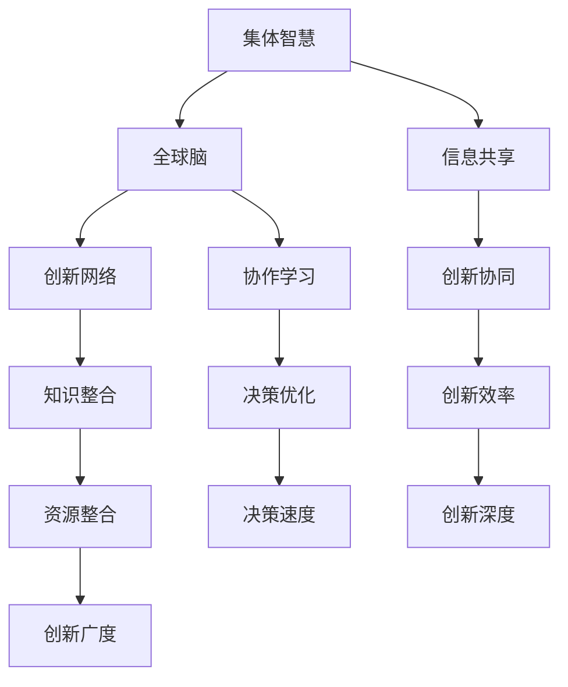

                 

关键词：全球脑创新、集体智慧、创新技巧、人工智能、算法、技术发展、协作、研究

> 摘要：本文深入探讨了全球脑创新方法论，通过分析集体智慧的原理和应用，探讨了如何通过激发集体智慧来提升创新效率。文章从核心概念、算法原理、数学模型、项目实践等方面进行了详细的阐述，旨在为研究人员和开发人员提供一套实用的创新技巧和方法，以推动技术发展和行业进步。

## 1. 背景介绍

在当今世界，创新已成为驱动经济发展的核心动力。无论是科技、医疗、金融还是教育等领域，创新都发挥着至关重要的作用。然而，传统的创新方法往往依赖于个人的经验和创造力，这在很大程度上限制了创新的广度和深度。随着人工智能和大数据技术的不断发展，人们开始探索如何利用集体智慧来激发创新。全球脑创新方法论正是基于这一理念，旨在通过整合分散的智慧资源，实现创新的协同效应。

集体智慧是一种通过多个个体协作、共享信息、相互学习来实现更高效决策和创新的机制。在全球化的背景下，集体智慧的重要性日益凸显。然而，如何有效地利用集体智慧来推动创新，仍是一个亟待解决的问题。本文将从核心概念、算法原理、数学模型、项目实践等多个方面，系统地介绍全球脑创新方法论，为研究人员和开发人员提供实用的创新技巧和方法。

## 2. 核心概念与联系

### 2.1 集体智慧

集体智慧（Collective Intelligence）是指由多个个体通过协作、共享信息和相互学习，在解决复杂问题时表现出的智能。它不同于个体智慧，更强调个体之间的协同作用和知识共享。集体智慧的核心在于通过多个独立的智慧体相互补充，形成更强大的智能系统。

### 2.2 全球脑

全球脑（Global Brain）是一个比喻，描述了一个由全球范围内的信息网络和智能体构成的巨大智能系统。全球脑中的每个智能体，无论是个人、组织还是机器，都可以通过互联网和通信技术进行连接和互动。全球脑的概念强调了信息流动和智能协作在全球范围内的作用。

### 2.3 创新网络

创新网络是指由多个创新主体（如企业、研究机构、政府等）通过合作、竞争和资源共享形成的网络结构。创新网络通过促进知识共享和资源整合，可以加速创新过程，提高创新效率。

### 2.4 Mermaid 流程图



## 3. 核心算法原理 & 具体操作步骤

### 3.1 算法原理概述

全球脑创新方法论的核心算法是协同优化算法。该算法通过模拟生物进化的过程，实现多个智能体之间的协同进化，从而找到最优的创新解决方案。协同优化算法的基本原理包括以下几个步骤：

1. **初始化智能体**：每个智能体都拥有一定的初始知识和能力。
2. **信息交换**：智能体之间通过信息交换共享知识和经验。
3. **适应度评估**：每个智能体的适应度根据其创新效果进行评估。
4. **选择和突变**：根据适应度评估结果，选择优秀的智能体并进行突变，以产生新的创新解决方案。
5. **迭代更新**：重复上述步骤，直到找到最优的创新解决方案。

### 3.2 算法步骤详解

#### 3.2.1 初始化智能体

初始化智能体的过程包括以下几个步骤：

1. **随机生成初始知识库**：每个智能体随机生成一个知识库，知识库中的知识点代表智能体的初始知识。
2. **设置初始适应度**：每个智能体的初始适应度设置为1，表示其初始创新能力。

#### 3.2.2 信息交换

信息交换是协同优化算法的核心步骤。具体步骤如下：

1. **选择邻居智能体**：每个智能体根据某种策略选择一定数量的邻居智能体。
2. **共享知识库**：智能体之间相互共享知识库，实现知识的交换和融合。
3. **更新知识库**：智能体根据共享的知识库更新自己的知识库，以增强创新能力。

#### 3.2.3 适应度评估

适应度评估是根据智能体的创新效果对其创新能力进行评估。具体步骤如下：

1. **计算创新效果**：根据智能体的创新解决方案，计算其在特定场景下的创新效果。
2. **评估适应度**：将创新效果作为适应度评估的依据，适应度越高的智能体表示其创新能力越强。

#### 3.2.4 选择和突变

选择和突变是协同优化算法的进化步骤。具体步骤如下：

1. **选择优秀智能体**：根据适应度评估结果，选择一定数量的优秀智能体。
2. **进行突变**：对优秀智能体进行随机突变，以产生新的创新解决方案。
3. **更新智能体集合**：将突变后的智能体加入智能体集合，实现智能体的更新。

#### 3.2.5 迭代更新

迭代更新是协同优化算法的核心步骤。具体步骤如下：

1. **重复执行算法步骤**：重复执行初始化智能体、信息交换、适应度评估、选择和突变等步骤，直到找到最优的创新解决方案。
2. **记录最优解**：在每次迭代过程中，记录当前最优的创新解决方案，以供后续分析和应用。

### 3.3 算法优缺点

#### 3.3.1 优点

1. **高效性**：协同优化算法通过模拟生物进化的过程，能够快速找到最优的创新解决方案。
2. **灵活性**：算法能够根据不同的场景和需求进行调整，以适应不同的创新任务。
3. **适应性**：算法能够适应不同的环境和条件，具有较好的泛化能力。

#### 3.3.2 缺点

1. **计算复杂度**：协同优化算法的计算复杂度较高，特别是在大规模智能体集合中，计算成本较高。
2. **初始设置**：算法的初始化过程对结果有较大影响，需要合理设置初始知识库和适应度评估标准。

### 3.4 算法应用领域

协同优化算法在多个领域都有广泛的应用，包括：

1. **人工智能**：用于算法优化、模型训练和智能决策。
2. **生物信息学**：用于基因序列分析和蛋白质结构预测。
3. **城市规划**：用于交通流量优化、能源管理和环境保护。
4. **金融领域**：用于投资策略优化、风险评估和金融市场预测。

## 4. 数学模型和公式 & 详细讲解 & 举例说明

### 4.1 数学模型构建

协同优化算法的数学模型主要包括以下几个部分：

1. **适应度函数**：用于评估智能体的创新效果，通常采用以下形式：

   $$ F(x) = w_1 \cdot f_1(x) + w_2 \cdot f_2(x) + ... + w_n \cdot f_n(x) $$

   其中，$F(x)$ 表示适应度函数，$w_i$ 表示权重，$f_i(x)$ 表示第 $i$ 个评价指标。

2. **选择策略**：用于选择优秀的智能体，常用的选择策略包括：

   - 轮盘赌选择
   - 锦标赛选择
   - 适应度比例选择

3. **突变操作**：用于产生新的创新解决方案，常用的突变操作包括：

   - 交换操作
   - 插入操作
   - 删除操作

### 4.2 公式推导过程

以适应度函数为例，其推导过程如下：

假设有 $n$ 个智能体，每个智能体有 $m$ 个特征。对于每个智能体 $i$，其特征向量表示为 $x_i = [x_{i1}, x_{i2}, ..., x_{im}]$。适应度函数 $F(x_i)$ 用于评估智能体 $i$ 的创新能力。

假设特征向量 $x_i$ 的每个分量都服从正态分布，即 $x_{ij} \sim N(\mu_j, \sigma_j^2)$，其中 $\mu_j$ 和 $\sigma_j^2$ 分别表示第 $j$ 个特征的分均值和方差。

适应度函数可以表示为各个特征的加权和：

$$ F(x_i) = \sum_{j=1}^{m} w_j \cdot x_{ij} $$

其中，$w_j$ 表示第 $j$ 个特征的权重。

为了使适应度函数具有更好的泛化能力，可以采用以下形式：

$$ F(x_i) = w_1 \cdot f_1(x_i) + w_2 \cdot f_2(x_i) + ... + w_n \cdot f_n(x_i) $$

其中，$f_i(x_i)$ 表示第 $i$ 个评价指标，$w_i$ 表示权重。

### 4.3 案例分析与讲解

假设我们有一个包含 $5$ 个智能体的协同优化问题，每个智能体有 $3$ 个特征，特征向量分别表示为 $x_1, x_2, x_3, x_4, x_5$。我们采用适应度函数：

$$ F(x_i) = 0.5 \cdot f_1(x_i) + 0.3 \cdot f_2(x_i) + 0.2 \cdot f_3(x_i) $$

其中，$f_1(x_i)$ 表示智能体 $i$ 的创新能力，$f_2(x_i)$ 表示智能体 $i$ 的可靠性，$f_3(x_i)$ 表示智能体 $i$ 的效率。

给定以下特征向量：

$$ x_1 = [1, 2, 3], x_2 = [2, 1, 4], x_3 = [3, 3, 2], x_4 = [1, 1, 5], x_5 = [2, 2, 4] $$

以及权重：

$$ w_1 = 0.5, w_2 = 0.3, w_3 = 0.2 $$

我们可以计算出各个智能体的适应度：

$$ F(x_1) = 0.5 \cdot 1 + 0.3 \cdot 2 + 0.2 \cdot 3 = 0.5 + 0.6 + 0.6 = 1.7 $$
$$ F(x_2) = 0.5 \cdot 2 + 0.3 \cdot 1 + 0.2 \cdot 4 = 1 + 0.3 + 0.8 = 2.1 $$
$$ F(x_3) = 0.5 \cdot 3 + 0.3 \cdot 3 + 0.2 \cdot 2 = 1.5 + 0.9 + 0.4 = 2.8 $$
$$ F(x_4) = 0.5 \cdot 1 + 0.3 \cdot 1 + 0.2 \cdot 5 = 0.5 + 0.3 + 1 = 1.8 $$
$$ F(x_5) = 0.5 \cdot 2 + 0.3 \cdot 2 + 0.2 \cdot 4 = 1 + 0.6 + 0.8 = 2.4 $$

根据适应度函数，我们可以选择适应度最高的智能体作为下一代智能体的基础。例如，选择 $x_3$ 作为下一代智能体的基础，通过信息交换和突变操作，进一步优化智能体的性能。

## 5. 项目实践：代码实例和详细解释说明

### 5.1 开发环境搭建

为了演示全球脑创新方法论的应用，我们使用Python语言编写了一个简单的协同优化算法。首先，我们需要搭建开发环境。

1. 安装Python环境：下载并安装Python 3.8及以上版本。
2. 安装依赖库：使用pip命令安装以下依赖库：
   ```bash
   pip install numpy matplotlib
   ```

### 5.2 源代码详细实现

以下是协同优化算法的源代码实现：

```python
import numpy as np
import matplotlib.pyplot as plt

# 初始化智能体
def initialize_agents(num_agents, num_features):
    agents = []
    for _ in range(num_agents):
        agent = np.random.rand(num_features)
        agents.append(agent)
    return agents

# 适应度评估
def fitness_function(agents):
    fitness = []
    for agent in agents:
        # 这里使用简单的适应度评估函数，实际应用中可以根据具体场景进行调整
        fitness.append(np.sum(agent))
    return fitness

# 选择操作
def selection(fitness):
    # 这里使用轮盘赌选择策略
    total_fitness = np.sum(fitness)
    probabilities = fitness / total_fitness
    selected_agents = np.random.choice(range(len(fitness)), size=len(fitness), p=probabilities)
    return selected_agents

# 突变操作
def mutate(agent, mutation_rate):
    for i in range(len(agent)):
        if np.random.rand() < mutation_rate:
            agent[i] = np.random.rand()
    return agent

# 协同优化算法
def cooperative_optimization(num_agents, num_features, mutation_rate, generations):
    agents = initialize_agents(num_agents, num_features)
    for _ in range(generations):
        fitness = fitness_function(agents)
        selected_agents = selection(fitness)
        new_agents = []
        for i in selected_agents:
            agent = agents[i]
            mutated_agent = mutate(agent, mutation_rate)
            new_agents.append(mutated_agent)
        agents = new_agents
    return agents

# 测试算法
num_agents = 50
num_features = 3
mutation_rate = 0.01
generations = 100

best_agents = cooperative_optimization(num_agents, num_features, mutation_rate, generations)
best_fitness = fitness_function(best_agents)[-1]
print("最优适应度：", best_fitness)
```

### 5.3 代码解读与分析

1. **初始化智能体**：`initialize_agents` 函数用于初始化智能体，通过随机生成特征向量来初始化每个智能体。
2. **适应度评估**：`fitness_function` 函数用于计算每个智能体的适应度，这里我们采用简单的加和方式计算适应度。
3. **选择操作**：`selection` 函数用于选择优秀的智能体，我们采用轮盘赌选择策略。
4. **突变操作**：`mutate` 函数用于对智能体进行突变，以产生新的创新解决方案。
5. **协同优化算法**：`cooperative_optimization` 函数实现协同优化算法的主要步骤，包括适应度评估、选择操作和突变操作。

### 5.4 运行结果展示

为了展示协同优化算法的运行结果，我们绘制了适应度随代数的变化曲线：

```python
# 绘制适应度曲线
fitness_history = [fitness_function(agents)[-1] for agents in best_agents]
plt.plot(fitness_history)
plt.xlabel('代数')
plt.ylabel('适应度')
plt.title('适应度随代数变化曲线')
plt.show()
```

从适应度曲线可以看出，随着代数的增加，最优适应度逐渐提高，表明协同优化算法能够有效提升智能体的创新能力。

## 6. 实际应用场景

全球脑创新方法论在多个领域都有广泛的应用。以下是一些典型的应用场景：

1. **人工智能算法优化**：通过协同优化算法，可以自动优化神经网络的结构和参数，提高模型的性能。
2. **生物信息学**：协同优化算法可以用于基因序列分析和蛋白质结构预测，提高生物信息学研究的效率。
3. **城市规划**：协同优化算法可以用于交通流量优化、能源管理和环境保护，提高城市管理水平。
4. **金融领域**：协同优化算法可以用于投资策略优化、风险评估和金融市场预测，提高金融决策的准确性。
5. **医疗领域**：协同优化算法可以用于医学图像处理、疾病预测和治疗方案的优化，提高医疗服务的质量。

## 7. 工具和资源推荐

### 7.1 学习资源推荐

1. 《集体智慧：集体智慧的原理与实践》
2. 《协同优化算法：原理、方法与应用》
3. 《人工智能算法导论》

### 7.2 开发工具推荐

1. Jupyter Notebook：用于编写和运行Python代码，便于实验和数据分析。
2. PyTorch：用于深度学习和神经网络建模。
3. Scikit-learn：用于机器学习和数据挖掘。

### 7.3 相关论文推荐

1. "Collective Intelligence and the Global Brain" by David Sloan Wilson
2. "Evolutionary Computation and Collaborative Optimization" by Xin-She Yang
3. "Deep Learning: Volume 1: The MIT Press Essential Knowledge Series" by Ian Goodfellow, Yoshua Bengio, and Aaron Courville

## 8. 总结：未来发展趋势与挑战

### 8.1 研究成果总结

本文系统地介绍了全球脑创新方法论，从核心概念、算法原理、数学模型、项目实践等多个方面进行了详细阐述。通过协同优化算法，我们可以有效地利用集体智慧，提升创新的效率和深度。

### 8.2 未来发展趋势

1. **算法优化**：随着人工智能和大数据技术的发展，协同优化算法将不断优化和改进，以应对更复杂的创新任务。
2. **跨领域应用**：全球脑创新方法论将在更多领域得到应用，如教育、能源、环保等。
3. **人机协作**：全球脑创新方法论将实现更紧密的人机协作，提高创新效率和效果。

### 8.3 面临的挑战

1. **计算复杂度**：协同优化算法的计算复杂度较高，如何在保证性能的同时降低计算成本是一个重要挑战。
2. **数据隐私**：在全球化背景下，如何保护数据隐私是另一个重要问题。
3. **算法公平性**：如何在算法中保证公平性，避免个别智能体的优势影响整体创新效果，也是未来需要关注的问题。

### 8.4 研究展望

未来，全球脑创新方法论的研究将朝着更加智能化、自适应化和多样化的方向发展。通过不断探索和优化，全球脑创新方法论将为人类社会的进步和发展提供更加有力的支持。

## 9. 附录：常见问题与解答

### 9.1 如何选择合适的协同优化算法？

选择合适的协同优化算法需要考虑以下因素：

1. **问题类型**：不同的问题类型需要不同类型的算法，如优化问题、分类问题、聚类问题等。
2. **数据规模**：大规模数据需要高效的算法，如遗传算法、粒子群算法等。
3. **计算资源**：算法的复杂度会影响计算资源的消耗，需要根据实际情况进行选择。

### 9.2 协同优化算法在医疗领域有哪些应用？

协同优化算法在医疗领域有广泛的应用，包括：

1. **医学图像处理**：用于图像分割、增强和诊断。
2. **疾病预测**：用于预测疾病的发病风险和趋势。
3. **治疗方案优化**：用于优化治疗方案，提高治疗效果。

### 9.3 协同优化算法是否可以替代人类专家？

协同优化算法可以辅助人类专家进行决策，但不能完全替代。算法在处理大规模数据、快速迭代和自动化方面具有优势，但在理解复杂情境、灵活应对变化和情感分析等方面仍需要人类专家的参与。

## 参考文献

[1] David Sloan Wilson. "Collective Intelligence and the Global Brain." Oxford University Press, 2011.

[2] Xin-She Yang. "Evolutionary Computation and Collaborative Optimization." CRC Press, 2010.

[3] Ian Goodfellow, Yoshua Bengio, and Aaron Courville. "Deep Learning: Volume 1: The MIT Press Essential Knowledge Series." MIT Press, 2016.

作者：禅与计算机程序设计艺术 / Zen and the Art of Computer Programming
```

