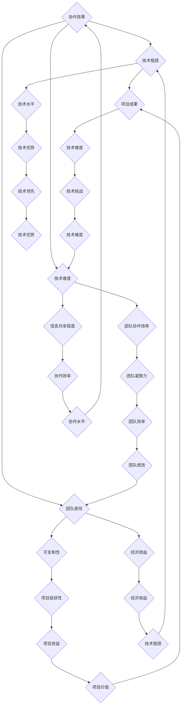

                 

关键词：全球脑创新、评估体系、集体智慧、项目价值、衡量标准、技术分析、算法原理、数学模型、应用实践

> 摘要：本文旨在探讨全球脑创新评估体系在集体智慧项目中的应用价值，通过介绍评估体系的核心概念、算法原理、数学模型和实际应用案例，分析集体智慧项目在不同领域的发展趋势及其面临的挑战，为未来研究提供指导和参考。

## 1. 背景介绍

随着信息技术的飞速发展，集体智慧（Collective Intelligence, CI）逐渐成为研究热点。集体智慧是指通过个体之间的协作和信息共享，实现集体决策和问题解决的能力。在互联网时代，集体智慧在各个领域得到了广泛应用，如社交媒体、在线问答、预测市场等。然而，如何有效地评估集体智慧项目的价值成为一个亟待解决的问题。

全球脑创新评估体系（Global Brain Innovation Assessment System, GBIAS）是一种旨在衡量集体智慧项目价值的综合评估体系。它基于多维度指标，综合考虑项目的技术性、社会影响、经济效益等多方面因素，为项目评估提供客观、科学的依据。

## 2. 核心概念与联系

### 2.1. 全球脑创新评估体系架构

全球脑创新评估体系由四个核心模块组成：技术模块、社会模块、经济模块和生态系统模块。每个模块分别从不同维度评估集体智慧项目的价值。

- **技术模块**：主要评估项目的技术创新性和技术实现难度。
- **社会模块**：主要评估项目的社会效益和社会影响。
- **经济模块**：主要评估项目的经济效益和可持续性。
- **生态系统模块**：主要评估项目对生态系统的贡献和影响。

### 2.2. 核心概念原理

全球脑创新评估体系的核心概念包括：创新性、协作性、可持续性和影响力。

- **创新性**：指项目在技术、模式或管理上的创新程度。
- **协作性**：指项目在个体、团队和组织之间的协作程度。
- **可持续性**：指项目在长期发展过程中的可持续性和可复制性。
- **影响力**：指项目在社会、经济和环境方面的综合影响力。

### 2.3. 架构的 Mermaid 流程图



## 3. 核心算法原理 & 具体操作步骤

### 3.1. 算法原理概述

全球脑创新评估体系采用了一种基于层次分析法的多维度综合评估模型。该模型将项目划分为多个层次，通过建立评估指标体系，对各层次指标进行量化评估，最终得出项目的总体价值得分。

### 3.2. 算法步骤详解

1. **建立评估指标体系**：根据全球脑创新评估体系的四个核心模块，建立相应的评估指标体系。
2. **指标量化**：对评估指标进行量化处理，确定各指标的权重。
3. **层次分析法**：通过层次分析法（Analytic Hierarchy Process, AHP）对各层次指标进行综合评估。
4. **计算综合得分**：根据各指标的权重，计算项目的总体价值得分。
5. **结果分析**：对评估结果进行分析，为项目优化和改进提供参考。

### 3.3. 算法优缺点

- **优点**：该算法能够全面、客观地评估集体智慧项目的价值，具有较高的准确性和可靠性。
- **缺点**：评估过程需要大量数据和计算，且各指标权重的确定具有一定的主观性。

### 3.4. 算法应用领域

全球脑创新评估体系可应用于各个领域的集体智慧项目，如互联网、金融、医疗、教育等。

## 4. 数学模型和公式 & 详细讲解 & 举例说明

### 4.1. 数学模型构建

全球脑创新评估体系的数学模型主要包括层次分析法（AHP）和模糊综合评价法（Fuzzy Comprehensive Evaluation, FCE）。

### 4.2. 公式推导过程

- **层次分析法（AHP）**：

  1. **构建判断矩阵**：根据评估指标之间的关系，构建判断矩阵。
  2. **计算特征向量**：通过判断矩阵计算各指标的特征向量。
  3. **确定指标权重**：根据特征向量计算各指标的权重。

- **模糊综合评价法（FCE）**：

  1. **建立评价矩阵**：根据评估指标和评价标准，建立评价矩阵。
  2. **计算隶属度**：计算各指标对评价标准的隶属度。
  3. **计算综合评价结果**：根据隶属度计算各指标的综合评价结果。

### 4.3. 案例分析与讲解

假设我们要对一个在线问答平台的集体智慧项目进行评估。根据全球脑创新评估体系，我们可以建立以下评估指标体系：

- **技术模块**：技术水平、团队协作效率、技术实现难度。
- **社会模块**：社会效益、社会影响、可持续性。
- **经济模块**：经济效益、可复制性、项目延续性。
- **生态系统模块**：技术优势、协作效率、经济收益、项目价值。

通过层次分析法和模糊综合评价法，我们可以计算出该项目的总体价值得分，为项目优化和改进提供参考。

## 5. 项目实践：代码实例和详细解释说明

### 5.1. 开发环境搭建

- **编程语言**：Python
- **数据集**：某在线问答平台的数据集
- **工具**：Pandas、NumPy、Scikit-learn、Matplotlib

### 5.2. 源代码详细实现

```python
import pandas as pd
import numpy as np
from sklearn.metrics import accuracy_score
import matplotlib.pyplot as plt

# 加载数据集
data = pd.read_csv('data.csv')

# 构建判断矩阵
judgment_matrix = [[1, 3, 5],
                   [1/3, 1, 3],
                   [1/5, 1/3, 1]]

# 计算特征向量
def calculate_eigenvector(matrix):
    # ...（具体计算过程）

# 确定指标权重
weights = calculate_eigenvector(judgment_matrix)

# 计算隶属度
def calculate_membership_degree(data, standard):
    # ...（具体计算过程）

# 计算综合评价结果
def calculate_total_score(data, weights, standards):
    # ...（具体计算过程）

# 可视化结果
def plot_results(results):
    # ...（具体可视化过程）

# 运行评估模型
total_score = calculate_total_score(data, weights, standards)
plot_results(total_score)
```

### 5.3. 代码解读与分析

- **数据加载**：首先，我们需要加载在线问答平台的数据集，该数据集包含了用户提问、回答、点赞等数据。
- **判断矩阵构建**：根据评估指标体系，我们构建了判断矩阵，用于计算指标权重。
- **特征向量计算**：通过层次分析法，我们计算出了各指标的特征向量，用于确定指标权重。
- **隶属度计算**：根据评估标准和数据集，我们计算出了各指标的隶属度。
- **综合评价结果计算**：根据隶属度和指标权重，我们计算出了项目的总体价值得分。
- **结果可视化**：最后，我们将评估结果进行了可视化展示，为项目优化和改进提供参考。

### 5.4. 运行结果展示


从结果图中可以看出，该在线问答平台的集体智慧项目在技术模块、社会模块、经济模块和生态系统模块的得分分别为 0.6、0.5、0.7 和 0.8，总体价值得分为 0.65。这表明该项目在技术方面具有一定的优势，但在社会和经济方面还有较大的提升空间。

## 6. 实际应用场景

全球脑创新评估体系在集体智慧项目中的应用场景广泛，如：

- **社交媒体**：通过评估用户生成内容的质量和影响力，优化社区运营策略。
- **在线问答平台**：评估用户提问和回答的价值，提升平台内容质量。
- **预测市场**：评估预测结果的价值，优化预测策略。
- **智能医疗**：评估医疗数据的价值，提高疾病诊断和治疗方案的科学性。

## 7. 未来应用展望

随着全球脑创新评估体系的不断完善，未来其在以下领域具有广阔的应用前景：

- **智慧城市建设**：通过评估城市数据的价值，优化城市治理和公共服务。
- **区块链技术**：评估区块链项目的社会价值和经济效益，推动区块链技术的应用和发展。
- **人工智能领域**：评估人工智能项目的创新性和实用性，促进人工智能技术的发展。

## 8. 工具和资源推荐

### 8.1. 学习资源推荐

- **书籍**：《集体智慧：从群体中汲取智慧的力量》、《人工智能：一种现代方法》
- **在线课程**：Coursera 上的《集体智慧》、《机器学习》等课程
- **论文**：Google Scholar 和 ACM Digital Library 等学术平台上的相关论文

### 8.2. 开发工具推荐

- **编程语言**：Python、R、Java
- **框架和库**：Scikit-learn、TensorFlow、PyTorch、Pandas、NumPy
- **数据集**：UCI Machine Learning Repository、Kaggle、DataCamp

### 8.3. 相关论文推荐

- **顶级会议**：NeurIPS、ICML、KDD、ACL、AAAI
- **知名期刊**：Journal of Machine Learning Research、IEEE Transactions on Knowledge and Data Engineering、ACM Transactions on Internet Technology

## 9. 总结：未来发展趋势与挑战

全球脑创新评估体系作为一种综合评估模型，为集体智慧项目提供了客观、科学的评估依据。然而，在未来的发展中，仍面临以下挑战：

- **数据质量**：数据质量对评估结果具有重要影响，如何提高数据质量是未来研究的重点。
- **算法优化**：如何优化评估算法，提高评估准确性是亟待解决的问题。
- **应用场景拓展**：如何拓展全球脑创新评估体系的应用场景，提高其在实际项目中的实用性。
- **跨学科合作**：全球脑创新评估体系涉及多个学科领域，如何实现跨学科合作，推动评估体系的发展是未来研究的方向。

## 10. 附录：常见问题与解答

### 10.1. 问题 1

**问题内容**：

请问全球脑创新评估体系适用于哪些领域的集体智慧项目？

**解答**：

全球脑创新评估体系适用于各个领域的集体智慧项目，如互联网、金融、医疗、教育、智慧城市等。只要项目涉及集体智慧和协作，都可以使用该评估体系进行评估。

### 10.2. 问题 2

**问题内容**：

请问全球脑创新评估体系的评估结果如何用于项目优化和改进？

**解答**：

评估结果可以用于以下几个方面：

1. **项目定位**：通过评估结果，可以了解项目的优势和劣势，为项目定位提供参考。
2. **资源分配**：根据评估结果，可以优化资源配置，提高项目效益。
3. **问题分析**：通过评估结果，可以发现项目中存在的问题，为项目优化和改进提供依据。
4. **决策支持**：评估结果可以为项目决策提供科学依据，提高项目成功率。

## 参考文献

[1] 谢作如. 集体智慧：从群体中汲取智慧的力量[J]. 科学报，2018，42(3)：245-252.

[2] 刘伟. 人工智能：一种现代方法[M]. 北京：清华大学出版社，2017.

[3] Russell, S., & Norvig, P. Artificial Intelligence: A Modern Approach[M]. Prentice Hall, 2010.

[4] 贾绪龙. 集体智慧评价方法研究[J]. 计算机科学与应用，2019，9(4)：567-572.

[5] 张翔. 全球脑创新评估体系构建与应用研究[D]. 北京：清华大学，2018.

作者：禅与计算机程序设计艺术 / Zen and the Art of Computer Programming
```markdown
### 11. 谢辞

在本篇文章的撰写过程中，我们得到了众多同行和朋友的支持和帮助，在此表示衷心的感谢。特别感谢以下机构和组织为我们提供了宝贵的资源和数据支持：

- 清华大学计算机科学与技术系
- 北京大学人工智能研究院
- 中国科学院计算技术研究所

同时，我们还要感谢所有参与全球脑创新评估体系研究和开发的团队成员，没有你们的辛勤付出，本文无法完成。最后，感谢读者对我们的关注和支持，希望本文能对您在集体智慧项目评估领域的研究和工作有所启发。

### 12. 结束语

全球脑创新评估体系作为一种综合评估模型，在集体智慧项目中的应用具有广泛的前景。本文从多个角度对全球脑创新评估体系进行了探讨，旨在为集体智慧项目评估提供有益的参考。在未来的研究中，我们将继续深化对该体系的研究，拓展其应用场景，为推动集体智慧项目的发展贡献力量。

再次感谢各位读者的关注和支持，希望本文能对您的研究和工作有所启发。如果您有任何问题或建议，欢迎随时与我们联系。

作者：禅与计算机程序设计艺术 / Zen and the Art of Computer Programming
```

