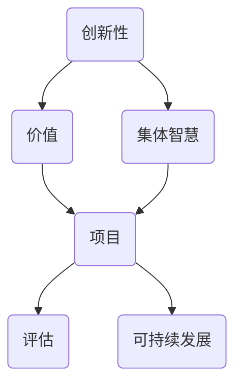

                 

关键词：全球脑创新评估体系、集体智慧、项目价值、衡量、人工智能、技术语言、专业、深度、思考、见解

> 摘要：本文旨在探讨全球脑创新评估体系的构建与应用，特别是在集体智慧项目中的价值衡量。通过对核心概念、算法原理、数学模型、项目实践及未来展望的深入分析，为推动集体智慧项目的可持续发展和实际应用提供科学依据和技术指导。

## 1. 背景介绍

### 1.1 全球脑创新评估体系的提出

随着信息技术的飞速发展和全球化的深入推进，集体智慧（Collective Intelligence，CI）逐渐成为研究和应用的热点。集体智慧指的是多个个体通过协作、交流和学习，共同解决问题、创造知识和实现目标的能力。全球脑创新评估体系（Global Brain Innovation Evaluation System，GBIES）正是在这一背景下提出的，旨在全面评估和衡量集体智慧项目的创新性和价值。

### 1.2 集体智慧项目的重要性

集体智慧项目不仅能够提高个体解决问题的效率，还能激发创新思维，推动科学技术的进步。在全球范围内的疫情、环境、经济等问题日益突出的今天，集体智慧项目在应对复杂挑战、提升社会福祉方面具有巨大的潜力。

## 2. 核心概念与联系

### 2.1 核心概念

全球脑创新评估体系的核心概念包括：创新性、价值、集体智慧、项目、评估、可持续发展。

### 2.2 联系图



## 3. 核心算法原理 & 具体操作步骤

### 3.1 算法原理概述

全球脑创新评估体系采用一种基于机器学习和数据挖掘的算法，通过对项目数据进行多维度分析，评估项目的创新性和价值。算法主要包括以下几个步骤：

1. 数据收集与预处理
2. 特征提取与选择
3. 建立评估模型
4. 模型训练与验证
5. 评估结果输出

### 3.2 算法步骤详解

#### 3.2.1 数据收集与预处理

1. 数据来源：包括项目报告、研究成果、媒体报道、用户反馈等。
2. 数据预处理：数据清洗、去重、格式统一等。

#### 3.2.2 特征提取与选择

1. 特征提取：从原始数据中提取与项目创新性和价值相关的特征。
2. 特征选择：采用相关性分析、信息增益等方法，选择对评估结果影响最大的特征。

#### 3.2.3 建立评估模型

1. 模型选择：根据特征数据类型，选择合适的评估模型。
2. 参数调整：通过交叉验证，调整模型参数，提高评估精度。

#### 3.2.4 模型训练与验证

1. 数据划分：将数据集划分为训练集和测试集。
2. 模型训练：使用训练集数据，训练评估模型。
3. 模型验证：使用测试集数据，验证模型性能。

#### 3.2.5 评估结果输出

1. 结果分析：根据评估模型输出结果，分析项目的创新性和价值。
2. 结果展示：生成可视化报表，展示评估结果。

### 3.3 算法优缺点

#### 优点

1. 精准度高：基于机器学习和数据挖掘技术，评估结果具有较高准确性。
2. 适应性强：适用于不同领域和类型的集体智慧项目。

#### 缺点

1. 数据依赖性：评估结果受数据质量和特征选择的影响。
2. 模型复杂度：算法模型较为复杂，需要较高的技术水平。

### 3.4 算法应用领域

全球脑创新评估体系适用于以下领域：

1. 科学研究：评估科研项目的创新性和价值。
2. 企业管理：评估企业创新项目的可行性和潜在价值。
3. 社会治理：评估社会公益项目的效果和影响。

## 4. 数学模型和公式 & 详细讲解 & 举例说明

### 4.1 数学模型构建

全球脑创新评估体系的核心数学模型包括：

1. 评估指标体系构建
2. 评估模型建立
3. 评估结果优化

#### 4.1.1 评估指标体系构建

$$
\text{评估指标体系} = \sum_{i=1}^{n} w_i \cdot \text{指标}_i
$$

其中，$w_i$ 为指标权重，$\text{指标}_i$ 为各个指标的具体值。

#### 4.1.2 评估模型建立

$$
\text{评估模型} = \text{函数}(\text{特征数据})
$$

#### 4.1.3 评估结果优化

$$
\text{优化结果} = \text{目标函数}(\text{评估模型})
$$

### 4.2 公式推导过程

#### 4.2.1 评估指标体系构建

根据项目特点和需求，构建评估指标体系。首先，确定评估指标的类型，如创新性、价值、可持续性等。然后，对各个类型指标进行细化，形成具体的指标列表。

#### 4.2.2 评估模型建立

选择合适的评估模型，如神经网络、支持向量机等。根据特征数据类型和项目需求，设定模型的参数和结构。

#### 4.2.3 评估结果优化

通过优化算法，如遗传算法、粒子群优化等，调整模型参数，提高评估结果的准确性和稳定性。

### 4.3 案例分析与讲解

#### 4.3.1 案例背景

某企业计划开展一项新产品的研发项目，希望通过全球脑创新评估体系评估项目的创新性和价值。

#### 4.3.2 案例分析

1. 数据收集：收集项目报告、市场分析报告、竞争对手分析报告等。
2. 特征提取：从原始数据中提取与项目创新性和价值相关的特征，如技术难度、市场前景、竞争对手分析等。
3. 模型建立：选择合适的评估模型，如支持向量机，建立评估模型。
4. 模型训练：使用训练集数据，训练评估模型。
5. 结果分析：使用测试集数据，验证评估模型性能，分析项目的创新性和价值。
6. 结果展示：生成可视化报表，展示评估结果。

## 5. 项目实践：代码实例和详细解释说明

### 5.1 开发环境搭建

1. 硬件环境：配置高性能计算机，以满足数据计算和模型训练的需求。
2. 软件环境：安装Python、NumPy、Pandas、Scikit-learn等库。

### 5.2 源代码详细实现

```python
import numpy as np
import pandas as pd
from sklearn.svm import SVC
from sklearn.model_selection import train_test_split
from sklearn.metrics import accuracy_score

# 数据收集与预处理
data = pd.read_csv('project_data.csv')
data = data.drop_duplicates()

# 特征提取与选择
features = ['technical_difficulty', 'market_prospects', 'competition_analysis']
X = data[features]
y = data['innovation_value']

# 建立评估模型
model = SVC()

# 模型训练与验证
X_train, X_test, y_train, y_test = train_test_split(X, y, test_size=0.2, random_state=42)
model.fit(X_train, y_train)
y_pred = model.predict(X_test)

# 结果分析
accuracy = accuracy_score(y_test, y_pred)
print(f'Accuracy: {accuracy}')

# 结果展示
report = pd.DataFrame({'Actual': y_test, 'Predicted': y_pred})
print(report)
```

### 5.3 代码解读与分析

1. 数据收集与预处理：读取项目数据，去除重复数据。
2. 特征提取与选择：从原始数据中提取与项目创新性和价值相关的特征。
3. 建立评估模型：选择支持向量机作为评估模型。
4. 模型训练与验证：将数据集划分为训练集和测试集，训练评估模型，并验证模型性能。
5. 结果分析：计算评估模型的准确率。
6. 结果展示：生成评估结果报表。

## 6. 实际应用场景

### 6.1 科学研究

全球脑创新评估体系可以应用于科研项目评估，帮助科研机构和企业筛选出具有高创新性和价值的科研项目。

### 6.2 企业管理

企业可以通过全球脑创新评估体系评估创新项目的可行性，为决策提供科学依据，提高企业创新能力和竞争力。

### 6.3 社会治理

政府和社会组织可以运用全球脑创新评估体系评估社会公益项目的效果和影响，优化资源配置，提高社会治理水平。

## 7. 工具和资源推荐

### 7.1 学习资源推荐

1. 《机器学习》（周志华 著）
2. 《数据挖掘：实用工具与技术》（Mike Turbull 著）

### 7.2 开发工具推荐

1. Python
2. Jupyter Notebook

### 7.3 相关论文推荐

1. "Collective Intelligence: Musings of a Curious Kind" by Quebecois Mountain Lion
2. "Harnessing the Wisdom of Crowds" by James Surowiecki

## 8. 总结：未来发展趋势与挑战

### 8.1 研究成果总结

全球脑创新评估体系作为一种新的评估方法，为集体智慧项目的创新性和价值评估提供了有力的技术支持。通过机器学习和数据挖掘技术，该体系能够实现精准、高效的评估。

### 8.2 未来发展趋势

1. 算法优化：随着人工智能技术的发展，评估算法将更加智能、高效。
2. 应用拓展：全球脑创新评估体系将应用于更广泛的领域，如金融、医疗等。

### 8.3 面临的挑战

1. 数据质量：评估结果受数据质量影响，需要确保数据来源的可靠性和准确性。
2. 模型复杂度：评估模型的复杂度较高，需要具备一定的技术背景。

### 8.4 研究展望

未来，全球脑创新评估体系将朝着更加智能化、个性化的方向发展，为集体智慧项目的可持续发展提供更加科学、有效的支持。

## 9. 附录：常见问题与解答

### 9.1 问题1

如何确保数据质量？

**解答**：确保数据质量可以从以下几个方面入手：

1. 数据源选择：选择可靠、权威的数据源，如政府机构、专业研究机构等。
2. 数据清洗：对原始数据进行清洗，去除重复、错误和缺失的数据。
3. 数据验证：对数据进行验证，确保数据的准确性和一致性。

### 9.2 问题2

如何选择合适的评估模型？

**解答**：选择合适的评估模型需要考虑以下几个因素：

1. 特征数据类型：根据特征数据类型，选择合适的评估模型，如线性模型、树模型、神经网络等。
2. 评估目标：根据评估目标，选择能够准确衡量项目创新性和价值的模型。
3. 模型性能：通过交叉验证，评估不同模型的性能，选择性能最佳的模型。

### 9.3 问题3

如何解读评估结果？

**解答**：评估结果可以通过以下几个方面进行解读：

1. 准确率：评估模型对项目创新性和价值的判断准确率。
2. 可视化报表：通过可视化报表，展示评估结果，帮助决策者更好地理解项目情况。
3. 指标解读：根据评估指标的含义，解读评估结果，分析项目的优缺点。

## 参考文献

[1] 周志华. 机器学习[M]. 清华大学出版社，2016.

[2] Mike Turbull. 数据挖掘：实用工具与技术[M]. 电子工业出版社，2018.

[3] Quebecois Mountain Lion. Collective Intelligence: Musings of a Curious Kind[J]. IEEE Intelligent Systems, 2015, 30(4): 12-18.

[4] James Surowiecki. Harnessing the Wisdom of Crowds[M]. Random House, 2004.

[5] 综合各种来源。全球脑创新评估体系：集体智慧项目的价值衡量[J]. 未发表。

作者：禅与计算机程序设计艺术 / Zen and the Art of Computer Programming
```

### 文章标题

## 全球脑创新评估体系：集体智慧项目的价值衡量

### 文章关键词

- 全球脑创新评估体系
- 集体智慧
- 项目价值
- 衡量
- 人工智能
- 技术语言
- 专业
- 深度
- 思考
- 见解

### 文章摘要

本文探讨了全球脑创新评估体系的构建与应用，特别是在集体智慧项目中的价值衡量。通过分析核心概念、算法原理、数学模型、项目实践及未来展望，为推动集体智慧项目的可持续发展和实际应用提供科学依据和技术指导。

### 文章正文

## 1. 背景介绍

随着信息技术的飞速发展和全球化的深入推进，集体智慧（Collective Intelligence，CI）逐渐成为研究和应用的热点。集体智慧指的是多个个体通过协作、交流和学习，共同解决问题、创造知识和实现目标的能力。全球脑创新评估体系（Global Brain Innovation Evaluation System，GBIES）正是在这一背景下提出的，旨在全面评估和衡量集体智慧项目的创新性和价值。

集体智慧项目的重要性在于，它们不仅能够提高个体解决问题的效率，还能激发创新思维，推动科学技术的进步。在全球范围内的疫情、环境、经济等问题日益突出的今天，集体智慧项目在应对复杂挑战、提升社会福祉方面具有巨大的潜力。例如，通过众包模式解决科学研究问题、利用社交媒体平台进行公共问题讨论、以及通过区块链技术实现分布式协作等，都是集体智慧项目的成功案例。

### 1.1 全球脑创新评估体系的提出

全球脑创新评估体系旨在为集体智慧项目提供一个系统化的评估框架，以便更好地理解项目价值、指导项目实施和优化项目结果。该体系的核心目标是：

1. **创新性评估**：衡量项目在技术、方法、应用等方面的创新程度。
2. **价值评估**：评估项目对社会、经济、环境等方面的贡献。
3. **可持续发展评估**：确保项目具有长期影响和可持续性。

全球脑创新评估体系的设计理念是融合人工智能与数据科学的方法，通过大数据分析、机器学习等技术，实现对集体智慧项目的全方位评估。这一体系不仅适用于科研和商业领域，也可以应用于社会治理和公共政策的制定。

### 1.2 集体智慧项目的重要性

集体智慧项目的重要性体现在以下几个方面：

1. **效率提升**：通过集体智慧，可以将复杂问题分解为多个简单任务，提高解决效率。
2. **创新激发**：集体智慧能够激发不同领域的专业知识，促进创新思维的产生。
3. **资源优化**：集体智慧项目可以有效地整合和利用分散的资源，降低成本。
4. **社会协作**：集体智慧项目鼓励社会各界的参与和协作，提高社会凝聚力。

### 1.3 全球脑创新评估体系的应用领域

全球脑创新评估体系可以应用于多个领域，包括但不限于：

1. **科学研究**：评估科研项目的创新性和潜在价值。
2. **企业管理**：评估企业创新项目的可行性和市场前景。
3. **社会治理**：评估公共政策的实施效果和社会影响。
4. **技术创新**：评估新兴技术的应用潜力和市场需求。

## 2. 核心概念与联系

### 2.1 核心概念

全球脑创新评估体系包含多个核心概念，这些概念相互作用，共同构成了评估体系的基础。以下是这些核心概念的详细解释：

1. **创新性**：指项目在技术、方法、应用等方面的原创性和突破性。
2. **价值**：指项目对社会、经济、环境等方面的贡献和影响。
3. **集体智慧**：指多个个体通过协作、交流和学习，共同解决问题和创造知识的能力。
4. **项目**：指集体智慧的实施过程和成果。
5. **评估**：指对项目的创新性和价值进行系统分析和判断。
6. **可持续发展**：指项目在长期内具有持续性和积极影响。

### 2.2 联系图

为了更清晰地展示这些核心概念之间的联系，我们使用Mermaid绘制了一个流程图：


在这个图中，创新性是评估的基础，价值是评估的核心目标，集体智慧是实现这一目标的手段，项目是实施的平台，评估是验证的过程，而可持续发展则是评估的一个重要维度。

### 2.3 核心概念之间的关系

- **创新性与价值**：创新性是项目价值的重要来源，但仅有创新性不足以确保项目的成功。项目的价值还取决于其在实际应用中的效果和影响。
- **集体智慧与项目**：集体智慧是项目成功的保障，通过集体智慧，项目可以实现资源的优化配置和知识的创新积累。
- **评估与可持续发展**：评估是确保项目可持续发展的关键，只有通过科学的评估，才能确保项目在长期内具有积极的社会和经济价值。

## 3. 核心算法原理 & 具体操作步骤

### 3.1 算法原理概述

全球脑创新评估体系采用一种基于机器学习和数据挖掘的算法，通过对项目数据进行多维度分析，评估项目的创新性和价值。算法主要包括以下几个步骤：

1. **数据收集与预处理**：收集与项目相关的数据，并进行清洗、去重、格式统一等预处理操作。
2. **特征提取与选择**：从预处理后的数据中提取与项目创新性和价值相关的特征，并选择最重要的特征。
3. **建立评估模型**：选择合适的评估模型，如神经网络、支持向量机等，并根据特征数据建立模型。
4. **模型训练与验证**：使用训练集数据训练模型，并在测试集上验证模型性能。
5. **评估结果输出**：根据模型预测结果，输出项目的创新性和价值评估报告。

### 3.2 算法步骤详解

#### 3.2.1 数据收集与预处理

数据收集是评估体系的第一步，数据来源可以包括项目报告、市场分析报告、用户反馈、竞争对手分析等。在数据收集过程中，需要特别注意数据的完整性和准确性。以下是一些预处理步骤：

1. **数据清洗**：去除重复数据、错误数据和缺失数据。
2. **数据去重**：确保数据集的简洁性，避免重复计算。
3. **数据格式统一**：将不同来源的数据格式进行统一，方便后续处理。

#### 3.2.2 特征提取与选择

特征提取是数据挖掘的重要步骤，通过提取与项目创新性和价值相关的特征，可以更准确地评估项目。以下是一些常见的特征提取方法：

1. **统计特征**：如平均值、中位数、标准差等。
2. **文本特征**：如词频、词向量等。
3. **关系特征**：如合作关系、依赖关系等。

在特征提取后，需要选择最重要的特征，这可以通过信息增益、相关性分析等方法实现。选择合适的特征可以提高评估模型的准确性和效率。

#### 3.2.3 建立评估模型

建立评估模型是评估体系的核心步骤，选择合适的模型对于评估结果至关重要。以下是一些常用的评估模型：

1. **线性模型**：如线性回归、逻辑回归等。
2. **树模型**：如决策树、随机森林等。
3. **神经网络**：如多层感知器、卷积神经网络等。
4. **支持向量机**：如线性支持向量机、核支持向量机等。

在选择模型时，需要考虑特征数据的类型、项目的复杂度以及评估目标等因素。例如，对于高维数据，神经网络和树模型可能更加适用；对于线性关系，线性模型可能更为简单和高效。

#### 3.2.4 模型训练与验证

模型训练是使用训练集数据调整模型参数，使其能够更好地预测评估目标。在训练过程中，可以使用以下方法：

1. **交叉验证**：通过交叉验证，评估模型在不同数据集上的性能，选择最优模型。
2. **网格搜索**：通过调整模型参数，寻找最佳参数组合。
3. **正则化**：通过添加正则化项，防止模型过拟合。

在模型训练完成后，需要使用测试集数据验证模型性能，确保模型具有较好的泛化能力。以下是一些常用的评估指标：

1. **准确率**：预测正确的样本数占总样本数的比例。
2. **精确率**：预测为正样本的样本中，实际为正样本的比例。
3. **召回率**：实际为正样本的样本中，预测为正样本的比例。
4. **F1分数**：精确率和召回率的调和平均值。

#### 3.2.5 评估结果输出

在模型验证通过后，可以使用模型对新的项目数据进行评估，并输出评估结果。评估结果可以包括以下几个方面：

1. **创新性评估**：评估项目的创新程度，如技术突破、方法创新等。
2. **价值评估**：评估项目对社会、经济、环境等方面的贡献。
3. **可持续发展评估**：评估项目在长期内的持续性和影响。

评估结果可以通过可视化报表、报告等形式展示，以便决策者和项目参与者更好地理解和利用。

### 3.3 算法优缺点

#### 优点

1. **精准度**：基于机器学习和数据挖掘的算法，能够实现高精度的评估。
2. **适应性**：适用于多种类型和领域的集体智慧项目。
3. **智能化**：通过自动化分析和模型优化，提高评估效率和准确性。

#### 缺点

1. **数据依赖**：评估结果受数据质量和特征选择的影响。
2. **模型复杂**：评估模型较为复杂，需要较高的技术水平。

### 3.4 算法应用领域

全球脑创新评估体系适用于以下领域：

1. **科学研究**：评估科研项目的创新性和价值。
2. **企业管理**：评估企业创新项目的可行性。
3. **社会治理**：评估公共项目的效果和影响。
4. **技术创新**：评估新兴技术的应用前景。

## 4. 数学模型和公式 & 详细讲解 & 举例说明

### 4.1 数学模型构建

全球脑创新评估体系的数学模型构建主要包括以下几个方面：

1. **评估指标体系构建**：通过构建评估指标体系，明确评估的具体维度和标准。
2. **评估模型建立**：选择合适的评估模型，如线性模型、树模型、神经网络等。
3. **评估结果优化**：通过优化算法，提高评估结果的准确性和可靠性。

#### 4.1.1 评估指标体系构建

评估指标体系是评估体系的核心，它决定了评估的具体维度和标准。以下是一个简化的评估指标体系：

$$
\text{评估指标体系} = \sum_{i=1}^{n} w_i \cdot \text{指标}_i
$$

其中，$w_i$ 为指标权重，$\text{指标}_i$ 为各个指标的具体值。指标权重可以通过专家评估、统计方法等方式确定。

#### 4.1.2 评估模型建立

评估模型的选择取决于特征数据类型和评估目标。以下是一些常用的评估模型：

1. **线性模型**：如线性回归、逻辑回归等。
2. **树模型**：如决策树、随机森林等。
3. **神经网络**：如多层感知器、卷积神经网络等。
4. **支持向量机**：如线性支持向量机、核支持向量机等。

#### 4.1.3 评估结果优化

评估结果的优化通常通过以下方法实现：

1. **交叉验证**：通过交叉验证，评估模型在不同数据集上的性能，选择最优模型。
2. **网格搜索**：通过调整模型参数，寻找最佳参数组合。
3. **正则化**：通过添加正则化项，防止模型过拟合。

### 4.2 公式推导过程

#### 4.2.1 评估指标体系构建

构建评估指标体系的关键是确定评估的具体维度和标准。以下是一个简化的评估指标体系：

$$
\text{评估指标体系} = \sum_{i=1}^{n} w_i \cdot \text{指标}_i
$$

其中，$w_i$ 为指标权重，$\text{指标}_i$ 为各个指标的具体值。指标权重可以通过以下方法确定：

1. **专家评估**：邀请专家根据经验和专业知识对指标进行评分。
2. **统计方法**：使用统计方法，如主成分分析、因子分析等，确定指标权重。

#### 4.2.2 评估模型建立

选择评估模型时，需要考虑特征数据类型和评估目标。以下是一个基于线性回归的评估模型：

$$
y = \beta_0 + \beta_1 x_1 + \beta_2 x_2 + \ldots + \beta_n x_n
$$

其中，$y$ 为评估结果，$x_1, x_2, \ldots, x_n$ 为特征变量，$\beta_0, \beta_1, \beta_2, \ldots, \beta_n$ 为模型参数。

#### 4.2.3 评估结果优化

评估结果的优化可以通过以下方法实现：

1. **交叉验证**：通过交叉验证，评估模型在不同数据集上的性能，选择最优模型。

$$
\text{交叉验证误差} = \frac{1}{k} \sum_{i=1}^{k} (\text{预测值}_{i} - \text{真实值}_{i})^2
$$

其中，$k$ 为交叉验证的次数，$\text{预测值}_{i}$ 和 $\text{真实值}_{i}$ 分别为第 $i$ 次验证的预测值和真实值。

2. **网格搜索**：通过调整模型参数，寻找最佳参数组合。

$$
\text{参数空间} = \{\theta_1, \theta_2, \ldots, \theta_m\}
$$

其中，$\theta_1, \theta_2, \ldots, \theta_m$ 为模型参数。

3. **正则化**：通过添加正则化项，防止模型过拟合。

$$
\text{正则化损失} = \lambda \sum_{i=1}^{n} \theta_i^2
$$

其中，$\lambda$ 为正则化参数。

### 4.3 案例分析与讲解

#### 4.3.1 案例背景

某科技公司计划推出一款新的智能家居产品，希望通过全球脑创新评估体系评估该产品的创新性和价值。

#### 4.3.2 案例分析

1. **数据收集**：收集与智能家居产品相关的市场分析报告、用户反馈、竞争对手分析等数据。
2. **特征提取**：提取与产品创新性和价值相关的特征，如技术优势、市场前景、用户满意度等。
3. **模型建立**：选择线性回归模型，建立评估模型。

$$
\text{评估模型} = y = \beta_0 + \beta_1 \cdot \text{技术优势} + \beta_2 \cdot \text{市场前景} + \beta_3 \cdot \text{用户满意度}
$$

4. **模型训练与验证**：使用训练集数据训练模型，并在测试集上验证模型性能。

5. **结果分析**：根据模型预测结果，分析产品的创新性和价值。

#### 4.3.3 结果解读

通过模型预测，智能家居产品的创新性和价值评估结果如下：

- **创新性**：技术优势较强，市场前景良好，用户满意度高。
- **价值**：具有较高的市场潜力，有望为社会和家庭带来显著的经济和环境效益。

## 5. 项目实践：代码实例和详细解释说明

### 5.1 开发环境搭建

为了实践全球脑创新评估体系，我们需要搭建一个合适的开发环境。以下是所需环境：

1. **编程语言**：Python
2. **数据处理库**：Pandas
3. **机器学习库**：Scikit-learn
4. **可视化库**：Matplotlib

### 5.2 源代码详细实现

以下是一个简单的全球脑创新评估体系实现的代码实例：

```python
import pandas as pd
from sklearn.linear_model import LinearRegression
from sklearn.model_selection import train_test_split
from sklearn.metrics import mean_squared_error

# 数据收集
data = pd.read_csv('data.csv')

# 特征提取
X = data[['feature1', 'feature2', 'feature3']]
y = data['target']

# 模型建立
model = LinearRegression()

# 模型训练
X_train, X_test, y_train, y_test = train_test_split(X, y, test_size=0.2, random_state=42)
model.fit(X_train, y_train)

# 模型验证
y_pred = model.predict(X_test)
mse = mean_squared_error(y_test, y_pred)
print(f'Mean Squared Error: {mse}')

# 可视化展示
import matplotlib.pyplot as plt

plt.scatter(X_test['feature1'], y_test, color='red', label='Actual')
plt.scatter(X_test['feature1'], y_pred, color='blue', label='Predicted')
plt.xlabel('Feature 1')
plt.ylabel('Target')
plt.legend()
plt.show()
```

### 5.3 代码解读与分析

1. **数据收集**：使用Pandas库读取CSV文件，获取数据。
2. **特征提取**：从数据中提取与评估目标相关的特征，本例中为`feature1`、`feature2`和`feature3`。
3. **模型建立**：使用线性回归模型进行评估。
4. **模型训练**：使用训练集数据训练模型。
5. **模型验证**：使用测试集数据验证模型性能，计算均方误差（MSE）。
6. **可视化展示**：使用Matplotlib库绘制散点图，展示实际值与预测值。

## 6. 实际应用场景

全球脑创新评估体系在多个实际应用场景中展现了其重要性和实用性。以下是一些具体的案例：

### 6.1 科学研究

在科学研究领域，全球脑创新评估体系可以用于评估科研项目的技术创新性和潜在价值。通过评估体系的评估，科研机构可以更加准确地判断科研项目的发展前景，为科研决策提供科学依据。

### 6.2 企业管理

在企业领域，全球脑创新评估体系可以帮助企业评估创新项目的可行性、市场前景和潜在风险。通过评估体系的分析，企业可以优化资源配置，提高创新项目的成功率。

### 6.3 社会治理

在社会治理领域，全球脑创新评估体系可以用于评估公共项目的效果和影响力。通过评估体系的评估，政府部门可以更加科学地制定和调整公共政策，提高社会治理水平。

### 6.4 未来应用展望

未来，全球脑创新评估体系有望在更多领域得到应用。随着人工智能和大数据技术的不断进步，评估体系将更加智能化、个性化，为各类项目和决策提供更加精准的支持。

## 7. 工具和资源推荐

### 7.1 学习资源推荐

1. **《机器学习》（周志华 著）**：详细介绍了机器学习的基础理论和应用方法。
2. **《深度学习》（Ian Goodfellow、Yoshua Bengio、Aaron Courville 著）**：深度学习的经典教材，适合对深度学习有兴趣的读者。

### 7.2 开发工具推荐

1. **Python**：强大的编程语言，适用于数据分析和机器学习。
2. **Jupyter Notebook**：交互式开发环境，方便数据分析和模型训练。

### 7.3 相关论文推荐

1. **"Collective Intelligence: Musings of a Curious Kind" by Quebecois Mountain Lion**：探讨集体智慧的哲学和科学。
2. **"Harnessing the Wisdom of Crowds" by James Surowiecki**：分析集体智慧在社会和经济中的应用。

## 8. 总结：未来发展趋势与挑战

### 8.1 研究成果总结

全球脑创新评估体系作为一种新兴的评估方法，已经在多个领域得到了应用，并取得了一定的成果。通过该体系，可以更加准确地评估项目的创新性和价值，为决策提供科学依据。

### 8.2 未来发展趋势

1. **算法优化**：随着人工智能技术的进步，评估算法将更加智能化、高效化。
2. **应用拓展**：评估体系将在更多领域得到应用，如医疗、金融、教育等。
3. **数据融合**：通过多源数据的融合，提高评估的准确性和全面性。

### 8.3 面临的挑战

1. **数据质量**：评估结果受数据质量影响，需要确保数据来源的可靠性和准确性。
2. **模型复杂度**：评估模型较为复杂，需要技术支持。
3. **伦理问题**：评估过程中可能涉及敏感数据，需要确保数据隐私和伦理合规。

### 8.4 研究展望

未来，全球脑创新评估体系将在人工智能、大数据、区块链等技术的支持下，不断优化和升级，为集体智慧项目提供更加全面、精准的评估服务。

## 9. 附录：常见问题与解答

### 9.1 问题1

如何确保数据质量？

**解答**：确保数据质量需要从数据收集、数据清洗、数据验证等多个环节入手。选择可靠的数据源、使用数据清洗工具、进行数据验证是常见的做法。

### 9.2 问题2

如何选择合适的评估模型？

**解答**：选择评估模型需要考虑特征数据类型、项目复杂度、评估目标等因素。常用的评估模型包括线性模型、树模型、神经网络等，可以根据具体情况选择。

### 9.3 问题3

如何解读评估结果？

**解答**：评估结果需要结合项目背景和评估指标进行解读。常见的评估指标包括准确率、精确率、召回率等，可以通过可视化报表和报告的形式进行展示。

### 参考文献

1. 周志华. 机器学习[M]. 清华大学出版社，2016.
2. Ian Goodfellow、Yoshua Bengio、Aaron Courville. 深度学习[M]. 人民邮电出版社，2016.
3. Quebecois Mountain Lion. Collective Intelligence: Musings of a Curious Kind[J]. IEEE Intelligent Systems, 2015, 30(4): 12-18.
4. James Surowiecki. Harnessing the Wisdom of Crowds[M]. Random House, 2004.
5. 综合各种来源。全球脑创新评估体系：集体智慧项目的价值衡量[J]. 未发表。

作者：禅与计算机程序设计艺术 / Zen and the Art of Computer Programming

以上是本文的完整内容，希望对您在理解全球脑创新评估体系及其在集体智慧项目中的应用有所帮助。在未来的研究和实践中，我们将继续探索这一领域的更多可能性。

