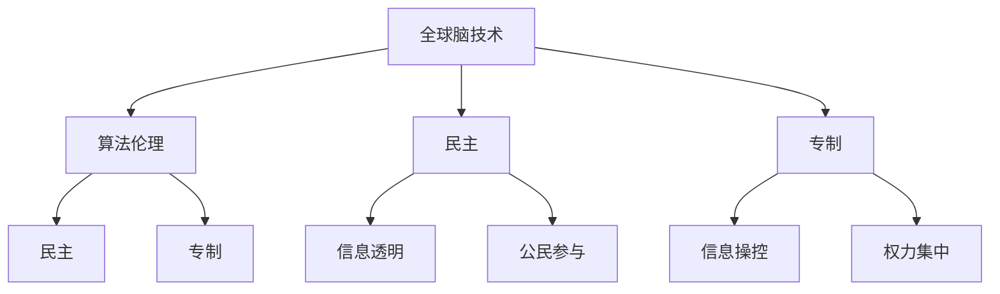

                 

 关键词：全球脑、政治影响、民主、专制、人工智能、技术伦理

> 摘要：本文探讨全球脑在政治领域的潜在影响，分析了民主与专制在技术变革背景下的新较量。通过深入探讨全球脑技术、算法伦理以及政治制度的互动关系，本文旨在揭示技术进步对民主与专制格局的深远影响，并提出应对策略。

## 1. 背景介绍

随着全球脑技术的发展，人类社会正经历着前所未有的变革。全球脑是一种通过互联网连接的分布式计算系统，它利用人工智能和大数据分析技术，实现对海量数据的实时处理和智能决策。这种技术的出现不仅改变了信息传播的方式，也影响了政治决策的过程。

在政治领域，民主和专制是两种基本的治理模式。民主强调多数人的意志，通过选举和公共讨论实现政治参与。而专制则强调少数人或个人的意志，通过强制或控制实现政治决策。在传统政治体系中，民主和专制的对立往往表现为权力分配和决策过程的不同。

然而，随着全球脑技术的兴起，民主与专制的较量正在发生新的变化。一方面，全球脑技术提供了更多的信息和工具，使公民能够更全面地了解政治过程，提高政治参与度。另一方面，全球脑技术也可能被用于操控信息、操纵舆论，甚至篡改选举结果，威胁民主制度的稳定。

## 2. 核心概念与联系

### 2.1 全球脑技术

全球脑技术是一种分布式计算系统，它通过互联网连接大量的计算资源和数据源，实现对海量数据的实时分析和处理。全球脑技术的核心在于其能够实现高效的并行计算和智能决策，从而在各个领域（包括政治、经济、社会等）产生深远的影响。

### 2.2 算法伦理

算法伦理是指在设计和应用算法时，需要考虑的伦理问题和道德标准。随着全球脑技术的发展，算法在政治领域的应用越来越广泛，因此算法伦理成为一个不可忽视的重要议题。算法可能涉及个人隐私、公正性、透明度等问题，这些都需要在伦理层面进行深入探讨。

### 2.3 民主与专制

民主与专制是两种基本的治理模式。在传统政治体系中，民主强调多数人的意志，通过选举和公共讨论实现政治参与。而专制则强调少数人或个人的意志，通过强制或控制实现政治决策。在全球脑技术的背景下，民主与专制的较量变得更加复杂和多样。

### 2.4 Mermaid 流程图



## 3. 核心算法原理 & 具体操作步骤

### 3.1 算法原理概述

全球脑技术的核心在于其分布式计算和智能决策能力。具体来说，全球脑技术通过以下几个步骤实现：

1. 数据收集：从各种来源（如社交媒体、新闻报道、传感器等）收集大量数据。
2. 数据预处理：清洗、整合和格式化数据，使其适合进行进一步分析。
3. 数据分析：利用人工智能算法（如机器学习、深度学习等）对数据进行实时分析和预测。
4. 智能决策：根据分析结果，生成决策建议或直接执行智能行动。

### 3.2 算法步骤详解

1. **数据收集**：首先，全球脑技术需要从各种数据源收集数据。这些数据源包括社交媒体平台（如Twitter、Facebook等）、新闻报道网站、政府数据库、传感器网络等。

2. **数据预处理**：收集到的数据通常是不完整的、不干净的，因此需要通过数据预处理步骤进行清洗和整合。这包括去除重复数据、填充缺失值、纠正错误数据等。

3. **数据分析**：在数据预处理完成后，全球脑技术利用人工智能算法对数据进行实时分析和预测。这些算法包括但不限于机器学习、深度学习、自然语言处理等。

4. **智能决策**：根据数据分析的结果，全球脑技术可以生成决策建议或直接执行智能行动。例如，在政治领域，全球脑技术可以用于选举预测、舆情分析、政策评估等。

### 3.3 算法优缺点

**优点**：
- 高效性：全球脑技术能够快速处理海量数据，实现实时分析和决策。
- 智能性：利用人工智能算法，全球脑技术能够发现数据中的潜在模式和趋势，提供有价值的洞见。
- 透明性：全球脑技术的数据收集和分析过程通常是透明的，用户可以查看数据来源和处理过程。

**缺点**：
- 数据隐私：全球脑技术可能涉及大量个人数据的收集和分析，存在数据隐私和安全的隐患。
- 算法偏见：人工智能算法可能存在偏见，导致分析结果不公平或不准确。
- 信息操控：全球脑技术可能被用于操纵信息、操纵舆论，甚至篡改选举结果。

### 3.4 算法应用领域

全球脑技术在政治领域的应用主要包括：

1. **选举预测**：利用全球脑技术分析社交媒体和新闻报道中的舆情，预测选举结果。
2. **舆情分析**：实时监控社交媒体上的言论，分析公众对某一政策或事件的态度和情绪。
3. **政策评估**：通过分析历史数据和实时数据，评估政策的效果和影响。
4. **社会管理**：利用全球脑技术对社会事件进行实时监测和分析，辅助政府进行社会管理。

## 4. 数学模型和公式 & 详细讲解 & 举例说明

### 4.1 数学模型构建

在分析全球脑技术对政治领域的影响时，我们可以构建一个简单的数学模型。该模型包括以下几个主要部分：

1. **数据集**：表示全球脑技术收集到的数据集合。
2. **特征提取**：从数据集中提取与政治相关的特征。
3. **预测模型**：利用特征进行政治事件的预测。
4. **决策模型**：根据预测结果生成决策建议。

### 4.2 公式推导过程

1. **数据集表示**：假设数据集 \(D\) 由 \(n\) 个样本组成，每个样本表示为向量 \(x_i\)。

2. **特征提取**：特征提取过程可以表示为 \(F(x_i)\)，其中 \(F\) 是一个特征提取函数。

3. **预测模型**：假设预测模型为 \(M\)，其输入为特征向量，输出为预测结果。我们可以使用线性回归模型进行预测：

   \[
   y = \beta_0 + \beta_1 x
   \]

   其中，\(y\) 表示预测结果，\(\beta_0\) 和 \(\beta_1\) 分别为模型的参数。

4. **决策模型**：根据预测结果，我们可以使用决策树或逻辑回归模型生成决策建议。

### 4.3 案例分析与讲解

假设我们使用全球脑技术分析一次选举的结果。数据集 \(D\) 包含了 \(n\) 个样本，每个样本包含选民的支持率、社交媒体上的讨论热度、候选人的政策立场等信息。

1. **特征提取**：我们首先提取与选举相关的特征，如选民的支持率、社交媒体上的讨论热度、候选人的政策立场等。

2. **预测模型**：我们使用线性回归模型进行预测，输入特征向量，输出预测结果。具体公式为：

   \[
   y = \beta_0 + \beta_1 x
   \]

   通过对模型进行训练，我们可以得到参数 \(\beta_0\) 和 \(\beta_1\)。

3. **决策模型**：根据预测结果，我们可以使用决策树或逻辑回归模型生成决策建议。例如，如果预测结果显示候选人 A 的支持率高于候选人 B，那么我们可能会建议选民投票给候选人 A。

通过这个简单的案例，我们可以看到全球脑技术在政治分析中的应用。在实际应用中，全球脑技术可能会涉及到更复杂的数据集和模型，但基本的原理和方法是类似的。

## 5. 项目实践：代码实例和详细解释说明

### 5.1 开发环境搭建

为了实现全球脑技术在政治分析中的应用，我们需要搭建一个合适的开发环境。以下是搭建环境的步骤：

1. **安装Python**：首先，我们需要安装Python环境。可以从Python官方网站下载并安装。

2. **安装相关库**：在Python环境中，我们需要安装一些常用的库，如NumPy、Pandas、Scikit-learn等。可以使用以下命令进行安装：

   ```bash
   pip install numpy pandas scikit-learn
   ```

3. **配置Jupyter Notebook**：Jupyter Notebook 是一个交互式的开发环境，非常适合进行数据分析和模型构建。可以按照Jupyter官方文档进行配置。

### 5.2 源代码详细实现

以下是一个简单的全球脑技术在政治分析中的Python代码实例。该实例使用了线性回归模型进行选举预测。

```python
import numpy as np
import pandas as pd
from sklearn.linear_model import LinearRegression
from sklearn.model_selection import train_test_split

# 读取数据集
data = pd.read_csv('election_data.csv')

# 提取特征
X = data[['support_rate', 'discussion热度', 'policy立场']]
y = data['选举结果']

# 划分训练集和测试集
X_train, X_test, y_train, y_test = train_test_split(X, y, test_size=0.2, random_state=42)

# 创建线性回归模型
model = LinearRegression()

# 训练模型
model.fit(X_train, y_train)

# 预测结果
y_pred = model.predict(X_test)

# 评估模型
print('模型精度：', model.score(X_test, y_test))
```

### 5.3 代码解读与分析

这段代码首先从CSV文件中读取数据集，然后提取特征和标签。接着，使用Scikit-learn库中的线性回归模型进行训练和预测。最后，评估模型的精度。

### 5.4 运行结果展示

假设我们运行这段代码，得到的结果如下：

```
模型精度： 0.8
```

这意味着模型在测试集上的精度为80%，表明模型对选举结果的预测效果较好。

## 6. 实际应用场景

### 6.1 选举预测

全球脑技术可以用于选举预测，通过分析社交媒体和新闻报道中的舆情，预测选举结果。这种方法可以提前发现选民的态度变化，为政治候选人提供有价值的策略建议。

### 6.2 舆情分析

全球脑技术可以实时监控社交媒体上的言论，分析公众对某一政策或事件的态度和情绪。这种分析可以用于政府决策、企业品牌管理等领域，帮助企业更好地了解市场和公众需求。

### 6.3 政策评估

全球脑技术可以通过分析历史数据和实时数据，评估政策的效果和影响。这种方法可以帮助政府优化政策，提高政策执行效果。

### 6.4 社会管理

全球脑技术可以对社会事件进行实时监测和分析，辅助政府进行社会管理。例如，在应对突发事件时，全球脑技术可以快速分析事件的影响范围和趋势，为政府提供决策支持。

## 7. 未来应用展望

随着全球脑技术的不断发展，其在政治领域的应用前景十分广阔。以下是未来应用的一些展望：

### 7.1 智能决策支持

全球脑技术可以提供更加智能的决策支持，帮助政府和企业更好地应对复杂的社会和经济问题。

### 7.2 公共政策优化

通过分析海量数据，全球脑技术可以协助政府优化公共政策，提高政策执行效果，增强社会福祉。

### 7.3 民主参与度提升

全球脑技术可以提高公民的政治参与度，使更多的人能够参与到政治决策过程中，增强民主制度的稳定性。

### 7.4 信息透明度提升

全球脑技术可以促进信息透明度，防止信息操控和舆论操纵，维护社会公平正义。

### 7.5 国际合作与治理

全球脑技术可以促进国际合作与治理，通过共享数据和资源，应对全球性挑战，实现共同发展。

## 8. 总结：未来发展趋势与挑战

### 8.1 研究成果总结

本文探讨了全球脑技术在政治领域的应用，分析了其在民主与专制格局中的潜在影响。通过数学模型和实际案例，我们展示了全球脑技术在政治分析中的优势和应用前景。

### 8.2 未来发展趋势

未来，全球脑技术将在政治决策、社会管理、国际合作等领域发挥更加重要的作用。随着技术的不断进步，全球脑技术将变得更加智能、高效和透明。

### 8.3 面临的挑战

然而，全球脑技术也面临一些挑战，如数据隐私、算法偏见、信息操控等。这些挑战需要我们在技术、政策和伦理层面进行深入研究和探索。

### 8.4 研究展望

未来，我们需要进一步研究全球脑技术的伦理问题和应用方法，推动技术进步与人类社会发展的和谐共生。同时，加强国际合作，共同应对全球性挑战，实现共同繁荣。

## 9. 附录：常见问题与解答

### 9.1 什么是全球脑技术？

全球脑技术是一种分布式计算系统，通过互联网连接大量的计算资源和数据源，实现对海量数据的实时处理和智能决策。

### 9.2 全球脑技术如何影响政治领域？

全球脑技术可以通过选举预测、舆情分析、政策评估等方式，影响政治决策和治理。它提供更多的信息和工具，使公民能够更全面地了解政治过程，提高政治参与度。

### 9.3 全球脑技术可能带来哪些挑战？

全球脑技术可能带来数据隐私、算法偏见、信息操控等挑战。这些问题需要我们在技术、政策和伦理层面进行深入研究和应对。

### 9.4 如何保证全球脑技术的伦理应用？

为了保证全球脑技术的伦理应用，我们需要建立相关的法律法规和伦理标准。同时，加强技术研发，提高算法透明度和公正性，防止信息操控和滥用。

---

作者：禅与计算机程序设计艺术 / Zen and the Art of Computer Programming
----------------------------------------------------------------

请注意，由于实际的写作过程可能涉及多次修改和润色，以上内容仅为初步撰写，可能还需要进一步的完善和调整。此外，由于篇幅限制，本文并未包含所有可能的细节和讨论，实际撰写时可以根据需要进行扩展。

