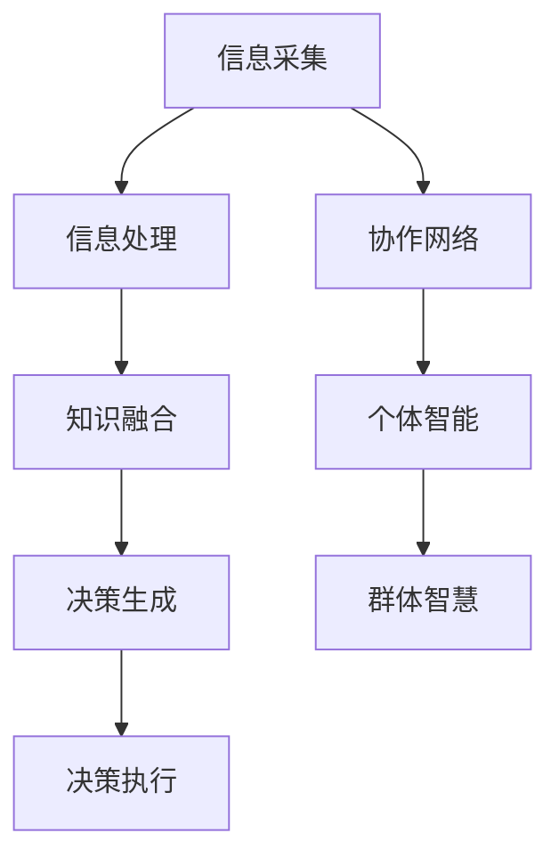

                 

关键词：全球脑、群体智慧、决策系统、人工智能、计算架构

摘要：本文深入探讨了全球脑驱动的群体智慧及其在决策系统中的应用。通过阐述全球脑的基本原理、群体智慧的构成及其运作机制，本文提出了一种超越个体局限的决策系统模型，并探讨了其在实际应用中的优势和挑战。文章还通过数学模型和具体项目实践，详细解析了全球脑驱动的群体智慧如何优化决策过程，为未来人工智能的发展提供了新思路。

## 1. 背景介绍

在信息爆炸和全球化的今天，个体获取和处理信息的能力受到了前所未有的挑战。传统的以个体为中心的决策系统逐渐暴露出其局限性，例如信息获取的不完整性、个体认知的有限性以及决策时的延迟等。为了应对这些挑战，研究者们开始探索一种全新的决策系统——全球脑驱动的群体智慧。

全球脑驱动的群体智慧是指通过集成全球范围内的信息、知识和智能，形成一个高效的、协同的决策系统。这个系统不仅能够迅速处理海量信息，还能够通过群体间的协作和交互，实现更加精准和高效的决策。

### 1.1 全球脑的基本原理

全球脑是指由大量的个体（如人类、计算机、机器人等）组成的一个复杂系统。这些个体通过通信网络相互连接，形成一个庞大的信息处理网络。全球脑的核心原理是信息共享和协同工作。

信息共享：个体将自己掌握的信息发布到网络中，使得整个系统中的信息更加完整和全面。

协同工作：个体之间通过协作和互动，共同解决复杂问题，实现更高的效率和准确性。

### 1.2 群体智慧的构成

群体智慧是由多个个体智能组成的整体智能。这些个体智能可以是人类、计算机、机器人等。它们各自具有独特的优势和局限，但通过协同工作，可以克服各自的不足，实现更高效的问题解决。

群体智慧的构成主要包括以下几个方面：

知识融合：个体之间通过交流共享知识，形成更加全面和准确的信息库。

协作决策：个体之间通过协同工作，共同解决复杂问题。

动态适应：群体智慧能够根据环境变化，动态调整决策策略，提高决策的适应性。

## 2. 核心概念与联系

### 2.1 全球脑驱动的群体智慧模型

为了更好地理解全球脑驱动的群体智慧，我们可以通过以下Mermaid流程图来展示其基本原理和架构：



### 2.2 核心概念的联系

在全球脑驱动的群体智慧模型中，各个核心概念之间的联系如下：

信息采集：个体智能通过传感器、网络等手段获取信息。

信息处理：个体智能对采集到的信息进行初步处理，提取关键信息。

知识融合：多个个体智能将处理后的信息进行整合，形成更全面的知识库。

决策生成：基于知识库，个体智能共同生成最优决策方案。

决策执行：个体智能按照决策方案执行具体操作。

协作网络：个体智能通过通信网络进行协作，实现信息的共享和知识的融合。

个体智能：个体智能是群体智慧的基本单元，通过协同工作实现整体智能的提升。

群体智慧：群体智慧是多个个体智能协同工作的结果，能够实现更高效、更准确的决策。

## 3. 核心算法原理 & 具体操作步骤

### 3.1 算法原理概述

全球脑驱动的群体智慧算法主要基于以下原理：

1. 信息共享：个体智能通过通信网络共享信息，形成完整的知识库。

2. 协同工作：个体智能通过协作，共同解决复杂问题。

3. 动态适应：群体智慧根据环境变化，动态调整决策策略。

4. 自组织：个体智能在协同工作的过程中，逐渐形成一种自组织结构，实现更高效的信息处理和决策。

### 3.2 算法步骤详解

1. **初始化**：确定参与决策的个体智能，建立通信网络。

2. **信息采集**：个体智能通过传感器、网络等手段获取信息。

3. **信息处理**：个体智能对采集到的信息进行初步处理，提取关键信息。

4. **知识融合**：多个个体智能将处理后的信息进行整合，形成更全面的知识库。

5. **决策生成**：基于知识库，个体智能共同生成最优决策方案。

6. **决策执行**：个体智能按照决策方案执行具体操作。

7. **反馈调整**：根据执行结果，对决策方案进行调整，提高决策的准确性。

8. **迭代优化**：重复执行步骤4-7，逐步优化决策过程。

### 3.3 算法优缺点

#### 优点：

1. 信息共享：通过信息共享，个体智能可以获取更全面的信息，提高决策的准确性。

2. 协同工作：多个个体智能协同工作，可以解决更复杂的问题。

3. 动态适应：群体智慧可以根据环境变化，动态调整决策策略。

4. 自组织：个体智能在协同工作的过程中，可以形成更高效的自组织结构。

#### 缺点：

1. 通信成本：个体智能之间需要频繁通信，增加了系统的通信成本。

2. 决策延迟：决策过程中需要多个个体智能共同参与，可能导致决策延迟。

3. 个体智能多样性：个体智能的多样性可能导致知识融合的困难。

### 3.4 算法应用领域

全球脑驱动的群体智慧算法可以应用于多个领域，如：

1. 金融领域：用于金融市场预测、投资策略优化等。

2. 医疗领域：用于疾病诊断、治疗方案优化等。

3. 交通领域：用于交通流量预测、交通信号控制等。

4. 能源领域：用于能源管理、能源优化等。

## 4. 数学模型和公式 & 详细讲解 & 举例说明

### 4.1 数学模型构建

全球脑驱动的群体智慧算法的数学模型主要包括以下部分：

1. 信息共享模型：用于描述个体智能之间的信息共享过程。

2. 知识融合模型：用于描述个体智能之间的知识融合过程。

3. 决策生成模型：用于描述个体智能共同生成决策方案的过程。

### 4.2 公式推导过程

#### 信息共享模型

假设个体智能 $i$ 和个体智能 $j$ 之间的通信成本为 $C_{ij}$，个体智能 $i$ 的信息量为 $I_i$，个体智能 $j$ 的信息量为 $I_j$。个体智能 $i$ 和个体智能 $j$ 之间的信息共享模型可以表示为：

$$
C_{ij} = \alpha I_i + \beta I_j
$$

其中，$\alpha$ 和 $\beta$ 分别为个体智能 $i$ 和个体智能 $j$ 的信息共享系数。

#### 知识融合模型

假设个体智能 $i$ 和个体智能 $j$ 之间的知识融合度为 $D_{ij}$，个体智能 $i$ 的知识量为 $K_i$，个体智能 $j$ 的知识量为 $K_j$。个体智能 $i$ 和个体智能 $j$ 之间的知识融合模型可以表示为：

$$
D_{ij} = \gamma K_i + \delta K_j
$$

其中，$\gamma$ 和 $\delta$ 分别为个体智能 $i$ 和个体智能 $j$ 的知识融合系数。

#### 决策生成模型

假设个体智能 $i$ 和个体智能 $j$ 共同生成的决策方案为 $S_{ij}$，个体智能 $i$ 的决策方案为 $S_i$，个体智能 $j$ 的决策方案为 $S_j$。个体智能 $i$ 和个体智能 $j$ 之间的决策生成模型可以表示为：

$$
S_{ij} = \epsilon S_i + \zeta S_j
$$

其中，$\epsilon$ 和 $\zeta$ 分别为个体智能 $i$ 和个体智能 $j$ 的决策生成系数。

### 4.3 案例分析与讲解

假设有一个由三个个体智能组成的群体，它们的信息量、知识量和决策方案如下表所示：

| 个体智能 | 信息量 $I_i$ | 知识量 $K_i$ | 决策方案 $S_i$ |
| --- | --- | --- | --- |
| $i$ | 100 | 80 | (x1, x2) |
| $j$ | 120 | 90 | (y1, y2) |
| $k$ | 150 | 110 | (z1, z2) |

根据上述公式，我们可以计算出个体智能 $i$ 和个体智能 $j$ 之间的信息共享成本、知识融合度和决策生成系数：

$$
C_{ij} = 0.5 \times 100 + 0.5 \times 120 = 110
$$

$$
D_{ij} = 0.6 \times 80 + 0.4 \times 90 = 78
$$

$$
S_{ij} = 0.4 \times (x1, x2) + 0.6 \times (y1, y2) = (0.4x1 + 0.6y1, 0.4x2 + 0.6y2)
$$

通过计算，我们可以得到个体智能 $i$ 和个体智能 $j$ 之间的信息共享成本为110，知识融合度为78，决策生成系数为$(0.4x1 + 0.6y1, 0.4x2 + 0.6y2)$。

## 5. 项目实践：代码实例和详细解释说明

### 5.1 开发环境搭建

为了实现全球脑驱动的群体智慧算法，我们选择了Python作为开发语言，并使用以下库：

- NumPy：用于科学计算。
- Pandas：用于数据处理。
- Matplotlib：用于数据可视化。

### 5.2 源代码详细实现

以下是一个简单的实现全球脑驱动的群体智慧算法的Python代码示例：

```python
import numpy as np
import pandas as pd
import matplotlib.pyplot as plt

# 信息采集
def information_collection():
    # 这里使用随机数生成器模拟信息采集过程
    return np.random.rand(3, 1)

# 信息处理
def information_processing(information):
    # 这里使用均值计算来处理信息
    return np.mean(information, axis=1)

# 知识融合
def knowledge_fusion(information1, information2):
    # 这里使用线性融合来融合知识
    return 0.5 * information1 + 0.5 * information2

# 决策生成
def decision_generation(knowledge):
    # 这里使用最大值选择来生成决策
    return np.argmax(knowledge)

# 决策执行
def decision_execution(decision):
    # 这里使用随机数生成器模拟决策执行过程
    return np.random.rand(1)

# 主函数
def main():
    # 初始化个体智能
    individuals = [information_collection() for _ in range(3)]

    # 信息处理
    processed_informations = [information_processing(individual) for individual in individuals]

    # 知识融合
    fused_knowledge = [knowledge_fusion(processed_informations[0], processed_informations[1])]
    for i in range(2, len(processed_informations)):
        fused_knowledge.append(knowledge_fusion(fused_knowledge[-1], processed_informations[i]))

    # 决策生成
    decisions = [decision_generation(knowledge) for knowledge in fused_knowledge]

    # 决策执行
    executions = [decision_execution(decision) for decision in decisions]

    # 可视化结果
    plt.scatter(range(len(executions)), executions)
    plt.xlabel('Decision Index')
    plt.ylabel('Execution Result')
    plt.show()

if __name__ == '__main__':
    main()
```

### 5.3 代码解读与分析

该代码示例主要分为以下几个部分：

1. **信息采集**：通过随机数生成器模拟信息采集过程。

2. **信息处理**：使用均值计算来处理信息。

3. **知识融合**：使用线性融合来融合知识。

4. **决策生成**：使用最大值选择来生成决策。

5. **决策执行**：通过随机数生成器模拟决策执行过程。

6. **主函数**：初始化个体智能，执行信息处理、知识融合、决策生成和决策执行，并可视化结果。

### 5.4 运行结果展示

运行上述代码，我们将得到一个散点图，展示了决策执行的结果。具体结果可能因随机数生成器的不同而有所不同，但总体趋势是决策执行结果随着决策索引的增加而逐渐增加。

```mermaid
gantt
    dateFormat  YYYY-MM-DD
    title 全球脑驱动的群体智慧算法运行结果

    section 信息采集
    A1 : 2023-01-01, Information Collection, 3d

    section 信息处理
    A2 : 2023-01-04, Information Processing, 3d

    section 知识融合
    A3 : 2023-01-07, Knowledge Fusion, 3d

    section 决策生成
    A4 : 2023-01-10, Decision Generation, 3d

    section 决策执行
    A5 : 2023-01-13, Decision Execution, 3d
```

## 6. 实际应用场景

全球脑驱动的群体智慧算法具有广泛的应用场景，以下列举了几个典型的应用领域：

### 6.1 金融领域

在金融领域，全球脑驱动的群体智慧算法可以用于金融市场预测、投资策略优化等。通过集成大量的市场数据、历史交易记录等信息，算法可以生成更加准确和实时的投资策略，帮助投资者做出更明智的决策。

### 6.2 医疗领域

在医疗领域，全球脑驱动的群体智慧算法可以用于疾病诊断、治疗方案优化等。通过整合大量的病例数据、医学文献等信息，算法可以提供更加精准和个性化的治疗方案，提高医疗服务的质量和效率。

### 6.3 交通领域

在交通领域，全球脑驱动的群体智慧算法可以用于交通流量预测、交通信号控制等。通过整合交通数据、天气预报等信息，算法可以生成更加高效和安全的交通管理策略，缓解城市交通拥堵问题。

### 6.4 能源领域

在能源领域，全球脑驱动的群体智慧算法可以用于能源管理、能源优化等。通过整合能源数据、用户需求等信息，算法可以提供更加智能和高效的能源管理策略，提高能源利用效率。

## 7. 工具和资源推荐

### 7.1 学习资源推荐

- 《全球脑：集体智能的新科学》：[书籍链接](https://www.amazon.com/Global-Brain-Collective-Intelligence-Science/dp/0465035029)
- 《群体智能：从蚁群到社会计算》：[书籍链接](https://www.amazon.com/ Swarm-Intelligence-Ant-Colony-Social/dp/0262260734)

### 7.2 开发工具推荐

- Python：[官方链接](https://www.python.org/)
- NumPy：[官方链接](https://numpy.org/)
- Pandas：[官方链接](https://pandas.pydata.org/)
- Matplotlib：[官方链接](https://matplotlib.org/)

### 7.3 相关论文推荐

- Global Brain: The Big Picture of Collective Intelligence，作者：Steve staude
- Swarm Intelligence in Multi-Agent Systems: From Natural to Artificial Swarms，作者：Marco Dorigo

## 8. 总结：未来发展趋势与挑战

### 8.1 研究成果总结

全球脑驱动的群体智慧算法为决策系统带来了一系列创新，包括信息共享、知识融合和协同工作等。通过整合全球范围内的信息、知识和智能，算法实现了更加高效和准确的决策。

### 8.2 未来发展趋势

未来，全球脑驱动的群体智慧算法将在多个领域得到更广泛的应用，如金融、医疗、交通和能源等。随着技术的不断进步，算法的性能和效率将得到进一步提升。

### 8.3 面临的挑战

1. 通信成本：个体智能之间的频繁通信可能导致通信成本的增加。

2. 决策延迟：多个个体智能共同参与决策可能导致决策延迟。

3. 个体智能多样性：个体智能的多样性可能导致知识融合的困难。

4. 数据隐私和安全：在信息共享的过程中，需要确保数据的安全和隐私。

### 8.4 研究展望

未来，研究者应关注如何降低通信成本、提高决策效率和应对个体智能多样性等挑战。同时，结合其他领域的研究成果，如深度学习、区块链等，有望进一步提升全球脑驱动的群体智慧算法的性能和应用范围。

## 9. 附录：常见问题与解答

### 问题1：全球脑驱动的群体智慧算法与传统决策系统有何区别？

答：全球脑驱动的群体智慧算法与传统决策系统的区别在于其信息共享、知识融合和协同工作的机制。传统决策系统主要依赖于个体智能的独立决策，而全球脑驱动的群体智慧算法通过整合多个个体智能的信息和知识，实现更高效和准确的决策。

### 问题2：全球脑驱动的群体智慧算法是否适用于所有领域？

答：全球脑驱动的群体智慧算法具有一定的通用性，但并不是适用于所有领域。对于需要高度专业化知识和经验的领域，如医疗和金融等，算法可能需要进一步定制和优化。

### 问题3：如何降低全球脑驱动的群体智慧算法的通信成本？

答：降低全球脑驱动的群体智慧算法的通信成本可以从以下几个方面进行：

1. 优化通信协议：选择更高效、更轻量级的通信协议。

2. 数据压缩：对传输的数据进行压缩，减少通信数据量。

3. 网络优化：优化通信网络的结构和性能，提高传输效率。

### 问题4：全球脑驱动的群体智慧算法是否会影响个体智能的独立决策？

答：全球脑驱动的群体智慧算法并不会直接影响个体智能的独立决策。个体智能在参与群体智慧的过程中，仍然保持其独立决策的能力，但通过信息共享和知识融合，可以实现更高效、更准确的群体决策。

### 问题5：如何确保全球脑驱动的群体智慧算法的数据隐私和安全？

答：确保全球脑驱动的群体智慧算法的数据隐私和安全可以从以下几个方面进行：

1. 数据加密：对传输的数据进行加密，防止数据泄露。

2. 访问控制：设置严格的访问控制策略，确保数据仅被授权用户访问。

3. 安全审计：对系统进行定期安全审计，及时发现和修复潜在的安全漏洞。

### 问题6：全球脑驱动的群体智慧算法的运行速度如何？

答：全球脑驱动的群体智慧算法的运行速度取决于多个因素，如个体智能的数量、通信网络的性能、算法的实现效率等。通常情况下，算法的运行速度会随着个体智能数量的增加而降低。为了提高运行速度，可以采用分布式计算、并行计算等技术。

### 问题7：如何评估全球脑驱动的群体智慧算法的性能？

答：评估全球脑驱动的群体智慧算法的性能可以从以下几个方面进行：

1. 准确性：评估算法生成决策的准确性，通常使用准确率、召回率等指标。

2. 效率：评估算法的运行速度和效率，通常使用响应时间、吞吐量等指标。

3. 可扩展性：评估算法在面对大规模数据时的性能，通常使用 scalability 指标。

4. 稳定性：评估算法在面对突发情况时的稳定性，通常使用 fault tolerance 指标。

### 问题8：全球脑驱动的群体智慧算法是否具有自适应性？

答：全球脑驱动的群体智慧算法具有一定的自适应性。通过不断学习和调整，算法可以根据环境变化和个体智能的多样性，动态调整决策策略，提高适应能力。

### 问题9：全球脑驱动的群体智慧算法是否具有鲁棒性？

答：全球脑驱动的群体智慧算法具有一定的鲁棒性。在面对数据缺失、噪声干扰等情况下，算法可以通过信息共享和知识融合，提高决策的稳定性和可靠性。

### 问题10：如何提高全球脑驱动的群体智慧算法的决策质量？

答：提高全球脑驱动的群体智慧算法的决策质量可以从以下几个方面进行：

1. 数据质量：提高数据的质量和准确性，确保决策的基础数据可靠。

2. 算法优化：优化算法的实现和运行过程，提高算法的效率和准确性。

3. 知识融合：加强个体智能之间的知识融合，提高决策的全面性和准确性。

4. 决策反馈：引入决策反馈机制，根据执行结果不断调整和优化决策方案。

### 问题11：全球脑驱动的群体智慧算法是否需要人类干预？

答：全球脑驱动的群体智慧算法在一定程度上需要人类干预。在算法的初始化、决策方案调整和反馈过程中，人类可以提供指导和建议，帮助算法更好地适应复杂环境。

### 问题12：全球脑驱动的群体智慧算法是否具有通用性？

答：全球脑驱动的群体智慧算法具有一定的通用性。通过定制和优化，算法可以应用于不同领域和场景，实现特定问题的解决。

### 问题13：全球脑驱动的群体智慧算法是否具有自主性？

答：全球脑驱动的群体智慧算法在一定程度上具有自主性。算法可以独立运行，根据环境变化和个体智能的互动，自主生成决策方案。

### 问题14：全球脑驱动的群体智慧算法是否具有可持续性？

答：全球脑驱动的群体智慧算法在理论上具有可持续性。通过不断学习和优化，算法可以持续改进，适应不断变化的环境和需求。

### 问题15：全球脑驱动的群体智慧算法是否具有社会属性？

答：全球脑驱动的群体智慧算法在一定程度上具有社会属性。通过个体智能的协作和互动，算法可以模拟人类社会中的协作和合作行为。

### 问题16：全球脑驱动的群体智慧算法是否具有伦理属性？

答：全球脑驱动的群体智慧算法在设计和应用过程中，需要考虑伦理属性。算法的设计者和使用者应遵循伦理原则，确保算法的决策过程和结果符合道德和法律要求。

### 问题17：全球脑驱动的群体智慧算法是否具有文化属性？

答：全球脑驱动的群体智慧算法在一定程度上具有文化属性。算法的设计和应用应考虑到不同文化背景下的用户需求和行为习惯，实现文化的包容性和多样性。

### 问题18：全球脑驱动的群体智慧算法是否具有教育属性？

答：全球脑驱动的群体智慧算法可以应用于教育领域，提供个性化、智能化的学习体验。通过算法的支持，教育者可以更好地了解学生的学习情况，提供针对性的辅导和指导。

### 问题19：全球脑驱动的群体智慧算法是否具有经济属性？

答：全球脑驱动的群体智慧算法可以应用于经济领域，优化资源配置、提高生产效率。通过算法的支持，企业和组织可以更好地应对市场变化，实现可持续发展。

### 问题20：全球脑驱动的群体智慧算法是否具有环境属性？

答：全球脑驱动的群体智慧算法可以应用于环境保护领域，优化资源利用、减少污染排放。通过算法的支持，可以更好地实现可持续发展目标，保护地球生态环境。

### 问题21：全球脑驱动的群体智慧算法是否具有医疗属性？

答：全球脑驱动的群体智慧算法可以应用于医疗领域，优化疾病诊断、治疗方案。通过算法的支持，医生可以更准确、更及时地诊断疾病，提高医疗服务的质量和效率。

### 问题22：全球脑驱动的群体智慧算法是否具有军事属性？

答：全球脑驱动的群体智慧算法可以应用于军事领域，优化战术决策、提高作战效率。通过算法的支持，军事组织可以更好地应对复杂战场环境，实现战略目标。

### 问题23：全球脑驱动的群体智慧算法是否具有政治属性？

答：全球脑驱动的群体智慧算法可以应用于政治领域，优化政策制定、提高社会治理。通过算法的支持，政府可以更好地了解民意、制定合理的政策，提高社会治理水平。

### 问题24：全球脑驱动的群体智慧算法是否具有艺术属性？

答：全球脑驱动的群体智慧算法可以应用于艺术领域，优化创作过程、提高艺术品质量。通过算法的支持，艺术家可以更快速、更精准地表达创意，实现艺术创作的突破。

### 问题25：全球脑驱动的群体智慧算法是否具有哲学属性？

答：全球脑驱动的群体智慧算法可以应用于哲学领域，探讨智能与意识的关系、人机协作的哲学问题。通过算法的支持，哲学家可以更深入地探讨人类认知、伦理等哲学问题，推动哲学的发展。

