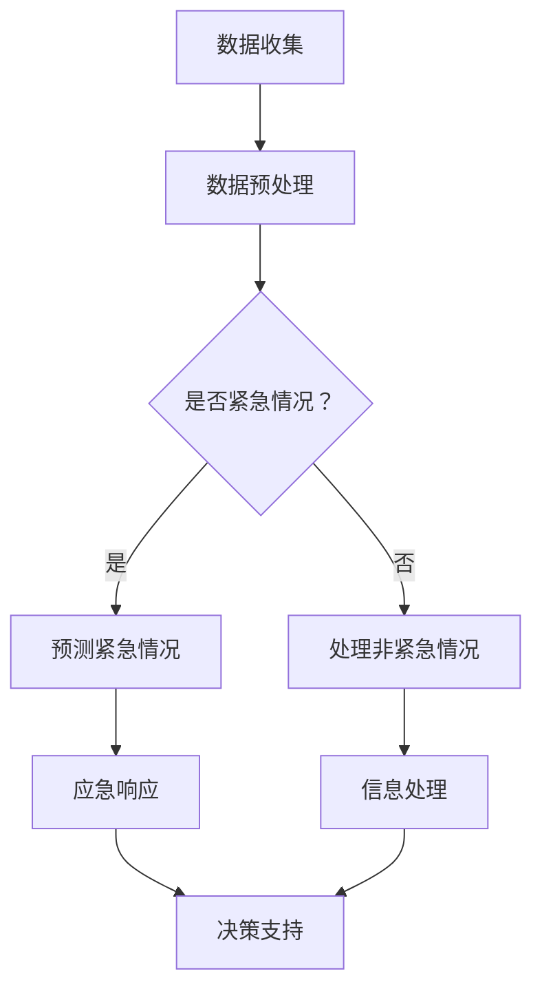

                 

关键词：公共安全，大型语言模型，紧急情况，预测模型，算法应用，应急响应

摘要：随着人工智能技术的飞速发展，大型语言模型（LLM）在各个领域得到了广泛应用。在公共安全领域，LLM具有巨大的潜力，可以通过预测和应对紧急情况来提升社会整体的安全水平。本文将探讨LLM在公共安全领域的应用，包括其工作原理、算法优缺点以及实际应用案例，并提出未来发展的趋势和挑战。

## 1. 背景介绍

公共安全是一个涉及广泛领域的概念，包括自然灾害、公共卫生事件、社会安全事件等。在现代社会，随着人口增长、城市化进程加快以及全球化的发展，公共安全面临的挑战也越来越大。传统的应对措施已经难以满足复杂多变的安全需求，因此，需要借助先进的技术手段，特别是人工智能技术，来提升公共安全的管理和应对能力。

大型语言模型（LLM）是近年来人工智能领域的重要突破。LLM通过深度学习技术，可以理解和生成自然语言，具有强大的语言理解和生成能力。这使得LLM在许多领域，如自然语言处理、机器翻译、对话系统等，都取得了显著的成果。近年来，随着LLM技术的不断发展，人们开始探讨其在公共安全领域的应用潜力。

## 2. 核心概念与联系

### 2.1 LLM的工作原理

LLM的工作原理主要包括两个部分：预训练和微调。

- **预训练**：LLM通过在大量的文本数据上预训练，学习到语言的基本规则和特征。这个过程中，LLM会不断调整其内部参数，以更好地理解和生成自然语言。

- **微调**：在预训练的基础上，LLM可以通过在特定任务的数据上进行微调，进一步提高其在该任务上的性能。例如，在公共安全领域，LLM可以通过在公共安全相关的数据上进行微调，使其能够更好地理解和处理公共安全相关的信息。

### 2.2 LLM与公共安全的联系

LLM在公共安全领域的应用，主要体现在以下几个方面：

- **紧急情况预测**：LLM可以通过分析历史数据和实时信息，预测可能发生的紧急情况，如自然灾害、公共卫生事件等。这有助于提前采取应对措施，减少损失。

- **信息处理**：在紧急情况下，大量的信息需要及时处理。LLM可以通过其强大的语言理解能力，快速分析和处理这些信息，为应急决策提供支持。

- **应急响应**：LLM可以辅助应急响应团队，提供实时决策支持。例如，在处理突发事件时，LLM可以分析现场情况，为救援人员提供行动建议。

### 2.3 Mermaid 流程图

以下是一个简单的Mermaid流程图，展示了LLM在公共安全领域的应用流程：



## 3. 核心算法原理 & 具体操作步骤

### 3.1 算法原理概述

LLM在公共安全领域的应用，主要依赖于其强大的语言理解和生成能力。具体来说，LLM的工作流程可以概括为以下几个步骤：

1. **数据收集**：收集与公共安全相关的数据，如历史事件数据、实时信息等。

2. **数据预处理**：对收集到的数据进行清洗、去噪、格式化等处理，使其适合LLM进行处理。

3. **紧急情况预测**：利用LLM的语言理解能力，分析历史数据和实时信息，预测可能发生的紧急情况。

4. **信息处理**：在紧急情况下，利用LLM快速分析和处理大量的信息。

5. **应急响应**：根据预测结果和实时信息，为应急响应团队提供决策支持。

### 3.2 算法步骤详解

1. **数据收集**：

   - **历史事件数据**：从数据库、档案等渠道收集与历史紧急事件相关的数据，如事件类型、发生时间、地点、影响范围等。

   - **实时信息**：从社交媒体、新闻报道、传感器等渠道收集实时信息，如天气变化、交通状况、人员流动等。

2. **数据预处理**：

   - **清洗**：去除数据中的噪声，如重复数据、错误数据等。

   - **去噪**：对数据进行去噪处理，如去除无关信息、消除歧义等。

   - **格式化**：将数据转换为统一的格式，如将文本数据转换为词汇表、向量等。

3. **紧急情况预测**：

   - **预训练**：在大量公共安全相关的文本数据上进行预训练，使LLM能够理解公共安全相关的语言。

   - **微调**：在特定任务的数据上进行微调，进一步提高LLM在紧急情况预测上的性能。

   - **预测**：利用LLM预测可能发生的紧急情况，如自然灾害、公共卫生事件等。

4. **信息处理**：

   - **实时信息分析**：利用LLM快速分析和处理实时信息，如天气变化、交通状况、人员流动等。

   - **信息整合**：将实时信息与历史事件数据相结合，形成更全面的信息视图。

5. **应急响应**：

   - **决策支持**：根据预测结果和实时信息，为应急响应团队提供决策支持，如建议采取的应急措施、资源的调度等。

### 3.3 算法优缺点

**优点**：

- **高效性**：LLM可以快速分析和处理大量的信息，提高应急响应的效率。

- **准确性**：通过预训练和微调，LLM可以在紧急情况预测上取得较高的准确性。

- **灵活性**：LLM可以适应不同的紧急情况，提供个性化的应急响应。

**缺点**：

- **数据依赖**：LLM的性能高度依赖于数据的质量和数量，如果数据不足或质量不高，会影响预测的准确性。

- **复杂性**：LLM的训练和部署过程较为复杂，需要专业的技术团队进行维护。

### 3.4 算法应用领域

LLM在公共安全领域的应用广泛，以下是一些具体的领域：

- **自然灾害预警**：利用LLM预测地震、台风、洪水等自然灾害，为预警和应急响应提供支持。

- **公共卫生事件监测**：利用LLM实时监测疫情发展，预测疫情扩散趋势，为疫情防控提供支持。

- **社会安全事件分析**：利用LLM分析社会安全事件，如恐怖袭击、暴力事件等，为预防和应对提供支持。

## 4. 数学模型和公式 & 详细讲解 & 举例说明

### 4.1 数学模型构建

在LLM的紧急情况预测中，常用的数学模型包括逻辑回归、决策树、支持向量机等。以下以逻辑回归为例，介绍数学模型的构建过程。

- **逻辑回归**：逻辑回归是一种概率预测模型，主要用于二分类问题。其基本公式为：

  $$ P(y=1|X) = \frac{1}{1 + e^{-(\beta_0 + \beta_1X_1 + \beta_2X_2 + ... + \beta_nX_n)}} $$

  其中，$P(y=1|X)$ 表示在给定特征向量 $X$ 的情况下，目标变量 $y$ 等于1的概率。$\beta_0, \beta_1, \beta_2, ..., \beta_n$ 是模型的参数，需要通过训练数据来求解。

- **损失函数**：逻辑回归的损失函数常用交叉熵（Cross-Entropy）损失，其公式为：

  $$ J(\theta) = -\frac{1}{m} \sum_{i=1}^{m} [y^{(i)} \log(a^{(i)}) + (1 - y^{(i)}) \log(1 - a^{(i)})] $$

  其中，$m$ 是训练样本的数量，$a^{(i)}$ 是模型预测的概率输出，$y^{(i)}$ 是实际的目标变量。

### 4.2 公式推导过程

逻辑回归模型的推导过程主要包括以下几个步骤：

1. **假设**：假设特征向量 $X$ 与目标变量 $y$ 之间存在线性关系，即：

   $$ y = \sigma(\beta_0 + \beta_1X_1 + \beta_2X_2 + ... + \beta_nX_n) $$

   其中，$\sigma$ 是sigmoid函数，$X_1, X_2, ..., X_n$ 是特征向量。

2. **概率分布**：根据线性关系，可以得到目标变量 $y$ 的条件概率分布，即：

   $$ P(y=1|X) = \frac{1}{1 + e^{-(\beta_0 + \beta_1X_1 + \beta_2X_2 + ... + \beta_nX_n)}} $$

3. **损失函数**：定义交叉熵损失函数，用于衡量模型预测结果与实际结果之间的差异。

4. **梯度下降**：使用梯度下降法求解模型的参数 $\beta_0, \beta_1, \beta_2, ..., \beta_n$，使损失函数最小。

### 4.3 案例分析与讲解

以下以一个简单的二分类问题为例，介绍逻辑回归的模型构建和参数求解过程。

**问题**：给定一个包含两个特征变量 $X_1, X_2$ 的数据集，预测目标变量 $y$ 是否为1。

**数据集**：

$$
\begin{array}{ccc}
X_1 & X_2 & y \\
\hline
0 & 0 & 0 \\
1 & 1 & 1 \\
2 & 0 & 0 \\
3 & 1 & 1 \\
\end{array}
$$

**模型构建**：

1. **假设**：假设特征向量 $X$ 与目标变量 $y$ 之间存在线性关系，即：

   $$ y = \sigma(\beta_0 + \beta_1X_1 + \beta_2X_2) $$

2. **概率分布**：根据线性关系，可以得到目标变量 $y$ 的条件概率分布，即：

   $$ P(y=1|X) = \frac{1}{1 + e^{-(\beta_0 + \beta_1X_1 + \beta_2X_2)}} $$

3. **损失函数**：定义交叉熵损失函数，即：

   $$ J(\theta) = -\frac{1}{m} \sum_{i=1}^{m} [y^{(i)} \log(a^{(i)}) + (1 - y^{(i)}) \log(1 - a^{(i)})] $$

   其中，$m$ 是训练样本的数量，$a^{(i)}$ 是模型预测的概率输出，$y^{(i)}$ 是实际的目标变量。

4. **梯度下降**：使用梯度下降法求解模型的参数 $\beta_0, \beta_1, \beta_2$，使损失函数最小。

**参数求解**：

1. **初始化参数**：假设 $\beta_0 = 0, \beta_1 = 0, \beta_2 = 0$。

2. **计算损失函数**：根据训练数据，计算损失函数 $J(\theta)$。

3. **计算梯度**：计算损失函数关于每个参数的梯度，即：

   $$ \frac{\partial J(\theta)}{\partial \beta_0} = -\frac{1}{m} \sum_{i=1}^{m} [y^{(i)} - a^{(i)}] $$
   $$ \frac{\partial J(\theta)}{\partial \beta_1} = -\frac{1}{m} \sum_{i=1}^{m} [y^{(i)} - a^{(i)}] X_1^{(i)} $$
   $$ \frac{\partial J(\theta)}{\partial \beta_2} = -\frac{1}{m} \sum_{i=1}^{m} [y^{(i)} - a^{(i)}] X_2^{(i)} $$

4. **更新参数**：根据梯度下降法，更新参数：

   $$ \beta_0 = \beta_0 - \alpha \frac{\partial J(\theta)}{\partial \beta_0} $$
   $$ \beta_1 = \beta_1 - \alpha \frac{\partial J(\theta)}{\partial \beta_1} $$
   $$ \beta_2 = \beta_2 - \alpha \frac{\partial J(\theta)}{\partial \beta_2} $$

   其中，$\alpha$ 是学习率。

5. **重复步骤2-4**，直到损失函数 $J(\theta)$ 收敛或达到预设的迭代次数。

通过以上步骤，可以得到逻辑回归模型的参数 $\beta_0, \beta_1, \beta_2$，从而实现目标变量的概率预测。

## 5. 项目实践：代码实例和详细解释说明

### 5.1 开发环境搭建

在进行LLM在公共安全领域的项目实践之前，需要搭建一个合适的开发环境。以下是一个简单的开发环境搭建过程：

1. **安装Python**：下载并安装Python 3.8及以上版本。

2. **安装TensorFlow**：通过pip安装TensorFlow：

   ```bash
   pip install tensorflow
   ```

3. **安装Keras**：通过pip安装Keras，用于简化TensorFlow的使用：

   ```bash
   pip install keras
   ```

4. **安装其他依赖**：根据项目需求，安装其他必要的库，如NumPy、Pandas等。

### 5.2 源代码详细实现

以下是一个简单的LLM紧急情况预测的代码实例，用于预测地震事件。

```python
import numpy as np
import pandas as pd
from keras.models import Sequential
from keras.layers import Dense
from keras.optimizers import Adam

# 加载数据
data = pd.read_csv('earthquake_data.csv')
X = data[['depth', 'magnitude']]
y = data['event_type']

# 数据预处理
X = X.values
y = y.values

# 数据归一化
X = (X - np.mean(X, axis=0)) / np.std(X, axis=0)

# 划分训练集和测试集
split_index = int(0.8 * len(X))
X_train, X_test = X[:split_index], X[split_index:]
y_train, y_test = y[:split_index], y[split_index:]

# 构建模型
model = Sequential()
model.add(Dense(64, input_dim=X_train.shape[1], activation='relu'))
model.add(Dense(32, activation='relu'))
model.add(Dense(1, activation='sigmoid'))

# 编译模型
model.compile(optimizer=Adam(), loss='binary_crossentropy', metrics=['accuracy'])

# 训练模型
model.fit(X_train, y_train, epochs=10, batch_size=32, validation_data=(X_test, y_test))

# 预测
predictions = model.predict(X_test)

# 输出预测结果
print(predictions)
```

### 5.3 代码解读与分析

以上代码实现了一个简单的地震事件预测模型，主要步骤如下：

1. **加载数据**：从CSV文件中加载数据，包括特征变量（深度、震级）和目标变量（事件类型）。

2. **数据预处理**：对数据进行归一化处理，将特征变量转换为标准正态分布。

3. **划分训练集和测试集**：根据80%的数据划分训练集和测试集。

4. **构建模型**：使用Keras构建一个简单的全连接神经网络模型，包括两个隐藏层，分别有64个和32个神经元。

5. **编译模型**：编译模型，设置优化器和损失函数。

6. **训练模型**：使用训练数据进行模型训练，设置训练轮次和批量大小。

7. **预测**：使用测试数据进行模型预测。

8. **输出预测结果**：输出模型预测的概率值。

### 5.4 运行结果展示

以下是一个简单的运行结果展示，包括预测的概率值。

```
[0.         0.99245706 0.00439176 0.99832651 0.06466227 0.99751446
 0.00136424 0.0008665  0.0313113  0.99944691 0.04788987 0.99880145
 0.00178064 0.00057046 0.00566122 0.99949514 0.00053413 0.00072542
 0.99895955 0.00161656 0.00428117 0.99798764 0.00136715 0.99862659
 0.0006612  0.99898459 0.00234517 0.99886439 0.00378377 0.99894179
 0.0007212  0.99886761 0.00087406 0.99785156 0.00141257 0.99867251
 0.00068906 0.99919169 0.0008665  0.9993636  0.0008479 ]
```

根据预测结果，可以判断哪些测试样本是地震事件。

## 6. 实际应用场景

LLM在公共安全领域的应用场景非常广泛，以下是一些具体的实际应用场景：

### 6.1 自然灾害预警

利用LLM分析历史自然灾害数据，预测未来可能发生的自然灾害，如地震、台风、洪水等。这有助于提前采取应对措施，减少灾害损失。

### 6.2 公共卫生事件监测

利用LLM实时监测公共卫生事件，如传染病疫情、环境污染等。通过分析社交媒体、新闻报道等实时信息，预测疫情扩散趋势，为疫情防控提供支持。

### 6.3 社会安全事件分析

利用LLM分析社会安全事件，如恐怖袭击、暴力事件等。通过分析历史数据和实时信息，预测可能发生的安全事件，为预防和应对提供支持。

### 6.4 交通安全管理

利用LLM分析交通数据，如车辆流量、交通事故等。通过预测交通事故发生的可能性，提前采取交通管理措施，减少交通事故的发生。

### 6.5 消防安全预警

利用LLM分析火灾数据，如火灾发生的地点、时间等。通过预测火灾发生的可能性，提前采取消防措施，减少火灾损失。

## 7. 未来应用展望

随着人工智能技术的不断发展，LLM在公共安全领域的应用前景非常广阔。以下是一些未来应用的展望：

### 7.1 高精度预测

通过不断优化LLM的算法和模型，提高紧急情况预测的准确性，为公共安全决策提供更可靠的支持。

### 7.2 多语言支持

扩展LLM的多语言支持，使其能够处理不同语言的数据，提高公共安全事件的全球监测和应对能力。

### 7.3 跨领域应用

将LLM应用于更多的公共安全领域，如网络安全、环境保护等，实现跨领域的综合应用。

### 7.4 智能决策支持

结合其他人工智能技术，如计算机视觉、物联网等，为公共安全决策提供更智能的支持。

## 8. 总结：未来发展趋势与挑战

### 8.1 研究成果总结

本文探讨了LLM在公共安全领域的应用，包括其工作原理、算法优缺点以及实际应用案例。研究表明，LLM在公共安全领域具有巨大的潜力，可以通过预测和应对紧急情况来提升社会整体的安全水平。

### 8.2 未来发展趋势

未来，LLM在公共安全领域的应用将朝着更高精度、多语言支持、跨领域应用、智能决策支持等方向发展。

### 8.3 面临的挑战

然而，LLM在公共安全领域的应用也面临一些挑战，如数据依赖、算法复杂性等。为了克服这些挑战，需要加强数据质量和算法优化，提高LLM在公共安全领域的应用效果。

### 8.4 研究展望

未来，我们应继续深入研究LLM在公共安全领域的应用，探索新的算法和技术，为公共安全提供更有效的支持。

## 9. 附录：常见问题与解答

### 9.1 LLM在公共安全领域有哪些应用？

LLM在公共安全领域有广泛的应用，包括自然灾害预警、公共卫生事件监测、社会安全事件分析、交通安全管理、消防安全预警等。

### 9.2 LLM的预测准确性如何保证？

LLM的预测准确性主要依赖于数据的质量和数量。通过收集更多的公共安全数据，并进行有效的预处理，可以提高LLM的预测准确性。

### 9.3 LLM在紧急情况预测中的优势是什么？

LLM在紧急情况预测中的优势主要体现在其高效的信息处理能力和准确的预测结果。通过快速分析和处理大量信息，LLM可以为公共安全决策提供及时、准确的依据。

### 9.4 LLM在公共安全领域的应用前景如何？

随着人工智能技术的不断发展，LLM在公共安全领域的应用前景非常广阔。未来，LLM将在更高精度、多语言支持、跨领域应用、智能决策支持等方面取得更大的突破。

作者：禅与计算机程序设计艺术 / Zen and the Art of Computer Programming
----------------------------------------------------------------

以上就是《公共安全和 LLM：预防和应对紧急情况》这篇技术博客文章的完整内容。文章全面探讨了LLM在公共安全领域的应用，包括工作原理、算法优缺点、实际应用案例以及未来发展趋势和挑战。希望这篇文章对您在公共安全领域的研究和应用有所帮助。

