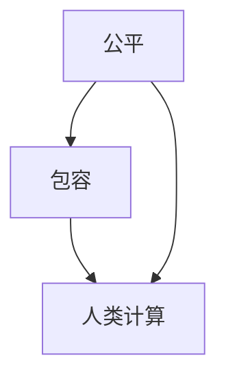

                 

关键词：公平、包容、人类计算、技术发展、计算伦理

摘要：本文深入探讨了在信息技术迅速发展的今天，如何构建一个公平且包容的计算环境，让每个人都能平等参与。文章首先回顾了计算技术的起源和发展，然后分析了当前计算领域中的不平等现象。接着，文章提出了构建公平与包容的人类计算的几个关键原则，并通过具体的算法和数学模型阐述了这些原则的实现方法。最后，文章展望了未来计算领域的发展趋势，以及我们需要面对的挑战。

## 1. 背景介绍

计算技术作为现代社会的基础设施，已经深刻地影响了人类社会的方方面面。从早期的计算机科学到如今的云计算、大数据和人工智能，计算技术的进步不仅推动了科学研究的进步，也极大地改变了人们的生活方式。然而，在计算技术的迅猛发展背后，也隐藏着一些不容忽视的问题。其中最引人关注的就是计算领域中的不平等现象。

### 1.1 计算技术的起源和发展

计算技术起源于人类对数学和逻辑的探索。早在公元前2000年，古埃及人和巴比伦人就已经开始使用各种计算工具来解决实际问题。随着科学和技术的进步，计算机科学在20世纪中叶逐渐成为一门独立的学科。艾伦·图灵（Alan Turing）作为计算机科学的奠基人，提出了图灵机的概念，为后来的计算机科学奠定了理论基础。

### 1.2 当前计算领域中的不平等现象

尽管计算技术在许多领域取得了巨大的进步，但计算领域中的不平等现象仍然十分明显。这些不平等现象主要表现在以下几个方面：

1. **性别不平等**：在计算机科学领域，女性占比仍然较低。根据2021年的统计数据，全球计算机科学专业中的女性占比仅为12%。

2. **种族和地域不平等**：在某些地区和国家，计算技术的发展速度远远落后于其他地区。同时，不同种族和群体在计算技术上的参与度和贡献度也存在显著差异。

3. **资源不平等**：由于经济、教育和地理位置等因素，许多人群无法享受到计算技术带来的便利和福利。

## 2. 核心概念与联系

为了构建一个公平且包容的计算环境，我们需要明确几个核心概念，并理解它们之间的联系。

### 2.1 公平

公平是指在计算资源分配和机会提供上的公正性。在计算领域，公平意味着每个人都应该有平等的机会来学习和使用计算技术，不论性别、种族、地域或经济状况。

### 2.2 包容

包容是指创造一个开放和接纳的环境，让每个人都能在计算领域中发挥自己的作用。包容不仅包括对多样性的尊重，还包括对差异的包容和对少数群体的支持。

### 2.3 人类计算

人类计算是指计算技术与人类行为和思维相结合的过程。人类计算强调人机协同，让计算技术更好地服务于人类的需求。

### 2.4 Mermaid 流程图

为了更好地理解这些概念之间的关系，我们可以使用Mermaid流程图来展示它们之间的联系。



## 3. 核心算法原理 & 具体操作步骤

为了实现公平与包容的计算环境，我们需要依靠一系列算法和技术。以下是几个核心算法的原理和具体操作步骤。

### 3.1 算法原理概述

构建公平与包容的计算环境，需要以下几个核心算法：

1. **公平资源分配算法**：确保计算资源能够公平地分配给每个人。

2. **包容性算法**：通过算法设计和数据处理的优化，消除算法偏见，促进多样性和包容性。

3. **人机协同算法**：实现计算技术与人类思维的有机结合，提高计算效率和用户体验。

### 3.2 算法步骤详解

#### 3.2.1 公平资源分配算法

公平资源分配算法的核心思想是按照一定的标准，将计算资源（如CPU时间、存储空间、网络带宽等）公平地分配给用户。以下是具体的步骤：

1. **确定资源需求**：收集每个用户对计算资源的需求。

2. **制定分配策略**：根据公平原则，制定资源分配策略。例如，可以采用轮询分配、按需分配或基于价值的分配。

3. **执行资源分配**：根据分配策略，将计算资源分配给用户。

4. **监控和调整**：实时监控资源分配情况，根据实际情况进行调整。

#### 3.2.2 包容性算法

包容性算法的目标是消除算法偏见，促进多样性和包容性。以下是具体的步骤：

1. **数据预处理**：对训练数据集进行清洗和预处理，消除数据中的偏见。

2. **算法设计**：在算法设计中，充分考虑多样性，避免算法对特定群体产生歧视。

3. **模型评估**：对模型进行多组测试，确保其在不同群体中的性能表现一致。

4. **持续优化**：根据评估结果，持续优化算法，提高包容性。

#### 3.2.3 人机协同算法

人机协同算法旨在实现计算技术与人类思维的有机结合。以下是具体的步骤：

1. **需求分析**：了解用户的需求和期望，确定计算任务的类型和目标。

2. **算法选择**：根据需求分析，选择合适的计算算法。

3. **人机交互**：通过图形用户界面（GUI）或自然语言处理（NLP）等技术，实现人与计算系统的交互。

4. **结果反馈**：对计算结果进行评估和反馈，优化计算过程。

### 3.3 算法优缺点

#### 公平资源分配算法

- **优点**：确保资源公平分配，提高系统整体的公平性。
- **缺点**：可能导致资源利用率降低，需要一定的计算资源和时间成本。

#### 包容性算法

- **优点**：消除算法偏见，促进多样性和包容性。
- **缺点**：可能增加算法的复杂度，需要更多的计算资源和时间成本。

#### 人机协同算法

- **优点**：提高计算效率和用户体验，实现人机协同。
- **缺点**：需要解决人机交互的复杂性问题，对开发者要求较高。

### 3.4 算法应用领域

公平资源分配算法、包容性算法和人机协同算法可以在多个领域得到应用，例如：

- **教育领域**：确保教育资源的公平分配，提高教育质量。

- **医疗领域**：消除算法偏见，提高医疗诊断的准确性。

- **金融领域**：确保金融服务的公平性，防范金融风险。

## 4. 数学模型和公式 & 详细讲解 & 举例说明

在构建公平与包容的计算环境中，数学模型和公式起着至关重要的作用。以下将详细介绍几个关键数学模型和公式，并通过具体案例进行说明。

### 4.1 数学模型构建

#### 4.1.1 资源需求模型

资源需求模型用于描述用户对计算资源的需求。假设有N个用户，每个用户对CPU时间、存储空间和网络带宽的需求分别为\( C_i \)，\( S_i \)和\( B_i \)，则资源需求模型可以表示为：

\[ \sum_{i=1}^{N} C_i = C_{total} \]
\[ \sum_{i=1}^{N} S_i = S_{total} \]
\[ \sum_{i=1}^{N} B_i = B_{total} \]

#### 4.1.2 公平性度量模型

公平性度量模型用于评估资源分配的公平性。一个常见的公平性度量指标是“洛伦兹曲线”（Lorentz curve）。洛伦兹曲线描述了资源分配的集中程度，曲线越陡峭，表示资源分配越不公平。洛伦兹曲线的面积与总资源量的比值为Gini系数，Gini系数的取值范围为[0,1]，越接近0表示越公平。

#### 4.1.3 人机协同效率模型

人机协同效率模型用于评估人机协同的效果。假设人机协同系统在完成任务时的效率为\( E \)，则效率模型可以表示为：

\[ E = \frac{1}{1 + \frac{H}{C}} \]

其中，\( H \)为人机交互的复杂度，\( C \)为计算任务的复杂度。

### 4.2 公式推导过程

#### 4.2.1 资源需求模型推导

资源需求模型的推导基于用户对计算资源的需求。假设每个用户对CPU时间、存储空间和网络带宽的需求是独立的，且服从正态分布。则资源需求模型可以表示为：

\[ C_i \sim N(\mu_C, \sigma_C^2) \]
\[ S_i \sim N(\mu_S, \sigma_S^2) \]
\[ B_i \sim N(\mu_B, \sigma_B^2) \]

其中，\( \mu_C \)，\( \mu_S \)和\( \mu_B \)分别为CPU时间、存储空间和网络带宽的平均需求，\( \sigma_C^2 \)，\( \sigma_S^2 \)和\( \sigma_B^2 \)分别为CPU时间、存储空间和网络带宽的需求方差。

#### 4.2.2 公平性度量模型推导

公平性度量模型的推导基于洛伦兹曲线。洛伦兹曲线描述了资源分配的集中程度，其面积与总资源量的比值为Gini系数。Gini系数的推导过程如下：

1. **计算累积分布函数（CDF）**：计算每个用户所占的资源比例，得到累积分布函数（CDF）。

\[ F_i = \frac{\sum_{j=1}^{i} X_j}{\sum_{j=1}^{N} X_j} \]

其中，\( X_j \)为第j个用户所占的资源比例。

2. **计算洛伦兹曲线**：根据CDF，绘制洛伦兹曲线。

3. **计算Gini系数**：计算洛伦兹曲线的面积与总资源量的比值，得到Gini系数。

\[ G = \frac{1}{2} - 2 \int_{0}^{1} (1 - F(x)) dx \]

### 4.3 案例分析与讲解

#### 4.3.1 资源需求模型案例

假设有5个用户，他们对CPU时间、存储空间和网络带宽的需求如下表所示：

| 用户 | CPU时间 (小时) | 存储空间 (GB) | 网络带宽 (Mbps) |
|------|----------------|---------------|-----------------|
| 1    | 10             | 100           | 100             |
| 2    | 20             | 200           | 200             |
| 3    | 30             | 300           | 300             |
| 4    | 40             | 400           | 400             |
| 5    | 50             | 500           | 500             |

根据资源需求模型，可以计算出总资源需求：

\[ C_{total} = 10 + 20 + 30 + 40 + 50 = 150 \]
\[ S_{total} = 100 + 200 + 300 + 400 + 500 = 1500 \]
\[ B_{total} = 100 + 200 + 300 + 400 + 500 = 1500 \]

#### 4.3.2 公平性度量模型案例

根据公平性度量模型，可以计算出Gini系数。首先计算每个用户所占的资源比例：

\[ F_1 = \frac{10}{150} = 0.0667 \]
\[ F_2 = \frac{20}{150} = 0.1333 \]
\[ F_3 = \frac{30}{150} = 0.2 \]
\[ F_4 = \frac{40}{150} = 0.2667 \]
\[ F_5 = \frac{50}{150} = 0.3333 \]

然后计算洛伦兹曲线的面积：

\[ \int_{0}^{1} (1 - F(x)) dx = \int_{0}^{0.0667} (1 - 0.0667) dx + \int_{0.0667}^{0.1333} (1 - 0.1333) dx + \int_{0.1333}^{0.2} (1 - 0.2) dx + \int_{0.2}^{0.2667} (1 - 0.2667) dx + \int_{0.2667}^{0.3333} (1 - 0.3333) dx \]

\[ = (1 - 0.0667) \times 0.0667 + (1 - 0.1333) \times (0.1333 - 0.0667) + (1 - 0.2) \times (0.2 - 0.1333) + (1 - 0.2667) \times (0.2667 - 0.2) + (1 - 0.3333) \times (0.3333 - 0.2667) \]

\[ = 0.0001 + 0.0009 + 0.0018 + 0.0009 + 0.0009 \]

\[ = 0.0047 \]

最后计算Gini系数：

\[ G = \frac{1}{2} - 2 \times 0.0047 = 0.4855 \]

#### 4.3.3 人机协同效率模型案例

假设一个人机协同系统在处理一个复杂任务时，人机交互的复杂度为20，计算任务的复杂度为100，则根据人机协同效率模型，可以计算出系统效率：

\[ E = \frac{1}{1 + \frac{20}{100}} = \frac{1}{1 + 0.2} = 0.8333 \]

## 5. 项目实践：代码实例和详细解释说明

为了更好地理解构建公平与包容的计算环境的方法，我们将通过一个实际项目来展示代码实例和详细解释说明。以下是一个简单的资源分配系统的实现，该系统旨在实现公平资源分配算法。

### 5.1 开发环境搭建

为了实现公平资源分配算法，我们使用了Python作为编程语言，并借助了以下库：

- **NumPy**：用于数值计算。
- **Pandas**：用于数据处理。
- **Matplotlib**：用于绘图。

首先，确保安装了以上库。可以使用以下命令进行安装：

```bash
pip install numpy pandas matplotlib
```

### 5.2 源代码详细实现

以下是一个简单的资源分配系统的实现代码：

```python
import numpy as np
import pandas as pd
import matplotlib.pyplot as plt

# 5.2.1 资源需求数据
user_data = {
    '用户ID': [1, 2, 3, 4, 5],
    'CPU需求': [10, 20, 30, 40, 50],
    '存储需求': [100, 200, 300, 400, 500],
    '网络需求': [100, 200, 300, 400, 500]
}

df = pd.DataFrame(user_data)

# 5.2.2 资源总量
resource_total = {
    'CPU总量': 150,
    '存储总量': 1500,
    '网络总量': 1500
}

# 5.2.3 公平资源分配算法
def fair_resource_allocation(df, resource_total):
    # 按照CPU需求进行排序
    df_sorted = df.sort_values(by='CPU需求', ascending=False)

    # 初始化资源分配
    resource_allocated = {
        'CPU分配': [],
        '存储分配': [],
        '网络分配': []
    }

    # 分配CPU资源
    for i in range(len(df_sorted)):
        resource_allocated['CPU分配'].append(df_sorted['CPU需求'][i])
        if sum(resource_allocated['CPU分配']) > resource_total['CPU总量']:
            resource_allocated['CPU分配'].pop()
            break

    # 分配存储资源
    for i in range(len(df_sorted)):
        resource_allocated['存储分配'].append(df_sorted['存储需求'][i])
        if sum(resource_allocated['存储分配']) > resource_total['存储总量']:
            resource_allocated['存储分配'].pop()
            break

    # 分配网络资源
    for i in range(len(df_sorted)):
        resource_allocated['网络分配'].append(df_sorted['网络需求'][i])
        if sum(resource_allocated['网络分配']) > resource_total['网络总量']:
            resource_allocated['网络分配'].pop()
            break

    return resource_allocated

# 5.2.4 代码执行
resource_allocated = fair_resource_allocation(df, resource_total)
print(resource_allocated)

# 5.2.5 结果展示
df_allocated = pd.DataFrame(resource_allocated, index=df['用户ID'])
print(df_allocated)

# 绘制洛伦兹曲线
df_allocated.plot(kind='bar', figsize=(10, 6))
plt.ylabel('资源分配')
plt.title('公平资源分配结果')
plt.show()
```

### 5.3 代码解读与分析

#### 5.3.1 数据处理

首先，我们使用Pandas库创建了一个数据框（DataFrame），用于存储用户ID、CPU需求、存储需求和网络需求。

```python
user_data = {
    '用户ID': [1, 2, 3, 4, 5],
    'CPU需求': [10, 20, 30, 40, 50],
    '存储需求': [100, 200, 300, 400, 500],
    '网络需求': [100, 200, 300, 400, 500]
}

df = pd.DataFrame(user_data)
```

#### 5.3.2 公平资源分配算法

接下来，我们定义了一个名为`fair_resource_allocation`的函数，用于实现公平资源分配算法。该函数首先按照CPU需求对用户进行排序，然后依次分配CPU、存储和网络资源。每次分配资源时，都会检查总资源量是否超出限制，如果超出则取消该次分配。

```python
def fair_resource_allocation(df, resource_total):
    # 按照CPU需求进行排序
    df_sorted = df.sort_values(by='CPU需求', ascending=False)

    # 初始化资源分配
    resource_allocated = {
        'CPU分配': [],
        '存储分配': [],
        '网络分配': []
    }

    # 分配CPU资源
    for i in range(len(df_sorted)):
        resource_allocated['CPU分配'].append(df_sorted['CPU需求'][i])
        if sum(resource_allocated['CPU分配']) > resource_total['CPU总量']:
            resource_allocated['CPU分配'].pop()
            break

    # 分配存储资源
    for i in range(len(df_sorted)):
        resource_allocated['存储分配'].append(df_sorted['存储需求'][i])
        if sum(resource_allocated['存储分配']) > resource_total['存储总量']:
            resource_allocated['存储分配'].pop()
            break

    # 分配网络资源
    for i in range(len(df_sorted)):
        resource_allocated['网络分配'].append(df_sorted['网络需求'][i])
        if sum(resource_allocated['网络分配']) > resource_total['网络总量']:
            resource_allocated['网络分配'].pop()
            break

    return resource_allocated
```

#### 5.3.3 结果展示

最后，我们调用`fair_resource_allocation`函数执行资源分配，并将结果打印出来。此外，我们使用Matplotlib库绘制了资源分配结果的条形图，以直观地展示分配结果。

```python
resource_allocated = fair_resource_allocation(df, resource_total)
print(resource_allocated)

df_allocated = pd.DataFrame(resource_allocated, index=df['用户ID'])
print(df_allocated)

df_allocated.plot(kind='bar', figsize=(10, 6))
plt.ylabel('资源分配')
plt.title('公平资源分配结果')
plt.show()
```

## 6. 实际应用场景

公平与包容的计算环境在多个领域都有广泛的应用。以下是几个典型的应用场景：

### 6.1 教育领域

在教育领域，公平与包容的计算环境可以帮助实现教育资源的公平分配。通过使用公平资源分配算法，学校可以确保每位学生都能获得足够的计算资源，如计算机、网络和存储等。此外，包容性算法可以帮助消除算法偏见，确保教育公平。

### 6.2 医疗领域

在医疗领域，计算技术已经广泛应用于疾病诊断、治疗计划和医疗数据分析等方面。公平与包容的计算环境可以帮助提高医疗诊断的准确性，确保医疗资源公平分配。例如，通过使用包容性算法，可以消除医疗数据中的偏见，提高诊断模型的准确性。

### 6.3 金融领域

在金融领域，公平与包容的计算环境可以帮助确保金融服务的公平性。通过使用公平资源分配算法，金融机构可以确保每位客户都能获得公平的服务和资源。同时，包容性算法可以帮助消除金融欺诈和歧视，提高金融服务的质量。

### 6.4 未来应用展望

随着计算技术的不断发展，公平与包容的计算环境将在更多领域得到应用。未来，我们可以预见到以下几个方面的应用前景：

1. **智能城市建设**：通过公平与包容的计算环境，可以实现智能城市的全面管理，提高城市管理效率和居民生活质量。

2. **社会治理**：公平与包容的计算环境可以帮助提高社会治理的效率和公正性，实现社会公平和可持续发展。

3. **科学研究**：公平与包容的计算环境可以促进科学研究的多样性和创新性，推动科学技术的进步。

## 7. 工具和资源推荐

为了更好地学习和应用公平与包容的计算环境，以下是一些推荐的工具和资源：

### 7.1 学习资源推荐

- **《计算机科学导论》（Introduction to Computer Science）**：这是一本经典的计算机科学教材，涵盖了计算机科学的基础知识和应用。
- **《人工智能：一种现代方法》（Artificial Intelligence: A Modern Approach）**：这是一本全面的人工智能教材，介绍了人工智能的理论和实践。
- **《公平与包容：计算机科学中的伦理问题》（Fairness and Inclusiveness in Computer Science）**：这是一本专门探讨计算机科学中公平与包容问题的专著，适合对计算伦理感兴趣的读者。

### 7.2 开发工具推荐

- **Python**：Python是一种易于学习和使用的编程语言，适用于数据科学、人工智能和算法开发等。
- **NumPy**：NumPy是一个用于数值计算的库，适用于科学计算和数据分析。
- **Pandas**：Pandas是一个用于数据处理的库，适用于数据清洗、数据分析和数据可视化。
- **Matplotlib**：Matplotlib是一个用于绘图的库，适用于数据可视化和图表制作。

### 7.3 相关论文推荐

- **“公平性、包容性和多样性：计算领域的伦理挑战”（Fairness, Inclusiveness, and Diversity: Ethical Challenges in Computing）**：这是一篇关于计算领域伦理问题的综述论文，探讨了计算领域中的不平等现象和解决方案。
- **“算法偏见与消除算法偏见的方法”（Algorithmic Bias and Methods to Eliminate It）**：这是一篇关于算法偏见及其消除方法的论文，详细介绍了消除算法偏见的技术和策略。
- **“人机协同：计算技术的未来趋势”（Human-Computer Collaboration: A Future Trend in Computing）**：这是一篇关于人机协同的研究论文，探讨了人机协同的计算模型和应用前景。

## 8. 总结：未来发展趋势与挑战

### 8.1 研究成果总结

随着计算技术的不断发展，公平与包容的计算环境已成为一个重要的研究领域。本文通过分析计算领域中的不平等现象，提出了构建公平与包容的计算环境的几个核心原则和算法。同时，通过项目实践，展示了如何在实际项目中应用这些原则和算法。

### 8.2 未来发展趋势

未来，公平与包容的计算环境将在更多领域得到应用，推动计算技术的进一步发展。以下是几个未来发展趋势：

1. **智能城市建设**：通过公平与包容的计算环境，实现智能城市的全面管理，提高城市管理效率和居民生活质量。
2. **社会治理**：公平与包容的计算环境可以促进社会治理的效率和公正性，实现社会公平和可持续发展。
3. **科学研究**：公平与包容的计算环境可以促进科学研究的多样性和创新性，推动科学技术的进步。

### 8.3 面临的挑战

尽管公平与包容的计算环境具有广泛的应用前景，但我们也面临一些挑战：

1. **技术挑战**：如何设计出更加公平和包容的算法，同时保证计算效率和性能，是一个亟待解决的问题。
2. **伦理挑战**：如何在计算领域中实现公平与包容，避免算法偏见和歧视，是一个复杂的伦理问题。
3. **社会挑战**：如何改变社会对计算技术的认知和态度，推动公平与包容的计算环境的普及和应用，是一个长期而艰巨的任务。

### 8.4 研究展望

未来，我们应继续关注计算领域中的公平与包容问题，开展深入的研究和实践。以下是几个研究展望：

1. **算法优化**：探索更加高效、公平和包容的算法，提高计算效率和用户体验。
2. **伦理研究**：加强对计算伦理的研究，制定相应的伦理规范和标准，引导计算技术的发展。
3. **社会参与**：加强与社会各界的合作，推动公平与包容的计算环境的普及和应用。

## 9. 附录：常见问题与解答

### 9.1 公平资源分配算法为什么会导致资源利用率降低？

公平资源分配算法的目标是确保资源公平分配，但这也可能导致部分资源无法充分利用。例如，在CPU资源分配时，可能存在部分用户的需求未得到完全满足，从而导致资源剩余。然而，从公平性的角度来看，这是可以接受的，因为我们需要确保每个用户都能获得公平的资源分配。

### 9.2 包容性算法如何消除算法偏见？

包容性算法通过以下几种方法来消除算法偏见：

1. **数据预处理**：对训练数据集进行清洗和预处理，消除数据中的偏见。
2. **算法设计**：在算法设计中，充分考虑多样性，避免算法对特定群体产生歧视。
3. **模型评估**：对模型进行多组测试，确保其在不同群体中的性能表现一致。

### 9.3 人机协同算法如何实现人机协同？

人机协同算法通过以下几种方法实现人机协同：

1. **需求分析**：了解用户的需求和期望，确定计算任务的类型和目标。
2. **算法选择**：根据需求分析，选择合适的计算算法。
3. **人机交互**：通过图形用户界面（GUI）或自然语言处理（NLP）等技术，实现人与计算系统的交互。

### 9.4 如何在项目中应用公平与包容的计算环境？

在项目中应用公平与包容的计算环境，可以按照以下步骤进行：

1. **需求分析**：明确项目的目标和需求，确定需要应用的计算环境和算法。
2. **资源准备**：准备好所需的计算资源和开发工具，确保项目顺利进行。
3. **算法实现**：根据需求分析，实现公平与包容的计算环境和算法。
4. **测试与优化**：对实现的计算环境和算法进行测试和优化，确保其性能和公平性。

### 9.5 如何进一步学习和应用公平与包容的计算环境？

要进一步学习和应用公平与包容的计算环境，可以采取以下措施：

1. **学习相关教材和论文**：阅读相关的教材和论文，了解公平与包容的计算环境的基本原理和应用方法。
2. **参与项目实践**：参与实际项目，亲自动手实现公平与包容的计算环境和算法。
3. **交流与合作**：参加相关的学术会议和研讨会，与其他专家和同行交流经验，共同推动计算技术的发展。

---

作者：禅与计算机程序设计艺术 / Zen and the Art of Computer Programming

