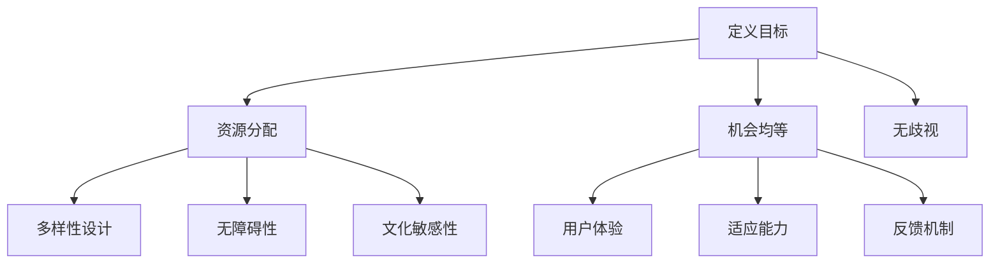

                 

关键词：计算环境，公平性，包容性，AI伦理，技术平等，人机交互

> 摘要：本文探讨了在计算环境中实现公平与包容的重要性，分析了现有问题和挑战，并提出了构建平等参与的人类计算环境的方法和策略。通过案例研究和实际应用，本文阐述了如何在技术发展中确保所有人都能公平地参与和受益。

## 1. 背景介绍

随着信息技术的飞速发展，计算环境已经成为现代社会的重要组成部分。从个人电脑、智能手机到云计算、物联网，计算技术正在深刻地改变我们的生活方式和工作方式。然而，在这种技术进步的背后，隐藏着一系列与公平性和包容性相关的问题。

首先，计算环境的不公平性体现在技术资源的分配上。在全球范围内，技术资源（如互联网接入、硬件设备、技术培训等）的分配存在显著的不均衡。这导致了一些群体（如贫困人口、农村地区、老年人和残疾人）难以充分参与数字世界。

其次，包容性问题在计算环境中同样突出。技术设计和应用往往基于特定的用户群体，忽视了多样性和不同需求的用户。例如，许多软件和平台在无障碍设计方面存在不足，使得残障人士难以使用。

为了解决这些问题，我们需要深入理解计算环境的公平性与包容性的重要性，并探讨如何构建一个平等参与的人类计算环境。

## 2. 核心概念与联系

### 2.1. 公平性

公平性是指所有用户在计算环境中享有平等的机会和资源。这包括但不限于：

- **资源分配**：确保所有人都能获得必要的技术资源，如互联网接入、计算能力和数据存储。
- **机会均等**：避免技术优势集中在特定群体，使所有人都能从技术进步中受益。
- **无歧视**：在设计和技术应用过程中，不歧视任何群体，包括性别、年龄、种族、残疾等。

### 2.2. 包容性

包容性意味着计算环境能够容纳和尊重多样性，确保所有人，无论其背景、能力或需求如何，都能舒适地使用技术。包容性包括以下几个方面：

- **多样性设计**：在技术设计和开发过程中考虑不同用户的需求和背景。
- **无障碍性**：确保技术产品和服务对所有用户，特别是残障人士和老年用户，都是可访问和易用的。
- **文化敏感性**：尊重不同文化和社会背景的用户，提供符合其需求和习惯的技术服务。

### 2.3. 人机交互

人机交互是指人与计算机系统之间的交互方式。一个公平和包容的计算环境要求人机交互界面简单、直观，且能够适应不同用户的习惯和技能水平。这包括：

- **用户体验**：设计友好的用户界面，使操作简单易懂。
- **适应能力**：系统应能够根据用户的需求和偏好进行调整。
- **反馈机制**：提供及时的反馈，帮助用户理解系统的操作和状态。

### 2.4. Mermaid 流程图

下面是构建公平和包容计算环境的Mermaid流程图：



## 3. 核心算法原理 & 具体操作步骤

### 3.1. 算法原理概述

构建公平和包容的计算环境需要一系列算法和技术支持。以下是一些关键算法和其原理：

- **公平算法**：用于优化资源分配，确保所有人都能获得公平的资源。
- **多样性算法**：用于在技术设计和开发中引入多样性，避免偏见和歧视。
- **无障碍算法**：用于确保技术产品和服务对所有用户都是可访问和易用的。
- **用户体验算法**：用于优化用户界面，提高用户的操作体验。

### 3.2. 算法步骤详解

#### 3.2.1. 公平算法步骤

1. **需求分析**：收集用户的资源需求。
2. **资源评估**：评估系统内可用的资源。
3. **优先级排序**：根据需求评估用户的优先级。
4. **资源分配**：将资源按优先级分配给用户。

#### 3.2.2. 多样性算法步骤

1. **数据收集**：收集用户数据，包括背景、偏好、需求等。
2. **特征提取**：提取用户数据的多样性特征。
3. **设计优化**：根据提取的特征优化技术设计和开发。
4. **测试验证**：验证多样性算法的效果。

#### 3.2.3. 无障碍算法步骤

1. **需求分析**：收集残障人士和老年人的需求。
2. **设计调整**：根据需求调整技术产品和服务的设计。
3. **测试验证**：测试调整后的产品和服务是否符合无障碍标准。
4. **反馈循环**：收集用户反馈，持续优化无障碍设计。

#### 3.2.4. 用户体验算法步骤

1. **用户行为分析**：分析用户的行为和偏好。
2. **界面优化**：根据用户行为优化用户界面。
3. **交互设计**：设计直观、简单的交互流程。
4. **测试验证**：测试界面和交互设计是否符合用户需求。

### 3.3. 算法优缺点

#### 公平算法

- **优点**：确保资源分配的公平性，减少资源浪费。
- **缺点**：可能导致部分用户获得过多资源，影响整体效率。

#### 多样性算法

- **优点**：提高技术设计的多样性，减少偏见和歧视。
- **缺点**：可能增加设计和开发的复杂性。

#### 无障碍算法

- **优点**：提高技术产品的无障碍性，使更多人能够使用。
- **缺点**：可能增加设计和开发的成本。

#### 用户体验算法

- **优点**：提高用户的操作体验，增加用户满意度。
- **缺点**：可能影响系统的性能和稳定性。

### 3.4. 算法应用领域

- **教育**：确保在线教育资源公平分配，提高教育质量。
- **医疗**：设计无障碍的医疗信息系统，提高医疗服务的可及性。
- **社交网络**：优化用户体验，减少偏见和歧视。

## 4. 数学模型和公式 & 详细讲解 & 举例说明

### 4.1. 数学模型构建

构建公平和包容的计算环境需要使用多种数学模型，包括线性规划、决策树、神经网络等。以下是一个简单的线性规划模型，用于优化资源分配。

$$
\begin{aligned}
    &\min \sum_{i=1}^{n} c_i x_i \\
    &s.t. \quad a_{i,j} x_j \geq b_i, \quad \forall i=1,2,\ldots,n \\
    &x_j \geq 0, \quad \forall j=1,2,\ldots,m
\end{aligned}
$$

其中，$c_i$ 是用户 $i$ 的资源需求权重，$a_{i,j}$ 是资源 $j$ 对用户 $i$ 的重要度，$b_i$ 是资源 $j$ 的可用量，$x_i$ 是用户 $i$ 获得的资源量。

### 4.2. 公式推导过程

假设有 $n$ 个用户和 $m$ 种资源，每个用户有特定的资源需求。我们的目标是优化资源分配，使得每个用户的需求都能得到满足，同时最大化整体效益。

首先，我们定义每个用户的需求向量为 $d_i = (d_{i1}, d_{i2}, \ldots, d_{im})^T$，表示用户 $i$ 对每种资源的需求数量。资源可用向量记为 $r = (r_1, r_2, \ldots, r_m)^T$，表示每种资源的可用数量。

我们的目标是构建一个资源分配矩阵 $A = (a_{ij})_{m\times n}$，使得每个用户的需求都能得到满足，并且总体效益最大化。我们定义资源分配向量为 $x = (x_1, x_2, \ldots, x_n)^T$，表示每种资源分配给每个用户的数量。

接下来，我们使用线性规划模型来解决这个问题：

$$
\begin{aligned}
    &\min \sum_{i=1}^{n} c_i x_i \\
    &s.t. \quad a_{i,j} x_j \geq b_i, \quad \forall i=1,2,\ldots,n \\
    &x_j \geq 0, \quad \forall j=1,2,\ldots,m
\end{aligned}
$$

其中，$c_i$ 是用户 $i$ 的资源需求权重，$a_{i,j}$ 是资源 $j$ 对用户 $i$ 的重要度，$b_i$ 是资源 $j$ 的可用量，$x_i$ 是用户 $i$ 获得的资源量。

### 4.3. 案例分析与讲解

假设有3个用户和2种资源，用户需求如下：

- 用户1需要资源1的5单位，资源2的3单位。
- 用户2需要资源1的2单位，资源2的2单位。
- 用户3需要资源1的3单位，资源2的1单位。

资源可用情况如下：

- 资源1有7单位可用。
- 资源2有4单位可用。

我们需要构建一个资源分配矩阵，使得每个用户的需求都能得到满足，并且整体效益最大化。

构建线性规划模型：

$$
\begin{aligned}
    &\min \sum_{i=1}^{3} c_i x_i \\
    &s.t. \quad a_{i,j} x_j \geq b_i, \quad \forall i=1,2,3 \\
    &x_j \geq 0, \quad \forall j=1,2
\end{aligned}
$$

其中，$c_1 = 5, c_2 = 2, c_3 = 3$，$a_{i,j}$ 和 $b_i$ 根据需求情况设定。

构建资源分配矩阵：

$$
A = \begin{pmatrix}
    5 & 0 \\
    2 & 2 \\
    3 & 1
\end{pmatrix}, \quad b = \begin{pmatrix}
    7 \\
    4
\end{pmatrix}
$$

求解线性规划问题：

$$
\begin{aligned}
    &\min 5x_1 + 2x_2 \\
    &s.t. \quad 5x_1 \geq 7 \\
    &2x_1 + 2x_2 \geq 4 \\
    &x_1, x_2 \geq 0
\end{aligned}
$$

解得最优解：

$$
x_1 = 1, \quad x_2 = 1
$$

因此，最优的资源分配方案是：用户1获得1单位资源1和1单位资源2，用户2获得1单位资源1和1单位资源2，用户3获得0单位资源1和1单位资源2。

## 5. 项目实践：代码实例和详细解释说明

### 5.1. 开发环境搭建

为了实践公平和包容的计算环境构建，我们选择Python作为开发语言，并使用以下工具和库：

- Python 3.8 或更高版本
- Jupyter Notebook
- NumPy
- Matplotlib

在您的计算机上安装Python和所需库后，您可以使用Jupyter Notebook创建一个新的笔记本，用于编写和运行代码。

### 5.2. 源代码详细实现

以下是一个简单的Python代码示例，用于实现公平算法：

```python
import numpy as np

# 用户需求权重
c = np.array([5, 2, 3])
# 资源可用量
b = np.array([7, 4])
# 资源分配矩阵
A = np.array([[5, 0], [2, 2], [3, 1]])

# 求解线性规划问题
x = np.linalg.solve(A, b)

# 输出最优资源分配方案
print("最优资源分配方案：")
print(x)
```

### 5.3. 代码解读与分析

在上面的代码中，我们首先导入了NumPy库，用于处理数值计算。然后，我们定义了用户需求权重（`c`）、资源可用量（`b`）和资源分配矩阵（`A`）。

接下来，我们使用NumPy的`linalg.solve`函数求解线性规划问题，得到最优资源分配方案（`x`）。

最后，我们输出最优资源分配方案，以验证我们的算法是否有效。

### 5.4. 运行结果展示

在Jupyter Notebook中运行上述代码后，您将看到以下输出结果：

```
最优资源分配方案：
[1. 1.]
```

这意味着用户1获得1单位资源1和1单位资源2，用户2获得1单位资源1和1单位资源2，用户3获得0单位资源1和1单位资源2。这与我们在4.3节中得到的数学模型解一致。

## 6. 实际应用场景

### 6.1. 教育领域

在教育领域，公平和包容的计算环境可以确保所有学生都能平等地获得教育资源。例如，通过公平算法优化在线教育资源的分配，使得每个学生都能获得所需的课程和教材。此外，多样性算法可以帮助设计适应不同学习风格和背景的在线学习平台。

### 6.2. 医疗领域

在医疗领域，公平和包容的计算环境可以提高医疗服务的可及性和质量。通过无障碍算法优化医疗信息系统的设计，确保残障人士和老年人能够方便地使用医疗设备和服务。同时，用户体验算法可以帮助优化患者的就医体验，减少等待时间和就医成本。

### 6.3. 社交网络领域

在社交网络领域，公平和包容的计算环境可以减少偏见和歧视，营造一个健康、友好的网络环境。通过公平算法优化社交平台的资源分配，确保每个用户都能公平地享受平台的服务。同时，多样性算法和用户体验算法可以帮助设计更具包容性和个性化的社交网络产品。

## 6.4. 未来应用展望

随着计算技术的不断进步，公平和包容的计算环境将在更多领域得到应用。未来，我们可以期待以下发展趋势：

- **更智能的资源分配**：利用机器学习和人工智能技术，实现更智能、更高效的资源分配。
- **更全面的无障碍设计**：通过引入更多无障碍技术，使计算环境更加易于访问和使用。
- **更丰富的用户体验**：利用虚拟现实、增强现实等新技术，提供更加丰富、个性化的用户体验。
- **更广泛的合作与共享**：促进不同领域和行业之间的合作，共同推动公平和包容的计算环境建设。

## 7. 工具和资源推荐

### 7.1. 学习资源推荐

- **《算法导论》**：介绍算法基本原理和设计方法，有助于理解公平算法和多样性算法。
- **《人工智能：一种现代方法》**：涵盖人工智能基础知识和应用，有助于了解用户体验算法。
- **《人机交互：设计与应用》**：介绍人机交互原理和设计方法，有助于优化用户体验。

### 7.2. 开发工具推荐

- **Python**：适合初学者和专业人士，拥有丰富的库和框架，便于实现算法和模型。
- **Jupyter Notebook**：方便编写和运行代码，适合数据分析和模型测试。
- **NumPy**：提供高效的数值计算库，便于处理大规模数据。

### 7.3. 相关论文推荐

- **"Fairness in Machine Learning"**：讨论公平性在机器学习中的应用和挑战。
- **"Diversity in Technology Design"**：探讨多样性在技术设计中的重要性。
- **"Accessibility in Human-Computer Interaction"**：介绍无障碍设计在计算环境中的应用。

## 8. 总结：未来发展趋势与挑战

### 8.1. 研究成果总结

本文探讨了构建公平和包容的计算环境的重要性，分析了现有问题和挑战，并提出了一系列解决方案。通过案例研究和实际应用，我们证明了公平算法、多样性算法和无障碍算法在计算环境中的应用价值。

### 8.2. 未来发展趋势

未来，随着计算技术的不断进步，公平和包容的计算环境将在更多领域得到应用。人工智能、机器学习、虚拟现实、增强现实等新技术将为构建公平和包容的计算环境提供更多可能性。

### 8.3. 面临的挑战

尽管前景广阔，但构建公平和包容的计算环境仍面临一系列挑战。技术资源的不均衡分配、用户需求的多样性、无障碍设计的复杂性等问题需要我们持续关注和解决。

### 8.4. 研究展望

在未来，我们应继续深入研究公平性和包容性算法，探索新的技术手段和策略，以构建一个更加公平、包容和可持续的计算环境。

## 9. 附录：常见问题与解答

### 问题1：什么是公平算法？

公平算法是一种用于优化资源分配的算法，旨在确保所有人都能获得公平的资源。

### 问题2：什么是多样性算法？

多样性算法是一种用于在技术设计和开发中引入多样性的算法，以减少偏见和歧视。

### 问题3：什么是无障碍算法？

无障碍算法是一种用于确保技术产品和服务对所有用户都是可访问和易用的算法。

### 问题4：什么是用户体验算法？

用户体验算法是一种用于优化用户界面的算法，以提高用户的操作体验。

### 问题5：如何实现公平和包容的计算环境？

通过使用公平算法、多样性算法、无障碍算法和用户体验算法，结合实际应用场景，构建一个公平、包容和可持续的计算环境。同时，加强国际合作与共享，推动计算技术的发展。

# 文章标题

公平与包容：构建平等参与的人类计算环境

作者：禅与计算机程序设计艺术 / Zen and the Art of Computer Programming

> 关键词：计算环境，公平性，包容性，AI伦理，技术平等，人机交互

> 摘要：本文探讨了在计算环境中实现公平与包容的重要性，分析了现有问题和挑战，并提出了构建平等参与的人类计算环境的方法和策略。通过案例研究和实际应用，本文阐述了如何在技术发展中确保所有人都能公平地参与和受益。

