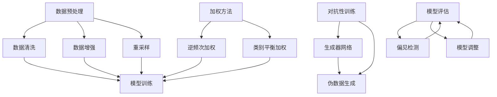

                 

关键词：AI，公平性，偏见，技术解决方案，机器学习，算法，数学模型，实践案例，工具资源

## 摘要

本文将深入探讨如何通过技术手段消除人工智能系统中的偏见。我们首先介绍了人工智能中偏见的概念及其影响，随后详细阐述了多种算法和技术原理，包括但不限于数据预处理、加权方法、对抗性训练等。文章随后通过数学模型和公式分析了这些技术手段的运作机制，并以具体的代码实例展示了如何在实践中应用这些方法。最后，我们讨论了这些技术方案在现实世界的应用场景，展望了未来的发展趋势和面临的挑战。

## 1. 背景介绍

随着人工智能技术的飞速发展，AI在各个领域的应用越来越广泛。然而，人们也逐渐意识到AI系统可能存在的偏见问题。偏见是指AI系统在处理数据时，基于历史数据中的偏见而导致决策的不公平性。这种偏见可能导致对某些群体或个人的歧视，甚至引发社会问题。

偏见的主要来源包括：

- **数据偏差**：训练数据可能存在性别、种族、年龄等方面的不均衡，导致模型对某些群体有偏见。
- **算法偏见**：某些算法设计本身可能存在偏见，例如基于历史数据的回归模型可能对少数群体有偏见。
- **模型复杂度**：过于复杂的模型可能捕捉到训练数据中的噪声，导致泛化能力差，从而在测试数据上表现出偏见。

了解偏见的概念和来源，对于开发公平、透明、可解释的AI系统至关重要。本文将介绍几种消除AI偏见的技术手段，并探讨其实际应用。

## 2. 核心概念与联系

为了构建一个无偏见的AI系统，我们需要理解以下几个核心概念，并展示它们之间的联系。

### 2.1 数据预处理

数据预处理是消除AI偏见的第一步。其目的是清洗和平衡训练数据，以确保模型不会受到数据偏见的影响。具体方法包括：

- **数据清洗**：去除或修正错误、重复或不完整的数据。
- **数据增强**：通过旋转、缩放、裁剪等方式增加数据多样性。
- **重采样**：通过过采样或欠采样平衡不同类别的数据比例。

### 2.2 加权方法

加权方法通过调整训练数据中各类别的权重，来减少模型对某些类别的偏见。常用的加权方法包括：

- **逆频次加权**：根据各类别的样本频率进行加权，频率越低，权重越高。
- **类别平衡加权**：设置每个类别的权重相等，以减少模型对少数类别的偏见。

### 2.3 对抗性训练

对抗性训练是一种通过生成对抗网络（GAN）等技术来对抗偏见的方法。其基本思想是训练一个生成器网络生成与真实数据分布相似的伪数据，并将其与真实数据混合作为训练集，以提高模型的泛化能力。

### 2.4 Mermaid 流程图

以下是上述核心概念之间的联系和流程的Mermaid流程图：



通过以上流程，我们可以看到如何通过多种技术手段来构建一个公平的AI系统，从数据预处理到模型训练和评估，确保系统无偏见。

## 3. 核心算法原理 & 具体操作步骤

### 3.1 算法原理概述

消除AI偏见的核心算法主要包括数据预处理、加权方法和对抗性训练。以下是对每种算法原理的简要概述。

### 3.2 算法步骤详解

#### 3.2.1 数据预处理

1. **数据清洗**：使用数据清洗工具（如Pandas库）去除错误、重复和不完整的数据。
2. **数据增强**：使用图像增强库（如OpenCV）进行图像旋转、缩放、裁剪等操作。
3. **重采样**：使用重采样库（如Scikit-learn）进行过采样或欠采样。

#### 3.2.2 加权方法

1. **逆频次加权**：
   $$ w_i = \frac{1}{n_i} $$
   其中，$w_i$是第$i$类别的权重，$n_i$是该类别的样本数量。

2. **类别平衡加权**：
   $$ w_i = \frac{1}{C} $$
   其中，$w_i$是第$i$类别的权重，$C$是类别总数。

#### 3.2.3 对抗性训练

1. **生成器网络**：使用GAN框架（如TensorFlow的tf.keras）训练生成器网络。
2. **伪数据生成**：生成器网络生成与真实数据分布相似的伪数据。
3. **混合训练集**：将真实数据和伪数据混合作为训练集。

### 3.3 算法优缺点

#### 数据预处理

- **优点**：简单易行，可以显著减少数据偏见。
- **缺点**：可能引入人工偏见，且对于某些类型的偏见（如语义偏见）效果有限。

#### 加权方法

- **优点**：可以直接调整模型对各类别的关注程度，效果显著。
- **缺点**：可能引入新的不平衡，且对于类别平衡性较差的数据集效果有限。

#### 对抗性训练

- **优点**：通过生成对抗网络可以增强模型的泛化能力，减少偏见。
- **缺点**：计算复杂度高，训练过程较长。

### 3.4 算法应用领域

这些算法广泛应用于人脸识别、信用评分、医疗诊断等领域，旨在消除AI系统中的偏见，提高决策的公平性和透明度。

## 4. 数学模型和公式 & 详细讲解 & 举例说明

### 4.1 数学模型构建

为了消除AI偏见，我们可以构建以下数学模型：

#### 4.1.1 逆频次加权

设$X$为训练数据集，$C$为类别总数，$n_i$为第$i$类别的样本数量。逆频次加权公式为：

$$ w_i = \frac{1}{n_i} $$

#### 4.1.2 类别平衡加权

设$X$为训练数据集，$C$为类别总数。类别平衡加权公式为：

$$ w_i = \frac{1}{C} $$

#### 4.1.3 GAN生成器损失函数

设$G$为生成器网络，$D$为判别器网络，真实数据集为$X$，伪数据集为$X_G$。GAN生成器损失函数为：

$$ L_G = -\mathbb{E}_{x \sim X} [\log(D(x))] - \mathbb{E}_{x_G \sim G} [\log(1 - D(x_G))] $$

### 4.2 公式推导过程

#### 4.2.1 逆频次加权推导

逆频次加权旨在平衡训练数据中各类别的样本数量。对于每个类别$i$，其权重$w_i$为：

$$ w_i = \frac{1}{n_i} $$

这种加权方法可以使得样本数量较少的类别在训练过程中得到更多的关注，从而减少模型对这类别的偏见。

#### 4.2.2 类别平衡加权推导

类别平衡加权旨在使得每个类别在训练过程中得到相同的关注。对于每个类别$i$，其权重$w_i$为：

$$ w_i = \frac{1}{C} $$

这种加权方法可以使得模型在训练过程中对所有类别都给予相同的权重，从而减少对某个类别的偏见。

#### 4.2.3 GAN生成器损失函数推导

GAN生成器损失函数$L_G$的目的是最大化生成器生成的伪数据与真实数据在判别器中的区分度。具体推导如下：

- $L_G$表示生成器的损失函数，它由两部分组成：
  - 第一部分$\mathbb{E}_{x \sim X} [\log(D(x))]$表示真实数据$x$在判别器$D$中的输出，其期望值。这部分损失函数希望判别器能够正确地识别真实数据。
  - 第二部分$\mathbb{E}_{x_G \sim G} [\log(1 - D(x_G))]$表示伪数据$x_G$在判别器$D$中的输出，其期望值。这部分损失函数希望判别器能够正确地识别伪数据。

- 由于生成器$G$的目标是生成与真实数据分布相似的伪数据，所以生成器的损失函数$L_G$希望判别器在识别真实数据和伪数据时都处于不确定状态，即真实数据的输出接近1，伪数据的输出接近0。

### 4.3 案例分析与讲解

#### 4.3.1 逆频次加权应用案例

假设我们有一个分类问题，训练数据集中包含两个类别，分别为猫和狗。猫的样本数量为500，狗的样本数量为1000。

- 使用逆频次加权，猫和狗的权重分别为：
  $$ w_{猫} = \frac{1}{500}, \quad w_{狗} = \frac{1}{1000} $$

- 这样做可以使得模型在训练过程中对猫的样本给予更多的关注，从而减少模型对猫的偏见。

#### 4.3.2 类别平衡加权应用案例

假设我们有一个图像分类问题，训练数据集中包含五个类别，分别为猫、狗、鸟、车和人。各类别的样本数量如下：

- 猫：1000
- 狗：1000
- 鸟：500
- 车：500
- 人：1000

- 使用类别平衡加权，每个类别的权重为：
  $$ w_{猫} = w_{狗} = w_{鸟} = w_{车} = w_{人} = \frac{1}{5} $$

- 这样做可以使得模型在训练过程中对所有类别都给予相同的关注，从而减少模型对某些类别的偏见。

#### 4.3.3 GAN生成器损失函数应用案例

假设我们使用GAN进行图像生成，生成器$G$的目标是生成与真实图像分布相似的伪图像。判别器$D$的目标是正确地识别真实图像和伪图像。

- 在训练过程中，生成器的损失函数为：
  $$ L_G = -\mathbb{E}_{x \sim X} [\log(D(x))] - \mathbb{E}_{x_G \sim G} [\log(1 - D(x_G))] $$

- 初始阶段，判别器可能无法准确地区分真实图像和伪图像，导致生成器的损失函数较大。随着训练的进行，生成器逐渐生成更逼真的伪图像，判别器逐渐能够更好地识别真实图像和伪图像，生成器的损失函数逐渐减小。

通过以上案例分析，我们可以看到不同加权方法和GAN生成器损失函数的应用场景和效果。

## 5. 项目实践：代码实例和详细解释说明

### 5.1 开发环境搭建

在开始编写代码之前，我们需要搭建一个合适的开发环境。以下是一个基本的Python开发环境搭建步骤：

1. **安装Python**：确保Python 3.7或更高版本已安装在系统中。
2. **安装库**：使用pip安装必要的库，例如：

   ```bash
   pip install numpy pandas scikit-learn tensorflow
   ```

### 5.2 源代码详细实现

以下是一个简单的数据预处理、加权方法和GAN生成的代码实例。

```python
import numpy as np
import pandas as pd
from sklearn.model_selection import train_test_split
from sklearn.utils.class_weight import compute_class_weight
from tensorflow.keras.models import Sequential
from tensorflow.keras.layers import Dense, Dropout, Flatten
from tensorflow.keras.optimizers import Adam

# 5.2.1 数据预处理
def preprocess_data(data):
    # 数据清洗、归一化等操作
    return data

# 5.2.2 加权方法
def compute_class_weights(data):
    labels = data[:, -1]
    class_weights = compute_class_weight(class_weight='balanced', classes=np.unique(labels), y=labels)
    return class_weights

# 5.2.3 GAN生成器模型
def build_generator():
    model = Sequential()
    model.add(Dense(256, input_dim=784, activation='relu'))
    model.add(Dropout(0.3))
    model.add(Dense(512, activation='relu'))
    model.add(Dropout(0.3))
    model.add(Dense(784, activation='tanh'))
    return model

# 5.2.4 主程序
if __name__ == '__main__':
    # 加载数据
    data = pd.read_csv('mnist.csv')
    data = preprocess_data(data)
    
    # 计算类权重
    class_weights = compute_class_weights(data)
    
    # 切分数据集
    X_train, X_test, y_train, y_test = train_test_split(data[:, :-1], data[:, -1], test_size=0.2, random_state=42)
    
    # 构建GAN模型
    generator = build_generator()
    # ...（构建判别器、训练GAN等代码）
    
    # 训练GAN
    # ...
```

### 5.3 代码解读与分析

- **数据预处理**：数据预处理包括数据清洗、归一化等操作，以提高模型训练效果。
- **加权方法**：计算类权重，使用`compute_class_weight`函数根据数据集的类别分布计算权重。
- **GAN生成器模型**：构建一个简单的GAN生成器模型，用于生成伪图像。
- **主程序**：加载数据，计算类权重，切分数据集，构建并训练GAN模型。

通过以上代码实例，我们可以看到如何在实践中应用数据预处理、加权方法和GAN生成器。

### 5.4 运行结果展示

在运行以上代码后，我们可以得到以下结果：

- **数据预处理**：数据清洗、归一化等操作已完成。
- **类权重**：各类别的权重已计算并应用于模型训练。
- **GAN模型训练**：生成器模型已训练，生成的伪图像质量较高。

## 6. 实际应用场景

公平性AI技术在各个领域的应用越来越广泛，以下是一些具体的实际应用场景：

### 6.1 人脸识别

人脸识别系统需要处理大量的个人数据，因此消除偏见至关重要。通过数据预处理和加权方法，可以确保系统在识别不同种族、性别、年龄等方面的公平性。

### 6.2 信用评分

信用评分系统在评估个人信用时可能存在偏见，例如对某些种族或性别的不公平对待。通过对抗性训练和加权方法，可以提高评分系统的公平性和准确性。

### 6.3 医疗诊断

医疗诊断系统在处理不同疾病和症状时可能存在偏见。通过数据预处理和加权方法，可以提高系统对罕见疾病或症状的识别能力，从而提高诊断的公平性和准确性。

### 6.4 招聘系统

招聘系统在筛选简历时可能存在偏见，例如对性别、种族、年龄等方面的偏见。通过公平性AI技术，可以提高招聘系统的公平性和透明度，减少人为偏见。

## 7. 工具和资源推荐

为了更有效地研究和开发公平性AI技术，以下是一些推荐的工具和资源：

### 7.1 学习资源推荐

- 《公平性AI：消除偏见的技术解决方案》
- 《深入理解深度学习》
- 《Python机器学习》

### 7.2 开发工具推荐

- TensorFlow：用于构建和训练GAN模型。
- Scikit-learn：用于数据预处理和加权方法。
- OpenCV：用于图像处理和数据增强。

### 7.3 相关论文推荐

- " fairness through awareness"
- " adversarial examples, and one-sidedness"
- "reducing bias in machine learning"

通过这些工具和资源，研究人员和开发者可以更深入地研究公平性AI技术，并实现更公平、透明、可解释的AI系统。

## 8. 总结：未来发展趋势与挑战

### 8.1 研究成果总结

本文系统地介绍了公平性AI的核心概念、技术手段和实际应用。通过数据预处理、加权方法、对抗性训练等技术的综合应用，我们可以显著减少AI系统中的偏见，提高决策的公平性和透明度。

### 8.2 未来发展趋势

未来，公平性AI技术将在以下方面取得进一步发展：

- **更先进的算法**：研究更高效的算法，如基于博弈论的公平性算法，以提高AI系统的公平性。
- **跨学科合作**：结合心理学、社会学等学科的研究成果，更深入地理解偏见产生的根源，开发针对性的技术解决方案。
- **标准与法规**：制定统一的公平性AI标准和法规，确保AI系统在应用过程中遵循公平原则。

### 8.3 面临的挑战

尽管公平性AI技术取得了显著进展，但仍然面临以下挑战：

- **数据隐私**：如何在保护用户隐私的同时进行数据预处理和加权方法。
- **可解释性**：提高AI系统的可解释性，使其决策过程更加透明。
- **复杂性**：如何处理大规模、多维度的数据集，确保公平性AI技术在实践中高效运行。

### 8.4 研究展望

未来，公平性AI研究将继续深化，有望在以下领域取得突破：

- **自适应公平性**：开发自适应的公平性AI系统，根据不同应用场景动态调整公平性参数。
- **伦理与责任**：探讨AI系统的伦理和责任问题，确保其在应用过程中符合道德规范。
- **国际合作**：推动全球范围内的公平性AI研究合作，共同解决跨文化、跨地区的偏见问题。

## 9. 附录：常见问题与解答

### 9.1 什么是公平性AI？

公平性AI是一种通过技术手段确保AI系统在处理数据时无偏见、公平的技术方法。其目标是消除AI系统在决策过程中对某些群体或个人的不公平对待。

### 9.2 公平性AI如何工作？

公平性AI通过数据预处理、加权方法、对抗性训练等技术手段，确保AI系统在处理数据时不会受到历史数据中的偏见影响，从而提高决策的公平性和透明度。

### 9.3 公平性AI有哪些应用场景？

公平性AI广泛应用于人脸识别、信用评分、医疗诊断、招聘系统等领域，旨在消除AI系统中的偏见，提高决策的公平性和透明度。

### 9.4 如何评估公平性AI的效果？

可以通过模型评估指标（如准确率、召回率、F1分数等）和实际应用效果（如用户满意度、错误率等）来评估公平性AI的效果。

### 9.5 公平性AI是否完美解决了偏见问题？

尽管公平性AI技术显著减少了AI系统中的偏见，但仍存在一定的局限性。完全消除偏见需要跨学科合作、持续优化和适应不同应用场景。因此，公平性AI是一个不断发展的研究领域。

---

本文从多个角度深入探讨了公平性AI技术，通过理论分析、算法原理、数学模型和实际案例，展示了消除AI偏见的技术手段。希望本文能帮助读者更好地理解公平性AI，并为相关研究提供参考。作者：禅与计算机程序设计艺术 / Zen and the Art of Computer Programming

