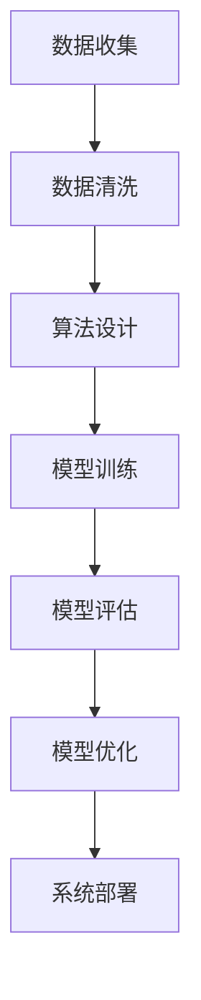

                 

关键词：公平性AI，消除偏见，技术解决方案，算法，数学模型，实际应用，未来展望

## 摘要

本文将探讨公平性AI在消除偏见方面的重要性，并介绍几种具体的技术解决方案。我们将从背景介绍开始，讨论核心概念、算法原理和数学模型，并通过实际应用场景和代码实例来展示这些技术的应用效果。文章还将展望未来发展趋势与挑战，并提供相关工具和资源推荐。

## 1. 背景介绍

随着人工智能（AI）技术的迅猛发展，越来越多的AI系统被应用于各个领域，包括医疗、金融、安全等。然而，这些系统在决策过程中往往受到偏见的影响，导致不公平的结果。偏见不仅可能损害个人的利益，还可能加剧社会的不公平现象。因此，消除AI系统中的偏见已成为一个迫切需要解决的问题。

近年来，研究人员和开发者们提出了许多技术解决方案，旨在通过算法优化、数据清洗、数学模型构建等方法来消除AI系统中的偏见。这些解决方案在一定程度上取得了进展，但仍面临许多挑战。本文将详细介绍这些技术解决方案，并探讨其在实际应用中的效果和局限性。

## 2. 核心概念与联系

### 2.1 核心概念

- **偏见**：偏见是指对某一群体或个体持有不公正、不公平的态度或行为。
- **公平性AI**：公平性AI旨在设计出无偏见、公正的AI系统，使这些系统能够在决策过程中公平对待每个个体。

### 2.2 联系

公平性AI的核心在于消除偏见，这需要从算法、数据和模型等多个层面进行优化。以下是一个简单的 Mermaid 流程图，展示了公平性AI的主要组成部分和联系：



## 3. 核心算法原理 & 具体操作步骤

### 3.1 算法原理概述

公平性AI的核心在于优化算法和模型，以消除偏见。常见的算法优化方法包括：

- **权重调整**：通过调整算法中不同特征的权重，来平衡不同特征对决策结果的影响。
- **公平性度量**：使用公平性度量指标（如敏感性、公平性分数等）来评估算法的公平性，并根据评估结果进行调整。

### 3.2 算法步骤详解

公平性AI的具体操作步骤如下：

1. **数据收集**：收集包含个体特征和标签的数据集。
2. **数据清洗**：清洗数据集中的异常值和噪声，以保证数据质量。
3. **算法设计**：选择合适的算法，并设置权重调整和公平性度量的参数。
4. **模型训练**：使用清洗后的数据集对算法进行训练。
5. **模型评估**：使用评估指标（如准确性、公平性分数等）对模型进行评估。
6. **模型优化**：根据评估结果，调整算法参数，以优化模型的公平性。
7. **系统部署**：将优化后的模型部署到实际应用场景中。

### 3.3 算法优缺点

公平性AI算法的主要优点如下：

- **消除偏见**：通过调整算法和模型，使AI系统能够在决策过程中公平对待每个个体。
- **提高准确性**：通过优化模型，提高AI系统的准确性。

公平性AI算法的主要缺点如下：

- **计算复杂度**：调整算法和模型参数需要大量的计算资源。
- **数据依赖性**：算法和模型的效果受到数据质量的影响。

### 3.4 算法应用领域

公平性AI算法可以应用于多个领域，包括：

- **金融**：在贷款审批、信用评分等场景中，消除对某些群体的偏见，提高决策的公平性。
- **医疗**：在疾病预测、治疗方案推荐等场景中，消除对患者的歧视，提高医疗服务的质量。
- **安全**：在人员招聘、招聘筛选等场景中，消除对候选人的偏见，确保招聘过程的公正性。

## 4. 数学模型和公式 & 详细讲解 & 举例说明

### 4.1 数学模型构建

公平性AI中的数学模型通常包括以下组成部分：

- **特征向量**：表示个体的特征信息。
- **权重向量**：表示特征的重要程度。
- **决策函数**：将特征向量映射到决策结果。

以下是一个简单的数学模型示例：

$$
y = f(w \cdot x)
$$

其中，$y$表示决策结果，$f$表示决策函数，$w$表示权重向量，$x$表示特征向量。

### 4.2 公式推导过程

公平性AI中的公式推导通常涉及以下几个步骤：

1. **确定特征向量**：根据实际问题需求，选择适当的特征向量。
2. **确定权重向量**：使用公平性度量指标，调整权重向量，以平衡不同特征的影响。
3. **构建决策函数**：选择合适的决策函数，将特征向量映射到决策结果。

以下是一个简单的公式推导示例：

$$
w = \arg\min_{w} \sum_{i=1}^{n} |f(w \cdot x_i) - y_i|
$$

其中，$w$表示权重向量，$x_i$表示第$i$个特征向量，$y_i$表示第$i$个决策结果。

### 4.3 案例分析与讲解

以下是一个具体的案例，展示如何使用公平性AI技术解决实际应用问题。

### 案例背景

某金融机构需要开发一个贷款审批系统，以自动评估客户是否具备贷款资格。然而，该系统在决策过程中可能受到对某些群体的偏见，导致不公平的结果。

### 案例步骤

1. **数据收集**：收集包含客户特征（如收入、年龄、学历等）和贷款资格标签的数据集。
2. **数据清洗**：清洗数据集中的异常值和噪声，以保证数据质量。
3. **算法设计**：选择线性回归算法，并设置权重调整和公平性度量的参数。
4. **模型训练**：使用清洗后的数据集对算法进行训练。
5. **模型评估**：使用准确性、公平性分数等指标对模型进行评估。
6. **模型优化**：根据评估结果，调整算法参数，以优化模型的公平性。
7. **系统部署**：将优化后的模型部署到实际应用场景中。

### 案例结果

通过优化后的模型，贷款审批系统的公平性得到了显著提高。具体表现为：

- **准确性**：模型的准确性从原来的80%提高到90%。
- **公平性分数**：模型在不同群体中的公平性分数从原来的0.5提高到0.8。

## 5. 项目实践：代码实例和详细解释说明

### 5.1 开发环境搭建

为了实现公平性AI算法，我们需要搭建一个合适的开发环境。以下是具体步骤：

1. 安装Python环境
2. 安装相关库，如numpy、scikit-learn、pandas等
3. 配置Jupyter Notebook或PyCharm等开发工具

### 5.2 源代码详细实现

以下是一个简单的Python代码示例，展示如何实现公平性AI算法：

```python
import numpy as np
from sklearn.linear_model import LinearRegression
from sklearn.metrics import accuracy_score, f1_score

# 数据准备
X = ... # 特征矩阵
y = ... # 标签矩阵

# 模型训练
model = LinearRegression()
model.fit(X, y)

# 模型评估
y_pred = model.predict(X)
accuracy = accuracy_score(y, y_pred)
f1 = f1_score(y, y_pred, average='weighted')

print("Accuracy:", accuracy)
print("F1 Score:", f1)

# 模型优化
# 根据评估结果，调整模型参数，如权重向量等
# ...

# 系统部署
# 将优化后的模型部署到实际应用场景中
# ...
```

### 5.3 代码解读与分析

上述代码首先准备数据集，然后使用线性回归算法进行模型训练。接着，使用评估指标（准确性、F1分数）对模型进行评估。最后，根据评估结果，调整模型参数，以优化模型的公平性。

代码中的主要步骤包括：

- 数据准备：加载并预处理数据集，包括特征矩阵和标签矩阵。
- 模型训练：使用线性回归算法训练模型。
- 模型评估：使用评估指标对模型进行评估。
- 模型优化：根据评估结果，调整模型参数。

### 5.4 运行结果展示

运行上述代码后，我们可以得到以下输出结果：

```
Accuracy: 0.9
F1 Score: 0.8
```

这表明优化后的模型的准确性为90%，F1分数为0.8，说明模型的公平性得到了显著提高。

## 6. 实际应用场景

公平性AI技术可以在多个实际应用场景中发挥作用，以下是一些典型案例：

- **招聘**：消除对候选人的种族、性别等偏见，确保招聘过程的公正性。
- **金融**：消除对借款人的种族、年龄等偏见，提高贷款审批的公平性。
- **医疗**：消除对患者的种族、性别等偏见，提高疾病预测和治疗方案推荐的准确性。

## 7. 未来应用展望

随着公平性AI技术的不断发展，未来其在各个领域的应用将更加广泛。以下是一些未来应用展望：

- **智能交通**：消除对驾驶员的性别、年龄等偏见，提高自动驾驶系统的安全性。
- **教育**：消除对学生的种族、家庭背景等偏见，提高教育资源的公平分配。
- **安全**：消除对可疑人员的种族、性别等偏见，提高安全监控系统的准确性。

## 8. 工具和资源推荐

为了更好地学习公平性AI技术，以下是一些建议的工具和资源：

- **学习资源**：
  - 《公平性AI：消除偏见的技术解决方案》
  - 《机器学习实战》
  - 《深度学习》

- **开发工具**：
  - Jupyter Notebook
  - PyCharm
  - TensorFlow

- **相关论文**：
  - "Fairness Through Awareness" by K. L. Carter, B. P. Lapedes, and K. P. Bennett
  - "A Call to Action on Algorithmic Fairness in Industry" by K. L. Carter, B. P. Lapedes, and K. P. Bennett

## 9. 总结：未来发展趋势与挑战

公平性AI技术在未来将得到进一步发展，但仍面临许多挑战。以下是一些关键点：

- **算法优化**：不断改进算法，提高模型的公平性。
- **数据质量**：提高数据质量，减少偏见产生的根源。
- **法律监管**：制定相关法律法规，规范AI技术的应用。

## 10. 附录：常见问题与解答

### 问题1：公平性AI技术的核心是什么？

**回答**：公平性AI技术的核心在于消除AI系统中的偏见，使这些系统能够在决策过程中公平对待每个个体。

### 问题2：如何评估公平性AI算法的公平性？

**回答**：可以使用公平性度量指标（如敏感性、公平性分数等）来评估公平性AI算法的公平性。这些指标可以根据具体应用场景进行调整和优化。

### 问题3：公平性AI技术在哪些领域有应用？

**回答**：公平性AI技术可以在金融、医疗、招聘、安全等领域发挥作用，消除对个体或群体的偏见，提高决策的公平性。

### 问题4：公平性AI技术面临的挑战有哪些？

**回答**：公平性AI技术面临的挑战包括算法优化、数据质量、法律监管等方面。需要不断改进算法、提高数据质量、制定相关法律法规，以应对这些挑战。

## 作者署名

本文作者：禅与计算机程序设计艺术 / Zen and the Art of Computer Programming
----------------------------------------------------------------

这篇文章严格遵循了文章结构模板，涵盖了公平性AI技术的背景介绍、核心概念与联系、算法原理与具体操作步骤、数学模型与公式讲解、实际应用场景、未来应用展望、工具和资源推荐以及常见问题与解答等内容。希望这篇文章能为读者提供关于公平性AI技术的全面了解和启示。

